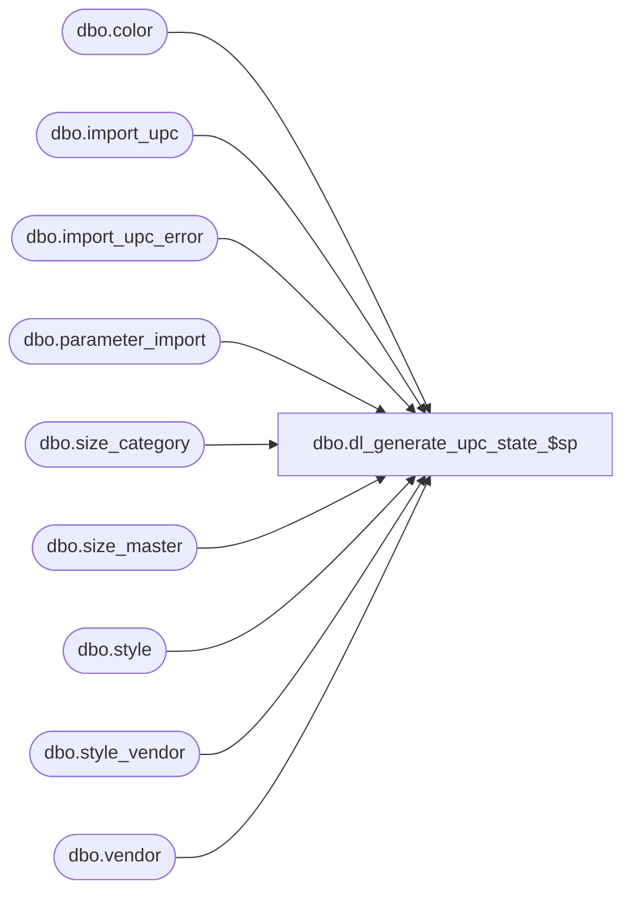

# dbo.dl_generate_upc_state_$sp

**Database:** me_01  
**Server:** bedrockdb02  

## Architecture Diagram



## Table Dependencies

| Referenced Table |
|---|
| dbo.color |
| dbo.import_upc |
| dbo.import_upc_error |
| dbo.parameter_import |
| dbo.size_category |
| dbo.size_master |
| dbo.style |
| dbo.style_vendor |
| dbo.vendor |

## Stored Procedure Code

```sql
CREATE PROCEDURE [dbo].[dl_generate_upc_state_$sp]
	(@isExistFileError BIT, 
	 @isExistTableError BIT,
	 @isImportFileExists BIT)
AS

/*
	Version		: 1.00 c
	Created		: 2011/11/18
	Created by	: Pierrette Lemay
	History		: 
*/

BEGIN
	DECLARE @error_flag BIT, @error_msg NVARCHAR(250), @line_id SMALLINT,@is_upc_exist BIT, @is_import_upc_exist BIT, @is_import_upc_error BIT, 
			@is_missing_requisite BIT, @missing_data_table NVARCHAR(250), @is_process_ran BIT, @import_folder NVARCHAR(500),
			@first_action NVARCHAR(500), @second_action NVARCHAR(500), @parameters_count TINYINT, @state_cause NVARCHAR(250),
			@report_path NVARCHAR(250);
	
	IF NOT object_id(N'tempdb..#temp_upc_state') IS NULL
		DROP TABLE #temp_upc_state;
		
	CREATE TABLE #temp_upc_state
		(upc_state TINYINT NOT NULL,
		state_cause NVARCHAR(250) NULL,
		acrion_msg NVARCHAR(1000) NULL);
		
	BEGIN TRY
		SELECT @is_missing_requisite = 0, 
			@is_upc_exist = 0,
			@is_import_upc_exist = 0,
			@is_import_upc_error = 0,
			@missing_data_table = N'',
			@parameters_count = 0,
			@is_process_ran = CASE WHEN (@isExistFileError = 0 AND @isExistTableError = 0) THEN 0
									ELSE 1
							  END,
			@report_path = parameter_import_value
		FROM parameter_import
		WHERE parameter_import_name = N'ReportPath';
		
		SELECT @import_folder = parameter_import_value FROM parameter_import WHERE parameter_import_name = N'ImportPath';
		
		-- Step #1: verify pre-requisites
		IF NOT EXISTS(SELECT 1 FROM style)
			SELECT @is_missing_requisite = 1, @missing_data_table = N'style, ';
			
		IF NOT EXISTS(SELECT 1 FROM vendor)
			SELECT @is_missing_requisite = 1, @missing_data_table = @missing_data_table + N'vendor, ';
			
		IF NOT EXISTS(SELECT 1 FROM style_vendor)
			SELECT @is_missing_requisite = 1, @missing_data_table = @missing_data_table + N'style_vendor, ';
		
		IF NOT EXISTS(SELECT 1 FROM color)
			SELECT @is_missing_requisite = 1, @missing_data_table = @missing_data_table + N'color, ';
			
		IF NOT EXISTS(SELECT 1 FROM size_master)
			SELECT @is_missing_requisite = 1, @missing_data_table = @missing_data_table + N'size_master, ';
			
		IF NOT EXISTS(SELECT 1 FROM size_category)
			SELECT @is_missing_requisite = 1, @missing_data_table = @missing_data_table + N'size_category, ';
			
		SELECT @parameters_count = COUNT(*) FROM parameter_import WHERE parameter_called_from = N'Data Load UPC' AND LEN(parameter_import_value) > 0;
		IF (@parameters_count < 8)
		BEGIN
			IF (@is_missing_requisite = 1)
				INSERT INTO #temp_upc_state (upc_state, state_cause, acrion_msg)
				VALUES (1, N'The following tables have not been populated: ' + SUBSTRING(@missing_data_table, 1, LEN(@missing_data_table) - 1) + N' and there are missing import parameters.', 
					N'The next action should be to populate the following tables: ' + SUBSTRING(@missing_data_table, 1, LEN(@missing_data_table) - 1) + N' and verify the parameters used by this process.');
			ELSE
				INSERT INTO #temp_upc_state (upc_state, state_cause, acrion_msg)
				VALUES (1, N'Some parameters used by the Data Load UPCs process are missing.', 
					N'The next action should be to verify the import parameters.');
			
		END
		ELSE IF (@is_missing_requisite = 1)
			INSERT INTO #temp_upc_state (upc_state, state_cause, acrion_msg)
			VALUES (1, N'The following tables have not been populated: ' + SUBSTRING(@missing_data_table, 1, LEN(@missing_data_table) - 1), 
					N'The next action should be to populate the following tables: ' + SUBSTRING(@missing_data_table, 1, LEN(@missing_data_table) - 1));
		ELSE
		BEGIN			
			-- Step #2: verify if the process ran previously
			IF EXISTS(SELECT 1 FROM import_upc_error)
				SELECT @is_import_upc_error = 1, @is_process_ran = 1;
		
			IF (@is_process_ran = 0)
			BEGIN
				-- When data load UPC didn't ran previously then the next action could be either:
					-- Validate Import file OR 
					-- if .GO exists in the import folder then run Data Load UPC OR 
					-- if there is no .GO file in the import folder then move import file(s) to the following import_folder
					-- if there is data in import_upc then run Data Load UPC
					-- if there is no data in import_upc then populate import_upc table
				IF (@isImportFileExists = 0 AND @is_import_upc_error = 0)				
					INSERT INTO #temp_upc_state (upc_state, state_cause, acrion_msg)
					VALUES (2, N'There is currently no .GO file in the import directory and no error to reprocess.', 
						N'The next action should be either to Validate import file(s) OR to move import file(s) to the import directory: ' + @import_folder +
						N' OR to run the external process that populates the import table directly.');
				ELSE IF (@isImportFileExists = 1 AND @is_import_upc_error = 0)				
					INSERT INTO #temp_upc_state (upc_state, state_cause, acrion_msg)
					VALUES (2, N'There is currently .GO file(s) in the import directory.', 
						N'The next action should be either to Validate import file(s) OR to Run Data Load UPC in oder to process the .GO file(s) waiting to be processed from the import directory' +
						N' OR to run the external process that populates the import table directly before starting the process.');
			END
			ELSE
			BEGIN
				-- When Data Load UPC has run before then the next action could be either:
					-- if there is error to correct in folder then correct errors in the following folder(s): 
					-- OR if .GO exists in the import folder then run Data Load UPC OR 
					-- OR if there is no .GO file in the import folder then system could process new import file(s).
					-- if there is error to correct in folder then correct errors in the following folder:
					-- OR if there is data in import_upc then Run Data Load UPC in order to import the content of table import_upc
					-- OR if there is no data in import_upc then run the external process that populate table import_upc in order to import more UPC.
					
				IF (@isExistFileError = 1 AND @isExistTableError = 1)
					SET @first_action = N'There are errors that required corrections in the following directories: ' + @import_folder + N'\ResultImportFile and ' +
										@report_path + N'; please correct these error files, rename them .GO and move them to the Import directory: ' + @import_folder + N'.';
				ELSE IF (@isExistFileError = 1 AND @isExistTableError = 0)
					SET @first_action = N'There are errors that required corrections in the following directories: ' + @import_folder + 
										N'\ResultImportFile; please correct these error files, rename them .GO and move them to the Import directory: ' + @import_folder + N'.';
				ELSE IF (@isExistFileError = 0 AND @isExistTableError = 1)
					SET @first_action = N'There are errors that required corrections in the following directories: ' + @report_path + 
										N'; please correct these error files, rename them .GO and move them to the Import directory: ' + @import_folder + N'.';
				ELSE
					SET @first_action = N'';
					
				IF EXISTS(SELECT 1 FROM import_upc)
					SET @is_import_upc_exist = 1;
					
				IF (@isImportFileExists = 1 AND @is_import_upc_exist = 0)
					SET @second_action = N' action could be to Run Data Load UPC in order to process the new import files.'; 	
				ELSE IF (@isImportFileExists = 0 AND @is_import_upc_exist = 0)
					SET @second_action = N' action could be to move new import files to the import directory and Run Data Load UPC for these new import files.'; 
				ELSE IF (@isImportFileExists = 1 AND @is_import_upc_exist = 1)
					SET @second_action = N' action could be to Run Data Load UPC in order to process the new import files and the actual data currently in the import table.'; 
				ELSE IF (@isImportFileExists = 0 AND @is_import_upc_exist = 1)
					SET @second_action = N' action could be to run Data Load UPC in order to process the actual data from the import_upc table OR to move new import files to the import directory in order to process this new data at the same time.'; 

				INSERT INTO #temp_upc_state (upc_state, state_cause, acrion_msg)
					VALUES (3, 
						CASE WHEN @first_action = N'' THEN N'There is no error waiting to be reprocess, system is ready to import new UPCs.'
							ELSE N'  There are errors waiting to be corrected but system is also ready to import new UPCs.'
						END, 
						CASE WHEN @first_action = N'' THEN N'The' + @second_action
							ELSE @first_action + N'  Another' + @second_action
						END)
					
			END
		END;
		SELECT * FROM #temp_upc_state;
	END TRY
	BEGIN CATCH
		SET @error_msg = N'dl_generate_upc_state_$sp: ' + CAST(ERROR_NUMBER() AS NVARCHAR) + N' ' + ERROR_MESSAGE()
		RAISERROR (@error_msg, 16, 1)
	END CATCH
END
```

