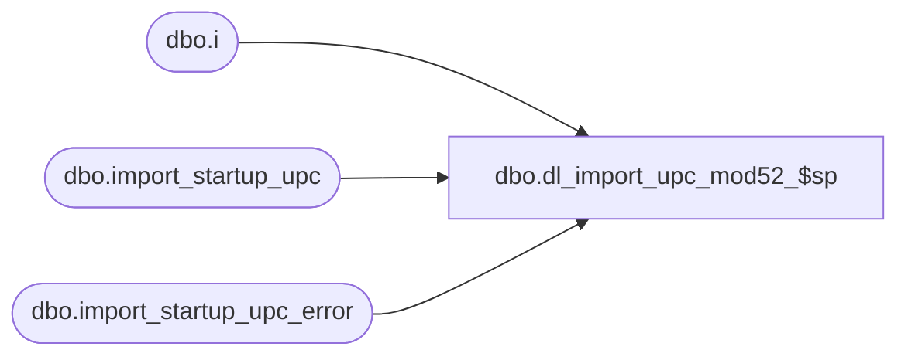

# dbo.dl_import_upc_mod52_$sp

**Database:** me_01  
**Server:** bedrockdb02  

## Architecture Diagram



## Table Dependencies

| Referenced Table |
|---|
| dbo.i |
| dbo.import_startup_upc |
| dbo.import_startup_upc_error |

## Stored Procedure Code

```sql
CREATE PROCEDURE [dbo].[dl_import_upc_mod52_$sp]
	(@min_import_startup_upc_id DECIMAL(12, 0), 
	 @max_import_startup_upc_id DECIMAL(12,0))
AS

/*
	Version		: 1.00 c
	Created		: 2011/11/11
	Created by	: Pierrette Lemay
	History		: Format the upc_number values provided in the import file with 12 digits when the upc_type is Vendor UPC or Vendor Pack UPC.
				  Receive a 6 to 10 digits format for In House UPCs and should build a build a valid 12 digit UPC number.
	History		: 1.01 New segment created (17001) and a new import table is created: import_startup_upc.
*/

BEGIN
	DECLARE @error_flag BIT, @error_msg NVARCHAR(250), @c_vendor_upc_type NCHAR(1), @c_inhouse_upc_type NCHAR(1), @c_pack_upc_type NCHAR(1);
	
	SELECT @c_vendor_upc_type = N'V', 
		@c_inhouse_upc_type = N'I', 
		@c_pack_upc_type = N'P';
	
	IF NOT object_id(N'tempdb..#temp_check_digit') IS NULL
		DROP TABLE #temp_check_digit;
		
	CREATE TABLE #temp_check_digit
		(import_startup_upc_id DECIMAL(12,0) NOT NULL,
		upc_type NCHAR(1) NOT NULL, 
		original_upc_number NVARCHAR(14) NOT NULL,
		new_upc_number NVARCHAR(14) NOT NULL,
		check_digit TINYINT NULL,
		total_step_1 SMALLINT NULL,
		total_step_2 SMALLINT NULL,
		total_step_3 SMALLINT NULL,
		total_step_4 SMALLINT NULL,
		total_step_5 SMALLINT NULL);
			
	BEGIN TRY
		-- if the import file contains InHouse UPCs larger than 10 digits then it's invalid
		INSERT INTO import_startup_upc_error
			(import_startup_upc_id, upc_number, error_id, row_text)
		SELECT i.import_startup_upc_id, i.upc_number, 21 as error_id, 
			(i.entity_type + NCHAR(9) + i.action_type + NCHAR(9) + ISNULL(i.vendor_code,N'') + NCHAR(9) + ISNULL(i.vendor_style,N'') + NCHAR(9) + ISNULL(i.color_code,N'') + NCHAR(9) + 
			ISNULL(i.color_short_description,N'') + NCHAR(9) + ISNULL(i.color_long_description,N'') + NCHAR(9) + ISNULL(i.fashion_flag,N'') + NCHAR(9) + 
			ISNULL(i.color_reorder_flag,N'') + NCHAR(9) + ISNULL(CAST(i.nrf_code AS NVARCHAR(10)),N'') + NCHAR(9) + ISNULL(i.size_category_code,N'') + NCHAR(9) +
			ISNULL(i.style_size_code,N'') + NCHAR(9) + ISNULL(i.ticket_label_override,N'') + NCHAR(9) + ISNULL(i.reorder_flag,N'') + NCHAR(9) + i.upc_number + NCHAR(9) +
			i.upc_type + NCHAR(9) + ISNULL(CONVERT(NVARCHAR(10), i.activation_date, 101),N'') + NCHAR(9) + ISNULL(i.pack_code,N'') + NCHAR(9) + 
			ISNULL(CAST(i.first_part_inhouse AS NVARCHAR(3)),N'') + NCHAR(9) + ISNULL(i.style_code,N'')) AS row_text
		FROM import_startup_upc i
		WHERE i.import_startup_upc_id BETWEEN @min_import_startup_upc_id AND @max_import_startup_upc_id
		AND i.upc_type = @c_inhouse_upc_type
		AND len(i.upc_number) > 10
		AND len(i.upc_number) < 6
		AND NOT EXISTS (SELECT 1 FROM import_startup_upc_error e 
						WHERE e.import_startup_upc_id = i.import_startup_upc_id);

		-- if the import file contains Vendor or Vendor Packs UPCs larger than 12 digits then it's invalid
		INSERT INTO import_startup_upc_error
			(import_startup_upc_id, upc_number, error_id, row_text)
		SELECT i.import_startup_upc_id, i.upc_number, 22 as error_id, 
			(i.entity_type + NCHAR(9) + i.action_type + NCHAR(9) + ISNULL(i.vendor_code,N'') + NCHAR(9) + ISNULL(i.vendor_style,N'') + NCHAR(9) + ISNULL(i.color_code,N'') + NCHAR(9) + 
			ISNULL(i.color_short_description,N'') + NCHAR(9) + ISNULL(i.color_long_description,N'') + NCHAR(9) + ISNULL(i.fashion_flag,N'') + NCHAR(9) + 
			ISNULL(i.color_reorder_flag,N'') + NCHAR(9) + ISNULL(CAST(i.nrf_code AS NVARCHAR(10)),N'') + NCHAR(9) + ISNULL(i.size_category_code,N'') + NCHAR(9) +
			ISNULL(i.style_size_code,N'') + NCHAR(9) + ISNULL(i.ticket_label_override,N'') + NCHAR(9) + ISNULL(i.reorder_flag,N'') + NCHAR(9) + i.upc_number + NCHAR(9) +
			i.upc_type + NCHAR(9) + ISNULL(CONVERT(NVARCHAR(10), i.activation_date, 101),N'') + NCHAR(9) + ISNULL(i.pack_code,N'') + NCHAR(9) + 
			ISNULL(CAST(i.first_part_inhouse AS NVARCHAR(3)),N'') + NCHAR(9) + ISNULL(i.style_code,N'')) AS row_text
		FROM import_startup_upc i
		WHERE i.import_startup_upc_id BETWEEN @min_import_startup_upc_id AND @max_import_startup_upc_id
		AND i.upc_type <> @c_inhouse_upc_type
		AND len(i.upc_number) > 12
		AND NOT EXISTS (SELECT 1 FROM import_startup_upc_error e 
						WHERE e.import_startup_upc_id = i.import_startup_upc_id);
						
		-- build In House UPC with Custom specifications for Life Uniforms: use the 6 digits SKU provided by Life and calculate check digit.
		INSERT INTO #temp_check_digit
			(import_startup_upc_id, upc_type, original_upc_number, new_upc_number)
		SELECT import_startup_upc_id, @c_inhouse_upc_type, upc_number,
			N'4' + RIGHT(REPLICATE(N'0', 6) +  upc_number, 10) AS new_upc_number
		FROM import_startup_upc i
		WHERE i.import_startup_upc_id BETWEEN @min_import_startup_upc_id AND @max_import_startup_upc_id
		AND i.upc_type = @c_inhouse_upc_type
		AND NOT EXISTS (SELECT 1 FROM import_startup_upc_error e 
						WHERE e.import_startup_upc_id = i.import_startup_upc_id);
						
		-- Now find out what will be the check digit for this 12 digits UPC numbers
		UPDATE #temp_check_digit
		SET total_step_1 = CAST(SUBSTRING(new_upc_number, 1, 1) AS TINYINT) + CAST(SUBSTRING(new_upc_number, 3, 1) AS TINYINT) + 
						   CAST(SUBSTRING(new_upc_number, 5, 1) AS TINYINT) + CAST(SUBSTRING(new_upc_number, 7, 1) AS TINYINT) + 
						   CAST(SUBSTRING(new_upc_number, 9, 1) AS TINYINT) + CAST(SUBSTRING(new_upc_number, 11, 1) AS TINYINT),
		    total_step_3 = CAST(SUBSTRING(new_upc_number, 2, 1) AS TINYINT) + CAST(SUBSTRING(new_upc_number, 4, 1)  AS TINYINT)+ 
						   CAST(SUBSTRING(new_upc_number, 6, 1) AS TINYINT) + CAST(SUBSTRING(new_upc_number, 8, 1) AS TINYINT) + 
						   CAST(SUBSTRING(new_upc_number, 10, 1)  AS TINYINT);	
						
		UPDATE #temp_check_digit
		SET total_step_2 = 3 * total_step_1,
			total_step_4 = (3 * total_step_1) + total_step_3,
			total_step_5 = 	CASE WHEN(CAST( ((3 * total_step_1) + total_step_3) AS INT) % 10 = 0) THEN 
									CAST( ((3 * total_step_1) + total_step_3) / 10 AS INT) * 10
								 ELSE ((CAST( ((3 * total_step_1) + total_step_3) / 10 AS INT)) + 1) * 10
							END; 
			
		UPDATE #temp_check_digit
		SET check_digit = total_step_5 - total_step_4,
			new_upc_number = new_upc_number + CAST(total_step_5 - total_step_4 AS NCHAR(1));

		-- Need to update Vendor and Vendor Pack UPCs
		INSERT INTO #temp_check_digit
			(import_startup_upc_id, upc_type, original_upc_number, new_upc_number)
		SELECT import_startup_upc_id, i.upc_type, upc_number,
			RIGHT(REPLICATE(N'0', 12) +  i.upc_number, 12) AS new_upc_number
		FROM import_startup_upc i
		WHERE i.import_startup_upc_id BETWEEN @min_import_startup_upc_id AND @max_import_startup_upc_id
		AND i.upc_type IN (@c_vendor_upc_type, @c_pack_upc_type)
		AND NOT EXISTS (SELECT 1 FROM import_startup_upc_error e 
						WHERE e.import_startup_upc_id = i.import_startup_upc_id);
						
		UPDATE i
		SET i.upc_number = t.new_upc_number
		FROM import_startup_upc i, #temp_check_digit t
		WHERE i.import_startup_upc_id BETWEEN @min_import_startup_upc_id AND @max_import_startup_upc_id
		AND i.upc_type = t.upc_type
		AND i.import_startup_upc_id = t.import_startup_upc_id;
		
		TRUNCATE TABLE #temp_check_digit;

	END TRY
	BEGIN CATCH
		SET @error_msg = N'Error when executing procedure dl_import_upc_mod52_$sp: ' + CAST(ERROR_NUMBER() AS NVARCHAR) + N' ' + ERROR_MESSAGE()
		RAISERROR (@error_msg, 16, 1)
	END CATCH
END;
```

