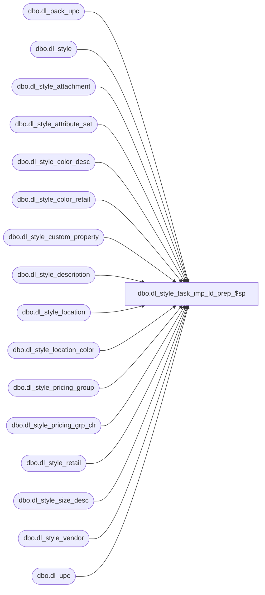

# dbo.dl_style_task_imp_ld_prep_$sp

**Database:** me_01  
**Server:** bedrockdb02  

## Architecture Diagram



## Table Dependencies

| Referenced Table |
|---|
| dbo.dl_pack_upc |
| dbo.dl_style |
| dbo.dl_style_attachment |
| dbo.dl_style_attribute_set |
| dbo.dl_style_color_desc |
| dbo.dl_style_color_retail |
| dbo.dl_style_custom_property |
| dbo.dl_style_description |
| dbo.dl_style_location |
| dbo.dl_style_location_color |
| dbo.dl_style_pricing_group |
| dbo.dl_style_pricing_grp_clr |
| dbo.dl_style_retail |
| dbo.dl_style_size_desc |
| dbo.dl_style_vendor |
| dbo.dl_upc |

## Stored Procedure Code

```sql
create proc [dbo].[dl_style_task_imp_ld_prep_$sp] (
   @max_dl_style_id bigint,
   @max_dl_style_retail_id bigint,
   @max_dl_style_vendor_id bigint,
   @max_dl_style_attr_set_id bigint,
   @max_dl_style_custom_prop_id bigint,
   @max_dl_style_attachment_id bigint,
   @max_dl_style_description_id bigint,
   @max_dl_upc_id bigint,
   @max_dl_pack_upc_id bigint,
   @max_dl_style_color_retail_id bigint,
   @max_dl_style_pricing_grp_id bigint,
   @max_dl_style_prc_grp_clr_id bigint,
   @max_dl_style_location_id bigint,
   @max_dl_style_loc_color_id bigint,
   @max_dl_style_color_desc_id bigint,
   @max_dl_style_size_desc_id bigint
)

AS

BEGIN
   SET XACT_ABORT ON
   SET IMPLICIT_TRANSACTIONS OFF

   IF @max_dl_style_id <> 0
      BEGIN
         TRUNCATE TABLE dl_style
         
         IF EXISTS (SELECT * FROM sysindexes WHERE id = OBJECT_ID(N'dl_style') AND name = N'dl_style_$ndx1')
            BEGIN
               DROP INDEX dl_style.dl_style_$ndx1
            END
            
         IF EXISTS (SELECT * FROM sysindexes WHERE id = OBJECT_ID(N'dl_style') AND name = N'dl_style_$ndx2')
            BEGIN
               DROP INDEX dl_style.dl_style_$ndx2
            END            
            
         IF EXISTS (SELECT * FROM sysindexes WHERE id = OBJECT_ID(N'dl_style') AND name = N'dl_style_$ndx3')
            BEGIN
               DROP INDEX dl_style.dl_style_$ndx3
            END                        
      END
      
   IF @max_dl_style_retail_id <> 0
      BEGIN
         TRUNCATE TABLE dl_style_retail
         
         IF EXISTS (SELECT * FROM sysindexes WHERE id = OBJECT_ID(N'dl_style_retail') AND name = N'dl_style_retail_$ndx1')
            BEGIN
               DROP INDEX dl_style_retail.dl_style_retail_$ndx1
            END
      END
      
   IF @max_dl_style_vendor_id <> 0
      BEGIN
         TRUNCATE TABLE dl_style_vendor
         
         IF EXISTS (SELECT * FROM sysindexes WHERE id = OBJECT_ID(N'dl_style_vendor') AND name = N'dl_style_vendor_$ndx1')
            BEGIN
               DROP INDEX dl_style_vendor.dl_style_vendor_$ndx1
            END
            
         IF EXISTS (SELECT * FROM sysindexes WHERE id = OBJECT_ID(N'dl_style_vendor') AND name = N'dl_style_vendor_$ndx2')
            BEGIN
               DROP INDEX dl_style_vendor.dl_style_vendor_$ndx2
            END            
      END
      
   IF @max_dl_style_attr_set_id <> 0
      BEGIN
         TRUNCATE TABLE dl_style_attribute_set
         
         IF EXISTS (SELECT * FROM sysindexes WHERE id = OBJECT_ID(N'dl_style_attribute_set') AND name = N'dl_style_attribute_set_$ndx1')
            BEGIN
               DROP INDEX dl_style_attribute_set.dl_style_attribute_set_$ndx1
            END
      END
      
   IF @max_dl_style_custom_prop_id <> 0
      BEGIN
         TRUNCATE TABLE dl_style_custom_property
         
         IF EXISTS (SELECT * FROM sysindexes WHERE id = OBJECT_ID(N'dl_style_custom_property') AND name = N'dl_style_custom_property_$ndx1')
            BEGIN
               DROP INDEX dl_style_custom_property.dl_style_custom_property_$ndx1
            END
      END
      
   IF @max_dl_style_attachment_id <> 0
      BEGIN
         TRUNCATE TABLE dl_style_attachment        
      END
      
   IF @max_dl_style_description_id <> 0
      BEGIN
         TRUNCATE TABLE dl_style_description
         
         IF EXISTS (SELECT * FROM sysindexes WHERE id = OBJECT_ID(N'dl_style_description') AND name = N'dl_style_description_$ndx1')
            BEGIN
               DROP INDEX dl_style_description.dl_style_description_$ndx1
            END
      END
      
   IF @max_dl_upc_id <> 0
      BEGIN
         TRUNCATE TABLE dl_upc
         
         IF EXISTS (SELECT * FROM sysindexes WHERE id = OBJECT_ID(N'dl_upc') AND name = N'dl_upc_$ndx1')
            BEGIN
               DROP INDEX dl_upc.dl_upc_$ndx1
            END
            
  IF EXISTS (SELECT * FROM sysindexes WHERE id = OBJECT_ID(N'dl_upc') AND name = N'dl_upc_$ndx2')
            BEGIN
               DROP INDEX dl_upc.dl_upc_$ndx2
            END
            
         IF EXISTS (SELECT * FROM sysindexes WHERE id = OBJECT_ID(N'dl_upc') AND name = N'dl_upc_$ndx3')
            BEGIN
               DROP INDEX dl_upc.dl_upc_$ndx3
            END            
            
         IF EXISTS (SELECT * FROM sysindexes WHERE id = OBJECT_ID(N'dl_upc') AND name = N'dl_upc_$ndx4')
            BEGIN
               DROP INDEX dl_upc.dl_upc_$ndx4
            END                        

         IF EXISTS (SELECT * FROM sysindexes WHERE id = OBJECT_ID(N'dl_upc') AND name = N'dl_upc_$ndx5')
            BEGIN
               DROP INDEX dl_upc.dl_upc_$ndx5
            END

         IF EXISTS (SELECT * FROM sysindexes WHERE id = OBJECT_ID(N'dl_upc') AND name = N'dl_upc_$ndx6')
            BEGIN
               DROP INDEX dl_upc.dl_upc_$ndx6
            END
            
         IF EXISTS (SELECT * FROM sysindexes WHERE id = OBJECT_ID(N'dl_upc') AND name = N'dl_upc_$ndx7')
            BEGIN
               DROP INDEX dl_upc.dl_upc_$ndx7
            END            
      END
      
   IF @max_dl_pack_upc_id <> 0
      BEGIN
         TRUNCATE TABLE dl_pack_upc
         
         IF EXISTS (SELECT * FROM sysindexes WHERE id = OBJECT_ID(N'dl_pack_upc') AND name = N'dl_pack_upc_$ndx1')
            BEGIN
               DROP INDEX dl_pack_upc.dl_pack_upc_$ndx1
            END
      END
      
   IF @max_dl_style_color_retail_id <> 0
      BEGIN
         TRUNCATE TABLE dl_style_color_retail
         
         IF EXISTS (SELECT * FROM sysindexes WHERE id = OBJECT_ID(N'dl_style_color_retail') AND name = N'dl_style_color_retail_$ndx1')
            BEGIN
               DROP INDEX dl_style_color_retail.dl_style_color_retail_$ndx1
            END
      END
      
   IF @max_dl_style_pricing_grp_id <> 0
      BEGIN
         TRUNCATE TABLE dl_style_pricing_group
         
         IF EXISTS (SELECT * FROM sysindexes WHERE id = OBJECT_ID(N'dl_style_pricing_group') AND name = N'dl_style_pricing_group_$ndx1')
            BEGIN
               DROP INDEX dl_style_pricing_group.dl_style_pricing_group_$ndx1
            END
      END
      
   IF @max_dl_style_prc_grp_clr_id <> 0
      BEGIN
         TRUNCATE TABLE dl_style_pricing_grp_clr
         
         IF EXISTS (SELECT * FROM sysindexes WHERE id = OBJECT_ID(N'dl_style_pricing_grp_clr') AND name = N'dl_style_pricing_grp_clr_$ndx1')
            BEGIN
               DROP INDEX dl_style_pricing_grp_clr.dl_style_pricing_grp_clr_$ndx1
            END
      END
      
   IF @max_dl_style_location_id <> 0
      BEGIN
         TRUNCATE TABLE dl_style_location
         
         IF EXISTS (SELECT * FROM sysindexes WHERE id = OBJECT_ID(N'dl_style_location') AND name = N'dl_style_location_$ndx1')
            BEGIN
               DROP INDEX dl_style_location.dl_style_location_$ndx1
            END
      END
      
   IF @max_dl_style_loc_color_id <> 0
      BEGIN
         TRUNCATE TABLE dl_style_location_color
         
         IF EXISTS (SELECT * FROM sysindexes WHERE id = OBJECT_ID(N'dl_style_location_color') AND name = N'dl_style_location_color_$ndx1')
            BEGIN
               DROP INDEX dl_style_location_color.dl_style_location_color_$ndx1
            END
      END
      
   IF @max_dl_style_color_desc_id <> 0
      BEGIN
         TRUNCATE TABLE dl_style_color_desc
         
         IF EXISTS (SELECT * FROM sysindexes WHERE id = OBJECT_ID(N'dl_style_color_desc') AND name = N'dl_style_color_desc_$ndx1')
            BEGIN
               DROP INDEX dl_style_color_desc.dl_style_color_desc_$ndx1
            END
      END
      
   IF @max_dl_style_size_desc_id <> 0
      BEGIN
         TRUNCATE TABLE dl_style_size_desc
         
         IF EXISTS (SELECT * FROM sysindexes WHERE id = OBJECT_ID(N'dl_style_size_desc') AND name = N'dl_style_size_desc_$ndx1')
            BEGIN
               DROP INDEX dl_style_size_desc.dl_style_size_desc_$ndx1
            END
      END      
END
```

