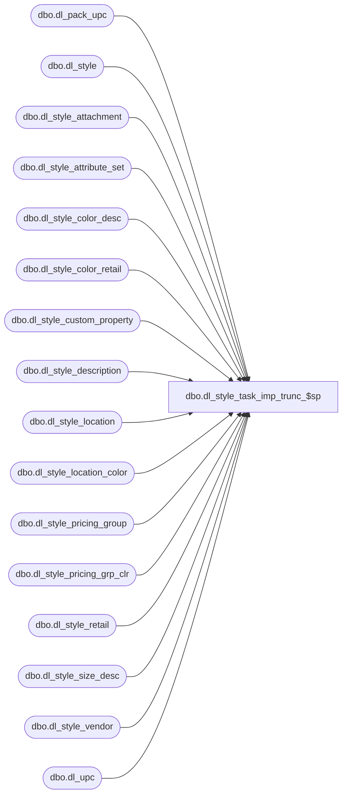

# dbo.dl_style_task_imp_trunc_$sp

**Database:** me_01  
**Server:** bedrockdb02  

## Architecture Diagram



## Table Dependencies

| Referenced Table |
|---|
| dbo.dl_pack_upc |
| dbo.dl_style |
| dbo.dl_style_attachment |
| dbo.dl_style_attribute_set |
| dbo.dl_style_color_desc |
| dbo.dl_style_color_retail |
| dbo.dl_style_custom_property |
| dbo.dl_style_description |
| dbo.dl_style_location |
| dbo.dl_style_location_color |
| dbo.dl_style_pricing_group |
| dbo.dl_style_pricing_grp_clr |
| dbo.dl_style_retail |
| dbo.dl_style_size_desc |
| dbo.dl_style_vendor |
| dbo.dl_upc |

## Stored Procedure Code

```sql
create proc dbo.dl_style_task_imp_trunc_$sp 
AS

BEGIN
   SET XACT_ABORT ON
   SET IMPLICIT_TRANSACTIONS OFF  
   
   TRUNCATE TABLE dl_style
   
   TRUNCATE TABLE dl_style_retail
   
   TRUNCATE TABLE dl_style_vendor
   
   TRUNCATE TABLE dl_style_attribute_set
   
   TRUNCATE TABLE dl_style_custom_property
   
   TRUNCATE TABLE dl_style_attachment
   
   TRUNCATE TABLE dl_style_description
   
   TRUNCATE TABLE dl_upc
   
   TRUNCATE TABLE dl_pack_upc
   
   TRUNCATE TABLE dl_style_color_retail
   
   TRUNCATE TABLE dl_style_pricing_group
   
   TRUNCATE TABLE dl_style_pricing_grp_clr
   
   TRUNCATE TABLE dl_style_location
   
   TRUNCATE TABLE dl_style_location_color
   
   TRUNCATE TABLE dl_style_color_desc
   
   TRUNCATE TABLE dl_style_size_desc
END
```

