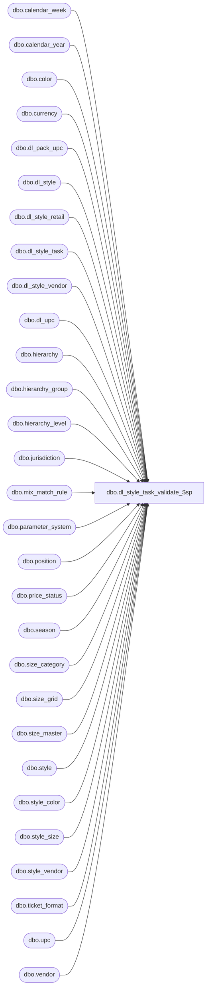

# dbo.dl_style_task_validate_$sp

**Database:** me_01  
**Server:** bedrockdb02  

## Architecture Diagram



## Table Dependencies

| Referenced Table |
|---|
| dbo.calendar_week |
| dbo.calendar_year |
| dbo.color |
| dbo.currency |
| dbo.dl_pack_upc |
| dbo.dl_style |
| dbo.dl_style_retail |
| dbo.dl_style_task |
| dbo.dl_style_vendor |
| dbo.dl_upc |
| dbo.hierarchy |
| dbo.hierarchy_group |
| dbo.hierarchy_level |
| dbo.jurisdiction |
| dbo.mix_match_rule |
| dbo.parameter_system |
| dbo.position |
| dbo.price_status |
| dbo.season |
| dbo.size_category |
| dbo.size_grid |
| dbo.size_master |
| dbo.style |
| dbo.style_color |
| dbo.style_size |
| dbo.style_vendor |
| dbo.ticket_format |
| dbo.upc |
| dbo.vendor |

## Stored Procedure Code

```sql
create proc [dbo].[dl_style_task_validate_$sp] (
   @dl_style_task_id bigint,
   @tot_dl_style_br_rej bigint OUTPUT,
   @tot_dl_style_retail_br_rej bigint OUTPUT,
   @tot_dl_style_vendor_br_rej bigint OUTPUT,
   @tot_dl_style_attr_set_br_rej bigint OUTPUT,
   @tot_dl_style_cust_prp_br_rej bigint OUTPUT,
   @tot_dl_style_attach_br_rej bigint OUTPUT,
   @tot_dl_style_desc_br_rej bigint OUTPUT,
   @tot_dl_upc_br_rej bigint OUTPUT,
   @tot_dl_pack_upc_br_rej bigint OUTPUT,
   @tot_dl_style_clr_ret_br_rej bigint OUTPUT,
   @tot_dl_style_prc_grp_br_rej bigint OUTPUT,
   @tot_dl_st_prc_grp_clr_br_rej bigint OUTPUT,
   @tot_dl_style_location_br_rej bigint OUTPUT,
   @tot_dl_style_loc_clr_br_rej bigint OUTPUT,
   @tot_dl_style_clr_desc_br_rej bigint OUTPUT,
   @tot_dl_style_sz_desc_br_rej bigint OUTPUT
)

AS

DECLARE
   
   @failure int,
   @max_rejects bigint,
   @max_rows_per_batch int,  
   @pct_rows_per_batch float,
   @total_schema_rejects bigint,
   @max_dl_style_id bigint,
   @max_dl_style_retail_id bigint,
   @max_dl_style_vendor_id bigint,
   @max_dl_style_attr_set_id bigint,
   @max_dl_style_custom_prop_id bigint,
   @max_dl_style_attachment_id bigint,
   @max_dl_style_description_id bigint,
   @max_dl_upc_id bigint,
   @max_dl_pack_upc_id bigint,
   @max_dl_style_color_retail_id bigint,
   @max_dl_style_pricing_grp_id bigint,
   @max_dl_style_prc_grp_clr_id bigint,
   @max_dl_style_location_id bigint,
   @max_dl_style_loc_color_id bigint,
   @max_dl_style_color_desc_id bigint,
   @max_dl_style_size_desc_id bigint,  
   @last_vld_dl_style_id bigint,
   @last_vld_dl_style_retail_id bigint,
   @last_vld_dl_style_vendor_id bigint,
   @last_vld_dl_style_att_set_id bigint,
   @last_vld_dl_style_cst_prp_id bigint,
   @last_vld_dl_style_attach_id bigint,
   @last_vld_dl_style_desc_id bigint,
   @last_vld_dl_upc_id bigint,
   @last_vld_dl_pack_upc_id bigint, 
   @last_vld_dl_style_clr_ret_id bigint,
   @last_vld_dl_style_prc_grp_id bigint,
   @last_vld_dl_st_pr_grp_clr_id bigint,
   @last_vld_dl_style_loc_id bigint,
   @last_vld_dl_style_loc_clr_id bigint,
   @last_vld_dl_stl_clr_desc_id bigint,
   @last_vld_dl_style_sz_desc_id bigint,
   @auto_assign_style_flag bit,
   @style_mask_min_length tinyint,
   @style_mask_max_length tinyint,
   @size_grid_link_style_req_flg bit,
   @vndr_code_in_style_mask_flag bit,      
   @installed_replen_flag bit,
   @upc_first_part_len tinyint,
   @main_merch_hierarchy_id smallint,
   @main_merch_btm_hier_level_id int,
   @home_jurisdiction_code nvarchar(20),
   @batch_size bigint,
   @from_id bigint,
   @to_id bigint

BEGIN
   SET XACT_ABORT ON
   SET IMPLICIT_TRANSACTIONS OFF

   SET @failure = 0
   
   SELECT @max_rejects = max_rejects,
      @max_rows_per_batch = max_rows_per_batch,  
      @pct_rows_per_batch = pct_rows_per_batch,
      @total_schema_rejects = total_schema_rejects,
      @max_dl_style_id = max_dl_style_id,
      @max_dl_style_retail_id = max_dl_style_retail_id,
      @max_dl_style_vendor_id = max_dl_style_vendor_id,
      @max_dl_style_attr_set_id = max_dl_style_attribute_set_id,
      @max_dl_style_custom_prop_id = max_dl_style_custom_prop_id,
      @max_dl_style_attachment_id = max_dl_style_attachment_id,
      @max_dl_style_description_id = max_dl_style_description_id,
      @max_dl_upc_id = max_dl_upc_id,
      @max_dl_pack_upc_id = max_dl_pack_upc_id,
      @max_dl_style_color_retail_id = max_dl_style_color_retail_id,
      @max_dl_style_pricing_grp_id = max_dl_style_pricing_group_id,
      @max_dl_style_prc_grp_clr_id = max_dl_style_prc_grp_color_id,
      @max_dl_style_location_id = max_dl_style_location_id,
      @max_dl_style_loc_color_id = max_dl_style_location_color_id,
      @max_dl_style_color_desc_id = max_dl_style_color_desc_id,
      @max_dl_style_size_desc_id = max_dl_style_size_desc_id,
      @tot_dl_style_br_rej = tot_dl_style_br_rej,
      @tot_dl_style_retail_br_rej = tot_dl_style_retail_br_rej,
      @tot_dl_style_vendor_br_rej = tot_dl_style_vendor_br_rej,
      @tot_dl_style_attr_set_br_rej = tot_dl_style_attr_set_br_rej,
      @tot_dl_style_cust_prp_br_rej = tot_dl_style_cust_prop_br_rej,
      @tot_dl_style_attach_br_rej = tot_dl_style_attach_br_rej,
      @tot_dl_style_desc_br_rej = tot_dl_style_desc_br_rej,
      @tot_dl_upc_br_rej = tot_dl_upc_br_rej,
      @tot_dl_pack_upc_br_rej = tot_dl_pack_upc_br_rej,
      @tot_dl_style_clr_ret_br_rej = tot_dl_style_color_ret_br_rej,
      @tot_dl_style_prc_grp_br_rej = tot_dl_style_prc_grp_br_rej,
      @tot_dl_st_prc_grp_clr_br_rej = tot_dl_stl_prc_grp_clr_br_rej,
      @tot_dl_style_location_br_rej = tot_dl_style_location_br_rej,
      @tot_dl_style_loc_clr_br_rej = tot_dl_style_loc_color_br_rej,
      @tot_dl_style_clr_desc_br_rej = tot_dl_style_color_desc_br_rej,
      @tot_dl_style_sz_desc_br_rej = tot_dl_style_size_desc_br_rej,
      @last_vld_dl_style_id = last_vld_dl_style_id,
      @last_vld_dl_style_retail_id = last_vld_dl_style_retail_id,
      @last_vld_dl_style_vendor_id = last_vld_dl_style_vendor_id,
      @last_vld_dl_style_att_set_id = last_vld_dl_style_attr_set_id,
      @last_vld_dl_style_cst_prp_id = last_vld_dl_style_cust_prop_id,
      @last_vld_dl_style_attach_id = last_vld_dl_style_attach_id,
      @last_vld_dl_style_desc_id = last_vld_dl_style_desc_id,
      @last_vld_dl_upc_id = last_vld_dl_upc_id,
      @last_vld_dl_pack_upc_id = last_vld_dl_pack_upc_id,   
      @last_vld_dl_style_clr_ret_id = last_vld_dl_style_color_ret_id,
      @last_vld_dl_style_prc_grp_id = last_vld_dl_style_prc_grp_id,
      @last_vld_dl_st_pr_grp_clr_id = last_vld_dl_stl_prc_grp_clr_id,
      @last_vld_dl_style_loc_id = last_vld_dl_style_location_id,
      @last_vld_dl_style_loc_clr_id = last_vld_dl_style_loc_clr_id,
      @last_vld_dl_stl_clr_desc_id = last_vld_dl_style_clr_desc_id,
      @last_vld_dl_style_sz_desc_id = last_vld_dl_style_size_desc_id    
   FROM dl_style_task 
   WHERE dl_style_task_id = @dl_style_task_id
   
   SELECT @auto_assign_style_flag = auto_assign_style_flag,
      @style_mask_min_length = style_mask_min_length,
      @style_mask_max_length = style_mask_max_length,
      @size_grid_link_style_req_flg = size_grid_link_style_req_flag,      
      @vndr_code_in_style_mask_flag = (CASE WHEN ISNULL(style_mask_source1, N'Z') = N'V' OR 
         ISNULL(style_mask_source2, N'Z') = N'V' OR 
         ISNULL(style_mask_source3, N'Z') = N'V' OR 
         ISNULL(style_mask_source4, N'Z') = N'V' OR       
         ISNULL(style_mask_source5, N'Z') = N'V' THEN 1 ELSE 0 END),
      @installed_replen_flag = installed_replen_flag,
      @upc_first_part_len = 1 + 
         ISNULL(upc_inh_mask_end_position1, 0) - ISNULL(upc_inh_mask_start_position1, 0) + (CASE WHEN upc_inh_mask_end_position1 IS NULL THEN 0 ELSE 1 END) +
         ISNULL(upc_inh_mask_end_position2, 0) - ISNULL(upc_inh_mask_start_position2, 0) + (CASE WHEN upc_inh_mask_end_position2 IS NULL THEN 0 ELSE 1 END) +
         ISNULL(upc_inh_mask_end_position3, 0) - ISNULL(upc_inh_mask_start_position3, 0) + (CASE WHEN upc_inh_mask_end_position3 IS NULL THEN 0 ELSE 1 END) +
         ISNULL(upc_inh_mask_end_position4, 0) - ISNULL(upc_inh_mask_start_position4, 0) + (CASE WHEN upc_inh_mask_end_position4 IS NULL THEN 0 ELSE 1 END) +
         ISNULL(upc_inh_mask_end_position5, 0) - ISNULL(upc_inh_mask_start_position5, 0) + (CASE WHEN upc_inh_mask_end_position5 IS NULL THEN 0 ELSE 1 END)
   FROM parameter_system
   
   SELECT @main_merch_hierarchy_id = hierarchy_id
   FROM hierarchy
   WHERE hierarchy_type = 1
   AND alternate_flag = 0
   
   SELECT @main_merch_btm_hier_level_id = hl.hierarchy_level_id
   FROM hierarchy_level hl
   WHERE hl.hierarchy_id = @main_merch_hierarchy_id
   AND NOT EXISTS 
      (SELECT *
      FROM hierarchy_level h2
      WHERE h2.hierarchy_id = @main_merch_hierarchy_id
      AND h2.parent_level_id = hl.hierarchy_level_id)
      
   SELECT @home_jurisdiction_code = jurisdiction_code
   FROM jurisdiction
   WHERE home_jurisdiction_flag <> 0      
   
   IF @max_dl_style_id <> 0 AND @failure = 0
      BEGIN
         SET @batch_size = @max_dl_style_id * @pct_rows_per_batch
         IF @batch_size > @max_rows_per_batch
            BEGIN
               SET @batch_size = @max_rows_per_batch
            END
         ELSE
            BEGIN
               IF @batch_size < 3750
                  BEGIN
                     SET @batch_size = 3750
                  END
            END

         SET @from_id = @last_vld_dl_style_id + 1

         WHILE @from_id <= @max_dl_style_id AND @failure = 0
            BEGIN
               SET @to_id = @from_id + @batch_size - 1
               IF @to_id > @max_dl_style_id
                  BEGIN
                     SET @to_id = @max_dl_style_id
                  END
                  
               UPDATE dl_style
               SET style_code_not_upper_flag = 1
               WHERE dl_style_id BETWEEN @from_id AND @to_id
               AND style_code IS NOT NULL
               AND style_code <> UPPER(style_code)
               
               UPDATE dl_style
               SET vendor_style_not_upper_flag = 1
               WHERE dl_style_id BETWEEN @from_id AND @to_id
               AND vendor_style IS NOT NULL
               AND vendor_style <> UPPER(vendor_style)
                  
               UPDATE ds1
               SET dup_style_code_flag = 1
               FROM dl_style ds1, dl_style ds2 WITH (NOLOCK)
               WHERE ds1.dl_style_id BETWEEN @from_id AND @to_id
               AND ds1.style_code IS NOT NULL
               AND ds1.style_code = ds2.style_code
               AND ds1.dl_style_id <> ds2.dl_style_id
               
               UPDATE ds1
               SET dup_vndr_code_vndr_style_flag = 1
               FROM dl_style ds1, dl_style ds2 WITH (NOLOCK)
               WHERE ds1.dl_style_id BETWEEN @from_id AND @to_id
               AND ds1.vendor_code IS NOT NULL
               AND ds1.vendor_style IS NOT NULL             
               AND ds1.vendor_code = ds2.vendor_code
               AND ds1.vendor_style = ds2.vendor_style
               AND ds1.dl_style_id <> ds2.dl_style_id

               UPDATE ds
               SET stl_cd_vd_cd_in_dl_stl_vd_flag = 1
               FROM dl_style ds, dl_style_vendor dsv WITH (NOLOCK)
               WHERE ds.dl_style_id BETWEEN @from_id AND @to_id
               AND ds.style_code IS NOT NULL
               AND ds.vendor_code IS NOT NULL               
               AND ds.style_code = dsv.style_code
               AND ds.vendor_code = dsv.vendor_code
               
               UPDATE ds
               SET vd_cd_vd_stl_in_dl_stl_vd_flg = 1
               FROM dl_style ds, dl_style_vendor dsv WITH (NOLOCK)
               WHERE ds.dl_style_id BETWEEN @from_id AND @to_id
               AND ds.vendor_code IS NOT NULL
               AND ds.vendor_style IS NOT NULL              
               AND ds.vendor_code = dsv.vendor_code
               AND ds.vendor_style = dsv.vendor_style

               UPDATE ds
               SET stl_cd_jr_cd_in_dl_stl_ret_flg = 1
               FROM dl_style ds, dl_style_retail dsr WITH (NOLOCK)
               WHERE ds.dl_style_id BETWEEN @from_id AND @to_id
               AND ds.style_code IS NOT NULL
               AND ds.style_code = dsr.style_code
               AND dsr.jurisdiction_code = @home_jurisdiction_code

               UPDATE ds
               SET style_cd_on_file_flag = 1
               FROM dl_style ds, style st WITH (NOLOCK)
               WHERE ds.dl_style_id BETWEEN @from_id AND @to_id
               AND ds.style_code IS NOT NULL
               AND ds.style_code = st.style_code

               UPDATE ds
               SET vndr_cd_vndr_style_on_file_flg = 1
               FROM dl_style ds, vendor v WITH (NOLOCK), style_vendor sv WITH (NOLOCK)
               WHERE ds.dl_style_id BETWEEN @from_id AND @to_id
               AND ds.vendor_code IS NOT NULL
               AND ds.vendor_style IS NOT NULL
               AND ds.vendor_code = v.vendor_code
               AND v.vendor_id = sv.vendor_id
               AND ds.vendor_style = sv.vendor_style

               IF @auto_assign_style_flag = 0
                  BEGIN
                     UPDATE dl_style
                     SET style_code_missing_flag = 1
                     WHERE dl_style_id BETWEEN @from_id AND @to_id
                     AND style_code IS NULL
                     
                     UPDATE dl_style
                     SET style_code_length_invalid_flag = 1
                     WHERE dl_style_id BETWEEN @from_id AND @to_id
                     AND style_code IS NOT NULL                   
                     AND LEN(style_code) NOT BETWEEN @style_mask_min_length AND @style_mask_max_length                     
                  END

               UPDATE ds
               SET merch_group_cd_fk_invalid_flag = 0
               FROM dl_style ds, hierarchy_group hg WITH (NOLOCK)
               WHERE ds.dl_style_id BETWEEN @from_id AND @to_id
               AND ds.hierarchy_group_code = hg.hierarchy_group_code
               AND hg.hierarchy_id = @main_merch_hierarchy_id
               AND hg.hierarchy_level_id = @main_merch_btm_hier_level_id
               AND hg.active_flag <> 0
               
               UPDATE dl_style
               SET long_desc_missing_flag = 1
               WHERE dl_style_id BETWEEN @from_id AND @to_id
               AND long_desc IS NULL               
               AND style_status >= 3
               
               UPDATE ds
               SET season_code_fk_invalid_flag = 0
               FROM dl_style ds, season s WITH (NOLOCK)
               WHERE ds.dl_style_id BETWEEN @from_id AND @to_id
               AND ds.season_code = s.season_code
               AND s.active_flag <> 0
               
               UPDATE ds
               SET calendar_yr_code_missing_flag = 1
               FROM dl_style ds, season s WITH (NOLOCK)
               WHERE ds.dl_style_id BETWEEN @from_id AND @to_id
               AND ds.calendar_year_code IS NULL
               AND ds.season_code = s.season_code
               AND s.year_required_flag <> 0             
               
               UPDATE dl_style
               SET calendar_yr_cd_fk_invalid_flag = 0
               WHERE dl_style_id BETWEEN @from_id AND @to_id
               AND calendar_year_code IS NULL               

               UPDATE ds
               SET calendar_yr_cd_fk_invalid_flag = 0
               FROM dl_style ds, calendar_year cy WITH (NOLOCK)
               WHERE ds.dl_style_id BETWEEN @from_id AND @to_id
               AND ds.calendar_year_code IS NOT NULL
               AND ds.calendar_year_code = cy.calendar_year_code
               AND cy.active_flag <> 0

               UPDATE dl_style
               SET ticket_fmt_cd_fk_invalid_flag = 0
               WHERE dl_style_id BETWEEN @from_id AND @to_id
               AND ticket_format_code IS NULL               

               UPDATE ds
               SET ticket_fmt_cd_fk_invalid_flag = 0
               FROM dl_style ds, ticket_format tf WITH (NOLOCK)
               WHERE ds.dl_style_id BETWEEN @from_id AND @to_id
               AND ds.ticket_format_code IS NOT NULL
               AND ds.ticket_format_code = tf.ticket_format_code
               AND tf.active_flag <> 0
               
               UPDATE ds
               SET position_code_fk_invalid_flag = 0
               FROM dl_style ds, position p WITH (NOLOCK)
               WHERE ds.dl_style_id BETWEEN @from_id AND @to_id
               AND ds.position_code = p.position_code
               AND p.active_flag <> 0              

               UPDATE dl_style
               SET order_distro_mult_incompat_flg = 1
               WHERE dl_style_id BETWEEN @from_id AND @to_id
               AND order_multiple IS NOT NULL 
               AND order_multiple <> 1 
               AND distribution_multiple IS NOT NULL 
               AND distribution_multiple <> 1 
               AND order_multiple % distribution_multiple <> 0
               AND distribution_multiple % order_multiple <> 0

               UPDATE dl_style
               SET target_from_wk_missing_flag = 1
               WHERE dl_style_id BETWEEN @from_id AND @to_id
               AND target_selling_from_week IS NULL 
               AND (target_selling_from_year IS NOT NULL OR 
                  target_selling_to_week IS NOT NULL OR 
                  target_selling_to_year IS NOT NULL)
                  
               UPDATE dl_style
               SET target_from_yr_missing_flag = 1
               WHERE dl_style_id BETWEEN @from_id AND @to_id
               AND target_selling_from_year IS NULL 
               AND (target_selling_from_week IS NOT NULL OR 
                  target_selling_to_week IS NOT NULL OR 
                  target_selling_to_year IS NOT NULL)
                  
               UPDATE dl_style
               SET target_from_yr_fk_invalid_flag = 0
               WHERE dl_style_id BETWEEN @from_id AND @to_id
               AND target_selling_from_year IS NULL
               
               UPDATE ds
               SET target_from_yr_fk_invalid_flag = 0
               FROM dl_style ds, calendar_year cy WITH (NOLOCK)
               WHERE ds.dl_style_id BETWEEN @from_id AND @to_id
               AND ds.target_selling_from_year IS NOT NULL
               AND ds.target_selling_from_year = cy.calendar_year_code
               AND cy.active_flag <> 0
                  
               UPDATE dl_style
               SET target_from_wk_fk_invalid_flag = 0
               WHERE dl_style_id BETWEEN @from_id AND @to_id
               AND (target_selling_from_week IS NULL OR 
                  target_selling_from_year IS NULL OR 
                  target_from_yr_fk_invalid_flag <> 0)
                  
               UPDATE ds
               SET target_from_wk_fk_invalid_flag = 0
               FROM dl_style ds, calendar_year cy WITH (NOLOCK), calendar_week cw WITH (NOLOCK)
               WHERE ds.dl_style_id BETWEEN @from_id AND @to_id
               AND ds.target_selling_from_week IS NOT NULL
               AND ds.target_selling_from_year IS NOT NULL
               AND ds.target_from_yr_fk_invalid_flag = 0
               AND ds.target_selling_from_year = cy.calendar_year_code
               AND cy.calendar_year_id = cw.calendar_year_id
               AND ds.target_selling_from_week = cw.calendar_week_code
                                                                     
               UPDATE dl_style
               SET target_to_wk_missing_flag = 1
               WHERE dl_style_id BETWEEN @from_id AND @to_id
               AND target_selling_to_week IS NULL 
               AND (target_selling_from_week IS NOT NULL OR 
                  target_selling_from_year IS NOT NULL OR 
                  target_selling_to_year IS NOT NULL)
                  
               UPDATE dl_style
               SET target_to_yr_missing_flag = 1
               WHERE dl_style_id BETWEEN @from_id AND @to_id
               AND target_selling_to_year IS NULL 
               AND (target_selling_from_week IS NOT NULL OR 
                  target_selling_from_year IS NOT NULL OR 
                  target_selling_to_week IS NOT NULL)
               
               UPDATE dl_style
               SET target_to_yr_fk_invalid_flag = 0
               WHERE dl_style_id BETWEEN @from_id AND @to_id
               AND target_selling_to_year IS NULL
               
               UPDATE ds
               SET target_to_yr_fk_invalid_flag = 0
               FROM dl_style ds, calendar_year cy WITH (NOLOCK)
               WHERE ds.dl_style_id BETWEEN @from_id AND @to_id
               AND ds.target_selling_to_year IS NOT NULL
               AND ds.target_selling_to_year = cy.calendar_year_code
               AND cy.active_flag <> 0
                  
               UPDATE dl_style
               SET target_to_wk_fk_invalid_flag = 0
               WHERE dl_style_id BETWEEN @from_id AND @to_id
               AND (target_selling_to_week IS NULL OR 
                  target_selling_to_year IS NULL OR 
                  target_to_yr_fk_invalid_flag <> 0)
                  
               UPDATE ds
               SET target_to_wk_fk_invalid_flag = 0
               FROM dl_style ds, calendar_year cy WITH (NOLOCK), calendar_week cw WITH (NOLOCK)
               WHERE ds.dl_style_id BETWEEN @from_id AND @to_id
               AND ds.target_selling_to_week IS NOT NULL
               AND ds.target_selling_to_year IS NOT NULL
               AND ds.target_to_yr_fk_invalid_flag = 0
               AND ds.target_selling_to_year = cy.calendar_year_code
               AND cy.calendar_year_id = cw.calendar_year_id
               AND ds.target_selling_to_week = cw.calendar_week_code             
               
               UPDATE dl_style
               SET target_to_wk_before_frm_wk_flg = 1
               WHERE dl_style_id BETWEEN @from_id AND @to_id
               AND target_selling_from_week IS NOT NULL
               AND target_selling_from_year IS NOT NULL
               AND target_selling_to_week IS NOT NULL
               AND target_selling_to_year IS NOT NULL             
               AND (target_selling_from_year >  target_selling_to_year OR
                  (target_selling_from_year = target_selling_to_year AND target_selling_from_week > target_selling_to_week))

               UPDATE dl_style
               SET original_retail_missing_flag = 1
               WHERE dl_style_id BETWEEN @from_id AND @to_id
               AND original_selling_retail IS NULL
               AND merch_type <> 4

               UPDATE dl_style
               SET original_retail_for_pseudo_flg = 1
               WHERE dl_style_id BETWEEN @from_id AND @to_id
               AND original_selling_retail IS NOT NULL
               AND merch_type = 4
               
               UPDATE dl_style
               SET orig_prc_stat_cd_fk_invld_flg = 0
               WHERE dl_style_id BETWEEN @from_id AND @to_id
               AND (original_price_status_code IS NULL OR 
                  merch_type = 4)
                  
               UPDATE ds
               SET orig_prc_stat_cd_fk_invld_flg = 0
               FROM dl_style ds, price_status ps WITH (NOLOCK)
               WHERE ds.dl_style_id BETWEEN @from_id AND @to_id
               AND ds.original_price_status_code IS NOT NULL
               AND ds.merch_type <> 4
               AND ds.original_price_status_code = ps.price_status_code
               AND ps.active_flag <> 0
               
               UPDATE dl_style
               SET orig_prc_stat_cd_for_psdo_flag = 1
               WHERE dl_style_id BETWEEN @from_id AND @to_id
               AND original_price_status_code IS NOT NULL
               AND merch_type = 4

               UPDATE dl_style
               SET comp_retail_under_original_flg = 1
               WHERE dl_style_id BETWEEN @from_id AND @to_id
               AND compare_at_retail IS NOT NULL
               AND original_selling_retail IS NOT NULL
               AND merch_type <> 4
               AND style_status < 3
               AND compare_at_retail < original_selling_retail
               
               UPDATE dl_style
               SET comp_retail_under_current_flg = 1
               WHERE dl_style_id BETWEEN @from_id AND @to_id
               AND compare_at_retail IS NOT NULL
               AND current_selling_retail IS NOT NULL
               AND merch_type <> 4
   AND style_status >= 3
               AND compare_at_retail < current_selling_retail
               
               UPDATE dl_style
               SET comp_retail_for_pseudo_flag = 1
               WHERE dl_style_id BETWEEN @from_id AND @to_id
               AND compare_at_retail IS NOT NULL
               AND merch_type = 4
               
               IF @size_grid_link_style_req_flg <> 0
                  BEGIN
                     UPDATE dl_style
                     SET size_grid_cd_missing_flag = 1
                     WHERE dl_style_id BETWEEN @from_id AND @to_id
                     AND size_grid_code IS NULL
                     AND merch_type IN (2, 3)
                  END

               UPDATE dl_style
               SET size_grid_cd_fk_invalid_flag = 0
               WHERE dl_style_id BETWEEN @from_id AND @to_id
               AND (size_grid_code IS NULL OR 
                  merch_type IN (0, 1, 4))
                  
               UPDATE ds
               SET size_grid_cd_fk_invalid_flag = 0
               FROM dl_style ds, size_grid sg WITH (NOLOCK)
               WHERE ds.dl_style_id BETWEEN @from_id AND @to_id
               AND ds.size_grid_code IS NOT NULL
               AND ds.merch_type IN (2, 3)
               AND ds.size_grid_code = sg.size_grid_code
               AND sg.active_flag <> 0
               
               UPDATE dl_style
               SET size_grid_cd_for_non_sized_flg = 1
               WHERE dl_style_id BETWEEN @from_id AND @to_id
               AND size_grid_code IS NOT NULL
               AND merch_type IN (0, 1, 4)
               
               UPDATE dl_style
               SET vendor_code_missing_flag = 1
               WHERE dl_style_id BETWEEN @from_id AND @to_id
               AND vendor_code IS NULL 
               AND (merch_type <> 4 OR 
                  @vndr_code_in_style_mask_flag <> 0)
                  
               UPDATE dl_style
               SET vendor_code_fk_invalid_flag = 0
               WHERE dl_style_id BETWEEN @from_id AND @to_id
               AND vendor_code IS NULL
                  
               UPDATE ds
               SET vendor_code_fk_invalid_flag = 0
               FROM dl_style ds, vendor v WITH (NOLOCK)
               WHERE ds.dl_style_id BETWEEN @from_id AND @to_id
               AND ds.vendor_code IS NOT NULL
               AND ds.vendor_code = v.vendor_code
               AND v.active_flag <> 0
               
               UPDATE dl_style
               SET vendor_style_missing_flag = 1
               WHERE dl_style_id BETWEEN @from_id AND @to_id
               AND vendor_style IS NULL 
               AND merch_type <> 4
               
               UPDATE dl_style
               SET vendor_style_for_pseudo_flag = 1
               WHERE dl_style_id BETWEEN @from_id AND @to_id
               AND vendor_style IS NOT NULL 
               AND merch_type = 4
               
               UPDATE dl_style
               SET current_cost_missing_flag = 1
               WHERE dl_style_id BETWEEN @from_id AND @to_id
               AND current_cost IS NULL 
               AND style_status >= 3
               AND last_net_final_po_cost IS NULL 
               AND merch_type <> 4
               
               UPDATE dl_style
               SET current_cost_for_pseudo_flag = 1
               WHERE dl_style_id BETWEEN @from_id AND @to_id
               AND current_cost IS NOT NULL 
               AND merch_type = 4
               
               UPDATE dl_style
               SET curr_cost_curn_cd_fk_invld_flg = 0
               WHERE dl_style_id BETWEEN @from_id AND @to_id
               AND (current_cost_currency_code IS NULL OR
                  merch_type = 4)
                  
               UPDATE ds
               SET curr_cost_curn_cd_fk_invld_flg = 0
               FROM dl_style ds, currency c WITH (NOLOCK)
               WHERE ds.dl_style_id BETWEEN @from_id AND @to_id
               AND ds.current_cost_currency_code IS NOT NULL
               AND ds.merch_type <> 4
               AND ds.current_cost_currency_code = c.currency_code
               AND c.active_flag <> 0
               
               UPDATE dl_style
               SET curr_cost_curn_cd_for_psdo_flg = 1
               WHERE dl_style_id BETWEEN @from_id AND @to_id
               AND current_cost_currency_code IS NOT NULL
               AND merch_type = 4
               
               UPDATE dl_style
               SET mix_match_rl_cd_1_fk_invld_flg = 0
               WHERE dl_style_id BETWEEN @from_id AND @to_id
               AND (mix_match_rule_code_1 IS NULL OR
                  merch_type = 4)
                  
               UPDATE ds
               SET mix_match_rl_cd_1_fk_invld_flg = 0
               FROM dl_style ds, mix_match_rule m WITH (NOLOCK)
               WHERE ds.dl_style_id BETWEEN @from_id AND @to_id
               AND ds.mix_match_rule_code_1 IS NOT NULL
               AND ds.merch_type <> 4
               AND ds.mix_match_rule_code_1 = m.mix_match_rule_code
               AND m.active_flag <> 0
               
               UPDATE dl_style
               SET mix_match_rl_cd_1_for_psdo_flg = 1
               WHERE dl_style_id BETWEEN @from_id AND @to_id
               AND mix_match_rule_code_1 IS NOT NULL
               AND merch_type = 4                              

               UPDATE dl_style
               SET mix_match_rl_cd_2_fk_invld_flg = 0
               WHERE dl_style_id BETWEEN @from_id AND @to_id
               AND (mix_match_rule_code_2 IS NULL OR
                  merch_type = 4)
                  
               UPDATE ds
               SET mix_match_rl_cd_2_fk_invld_flg = 0
               FROM dl_style ds, mix_match_rule m WITH (NOLOCK)
               WHERE ds.dl_style_id BETWEEN @from_id AND @to_id
               AND ds.mix_match_rule_code_2 IS NOT NULL
               AND ds.merch_type <> 4
               AND ds.mix_match_rule_code_2 = m.mix_match_rule_code
               AND m.active_flag <> 0
               
               UPDATE dl_style
               SET mix_match_rl_cd_2_repeat_flag = 1
               WHERE dl_style_id BETWEEN @from_id AND @to_id
               AND mix_match_rule_code_2 IS NOT NULL
               AND mix_match_rule_code_2 = mix_match_rule_code_1
               
               UPDATE dl_style
               SET mix_match_rl_cd_2_for_psdo_flg = 1
               WHERE dl_style_id BETWEEN @from_id AND @to_id
               AND mix_match_rule_code_2 IS NOT NULL
               AND merch_type = 4
                                                      
               UPDATE dl_style
               SET mix_match_rl_cd_3_fk_invld_flg = 0
               WHERE dl_style_id BETWEEN @from_id AND @to_id
               AND (mix_match_rule_code_3 IS NULL OR
                  merch_type = 4)
                  
               UPDATE ds
               SET mix_match_rl_cd_3_fk_invld_flg = 0
               FROM dl_style ds, mix_match_rule m WITH (NOLOCK)
               WHERE ds.dl_style_id BETWEEN @from_id AND @to_id
               AND ds.mix_match_rule_code_3 IS NOT NULL
               AND ds.merch_type <> 4
               AND ds.mix_match_rule_code_3 = m.mix_match_rule_code
               AND m.active_flag <> 0
               
               UPDATE dl_style
               SET mix_match_rl_cd_3_repeat_flag = 1
               WHERE dl_style_id BETWEEN @from_id AND @to_id
               AND mix_match_rule_code_3 IS NOT NULL
               AND (mix_match_rule_code_3 = mix_match_rule_code_2 OR 
                  mix_match_rule_code_3 = mix_match_rule_code_1)                                            
               
               UPDATE dl_style
               SET mix_match_rl_cd_3_for_psdo_flg = 1
               WHERE dl_style_id BETWEEN @from_id AND @to_id
AND mix_match_rule_code_3 IS NOT NULL
               AND merch_type = 4
                                                      
               UPDATE dl_style
               SET mix_match_rl_cd_4_fk_invld_flg = 0
               WHERE dl_style_id BETWEEN @from_id AND @to_id
               AND (mix_match_rule_code_4 IS NULL OR
                  merch_type = 4)
                  
               UPDATE ds
               SET mix_match_rl_cd_4_fk_invld_flg = 0
               FROM dl_style ds, mix_match_rule m WITH (NOLOCK)
               WHERE ds.dl_style_id BETWEEN @from_id AND @to_id
               AND ds.mix_match_rule_code_4 IS NOT NULL
               AND ds.merch_type <> 4
               AND ds.mix_match_rule_code_4 = m.mix_match_rule_code
               AND m.active_flag <> 0

               UPDATE dl_style
               SET mix_match_rl_cd_4_repeat_flag = 1
               WHERE dl_style_id BETWEEN @from_id AND @to_id
               AND mix_match_rule_code_4 IS NOT NULL
               AND (mix_match_rule_code_4 = mix_match_rule_code_3 OR 
                  mix_match_rule_code_4 = mix_match_rule_code_2 OR
                  mix_match_rule_code_4 = mix_match_rule_code_1)                                            
               
               UPDATE dl_style
               SET mix_match_rl_cd_4_for_psdo_flg = 1
               WHERE dl_style_id BETWEEN @from_id AND @to_id
               AND mix_match_rule_code_4 IS NOT NULL
               AND merch_type = 4

               UPDATE dl_style
               SET current_retail_for_pseudo_flag = 1
               WHERE dl_style_id BETWEEN @from_id AND @to_id
               AND current_selling_retail IS NOT NULL
               AND merch_type = 4
               
               UPDATE dl_style
               SET curr_prc_stat_cd_fk_invld_flg = 0
               WHERE dl_style_id BETWEEN @from_id AND @to_id
               AND (current_price_status_code IS NULL OR 
                  merch_type = 4 OR
                  style_status < 3)
                  
               UPDATE ds
               SET curr_prc_stat_cd_fk_invld_flg = 0
               FROM dl_style ds, price_status ps WITH (NOLOCK)
               WHERE ds.dl_style_id BETWEEN @from_id AND @to_id
               AND ds.current_price_status_code IS NOT NULL
               AND ds.merch_type <> 4
               AND ds.style_status >= 3
               AND ds.current_price_status_code = ps.price_status_code
               AND ps.active_flag <> 0
               
               UPDATE dl_style
               SET curr_prc_stat_cd_for_psdo_flag = 1
               WHERE dl_style_id BETWEEN @from_id AND @to_id
               AND current_price_status_code IS NOT NULL
               AND merch_type = 4
               
               UPDATE dl_style
               SET last_receipt_date_missing_flag = 1
               WHERE dl_style_id BETWEEN @from_id AND @to_id
               AND last_receipt_date IS NULL
               AND style_status >= 4
               
               UPDATE dl_style
               SET last_receipt_date_missing_flag = 1
               WHERE dl_style_id BETWEEN @from_id AND @to_id
               AND last_receipt_date IS NULL
               AND style_status >= 4
               
               IF @installed_replen_flag <> 0
                  BEGIN
                     UPDATE dl_style
                     SET result_po_type_missing_flag = 1
                     WHERE dl_style_id BETWEEN @from_id AND @to_id
                     AND resulting_po_predistrib_type IS NULL
                     AND replenishable_flag <> 0                     
                  END
                  
               IF @installed_replen_flag = 0
                  BEGIN                
                     UPDATE dl_style
                     SET result_po_type_when_no_ar_flag = 1
                     WHERE dl_style_id BETWEEN @from_id AND @to_id
                     AND resulting_po_predistrib_type IS NOT NULL                
                  END
                  
               BEGIN TRAN
                              
                  UPDATE dl_style
                  SET valid_flag = 0
                  WHERE dl_style_id BETWEEN @from_id AND @to_id
                  AND valid_flag <> 0
                  AND (style_code_not_upper_flag <> 0 OR
                     vendor_style_not_upper_flag <> 0 OR
                     dup_style_code_flag <> 0 OR
                     dup_vndr_code_vndr_style_flag <> 0 OR
                     stl_cd_vd_cd_in_dl_stl_vd_flag <> 0 OR
                     vd_cd_vd_stl_in_dl_stl_vd_flg <> 0 OR
                     stl_cd_jr_cd_in_dl_stl_ret_flg <> 0 OR
                     style_cd_on_file_flag <> 0 OR
                     vndr_cd_vndr_style_on_file_flg <> 0 OR
                     style_code_missing_flag <> 0 OR
                     style_code_length_invalid_flag <> 0 OR
                     merch_group_cd_fk_invalid_flag <> 0 OR
                     long_desc_missing_flag <> 0 OR
                     season_code_fk_invalid_flag <> 0 OR
                     calendar_yr_code_missing_flag <> 0 OR
                     calendar_yr_cd_fk_invalid_flag <> 0 OR
                     ticket_fmt_cd_fk_invalid_flag <> 0 OR
                     position_code_fk_invalid_flag <> 0 OR
                     order_distro_mult_incompat_flg <> 0 OR
                     target_from_wk_missing_flag <> 0 OR
                     target_from_wk_fk_invalid_flag <> 0 OR
                     target_from_yr_missing_flag <> 0 OR
                     target_from_yr_fk_invalid_flag <> 0 OR
                     target_to_wk_missing_flag <> 0 OR
                     target_to_wk_fk_invalid_flag <> 0 OR
                     target_to_yr_missing_flag <> 0 OR
                     target_to_yr_fk_invalid_flag <> 0 OR
                     target_to_wk_before_frm_wk_flg <> 0 OR
                     original_retail_missing_flag <> 0 OR
                     original_retail_for_pseudo_flg <> 0 OR
                     orig_prc_stat_cd_fk_invld_flg <> 0 OR
                     orig_prc_stat_cd_for_psdo_flag <> 0 OR
                     comp_retail_under_original_flg <> 0 OR
                     comp_retail_under_current_flg <> 0 OR
                     comp_retail_for_pseudo_flag <> 0 OR
                     size_grid_cd_missing_flag <> 0 OR
                     size_grid_cd_fk_invalid_flag <> 0 OR
                     size_grid_cd_for_non_sized_flg <> 0 OR
                     vendor_code_missing_flag <> 0 OR
                     vendor_code_fk_invalid_flag <> 0 OR
                     vendor_style_missing_flag <> 0 OR
                     vendor_style_for_pseudo_flag <> 0 OR
                     current_cost_missing_flag <> 0 OR
                     current_cost_for_pseudo_flag <> 0 OR
                     curr_cost_curn_cd_fk_invld_flg <> 0 OR
                     curr_cost_curn_cd_for_psdo_flg <> 0 OR
                     mix_match_rl_cd_1_fk_invld_flg <> 0 OR
                     mix_match_rl_cd_1_for_psdo_flg <> 0 OR
                     mix_match_rl_cd_2_fk_invld_flg <> 0 OR
                     mix_match_rl_cd_2_repeat_flag <> 0 OR                 
                     mix_match_rl_cd_2_for_psdo_flg <> 0 OR
                     mix_match_rl_cd_3_fk_invld_flg <> 0 OR
                     mix_match_rl_cd_3_repeat_flag <> 0 OR                 
                     mix_match_rl_cd_3_for_psdo_flg <> 0 OR
                     mix_match_rl_cd_4_fk_invld_flg <> 0 OR
                     mix_match_rl_cd_4_repeat_flag <> 0 OR                 
                     mix_match_rl_cd_4_for_psdo_flg <> 0 OR                
                     current_retail_for_pseudo_flag <> 0 OR
                     curr_prc_stat_cd_fk_invld_flg <> 0 OR
                     curr_prc_stat_cd_for_psdo_flag <> 0 OR
                     last_receipt_date_missing_flag <> 0 OR
         result_po_type_missing_flag <> 0 OR
                     result_po_type_when_no_ar_flag <> 0)

                  SET @tot_dl_style_br_rej = @tot_dl_style_br_rej + @@ROWCOUNT
                  SET @last_vld_dl_style_id = @to_id

                  UPDATE dl_style_task
                  SET tot_dl_style_br_rej = @tot_dl_style_br_rej,
                     last_vld_dl_style_id = @last_vld_dl_style_id
                  WHERE dl_style_task_id = @dl_style_task_id
                  
               COMMIT
               
               IF @total_schema_rejects + 
                  @tot_dl_style_br_rej + 
                  @tot_dl_style_retail_br_rej + 
                  @tot_dl_style_vendor_br_rej + 
                  @tot_dl_style_attr_set_br_rej + 
                  @tot_dl_style_cust_prp_br_rej + 
                  @tot_dl_style_attach_br_rej + 
                  @tot_dl_style_desc_br_rej + 
                  @tot_dl_upc_br_rej + 
                  @tot_dl_pack_upc_br_rej + 
                  @tot_dl_style_clr_ret_br_rej + 
                  @tot_dl_style_prc_grp_br_rej + 
                  @tot_dl_st_prc_grp_clr_br_rej + 
                  @tot_dl_style_location_br_rej + 
                  @tot_dl_style_loc_clr_br_rej + 
                  @tot_dl_style_clr_desc_br_rej + 
                  @tot_dl_style_sz_desc_br_rej > @max_rejects
                     BEGIN
                        SET @failure = 1
                     END

               SET @from_id = @last_vld_dl_style_id + 1
            END
      END
      
   IF @max_dl_style_vendor_id <> 0 AND @failure = 0
      BEGIN
         SET @batch_size = @max_dl_style_vendor_id * @pct_rows_per_batch
         IF @batch_size > @max_rows_per_batch
            BEGIN
               SET @batch_size = @max_rows_per_batch
            END
         ELSE
            BEGIN
               IF @batch_size < 3750
                  BEGIN
                     SET @batch_size = 3750
                  END
            END

         SET @from_id = @last_vld_dl_style_vendor_id + 1

         WHILE @from_id <= @max_dl_style_vendor_id AND @failure = 0
            BEGIN
               SET @to_id = @from_id + @batch_size - 1
               IF @to_id > @max_dl_style_vendor_id
                  BEGIN
                     SET @to_id = @max_dl_style_vendor_id
                  END
                  
               UPDATE dv1
               SET dup_style_code_vendor_code_flg = 1
               FROM dl_style_vendor dv1, dl_style_vendor dv2 WITH (NOLOCK)
               WHERE dv1.dl_style_vendor_id BETWEEN @from_id AND @to_id
               AND dv1.style_code = dv2.style_code
               AND dv1.vendor_code = dv2.vendor_code
               AND dv1.dl_style_vendor_id <> dv2.dl_style_vendor_id
               
               UPDATE dv1
               SET dup_vndr_code_vndr_style_flag = 1
               FROM dl_style_vendor dv1, dl_style_vendor dv2 WITH (NOLOCK)
               WHERE dv1.dl_style_vendor_id BETWEEN @from_id AND @to_id
               AND dv1.vendor_style IS NOT NULL               
               AND dv1.vendor_code = dv2.vendor_code
               AND dv1.vendor_style = dv2.vendor_style
               AND dv1.dl_style_vendor_id <> dv2.dl_style_vendor_id
               
               UPDATE dv
               SET stl_cd_vndr_cd_in_dl_stl_flag = 1
               FROM dl_style_vendor dv, dl_style ds WITH (NOLOCK)
               WHERE dv.dl_style_vendor_id BETWEEN @from_id AND @to_id
               AND dv.style_code = ds.style_code
               AND dv.vendor_code = ds.vendor_code
               
               UPDATE dv
               SET vndr_cd_vndr_stl_in_dl_stl_flg = 1
               FROM dl_style_vendor dv, dl_style ds WITH (NOLOCK)
               WHERE dv.dl_style_vendor_id BETWEEN @from_id AND @to_id
               AND dv.vendor_style IS NOT NULL               
               AND dv.vendor_code = ds.vendor_code               
               AND dv.vendor_style = ds.vendor_style
               
               UPDATE dv
               SET style_cd_vndr_cd_on_file_flag = 1
               FROM dl_style_vendor dv, style st WITH (NOLOCK), vendor v WITH (NOLOCK), style_vendor sv WITH (NOLOCK)
               WHERE dv.dl_style_vendor_id BETWEEN @from_id AND @to_id
               AND dv.style_code = st.style_code               
               AND dv.vendor_code = v.vendor_code
               AND st.style_id = sv.style_id
               AND v.vendor_id = sv.vendor_id
               
               UPDATE dv
               SET vndr_cd_vndr_style_on_file_flg = 1
               FROM dl_style_vendor dv, vendor v WITH (NOLOCK), style_vendor sv WITH (NOLOCK)
               WHERE dv.dl_style_vendor_id BETWEEN @from_id AND @to_id
               AND dv.vendor_style IS NOT NULL
               AND dv.vendor_code = v.vendor_code
               AND v.vendor_id = sv.vendor_id
               AND dv.vendor_style = sv.vendor_style
               
               UPDATE dv
               SET style_code_fk_valid = 1, pseudo_flag = (CASE st.style_type WHEN 2 THEN 1 ELSE 0 END)
               FROM dl_style_vendor dv, style st WITH (NOLOCK)
               WHERE dv.dl_style_vendor_id BETWEEN @from_id AND @to_id
               AND dv.style_code = st.style_code
               
               UPDATE dv
               SET style_code_fk_valid = 2, pseudo_flag = (CASE ds.merch_type WHEN 4 THEN 1 ELSE 0 END)
               FROM dl_style_vendor dv, dl_style ds WITH (NOLOCK)
               WHERE dv.dl_style_vendor_id BETWEEN @from_id AND @to_id
               AND dv.style_code = ds.style_code
               AND ds.valid_flag <> 0
               
               UPDATE dv
               SET vendor_code_fk_invalid_flag = 0
               FROM dl_style_vendor dv, vendor v WITH (NOLOCK)
               WHERE dv.dl_style_vendor_id BETWEEN @from_id AND @to_id
               AND dv.vendor_code = v.vendor_code
               AND v.active_flag <> 0
               
               UPDATE dl_style_vendor
               SET vendor_style_missing_flag = 1
               WHERE dl_style_vendor_id BETWEEN @from_id AND @to_id
               AND vendor_style IS NULL
               AND style_code_fk_valid <> 0
               AND pseudo_flag = 0
               
               UPDATE dl_style_vendor
               SET vendor_style_for_pseudo_flag = 1
               WHERE dl_style_vendor_id BETWEEN @from_id AND @to_id
               AND vendor_style IS NOT NULL
               AND pseudo_flag <> 0
               
               UPDATE dl_style_vendor
               SET current_cost_for_pseudo_flag = 1
               WHERE dl_style_vendor_id BETWEEN @from_id AND @to_id
               AND current_cost IS NOT NULL
               AND pseudo_flag <> 0
               
               UPDATE dl_style_vendor
               SET curr_cost_curn_cd_fk_invld_flg = 0
               WHERE dl_style_vendor_id BETWEEN @from_id AND @to_id
               AND (currency_code IS NULL OR
                  pseudo_flag <> 0)
               
               UPDATE dv
               SET curr_cost_curn_cd_fk_invld_flg = 0
               FROM dl_style_vendor dv, currency c WITH (NOLOCK)
               WHERE dv.dl_style_vendor_id BETWEEN @from_id AND @to_id
               AND dv.currency_code IS NOT NULL
               AND dv.pseudo_flag = 0
               AND dv.currency_code = c.currency_code
               AND c.active_flag <> 0
               
               UPDATE dl_style_vendor
               SET curr_cost_curn_cd_for_psdo_flg = 1
               WHERE dl_style_vendor_id BETWEEN @from_id AND @to_id
               AND currency_code IS NOT NULL
               AND pseudo_flag <> 0               
               
               BEGIN TRAN
                              
                  UPDATE dl_style_vendor
         SET valid_flag = 0
      WHERE dl_style_vendor_id BETWEEN @from_id AND @to_id
                  AND valid_flag <> 0
                  AND (dup_style_code_vendor_code_flg <> 0 OR
                     dup_vndr_code_vndr_style_flag <> 0 OR
                     stl_cd_vndr_cd_in_dl_stl_flag <> 0 OR
                     vndr_cd_vndr_stl_in_dl_stl_flg <> 0 OR
                     style_cd_vndr_cd_on_file_flag <> 0 OR
                     vndr_cd_vndr_style_on_file_flg <> 0 OR
                     style_code_fk_valid = 0 OR
                     vendor_code_fk_invalid_flag <> 0 OR
                     vendor_style_missing_flag <> 0 OR
                     vendor_style_for_pseudo_flag <> 0 OR
                     current_cost_for_pseudo_flag <> 0 OR
                     curr_cost_curn_cd_fk_invld_flg <> 0 OR
                     curr_cost_curn_cd_for_psdo_flg <> 0)

                  SET @tot_dl_style_vendor_br_rej = @tot_dl_style_vendor_br_rej + @@ROWCOUNT
                  SET @last_vld_dl_style_vendor_id = @to_id

                  UPDATE dl_style_task
                  SET tot_dl_style_vendor_br_rej = @tot_dl_style_vendor_br_rej,
                     last_vld_dl_style_vendor_id = @last_vld_dl_style_vendor_id
                  WHERE dl_style_task_id = @dl_style_task_id
                  
               COMMIT
               
               IF @total_schema_rejects + 
                  @tot_dl_style_br_rej + 
                  @tot_dl_style_retail_br_rej + 
                  @tot_dl_style_vendor_br_rej + 
                  @tot_dl_style_attr_set_br_rej + 
                  @tot_dl_style_cust_prp_br_rej + 
                  @tot_dl_style_attach_br_rej + 
                  @tot_dl_style_desc_br_rej + 
                  @tot_dl_upc_br_rej + 
                  @tot_dl_pack_upc_br_rej + 
                  @tot_dl_style_clr_ret_br_rej + 
                  @tot_dl_style_prc_grp_br_rej + 
                  @tot_dl_st_prc_grp_clr_br_rej + 
                  @tot_dl_style_location_br_rej + 
                  @tot_dl_style_loc_clr_br_rej + 
                  @tot_dl_style_clr_desc_br_rej + 
                  @tot_dl_style_sz_desc_br_rej > @max_rejects
                     BEGIN
                        SET @failure = 1
                     END

               SET @from_id = @last_vld_dl_style_vendor_id + 1
            END
      END
      
   IF @max_dl_upc_id <> 0 AND @failure = 0
      BEGIN
         SET @batch_size = @max_dl_upc_id * @pct_rows_per_batch
         IF @batch_size > @max_rows_per_batch
            BEGIN
               SET @batch_size = @max_rows_per_batch
            END
         ELSE
            BEGIN
               IF @batch_size < 3750
                  BEGIN
                     SET @batch_size = 3750
                  END
            END

         IF NOT EXISTS (SELECT * FROM sysindexes WHERE id = OBJECT_ID(N'dl_upc') AND name = N'dl_upc_$ndx4')            
            BEGIN
               SET @from_id = 1

               WHILE @from_id <= @max_dl_upc_id
                  BEGIN
                     SET @to_id = @from_id + @batch_size - 1
                     IF @to_id > @max_dl_upc_id
                        BEGIN
                           SET @to_id = @max_dl_upc_id
                        END

                     UPDATE du
                     SET vndr_code_vndr_style_fk_valid = 1, 
                        style_code = st.style_code,
                        style_color_flag = st.color_flag, 
                        style_size_flag = st.size_flag,  
                        style_size_grid_id = ISNULL(st.size_grid_id, 0), 
                        style_size_category_id = ISNULL(st.size_category_id, 0)
                     FROM dl_upc du, vendor v WITH (NOLOCK), style_vendor sv WITH (NOLOCK), style st WITH (NOLOCK)
                     WHERE du.dl_upc_id BETWEEN @from_id AND @to_id
                     AND du.vendor_code = v.vendor_code
    AND v.vendor_id = sv.vendor_id
                     AND du.vendor_style = sv.vendor_style
                     AND sv.style_id = st.style_id

                     UPDATE du
                     SET vndr_code_vndr_style_fk_valid = 2, 
                        style_code = ISNULL(ds.style_code, N' '),
                        style_color_flag = (CASE ds.merch_type WHEN 1 THEN 1 WHEN 3 THEN 1 ELSE 0 END), 
                        style_size_flag = (CASE ds.merch_type WHEN 2 THEN 1 WHEN 3 THEN 1 ELSE 0 END),  
                        style_size_grid_id = ISNULL(sg.size_grid_id, 0)
                     FROM dl_upc du
                        INNER JOIN dl_style ds WITH (NOLOCK)
                        ON du.vendor_code = ds.vendor_code
                        AND du.vendor_style = ds.vendor_style
                           LEFT OUTER JOIN size_grid sg WITH (NOLOCK)
                           ON ds.size_grid_code = sg.size_grid_code
                     WHERE du.dl_upc_id BETWEEN @from_id AND @to_id
                     AND ds.valid_flag <> 0

                     UPDATE du
                     SET vndr_code_vndr_style_fk_valid = 3, 
                        style_code = st.style_code,
                        style_color_flag = st.color_flag, 
                        style_size_flag = st.size_flag,  
                        style_size_grid_id = ISNULL(st.size_grid_id, 0), 
                        style_size_category_id = ISNULL(st.size_category_id, 0)
                     FROM dl_upc du, dl_style_vendor dv WITH (NOLOCK), style st WITH (NOLOCK)
                     WHERE du.dl_upc_id BETWEEN @from_id AND @to_id
                     AND du.vendor_code = dv.vendor_code
                     AND du.vendor_style = dv.vendor_style
                     AND dv.valid_flag <> 0
                     AND dv.style_code_fk_valid = 1
                     AND dv.style_code = st.style_code

                     UPDATE du
                     SET vndr_code_vndr_style_fk_valid = 4, 
                        style_code = ISNULL(ds.style_code, N' '),                     
                        style_color_flag = (CASE ds.merch_type WHEN 1 THEN 1 WHEN 3 THEN 1 ELSE 0 END), 
                        style_size_flag = (CASE ds.merch_type WHEN 2 THEN 1 WHEN 3 THEN 1 ELSE 0 END),  
                        style_size_grid_id = ISNULL(sg.size_grid_id, 0)
                     FROM dl_upc du
                        INNER JOIN dl_style_vendor dv WITH (NOLOCK)
                        ON du.vendor_code = dv.vendor_code
                        AND du.vendor_style = dv.vendor_style                        
                           INNER JOIN dl_style ds WITH (NOLOCK)
                           ON dv.style_code = ds.style_code                                          
                              LEFT OUTER JOIN size_grid sg WITH (NOLOCK)
                              ON ds.size_grid_code = sg.size_grid_code                              
                     WHERE du.dl_upc_id BETWEEN @from_id AND @to_id
                     AND dv.valid_flag <> 0
                     AND dv.style_code_fk_valid = 2

                     UPDATE du
                     SET nrf_code_size_category_id = sm.size_category_id, nrf_code_size_master_id = sm.size_master_id
                     FROM dl_upc du, size_master sm WITH (NOLOCK)
                     WHERE du.dl_upc_id BETWEEN @from_id AND @to_id
                     AND du.nrf_code IS NOT NULL
                     AND du.nrf_code = sm.nrf_code

                     UPDATE du
                     SET size_code_size_category_id = sm.size_category_id, size_code_size_master_id = sm.size_master_id
                     FROM dl_upc du, size_category sc WITH (NOLOCK), size_master sm WITH (NOLOCK)
                     WHERE du.dl_upc_id BETWEEN @from_id AND @to_id
                     AND du.size_category_code IS NOT NULL
                     AND du.size_code IS NOT NULL
         AND du.size_category_code = sc.size_category_code
                     AND sc.size_category_id = sm.size_category_id
                     AND du.size_code = sm.size_code

                     UPDATE dl_upc
                     SET size_category_id = (CASE nrf_code_size_category_id WHEN 0 THEN size_code_size_category_id ELSE nrf_code_size_category_id END), 
                        size_master_id = (CASE nrf_code_size_master_id WHEN 0 THEN size_code_size_master_id ELSE nrf_code_size_master_id END)
                     WHERE dl_upc_id BETWEEN @from_id AND @to_id
                     AND ((nrf_code_size_master_id <> 0 AND size_code_size_master_id = 0) OR
                        (nrf_code_size_master_id = 0 AND size_code_size_master_id <> 0) OR
                        (nrf_code_size_master_id <> 0 AND size_code_size_master_id <> 0 AND nrf_code_size_master_id = size_code_size_master_id))
                        
                     UPDATE du
                     SET style_size_on_file_flag = 1
                     FROM dl_upc du, style st WITH (NOLOCK), style_size ss WITH (NOLOCK)
                     WHERE du.dl_upc_id BETWEEN @from_id AND @to_id
                     AND du.size_master_id <> 0
                     AND du.style_code <> N' '
                     AND du.style_code = st.style_code
                     AND st.style_id = ss.style_id
                     AND du.size_master_id = ss.size_master_id

                     UPDATE du
                     SET style_size_on_file_flag = 1
                     FROM dl_upc du, vendor v WITH (NOLOCK), style_vendor sv WITH (NOLOCK), style_size ss WITH (NOLOCK)
                     WHERE du.dl_upc_id BETWEEN @from_id AND @to_id
                     AND du.size_master_id <> 0
                     AND du.style_code = N' '
                     AND du.vendor_code = v.vendor_code
                     AND v.vendor_id = sv.vendor_id
                     AND du.vendor_style = sv.vendor_style
                     AND sv.style_id = ss.style_id
                     AND du.size_master_id = ss.size_master_id

                     SET @from_id = @to_id + 1
                  END

               CREATE INDEX dl_upc_$ndx4 ON dl_upc (vendor_code, vendor_style, size_master_id) WITH PAD_INDEX, FILLFACTOR=100
            END
            
         IF NOT EXISTS (SELECT * FROM sysindexes WHERE id = OBJECT_ID(N'dl_upc') AND name = N'dl_upc_$ndx5')
            BEGIN
               CREATE INDEX dl_upc_$ndx5 ON dl_upc (style_code, color_code) WITH PAD_INDEX, FILLFACTOR=100
            END
            
         IF NOT EXISTS (SELECT * FROM sysindexes WHERE id = OBJECT_ID(N'dl_upc') AND name = N'dl_upc_$ndx6')
            BEGIN
               CREATE INDEX dl_upc_$ndx6 ON dl_upc (style_code) WITH PAD_INDEX, FILLFACTOR=100
            END
            
         IF NOT EXISTS (SELECT * FROM sysindexes WHERE id = OBJECT_ID(N'dl_upc') AND name = N'dl_upc_$ndx7')
            BEGIN
               CREATE INDEX dl_upc_$ndx7 ON dl_upc (style_code, size_master_id) WITH PAD_INDEX, FILLFACTOR=100
            END            
         
         UPDATE STATISTICS dl_upc

         SET @from_id = @last_vld_dl_upc_id + 1

         WHILE @from_id <= @max_dl_upc_id AND @failure = 0
            BEGIN
               SET @to_id = @from_id + @batch_size - 1
               IF @to_id > @max_dl_upc_id
                  BEGIN
                     SET @to_id = @max_dl_upc_id
                  END
                  
               UPDATE du1
               SET duplicate_flag = 1
               FROM dl_upc du1, dl_upc du2 WITH (NOLOCK)
               WHERE du1.dl_upc_id BETWEEN @from_id AND @to_id
               AND du1.upc_number = du2.upc_number
               AND du1.dl_upc_id <> du2.dl_upc_id
               
               UPDATE du
               SET duplicate_flag = 1
               FROM dl_upc du, dl_pack_upc dp WITH (NOLOCK)
              WHERE du.dl_upc_id BETWEEN @from_id AND @to_id
               AND du.upc_number = dp.upc_number
               
               UPDATE du
               SET upc_no_on_file_flag = 1
               FROM dl_upc du, upc u WITH (NOLOCK)
               WHERE du.dl_upc_id BETWEEN @from_id AND @to_id
               AND du.upc_number = u.upc_number                                             
               
               UPDATE dl_upc
               SET color_code_missing_flag = 1
               WHERE dl_upc_id BETWEEN @from_id AND @to_id
               AND color_code IS NULL 
               AND style_color_flag <> 0
               
               UPDATE du
               SET style_color_on_file_flag = 1
               FROM dl_upc du, style st WITH (NOLOCK), color c WITH (NOLOCK), style_color sc WITH (NOLOCK)
               WHERE du.dl_upc_id BETWEEN @from_id AND @to_id
               AND du.color_code IS NOT NULL
               AND du.style_color_flag <> 0
               AND du.style_code <> N' '
               AND du.style_code = st.style_code
               AND du.color_code = c.color_code
               AND st.style_id = sc.style_id
               AND c.color_id = sc.color_id                    
                              
               UPDATE du
               SET style_color_on_file_flag = 1
               FROM dl_upc du, vendor v WITH (NOLOCK), style_vendor sv WITH (NOLOCK), color c WITH (NOLOCK), style_color sc WITH (NOLOCK)
               WHERE du.dl_upc_id BETWEEN @from_id AND @to_id
               AND du.color_code IS NOT NULL
               AND du.style_color_flag <> 0
               AND du.style_code = N' '
               AND du.vendor_code = v.vendor_code
               AND v.vendor_id = sv.vendor_id
               AND du.vendor_style = sv.vendor_style
               AND du.color_code = c.color_code
               AND sv.style_id = sc.style_id
               AND c.color_id = sc.color_id               
               
               UPDATE dl_upc
               SET color_code_fk_invalid_flag = 0
               WHERE dl_upc_id BETWEEN @from_id AND @to_id
               AND (color_code IS NULL OR
                  style_color_flag = 0 OR
                  style_color_on_file_flag <> 0)
                  
               UPDATE du
               SET color_code_fk_invalid_flag = 0
               FROM dl_upc du, color c WITH (NOLOCK)
               WHERE du.dl_upc_id BETWEEN @from_id AND @to_id
               AND du.color_code IS NOT NULL
               AND du.style_color_flag <> 0
               AND du.style_color_on_file_flag = 0
               AND du.color_code = c.color_code
               AND c.active_flag <> 0
               
               UPDATE du1
               SET new_color_short_desc_chgs_flag = 1
               FROM dl_upc du1, dl_upc du2 WITH (NOLOCK)
               WHERE du1.dl_upc_id BETWEEN @from_id AND @to_id
               AND du1.color_code IS NOT NULL
               AND du1.style_color_flag <> 0
               AND du1.style_color_on_file_flag = 0
               AND du1.style_code <> N' '
               AND du1.style_code = du2.style_code
               AND du1.color_code = du2.color_code               
               AND (du1.style_color_short_desc <> du2.style_color_short_desc OR
                  du1.style_color_short_desc IS NULL AND du2.style_color_short_desc IS NOT NULL OR
                  du1.style_color_short_desc IS NOT NULL AND du2.style_color_short_desc IS NULL)               
               
               UPDATE du1
               SET new_color_short_desc_chgs_flag = 1
               FROM dl_upc du1, dl_upc du2 WITH (NOLOCK)
               WHERE du1.dl_upc_id BETWEEN @from_id AND @to_id
               AND du1.color_code IS NOT NULL
               AND du1.style_color_flag <> 0
               AND du1.style_color_on_file_flag = 0
               AND du1.style_code = N' '
               AND du1.vendor_code = du2.vendor_code
               AND du1.vendor_style = du2.vendor_style
               AND du1.color_code = du2.color_code               
               AND (du1.style_color_short_desc <> du2.style_color_short_desc OR
                  du1.style_color_short_desc IS NULL AND du2.style_color_short_desc IS NOT NULL OR
                  du1.style_color_short_desc IS NOT NULL AND du2.style_color_short_desc IS NULL)
                  
               UPDATE du1
               SET new_color_long_desc_chgs_flag = 1
               FROM dl_upc du1, dl_upc du2 WITH (NOLOCK)
               WHERE du1.dl_upc_id BETWEEN @from_id AND @to_id
               AND du1.color_code IS NOT NULL
               AND du1.style_color_flag <> 0
               AND du1.style_color_on_file_flag = 0
               AND du1.style_code <> N' '               
               AND du1.style_code = du2.style_code
               AND du1.color_code = du2.color_code               
               AND (du1.style_color_long_desc <> du2.style_color_long_desc OR
                  du1.style_color_long_desc IS NULL AND du2.style_color_long_desc IS NOT NULL OR
                  du1.style_color_long_desc IS NOT NULL AND du2.style_color_long_desc IS NULL)                  
                  
               UPDATE du1
               SET new_color_long_desc_chgs_flag = 1
               FROM dl_upc du1, dl_upc du2 WITH (NOLOCK)
               WHERE du1.dl_upc_id BETWEEN @from_id AND @to_id
               AND du1.color_code IS NOT NULL
               AND du1.style_color_flag <> 0
               AND du1.style_color_on_file_flag = 0
               AND du1.style_code = N' '               
               AND du1.vendor_code = du2.vendor_code
               AND du1.vendor_style = du2.vendor_style
               AND du1.color_code = du2.color_code               
               AND (du1.style_color_long_desc <> du2.style_color_long_desc OR
                  du1.style_color_long_desc IS NULL AND du2.style_color_long_desc IS NOT NULL OR
                  du1.style_color_long_desc IS NOT NULL AND du2.style_color_long_desc IS NULL)
                  
               UPDATE du1
               SET new_color_fashion_flg_chgs_flg = 1
               FROM dl_upc du1, dl_upc du2 WITH (NOLOCK)
               WHERE du1.dl_upc_id BETWEEN @from_id AND @to_id
               AND du1.color_code IS NOT NULL
               AND du1.style_color_flag <> 0
               AND du1.style_color_on_file_flag = 0
               AND du1.style_code <> N' '               
               AND du1.style_code = du2.style_code
               AND du1.color_code = du2.color_code               
               AND (du1.style_color_fashion_flag <> du2.style_color_fashion_flag OR
                  du1.style_color_fashion_flag IS NULL AND du2.style_color_fashion_flag IS NOT NULL OR
                  du1.style_color_fashion_flag IS NOT NULL AND du2.style_color_fashion_flag IS NULL)                  
                  
               UPDATE du1
               SET new_color_fashion_flg_chgs_flg = 1
               FROM dl_upc du1, dl_upc du2 WITH (NOLOCK)
               WHERE du1.dl_upc_id BETWEEN @from_id AND @to_id
               AND du1.color_code IS NOT NULL
               AND du1.style_color_flag <> 0
               AND du1.style_color_on_file_flag = 0
               AND du1.style_code = N' '               
               AND du1.vendor_code = du2.vendor_code
               AND du1.vendor_style = du2.vendor_style
               AND du1.color_code = du2.color_code               
               AND (du1.style_color_fashion_flag <> du2.style_color_fashion_flag OR
                  du1.style_color_fashion_flag IS NULL AND du2.style_color_fashion_flag IS NOT NULL OR
                  du1.style_color_fashion_flag IS NOT NULL AND du2.style_color_fashion_flag IS NULL)
                  
               UPDATE du1
               SET new_color_reorder_flg_chgs_flg = 1
               FROM dl_upc du1, dl_upc du2 WITH (NOLOCK)
      WHERE du1.dl_upc_id BETWEEN @from_id AND @to_id
               AND du1.color_code IS NOT NULL
               AND du1.style_color_flag <> 0
               AND du1.style_color_on_file_flag = 0
               AND du1.style_code <> N' '               
               AND du1.style_code = du2.style_code
               AND du1.color_code = du2.color_code
               AND (du1.style_color_reorder_flag <> du2.style_color_reorder_flag OR
                  du1.style_color_reorder_flag IS NULL AND du2.style_color_reorder_flag IS NOT NULL OR
                  du1.style_color_reorder_flag IS NOT NULL AND du2.style_color_reorder_flag IS NULL)                   
                  
               UPDATE du1
               SET new_color_reorder_flg_chgs_flg = 1
               FROM dl_upc du1, dl_upc du2 WITH (NOLOCK)
               WHERE du1.dl_upc_id BETWEEN @from_id AND @to_id
               AND du1.color_code IS NOT NULL
               AND du1.style_color_flag <> 0
               AND du1.style_color_on_file_flag = 0
               AND du1.style_code = N' '               
               AND du1.vendor_code = du2.vendor_code
               AND du1.vendor_style = du2.vendor_style
               AND du1.color_code = du2.color_code
               AND (du1.style_color_reorder_flag <> du2.style_color_reorder_flag OR
                  du1.style_color_reorder_flag IS NULL AND du2.style_color_reorder_flag IS NOT NULL OR
                  du1.style_color_reorder_flag IS NOT NULL AND du2.style_color_reorder_flag IS NULL)                  
                  
               UPDATE dl_upc
               SET nrf_code_missing_flag = 1
               WHERE dl_upc_id BETWEEN @from_id AND @to_id
               AND nrf_code IS NULL 
               AND style_size_flag <> 0 
               AND size_category_code IS NULL 
               AND size_code IS NULL
               
               UPDATE dl_upc
               SET nrf_code_fk_invalid_flag = 1
               WHERE dl_upc_id BETWEEN @from_id AND @to_id
               AND nrf_code IS NOT NULL 
               AND style_size_flag <> 0 
               AND nrf_code_size_master_id = 0
               
               UPDATE dl_upc
               SET size_cat_code_missing_flag = 1
               WHERE dl_upc_id BETWEEN @from_id AND @to_id
               AND size_category_code IS NULL 
               AND style_size_flag <> 0 
               AND (nrf_code IS NULL OR 
                  size_code IS NOT NULL)
                  
               UPDATE dl_upc
               SET size_code_missing_flag = 1
               WHERE dl_upc_id BETWEEN @from_id AND @to_id
               AND size_code IS NULL 
               AND style_size_flag <> 0 
               AND (nrf_code IS NULL OR 
                  size_category_code IS NOT NULL)
                  
               UPDATE dl_upc
               SET size_code_fk_invalid_flag = 1
               WHERE dl_upc_id BETWEEN @from_id AND @to_id
               AND size_category_code IS NOT NULL 
               AND size_code IS NOT NULL 
               AND style_size_flag <> 0 
               AND size_code_size_master_id = 0
               
               UPDATE dl_upc
               SET nrf_code_size_code_diff_flag = 1
               WHERE dl_upc_id BETWEEN @from_id AND @to_id
               AND nrf_code IS NOT NULL 
               AND size_category_code IS NOT NULL 
               AND size_code IS NOT NULL 
               AND style_size_flag <> 0 
               AND nrf_code_size_master_id <> 0
               AND size_code_size_master_id <> 0               
               AND nrf_code_size_master_id <> size_code_size_master_id
               
               IF @size_grid_link_style_req_flg <> 0
                  BEGIN
                     UPDATE dl_upc
                     SET style_has_no_size_grid_flag = 1
                     WHERE dl_upc_id BETWEEN @from_id AND @to_id
    AND size_master_id <> 0 
                     AND style_size_flag <> 0 
                     AND style_size_grid_id = 0

                     UPDATE dl_upc
                     SET size_not_in_size_grid_flag = 1
                     WHERE dl_upc_id BETWEEN @from_id AND @to_id
                     AND size_master_id <> 0
                     AND style_size_flag <> 0
                     AND style_size_grid_id <> 0
                     AND style_size_on_file_flag = 0
                  END
               ELSE
                  BEGIN
                     UPDATE du1
                     SET first_sizes_cat_code_chgs_flag = 1
                     FROM dl_upc du1, dl_upc du2 WITH (NOLOCK)
                     WHERE du1.dl_upc_id BETWEEN @from_id AND @to_id
                     AND du1.size_category_id <> 0 
                     AND du1.style_size_flag <> 0 
                     AND du1.style_size_category_id = 0 
                     AND du1.style_code <> N' '
                     AND du1.style_code = du2.style_code
                     AND du1.size_category_id <> du2.size_category_id
                     AND du2.size_category_id <> 0                  
                  
                     UPDATE du1
                     SET first_sizes_cat_code_chgs_flag = 1
                     FROM dl_upc du1, dl_upc du2 WITH (NOLOCK)
                     WHERE du1.dl_upc_id BETWEEN @from_id AND @to_id
                     AND du1.size_category_id <> 0 
                     AND du1.style_size_flag <> 0 
                     AND du1.style_size_category_id = 0 
                     AND du1.style_code = N' '
                     AND du1.vendor_code = du2.vendor_code
                     AND du1.vendor_style = du2.vendor_style
                     AND du1.size_category_id <> du2.size_category_id
                     AND du2.size_category_id <> 0
                     
                     UPDATE dl_upc
                     SET new_size_not_in_size_cat_flag = 1
                     WHERE dl_upc_id BETWEEN @from_id AND @to_id
                     AND size_category_id <> 0 
                     AND style_size_flag <> 0 
                     AND style_size_category_id <> 0 
                     AND style_size_on_file_flag = 0
                     AND size_category_id <> style_size_category_id
                     
                     UPDATE du
                     SET new_size_has_inactive_cat_flag = 1
                     FROM dl_upc du, size_category sc WITH (NOLOCK)
                     WHERE du.dl_upc_id BETWEEN @from_id AND @to_id
                     AND du.size_category_id <> 0 
                     AND du.style_size_flag <> 0 
                     AND du.style_size_on_file_flag = 0                      
                     AND du.size_category_id = sc.size_category_id
                     AND sc.active_flag = 0                     
                  END
                                    
               UPDATE du1
               SET new_size_ticket_label_chgs_flg = 1
               FROM dl_upc du1, dl_upc du2 WITH (NOLOCK)
               WHERE du1.dl_upc_id BETWEEN @from_id AND @to_id
               AND du1.size_master_id <> 0
               AND du1.style_size_flag <> 0
               AND du1.style_size_on_file_flag = 0
               AND du1.style_code <> N' '               
               AND du1.style_code = du2.style_code
               AND du1.size_master_id = du2.size_master_id
               AND (du1.style_size_ticket_lbl_override <> du2.style_size_ticket_lbl_override OR
                  du1.style_size_ticket_lbl_override IS NULL AND du2.style_size_ticket_lbl_override IS NOT NULL OR
                  du1.style_size_ticket_lbl_override IS NOT NULL AND du2.style_size_ticket_lbl_override IS NULL)
                  
               UPDATE du1
               SET new_size_ticket_label_chgs_flg = 1
               FROM dl_upc du1, dl_upc du2 WITH (NOLOCK)
  WHERE du1.dl_upc_id BETWEEN @from_id AND @to_id
               AND du1.size_master_id <> 0
               AND du1.style_size_flag <> 0
               AND du1.style_size_on_file_flag = 0
               AND du1.style_code = N' '
               AND du1.vendor_code = du2.vendor_code
               AND du1.vendor_style = du2.vendor_style
               AND du1.size_master_id = du2.size_master_id
               AND (du1.style_size_ticket_lbl_override <> du2.style_size_ticket_lbl_override OR
                  du1.style_size_ticket_lbl_override IS NULL AND du2.style_size_ticket_lbl_override IS NOT NULL OR
                  du1.style_size_ticket_lbl_override IS NOT NULL AND du2.style_size_ticket_lbl_override IS NULL)                  
                  
               UPDATE du1
               SET new_size_reorder_flg_chgs_flg = 1
               FROM dl_upc du1, dl_upc du2 WITH (NOLOCK)
               WHERE du1.dl_upc_id BETWEEN @from_id AND @to_id
               AND du1.size_master_id <> 0
               AND du1.style_size_flag <> 0
               AND du1.style_size_on_file_flag = 0
               AND du1.style_code <> N' '               
               AND du1.style_code = du2.style_code
               AND du1.size_master_id = du2.size_master_id
               AND (du1.style_size_reorder_flag <> du2.style_size_reorder_flag OR
                  du1.style_size_reorder_flag IS NULL AND du2.style_size_reorder_flag IS NOT NULL OR
                  du1.style_size_reorder_flag IS NOT NULL AND du2.style_size_reorder_flag IS NULL)                                    
                  
               UPDATE du1
               SET new_size_reorder_flg_chgs_flg = 1
               FROM dl_upc du1, dl_upc du2 WITH (NOLOCK)
               WHERE du1.dl_upc_id BETWEEN @from_id AND @to_id
               AND du1.size_master_id <> 0
               AND du1.style_size_flag <> 0
               AND du1.style_size_on_file_flag = 0
               AND du1.style_code = N' '               
               AND du1.vendor_code = du2.vendor_code
               AND du1.vendor_style = du2.vendor_style
               AND du1.size_master_id = du2.size_master_id
               AND (du1.style_size_reorder_flag <> du2.style_size_reorder_flag OR
                  du1.style_size_reorder_flag IS NULL AND du2.style_size_reorder_flag IS NOT NULL OR
                  du1.style_size_reorder_flag IS NOT NULL AND du2.style_size_reorder_flag IS NULL)                  
                  
               UPDATE dl_upc
               SET upc_no_not_a_no_flag = 1
               WHERE dl_upc_id BETWEEN @from_id AND @to_id
               AND upc_number LIKE '%[^0-9]%'
               
               UPDATE dl_upc
               SET upc_no_length_invalid_flag = 1
               WHERE dl_upc_id BETWEEN @from_id AND @to_id
               AND ((upc_type = 1 AND LEN(upc_number) NOT IN (8, 12, 13, 14)) OR
                  (upc_type = 2 AND LEN(upc_number) <> 12))
                  
               UPDATE dl_upc
               SET upc_no_first_digit_invalid_flg = 1
               WHERE dl_upc_id BETWEEN @from_id AND @to_id
               AND ((upc_type = 1 AND LEN(upc_number) IN (8, 13) AND SUBSTRING(upc_number, 1, 1) = N'0') OR 
                  (upc_type = 1 AND LEN(upc_number) = 12 AND SUBSTRING(upc_number, 1, 1) = N'4')  OR 
                  (upc_type = 2 AND SUBSTRING(upc_number, 1, 1) <> N'4'))
               
               UPDATE dl_upc
               SET activation_date_missing_flag = 1
               WHERE dl_upc_id BETWEEN @from_id AND @to_id
               AND activation_date IS NULL               
               AND upc_type = 1

               UPDATE dl_upc
               SET upc_first_part_len_invalid_flg = 1
               WHERE dl_upc_id BETWEEN @from_id AND @to_id
               AND upc_first_part_length <> @upc_first_part_len
               AND upc_type = 2                  
               
               BEGIN TRAN
    
                  UPDATE dl_upc
                  SET valid_flag = 0
                  WHERE dl_upc_id BETWEEN @from_id AND @to_id
                  AND valid_flag <> 0
                  AND (duplicate_flag <> 0 OR
                     upc_no_on_file_flag <> 0 OR
                     vndr_code_vndr_style_fk_valid = 0 OR
                     color_code_missing_flag <> 0 OR
                     color_code_fk_invalid_flag <> 0 OR
                     new_color_short_desc_chgs_flag <> 0 OR
                     new_color_long_desc_chgs_flag <> 0 OR
                     new_color_fashion_flg_chgs_flg <> 0 OR
                     new_color_reorder_flg_chgs_flg <> 0 OR
                     nrf_code_missing_flag <> 0 OR
                     nrf_code_fk_invalid_flag <> 0 OR
                     size_cat_code_missing_flag <> 0 OR
                     size_code_missing_flag <> 0 OR
                     size_code_fk_invalid_flag <> 0 OR
                     nrf_code_size_code_diff_flag <> 0 OR
                     style_has_no_size_grid_flag <> 0 OR
                     size_not_in_size_grid_flag <> 0 OR
                     first_sizes_cat_code_chgs_flag <> 0 OR
                     new_size_not_in_size_cat_flag <> 0 OR
                     new_size_has_inactive_cat_flag <> 0 OR
                     new_size_ticket_label_chgs_flg <> 0 OR
                     new_size_reorder_flg_chgs_flg <> 0 OR
                     upc_no_not_a_no_flag <> 0 OR
                     upc_no_length_invalid_flag <> 0 OR
                     upc_no_first_digit_invalid_flg <> 0 OR
                     upc_no_vndr_chck_dgt_invld_flg <> 0 OR
                     activation_date_missing_flag <> 0 OR
                     upc_first_part_len_invalid_flg <> 0)

                  SET @tot_dl_upc_br_rej = @tot_dl_upc_br_rej + @@ROWCOUNT
                  SET @last_vld_dl_upc_id = @to_id

                  UPDATE dl_style_task
                  SET tot_dl_upc_br_rej = @tot_dl_upc_br_rej,
                     last_vld_dl_upc_id = @last_vld_dl_upc_id
                  WHERE dl_style_task_id = @dl_style_task_id
                  
               COMMIT
               
               IF @total_schema_rejects + 
                  @tot_dl_style_br_rej + 
                  @tot_dl_style_retail_br_rej + 
                  @tot_dl_style_vendor_br_rej + 
                  @tot_dl_style_attr_set_br_rej + 
                  @tot_dl_style_cust_prp_br_rej + 
                  @tot_dl_style_attach_br_rej + 
                  @tot_dl_style_desc_br_rej + 
                  @tot_dl_upc_br_rej + 
                  @tot_dl_pack_upc_br_rej + 
                  @tot_dl_style_clr_ret_br_rej + 
                  @tot_dl_style_prc_grp_br_rej + 
                  @tot_dl_st_prc_grp_clr_br_rej + 
                  @tot_dl_style_location_br_rej + 
                  @tot_dl_style_loc_clr_br_rej + 
                  @tot_dl_style_clr_desc_br_rej + 
                  @tot_dl_style_sz_desc_br_rej > @max_rejects
                     BEGIN
                        SET @failure = 1
                     END

               SET @from_id = @last_vld_dl_upc_id + 1
            END
      END      
      
   IF @tot_dl_style_br_rej + 
      @tot_dl_style_retail_br_rej + 
      @tot_dl_style_vendor_br_rej + 
      @tot_dl_style_attr_set_br_rej + 
      @tot_dl_style_cust_prp_br_rej + 
      @tot_dl_style_attach_br_rej + 
      @tot_dl_style_desc_br_rej + 
      @tot_dl_upc_br_rej + 
      @tot_dl_pack_upc_br_rej + 
      @tot_dl_style_clr_ret_br_rej + 
      @tot_dl_style_prc_grp_br_rej + 
      @tot_dl_st_prc_grp_clr_br_rej + 
      @tot_dl_style_location_br_rej + 
      @tot_dl_style_loc_clr_br_rej + 
      @tot_dl_style_clr_desc_br_rej + 
      @tot_dl_style_sz_desc_br_rej =
      @max_dl_style_id + 
      @max_dl_style_retail_id + 
      @max_dl_style_vendor_id + 
      @max_dl_style_attr_set_id + 
      @max_dl_style_custom_prop_id + 
      @max_dl_style_attachment_id + 
      @max_dl_style_description_id + 
      @max_dl_upc_id + 
      @max_dl_pack_upc_id + 
      @max_dl_style_color_retail_id + 
      @max_dl_style_pricing_grp_id + 
      @max_dl_style_prc_grp_clr_id + 
      @max_dl_style_location_id + 
      @max_dl_style_loc_color_id + 
      @max_dl_style_color_desc_id + 
      @max_dl_style_size_desc_id 
         BEGIN
            SET @failure = 2
         END
        
  RETURN @failure
END
```

