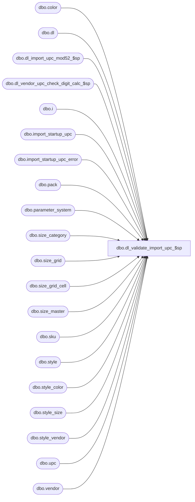

# dbo.dl_validate_import_upc_$sp

**Database:** me_01  
**Server:** bedrockdb02  

## Architecture Diagram



## Table Dependencies

| Referenced Table |
|---|
| dbo.color |
| dbo.dl |
| dbo.dl_import_upc_mod52_$sp |
| dbo.dl_vendor_upc_check_digit_calc_$sp |
| dbo.i |
| dbo.import_startup_upc |
| dbo.import_startup_upc_error |
| dbo.pack |
| dbo.parameter_system |
| dbo.size_category |
| dbo.size_grid |
| dbo.size_grid_cell |
| dbo.size_master |
| dbo.sku |
| dbo.style |
| dbo.style_color |
| dbo.style_size |
| dbo.style_vendor |
| dbo.upc |
| dbo.vendor |

## Stored Procedure Code

```sql
CREATE PROCEDURE [dbo].[dl_validate_import_upc_$sp]
		(@Mod52 BIT, 
		@b_momentis_flag BIT,
		@is_validate_vendor_chck_dgt BIT )
AS

/*
	Version		: 2.01
	Created		: 2011/09/12
	Created by	: Pierrette Lemay
	Description	: This procedure is part of the Data Load process. It runs at Startup time and validates the content of the import_startup_upc table.

	History		: 1.01 changed the call to dl_vendor_upc_check_digit_calc_$sp to lowercase
	History		: 1.02 Corrected issues after first QA test and lower case when calling procedure: dl_vendor_upc_check_digit_calc_$sp.
	History		: 1.03 New segment created (17001) and a new import table is created: import_startup_upc.
			  1.04 Ivan  Various changes to validation of vendor/style code, nrf code validation and deletion of UPCs
			  2.00  Unicode update
			  2.01  Changed check for UPC deletion without vendor code and vendor style specified, bug 34239
*/

BEGIN
	DECLARE @error_flag BIT, @error_msg NVARCHAR(250), @min_import_startup_upc_id DECIMAL(12, 0), @max_import_startup_upc_id DECIMAL(12,0), @c_vendor_upc_type NCHAR(1),
		@c_inhouse_upc_type NCHAR(1), @c_pack_upc_type NCHAR(1), @curr_start_import_startup_upc_id DECIMAL(12, 0), @curr_end_import_startup_upc_id DECIMAL(12,0),
		@batch_size SMALLINT, @crs_ranges_flag BIT, @from_import_startup_upc_id DECIMAL(12, 0), @to_import_startup_upc_id DECIMAL(12,0), @is_size_grid_link_style BIT, 
		@no_size_id NVARCHAR(5), @line_id SMALLINT, @curr_row_text NVARCHAR(500), @curr_upc_number NVARCHAR(14), @cnt_upc TINYINT, 
		@crs_upc_flag BIT, @is_same_row_text BIT, @import_startup_upc_id DECIMAL(12,0);

	SELECT @c_vendor_upc_type = N'V',
		@c_inhouse_upc_type = N'I',
		@c_pack_upc_type = N'P',
		@line_id = 10,
		@error_flag = 0,
		@batch_size = 10000,
		@crs_ranges_flag = 0,
		@crs_upc_flag = 0,
		@is_same_row_text = 0,
		@cnt_upc = 0,
		@is_size_grid_link_style = size_grid_link_style_req_flag
	FROM parameter_system;
		
	SELECT @no_size_id = CAST(size_master_id AS NVARCHAR(5)) FROM size_master WHERE no_size_flag = 1;
	
	IF NOT object_id(N'tempdb..#tmp_upc_error') IS NULL
		DROP TABLE #tmp_upc_error;
	
	CREATE TABLE #tmp_upc_error(
		import_startup_upc_id DECIMAL(12, 0) NOT NULL,
		upc_number NVARCHAR(14) NOT NULL,
		row_text NVARCHAR(500) NOT NULL)
		
	IF NOT object_id(N'tempdb..#validation_ranges') IS NULL
		DROP TABLE #validation_ranges;
			
	CREATE TABLE #validation_ranges(
		from_import_startup_upc DECIMAL(12,0) NOT NULL,
		to_import_startup_upc	DECIMAL(12,0) NOT NULL);
		
	IF NOT object_id(N'tempdb..#dl_temp_upc') IS NULL
		DROP TABLE #dl_temp_upc;
			
	CREATE TABLE #dl_temp_upc(
		import_startup_upc_id DECIMAL(12,0) NOT NULL,
		upc_number NVARCHAR(14) NOT NULL,
		upc_type NCHAR(1) NOT NULL,
		style_id DECIMAL(12,0) NOT NULL,
		color_flag BIT NOT NULL,
		size_flag BIT NOT NULL,
		size_master_id INT NULL,
		activation_date SMALLDATETIME NULL);
		
	BEGIN TRY
		-- upc_number must be unique in the import files when the action is Add
		DECLARE crs_upc CURSOR FOR
		SELECT upc_number, COUNT(*) cnt 
		FROM import_startup_upc 
		WHERE action_type = N'A'
		GROUP BY upc_number 
		HAVING COUNT(*) > 1;

		OPEN crs_upc;
		SET @crs_upc_flag = 1;

		FETCH NEXT FROM crs_upc INTO @curr_upc_number, @cnt_upc;
		
		WHILE @@FETCH_STATUS = 0
		BEGIN		
			INSERT INTO #tmp_upc_error (import_startup_upc_id, upc_number, row_text)
			SELECT import_startup_upc_id, upc_number,
				(i.entity_type + NCHAR(9) + i.action_type + NCHAR(9) + ISNULL(i.vendor_code,N'') + NCHAR(9) + ISNULL(i.vendor_style,N'') + NCHAR(9) + ISNULL(i.color_code,N'') + NCHAR(9) + 
							ISNULL(i.color_short_description,N'') + NCHAR(9) + ISNULL(i.color_long_description,N'') + NCHAR(9) + ISNULL(i.fashion_flag,N'') + NCHAR(9) + 
							ISNULL(i.color_reorder_flag,N'') + NCHAR(9) + ISNULL(CAST(i.nrf_code AS NVARCHAR(10)),N'') + NCHAR(9) + ISNULL(i.size_category_code,N'') + NCHAR(9) +
							ISNULL(i.style_size_code,N'') + NCHAR(9) + ISNULL(i.ticket_label_override,N'') + NCHAR(9) + ISNULL(i.reorder_flag,N'') + NCHAR(9) + i.upc_number + NCHAR(9) +
							i.upc_type + NCHAR(9) + ISNULL(CONVERT(NVARCHAR(10), i.activation_date, 101),N'') + NCHAR(9) + ISNULL(i.pack_code,N'') + NCHAR(9) + 
							ISNULL(CAST(i.first_part_inhouse AS NVARCHAR(3)),N'') + NCHAR(9) + ISNULL(i.style_code,N'')) AS row_text 
			FROM import_startup_upc i
			WHERE upc_number = @curr_upc_number;

			-- we need to find out if the duplicate rows have some differences in the rows
			SELECT TOP 1 @curr_row_text = row_text from #tmp_upc_error;

			IF EXISTS (SELECT 1 FROM #tmp_upc_error WHERE row_text <> @curr_row_text)
				SET @is_same_row_text = 0;
			ELSE
				SET @is_same_row_text = 1;
				
			IF (@is_same_row_text = 1)
			BEGIN
				-- keep one row in the import table and add the other lines to the error table with error_id 20
				SELECT @import_startup_upc_id = MIN(import_startup_upc_id) FROM #tmp_upc_error;	
				
				INSERT INTO import_startup_upc_error
					(import_startup_upc_id, upc_number, error_id, row_text)
				SELECT import_startup_upc_id, upc_number, 20 as error_id, row_text
				FROM #tmp_upc_error
				WHERE import_startup_upc_id > @import_startup_upc_id;
			END			
			ELSE
				-- Error #1: upc_number must be unique in the import files
				-- System doesn't know which one is good, they all go to the error table with error_id #1
				INSERT INTO import_startup_upc_error
					(import_startup_upc_id, upc_number, error_id, row_text)
				SELECT i.import_startup_upc_id, i.upc_number, 1 as error_id,
					(i.entity_type + NCHAR(9) + i.action_type + NCHAR(9) + ISNULL(i.vendor_code,N'') + NCHAR(9) + ISNULL(i.vendor_style,N'') + NCHAR(9) + ISNULL(i.color_code,N'') + NCHAR(9) + 
					ISNULL(i.color_short_description,N'') + NCHAR(9) + ISNULL(i.color_long_description,N'') + NCHAR(9) + ISNULL(i.fashion_flag,N'') + NCHAR(9) + 
					ISNULL(i.color_reorder_flag,N'') + NCHAR(9) + ISNULL(CAST(i.nrf_code AS NVARCHAR(10)),N'') + NCHAR(9) + ISNULL(i.size_category_code,N'') + NCHAR(9) +
					ISNULL(i.style_size_code,N'') + NCHAR(9) + ISNULL(i.ticket_label_override,N'') + NCHAR(9) + ISNULL(i.reorder_flag,N'') + NCHAR(9) + i.upc_number + NCHAR(9) +
					i.upc_type + NCHAR(9) + ISNULL(CONVERT(NVARCHAR(10), i.activation_date, 101),N'') + NCHAR(9) + ISNULL(i.pack_code,N'') + NCHAR(9) + 
					ISNULL(CAST(i.first_part_inhouse AS NVARCHAR(3)),N'') + NCHAR(9) + ISNULL(i.style_code,N'')) AS row_text
				FROM import_startup_upc i
				WHERE i.upc_number = @curr_upc_number;
			
			TRUNCATE TABLE #tmp_upc_error;
			
			FETCH NEXT FROM crs_upc INTO @curr_upc_number, @cnt_upc;
		END
		
		CLOSE crs_upc;
		DEALLOCATE crs_upc;
		SET @crs_upc_flag = 0;
		
		-- At this point: data should be either in the import_startup_upc table or in import_startup_upc_error
		BEGIN TRAN
			DELETE i
			FROM import_startup_upc i, import_startup_upc_error e
			WHERE i.import_startup_upc_id = e.import_startup_upc_id;
		COMMIT TRAN
		
		-- We need to validate the other fields of table import_startup_upc by batch
		SELECT @min_import_startup_upc_id = MIN(import_startup_upc_id), @curr_start_import_startup_upc_id = MIN(import_startup_upc_id),
			   @curr_end_import_startup_upc_id = MIN(import_startup_upc_id), @max_import_startup_upc_id  = MAX(import_startup_upc_id )
		FROM import_startup_upc;
		
		WHILE (@curr_end_import_startup_upc_id <= @max_import_startup_upc_id)
		BEGIN
			SET @curr_end_import_startup_upc_id = @curr_start_import_startup_upc_id + @batch_size - 1;			
			INSERT INTO #validation_ranges VALUES (@curr_start_import_startup_upc_id, @curr_end_import_startup_upc_id);			
			SET @curr_start_import_startup_upc_id = @curr_end_import_startup_upc_id + 1;
		END
		
		SET @line_id = 20;
		
		-- Use a cursor to go through the validations by batch of 10000		
		DECLARE crs_upc_ranges CURSOR FOR
		SELECT from_import_startup_upc, to_import_startup_upc
		FROM #validation_ranges
		ORDER BY from_import_startup_upc;

		OPEN crs_upc_ranges;
		SET @crs_ranges_flag = 1;

		FETCH NEXT FROM crs_upc_ranges INTO @from_import_startup_upc_id, @to_import_startup_upc_id;

		WHILE @@FETCH_STATUS = 0
		BEGIN
			BEGIN TRAN
			
			-- if Mod52 is ON then there is Custom code for Life Uniforms to execute in order to build in-house upc using 6 digit SKU provided by Life.
			IF (@Mod52 = 1) 
				EXEC dl_import_upc_mod52_$sp @from_import_startup_upc_id, @to_import_startup_upc_id;

			SET @line_id = 30;
			
			--IF (@b_momentis_flag = 0)
			--BEGIN
			--	-- Error #2: upc_number imported should not exists in the upc table
			--	INSERT INTO import_startup_upc_error
			--		(import_startup_upc_id, upc_number, error_id, row_text)
			--	SELECT i.import_startup_upc_id, i.upc_number, 2 as error_id, 
			--		(i.entity_type + NCHAR(9) + i.action_type + NCHAR(9) + ISNULL(i.vendor_code,N'') + NCHAR(9) + ISNULL(i.vendor_style,N'') + NCHAR(9) + ISNULL(i.color_code,N'') + NCHAR(9) + 
			--		ISNULL(i.color_short_description,N'') + NCHAR(9) + ISNULL(i.color_long_description,N'') + NCHAR(9) + ISNULL(i.fashion_flag,N'') + NCHAR(9) + 
			--		ISNULL(i.color_reorder_flag,N'') + NCHAR(9) + ISNULL(CAST(i.nrf_code AS NVARCHAR(10)),N'') + NCHAR(9) + ISNULL(i.size_category_code,N'') + NCHAR(9) +
			--		ISNULL(i.style_size_code,N'') + NCHAR(9) + ISNULL(i.ticket_label_override,N'') + NCHAR(9) + ISNULL(i.reorder_flag,N'') + NCHAR(9) + i.upc_number + NCHAR(9) +
			--		i.upc_type + NCHAR(9) + ISNULL(CONVERT(NVARCHAR(10), i.activation_date, 101),N'') + NCHAR(9) + ISNULL(i.pack_code,N'') + NCHAR(9) + 
			--		ISNULL(CAST(i.first_part_inhouse AS NVARCHAR(3)),N'') + NCHAR(9) + ISNULL(i.style_code,N'')) AS row_text
			--	FROM import_startup_upc i
			--	INNER JOIN upc ON i.upc_number = upc.upc_number
			--	LEFT OUTER JOIN import_startup_upc_error e ON e.import_startup_upc_id = i.import_startup_upc_id
			--	WHERE i.import_startup_upc_id BETWEEN @from_import_startup_upc_id AND @to_import_startup_upc_id
			--	AND i.action_type = N'A'
			--	AND e.import_startup_upc_id IS NULL;
				
								
			--	--Error #19: UPC doesn’t exists and the action is “M” or “D”.
			--	INSERT INTO import_startup_upc_error
			--		(import_startup_upc_id, upc_number, error_id, row_text)
			--	SELECT i.import_startup_upc_id, i.upc_number, 19 as error_id, 
			--		(i.entity_type + NCHAR(9) + i.action_type + NCHAR(9) + ISNULL(i.vendor_code,N'') + NCHAR(9) + ISNULL(i.vendor_style,N'') + NCHAR(9) + ISNULL(i.color_code,N'') + NCHAR(9) + 
			--		ISNULL(i.color_short_description,N'') + NCHAR(9) + ISNULL(i.color_long_description,N'') + NCHAR(9) + ISNULL(i.fashion_flag,N'') + NCHAR(9) + 
			--		ISNULL(i.color_reorder_flag,N'') + NCHAR(9) + ISNULL(CAST(i.nrf_code AS NVARCHAR(10)),N'') + NCHAR(9) + ISNULL(i.size_category_code,N'') + NCHAR(9) +
			--		ISNULL(i.style_size_code,N'') + NCHAR(9) + ISNULL(i.ticket_label_override,N'') + NCHAR(9) + ISNULL(i.reorder_flag,N'') + NCHAR(9) + i.upc_number + NCHAR(9) +
			--		i.upc_type + NCHAR(9) + ISNULL(CONVERT(NVARCHAR(10), i.activation_date, 101),N'') + NCHAR(9) + ISNULL(i.pack_code,N'') + NCHAR(9) + 
			--		ISNULL(CAST(i.first_part_inhouse AS NVARCHAR(3)),N'') + NCHAR(9) + ISNULL(i.style_code,N'')) AS row_text
			--	FROM import_startup_upc i
			--	LEFT OUTER JOIN upc ON i.upc_number = upc.upc_number
			--	LEFT OUTER JOIN import_startup_upc_error e ON e.import_startup_upc_id = i.import_startup_upc_id
			--	WHERE i.import_startup_upc_id BETWEEN @from_import_startup_upc_id AND @to_import_startup_upc_id
			--	AND i.action_type <> N'A'
			--	AND upc.upc_number IS NULL
			--	AND e.import_startup_upc_id IS NULL;
			--END
							
			SET @line_id = 35;
			-- When @b_momentis_flag = 1 and action_type is 'M' or 'D' and the UPC not exists in the upc table THEN change the action to Add
			IF (@b_momentis_flag = 1)
			BEGIN
				UPDATE i
				SET i.action_type = N'A'
				FROM import_startup_upc i
				WHERE i.import_startup_upc_id BETWEEN @from_import_startup_upc_id AND @to_import_startup_upc_id
				AND i.action_type IN (N'M', N'D')
				AND NOT EXISTS (SELECT 1 FROM upc WHERE upc.upc_number = i.upc_number)
				AND NOT EXISTS (SELECT 1 FROM import_startup_upc_error e 
								WHERE e.import_startup_upc_id = i.import_startup_upc_id);
								
				DELETE i
				FROM import_startup_upc i
				WHERE i.import_startup_upc_id BETWEEN @from_import_startup_upc_id AND @to_import_startup_upc_id
				AND i.action_type = N'A'
				AND EXISTS (SELECT 1 FROM upc WHERE upc.upc_number = i.upc_number);
								
			END
			
			SET @line_id = 40;
			/* Vendor or Pack:
				Error #3 --> length could be 8, 12, 13 or 14 digits. 
				Error #4 --> If  8, the first digit cannot be 0
				Error #5 --> If 12 long: first digit cannot be 4 
			  In House upc_type
				Error #6 --> can be <= 14 digits long but should start with 4  */
			IF (@Mod52 = 0)  
			BEGIN
				INSERT INTO import_startup_upc_error
					(import_startup_upc_id, upc_number, error_id, row_text)
				SELECT T.import_startup_upc_id, T.upc_number, T.error_id, 
					(i.entity_type + NCHAR(9) + i.action_type + NCHAR(9) + ISNULL(i.vendor_code,N'') + NCHAR(9) + ISNULL(i.vendor_style,N'') + NCHAR(9) + ISNULL(i.color_code,N'') + NCHAR(9) + 
					ISNULL(i.color_short_description,N'') + NCHAR(9) + ISNULL(i.color_long_description,N'') + NCHAR(9) + ISNULL(i.fashion_flag,N'') + NCHAR(9) + 
					ISNULL(i.color_reorder_flag,N'') + NCHAR(9) + ISNULL(CAST(i.nrf_code AS NVARCHAR(10)),N'') + NCHAR(9) + ISNULL(i.size_category_code,N'') + NCHAR(9) +
					ISNULL(i.style_size_code,N'') + NCHAR(9) + ISNULL(i.ticket_label_override,N'') + NCHAR(9) + ISNULL(i.reorder_flag,N'') + NCHAR(9) + i.upc_number + NCHAR(9) +
					i.upc_type + NCHAR(9) + ISNULL(CONVERT(NVARCHAR(10), i.activation_date, 101),N'') + NCHAR(9) + ISNULL(i.pack_code,N'') + NCHAR(9) + 
					ISNULL(CAST(i.first_part_inhouse AS NVARCHAR(3)),N'') + NCHAR(9) + ISNULL(i.style_code,N'')) AS row_text
				FROM import_startup_upc i WITH(NOLOCK), 
					(SELECT import_startup_upc_id, upc_number, 3 as error_id
					FROM import_startup_upc WITH(NOLOCK)
					WHERE import_startup_upc_id BETWEEN @from_import_startup_upc_id AND @to_import_startup_upc_id
					AND upc_type IN (@c_vendor_upc_type, @c_pack_upc_type)
					AND LEN(upc_number) NOT IN (8, 12, 13, 14)
					UNION
					SELECT import_startup_upc_id, upc_number, 4 as error_id
					FROM import_startup_upc WITH(NOLOCK)
					WHERE import_startup_upc_id BETWEEN @from_import_startup_upc_id AND @to_import_startup_upc_id
					AND upc_type IN (@c_vendor_upc_type, @c_pack_upc_type)
					AND LEN(upc_number) = 8
					AND SUBSTRING(upc_number,1, 1) = N'0'
					UNION
					SELECT import_startup_upc_id, upc_number, 5 as error_id
					FROM import_startup_upc WITH(NOLOCK)
					WHERE import_startup_upc_id BETWEEN @from_import_startup_upc_id AND @to_import_startup_upc_id
					AND upc_type IN (@c_vendor_upc_type, @c_pack_upc_type)
					AND LEN(upc_number) = 12
					AND SUBSTRING(upc_number,1, 1) = N'4') T
				WHERE i.import_startup_upc_id = T.import_startup_upc_id
				AND NOT EXISTS (SELECT 1 FROM import_startup_upc_error e WITH (NOLOCK)
								WHERE e.import_startup_upc_id = T.import_startup_upc_id);
			END
						
			SET @line_id = 50;
			
			IF (@is_validate_vendor_chck_dgt = 1)
				-- Error #6 --> If Vendor's UPC and parameter is true  then validate check digit 
				EXEC dl_vendor_upc_check_digit_calc_$sp @from_import_startup_upc_id,@to_import_startup_upc_id;
				
			SET @line_id = 70;
			-- Error #23: a Valid Pack code should exists in the pack table	
			INSERT INTO import_startup_upc_error
				(import_startup_upc_id, upc_number, error_id, row_text)
			SELECT i.import_startup_upc_id, i.upc_number, 23 as error_id,
				(i.entity_type + NCHAR(9) + i.action_type + NCHAR(9) + ISNULL(i.vendor_code,N'') + NCHAR(9) + ISNULL(i.vendor_style,N'') + NCHAR(9) + ISNULL(i.color_code,N'') + NCHAR(9) + 
				ISNULL(i.color_short_description,N'') + NCHAR(9) + ISNULL(i.color_long_description,N'') + NCHAR(9) + ISNULL(i.fashion_flag,N'') + NCHAR(9) + 
				ISNULL(i.color_reorder_flag,N'') + NCHAR(9) + ISNULL(CAST(i.nrf_code AS NVARCHAR(10)),N'') + NCHAR(9) + ISNULL(i.size_category_code,N'') + NCHAR(9) +
				ISNULL(i.style_size_code,N'') + NCHAR(9) + ISNULL(i.ticket_label_override,N'') + NCHAR(9) + ISNULL(i.reorder_flag,N'') + NCHAR(9) + i.upc_number + NCHAR(9) +
				i.upc_type + NCHAR(9) + ISNULL(CONVERT(NVARCHAR(10), i.activation_date, 101),N'') + NCHAR(9) + ISNULL(i.pack_code,N'') + NCHAR(9) + 
				ISNULL(CAST(i.first_part_inhouse AS NVARCHAR(3)),N'') + NCHAR(9) + ISNULL(i.style_code,N'')) AS row_text
			FROM import_startup_upc i
			LEFT OUTER JOIN pack p ON p.pack_code = i.pack_code
			LEFT OUTER JOIN import_startup_upc_error e ON e.import_startup_upc_id = i.import_startup_upc_id
			WHERE i.import_startup_upc_id BETWEEN @from_import_startup_upc_id AND @to_import_startup_upc_id
			AND i.upc_type = @c_pack_upc_type
			AND p.pack_code IS NULL
			AND e.import_startup_upc_id IS NULL;
				
			SET @line_id = 80;
			
			-- Validation: all rows must have either a valid combination of vendor_code and vendor_style OR a valid style_code
			-- vendor_code & vendor_style has precedence over style code
			INSERT INTO #dl_temp_upc
				(import_startup_upc_id, upc_number, upc_type, style_id, color_flag, size_flag, size_master_id)
			SELECT i.import_startup_upc_id, i.upc_number, i.upc_type, s.style_id, s.color_flag, s.size_flag, null
			FROM import_startup_upc i
			INNER JOIN vendor v ON i.vendor_code = v.vendor_code
			INNER JOIN style_vendor sv ON  (i.vendor_style = sv.vendor_style AND sv.vendor_id = v.vendor_id)
			INNER JOIN style s ON sv.style_id = s.style_id
			LEFT OUTER JOIN import_startup_upc_error e ON e.import_startup_upc_id = i.import_startup_upc_id
			WHERE i.import_startup_upc_id BETWEEN @from_import_startup_upc_id AND @to_import_startup_upc_id 
			AND i.upc_type IN (@c_vendor_upc_type, @c_inhouse_upc_type)
			AND len(i.vendor_code) > 0 
			AND len(i.vendor_style) > 0
			AND e.import_startup_upc_id IS NULL;
			
			SET @line_id = 85;
			
			-- Error # 28 Vendor code / vendor style combination must be valid when specified
			INSERT INTO import_startup_upc_error
				(import_startup_upc_id, upc_number, error_id, row_text)
			SELECT i.import_startup_upc_id, i.upc_number, 28 as error_id, 
				(i.entity_type + NCHAR(9) + i.action_type + NCHAR(9) + ISNULL(i.vendor_code,N'') + NCHAR(9) + ISNULL(i.vendor_style,N'') + NCHAR(9) + ISNULL(i.color_code,N'') + NCHAR(9) + 
				ISNULL(i.color_short_description,N'') + NCHAR(9) + ISNULL(i.color_long_description,N'') + NCHAR(9) + ISNULL(i.fashion_flag,N'') + NCHAR(9) + 
				ISNULL(i.color_reorder_flag,N'') + NCHAR(9) + ISNULL(CAST(i.nrf_code AS NVARCHAR(10)),N'') + NCHAR(9) + ISNULL(i.size_category_code,N'') + NCHAR(9) +
				ISNULL(i.style_size_code,N'') + NCHAR(9) + ISNULL(i.ticket_label_override,N'') + NCHAR(9) + ISNULL(i.reorder_flag,N'') + NCHAR(9) + i.upc_number + NCHAR(9) +
				i.upc_type + NCHAR(9) + ISNULL(CONVERT(NVARCHAR(10), i.activation_date, 101),N'') + NCHAR(9) + ISNULL(i.pack_code,N'') + NCHAR(9) + 
				ISNULL(CAST(i.first_part_inhouse AS NVARCHAR(3)),N'') + NCHAR(9) + ISNULL(i.style_code,N'')) AS row_text
			FROM import_startup_upc i
			LEFT OUTER JOIN #dl_temp_upc dl ON dl.import_startup_upc_id = i.import_startup_upc_id
			LEFT OUTER JOIN import_startup_upc_error e ON e.import_startup_upc_id = i.import_startup_upc_id
			WHERE i.import_startup_upc_id BETWEEN @from_import_startup_upc_id AND @to_import_startup_upc_id
			AND len(i.vendor_code) > 0 
			AND len(i.vendor_style) > 0
			AND dl.import_startup_upc_id IS NULL
			AND e.import_startup_upc_id IS NULL;
			
			SET @line_id = 90;
			INSERT INTO #dl_temp_upc
				(import_startup_upc_id, upc_number, upc_type, style_id, color_flag, size_flag, size_master_id)
			SELECT i.import_startup_upc_id, i.upc_number, i.upc_type, s.style_id, s.color_flag, s.size_flag, null
			FROM import_startup_upc i
			INNER JOIN style s ON  (i.style_code = s.style_code)
			LEFT OUTER JOIN import_startup_upc_error e ON e.import_startup_upc_id = i.import_startup_upc_id
			WHERE i.import_startup_upc_id BETWEEN @from_import_startup_upc_id AND @to_import_startup_upc_id 
			AND i.upc_type IN (@c_vendor_upc_type, @c_inhouse_upc_type)
			AND Len(i.vendor_code) = 0 
			AND len(i.vendor_style) = 0
			AND len(i.style_code) > 0 
			AND e.import_startup_upc_id IS NULL;
			
			SET @line_id = 100;
			
			INSERT INTO #dl_temp_upc
				(import_startup_upc_id, upc_number, upc_type, style_id, color_flag, size_flag, size_master_id)
			SELECT i.import_startup_upc_id, i.upc_number, i.upc_type, s.style_id, s.color_flag, s.size_flag, null
			FROM import_startup_upc i
			INNER JOIN pack p ON i.pack_code = p.pack_code AND p.active_flag = 1
			INNER JOIN style s ON p.style_id = s.style_id 
			LEFT OUTER JOIN import_startup_upc_error e ON e.import_startup_upc_id = i.import_startup_upc_id
			WHERE i.import_startup_upc_id BETWEEN @from_import_startup_upc_id AND @to_import_startup_upc_id 
			AND i.upc_type = @c_pack_upc_type
			AND e.import_startup_upc_id IS NULL;
			
			SET @line_id = 105;
			
			-- Error 27: Vendor code and style vendor must exist and be valid when deleting an upc
			INSERT INTO import_startup_upc_error
					(import_startup_upc_id, upc_number, error_id, row_text)
			SELECT i.import_startup_upc_id, i.upc_number, 27 as error_id, 
				(i.entity_type + NCHAR(9) + i.action_type + NCHAR(9) + ISNULL(i.vendor_code,N'') + NCHAR(9) + ISNULL(i.vendor_style,N'') + NCHAR(9) + ISNULL(i.color_code,N'') + NCHAR(9) + 
				ISNULL(i.color_short_description,N'') + NCHAR(9) + ISNULL(i.color_long_description,N'') + NCHAR(9) + ISNULL(i.fashion_flag,N'') + NCHAR(9) + 
				ISNULL(i.color_reorder_flag,N'') + NCHAR(9) + ISNULL(CAST(i.nrf_code AS NVARCHAR(10)),N'') + NCHAR(9) + ISNULL(i.size_category_code,N'') + NCHAR(9) +
				ISNULL(i.style_size_code,N'') + NCHAR(9) + ISNULL(i.ticket_label_override,N'') + NCHAR(9) + ISNULL(i.reorder_flag,N'') + NCHAR(9) + i.upc_number + NCHAR(9) +
				i.upc_type + NCHAR(9) + ISNULL(CONVERT(NVARCHAR(10), i.activation_date, 101),N'') + NCHAR(9) + ISNULL(i.pack_code,N'') + NCHAR(9) + 
				ISNULL(CAST(i.first_part_inhouse AS NVARCHAR(3)),N'') + NCHAR(9) + ISNULL(i.style_code,N'')) AS row_text
			FROM import_startup_upc i
			WHERE i.import_startup_upc_id BETWEEN @from_import_startup_upc_id AND @to_import_startup_upc_id
			AND action_type = N'D'
			AND (vendor_code IS NULL
				OR vendor_style IS NULL
				OR NOT EXISTS (SELECT 1 FROM style_vendor sv, vendor v 
										WHERE sv.vendor_id = v.vendor_id
										AND sv.vendor_style = i.vendor_style 
										AND v.vendor_code = i.vendor_code)
				)
			AND NOT EXISTS (SELECT 1 FROM import_startup_upc_error e 
								WHERE e.import_startup_upc_id = i.import_startup_upc_id)
			
			SET @line_id = 110;
			
			-- Error #7: unable to retrieve a valid style based on the information provided in the import file
			INSERT INTO import_startup_upc_error
				(import_startup_upc_id, upc_number, error_id, row_text)
			SELECT i.import_startup_upc_id, i.upc_number, 7 as error_id, 
				(i.entity_type + NCHAR(9) + i.action_type + NCHAR(9) + ISNULL(i.vendor_code,N'') + NCHAR(9) + ISNULL(i.vendor_style,N'') + NCHAR(9) + ISNULL(i.color_code,N'') + NCHAR(9) + 
				ISNULL(i.color_short_description,N'') + NCHAR(9) + ISNULL(i.color_long_description,N'') + NCHAR(9) + ISNULL(i.fashion_flag,N'') + NCHAR(9) + 
				ISNULL(i.color_reorder_flag,N'') + NCHAR(9) + ISNULL(CAST(i.nrf_code AS NVARCHAR(10)),N'') + NCHAR(9) + ISNULL(i.size_category_code,N'') + NCHAR(9) +
				ISNULL(i.style_size_code,N'') + NCHAR(9) + ISNULL(i.ticket_label_override,N'') + NCHAR(9) + ISNULL(i.reorder_flag,N'') + NCHAR(9) + i.upc_number + NCHAR(9) +
				i.upc_type + NCHAR(9) + ISNULL(CONVERT(NVARCHAR(10), i.activation_date, 101),N'') + NCHAR(9) + ISNULL(i.pack_code,N'') + NCHAR(9) + 
				ISNULL(CAST(i.first_part_inhouse AS NVARCHAR(3)),N'') + NCHAR(9) + ISNULL(i.style_code,N'')) AS row_text
			FROM import_startup_upc i
			LEFT OUTER JOIN #dl_temp_upc dl ON dl.import_startup_upc_id = i.import_startup_upc_id
			LEFT OUTER JOIN import_startup_upc_error e ON e.import_startup_upc_id = i.import_startup_upc_id
			WHERE i.import_startup_upc_id BETWEEN @from_import_startup_upc_id AND @to_import_startup_upc_id
			AND dl.import_startup_upc_id IS NULL
			AND e.import_startup_upc_id IS NULL;
							
			SET @line_id = 120;
			
			-- Now that we know the style_id for each valid row, 
			-- UPDATE import_startup_upc with the style_code as we'll need it later in the processing
			UPDATE i
			SET i.style_code = s.style_code
			FROM import_startup_upc i
			INNER JOIN #dl_temp_upc dl ON i.import_startup_upc_id = dl.import_startup_upc_id
			INNER JOIN style s ON dl.style_id = s.style_id
			LEFT OUTER JOIN import_startup_upc_error e ON e.import_startup_upc_id = i.import_startup_upc_id
			WHERE i.import_startup_upc_id BETWEEN @from_import_startup_upc_id AND @to_import_startup_upc_id
			AND e.import_startup_upc_id IS NULL;
							
			SET @line_id = 130;
			
			-- Error #9: activation_date: Mandatory for upc_type Vendor or Pack
			INSERT INTO import_startup_upc_error
				(import_startup_upc_id, upc_number, error_id, row_text)
			SELECT i.import_startup_upc_id, i.upc_number, 9 as error_id,
				(i.entity_type + NCHAR(9) + i.action_type + NCHAR(9) + ISNULL(i.vendor_code,N'') + NCHAR(9) + ISNULL(i.vendor_style,N'') + NCHAR(9) + ISNULL(i.color_code,N'') + NCHAR(9) + 
				ISNULL(i.color_short_description,N'') + NCHAR(9) + ISNULL(i.color_long_description,N'') + NCHAR(9) + ISNULL(i.fashion_flag,N'') + NCHAR(9) + 
				ISNULL(i.color_reorder_flag,N'') + NCHAR(9) + ISNULL(CAST(i.nrf_code AS NVARCHAR(10)),N'') + NCHAR(9) + ISNULL(i.size_category_code,N'') + NCHAR(9) +
				ISNULL(i.style_size_code,N'') + NCHAR(9) + ISNULL(i.ticket_label_override,N'') + NCHAR(9) + ISNULL(i.reorder_flag,N'') + NCHAR(9) + i.upc_number + NCHAR(9) +
				i.upc_type + NCHAR(9) + ISNULL(CONVERT(NVARCHAR(10), i.activation_date, 101),N'') + NCHAR(9) + ISNULL(i.pack_code,N'') + NCHAR(9) + 
				ISNULL(CAST(i.first_part_inhouse AS NVARCHAR(3)),N'') + NCHAR(9) + ISNULL(i.style_code,N'')) AS row_text
			FROM import_startup_upc i
			WHERE i.import_startup_upc_id BETWEEN @from_import_startup_upc_id AND @to_import_startup_upc_id
			AND i.upc_type IN (@c_vendor_upc_type, @c_pack_upc_type)
			AND i.activation_date IS NULL
			AND NOT EXISTS (SELECT 1 FROM import_startup_upc_error e WITH (NOLOCK)
							WHERE e.import_startup_upc_id = i.import_startup_upc_id);
							
			SET @line_id = 140;
			
			-- Error #11: Color Code is Mandatory for Vendor and In House UPC type linked to a colored style
			INSERT INTO import_startup_upc_error
				(import_startup_upc_id, upc_number, error_id,  row_text)
			SELECT i.import_startup_upc_id, i.upc_number, 11 as error_id, 
				(i.entity_type + NCHAR(9) + i.action_type + NCHAR(9) + ISNULL(i.vendor_code,N'') + NCHAR(9) + ISNULL(i.vendor_style,N'') + NCHAR(9) + ISNULL(i.color_code,N'') + NCHAR(9) + 
				ISNULL(i.color_short_description,N'') + NCHAR(9) + ISNULL(i.color_long_description,N'') + NCHAR(9) + ISNULL(i.fashion_flag,N'') + NCHAR(9) + 
				ISNULL(i.color_reorder_flag,N'') + NCHAR(9) + ISNULL(CAST(i.nrf_code AS NVARCHAR(10)),N'') + NCHAR(9) + ISNULL(i.size_category_code,N'') + NCHAR(9) +
				ISNULL(i.style_size_code,N'') + NCHAR(9) + ISNULL(i.ticket_label_override,N'') + NCHAR(9) + ISNULL(i.reorder_flag,N'') + NCHAR(9) + i.upc_number + NCHAR(9) +
				i.upc_type + NCHAR(9) + ISNULL(CONVERT(NVARCHAR(10), i.activation_date, 101),N'') + NCHAR(9) + ISNULL(i.pack_code,N'') + NCHAR(9) + 
				ISNULL(CAST(i.first_part_inhouse AS NVARCHAR(3)),N'') + NCHAR(9) + ISNULL(i.style_code,N'')) AS row_text
			FROM import_startup_upc i, #dl_temp_upc dl
			WHERE i.import_startup_upc_id BETWEEN @from_import_startup_upc_id AND @to_import_startup_upc_id
			AND i.upc_type IN (@c_vendor_upc_type, @c_inhouse_upc_type)
			AND i.import_startup_upc_id = dl.import_startup_upc_id
			AND dl.color_flag = 1
			AND i.color_code = N''
			AND NOT EXISTS (SELECT 1 FROM import_startup_upc_error e WITH (NOLOCK)
							WHERE e.import_startup_upc_id = i.import_startup_upc_id);
							
			-- Error #24: 	Must be a valid color code in the color master table
			INSERT INTO import_startup_upc_error
				(import_startup_upc_id, upc_number, error_id,  row_text)
			SELECT i.import_startup_upc_id, i.upc_number, 24 as error_id, 
				(i.entity_type + NCHAR(9) + i.action_type + NCHAR(9) + ISNULL(i.vendor_code,N'') + NCHAR(9) + ISNULL(i.vendor_style,N'') + NCHAR(9) + ISNULL(i.color_code,N'') + NCHAR(9) + 
				ISNULL(i.color_short_description,N'') + NCHAR(9) + ISNULL(i.color_long_description,N'') + NCHAR(9) + ISNULL(i.fashion_flag,N'') + NCHAR(9) + 
				ISNULL(i.color_reorder_flag,N'') + NCHAR(9) + ISNULL(CAST(i.nrf_code AS NVARCHAR(10)),N'') + NCHAR(9) + ISNULL(i.size_category_code,N'') + NCHAR(9) +
				ISNULL(i.style_size_code,N'') + NCHAR(9) + ISNULL(i.ticket_label_override,N'') + NCHAR(9) + ISNULL(i.reorder_flag,N'') + NCHAR(9) + i.upc_number + NCHAR(9) +
				i.upc_type + NCHAR(9) + ISNULL(CONVERT(NVARCHAR(10), i.activation_date, 101),N'') + NCHAR(9) + ISNULL(i.pack_code,N'') + NCHAR(9) + 
				ISNULL(CAST(i.first_part_inhouse AS NVARCHAR(3)),N'') + NCHAR(9) + ISNULL(i.style_code,N'')) AS row_text
			FROM import_startup_upc i
			INNER JOIN #dl_temp_upc dl ON i.import_startup_upc_id = dl.import_startup_upc_id AND dl.color_flag = 1
			LEFT OUTER JOIN color c ON c.color_code = i.color_code
			LEFT OUTER JOIN import_startup_upc_error e ON e.import_startup_upc_id = i.import_startup_upc_id
			WHERE i.import_startup_upc_id BETWEEN @from_import_startup_upc_id AND @to_import_startup_upc_id
			AND i.upc_type IN (@c_vendor_upc_type, @c_inhouse_upc_type)
			AND c.color_code IS NULL
			AND e.import_startup_upc_id IS NULL;

			SET @line_id = 150;
			-- Error #25:	If the color has not already been assigned to the style’s UPC, then it must be active.
			INSERT INTO import_startup_upc_error
				(import_startup_upc_id, upc_number, error_id, row_text)
			SELECT i.import_startup_upc_id, i.upc_number, 25 as error_id, 
				(i.entity_type + NCHAR(9) + i.action_type + NCHAR(9) + ISNULL(i.vendor_code,N'') + NCHAR(9) + ISNULL(i.vendor_style,N'') + NCHAR(9) + ISNULL(i.color_code,N'') + NCHAR(9) + 
				ISNULL(i.color_short_description,N'') + NCHAR(9) + ISNULL(i.color_long_description,N'') + NCHAR(9) + ISNULL(i.fashion_flag,N'') + NCHAR(9) + 
				ISNULL(i.color_reorder_flag,N'') + NCHAR(9) + ISNULL(CAST(i.nrf_code AS NVARCHAR(10)),N'') + NCHAR(9) + ISNULL(i.size_category_code,N'') + NCHAR(9) +
				ISNULL(i.style_size_code,N'') + NCHAR(9) + ISNULL(i.ticket_label_override,N'') + NCHAR(9) + ISNULL(i.reorder_flag,N'') + NCHAR(9) + i.upc_number + NCHAR(9) +
				i.upc_type + NCHAR(9) + ISNULL(CONVERT(NVARCHAR(10), i.activation_date, 101),N'') + NCHAR(9) + ISNULL(i.pack_code,N'') + NCHAR(9) + 
				ISNULL(CAST(i.first_part_inhouse AS NVARCHAR(3)),N'') + NCHAR(9) + ISNULL(i.style_code,N'')) AS row_text
			FROM import_startup_upc i, #dl_temp_upc dl, color c
			WHERE i.import_startup_upc_id BETWEEN @from_import_startup_upc_id AND @to_import_startup_upc_id
			AND i.upc_type IN (@c_vendor_upc_type, @c_inhouse_upc_type)
			AND i.import_startup_upc_id = dl.import_startup_upc_id
			AND dl.color_flag = 1
			AND i.color_code = c.color_code
			AND c.active_flag = 0
			AND NOT EXISTS (SELECT 1 FROM style_color sc 
							WHERE sc.style_id = dl.style_id 
							AND sc.color_id = c.color_id)
			AND NOT EXISTS (SELECT 1 FROM import_startup_upc_error e WITH (NOLOCK)
							WHERE e.import_startup_upc_id = i.import_startup_upc_id); 
						
			SET @line_id = 160;
			-- Checking the size rules
			-- When the value of nrf_code is not provided in the import file, the .Net code will insert 0 in this field
			
			-- Bug 34243 in TFS
			-- When action is delete and neither nrf_code, size_category_code nor style_size_code are provided we get them from the upc so we can delete
			UPDATE import_startup_upc 
			SET nrf_code = sm.nrf_code, size_category_code = sc.size_category_code, style_size_code = sm.size_code
			FROM import_startup_upc i, upc u, sku k, style_size ss, size_master sm, size_category sc
			WHERE i.upc_number = u.upc_number
			AND u.sku_id = k.sku_id
			AND k.style_size_id = ss.style_size_id
			AND ss.size_master_id = sm.size_master_id
			AND sm.size_category_id = sc.size_category_id
			AND i.action_type = N'D'
			AND i.nrf_code IS NULL
			AND i.size_category_code = N''
			AND i.style_size_code = N''
			AND NOT EXISTS (SELECT 1 FROM import_startup_upc_error e 
							WHERE e.import_startup_upc_id = i.import_startup_upc_id)
							
			-- Error #12: When the style is sized then either nrf size_code OR a combination of size_category & size_code is Mandatory     
			INSERT INTO import_startup_upc_error
				(import_startup_upc_id, upc_number, error_id, row_text)
			SELECT i.import_startup_upc_id, i.upc_number, 12 as error_id, 
				(i.entity_type + NCHAR(9) + i.action_type + NCHAR(9) + ISNULL(i.vendor_code,N'') + NCHAR(9) + ISNULL(i.vendor_style,N'') + NCHAR(9) + ISNULL(i.color_code,N'') + NCHAR(9) + 
				ISNULL(i.color_short_description,N'') + NCHAR(9) + ISNULL(i.color_long_description,N'') + NCHAR(9) + ISNULL(i.fashion_flag,N'') + NCHAR(9) + 
				ISNULL(i.color_reorder_flag,N'') + NCHAR(9) + ISNULL(CAST(i.nrf_code AS NVARCHAR(10)),N'') + NCHAR(9) + ISNULL(i.size_category_code,N'') + NCHAR(9) +
				ISNULL(i.style_size_code,N'') + NCHAR(9) + ISNULL(i.ticket_label_override,N'') + NCHAR(9) + ISNULL(i.reorder_flag,N'') + NCHAR(9) + i.upc_number + NCHAR(9) +
				i.upc_type + NCHAR(9) + ISNULL(CONVERT(NVARCHAR(10), i.activation_date, 101),N'') + NCHAR(9) + ISNULL(i.pack_code,N'') + NCHAR(9) + 
				ISNULL(CAST(i.first_part_inhouse AS NVARCHAR(3)),N'') + NCHAR(9) + ISNULL(i.style_code,N'')) AS row_text
			FROM import_startup_upc i, #dl_temp_upc dl
			WHERE i.import_startup_upc_id BETWEEN @from_import_startup_upc_id AND @to_import_startup_upc_id
			AND i.upc_type IN (@c_vendor_upc_type, @c_inhouse_upc_type)
			AND i.import_startup_upc_id = dl.import_startup_upc_id
			AND dl.size_flag = 1
			AND i.nrf_code IS NULL
			AND i.size_category_code = N''
			AND i.style_size_code = N''
			AND NOT EXISTS (SELECT 1 FROM import_startup_upc_error e 
							WHERE e.import_startup_upc_id = i.import_startup_upc_id);
			
			SET @line_id = 170;
			-- if the style is sized and nrf_code > 0 then this code should exists in the size_master table
			INSERT INTO import_startup_upc_error
				(import_startup_upc_id, upc_number, error_id, row_text)
			SELECT i.import_startup_upc_id, i.upc_number, 29 as error_id, 
				(i.entity_type + NCHAR(9) + i.action_type + NCHAR(9) + ISNULL(i.vendor_code,N'') + NCHAR(9) + ISNULL(i.vendor_style,N'') + NCHAR(9) + ISNULL(i.color_code,N'') + NCHAR(9) + 
				ISNULL(i.color_short_description,N'') + NCHAR(9) + ISNULL(i.color_long_description,N'') + NCHAR(9) + ISNULL(i.fashion_flag,N'') + NCHAR(9) + 
				ISNULL(i.color_reorder_flag,N'') + NCHAR(9) + ISNULL(CAST(i.nrf_code AS NVARCHAR(10)),N'') + NCHAR(9) + ISNULL(i.size_category_code,N'') + NCHAR(9) +
				ISNULL(i.style_size_code,N'') + NCHAR(9) + ISNULL(i.ticket_label_override,N'') + NCHAR(9) + ISNULL(i.reorder_flag,N'') + NCHAR(9) + i.upc_number + NCHAR(9) +
				i.upc_type + NCHAR(9) + ISNULL(CONVERT(NVARCHAR(10), i.activation_date, 101),N'') + NCHAR(9) + ISNULL(i.pack_code,N'') + NCHAR(9) + 
				ISNULL(CAST(i.first_part_inhouse AS NVARCHAR(3)),N'') + NCHAR(9) + ISNULL(i.style_code,N'')) AS row_text
			FROM import_startup_upc i
			INNER JOIN #dl_temp_upc dl ON i.import_startup_upc_id = dl.import_startup_upc_id AND dl.size_flag = 1
			LEFT OUTER JOIN size_master sm ON  i.nrf_code = sm.nrf_code
			LEFT OUTER JOIN import_startup_upc_error e ON e.import_startup_upc_id = i.import_startup_upc_id
			WHERE i.import_startup_upc_id BETWEEN @from_import_startup_upc_id AND @to_import_startup_upc_id
			AND i.upc_type IN (@c_vendor_upc_type, @c_inhouse_upc_type)
			AND i.nrf_code > 0
			AND sm.nrf_code IS NULL
			AND e.import_startup_upc_id IS NULL;
			
			SET @line_id = 180;
			-- assign the size info to the temp table
			UPDATE dl
			SET dl.size_master_id = @no_size_id
			FROM #dl_temp_upc dl, import_startup_upc i, size_category sc, size_master ss
			WHERE i.import_startup_upc_id BETWEEN @from_import_startup_upc_id AND @to_import_startup_upc_id
			AND i.import_startup_upc_id = dl.import_startup_upc_id
			AND dl.size_flag = 0;
			
			-- if the style is sized and nrf_code not provided then a valid combination of size_category and size_code should be provided	
			-- if nrf_code provided, it has precedence over size_category & size_code
			UPDATE dl
			SET dl.size_master_id = ss.size_master_id
			FROM #dl_temp_upc dl, import_startup_upc i, size_master ss
			WHERE i.import_startup_upc_id BETWEEN @from_import_startup_upc_id AND @to_import_startup_upc_id
			AND i.import_startup_upc_id = dl.import_startup_upc_id
			AND dl.size_flag = 1
			AND i.nrf_code > 0
			AND i.nrf_code = ss.nrf_code
			AND NOT EXISTS (SELECT 1 FROM import_startup_upc_error e 
							WHERE e.import_startup_upc_id = i.import_startup_upc_id);
			
			UPDATE dl
			SET dl.size_master_id = ss.size_master_id
			FROM #dl_temp_upc dl, import_startup_upc i, size_category sc, size_master ss
			WHERE i.import_startup_upc_id BETWEEN @from_import_startup_upc_id AND @to_import_startup_upc_id
			AND i.import_startup_upc_id = dl.import_startup_upc_id
			AND dl.size_flag = 1
			AND i.nrf_code IS NULL
			AND i.size_category_code = sc.size_category_code
			AND sc.size_category_id = ss.size_category_id
			AND ss.size_code = i.style_size_code
			AND dl.size_master_id IS NULL
			AND NOT EXISTS (SELECT 1 FROM import_startup_upc_error e 
							WHERE e.import_startup_upc_id = i.import_startup_upc_id);
					
			SET @line_id = 190;
			
			-- Error #13: Unable to find the size_master_id of a sized style based on the data provided
			INSERT INTO import_startup_upc_error
				(import_startup_upc_id, upc_number, error_id, row_text)
			SELECT i.import_startup_upc_id, i.upc_number, 13 as error_id,
				(i.entity_type + NCHAR(9) + i.action_type + NCHAR(9) + ISNULL(i.vendor_code,N'') + NCHAR(9) + ISNULL(i.vendor_style,N'') + NCHAR(9) + ISNULL(i.color_code,N'') + NCHAR(9) + 
				ISNULL(i.color_short_description,N'') + NCHAR(9) + ISNULL(i.color_long_description,N'') + NCHAR(9) + ISNULL(i.fashion_flag,N'') + NCHAR(9) + 
				ISNULL(i.color_reorder_flag,N'') + NCHAR(9) + ISNULL(CAST(i.nrf_code AS NVARCHAR(10)),N'') + NCHAR(9) + ISNULL(i.size_category_code,N'') + NCHAR(9) +
				ISNULL(i.style_size_code,N'') + NCHAR(9) + ISNULL(i.ticket_label_override,N'') + NCHAR(9) + ISNULL(i.reorder_flag,N'') + NCHAR(9) + i.upc_number + NCHAR(9) +
				i.upc_type + NCHAR(9) + ISNULL(CONVERT(NVARCHAR(10), i.activation_date, 101),N'') + NCHAR(9) + ISNULL(i.pack_code,N'') + NCHAR(9) + 
				ISNULL(CAST(i.first_part_inhouse AS NVARCHAR(3)),N'') + NCHAR(9) + ISNULL(i.style_code,N'')) AS row_text
			FROM import_startup_upc i, #dl_temp_upc dl
			WHERE i.import_startup_upc_id BETWEEN @from_import_startup_upc_id AND @to_import_startup_upc_id
			AND i.upc_type IN (@c_vendor_upc_type, @c_inhouse_upc_type)
			AND i.import_startup_upc_id = dl.import_startup_upc_id
			AND dl.size_flag = 1
			AND dl.size_master_id IS NULL
			AND NOT EXISTS (SELECT 1 FROM import_startup_upc_error e 
							WHERE e.import_startup_upc_id = i.import_startup_upc_id);
							
			SET @line_id = 200;
			-- Error #14: The size_master_id just retrieved should be part of the default size_category assigned to the style
			IF (@is_size_grid_link_style = 0)
			BEGIN
				INSERT INTO import_startup_upc_error
					(import_startup_upc_id, upc_number, error_id, row_text)
				SELECT i.import_startup_upc_id, i.upc_number, 14 as error_id, 
					(i.entity_type + NCHAR(9) + i.action_type + NCHAR(9) + ISNULL(i.vendor_code,N'') + NCHAR(9) + ISNULL(i.vendor_style,N'') + NCHAR(9) + ISNULL(i.color_code,N'') + NCHAR(9) + 
					ISNULL(i.color_short_description,N'') + NCHAR(9) + ISNULL(i.color_long_description,N'') + NCHAR(9) + ISNULL(i.fashion_flag,N'') + NCHAR(9) + 
					ISNULL(i.color_reorder_flag,N'') + NCHAR(9) + ISNULL(CAST(i.nrf_code AS NVARCHAR(10)),N'') + NCHAR(9) + ISNULL(i.size_category_code,N'') + NCHAR(9) +
					ISNULL(i.style_size_code,N'') + NCHAR(9) + ISNULL(i.ticket_label_override,N'') + NCHAR(9) + ISNULL(i.reorder_flag,N'') + NCHAR(9) + i.upc_number + NCHAR(9) +
					i.upc_type + NCHAR(9) + ISNULL(CONVERT(NVARCHAR(10), i.activation_date, 101),N'') + NCHAR(9) + ISNULL(i.pack_code,N'') + NCHAR(9) + 
					ISNULL(CAST(i.first_part_inhouse AS NVARCHAR(3)),N'') + NCHAR(9) + ISNULL(i.style_code,N'')) AS row_text
				FROM import_startup_upc i, #dl_temp_upc dl, size_master sm, style s
				WHERE i.import_startup_upc_id BETWEEN @from_import_startup_upc_id AND @to_import_startup_upc_id
				AND i.upc_type IN (@c_vendor_upc_type, @c_inhouse_upc_type)
				AND i.import_startup_upc_id = dl.import_startup_upc_id
				AND dl.size_flag = 1
				AND dl.size_master_id = sm.size_master_id
				AND dl.style_id = s.style_id
				AND s.size_category_id <> sm.size_category_id
				AND NOT EXISTS (SELECT 1 FROM import_startup_upc_error e 
								WHERE e.import_startup_upc_id = i.import_startup_upc_id);
					
				-- Error #26: Size Code – The size must be assigned to an active size category			
				INSERT INTO import_startup_upc_error
					(import_startup_upc_id, upc_number, error_id, row_text)
				SELECT i.import_startup_upc_id, i.upc_number, 26 as error_id, 
					(i.entity_type + NCHAR(9) + i.action_type + NCHAR(9) + ISNULL(i.vendor_code,N'') + NCHAR(9) + ISNULL(i.vendor_style,N'') + NCHAR(9) + ISNULL(i.color_code,N'') + NCHAR(9) + 
					ISNULL(i.color_short_description,N'') + NCHAR(9) + ISNULL(i.color_long_description,N'') + NCHAR(9) + ISNULL(i.fashion_flag,N'') + NCHAR(9) + 
					ISNULL(i.color_reorder_flag,N'') + NCHAR(9) + ISNULL(CAST(i.nrf_code AS NVARCHAR(10)),N'') + NCHAR(9) + ISNULL(i.size_category_code,N'') + NCHAR(9) +
					ISNULL(i.style_size_code,N'') + NCHAR(9) + ISNULL(i.ticket_label_override,N'') + NCHAR(9) + ISNULL(i.reorder_flag,N'') + NCHAR(9) + i.upc_number + NCHAR(9) +
					i.upc_type + NCHAR(9) + ISNULL(CONVERT(NVARCHAR(10), i.activation_date, 101),N'') + NCHAR(9) + ISNULL(i.pack_code,N'') + NCHAR(9) + 
					ISNULL(CAST(i.first_part_inhouse AS NVARCHAR(3)),N'') + NCHAR(9) + ISNULL(i.style_code,N'')) AS row_text
				FROM import_startup_upc i, #dl_temp_upc dl, size_master sm, style s
				WHERE i.import_startup_upc_id BETWEEN @from_import_startup_upc_id AND @to_import_startup_upc_id
				AND i.upc_type IN (@c_vendor_upc_type, @c_inhouse_upc_type)
				AND i.import_startup_upc_id = dl.import_startup_upc_id
				AND dl.size_flag = 1
				AND dl.size_master_id = sm.size_master_id
				AND dl.style_id = s.style_id
				AND s.size_category_id = sm.size_category_id
				AND NOT EXISTS (SELECT 1 FROM size_category sc WHERE sc.size_category_id = sm.size_category_id AND sc.active_flag = 1)
				AND NOT EXISTS (SELECT 1 FROM import_startup_upc_error e 
								WHERE e.import_startup_upc_id = i.import_startup_upc_id);
								
			END
			ELSE -- Error #15: The size_master_id just retrieved should be part of the default size_grid assigned to the style
				INSERT INTO import_startup_upc_error
					(import_startup_upc_id, upc_number, error_id, row_text)
				SELECT i.import_startup_upc_id, i.upc_number, 15 as error_id, 
					(i.entity_type + NCHAR(9) + i.action_type + NCHAR(9) + ISNULL(i.vendor_code,N'') + NCHAR(9) + ISNULL(i.vendor_style,N'') + NCHAR(9) + ISNULL(i.color_code,N'') + NCHAR(9) + 
					ISNULL(i.color_short_description,N'') + NCHAR(9) + ISNULL(i.color_long_description,N'') + NCHAR(9) + ISNULL(i.fashion_flag,N'') + NCHAR(9) + 
					ISNULL(i.color_reorder_flag,N'') + NCHAR(9) + ISNULL(CAST(i.nrf_code AS NVARCHAR(10)),N'') + NCHAR(9) + ISNULL(i.size_category_code,N'') + NCHAR(9) +
					ISNULL(i.style_size_code,N'') + NCHAR(9) + ISNULL(i.ticket_label_override,N'') + NCHAR(9) + ISNULL(i.reorder_flag,N'') + NCHAR(9) + i.upc_number + NCHAR(9) +
					i.upc_type + NCHAR(9) + ISNULL(CONVERT(NVARCHAR(10), i.activation_date, 101),N'') + NCHAR(9) + ISNULL(i.pack_code,N'') + NCHAR(9) + 
					ISNULL(CAST(i.first_part_inhouse AS NVARCHAR(3)),N'') + NCHAR(9) + ISNULL(i.style_code,N'')) AS row_text
				FROM import_startup_upc i, #dl_temp_upc dl, size_master sm, style s, size_grid sg, size_grid_cell sgc
				WHERE i.import_startup_upc_id BETWEEN @from_import_startup_upc_id AND @to_import_startup_upc_id
				AND i.upc_type IN (@c_vendor_upc_type, @c_inhouse_upc_type)
				AND i.import_startup_upc_id = dl.import_startup_upc_id
				AND dl.size_flag = 1
				AND dl.style_id = s.style_id
				AND dl.size_master_id = sm.size_master_id
				AND s.size_grid_id = sg.size_grid_id
				AND sg.size_grid_id = sgc.size_grid_id
				AND sm.size_master_id = sgc.size_master_id
				AND (s.size_category_id <> sg.size_category_id
					OR
					 s.size_grid_id  <> sgc.size_grid_id)
				AND NOT EXISTS (SELECT 1 FROM import_startup_upc_error e 
								WHERE e.import_startup_upc_id = i.import_startup_upc_id); 		
			
			-- delete the entries that have errors
			DELETE i
			FROM import_startup_upc i, import_startup_upc_error e
			WHERE i.import_startup_upc_id BETWEEN @from_import_startup_upc_id AND @to_import_startup_upc_id
			AND i.import_startup_upc_id = e.import_startup_upc_id;

			COMMIT TRAN;
			
			FETCH NEXT FROM crs_upc_ranges INTO @from_import_startup_upc_id, @to_import_startup_upc_id;
		END
		
		CLOSE crs_upc_ranges;
		DEALLOCATE crs_upc_ranges;
		SET @crs_ranges_flag = 0;
		
	END TRY
	
	BEGIN CATCH
		IF @@TRANCOUNT <> 0	
			ROLLBACK TRANSACTION
		
		-- crs_upc
		IF (@crs_upc_flag = 1)
		BEGIN
			CLOSE crs_upc;
			DEALLOCATE crs_upc;		
		END
		
		IF (@crs_ranges_flag = 1)
		BEGIN
			CLOSE crs_upc_ranges;
			DEALLOCATE crs_upc_ranges;		
		END
		
		SET @error_msg = N'Error when executing procedure dl_validate_import_upc_$sp at line #: ' + CAST(@line_id AS NVARCHAR(3))+ N'.  The actual error is: ' +
					CAST(ERROR_NUMBER() AS NVARCHAR) + N' ' + ERROR_MESSAGE()
		RAISERROR (@error_msg, 16, 1)
	
	END CATCH
END
```

