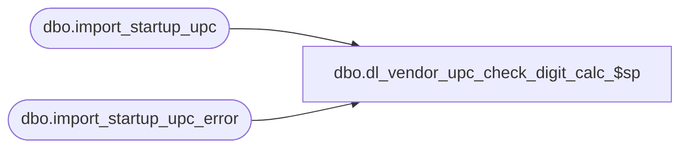

# dbo.dl_vendor_upc_check_digit_calc_$sp

**Database:** me_01  
**Server:** bedrockdb02  

## Architecture Diagram



## Table Dependencies

| Referenced Table |
|---|
| dbo.import_startup_upc |
| dbo.import_startup_upc_error |

## Stored Procedure Code

```sql
CREATE PROCEDURE [dbo].[dl_vendor_upc_check_digit_calc_$sp]
	(@min_import_startup_upc_id DECIMAL(12, 0), 
	 @max_import_startup_upc_id DECIMAL(12,0))
AS

/*
	Version		: 1.00
	Created		: 2011/09/12
	Created by	: Pierrete L.  Part of import UPC process, this procedure is called from dl_validate_import_upc_$sp when the segment parameter
				to validate the check digit calculation is set to True.
	History		: Correction done when the length of UPC Number is 8 digit long.
	History		: 1.01 New segment created (17001) and a new import table is created: import_startup_upc.
*/

BEGIN
	DECLARE @error_flag BIT, @error_msg NVARCHAR(250), @c_vendor_upc_type NCHAR(1), @c_pack_upc_type NCHAR(1), @reportPath NVARCHAR(250);
	
	SELECT @c_vendor_upc_type = N'V', 
		@c_pack_upc_type = N'P';
	
	IF NOT object_id(N'tempdb..#temp_check_digit') IS NULL
		DROP TABLE #temp_check_digit;
		
	CREATE TABLE #temp_check_digit
		(import_startup_upc_id DECIMAL(12,0) NOT NULL,
		check_digit TINYINT NOT NULL,
		total_step_1 SMALLINT NOT NULL,
		total_step_2 SMALLINT NULL,
		total_step_3 SMALLINT NOT NULL,
		total_step_4 SMALLINT NULL,
		total_step_5 SMALLINT NULL);
		
	
	BEGIN TRY
		-- Validate 8 digits upc_number
		INSERT INTO #temp_check_digit
			(import_startup_upc_id, check_digit, total_step_1, total_step_3)
		SELECT import_startup_upc_id,
			CAST(SUBSTRING(i.upc_number, 8, 1) AS TINYINT) check_digit,
			CAST(SUBSTRING(i.upc_number, 1, 1) AS TINYINT) + CAST(SUBSTRING(i.upc_number, 3, 1) AS TINYINT) + 
				CAST(SUBSTRING(i.upc_number, 5, 1) AS TINYINT) + CAST(SUBSTRING(i.upc_number, 7, 1) AS TINYINT) total_step_1,
			CAST(SUBSTRING(i.upc_number, 2, 1) AS TINYINT) + CAST(SUBSTRING(i.upc_number, 4, 1) AS TINYINT) + 
				CAST(SUBSTRING(i.upc_number, 6, 1) AS TINYINT) total_step_3		
		FROM import_startup_upc i
		WHERE i.import_startup_upc_id BETWEEN @min_import_startup_upc_id AND @max_import_startup_upc_id
		AND i.upc_type IN (@c_vendor_upc_type, @c_pack_upc_type)
		AND LEN(i.upc_number) = 8
		AND NOT EXISTS (SELECT 1 FROM import_startup_upc_error e 
						WHERE e.import_startup_upc_id = i.import_startup_upc_id);
						
		UPDATE #temp_check_digit
		SET total_step_2 = 3 * total_step_1,
			total_step_4 = (3 * total_step_1) + total_step_3,
			total_step_5 = 	CASE WHEN(CAST( ((3 * total_step_1) + total_step_3) AS INT) % 10 = 0) THEN 
									CAST( ((3 * total_step_1) + total_step_3) / 10 AS INT) * 10
								 ELSE ((CAST( ((3 * total_step_1) + total_step_3) / 10 AS INT)) + 1) * 10
							END; 
			
		INSERT INTO import_startup_upc_error
			(import_startup_upc_id, upc_number, error_id, row_text)
		SELECT i.import_startup_upc_id, i.upc_number, 6, 
				(i.entity_type + NCHAR(9) + i.action_type + NCHAR(9) + ISNULL(i.vendor_code,N'') + NCHAR(9) + ISNULL(i.vendor_style,N'') + NCHAR(9) + ISNULL(i.color_code,N'') + NCHAR(9) + 
				ISNULL(i.color_short_description,N'') + NCHAR(9) + ISNULL(i.color_long_description,N'') + NCHAR(9) + ISNULL(i.fashion_flag,N'') + NCHAR(9) + 
				ISNULL(i.color_reorder_flag,N'') + NCHAR(9) + ISNULL(CAST(i.nrf_code AS NVARCHAR(10)),N'') + NCHAR(9) + ISNULL(i.size_category_code,N'') + NCHAR(9) +
				ISNULL(i.style_size_code,N'') + NCHAR(9) + ISNULL(i.ticket_label_override,N'') + NCHAR(9) + ISNULL(i.reorder_flag,N'') + NCHAR(9) + i.upc_number + NCHAR(9) +
				i.upc_type + NCHAR(9) + ISNULL(CONVERT(NVARCHAR(10), i.activation_date, 101),N'') + NCHAR(9) + ISNULL(i.pack_code,N'') + NCHAR(9) + 
				ISNULL(CAST(i.first_part_inhouse AS NVARCHAR(3)),N'') + NCHAR(9) + ISNULL(i.style_code,N'')) AS row_text
		FROM #temp_check_digit t, import_startup_upc i
		WHERE i.import_startup_upc_id BETWEEN @min_import_startup_upc_id AND @max_import_startup_upc_id
		AND i.import_startup_upc_id = t.import_startup_upc_id
		AND t.check_digit <> t.total_step_5 - t.total_step_4
		AND NOT EXISTS (SELECT 1 FROM import_startup_upc_error e 
							WHERE e.import_startup_upc_id = i.import_startup_upc_id);
		
		TRUNCATE TABLE #temp_check_digit;
		
		-- Validate 12 digits upc_number
		-- 12 digits upc_number cannot start with 4	
		INSERT INTO #temp_check_digit
			(import_startup_upc_id, check_digit, total_step_1, total_step_3)
		SELECT import_startup_upc_id,
			CAST(SUBSTRING(i.upc_number, 12, 1) AS TINYINT) check_digit,
			CAST(SUBSTRING(i.upc_number, 1, 1) AS TINYINT) + CAST(SUBSTRING(i.upc_number, 3, 1)  AS TINYINT)+ CAST(SUBSTRING(i.upc_number, 5, 1)  AS TINYINT) + 
			CAST(SUBSTRING(i.upc_number, 7, 1) AS TINYINT) + CAST(SUBSTRING(i.upc_number, 9, 1)  AS TINYINT)+ CAST(SUBSTRING(i.upc_number, 11, 1) AS TINYINT) total_step_1,
			CAST(SUBSTRING(i.upc_number, 2, 1) AS TINYINT) + CAST(SUBSTRING(i.upc_number, 4, 1)  AS TINYINT)+ CAST(SUBSTRING(i.upc_number, 6, 1)  AS TINYINT) + 
			CAST(SUBSTRING(i.upc_number, 8, 1) AS TINYINT) + CAST(SUBSTRING(i.upc_number, 10, 1)  AS TINYINT) total_step_3		
		FROM import_startup_upc i
		WHERE i.import_startup_upc_id BETWEEN @min_import_startup_upc_id AND @max_import_startup_upc_id
		AND i.upc_type IN (@c_vendor_upc_type, @c_pack_upc_type)
		AND LEN(i.upc_number) = 12
		AND NOT EXISTS (SELECT 1 FROM import_startup_upc_error e 
						WHERE e.import_startup_upc_id = i.import_startup_upc_id);
						
		UPDATE #temp_check_digit
		SET total_step_2 = 3 * total_step_1,
			total_step_4 = (3 * total_step_1) + total_step_3,
			total_step_5 = 	CASE WHEN(CAST( ((3 * total_step_1) + total_step_3) AS INT) % 10 = 0) THEN 
									CAST( ((3 * total_step_1) + total_step_3) / 10 AS INT) * 10
								 ELSE ((CAST( ((3 * total_step_1) + total_step_3) / 10 AS INT)) + 1) * 10
							END; 
			
		INSERT INTO import_startup_upc_error
			(import_startup_upc_id, upc_number, error_id, row_text)
		SELECT i.import_startup_upc_id, i.upc_number, 6, 
				(i.entity_type + NCHAR(9) + i.action_type + NCHAR(9) + ISNULL(i.vendor_code,N'') + NCHAR(9) + ISNULL(i.vendor_style,N'') + NCHAR(9) + ISNULL(i.color_code,N'') + NCHAR(9) + 
				ISNULL(i.color_short_description,N'') + NCHAR(9) + ISNULL(i.color_long_description,N'') + NCHAR(9) + ISNULL(i.fashion_flag,N'') + NCHAR(9) + 
				ISNULL(i.color_reorder_flag,N'') + NCHAR(9) + ISNULL(CAST(i.nrf_code AS NVARCHAR(10)),N'') + NCHAR(9) + ISNULL(i.size_category_code,N'') + NCHAR(9) +
				ISNULL(i.style_size_code,N'') + NCHAR(9) + ISNULL(i.ticket_label_override,N'') + NCHAR(9) + ISNULL(i.reorder_flag,N'') + NCHAR(9) + i.upc_number + NCHAR(9) +
				i.upc_type + NCHAR(9) + ISNULL(CONVERT(NVARCHAR(10), i.activation_date, 101),N'') + NCHAR(9) + ISNULL(i.pack_code,N'') + NCHAR(9) + 
				ISNULL(CAST(i.first_part_inhouse AS NVARCHAR(3)),N'') + NCHAR(9) + ISNULL(i.style_code,N'')) AS row_text
		FROM #temp_check_digit t, import_startup_upc i
		WHERE i.import_startup_upc_id BETWEEN @min_import_startup_upc_id AND @max_import_startup_upc_id
		AND i.import_startup_upc_id = t.import_startup_upc_id
		AND t.check_digit <> t.total_step_5 - t.total_step_4
		AND NOT EXISTS (SELECT 1 FROM import_startup_upc_error e 
							WHERE e.import_startup_upc_id = i.import_startup_upc_id);
		
		TRUNCATE TABLE #temp_check_digit;
		
		-- Validate 13 digits upc_number
		INSERT INTO #temp_check_digit
			(import_startup_upc_id, check_digit, total_step_1, total_step_3)
		SELECT import_startup_upc_id,
			CAST(SUBSTRING(i.upc_number, 13, 1) AS TINYINT) check_digit,
			CAST(SUBSTRING(i.upc_number, 2, 1) AS TINYINT) + CAST(SUBSTRING(i.upc_number, 4, 1) AS TINYINT) + CAST(SUBSTRING(i.upc_number, 6, 1) AS TINYINT) + 
			CAST(SUBSTRING(i.upc_number, 8, 1) AS TINYINT) + CAST(SUBSTRING(i.upc_number, 10, 1) AS TINYINT) + CAST(SUBSTRING(i.upc_number, 12, 1) AS TINYINT) total_step_1,
			CAST(SUBSTRING(i.upc_number, 1, 1) AS TINYINT) + CAST(SUBSTRING(i.upc_number, 3, 1) AS TINYINT) + CAST(SUBSTRING(i.upc_number, 5, 1) AS TINYINT) + 
			CAST(SUBSTRING(i.upc_number, 7, 1) AS TINYINT) + CAST(SUBSTRING(i.upc_number, 9, 1) AS TINYINT) + CAST(SUBSTRING(i.upc_number, 11, 1) AS TINYINT) total_step_3		
		FROM import_startup_upc i
		WHERE i.import_startup_upc_id BETWEEN @min_import_startup_upc_id AND @max_import_startup_upc_id
		AND i.upc_type IN (@c_vendor_upc_type, @c_pack_upc_type)
		AND LEN(i.upc_number) = 13
		AND NOT EXISTS (SELECT 1 FROM import_startup_upc_error e 
						WHERE e.import_startup_upc_id = i.import_startup_upc_id);
						
		UPDATE #temp_check_digit
		SET total_step_2 = 3 * total_step_1,
			total_step_4 = (3 * total_step_1) + total_step_3,
			total_step_5 = 	CASE WHEN(CAST( ((3 * total_step_1) + total_step_3) AS INT) % 10 = 0) THEN 
									CAST( ((3 * total_step_1) + total_step_3) / 10 AS INT) * 10
								 ELSE ((CAST( ((3 * total_step_1) + total_step_3) / 10 AS INT)) + 1) * 10
							END; 
			
		INSERT INTO import_startup_upc_error
			(import_startup_upc_id, upc_number, error_id, row_text)
		SELECT i.import_startup_upc_id, i.upc_number, 6, 
				(i.entity_type + NCHAR(9) + i.action_type + NCHAR(9) + ISNULL(i.vendor_code,N'') + NCHAR(9) + ISNULL(i.vendor_style,N'') + NCHAR(9) + ISNULL(i.color_code,N'') + NCHAR(9) + 
				ISNULL(i.color_short_description,N'') + NCHAR(9) + ISNULL(i.color_long_description,N'') + NCHAR(9) + ISNULL(i.fashion_flag,N'') + NCHAR(9) + 
				ISNULL(i.color_reorder_flag,N'') + NCHAR(9) + ISNULL(CAST(i.nrf_code AS NVARCHAR(10)),N'') + NCHAR(9) + ISNULL(i.size_category_code,N'') + NCHAR(9) +
				ISNULL(i.style_size_code,N'') + NCHAR(9) + ISNULL(i.ticket_label_override,N'') + NCHAR(9) + ISNULL(i.reorder_flag,N'') + NCHAR(9) + i.upc_number + NCHAR(9) +
				i.upc_type + NCHAR(9) + ISNULL(CONVERT(NVARCHAR(10), i.activation_date, 101),N'') + NCHAR(9) + ISNULL(i.pack_code,N'') + NCHAR(9) + 
				ISNULL(CAST(i.first_part_inhouse AS NVARCHAR(3)),N'') + NCHAR(9) + ISNULL(i.style_code,N'')) AS row_text
		FROM #temp_check_digit t, import_startup_upc i
		WHERE i.import_startup_upc_id BETWEEN @min_import_startup_upc_id AND @max_import_startup_upc_id
		AND i.import_startup_upc_id = t.import_startup_upc_id
		AND t.check_digit <> t.total_step_5 - t.total_step_4
		AND NOT EXISTS (SELECT 1 FROM import_startup_upc_error e 
							WHERE e.import_startup_upc_id = i.import_startup_upc_id);
		
		TRUNCATE TABLE #temp_check_digit;
		
		-- Validate 14 digits upc_number
		INSERT INTO #temp_check_digit
			(import_startup_upc_id, check_digit, total_step_1, total_step_3)
		SELECT import_startup_upc_id,
			CAST(SUBSTRING(i.upc_number, 14, 1) AS TINYINT)  check_digit,
			CAST(SUBSTRING(i.upc_number, 1, 1) AS TINYINT) + CAST(SUBSTRING(i.upc_number, 3, 1) AS TINYINT) + CAST(SUBSTRING(i.upc_number, 5, 1) AS TINYINT) + 
			CAST(SUBSTRING(i.upc_number, 7, 1) AS TINYINT) + CAST(SUBSTRING(i.upc_number, 9, 1) AS TINYINT) + CAST(SUBSTRING(i.upc_number, 11, 1) AS TINYINT) +
			CAST(SUBSTRING(i.upc_number, 13, 1) AS TINYINT) total_step_1,			
			CAST(SUBSTRING(i.upc_number, 2, 1) AS TINYINT) + CAST(SUBSTRING(i.upc_number, 4, 1) AS TINYINT) + CAST(SUBSTRING(i.upc_number, 6, 1) AS TINYINT) + 
			CAST(SUBSTRING(i.upc_number, 8, 1) AS TINYINT) + CAST(SUBSTRING(i.upc_number, 10, 1) AS TINYINT) + CAST(SUBSTRING(i.upc_number, 12, 1) AS TINYINT) total_step_3			
		FROM import_startup_upc i
		WHERE i.import_startup_upc_id BETWEEN @min_import_startup_upc_id AND @max_import_startup_upc_id
		AND i.upc_type IN (@c_vendor_upc_type, @c_pack_upc_type)
		AND LEN(i.upc_number) = 14
		AND NOT EXISTS (SELECT 1 FROM import_startup_upc_error e 
						WHERE e.import_startup_upc_id = i.import_startup_upc_id);
						
		UPDATE #temp_check_digit
		SET total_step_2 = 3 * total_step_1,
			total_step_4 = (3 * total_step_1) + total_step_3,
			total_step_5 = 	CASE WHEN(CAST( ((3 * total_step_1) + total_step_3) AS INT) % 10 = 0) THEN 
									CAST( ((3 * total_step_1) + total_step_3) / 10 AS INT) * 10
								 ELSE ((CAST( ((3 * total_step_1) + total_step_3) / 10 AS INT)) + 1) * 10
							END; 
			
		INSERT INTO import_startup_upc_error
			(import_startup_upc_id, upc_number, error_id, row_text)
		SELECT i.import_startup_upc_id, i.upc_number, 6, 
				(i.entity_type + NCHAR(9) + i.action_type + NCHAR(9) + ISNULL(i.vendor_code,N'') + NCHAR(9) + ISNULL(i.vendor_style,N'') + NCHAR(9) + ISNULL(i.color_code,N'') + NCHAR(9) + 
				ISNULL(i.color_short_description,N'') + NCHAR(9) + ISNULL(i.color_long_description,N'') + NCHAR(9) + ISNULL(i.fashion_flag,N'') + NCHAR(9) + 
				ISNULL(i.color_reorder_flag,N'') + NCHAR(9) + ISNULL(CAST(i.nrf_code AS NVARCHAR(10)),N'') + NCHAR(9) + ISNULL(i.size_category_code,N'') + NCHAR(9) +
				ISNULL(i.style_size_code,N'') + NCHAR(9) + ISNULL(i.ticket_label_override,N'') + NCHAR(9) + ISNULL(i.reorder_flag,N'') + NCHAR(9) + i.upc_number + NCHAR(9) +
				i.upc_type + NCHAR(9) + ISNULL(CONVERT(NVARCHAR(10), i.activation_date, 101),N'') + NCHAR(9) + ISNULL(i.pack_code,N'') + NCHAR(9) + 
				ISNULL(CAST(i.first_part_inhouse AS NVARCHAR(3)),N'') + NCHAR(9) + ISNULL(i.style_code,N'')) AS row_text
		FROM #temp_check_digit t, import_startup_upc i
		WHERE i.import_startup_upc_id BETWEEN @min_import_startup_upc_id AND @max_import_startup_upc_id
		AND i.import_startup_upc_id = t.import_startup_upc_id
		AND t.check_digit <> t.total_step_5 - t.total_step_4
		AND NOT EXISTS (SELECT 1 FROM import_startup_upc_error e 
							WHERE e.import_startup_upc_id = i.import_startup_upc_id);
		
		TRUNCATE TABLE #temp_check_digit;

	END TRY
	BEGIN CATCH
		SET @error_msg = N'Error when executing procedure dl_vendor_upc_check_digit_calc_$sp  : ' + CAST(ERROR_NUMBER() AS NVARCHAR) + N' ' + ERROR_MESSAGE()
		RAISERROR (@error_msg, 16, 1)
	END CATCH
END;
```

