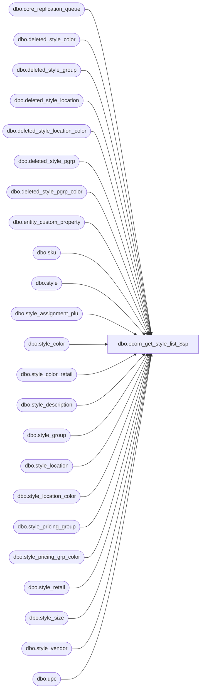

# dbo.ecom_get_style_list_$sp

**Database:** me_01  
**Server:** bedrockdb02  

## Architecture Diagram



## Table Dependencies

| Referenced Table |
|---|
| dbo.core_replication_queue |
| dbo.deleted_style_color |
| dbo.deleted_style_group |
| dbo.deleted_style_location |
| dbo.deleted_style_location_color |
| dbo.deleted_style_pgrp |
| dbo.deleted_style_pgrp_color |
| dbo.entity_custom_property |
| dbo.sku |
| dbo.style |
| dbo.style_assignment_plu |
| dbo.style_color |
| dbo.style_color_retail |
| dbo.style_description |
| dbo.style_group |
| dbo.style_location |
| dbo.style_location_color |
| dbo.style_pricing_group |
| dbo.style_pricing_grp_color |
| dbo.style_retail |
| dbo.style_size |
| dbo.style_vendor |
| dbo.upc |

## Stored Procedure Code

```sql
CREATE PROCEDURE [dbo].[ecom_get_style_list_$sp]
(@p_start_id DECIMAL(12), @p_end_id DECIMAL(12))
AS

DECLARE @line_id INT
		, @table_name NVARCHAR(30), @operation_name NVARCHAR(50)
		, @sql_err_num DECIMAL(38,0), @error_msg NVARCHAR(2000)
		, @error_severity SMALLINT, @error_state SMALLINT
		
/*
	Version		: 1.00
	Created		: Feb 2011
	Created by	: Michael Estey
	Description	: Procedure called by Nsb.MerchANDising.ECommerce.exe. 
				  Get a list of styles 
				  that are in the core_replication_queue in the range defined by @p_start_id AND @p_end_id 
				  
	Call FROM C# code:
		-- File: Exporter.cs
		-- Class: Nsb.MerchANDising.ECommerce.Exporter
		-- Function: GetStyleList		
	
HISTORY:
Date       		Name         	Def#		Desc
Feb 23,11		Michael Estey	N/A			Initial Release
*/		
		
BEGIN TRY

	-- create temp table to hold our results
	SET @line_id = 2
	IF NOT object_id(N'tempdb..#style_list_export') IS NULL
	DROP TABLE #style_list_export

	CREATE TABLE #style_list_export
	( 
		style_code NVARCHAR(20),
		insert_flag INT, update_flag INT, delete_flag INT,
		core_replication_queue_id DECIMAL(12),
		PRIMARY KEY (style_code) 
	)
	
	-- create temp table to store core_replication_queue values so we don't select from the entire table each time
	SET @line_id = 5
	
	IF NOT object_id(N'tempdb..#crq') IS NULL
	DROP TABLE #crq

	CREATE TABLE #crq
	( 	
		core_replication_queue_id decimal(12, 0) NOT NULL,
		entity_code smallint NOT NULL,
		replication_action nvarchar(2) NOT NULL,
		action_date smalldatetime NOT NULL,
		entity_id decimal(15, 0) NOT NULL,
		other_entity_id decimal(15, 0) NULL,
		primary_entity_key nvarchar(20) NULL,
		secondary_entity_key nvarchar(20) NULL,
		replication_data nvarchar(105) NOT NULL,
		PRIMARY KEY (core_replication_queue_id) 
	)	
	
	INSERT INTO #crq
	( 
		core_replication_queue_id, entity_code, replication_action, action_date, entity_id,	other_entity_id,
		primary_entity_key,	secondary_entity_key, replication_data
	)
	SELECT
		core_replication_queue_id, entity_code,	replication_action,	action_date, entity_id,	other_entity_id,
		primary_entity_key,	secondary_entity_key, replication_data
	FROM core_replication_queue
	WHERE core_replication_queue_id > @p_start_id AND core_replication_queue_id <= @p_end_id
		
	-- Entity Code 301: Style Update
	SET @line_id = 10
	
	INSERT INTO #style_list_export
		( style_code
		, insert_flag, update_flag, delete_flag
		, core_replication_queue_id )
	SELECT 
		style_code, 
		SUM(insert_flag) insert_flag, SUM(update_flag) update_flag, SUM(delete_flag) delete_flag, 
		MAX(core_replication_queue_id) core_replication_queue_id
	FROM
	(
		SELECT
			s.style_code, 
			1 insert_flag, 0 update_flag, 0 delete_flag, 
			core_replication_queue_id
		FROM #crq q
		INNER JOIN style s ON q.entity_id = s.style_id
		WHERE 
			entity_code = 301
			AND core_replication_queue_id > @p_start_id AND core_replication_queue_id <= @p_end_id
			AND replication_action = N'I'
		UNION ALL
		SELECT 
			s.style_code, 
			0 insert_flag, 1 update_flag, 0 delete_flag, 
			core_replication_queue_id
		FROM #crq q
		INNER JOIN style s ON q.entity_id = s.style_id
		WHERE 
			entity_code = 301
			AND core_replication_queue_id > @p_start_id AND core_replication_queue_id <= @p_end_id
			AND replication_action = N'U'
		UNION ALL
		SELECT 
			primary_entity_key style_code, 
			0 insert_flag, 0 update_flag, 1 delete_flag, 
			core_replication_queue_id
		FROM #crq q
		WHERE 
			entity_code = 301
			AND core_replication_queue_id > @p_start_id AND core_replication_queue_id <= @p_end_id
			AND replication_action = N'D'
	) T
	GROUP BY style_code
	HAVING SUM(insert_flag) + SUM(delete_flag) < 2

	-- Entity Code 311: Style Color Update
	SET @line_id = 20
	
	INSERT INTO #style_list_export
		( style_code
		, insert_flag, update_flag, delete_flag
		, core_replication_queue_id )
	SELECT 
		T.style_code, 
		SUM(T.insert_flag) insert_flag, SUM(T.update_flag) update_flag, SUM(T.delete_flag) delete_flag, 
		MAX(T.core_replication_queue_id) core_replication_queue_id
	FROM
	(
		SELECT
			s.style_code, 
			0 insert_flag, 1 update_flag, 0 delete_flag, 
			core_replication_queue_id
		FROM #crq q
		INNER JOIN style_color sc ON q.entity_id = sc.style_color_id
		INNER JOIN style s ON sc.style_id = s.style_id
		WHERE 
			entity_code = 311
			AND core_replication_queue_id > @p_start_id AND core_replication_queue_id <= @p_end_id
			AND replication_action in (N'I', N'U', N'D')
	) T
	LEFT OUTER JOIN #style_list_export x ON T.style_code = x.style_code
	WHERE
		x.style_code IS NULL
	GROUP BY T.style_code
	HAVING SUM(T.insert_flag) + SUM(T.delete_flag) < 2
	
	-- Entity Code 321, 326: Style Size Update
	SET @line_id = 30
	
	INSERT INTO #style_list_export
		( style_code
		, insert_flag, update_flag, delete_flag
		, core_replication_queue_id )
	SELECT 
		T.style_code, 
		SUM(T.insert_flag) insert_flag, SUM(T.update_flag) update_flag, SUM(T.delete_flag) delete_flag, 
		MAX(T.core_replication_queue_id) core_replication_queue_id
	FROM
	(
		SELECT
			s.style_code, 
			0 insert_flag, 1 update_flag, 0 delete_flag, 
			core_replication_queue_id
		FROM #crq q
		INNER JOIN style_size sc ON q.entity_id = sc.style_size_id
		INNER JOIN style s ON sc.style_id = s.style_id
		WHERE 
			entity_code in (321, 326)
			AND core_replication_queue_id > @p_start_id AND core_replication_queue_id <= @p_end_id
			AND replication_action in (N'I', N'U', N'D')	
	) T
	LEFT OUTER JOIN #style_list_export x ON T.style_code = x.style_code
	WHERE
		x.style_code IS NULL
	GROUP BY T.style_code
	HAVING SUM(T.insert_flag) + SUM(T.delete_flag) < 2
	
	-- Entity Code 421: Style Vendor Update
	SET @line_id = 40
	
	INSERT INTO #style_list_export
		( style_code
		, insert_flag, update_flag, delete_flag
		, core_replication_queue_id )
	SELECT 
		T.style_code, 
		SUM(T.insert_flag) insert_flag, SUM(T.update_flag) update_flag, SUM(T.delete_flag) delete_flag, 
		MAX(T.core_replication_queue_id) core_replication_queue_id
	FROM
	(
		SELECT
			s.style_code, 
			0 insert_flag, 1 update_flag, 0 delete_flag, 
			core_replication_queue_id
		FROM #crq q
		INNER JOIN style_vendor sc ON q.entity_id = sc.style_vendor_id
		INNER JOIN style s ON sc.style_id = s.style_id
		WHERE 
			entity_code = 421
			AND core_replication_queue_id > @p_start_id AND core_replication_queue_id <= @p_end_id
			AND replication_action in (N'I', N'U', N'D')
	) T
	LEFT OUTER JOIN #style_list_export x ON T.style_code = x.style_code
	WHERE
		x.style_code IS NULL
	GROUP BY T.style_code
	HAVING SUM(T.insert_flag) + SUM(T.delete_flag) < 2
	
	-- Entity Code 221, 271: Style group Update
	SET @line_id = 50
	
	INSERT INTO #style_list_export
		( style_code
		, insert_flag, update_flag, delete_flag
		, core_replication_queue_id )
	SELECT 
		T.style_code, 
		SUM(T.insert_flag) insert_flag, SUM(T.update_flag) update_flag, SUM(T.delete_flag) delete_flag, 
		MAX(T.core_replication_queue_id) core_replication_queue_id
	FROM
	(
		SELECT
			s.style_code, 
			0 insert_flag, 1 update_flag, 0 delete_flag, 
			core_replication_queue_id
		FROM #crq q
		INNER JOIN style_group sc ON q.entity_id = sc.style_group_id
		INNER JOIN style s ON sc.style_id = s.style_id
		WHERE 
			entity_code in (221, 271)
			AND core_replication_queue_id > @p_start_id AND core_replication_queue_id <= @p_end_id
			AND replication_action in (N'I', N'U')
		UNION ALL
		SELECT 
			s.style_code, 
			0 insert_flag, 1 update_flag, 0 delete_flag, 
			core_replication_queue_id
		FROM #crq q
		INNER JOIN deleted_style_group sc ON q.entity_id = sc.style_group_id
		INNER JOIN style s ON sc.style_id = s.style_id
		WHERE 
			entity_code in (221, 271)
			AND core_replication_queue_id > @p_start_id AND core_replication_queue_id <= @p_end_id
			AND replication_action = N'D'
	) T
	LEFT OUTER JOIN #style_list_export x ON T.style_code = x.style_code
	WHERE
		x.style_code IS NULL
	GROUP BY T.style_code
	HAVING SUM(T.insert_flag) + SUM(T.delete_flag) < 2
	
	-- Entity Code 310: Style description Update
	SET @line_id = 60
	
	INSERT INTO #style_list_export
		( style_code
		, insert_flag, update_flag, delete_flag
		, core_replication_queue_id )
	SELECT 
		T.style_code, 
		SUM(T.insert_flag) insert_flag, SUM(T.update_flag) update_flag, SUM(T.delete_flag) delete_flag, 
		MAX(T.core_replication_queue_id) core_replication_queue_id
	FROM
	(
		SELECT
			s.style_code, 
			0 insert_flag, 1 update_flag, 0 delete_flag, 
			core_replication_queue_id
		FROM #crq q
		INNER JOIN style_description sc ON q.entity_id = sc.style_description_id
		INNER JOIN style s ON sc.style_id = s.style_id
		WHERE 
			entity_code = 310
			AND core_replication_queue_id > @p_start_id AND core_replication_queue_id <= @p_end_id
			AND replication_action in (N'I', N'U', N'D')
	) T
	LEFT OUTER JOIN #style_list_export x ON T.style_code = x.style_code
	WHERE
		x.style_code IS NULL
	GROUP BY T.style_code
	HAVING SUM(T.insert_flag) + SUM(T.delete_flag) < 2
	
	-- Entity Code 512: Style attribute set Update
	SET @line_id = 70
	
	INSERT INTO #style_list_export
		( style_code
		, insert_flag, update_flag, delete_flag
		, core_replication_queue_id )
	SELECT 
		T.style_code, 
		SUM(T.insert_flag) insert_flag, SUM(T.update_flag) update_flag, SUM(T.delete_flag) delete_flag, 
		MAX(T.core_replication_queue_id) core_replication_queue_id
	FROM
	(
		SELECT
			s.style_code, 
			0 insert_flag, 1 update_flag, 0 delete_flag, 
			core_replication_queue_id
		FROM #crq q
		INNER JOIN style s ON CONVERT(DECIMAL(12), q.primary_entity_key) = s.style_id
		WHERE 
			entity_code = 512
			AND core_replication_queue_id > @p_start_id AND core_replication_queue_id <= @p_end_id
			AND replication_action in (N'I', N'U', N'X')
			AND primary_entity_key != N'N/A'	--there are cases where an 'N/A' show up instead of a style_id, at the tiem of this code I have no knowledge of how this is possible but it does cause issues, for now we have to ignore them
	) T
	LEFT OUTER JOIN #style_list_export x ON T.style_code = x.style_code
	WHERE
		x.style_code IS NULL
	GROUP BY T.style_code
	HAVING SUM(T.insert_flag) + SUM(T.delete_flag) < 2
	
	-- Entity Code 622: Style custom property Update
	SET @line_id = 80
	
	INSERT INTO #style_list_export
		( style_code
		, insert_flag, update_flag, delete_flag
		, core_replication_queue_id )
	SELECT 
		T.style_code, 
		SUM(T.insert_flag) insert_flag, SUM(T.update_flag) update_flag, SUM(T.delete_flag) delete_flag, 
		MAX(T.core_replication_queue_id) core_replication_queue_id
	FROM
	(
		SELECT
			s.style_code, 
			0 insert_flag, 1 update_flag, 0 delete_flag, 
			core_replication_queue_id
		FROM #crq q
		INNER JOIN entity_custom_property sc ON q.entity_id = sc.entity_custom_property_id
		INNER JOIN style s ON sc.parent_id = s.style_id
		WHERE 
			entity_code = 622
			AND core_replication_queue_id > @p_start_id AND core_replication_queue_id <= @p_end_id
			AND replication_action in (N'I', N'U', N'D')
	) T
	LEFT OUTER JOIN #style_list_export x ON T.style_code = x.style_code
	WHERE
		x.style_code IS NULL
	GROUP BY T.style_code
	HAVING SUM(T.insert_flag) + SUM(T.delete_flag) < 2
	
	-- Entity Code 316: Style retail Update
	SET @line_id = 90
	
	INSERT INTO #style_list_export
		( style_code
		, insert_flag, update_flag, delete_flag
		, core_replication_queue_id )
	SELECT 
		T.style_code, 
		SUM(T.insert_flag) insert_flag, SUM(T.update_flag) update_flag, SUM(T.delete_flag) delete_flag, 
		MAX(T.core_replication_queue_id) core_replication_queue_id
	FROM
	(
		SELECT
			s.style_code, 
			0 insert_flag, 1 update_flag, 0 delete_flag, 
			core_replication_queue_id
		FROM #crq q
		INNER JOIN style_retail sc ON q.entity_id = sc.style_retail_id
		INNER JOIN style s ON sc.style_id = s.style_id
		WHERE 
			entity_code = 316
			AND core_replication_queue_id > @p_start_id AND core_replication_queue_id <= @p_end_id
			AND replication_action in (N'I', N'U', N'D')
	) T
	LEFT OUTER JOIN #style_list_export x ON T.style_code = x.style_code
	WHERE
		x.style_code IS NULL
	GROUP BY T.style_code
	HAVING SUM(T.insert_flag) + SUM(T.delete_flag) < 2
	
	-- Entity Code 317: Style color retail Update
	SET @line_id = 100
	
	INSERT INTO #style_list_export
		( style_code
		, insert_flag, update_flag, delete_flag
		, core_replication_queue_id )
	SELECT 
		T.style_code, 
		SUM(T.insert_flag) insert_flag, SUM(T.update_flag) update_flag, SUM(T.delete_flag) delete_flag, 
		MAX(T.core_replication_queue_id) core_replication_queue_id
	FROM
	(
		SELECT
			s.style_code, 
			0 insert_flag, 1 update_flag, 0 delete_flag, 
			core_replication_queue_id
		FROM #crq q
		INNER JOIN style_color_retail sc ON q.entity_id = sc.style_color_retail_id
		INNER JOIN style s ON sc.style_id = s.style_id
		WHERE 
			entity_code = 317
			AND core_replication_queue_id > @p_start_id AND core_replication_queue_id <= @p_end_id
			AND replication_action in (N'I', N'U')
		UNION ALL
		SELECT
			s.style_code, 
			0 insert_flag, 1 update_flag, 0 delete_flag, 
			core_replication_queue_id
		FROM #crq q
		INNER JOIN deleted_style_color sc ON q.entity_id = sc.style_color_id
		INNER JOIN style s ON sc.style_id = s.style_id
		WHERE 
			entity_code = 317
			AND core_replication_queue_id > @p_start_id AND core_replication_queue_id <= @p_end_id
			AND replication_action = N'D'
	) T
	LEFT OUTER JOIN #style_list_export x ON T.style_code = x.style_code
	WHERE
		x.style_code IS NULL
	GROUP BY T.style_code
	HAVING SUM(T.insert_flag) + SUM(T.delete_flag) < 2
	
	-- Entity Code 313: Style location Update
	SET @line_id = 110
	
	INSERT INTO #style_list_export
		( style_code
		, insert_flag, update_flag, delete_flag
		, core_replication_queue_id )
	SELECT 
		T.style_code, 
		SUM(T.insert_flag) insert_flag, SUM(T.update_flag) update_flag, SUM(T.delete_flag) delete_flag, 
		MAX(T.core_replication_queue_id) core_replication_queue_id
	FROM
	(
		SELECT
			s.style_code, 
			0 insert_flag, 1 update_flag, 0 delete_flag, 
			core_replication_queue_id
		FROM #crq q
		INNER JOIN style_location sc ON q.entity_id = sc.style_location_id
		INNER JOIN style s ON sc.style_id = s.style_id
		WHERE 
			entity_code = 313
			AND core_replication_queue_id > @p_start_id AND core_replication_queue_id <= @p_end_id
			AND replication_action in (N'I', N'U')
		UNION ALL
		SELECT
			s.style_code, 
			0 insert_flag, 1 update_flag, 0 delete_flag, 
			core_replication_queue_id
		FROM #crq q
		INNER JOIN deleted_style_location sc ON q.entity_id = sc.style_location_id
		INNER JOIN style s ON sc.style_id = s.style_id
		WHERE 
			entity_code = 313
			AND core_replication_queue_id > @p_start_id AND core_replication_queue_id <= @p_end_id
			AND replication_action = N'D'
		
	) T
	LEFT OUTER JOIN #style_list_export x ON T.style_code = x.style_code
	WHERE
		x.style_code IS NULL
	GROUP BY T.style_code
	HAVING SUM(T.insert_flag) + SUM(T.delete_flag) < 2
	
	-- Entity Code 312: Style location/color Update
	SET @line_id = 120
	
	INSERT INTO #style_list_export
		( style_code
		, insert_flag, update_flag, delete_flag
		, core_replication_queue_id )
	SELECT 
		T.style_code, 
		SUM(T.insert_flag) insert_flag, SUM(T.update_flag) update_flag, SUM(T.delete_flag) delete_flag, 
		MAX(T.core_replication_queue_id) core_replication_queue_id
	FROM
	(
		SELECT
			s.style_code, 
			0 insert_flag, 1 update_flag, 0 delete_flag, 
			core_replication_queue_id
		FROM #crq q
		INNER JOIN style_location_color sc ON q.entity_id = sc.style_location_color_id
		INNER JOIN style s ON sc.style_id = s.style_id
		WHERE 
			entity_code = 312
			AND core_replication_queue_id > @p_start_id AND core_replication_queue_id <= @p_end_id
			AND replication_action in (N'I', N'U')
		UNION ALL
		SELECT
			s.style_code, 
			0 insert_flag, 1 update_flag, 0 delete_flag, 
			core_replication_queue_id
		FROM #crq q
		INNER JOIN deleted_style_location_color sc ON q.entity_id = sc.style_location_color_id
		INNER JOIN style s ON sc.style_id = s.style_id
		WHERE 
			entity_code = 312
			AND core_replication_queue_id > @p_start_id AND core_replication_queue_id <= @p_end_id
			AND replication_action = N'D'
	) T
	LEFT OUTER JOIN #style_list_export x ON T.style_code = x.style_code
	WHERE
		x.style_code IS NULL
	GROUP BY T.style_code
	HAVING SUM(T.insert_flag) + SUM(T.delete_flag) < 2
	
	-- Entity Code 314: Style price group Update
	SET @line_id = 130
	
	INSERT INTO #style_list_export
		( style_code
		, insert_flag, update_flag, delete_flag
		, core_replication_queue_id )
	SELECT 
		T.style_code, 
		SUM(T.insert_flag) insert_flag, SUM(T.update_flag) update_flag, SUM(T.delete_flag) delete_flag, 
		MAX(T.core_replication_queue_id) core_replication_queue_id
	FROM
	(
		SELECT
			s.style_code, 
			0 insert_flag, 1 update_flag, 0 delete_flag, 
			core_replication_queue_id
		FROM #crq q
		INNER JOIN style_pricing_group sc ON q.entity_id = sc.style_pricing_group_id
		INNER JOIN style s ON sc.style_id = s.style_id
		WHERE 
			entity_code = 314
			AND core_replication_queue_id > @p_start_id AND core_replication_queue_id <= @p_end_id
			AND replication_action in (N'I', N'U')
		UNION ALL
		SELECT
			s.style_code, 
			0 insert_flag, 1 update_flag, 0 delete_flag, 
			core_replication_queue_id
		FROM #crq q
		INNER JOIN deleted_style_pgrp sc ON q.entity_id = sc.style_pricing_group_id
		INNER JOIN style s ON sc.style_id = s.style_id
		WHERE 
			entity_code = 314
			AND core_replication_queue_id > @p_start_id AND core_replication_queue_id <= @p_end_id
			AND replication_action = N'D'
	) T
	LEFT OUTER JOIN #style_list_export x ON T.style_code = x.style_code
	WHERE
		x.style_code IS NULL
	GROUP BY T.style_code
	HAVING SUM(T.insert_flag) + SUM(T.delete_flag) < 2
	
	-- Entity Code 315: Style price group color Update
	SET @line_id = 140
	
	INSERT INTO #style_list_export
		( style_code
		, insert_flag, update_flag, delete_flag
		, core_replication_queue_id )
	SELECT 
		T.style_code, 
		SUM(T.insert_flag) insert_flag, SUM(T.update_flag) update_flag, SUM(T.delete_flag) delete_flag, 
		MAX(T.core_replication_queue_id) core_replication_queue_id
	FROM
	(
		SELECT
			s.style_code, 
			0 insert_flag, 1 update_flag, 0 delete_flag, 
			core_replication_queue_id
		FROM #crq q
		INNER JOIN style_pricing_grp_color sc ON q.entity_id = sc.style_pricing_grp_color_id
		INNER JOIN style s ON sc.style_id = s.style_id
		WHERE 
			entity_code = 315
			AND core_replication_queue_id > @p_start_id AND core_replication_queue_id <= @p_end_id
			AND replication_action in (N'I', N'U')
		UNION ALL
		SELECT
			s.style_code, 
			0 insert_flag, 1 update_flag, 0 delete_flag, 
			core_replication_queue_id
		FROM #crq q
		INNER JOIN deleted_style_pgrp_color sc ON q.entity_id = sc.style_pricing_grp_color_id
		INNER JOIN style s ON sc.style_id = s.style_id
		WHERE 
			entity_code = 315
			AND core_replication_queue_id > @p_start_id AND core_replication_queue_id <= @p_end_id
			AND replication_action = N'D'
	) T
	LEFT OUTER JOIN #style_list_export x ON T.style_code = x.style_code
	WHERE
		x.style_code IS NULL
	GROUP BY T.style_code
	HAVING SUM(T.insert_flag) + SUM(T.delete_flag) < 2
	
	-- Entity Code 911: Style assignment plu
	SET @line_id = 150
	
	INSERT INTO #style_list_export
		( style_code
		, insert_flag, update_flag, delete_flag
		, core_replication_queue_id )
	SELECT 
		T.style_code, 
		SUM(T.insert_flag) insert_flag, SUM(T.update_flag) update_flag, SUM(T.delete_flag) delete_flag, 
		MAX(T.core_replication_queue_id) core_replication_queue_id
	FROM
	(
		SELECT
			s.style_code, 
			0 insert_flag, 1 update_flag, 0 delete_flag, 
			core_replication_queue_id
		FROM #crq q
		INNER JOIN style_assignment_plu sc ON q.entity_id = sc.style_assignment_plu_id
		INNER JOIN style s ON sc.style_id = s.style_id
		WHERE 
			entity_code = 911
			AND core_replication_queue_id > @p_start_id AND core_replication_queue_id <= @p_end_id
			AND replication_action in (N'I', N'U', N'D')
	) T
	LEFT OUTER JOIN #style_list_export x ON T.style_code = x.style_code
	WHERE
		x.style_code IS NULL
	GROUP BY T.style_code
	HAVING SUM(T.insert_flag) + SUM(T.delete_flag) < 2
	
	-- Entity Code 361: vendor upc assignment
	SET @line_id = 160
	
	INSERT INTO #style_list_export
		( style_code
		, insert_flag, update_flag, delete_flag
		, core_replication_queue_id )
	SELECT 
		T.style_code, 
		SUM(T.insert_flag) insert_flag, SUM(T.update_flag) update_flag, SUM(T.delete_flag) delete_flag, 
		MAX(T.core_replication_queue_id) core_replication_queue_id
	FROM
	(
		SELECT
			s.style_code, 
			0 insert_flag, 1 update_flag, 0 delete_flag, 
			core_replication_queue_id
		FROM #crq q
		INNER JOIN upc u ON q.entity_id = u.upc_id
		INNER JOIN sku sk ON u.sku_id = sk.sku_id
		INNER JOIN style s ON sk.style_id = s.style_id
		WHERE 
			entity_code = 361
			AND core_replication_queue_id > @p_start_id AND core_replication_queue_id <= @p_end_id
			AND replication_action in (N'I', N'U', N'D')
	) T
	LEFT OUTER JOIN #style_list_export x ON T.style_code = x.style_code
	WHERE
		x.style_code IS NULL
	GROUP BY T.style_code
	HAVING SUM(T.insert_flag) + SUM(T.delete_flag) < 2
	
	--selecting all results from our temp table
	SET @line_id = 1000
	
	SELECT 
		style_code
		, insert_flag, update_flag, delete_flag
		, core_replication_queue_id 
	FROM 
		#style_list_export
	ORDER BY 4, 5
			
	RETURN

END TRY

BEGIN CATCH

	SELECT 
		@error_severity	= 16
		, @error_state = 1

	IF @line_id = 2
		SELECT  
			@table_name			= N'#style_list_export'
			, @operation_name	= N'create table'
			, @sql_err_num		= ERROR_NUMBER()
			, @error_msg		= N'Line Id = ' + CAST(@line_id AS NVARCHAR(4)) + N' '
									+ N' Table Name = ' + @table_name + N' '
									+ N' Operation Name = ' + @operation_name + N' '
									+ N' SQL Error Number = ' + CAST(@sql_err_num AS NVARCHAR(38)) + N' '
									+ N' Error Message = ' + ERROR_MESSAGE()
	ELSE IF @line_id = 5
		SELECT  
			@table_name			= N'#crq'
			, @operation_name	= N'create table'
			, @sql_err_num		= ERROR_NUMBER()
			, @error_msg		= N'Line Id = ' + CAST(@line_id AS NVARCHAR(4)) + N' '
									+ N' Table Name = ' + @table_name + N' '
									+ N' Operation Name = ' + @operation_name + N' '
									+ N' SQL Error Number = ' + CAST(@sql_err_num AS NVARCHAR(38)) + N' '
									+ N' Error Message = ' + ERROR_MESSAGE()
									
	ELSE IF @line_id = 10
		SELECT  
			@table_name			= N'#style_list_export'
			, @operation_name	= N'INSERT - 301 - Style'
			, @sql_err_num		= ERROR_NUMBER()
			, @error_msg		= N'Line Id = ' + CAST(@line_id AS NVARCHAR(4)) + N' '
									+ N' Table Name = ' + @table_name + N' '
									+ N' Operation Name = ' + @operation_name + N' '
									+ N' SQL Error Number = ' + CAST(@sql_err_num AS NVARCHAR(38)) + N' '
									+ N' Error Message = ' + ERROR_MESSAGE()

	ELSE IF @line_id = 20
		SELECT  
			@table_name			= N'#style_list_export'
			, @operation_name	= N'INSERT - 311 - Style Color'
			, @sql_err_num		= ERROR_NUMBER()
			, @error_msg		= N'Line Id = ' + CAST(@line_id AS NVARCHAR(4)) + N' '
									+ N' Table Name = ' + @table_name + N' '
									+ N' Operation Name = ' + @operation_name + N' '
									+ N' SQL Error Number = ' + CAST(@sql_err_num AS NVARCHAR(38)) + N' '
									+ N' Error Message = ' + ERROR_MESSAGE()

	ELSE IF @line_id = 30
		SELECT  
			@table_name			= N'#style_list_export'
			, @operation_name	= N'INSERT - 321, 326 - Style Size'
			, @sql_err_num		= ERROR_NUMBER()
			, @error_msg		= N'Line Id = ' + CAST(@line_id AS NVARCHAR(4)) + N' '
									+ N' Table Name = ' + @table_name + N' '
									+ N' Operation Name = ' + @operation_name + N' '
									+ N' SQL Error Number = ' + CAST(@sql_err_num AS NVARCHAR(38)) + N' '
									+ N' Error Message = ' + ERROR_MESSAGE()

	ELSE IF @line_id = 40
		SELECT  
			@table_name			= N'#style_list_export'
			, @operation_name	= N'INSERT - 421 - Style Vendor'
			, @sql_err_num		= ERROR_NUMBER()
			, @error_msg		= N'Line Id = ' + CAST(@line_id AS NVARCHAR(4)) + N' '
									+ N' Table Name = ' + @table_name + N' '
									+ N' Operation Name = ' + @operation_name + N' '
									+ N' SQL Error Number = ' + CAST(@sql_err_num AS NVARCHAR(38)) + N' '
									+ N' Error Message = ' + ERROR_MESSAGE()

	ELSE IF @line_id = 50
		SELECT  
			@table_name			= N'#style_list_export'
			, @operation_name	= N'INSERT - 271, 221 - Style Group'
			, @sql_err_num		= ERROR_NUMBER()
			, @error_msg		= N'Line Id = ' + CAST(@line_id AS NVARCHAR(4)) + N' '
									+ N' Table Name = ' + @table_name + N' '
									+ N' Operation Name = ' + @operation_name + N' '
									+ N' SQL Error Number = ' + CAST(@sql_err_num AS NVARCHAR(38)) + N' '
									+ N' Error Message = ' + ERROR_MESSAGE()

	ELSE IF @line_id = 60
		SELECT  
			@table_name			= N'#style_list_export'
			, @operation_name	= N'INSERT - 310 - Style Description'
			, @sql_err_num		= ERROR_NUMBER()
			, @error_msg		= N'Line Id = ' + CAST(@line_id AS NVARCHAR(4)) + N' '
									+ N' Table Name = ' + @table_name + N' '
									+ N' Operation Name = ' + @operation_name + N' '
									+ N' SQL Error Number = ' + CAST(@sql_err_num AS NVARCHAR(38)) + N' '
									+ N' Error Message = ' + ERROR_MESSAGE()

	ELSE IF @line_id = 70
		SELECT  
			@table_name			= N'#style_list_export'
			, @operation_name	= N'INSERT - 512 - Attribute Set'
			, @sql_err_num		= ERROR_NUMBER()
			, @error_msg		= N'Line Id = ' + CAST(@line_id AS NVARCHAR(4)) + N' '
									+ N' Table Name = ' + @table_name + N' '
									+ N' Operation Name = ' + @operation_name + N' '
									+ N' SQL Error Number = ' + CAST(@sql_err_num AS NVARCHAR(38)) + N' '
									+ N' Error Message = ' + ERROR_MESSAGE()

	ELSE IF @line_id = 80
		SELECT  
			@table_name			= N'#style_list_export'
			, @operation_name	= N'INSERT - 622 - Custom Property'
			, @sql_err_num		= ERROR_NUMBER()
			, @error_msg		= N'Line Id = ' + CAST(@line_id AS NVARCHAR(4)) + N' '
									+ N' Table Name = ' + @table_name + N' '
									+ N' Operation Name = ' + @operation_name + N' '
									+ N' SQL Error Number = ' + CAST(@sql_err_num AS NVARCHAR(38)) + N' '
									+ N' Error Message = ' + ERROR_MESSAGE()

	ELSE IF @line_id = 90
		SELECT  
			@table_name			= N'#style_list_export'
			, @operation_name	= N'INSERT - 316 - Style Retail'
			, @sql_err_num		= ERROR_NUMBER()
			, @error_msg		= N'Line Id = ' + CAST(@line_id AS NVARCHAR(4)) + N' '
									+ N' Table Name = ' + @table_name + N' '
									+ N' Operation Name = ' + @operation_name + N' '
									+ N' SQL Error Number = ' + CAST(@sql_err_num AS NVARCHAR(38)) + N' '
									+ N' Error Message = ' + ERROR_MESSAGE()

	ELSE IF @line_id = 100
		SELECT  
			@table_name			= N'#style_list_export'
			, @operation_name	= N'INSERT - 317 - Style Color Retail'
			, @sql_err_num		= ERROR_NUMBER()
			, @error_msg		= N'Line Id = ' + CAST(@line_id AS NVARCHAR(4)) + N' '
									+ N' Table Name = ' + @table_name + N' '
									+ N' Operation Name = ' + @operation_name + N' '
									+ N' SQL Error Number = ' + CAST(@sql_err_num AS NVARCHAR(38)) + N' '
									+ N' Error Message = ' + ERROR_MESSAGE()

	ELSE IF @line_id = 110
		SELECT  
			@table_name			= N'#style_list_export'
			, @operation_name	= N'INSERT - 313 - Style location'
			, @sql_err_num		= ERROR_NUMBER()
			, @error_msg		= N'Line Id = ' + CAST(@line_id AS NVARCHAR(4)) + N' '
									+ N' Table Name = ' + @table_name + N' '
									+ N' Operation Name = ' + @operation_name + N' '
									+ N' SQL Error Number = ' + CAST(@sql_err_num AS NVARCHAR(38)) + N' '
									+ N' Error Message = ' + ERROR_MESSAGE()

	ELSE IF @line_id = 120
		SELECT  
			@table_name			= N'#style_list_export'
			, @operation_name	= N'INSERT - 312 - Style location/color'
			, @sql_err_num		= ERROR_NUMBER()
			, @error_msg		= N'Line Id = ' + CAST(@line_id AS NVARCHAR(4)) + N' '
									+ N' Table Name = ' + @table_name + N' '
									+ N' Operation Name = ' + @operation_name + N' '
									+ N' SQL Error Number = ' + CAST(@sql_err_num AS NVARCHAR(38)) + N' '
									+ N' Error Message = ' + ERROR_MESSAGE()

	ELSE IF @line_id = 130
		SELECT  
			@table_name			= N'#style_list_export'
			, @operation_name	= N'INSERT - 314 - Style price group'
			, @sql_err_num		= ERROR_NUMBER()
			, @error_msg		= N'Line Id = ' + CAST(@line_id AS NVARCHAR(4)) + N' '
									+ N' Table Name = ' + @table_name + N' '
									+ N' Operation Name = ' + @operation_name + N' '
									+ N' SQL Error Number = ' + CAST(@sql_err_num AS NVARCHAR(38)) + N' '
									+ N' Error Message = ' + ERROR_MESSAGE()

	ELSE IF @line_id = 140
		SELECT  
			@table_name			= N'#style_list_export'
			, @operation_name	= N'INSERT - 315 - Style price group color'
			, @sql_err_num		= ERROR_NUMBER()
			, @error_msg		= N'Line Id = ' + CAST(@line_id AS NVARCHAR(4)) + N' '
									+ N' Table Name = ' + @table_name + N' '
									+ N' Operation Name = ' + @operation_name + N' '
									+ N' SQL Error Number = ' + CAST(@sql_err_num AS NVARCHAR(38)) + N' '
									+ N' Error Message = ' + ERROR_MESSAGE()
									

	ELSE IF @line_id = 150
		SELECT  
			@table_name			= N'#style_list_export'
			, @operation_name	= N'INSERT - 911 - Style plu assignment'
			, @sql_err_num		= ERROR_NUMBER()
			, @error_msg		= N'Line Id = ' + CAST(@line_id AS NVARCHAR(4)) + N' '
									+ N' Table Name = ' + @table_name + N' '
									+ N' Operation Name = ' + @operation_name + N' '
									+ N' SQL Error Number = ' + CAST(@sql_err_num AS NVARCHAR(38)) + N' '
									+ N' Error Message = ' + ERROR_MESSAGE()
									

	ELSE IF @line_id = 160
		SELECT  
			@table_name			= N'#style_list_export'
			, @operation_name	= N'INSERT - 361 - vendor upc assignment'
			, @sql_err_num		= ERROR_NUMBER()
			, @error_msg		= N'Line Id = ' + CAST(@line_id AS NVARCHAR(4)) + N' '
									+ N' Table Name = ' + @table_name + N' '
									+ N' Operation Name = ' + @operation_name + N' '
									+ N' SQL Error Number = ' + CAST(@sql_err_num AS NVARCHAR(38)) + N' '
									+ N' Error Message = ' + ERROR_MESSAGE()

	ELSE IF @line_id = 1000
		SELECT  
			@table_name			= N'#style_list_export'
			, @operation_name	= N'SELECT'
			, @sql_err_num		= ERROR_NUMBER()
			, @error_msg		= N'Line Id = ' + CAST(@line_id AS NVARCHAR(4)) + N' '
									+ N' Table Name = ' + @table_name + N' '
									+ N' Operation Name = ' + @operation_name + N' '
									+ N' SQL Error Number = ' + CAST(@sql_err_num AS NVARCHAR(38)) + N' '
									+ N' Error Message = ' + ERROR_MESSAGE()
			
	RAISERROR (@error_msg, @error_severity, @error_state)	

END CATCH
```

