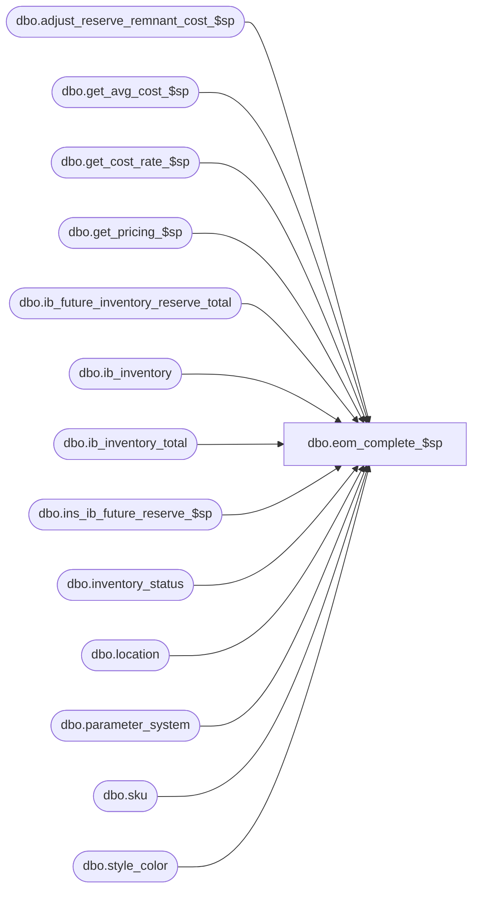

# dbo.eom_complete_$sp

**Database:** me_01  
**Server:** bedrockdb02  

## Architecture Diagram



## Table Dependencies

| Referenced Table |
|---|
| dbo.adjust_reserve_remnant_cost_$sp |
| dbo.get_avg_cost_$sp |
| dbo.get_cost_rate_$sp |
| dbo.get_pricing_$sp |
| dbo.ib_future_inventory_reserve_total |
| dbo.ib_inventory |
| dbo.ib_inventory_total |
| dbo.ins_ib_future_reserve_$sp |
| dbo.inventory_status |
| dbo.location |
| dbo.parameter_system |
| dbo.sku |
| dbo.style_color |

## Stored Procedure Code

```sql
-----------------------------------------------------------------------------------------------------------------------------
--	Main Query: Create Procedure
-----------------------------------------------------------------------------------------------------------------------------

CREATE PROCEDURE dbo.eom_complete_$sp

	@Batch_No AS INT

AS

SET TRANSACTION ISOLATION LEVEL READ UNCOMMITTED
SET NOCOUNT ON

-----------------------------------------------------------------------------------------------------------------------------
--	Exit procedure if installed_eom_flag in parameter_system is false
-----------------------------------------------------------------------------------------------------------------------------

IF NOT EXISTS (SELECT 1 FROM parameter_system WHERE installed_eom_flag = 1)
BEGIN

	RETURN

END

-----------------------------------------------------------------------------------------------------------------------------
--	Declarations / Sets: Declare And Set Variables
-----------------------------------------------------------------------------------------------------------------------------
DECLARE @Customer_Order_Create_Transaction_Type_Code SMALLINT = 1660
DECLARE @Customer_Order_Complete_Transaction_Type_Code SMALLINT = 1662

DECLARE @Available_Status_Id SMALLINT = (SELECT inventory_status_id FROM inventory_status WHERE inventory_status_code = '001')
DECLARE @Reserved_Status_Id SMALLINT = (SELECT inventory_status_id FROM inventory_status WHERE inventory_status_code = '009')

DECLARE @Expand_And_Multiply AS TABLE

	(
		 inventory_status_id SMALLINT NOT NULL
		,multiplier INT NOT NULL
	)

INSERT INTO @Expand_And_Multiply

	(
		 inventory_status_id
		,multiplier
	)

VALUES
	 (@Available_Status_Id, -1)
	,(@Reserved_Status_Id, 1)

DECLARE @Current_Date_Time AS DATETIME = GETDATE()
DECLARE @Current_Date AS SMALLDATETIME = CONVERT(SMALLDATETIME, CONVERT(VARCHAR(8), @Current_Date_Time, 112))

-----------------------------------------------------------------------------------------------------------------------------
--	Error Trapping: Check If Temp Table(s) Already Exist(s) And Drop If Applicable
-----------------------------------------------------------------------------------------------------------------------------

IF OBJECT_ID (N'tempdb.dbo.#temp_ib_reserve_inventory',  N'U') IS NOT NULL
BEGIN

	DROP TABLE dbo.#temp_ib_reserve_inventory

END

IF OBJECT_ID (N'tempdb.dbo.#temp_wrk_cost_rate_lookup',  N'U') IS NOT NULL
BEGIN

	DROP TABLE dbo.#temp_wrk_cost_rate_lookup

END

IF OBJECT_ID (N'tempdb.dbo.#temp_cost_rates',  N'U') IS NOT NULL
BEGIN

	DROP TABLE dbo.#temp_cost_rates

END

IF OBJECT_ID (N'tempdb.dbo.#temp_wrk_avg_cost_lookup',  N'U') IS NOT NULL
BEGIN

	DROP TABLE dbo.#temp_wrk_avg_cost_lookup

END

IF OBJECT_ID (N'tempdb.dbo.#temp_avg_costs',  N'U') IS NOT NULL
BEGIN

	DROP TABLE dbo.#temp_avg_costs

END

IF OBJECT_ID (N'tempdb.dbo.#temp_wrk_price_lookup', N'U') IS NOT NULL
BEGIN

	DROP TABLE dbo.#temp_wrk_price_lookup

END

IF OBJECT_ID (N'#temp_pi_prices',  N'U') IS NOT NULL
BEGIN

	DROP TABLE dbo.#temp_pi_prices

END

IF OBJECT_ID (N'tempdb.dbo.#temp_ib_inventory_total_update_values', N'U') IS NOT NULL
BEGIN

	DROP TABLE dbo.#temp_ib_inventory_total_update_values

END

IF OBJECT_ID (N'tempdb.dbo.#temp_ib_future_inventory_reserve', N'U') IS NOT NULL
BEGIN

	DROP TABLE dbo.#temp_ib_future_inventory_reserve

END

IF OBJECT_ID (N'tempdb.dbo.#temp_reserve_remnant_cost', N'U') IS NOT NULL
BEGIN

	DROP TABLE dbo.#temp_reserve_remnant_cost

END

-----------------------------------------------------------------------------------------------------------------------------
--	Table Create: Shell Table for Reserve Inventory
-----------------------------------------------------------------------------------------------------------------------------

CREATE TABLE dbo.#temp_ib_reserve_inventory
	(
		sku_id DECIMAL(13,0)
		,location_id SMALLINT
		,actual_reserved_quantity INT
		,actual_unreserved_quantity INT
		,future_reserved_quantity INT
	)

-----------------------------------------------------------------------------------------------------------------------------
-- Transactions from EOM will be store in temporary table #eom_reserve_transaction; .NET object populates this table
-- The table dbo.#temp_ib_reserve_inventory will have the following columns
	-- sku_id: from #eom_reserve_transaction
	-- location_id: from #eom_reserve_transaction
	-- actual_reserved_quantity: quantity to move out of available status and into reserve inventory status in ib_inventory
	-- future_reserved_quantity: quantity to move into ib_future_inventory_reserve
-----------------------------------------------------------------------------------------------------------------------------
INSERT INTO dbo.#temp_ib_reserve_inventory
	(
		sku_id
		,location_id
		,actual_unreserved_quantity
		,actual_reserved_quantity
		,future_reserved_quantity
	)
SELECT
	sqERT.sku_id
	,sqERT.location_id
	,(CASE WHEN COALESCE(RIIT.total_on_hand_units, 0) >= sqERT.requested_unreserve_quantity THEN sqERT.requested_unreserve_quantity ELSE COALESCE(RIIT.total_on_hand_units, 0) END) AS actual_unreserved_quantity
	,CASE
		WHEN (PS.use_future_inventory_flag = 1 AND COALESCE(IFIRT.reserved_quantity, 0) > 0)
			THEN
				(
					CASE
						WHEN sqERT.requested_reserve_quantity <= COALESCE(IFIRT.reserved_quantity, 0)
							THEN sqERT.requested_reserve_quantity
						ELSE
							COALESCE(IFIRT.reserved_quantity, 0)
					END
				)
		ELSE
			0
	 END AS actual_reserved_quantity
	,CASE
		WHEN (PS.use_future_inventory_flag = 1 AND COALESCE(IFIRT.reserved_quantity, 0) > 0)
			THEN
				(
					CASE
						WHEN sqERT.requested_reserve_quantity <= COALESCE(IFIRT.reserved_quantity, 0)
							THEN -1 * sqERT.requested_reserve_quantity
						ELSE
							-1 * COALESCE(IFIRT.reserved_quantity, 0)
					END
				)
				+
				(
					CASE
						WHEN COALESCE(RIIT.total_on_hand_units, 0) < sqERT.requested_unreserve_quantity
							THEN
								(
									CASE
										WHEN sqERT.requested_unreserve_quantity - COALESCE(RIIT.total_on_hand_units, 0) <= COALESCE(IFIRT.reserved_quantity, 0)
											THEN -1 * (sqERT.requested_unreserve_quantity - COALESCE(RIIT.total_on_hand_units, 0))
										ELSE
											-1 * COALESCE(IFIRT.reserved_quantity, 0)
									END
								)
						ELSE
							0
					END
				)
		ELSE
			0
	 END AS future_reserved_quantity
FROM
	(
		SELECT
			ERT.sku_id
			,ERT.outlet_id AS location_id
			,SUM(CASE WHEN ERT.transaction_cancelled = 0 THEN ERT.requested_reserve_quantity ELSE 0 END) AS requested_reserve_quantity
			,SUM(CASE WHEN ERT.transaction_cancelled = 1 THEN ERT.requested_reserve_quantity ELSE 0 END) AS requested_unreserve_quantity
		FROM
			dbo.#eom_reserve_transaction ERT
		INNER JOIN sku K ON K.sku_id = ERT.sku_id
		WHERE
			ERT.outlet_id IS NOT NULL
		GROUP BY
			ERT.sku_id
			,ERT.outlet_id
	) sqERT
	CROSS JOIN parameter_system PS
	LEFT OUTER JOIN dbo.ib_inventory_total AIIT ON
		AIIT.sku_id = sqERT.sku_id
		AND AIIT.location_id = sqERT.location_id
		AND AIIT.inventory_status_id = @Available_Status_Id
	LEFT OUTER JOIN dbo.ib_inventory_total RIIT ON
		RIIT.sku_id = sqERT.sku_id
		AND RIIT.location_id = sqERT.location_id
		AND RIIT.inventory_status_id = @Reserved_Status_Id
	LEFT OUTER JOIN dbo.ib_future_inventory_reserve_total IFIRT ON
		IFIRT.sku_id = sqERT.sku_id
		AND IFIRT.location_id = sqERT.location_id
		AND PS.use_future_inventory_flag = 1

-----------------------------------------------------------------------------------------------------------------------------
--	Table Create: Shell Tables for price retrieval
-----------------------------------------------------------------------------------------------------------------------------

CREATE TABLE dbo.#temp_wrk_price_lookup
	(
		jurisdiction_id SMALLINT NULL
		,location_id SMALLINT NULL
		,style_id DECIMAL (12, 0) NULL
		,color_id SMALLINT NULL
		,style_color_id DECIMAL (13, 0) NULL
		,sku_id DECIMAL (13, 0) NULL
	)

CREATE TABLE dbo.#temp_pi_prices
	(
		location_id SMALLINT NULL
		,sku_id DECIMAL (13, 0) NULL
		,price_status_id SMALLINT NULL
		,valuation_unit_retail DECIMAL (14, 2) NULL
		,selling_unit_retail DECIMAL (14, 2) NULL
	)

-----------------------------------------------------------------------------------------------------------------------------
--	Retrieve prices for entries in dbo.#temp_ib_reserve_inventory that will be inserted into ib_inventory
-- Prices are retrieved as of current date
-- Prices will be stored in dbo.#temp_pi_prices
-----------------------------------------------------------------------------------------------------------------------------

INSERT INTO #temp_wrk_price_lookup
	(
		jurisdiction_id
		,location_id
		,style_id
		,color_id
		,style_color_id
		,sku_id
	)
SELECT
	DISTINCT
		L.jurisdiction_id
		,L.location_id
		,SC.style_id
		,SC.color_id
		,SC.style_color_id
		,TIRI.sku_id
FROM dbo.#temp_ib_reserve_inventory TIRI
INNER JOIN location L ON L.location_id = TIRI.location_id
INNER JOIN sku K ON K.sku_id = TIRI.sku_id
INNER JOIN style_color SC ON SC.style_color_id = K.style_color_id
WHERE
	TIRI.actual_reserved_quantity <> 0 OR TIRI.actual_unreserved_quantity <> 0

-- call central get_pricing_$sp
EXECUTE dbo.get_pricing_$sp

	@Date = @Current_Date
	,@Results_To_Table = 0
	,@Use_PI_Mode = 1

-----------------------------------------------------------------------------------------------------------------------------
--	Table Create: Shell Tables for average cost retrieval
-----------------------------------------------------------------------------------------------------------------------------

CREATE TABLE dbo.#temp_wrk_cost_rate_lookup
	(
		jurisdiction_id SMALLINT NULL
		,transaction_date SMALLDATETIME NULL
	)

CREATE TABLE dbo.#temp_cost_rates
	(
		jurisdiction_id SMALLINT NULL
		,transaction_date SMALLDATETIME NULL
		,cost_rate FLOAT NULL
	)

CREATE TABLE dbo.#temp_wrk_avg_cost_lookup
	(
		jurisdiction_id SMALLINT NULL
		,location_id SMALLINT NULL
		,style_id DECIMAL (12, 0) NULL
		,sku_id DECIMAL (13, 0) NULL
	)

CREATE TABLE dbo.#temp_avg_costs
	(
		location_id SMALLINT NULL
		,sku_id DECIMAL (13, 0) NULL
		,avg_cost DECIMAL (18, 12) NULL
		,avg_cost_local DECIMAL (18, 12) NULL
		,sum_units int NULL
		,sum_cost DECIMAL (18, 6) NULL
		,sum_cost_local DECIMAL (18, 6) NULL
	)

-----------------------------------------------------------------------------------------------------------------------------
--	Retrieve average costs for entries in dbo.#temp_ib_reserve_inventory that will be inserted into ib_inventory
-- Average costs are retrieved as of current date
-- Average costs will be stored in dbo.#temp_avg_costs
-----------------------------------------------------------------------------------------------------------------------------

INSERT INTO #temp_wrk_avg_cost_lookup
	(
		jurisdiction_id
		,location_id
		,style_id
		,sku_id
	)
SELECT
	DISTINCT
		jurisdiction_id
		,location_id
		,style_id
		,sku_id
FROM
	#temp_wrk_price_lookup

INSERT INTO #temp_wrk_cost_rate_lookup
	(
		jurisdiction_id
		,transaction_date
	)
SELECT
	DISTINCT
		jurisdiction_id
		,@Current_Date AS transaction_date
FROM #temp_wrk_avg_cost_lookup

EXECUTE dbo.get_cost_rate_$sp

EXECUTE get_avg_cost_$sp
	@Date = @Current_Date

-----------------------------------------------------------------------------------------------------------------------------
--	Table Create: Shell Table for "ib_inventory_total" Update
-----------------------------------------------------------------------------------------------------------------------------
CREATE TABLE dbo.#temp_ib_inventory_total_update_values
	(
		 sku_id DECIMAL (13, 0) NULL
		,location_id SMALLINT NULL
		,inventory_status_id SMALLINT NULL
		,transaction_units DECIMAL (14, 2)  NULL
		,transaction_cost DECIMAL (14, 2)  NULL
		,transaction_cost_local DECIMAL (14, 2)  NULL
		,transaction_valuation_retail DECIMAL (14, 2)  NULL
		,transaction_selling_retail DECIMAL (14, 2)  NULL
		,price_status_id SMALLINT NULL
	)

-----------------------------------------------------------------------------------------------------------------------------
--	Populate ib_inventory
-- Move actual_reserved_quantity in dbo.#temp_ib_reserve_inventory from available to reserve inventory status in ib_inventory
-- Records are inserted as of current date
-----------------------------------------------------------------------------------------------------------------------------
INSERT INTO dbo.#temp_ib_inventory_total_update_values

	(
		 sku_id
		,location_id
		,inventory_status_id
		,transaction_units
		,transaction_cost
		,transaction_cost_local
		,transaction_valuation_retail
		,transaction_selling_retail
		,price_status_id
	)

SELECT
	 sqINS.sku_id
	,sqINS.location_id
	,sqINS.inventory_status_id
	,sqINS.transaction_units
	,sqINS.transaction_cost
	,sqINS.transaction_cost_local
	,sqINS.transaction_valuation_retail
	,sqINS.transaction_selling_retail
	,sqINS.price_status_id
FROM

	(
		INSERT INTO dbo.ib_inventory

			(
				 sku_id
				,location_id
				,price_status_id
				,transaction_date
				,transaction_type_code
				,inventory_status_id
				,other_location_id
				,transaction_reason_id
				,document_number
				,transaction_units
				,transaction_cost
				,transaction_valuation_retail
				,transaction_selling_retail
				,price_change_type
				,units_affected
				,transaction_cost_local
				,transaction_no
				,batch_no
				,register_no
			)

		OUTPUT
			 inserted.sku_id
			,inserted.location_id
			,inserted.inventory_status_id
			,inserted.transaction_units
			,inserted.transaction_cost
			,inserted.transaction_cost_local
			,inserted.transaction_valuation_retail
			,inserted.transaction_selling_retail
			,inserted.price_status_id

		SELECT
			 TIRI.sku_id
			,TIRI.location_id
			,TPP.price_status_id
			,@Current_Date AS transaction_date
			,@Customer_Order_Complete_Transaction_Type_Code AS transaction_type_code
			,EM.inventory_status_id
			,NULL AS other_location_id
			,NULL AS transaction_reason_id
			,NULL AS document_number
			,-1 * TIRI.actual_unreserved_quantity * EM.multiplier AS transaction_units
			,-1 * TAC.avg_cost * TIRI.actual_unreserved_quantity * EM.multiplier AS transaction_cost
			,-1 * TPP.valuation_unit_retail * TIRI.actual_unreserved_quantity * EM.multiplier AS transaction_valuation_retail
			,-1 * TPP.selling_unit_retail * TIRI.actual_unreserved_quantity * EM.multiplier AS transaction_selling_retail
			,NULL AS price_change_type
			,NULL AS units_affected
			,-1 * TAC.avg_cost_local * TIRI.actual_unreserved_quantity * EM.multiplier AS transaction_cost_local
			,NULL AS transaction_no
			,@Batch_No AS batch_no
			,NULL AS register_no
		FROM
			dbo.#temp_ib_reserve_inventory TIRI
			INNER JOIN dbo.#temp_avg_costs TAC ON TAC.sku_id = TIRI.sku_id AND TAC.location_id = TIRI.location_id
			INNER JOIN dbo.#temp_pi_prices TPP ON TPP.sku_id = TIRI.sku_id AND TPP.location_id = TIRI.location_id
			CROSS JOIN @Expand_And_Multiply EM
		WHERE
			TIRI.actual_unreserved_quantity > 0

		UNION ALL

		SELECT
			 TIRI.sku_id
			,TIRI.location_id
			,TPP.price_status_id
			,@Current_Date AS transaction_date
			,@Customer_Order_Create_Transaction_Type_Code AS transaction_type_code
			,EM.inventory_status_id
			,NULL AS other_location_id
			,NULL AS transaction_reason_id
			,NULL AS document_number
			,TIRI.actual_reserved_quantity * EM.multiplier AS transaction_units
			,TAC.avg_cost * TIRI.actual_reserved_quantity * EM.multiplier AS transaction_cost
			,TPP.valuation_unit_retail * TIRI.actual_reserved_quantity * EM.multiplier AS transaction_valuation_retail
			,TPP.selling_unit_retail * TIRI.actual_reserved_quantity * EM.multiplier AS transaction_selling_retail
			,NULL AS price_change_type
			,NULL AS units_affected
			,TAC.avg_cost_local * TIRI.actual_reserved_quantity * EM.multiplier AS transaction_cost_local
			,NULL AS transaction_no
			,@Batch_No AS batch_no
			,NULL AS register_no
		FROM
			dbo.#temp_ib_reserve_inventory TIRI
			INNER JOIN dbo.#temp_avg_costs TAC ON TAC.sku_id = TIRI.sku_id AND TAC.location_id = TIRI.location_id
			INNER JOIN dbo.#temp_pi_prices TPP ON TPP.sku_id = TIRI.sku_id AND TPP.location_id = TIRI.location_id
			CROSS JOIN @Expand_And_Multiply EM
		WHERE
			TIRI.actual_reserved_quantity > 0

	) sqINS

-----------------------------------------------------------------------------------------------------------------------------
--	Update ib_inventory_total using data inserted into ib_inventory
-----------------------------------------------------------------------------------------------------------------------------

IF EXISTS (SELECT * FROM dbo.#temp_ib_inventory_total_update_values ttIBITUV)
BEGIN

	MERGE
		dbo.ib_inventory_total IBIT

	USING
		(
			SELECT
				sku_id
				,location_id
				,inventory_status_id
				,price_status_id
				,SUM(transaction_units) AS transaction_units
				,SUM(transaction_cost) AS transaction_cost
				,SUM(transaction_cost_local) AS transaction_cost_local
				,SUM(transaction_selling_retail) AS transaction_selling_retail
				,SUM(transaction_valuation_retail) AS transaction_valuation_retail
			FROM
				dbo.#temp_ib_inventory_total_update_values
			GROUP BY
				sku_id
				,location_id
				,inventory_status_id
				,price_status_id
		) X
		ON X.location_id = IBIT.location_id
			AND X.sku_id = IBIT.sku_id
			AND X.inventory_status_id = IBIT.inventory_status_id

	WHEN MATCHED THEN

		UPDATE
		SET
			IBIT.price_status_id = X.price_status_id
			,IBIT.total_on_hand_units = IBIT.total_on_hand_units + X.transaction_units
			,IBIT.total_on_hand_cost = IBIT.total_on_hand_cost + X.transaction_cost
			,IBIT.total_on_hand_cost_local = IBIT.total_on_hand_cost_local + X.transaction_cost_local
			,IBIT.total_on_hand_selling_retail = IBIT.total_on_hand_selling_retail + X.transaction_selling_retail
			,IBIT.total_on_hand_valuation_retail = IBIT.total_on_hand_valuation_retail + X.transaction_valuation_retail

	WHEN NOT MATCHED BY TARGET THEN

		INSERT
			(
				sku_id
				,location_id
				,inventory_status_id
				,price_status_id
				,total_on_hand_units
				,total_on_hand_cost
				,total_on_hand_cost_local
				,total_on_hand_selling_retail
				,total_on_hand_valuation_retail
			)
		VALUES
			(
				X.sku_id
				,X.location_id
				,X.inventory_status_id
				,X.price_status_id
				,X.transaction_units
				,X.transaction_cost
				,X.transaction_cost_local
				,X.transaction_selling_retail
				,X.transaction_valuation_retail
			);

END

-----------------------------------------------------------------------------------------------------------------------------
--	Table Create: Shell Table for Remnant Cost
-----------------------------------------------------------------------------------------------------------------------------

CREATE TABLE dbo.#temp_reserve_remnant_cost
	(
		sku_id DECIMAL(13,0)
		,location_id SMALLINT
	)

-----------------------------------------------------------------------------------------------------------------------------
--	Adjust remnant cost in reserve inventory status
-----------------------------------------------------------------------------------------------------------------------------

INSERT INTO dbo.#temp_reserve_remnant_cost
	(
		sku_id
		,location_id
	)
SELECT
	DISTINCT
		sku_id
		,location_id
FROM
	dbo.#temp_ib_inventory_total_update_values ttIBITUV
WHERE
	ttIBITUV.inventory_status_id = @Reserved_Status_Id

EXEC dbo.adjust_reserve_remnant_cost_$sp
	@Batch_No = @Batch_No

-----------------------------------------------------------------------------------------------------------------------------
--	Table Create: Shell Table for IB Future Reserve Inventory
-----------------------------------------------------------------------------------------------------------------------------

CREATE TABLE dbo.#temp_ib_future_inventory_reserve
	(
		sku_id DECIMAL(13,0)
		,location_id SMALLINT
		,reserved_quantity INT
		,date_reserved DATETIME
		,batch_no INT
	)

-----------------------------------------------------------------------------------------------------------------------------
--	Populate ib_future_inventory_reserve using future_reserved_quantity in dbo.#temp_ib_reserve_inventory
-----------------------------------------------------------------------------------------------------------------------------

INSERT INTO dbo.#temp_ib_future_inventory_reserve
	(
		sku_id
		,location_id
		,reserved_quantity
		,date_reserved
		,batch_no
	)
SELECT
	TIRI.sku_id
	,TIRI.location_id
	,TIRI.future_reserved_quantity AS reserved_quantity
	,@Current_Date_Time AS date_reserved
	,@Batch_No AS batch_no
FROM
	dbo.#temp_ib_reserve_inventory TIRI
WHERE
	TIRI.future_reserved_quantity <> 0

IF EXISTS (SELECT * FROM dbo.#temp_ib_future_inventory_reserve)
BEGIN

	EXEC dbo.ins_ib_future_reserve_$sp

END
```

