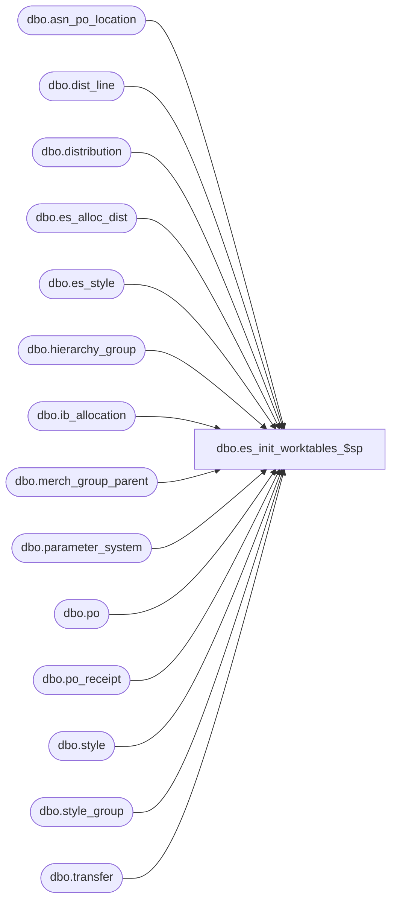

# dbo.es_init_worktables_$sp

**Database:** me_01  
**Server:** bedrockdb02  

## Architecture Diagram



## Table Dependencies

| Referenced Table |
|---|
| dbo.asn_po_location |
| dbo.dist_line |
| dbo.distribution |
| dbo.es_alloc_dist |
| dbo.es_style |
| dbo.hierarchy_group |
| dbo.ib_allocation |
| dbo.merch_group_parent |
| dbo.parameter_system |
| dbo.po |
| dbo.po_receipt |
| dbo.style |
| dbo.style_group |
| dbo.transfer |

## Stored Procedure Code

```sql
CREATE proc [dbo].[es_init_worktables_$sp]

as

begin

-- create work tables if they don't exist

IF NOT EXISTS
  (SELECT 1
   FROM   dbo.sysobjects
   WHERE  id = Object_id(N'dbo.es_alloc_dist')
   AND    type IN (N'U',N'S'))
BEGIN
   create table dbo.es_alloc_dist (
   distribution_id     bigint NOT NULL,
   distribution_number nvarchar(20) NOT NULL,
   location_id         smallint NOT NULL) on [PRIMARY]

   ALTER TABLE dbo.es_alloc_dist ADD constraint es_alloc_dist_$uk
   unique clustered (distribution_id, distribution_number, location_id)  on [PRIMARY]
END

IF NOT EXISTS
  (SELECT 1
   FROM   dbo.sysobjects
   WHERE  id = Object_id(N'dbo.es_style')
   AND    type IN (N'U',N'S'))
BEGIN
   create table dbo.es_style (
   style_id                  decimal(12, 0) NOT NULL,
   allow_customer_order_flag bit NULL,
   threshold                 int NULL) on [PRIMARY]

   ALTER TABLE dbo.es_style ADD constraint es_style_$uk
   unique clustered (style_id)  on [PRIMARY]
END

-- init work tables
truncate table dbo.es_alloc_dist

insert into dbo.es_alloc_dist
(distribution_id, distribution_number, location_id)
  --  Distributions from Warehouse (system or user) and external source
SELECT DISTINCT d.distribution_id, d.distribution_number, d.location_id
FROM   distribution d
WHERE  d.distribution_status in (5, 6, 7, 8, 9)
AND    d.document_source in (9, 6, 10, 11)
UNION
  --  Distributions from received POs (bulk + cross dock if 4wall not  installed)
SELECT DISTINCT d.distribution_id, d.distribution_number, d.location_id
FROM   distribution d, po_receipt pr, po
WHERE  d.distribution_status in (5, 6, 7, 8, 9)
AND    (d.document_source in (1, 7, 8)
        OR d.document_source IN (SELECT 2
                                 FROM   parameter_system
                                 WHERE  installed_4wall_flag = 1))
AND    d.po_id IS NOT NULL
AND    d.po_id = pr.po_id
AND    d.po_id = po.po_id
AND    (po.predistribution_type = 1
        OR po.predistribution_type = (SELECT 3
                                      FROM   parameter_system
                                      WHERE  installed_4wall_flag = 1))
AND    pr.document_status = 4
UNION
  --  Distributions from received PO Receipts
SELECT DISTINCT d.distribution_id, d.distribution_number, d.location_id
FROM   dist_line dl, distribution d, po_receipt pr
WHERE  d.distribution_status in (5, 6, 7, 8, 9)
AND    d.document_source = 5
AND    d.distribution_id = dl.distribution_id
AND    dl.po_receipt_id = pr.po_receipt_id
AND    pr.document_status = 4
UNION
  --  Distributions from received ASNs
SELECT DISTINCT d.distribution_id, d.distribution_number, d.location_id
FROM   dist_line dl, distribution d, asn_po_location asnpl, po_receipt pr
WHERE  d.distribution_id = dl.distribution_id
AND    d.distribution_status in (5, 6, 7, 8, 9)
AND    d.document_source =  4
AND    dl.advance_shipping_notice_id = asnpl.advance_shipping_notice_id
AND    d.po_id = asnpl.po_id
AND    asnpl.po_id = pr.po_id
AND    pr.po_id = d.po_id
AND    pr.document_status = 4
UNION
 --  Ready to sent Transfers
SELECT DISTINCT t.transfer_id as distribution_id, allocation_number as distribution_number, t.from_location_id
FROM ib_allocation ia
INNER JOIN transfer t ON N'T' + t.document_no = ia.allocation_number
WHERE	 allocation_number like 'T%'


TRUNCATE TABLE dbo.es_style

INSERT INTO dbo.es_style
SELECT style_id,
       CASE style_type WHEN 1 THEN allow_customer_order_flag
                       WHEN 2 THEN 0
       END,
       threshold
FROM   style

UPDATE s
SET s.allow_customer_order_flag = hg.allow_customer_order_flag
FROM dbo.es_style s
INNER JOIN style_group sg WITH (NOLOCK)
   ON  s.style_id = sg.style_id
   AND sg.main_group_flag = 1
   AND s.allow_customer_order_flag IS NULL
INNER JOIN merch_group_parent mgp WITH (NOLOCK)
   ON  sg.hierarchy_group_id = mgp.hierarchy_group_id
INNER JOIN hierarchy_group hg WITH (NOLOCK)
   ON  mgp.parent_hierarchy_group_id = hg.hierarchy_group_id
   AND mgp.hierarchy_level_id = hg.hierarchy_level_id
INNER JOIN (SELECT sg.style_id, MAX(hg.hierarchy_level_id) max_hierarchy_level_id
            FROM dbo.es_style s
            INNER JOIN style_group sg WITH (NOLOCK)
         ON  s.style_id = sg.style_id
               AND sg.main_group_flag = 1
               AND s.allow_customer_order_flag IS NULL
            INNER JOIN merch_group_parent mgp WITH (NOLOCK)
               ON  sg.hierarchy_group_id = mgp.hierarchy_group_id
               AND sg.main_group_flag = 1
            INNER JOIN hierarchy_group hg WITH (NOLOCK)
               ON  mgp.parent_hierarchy_group_id = hg.hierarchy_group_id
               AND mgp.hierarchy_level_id = hg.hierarchy_level_id
               AND hg.allow_customer_order_flag IS NOT NULL
            GROUP BY sg.style_id) t
   ON  s.style_id = t.style_id
   AND sg.style_id = t.style_id
   AND mgp.hierarchy_level_id = t.max_hierarchy_level_id
   AND hg.hierarchy_level_id = t.max_hierarchy_level_id


UPDATE s
SET s.threshold = hg.threshold
FROM dbo.es_style s
INNER JOIN style_group sg WITH (NOLOCK)
   ON  s.style_id = sg.style_id
   AND sg.main_group_flag = 1
   AND s.threshold IS NULL
INNER JOIN merch_group_parent mgp WITH (NOLOCK)
   ON  sg.hierarchy_group_id = mgp.hierarchy_group_id
INNER JOIN hierarchy_group hg WITH (NOLOCK)
   ON  mgp.parent_hierarchy_group_id = hg.hierarchy_group_id
   AND mgp.hierarchy_level_id = hg.hierarchy_level_id
INNER JOIN (SELECT sg.style_id, MAX(hg.hierarchy_level_id) max_hierarchy_level_id
            FROM dbo.es_style s
            INNER JOIN style_group sg WITH (NOLOCK)
               ON  s.style_id = sg.style_id
               AND sg.main_group_flag = 1
               AND s.threshold IS NULL
            INNER JOIN merch_group_parent mgp WITH (NOLOCK)
               ON  sg.hierarchy_group_id = mgp.hierarchy_group_id
               AND sg.main_group_flag = 1
            INNER JOIN hierarchy_group hg WITH (NOLOCK)
               ON  mgp.parent_hierarchy_group_id = hg.hierarchy_group_id
               AND mgp.hierarchy_level_id = hg.hierarchy_level_id
               AND hg.threshold IS NOT NULL
            GROUP BY sg.style_id) t
   ON  s.style_id = t.style_id
   AND sg.style_id = t.style_id
   AND mgp.hierarchy_level_id = t.max_hierarchy_level_id
   AND hg.hierarchy_level_id = t.max_hierarchy_level_id


end
```

