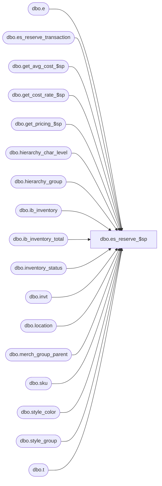

# dbo.es_reserve_$sp

**Database:** me_01  
**Server:** bedrockdb02  

## Architecture Diagram



## Table Dependencies

| Referenced Table |
|---|
| dbo.e |
| dbo.es_reserve_transaction |
| dbo.get_avg_cost_$sp |
| dbo.get_cost_rate_$sp |
| dbo.get_pricing_$sp |
| dbo.hierarchy_char_level |
| dbo.hierarchy_group |
| dbo.ib_inventory |
| dbo.ib_inventory_total |
| dbo.inventory_status |
| dbo.invt |
| dbo.location |
| dbo.merch_group_parent |
| dbo.sku |
| dbo.style_color |
| dbo.style_group |
| dbo.t |

## Stored Procedure Code

```sql
CREATE proc [dbo].[es_reserve_$sp]

@transaction_id DECIMAL(12, 0)

as
begin

/*
return value:
0 = sucessful
1 = invalid skus
2 = invalid outletids
3 = cancel with no corresponding reserve transaction
*/

/*
Purpose: Move inventory from available to reserved for ES sale
History:
10/21/2015	Ivan D.		145889 - ES customer order create is not posting to correct unavailable status & then not moving back to available prior to posting sale
1/18/2016	Ivan D.		153491 - Merch webservice: ReserveService for ES fails in es_reserve_$sp with Null value in transaction_cost table
4/5/2016  Ivan D.   DMER-427 - Merch webservice: ReserveService for ES fails in es_reserve_$sp when there is a cancel with no reserve
*/

-- get inventory statuses for available and reserved
DECLARE @available_status_id smallint,
		@reserved_status_id smallint
SELECT @available_status_id = inventory_status_id
FROM inventory_status
WHERE inventory_status_code = '001'

SELECT @reserved_status_id = inventory_status_id
FROM inventory_status
WHERE inventory_status_code = '009'

/* 1. validate skus */
SELECT sku_id
FROM   es_reserve_transaction e
WHERE  e.transaction_id = @transaction_id
AND    NOT EXISTS
  (SELECT 1
   FROM sku s
   WHERE e.sku_id = s.sku_id)
IF @@rowcount > 0
BEGIN
   RETURN 1
END

/* 2. get and validate locations */
UPDATE e
SET    e.location_id = l.location_id
FROM   es_reserve_transaction e
INNER JOIN location l
   ON  e.location_code = l.location_code
   AND e.transaction_id = @transaction_id

SELECT e.location_code
FROM   es_reserve_transaction e
WHERE  e.transaction_id = @transaction_id
AND    e.location_id IS NULL

IF @@rowcount > 0
BEGIN
   RETURN 2
END


/* 2.1 validate cancel has reserve */
SELECT 1
FROM   es_reserve_transaction e
WHERE  e.transaction_id = @transaction_id
AND    NOT EXISTS
  (SELECT 1
   FROM ib_inventory i
   WHERE e.sku_id = i.sku_id
   AND e.location_id = i.location_id
   AND e.cust_order_no = i.document_number
   AND i.transaction_type_code = 1660
   AND i.inventory_status_id = @reserved_status_id)
AND NOT EXISTS
  (SELECT 1 FROM es_reserve_transaction i
     WHERE  i.sku_id = e.sku_id
     AND    i.location_id = e.location_id
     AND    i.cust_order_no = e.cust_order_no
     AND    i.transaction_type = 1
  )

IF @@rowcount > 0
BEGIN
   RETURN 3
END


--/* 3. get permanent prices */
-- create temp table for in values
IF OBJECT_ID (N'tempdb.dbo.#temp_wrk_price_lookup',  N'U') IS NOT NULL
BEGIN
	DROP TABLE dbo.#temp_wrk_price_lookup
END

CREATE TABLE dbo.#temp_wrk_price_lookup
(
	jurisdiction_id SMALLINT NULL
	,location_id SMALLINT NULL
	,style_id DECIMAL (12, 0) NULL
	,color_id SMALLINT NULL
	,style_color_id DECIMAL (13, 0) NULL
	,sku_id DECIMAL (13, 0) NULL
)

-- create temp table for out values
IF OBJECT_ID (N'#temp_pi_prices',  N'U') IS NOT NULL
BEGIN
	DROP TABLE dbo.#temp_pi_prices
END

CREATE TABLE dbo.#temp_pi_prices
(
	location_id SMALLINT NULL
	,sku_id DECIMAL (13, 0) NULL
	,price_status_id SMALLINT NULL
	,valuation_unit_retail DECIMAL (14, 2) NULL
	,selling_unit_retail DECIMAL (14, 2) NULL
)

--populate DISTINCT values by date (one date at a time)
DECLARE @tran_date AS SMALLDATETIME
SET @tran_date = (SELECT TOP (1) transaction_date FROM es_reserve_transaction WHERE transaction_id = @transaction_id ORDER BY transaction_date)

WHILE @tran_date IS NOT NULL
BEGIN
	INSERT INTO #temp_wrk_price_lookup
	(
		jurisdiction_id
		,location_id
		,style_id
		,color_id
		,style_color_id
		,sku_id
	)
	SELECT DISTINCT l.jurisdiction_id, e.location_id, k.style_id, sc.color_id, k.style_color_id, e.sku_id
	FROM es_reserve_transaction e
	INNER JOIN location l ON l.location_id = e.location_id
	INNER JOIN sku k ON e.sku_id = k.sku_id
	INNER JOIN style_color sc ON k.style_color_id = sc.style_color_id
	WHERE e.transaction_date = @tran_date
	AND e.transaction_id = @transaction_id

-- call central get_pricing_$sp
	EXECUTE dbo.get_pricing_$sp

		 @Date = @tran_date
		,@Results_To_Table = 0
		,@Use_PI_Mode = 1

-- update es_reserve_transaction from out value temp table: #temp_pi_prices
	UPDATE e
	SET    e.valuation_retail = ip.valuation_unit_retail,
		   e.selling_retail = ip.selling_unit_retail,
           e.price_status_id = ip.price_status_id
	FROM   es_reserve_transaction e
	INNER JOIN #temp_pi_prices ip WITH (NOLOCK)
      ON  e.sku_id = ip.sku_id
      AND e.location_id = ip.location_id
      AND e.transaction_date = @tran_date
	  AND e.transaction_id = @transaction_id

--truncate temp table and start process new date
	TRUNCATE table dbo.#temp_wrk_price_lookup
	TRUNCATE table dbo.#temp_pi_prices

--set next transaction_date
	SET @tran_date = (SELECT TOP (1) transaction_date FROM es_reserve_transaction WHERE transaction_id = @transaction_id AND transaction_date > @tran_date ORDER BY transaction_date)
END

/* 4. get average costs */
-- 4.1 average costs for custom order create (transaction_type = 1)
IF OBJECT_ID (N'tempdb.dbo.#temp_wrk_avg_cost_lookup',  N'U') IS NOT NULL
BEGIN
	DROP TABLE dbo.#temp_wrk_avg_cost_lookup
END

CREATE TABLE dbo.#temp_wrk_avg_cost_lookup
(
	jurisdiction_id SMALLINT NULL
	,location_id SMALLINT NULL
	,style_id DECIMAL (12, 0) NULL
	,sku_id DECIMAL (13, 0) NULL
)

IF OBJECT_ID (N'tempdb.dbo.#temp_avg_costs',  N'U') IS NOT NULL
BEGIN
	DROP TABLE dbo.#temp_avg_costs
END

CREATE TABLE dbo.#temp_avg_costs
(
	location_id SMALLINT NULL
	,sku_id DECIMAL (13, 0) NULL
	,avg_cost DECIMAL (14, 2) NULL
	,avg_cost_local DECIMAL (14, 2) NULL
	,sum_units int NULL
	,sum_cost DECIMAL (18, 6) NULL
	,sum_cost_local DECIMAL (18, 6) NULL
)

IF OBJECT_ID (N'tempdb.dbo.#temp_wrk_cost_rate_lookup',  N'U') IS NOT NULL
BEGIN

	DROP TABLE dbo.#temp_wrk_cost_rate_lookup

END

CREATE TABLE dbo.#temp_wrk_cost_rate_lookup
(
	jurisdiction_id SMALLINT NULL
	,transaction_date SMALLDATETIME NULL
)

IF OBJECT_ID (N'tempdb.dbo.#temp_cost_rates',  N'U') IS NOT NULL
BEGIN

	DROP TABLE dbo.#temp_cost_rates

END

CREATE TABLE dbo.#temp_cost_rates
(
		jurisdiction_id SMALLINT NULL
	,transaction_date SMALLDATETIME NULL
	,cost_rate FLOAT NULL
)

SET @tran_date = (SELECT TOP (1) transaction_date FROM es_reserve_transaction WHERE transaction_id = @transaction_id AND transaction_type = 1 ORDER BY transaction_date)

WHILE @tran_date IS NOT NULL
BEGIN
	INSERT INTO #temp_wrk_avg_cost_lookup
	(
		jurisdiction_id
		,location_id
		,style_id
		,sku_id
	)
	SELECT DISTINCT l.jurisdiction_id, e.location_id, k.style_id, e.sku_id
	FROM es_reserve_transaction e
	INNER JOIN location l ON l.location_id = e.location_id
	INNER JOIN sku k ON e.sku_id = k.sku_id
	WHERE e.transaction_date = @tran_date
	AND e.transaction_id = @transaction_id
	AND e.transaction_type = 1

	INSERT INTO #temp_wrk_cost_rate_lookup
	(
		jurisdiction_id
		,transaction_date
	)
	SELECT DISTINCT jurisdiction_id, @tran_date AS transaction_date
	FROM #temp_wrk_avg_cost_lookup

	EXECUTE dbo.get_cost_rate_$sp

	EXECUTE get_avg_cost_$sp
			@Date = @tran_date

	--update es_reserve_transaction by join the #temp_avg_costs
	UPDATE e
	SET    e.average_cost = ac.avg_cost,
		   e.average_cost_local = ac.avg_cost_local
	FROM   es_reserve_transaction e
	INNER JOIN #temp_avg_costs ac WITH (NOLOCK)
      ON  e.sku_id = ac.sku_id
      AND e.location_id = ac.location_id
      AND e.transaction_date = @tran_date
	  AND e.transaction_id = @transaction_id
	  AND e.transaction_type = 1

	--update es_reserve_transaction for the sku which never ordered/receive by imu percent
	UPDATE e
	SET e.average_cost = e.valuation_retail * (1 - t.goal_imu_percent / 100),
		e.average_cost_local = e.selling_retail * (1 - t.goal_imu_percent / 100)
	FROM es_reserve_transaction e
	INNER JOIN
	(	SELECT DISTINCT
				k.sku_id,
				sg.style_id,
				hg.goal_imu_percent
		FROM hierarchy_group hg
		INNER JOIN hierarchy_char_level hcl ON  hg.hierarchy_level_id = hcl.goal_imu_level_id
		INNER JOIN merch_group_parent mgp ON  mgp.hierarchy_level_id = hg.hierarchy_level_id
				AND mgp.hierarchy_level_id = hcl.goal_imu_level_id
				AND hg.hierarchy_level_id = hcl.goal_imu_level_id
				AND mgp.parent_hierarchy_group_id = hg.hierarchy_group_id
		INNER JOIN style_group sg
				ON  sg.hierarchy_group_id = mgp.hierarchy_group_id
		INNER JOIN sku k ON k.style_id = sg.style_id
		INNER JOIN es_reserve_transaction e2 ON e2.sku_id = k.sku_id AND e2.average_cost IS NULL AND e2.average_cost_local IS NULL
		) t ON e.sku_id = t.sku_id
	AND e.average_cost IS NULL AND e.average_cost_local IS NULL
	AND e.transaction_date = @tran_date
	AND e.transaction_id = @transaction_id
	AND e.transaction_type = 1

	--truncate temp table and start process new date
	TRUNCATE table dbo.#temp_wrk_avg_cost_lookup
	TRUNCATE table dbo.#temp_avg_costs

--set next transaction_date
	SET @tran_date = (SELECT TOP (1) transaction_date FROM es_reserve_transaction WHERE transaction_id = @transaction_id AND transaction_type = 1 AND transaction_date > @tran_date ORDER BY transaction_date)

END


-- 4.2 average costs for custom order cancel (transaction_type 2)
DECLARE @sku_id decimal(13,0),
        @location_id smallint,
		@style_id decimal(12,0),
        @ib_average_cost_location_level tinyint,
        @total_on_hand_units int,
        @total_on_hand_cost float,
        @total_on_hand_cost_local float,
        @cost float,
        @cost_local float,
        @goal_imu_percent float,
		@document_no NVARCHAR(20)

DECLARE sku_loc_doc_list CURSOR FOR
SELECT DISTINCT e.sku_id, e.location_id, e.cust_order_no
FROM   es_reserve_transaction e
WHERE  e.transaction_id = @transaction_id
AND    e.transaction_type = 2

OPEN sku_loc_doc_list

WHILE 1=1
BEGIN
   FETCH sku_loc_doc_list INTO @sku_id, @location_id, @document_no
   IF @@fetch_status <> 0
      BREAK

   SELECT @cost = NULL
   SELECT @cost_local = NULL

   SELECT @total_on_hand_units = SUM(i.transaction_units),
          @total_on_hand_cost = SUM(i.transaction_cost),
          @total_on_hand_cost_local = SUM(i.transaction_cost_local)
   FROM   ib_inventory i
   WHERE  i.sku_id = @sku_id
   AND    i.location_id = @location_id
   AND    i.document_number = @document_no
   AND    i.transaction_type_code = 1660
   AND    i.inventory_status_id = @reserved_status_id

   --check if the reserve transaction is not being created at the same time
   IF @total_on_hand_units IS NULL OR @total_on_hand_cost IS NULL
	BEGIN
	   SELECT @total_on_hand_units = SUM(1),
          @total_on_hand_cost = SUM(i.average_cost),
          @total_on_hand_cost_local = SUM(i.average_cost_local)
	   FROM   es_reserve_transaction i
	   WHERE  i.sku_id = @sku_id
	   AND    i.location_id = @location_id
	   AND    i.cust_order_no = @document_no
	   AND    i.transaction_type = 1
	END

   SELECT @cost = @total_on_hand_cost / @total_on_hand_units
   SELECT @cost_local = @total_on_hand_cost_local / @total_on_hand_units

   UPDATE e
   SET    e.average_cost = @cost,
          e.average_cost_local = @cost_local
   FROM   es_reserve_transaction e
   INNER JOIN sku
      ON  e.sku_id = @sku_id
      AND e.location_id = @location_id
      AND e.cust_order_no = @document_no
      AND e.transaction_id = @transaction_id
      AND e.transaction_type = 2

END

CLOSE sku_loc_doc_list
DEALLOCATE sku_loc_doc_list

/* 5. Update IB */
BEGIN TRANSACTION

CREATE TABLE #ib_inventory(
   ib_inventory_id              DECIMAL(13, 0) IDENTITY(1,1) NOT NULL,
   sku_id                       DECIMAL(13, 0) NOT NULL,
   location_id                  SMALLINT NOT NULL,
   price_status_id              SMALLINT NOT NULL,
   transaction_date             SMALLDATETIME NOT NULL,
   transaction_type_code        SMALLINT NOT NULL,
   inventory_status_id          SMALLINT NOT NULL,
   document_number              NVARCHAR(20) NULL,
   transaction_units            INT NOT NULL,
   transaction_cost             DECIMAL(14, 2) NOT NULL,
   transaction_cost_local       DECIMAL(14, 2) NOT NULL,
   transaction_valuation_retail DECIMAL(14, 2) NOT NULL,
   transaction_selling_retail   DECIMAL(14, 2) NOT NULL,
   PRIMARY KEY CLUSTERED (ib_inventory_id ASC)
   )

CREATE TABLE #ib_inventory_total(
   sku_id                         DECIMAL(13, 0) NOT NULL,
   location_id                    SMALLINT NOT NULL,
   inventory_status_id            SMALLINT NOT NULL,
   price_status_id                SMALLINT NOT NULL,
   total_on_hand_units            INT NOT NULL,
   total_on_hand_cost             DECIMAL(14, 2) NOT NULL,
   total_on_hand_cost_local       DECIMAL(14, 2) NOT NULL,
   total_on_hand_valuation_retail DECIMAL(14, 2) NOT NULL,
   total_on_hand_selling_retail   DECIMAL(14, 2) NOT NULL,
   update_guid                    UNIQUEIDENTIFIER NOT NULL DEFAULT NEWID(),
   PRIMARY KEY CLUSTERED (sku_id ASC, location_id ASC, inventory_status_id ASC)
   )

DECLARE @es_reserve_transaction_id bigint

DECLARE reserve_trans_list CURSOR FOR
SELECT e.es_reserve_transaction_id
FROM   es_reserve_transaction e
WHERE  e.transaction_id = @transaction_id
ORDER BY e.es_reserve_transaction_id

OPEN reserve_trans_list

WHILE 1=1
BEGIN
   FETCH reserve_trans_list INTO @es_reserve_transaction_id
   IF @@fetch_status <> 0
      BREAK

   TRUNCATE TABLE #ib_inventory
   TRUNCATE TABLE #ib_inventory_total

   -- Populate ib_inventory
   INSERT INTO #ib_inventory
   (sku_id, location_id, price_status_id, transaction_date, transaction_type_code,
   inventory_status_id, document_number, transaction_units, transaction_cost,
   transaction_valuation_retail, transaction_selling_retail, transaction_cost_local)
   SELECT e.sku_id, e.location_id, e.price_status_id, e.transaction_date, 1660, @available_status_id, cust_order_no,
          - e.quantity, (- e.quantity) * e.average_cost, (- e.quantity) * e.valuation_retail,
          (- e.quantity) * e.selling_retail, (- e.quantity) * e.average_cost_local
   FROM   es_reserve_transaction e
   WHERE  e.transaction_id = @transaction_id
   AND    e.es_reserve_transaction_id = @es_reserve_transaction_id
   AND    e.transaction_type = 1
   UNION ALL
   SELECT e.sku_id, e.location_id, e.price_status_id, e.transaction_date, 1660, @reserved_status_id, cust_order_no,
          e.quantity, e.quantity * e.average_cost, e.quantity * e.valuation_retail,
          e.quantity * e.selling_retail, e.quantity * e.average_cost_local
   FROM   es_reserve_transaction e
   WHERE  e.transaction_id = @transaction_id
   AND    e.es_reserve_transaction_id = @es_reserve_transaction_id
   AND    e.transaction_type = 1
   UNION ALL
   SELECT e.sku_id, e.location_id, e.price_status_id, e.transaction_date, 1663, @reserved_status_id, cust_order_no,
          - e.quantity, (- e.quantity) * e.average_cost, (- e.quantity) * e.valuation_retail,
          (- e.quantity) * e.selling_retail, (- e.quantity) * e.average_cost_local
   FROM   es_reserve_transaction e
   WHERE  e.transaction_id = @transaction_id
   AND    e.es_reserve_transaction_id = @es_reserve_transaction_id
   AND    e.transaction_type = 2
   UNION ALL
   SELECT e.sku_id, e.location_id, e.price_status_id, e.transaction_date, 1663, @available_status_id, cust_order_no,
          e.quantity, e.quantity * e.average_cost, e.quantity * e.valuation_retail,
          e.quantity * e.selling_retail, e.quantity * e.average_cost_local
   FROM   es_reserve_transaction e
   WHERE  e.transaction_id = @transaction_id
   AND    e.es_reserve_transaction_id = @es_reserve_transaction_id
   AND    e.transaction_type = 2

   INSERT INTO ib_inventory
   (sku_id, location_id, price_status_id, transaction_date, transaction_type_code,
   inventory_status_id, document_number, transaction_units, transaction_cost,
   transaction_valuation_retail, transaction_selling_retail, transaction_cost_local)
   SELECT sku_id, location_id, price_status_id, transaction_date, transaction_type_code,
          inventory_status_id, document_number, transaction_units, transaction_cost,
          transaction_valuation_retail, transaction_selling_retail, transaction_cost_local
   FROM   #ib_inventory

   -- Populate ib_inventory_total
   INSERT #ib_inventory_total
          (sku_id, location_id, inventory_status_id, price_status_id,
           total_on_hand_units, total_on_hand_cost, total_on_hand_cost_local,
           total_on_hand_valuation_retail, total_on_hand_selling_retail)
   SELECT  sku_id, location_id, inventory_status_id, -1 price_status_id,
		   SUM(transaction_units), SUM(transaction_cost), SUM(transaction_cost_local),
		   SUM(transaction_valuation_retail), SUM(transaction_selling_retail)
   FROM    #ib_inventory
   GROUP   BY sku_id, location_id, inventory_status_id;

   UPDATE t
   SET    price_status_id = i.price_status_id
   FROM   #ib_inventory_total t
   INNER  JOIN #ib_inventory i
      ON  t.sku_id = i.sku_id
      AND t.location_id = i.location_id
      AND t.inventory_status_id = i.inventory_status_id
   INNER  JOIN (SELECT sku_id, location_id, inventory_status_id,
                       MAX(ib_inventory_id) max_ib_inventory_id
                FROM   #ib_inventory
                GROUP  BY sku_id, location_id, inventory_status_id) m
      ON  i.ib_inventory_id = m.max_ib_inventory_id
      AND i.sku_id = m.sku_id
      AND t.sku_id = m.sku_id
      AND i.location_id = m.location_id
      AND t.location_id = m.location_id
      AND i.inventory_status_id = m.inventory_status_id
      AND t.inventory_status_id = m.inventory_status_id

   INSERT ib_inventory_total
         (sku_id, location_id, inventory_status_id, price_status_id,
          total_on_hand_units, total_on_hand_cost, total_on_hand_cost_local,
          total_on_hand_valuation_retail, total_on_hand_selling_retail,
          update_guid )
   SELECT sku_id, location_id, inventory_status_id, price_status_id,
          total_on_hand_units, total_on_hand_cost, total_on_hand_cost_local,
          total_on_hand_valuation_retail, total_on_hand_selling_retail,
          update_guid
   FROM   #ib_inventory_total upd
   WHERE  NOT EXISTS
     (SELECT 1
      FROM   ib_inventory_total invt
      WHERE  invt.sku_id = upd.sku_id
      AND    invt.location_id = upd.location_id
      AND    invt.inventory_status_id = upd.inventory_status_id)

   UPDATE invt
   SET    price_status_id = t.price_status_id,
          total_on_hand_units = invt.total_on_hand_units + t.total_on_hand_units,
          total_on_hand_cost = invt.total_on_hand_cost + t.total_on_hand_cost,
          total_on_hand_cost_local = invt.total_on_hand_cost_local + t.total_on_hand_cost_local,
          total_on_hand_valuation_retail = invt.total_on_hand_valuation_retail + t.total_on_hand_valuation_retail,
          total_on_hand_selling_retail = invt.total_on_hand_selling_retail + t.total_on_hand_selling_retail,
          update_guid = t.update_guid
   FROM   #ib_inventory_total t
   INNER  JOIN ib_inventory_total invt
      ON  invt.sku_id = t.sku_id
      AND invt.location_id = t.location_id
      AND invt.inventory_status_id = t.inventory_status_id
      AND t.update_guid <> invt.update_guid

END

CLOSE reserve_trans_list
DEALLOCATE reserve_trans_list

DROP TABLE #ib_inventory
DROP TABLE #ib_inventory_total

DELETE es_reserve_transaction
WHERE  transaction_id = @transaction_id

COMMIT TRANSACTION

RETURN 0

END
```

