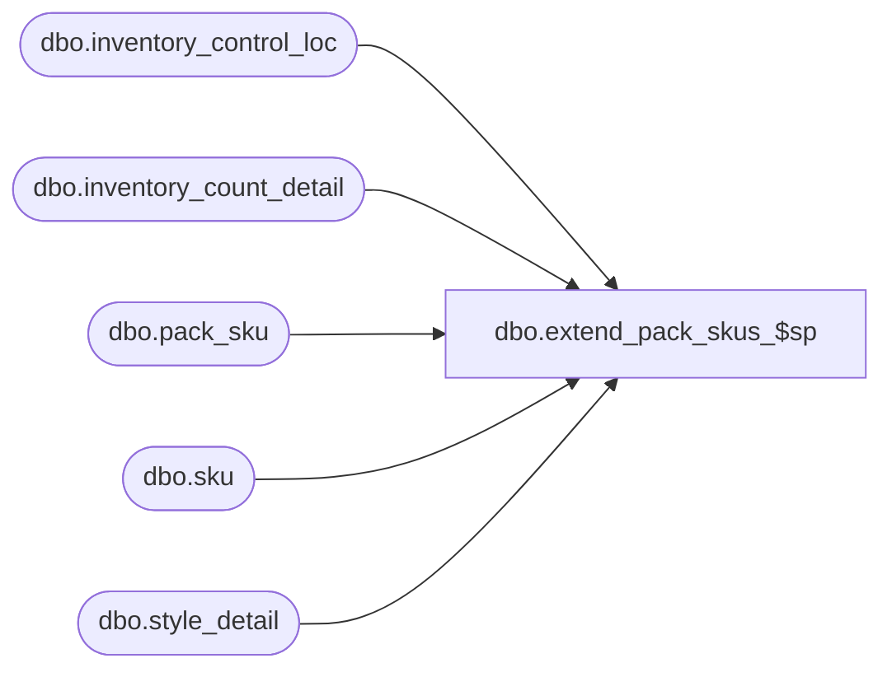

# dbo.extend_pack_skus_$sp

**Database:** me_01  
**Server:** bedrockdb02  

## Architecture Diagram



## Table Dependencies

| Referenced Table |
|---|
| dbo.inventory_control_loc |
| dbo.inventory_count_detail |
| dbo.pack_sku |
| dbo.sku |
| dbo.style_detail |

## Stored Procedure Code

```sql
create proc [dbo].[extend_pack_skus_$sp] 


(
	@DocId AS DECIMAL(12,0), 
	@IclId AS DECIMAL(13,0), 
	@LastItemId AS DECIMAL(12,0),
	@LocId SMALLINT,
	@CountDate AS SMALLDATETIME
)

/* 
Proc name: extend_pack_skus_$sp 
Description: Procedure called by pi_process_loc_$sp after packs have been inserted to make sure counts for skus are in sync with those for packs
	Steps:
		1.  	Retrieve skus within packs that have been counted
		2.  	Insert theses skus into the inventory_count_detail table if 
		    	they do not already exist in the table.  Insert these details with counts of zero for now.
		3.	Update the extended_units_counted column based on the the number of packs counted and the contents of the packs.

HISTORY: 
Date       	Name         	Def#	Desc
Sept01,04   	Sameer Patel   	21616	Part of performance improvements for physical inventory
April 26, 2010		Feng		Increase precision from 2 to 6 for cost fields
*/

AS

BEGIN

DECLARE @ExchangeRate AS FLOAT

-- Determine exchange rate
	EXEC sp_executesql
		N'SELECT
			@ParamExchangeRate = exchange_rate
		  FROM
			currency_conversion
		  WHERE
			to_currency_id =
				( SELECT
					currency_id from_currency_id
				  FROM
					country
					, jurisdiction
					, location
				  WHERE
					location.jurisdiction_id = jurisdiction.jurisdiction_id
					AND country.country_id= jurisdiction.country_id
					AND location.location_id = @ParamLocId )
			AND from_currency_id =
				( SELECT
					currency_id to_currency_id
				  FROM
					country
					, jurisdiction
				  WHERE
					country.country_id= jurisdiction.country_id
					AND jurisdiction.home_jurisdiction_flag = 1 )
			AND effective_from_date <= @ParamCountDate
			AND (effective_to_date >= @ParamCountDate OR effective_to_date IS NULL)
			AND currency_conversion_type = 1'
		, N'@ParamExchangeRate AS FLOAT OUTPUT
		  , @ParamLocId AS SMALLINT
		  , @ParamCountDate AS DATETIME'
		, @ParamExchangeRate = @ExchangeRate OUTPUT
		, @ParamLocId = @LocId
		, @ParamCountDate = @CountDate

/*--------------------------------------------------------------------------------------------------------------*/
-- Declartions of various temporary tables
	
	CREATE TABLE [#sku_loc] (
		[sku_id] decimal(13, 0) NOT NULL ,
		[cost] decimal(18, 6) NULL ,
		[cost_local] decimal(18, 6) NULL ,
		[sku_loc_id] decimal (13,0) identity)

/*--------------------------------------------------------------------------------------------------------------*/
/*--------------------------------------------------------------------------------------------------------------*/
-- This temporary table will store the skus from the packs that were counted, 
-- but that are not already in the inventory_count_detail table

	INSERT INTO 
		#sku_loc
	SELECT 
		DISTINCT pack_sku.sku_id,
		inventory_count_detail.cost,
		inventory_count_detail.cost_local
	FROM
		inventory_count_detail,
		pack_sku
	WHERE 
		inventory_count_detail.inventory_control_id = @DocId
		AND inventory_count_detail.inventory_control_loc_id = @IclId
		AND inventory_count_detail.pack_id = pack_sku.pack_id
		AND NOT EXISTS
			(
				SELECT *
				FROM 
					inventory_count_detail WITH (NOLOCK)
				WHERE 
					inventory_count_detail.inventory_control_id = @DocId
					AND inventory_count_detail.inventory_control_loc_id = @IclId
					AND inventory_count_detail.sku_id = pack_sku.sku_id
			)
	ORDER BY 
		pack_sku.sku_id	

/*--------------------------------------------------------------------------------------------------------------*/	
/*--------------------------------------------------------------------------------------------------------------*/
-- Insert the skus from #sku_loc table

	INSERT INTO
		inventory_count_detail (inventory_count_detail_id, inventory_control_loc_id, inventory_control_id, sku_id, units_counted, average_cost, average_cost_local)
	SELECT
		(@IclId * 1000000) + @LastItemId + sku_loc_id,
		@IclId,
		@DocId,
		sku_id,
		0 units_counted,
		cost,
		cost_local
	FROM
		#sku_loc

/*--------------------------------------------------------------------------------------------------------------*/
/*--------------------------------------------------------------------------------------------------------------*/
-- And update the last_item_id in the inventory_control_loc table

	UPDATE
		inventory_control_loc
	SET
		inventory_control_loc.last_item_id = 
		(
			SELECT
				ISNULL(@LastItemId + MAX(#sku_loc.sku_loc_id), @LastItemId) last_item_id
			FROM 
				#sku_loc
		) 
	WHERE
		inventory_control_loc.inventory_control_loc_id = @IclId
		AND inventory_control_loc.inventory_control_id = @DocId

/*--------------------------------------------------------------------------------------------------------------*/
/*--------------------------------------------------------------------------------------------------------------*/

	DROP TABLE #sku_loc
		
/*--------------------------------------------------------------------------------------------------------------*/
/*--------------------------------------------------------------------------------------------------------------*/
-- Extend the counted units for the skus within packs
-- I.E. Populate the exteneded_units_counted column with the units_counted plus those counted from the packs

	UPDATE
		inventory_count_detail
	SET 
		inventory_count_detail.extended_units_counted = inventory_count_detail.units_counted + A.pack_sku_units
	FROM 
		inventory_count_detail WITH (NOLOCK),
		(
			SELECT
				pack_sku.sku_id,
				SUM(pack_sku.sku_quantity * inventory_count_detail.units_counted) pack_sku_units
			FROM
				inventory_count_detail WITH (NOLOCK),
				pack_sku WITH (NOLOCK)
			WHERE
				inventory_count_detail.pack_id = pack_sku.pack_id
				AND inventory_count_detail.inventory_control_loc_id = @IclId
				AND inventory_count_detail.inventory_control_id = @DocId
			GROUP BY 
				pack_sku.sku_id
		) A
	WHERE
		inventory_count_detail.sku_id = A.sku_id
		AND inventory_count_detail.inventory_control_loc_id = @IclId
		AND inventory_count_detail.inventory_control_id = @DocId

/*--------------------------------------------------------------------------------------------------------------*/
/*--------------------------------------------------------------------------------------------------------------*/
-- Calculate average cost for skus that have just been inserted; they should have a NULL average_cost at this point 

	/*--------------------------------------------------------------------------------------------------------------*/
	-- First, calculate average cost for those styles that have a valid average
		-- Average cost must be greater than or equal to zero
		-- Total on hand units (sum of total_oh_book_units and total_oh_hand_in_transit_units) must be greater than zero

	UPDATE
		inventory_count_detail
	SET
		inventory_count_detail.average_cost = A.average_cost
	FROM
		inventory_count_detail,
		sku,
		(
			SELECT
				sku.style_id,
				SUM(inventory_count_detail.total_oh_book_units + inventory_count_detail.total_oh_in_transit_units) total_units,
				SUM(inventory_count_detail.total_oh_book_cost + inventory_count_detail.total_oh_in_transit_cost) total_cost,
				SUM(inventory_count_detail.total_oh_book_cost + inventory_count_detail.total_oh_in_transit_cost)/SUM(inventory_count_detail.total_oh_book_units + inventory_count_detail.total_oh_in_transit_units) average_cost
			FROM
				sku WITH (NOLOCK),
				inventory_count_detail WITH (NOLOCK)
			WHERE
				inventory_count_detail.sku_id = sku.sku_id
				AND inventory_count_detail.inventory_control_loc_id = @IclId
				AND inventory_count_detail.inventory_control_id = @DocId
				AND inventory_count_detail.pack_id IS NULL
			GROUP BY
				sku.style_id
			HAVING
				SUM(inventory_count_detail.total_oh_book_units + inventory_count_detail.total_oh_in_transit_units) > 0
				AND SUM(inventory_count_detail.total_oh_book_cost + inventory_count_detail.total_oh_in_transit_cost)/SUM(inventory_count_detail.total_oh_book_units + inventory_count_detail.total_oh_in_transit_units) >= 0	
		) A
	WHERE
		inventory_count_detail.sku_id = sku.sku_id
		AND sku.style_id = A.style_id
		AND inventory_count_detail.average_cost IS NULL
		AND inventory_count_detail.total_retail IS NULL
		AND inventory_count_detail.inventory_control_loc_id = @IclId
		AND inventory_count_detail.inventory_control_id = @DocId
	
	/*--------------------------------------------------------------------------------------------------------------*/
	-- For those styles that don't have a valid average cost, use the last_net_final_po_cost from the style_detail table
		
	UPDATE
		inventory_count_detail
	SET
		inventory_count_detail.average_cost = style_detail.last_net_final_po_cost
	FROM
		inventory_count_detail WITH (NOLOCK),
		style_detail WITH (NOLOCK),
		sku WITH (NOLOCK)
	WHERE
		inventory_count_detail.sku_id = sku.sku_id
		AND sku.style_id = style_detail.style_id
		AND inventory_count_detail.total_retail IS NULL
		AND inventory_count_detail.inventory_control_loc_id = @IclId
		AND inventory_count_detail.inventory_control_id = @DocId	
		AND inventory_count_detail.average_cost IS NULL

/*--------------------------------------------------------------------------------------------------*/
--update average_cost_local 
	UPDATE
		inventory_count_detail
	SET
		inventory_count_detail.average_cost_local = A.average_cost_local
	FROM
		inventory_count_detail,
		sku,
		(
			SELECT
				sku.style_id,
				SUM(inventory_count_detail.total_oh_book_units + inventory_count_detail.total_oh_in_transit_units) total_units,
				SUM(inventory_count_detail.total_oh_book_cost_local + inventory_count_detail.total_oh_in_transit_cost_local) total_cost_local,
				SUM(inventory_count_detail.total_oh_book_cost_local + inventory_count_detail.total_oh_in_transit_cost_local)/SUM(inventory_count_detail.total_oh_book_units + inventory_count_detail.total_oh_in_transit_units) average_cost_local
			FROM
				sku WITH (NOLOCK),
				inventory_count_detail WITH (NOLOCK)
			WHERE
				inventory_count_detail.sku_id = sku.sku_id
				AND inventory_count_detail.inventory_control_loc_id = @IclId
				AND inventory_count_detail.inventory_control_id = @DocId
				AND inventory_count_detail.pack_id IS NULL
			GROUP BY
				sku.style_id
			HAVING
				SUM(inventory_count_detail.total_oh_book_units + inventory_count_detail.total_oh_in_transit_units) > 0
				AND SUM(inventory_count_detail.total_oh_book_cost_local + inventory_count_detail.total_oh_in_transit_cost_local)/SUM(inventory_count_detail.total_oh_book_units + inventory_count_detail.total_oh_in_transit_units) >= 0	
		) A
	WHERE
		inventory_count_detail.sku_id = sku.sku_id
		AND sku.style_id = A.style_id
		AND inventory_count_detail.average_cost_local IS NULL
		AND inventory_count_detail.total_retail IS NULL
		AND inventory_count_detail.inventory_control_loc_id = @IclId
		AND inventory_count_detail.inventory_control_id = @DocId


	/*--------------------------------------------------------------------------------------------------------------*/
	-- For those styles that don't have a valid average cost local, use the last_net_final_po_cost from the style_detail table
		
	UPDATE
		inventory_count_detail
	SET
		inventory_count_detail.average_cost_local = style_detail.last_net_final_po_cost / @ExchangeRate
	FROM
		inventory_count_detail WITH (NOLOCK),
		style_detail WITH (NOLOCK),
		sku WITH (NOLOCK)
	WHERE
		inventory_count_detail.sku_id = sku.sku_id
		AND sku.style_id = style_detail.style_id
		AND inventory_count_detail.total_retail IS NULL
		AND inventory_count_detail.inventory_control_loc_id = @IclId
		AND inventory_count_detail.inventory_control_id = @DocId	
		AND inventory_count_detail.average_cost_local IS NULL

/*--------------------------------------------------------------------------------------------------------------*/
/*--------------------------------------------------------------------------------------------------------------*/


END
```

