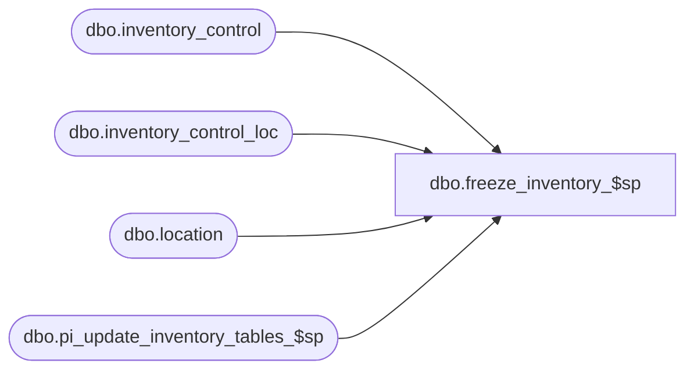

# dbo.freeze_inventory_$sp

**Database:** me_01  
**Server:** bedrockdb02  

## Architecture Diagram



## Table Dependencies

| Referenced Table |
|---|
| dbo.inventory_control |
| dbo.inventory_control_loc |
| dbo.location |
| dbo.pi_update_inventory_tables_$sp |

## Stored Procedure Code

```sql
create proc [dbo].[freeze_inventory_$sp] ( @DocNo NVARCHAR(20) )

/* 
Proc name: freeze_inventory_$sp 
Description: Procedure that calls pi_process_loc_$sp for every counted location on the given inventory control document

HISTORY: 
Date       	Name         	Def#		Desc
Sept01,04   	Sameer Patel   	21616		Part of performance improvements for physical inventory
Nov24,06	Jacqueline Lin	80360		Port 3.0 def. 1-3CL1VN	The Freeze work fine when importing a count, 
						but if freeze is run through the GUI the on-hand/ book values 
						are not recalculated and the inventory_count_detail table is not updated
*/

AS

BEGIN

	DECLARE loc_cursor CURSOR FOR
	SELECT
		-- Defect 1-3CL1VN
		--inventory_control_loc.inventory_control_loc_id
		--, inventory_control.inventory_control_id
		inventory_control.inventory_control_id
		, inventory_control_loc.inventory_control_loc_id
		-- End Defect 1-3CL1VN
		, inventory_control_loc.location_id
		, location.location_code
	FROM
		inventory_control
		, inventory_control_loc
		, location
	WHERE 
		location.location_id = inventory_control_loc.location_id
		AND inventory_control_loc.state_no = 1
		AND inventory_control.inventory_control_id = inventory_control_loc.inventory_control_id 
		AND inventory_control.document_no = @DocNo

	OPEN loc_cursor

	DECLARE 
		@DocId AS DECIMAL(12,0)
		, @IclId AS DECIMAL(13,0)
		, @LocId AS SMALLINT
		, @LocCode AS NVARCHAR(20)
	
	FETCH NEXT FROM 
		loc_cursor 
	INTO 
		@DocId
		, @IclId
		, @LocId
		, @LocCode
	
	WHILE @@FETCH_STATUS = 0

		BEGIN
		
			EXEC pi_update_inventory_tables_$sp 
				@IclId
				, @DocId
				, @LocId
				, @LocCode
				, 0
			
			FETCH NEXT FROM 
				loc_cursor 
			INTO 
				@DocId
				, @IclId
				, @LocId
				, @LocCode

		END
	
	CLOSE loc_cursor
	DEALLOCATE loc_cursor

END
```

