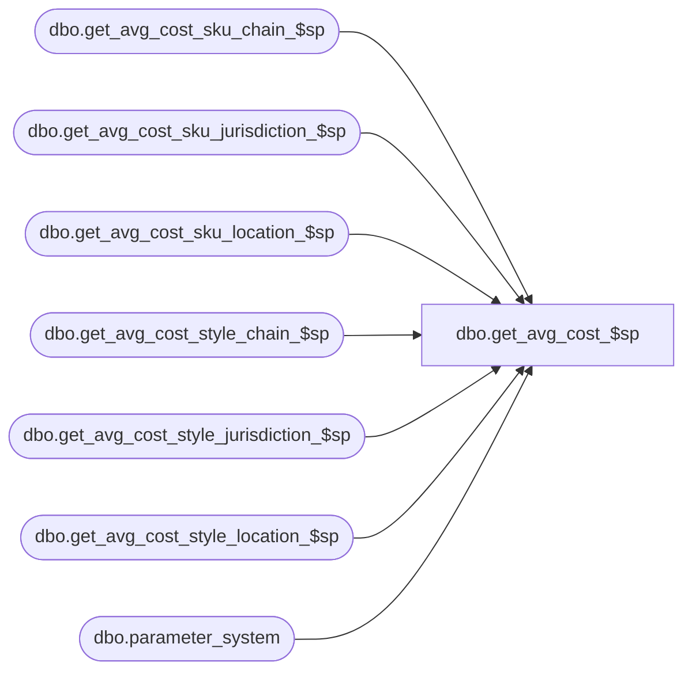

# dbo.get_avg_cost_$sp

**Database:** me_01  
**Server:** bedrockdb02  

## Architecture Diagram



## Table Dependencies

| Referenced Table |
|---|
| dbo.get_avg_cost_sku_chain_$sp |
| dbo.get_avg_cost_sku_jurisdiction_$sp |
| dbo.get_avg_cost_sku_location_$sp |
| dbo.get_avg_cost_style_chain_$sp |
| dbo.get_avg_cost_style_jurisdiction_$sp |
| dbo.get_avg_cost_style_location_$sp |
| dbo.parameter_system |

## Stored Procedure Code

```sql
-----------------------------------------------------------------------------------------------------------------------------
--	Main Query: Create Procedure
-----------------------------------------------------------------------------------------------------------------------------

CREATE PROCEDURE dbo.get_avg_cost_$sp

	  @Date AS SMALLDATETIME = NULL
	 ,@Merch_Level AS TINYINT = NULL
	 ,@Location_Level AS TINYINT = NULL

AS

SET TRANSACTION ISOLATION LEVEL READ UNCOMMITTED
SET NOCOUNT ON

DECLARE @Temp_Table_Object_ID AS INT


SET @Temp_Table_Object_ID = OBJECT_ID (N'tempdb.dbo.#temp_wrk_avg_cost_lookup', N'U')


-----------------------------------------------------------------------------------------------------------------------------
--	Declarations / Sets: Declare And Set Variables
-----------------------------------------------------------------------------------------------------------------------------
-- check if Merch_Level and Location_Level are initialized.
-- if not, retrieve the values from the system parameter table.
IF (@Merch_Level IS NULL OR @Location_Level IS NULL)
BEGIN

	SELECT
		 @Merch_Level = ib_average_cost_merch_level
		,@Location_Level = ib_average_cost_location_level
	FROM
		dbo.parameter_system

END

-----------------------------------------------------------------------------------------------------------------------------
-- Average cost by style/location
-----------------------------------------------------------------------------------------------------------------------------

IF (@Merch_Level = 1 AND @Location_Level = 1)
BEGIN

	IF NOT EXISTS (SELECT * FROM tempdb.sys.indexes I WHERE I.[object_id] = @Temp_Table_Object_ID AND I.name = N'temp_IX_performance_helper_01')
	BEGIN

		CREATE NONCLUSTERED INDEX temp_IX_performance_helper_01 ON dbo.#temp_wrk_avg_cost_lookup (style_id, location_id)

	END


	EXECUTE dbo.get_avg_cost_style_location_$sp

		@Date = @Date

END


-----------------------------------------------------------------------------------------------------------------------------
-- Average cost by style/chain
-----------------------------------------------------------------------------------------------------------------------------

ELSE IF (@Merch_Level = 1 AND @Location_Level = 2)
BEGIN

	IF NOT EXISTS (SELECT * FROM tempdb.sys.indexes I WHERE I.[object_id] = @Temp_Table_Object_ID AND I.name = N'temp_IX_performance_helper_01')
	BEGIN

		CREATE NONCLUSTERED INDEX temp_IX_performance_helper_01 ON dbo.#temp_wrk_avg_cost_lookup (style_id)

	END


	EXECUTE dbo.get_avg_cost_style_chain_$sp

		@Date = @Date

END


-----------------------------------------------------------------------------------------------------------------------------
-- Average cost by style/jurisdiction
-----------------------------------------------------------------------------------------------------------------------------

ELSE IF (@Merch_Level = 1 AND @Location_Level = 3)
BEGIN

	IF NOT EXISTS (SELECT * FROM tempdb.sys.indexes I WHERE I.[object_id] = @Temp_Table_Object_ID AND I.name = N'temp_IX_performance_helper_01')
	BEGIN

		CREATE NONCLUSTERED INDEX temp_IX_performance_helper_01 ON dbo.#temp_wrk_avg_cost_lookup (style_id, jurisdiction_id)

	END


	EXECUTE dbo.get_avg_cost_style_jurisdiction_$sp

		@Date = @Date

END


-----------------------------------------------------------------------------------------------------------------------------
-- Average cost by SKU/location
-----------------------------------------------------------------------------------------------------------------------------

ELSE IF (@Merch_Level = 2 AND @Location_Level = 1)
BEGIN

	IF NOT EXISTS (SELECT * FROM tempdb.sys.indexes I WHERE I.[object_id] = @Temp_Table_Object_ID AND I.name = N'temp_IX_performance_helper_01')
	BEGIN

		CREATE NONCLUSTERED INDEX temp_IX_performance_helper_01 ON dbo.#temp_wrk_avg_cost_lookup (sku_id, location_id)

	END


	IF NOT EXISTS (SELECT * FROM tempdb.sys.indexes I WHERE I.[object_id] = @Temp_Table_Object_ID AND I.name = N'temp_IX_performance_helper_02')
	BEGIN

		CREATE NONCLUSTERED INDEX temp_IX_performance_helper_02 ON dbo.#temp_wrk_avg_cost_lookup (style_id, location_id)

	END


	EXECUTE dbo.get_avg_cost_sku_location_$sp

		@Date = @Date

END


-----------------------------------------------------------------------------------------------------------------------------
-- Average cost by SKU/chain
-----------------------------------------------------------------------------------------------------------------------------

ELSE IF (@Merch_Level = 2 AND @Location_Level = 2)
BEGIN

	IF NOT EXISTS (SELECT * FROM tempdb.sys.indexes I WHERE I.[object_id] = @Temp_Table_Object_ID AND I.name = N'temp_IX_performance_helper_01')
	BEGIN

		CREATE NONCLUSTERED INDEX temp_IX_performance_helper_01 ON dbo.#temp_wrk_avg_cost_lookup (sku_id)

	END


	IF NOT EXISTS (SELECT * FROM tempdb.sys.indexes I WHERE I.[object_id] = @Temp_Table_Object_ID AND I.name = N'temp_IX_performance_helper_02')
	BEGIN

		CREATE NONCLUSTERED INDEX temp_IX_performance_helper_02 ON dbo.#temp_wrk_avg_cost_lookup (style_id)

	END


	EXECUTE dbo.get_avg_cost_sku_chain_$sp

		@Date = @Date

END


-----------------------------------------------------------------------------------------------------------------------------
-- Average cost by SKU/jurisdiction
-----------------------------------------------------------------------------------------------------------------------------

ELSE IF (@Merch_Level = 2 AND @Location_Level = 3)
BEGIN

	IF NOT EXISTS (SELECT * FROM tempdb.sys.indexes I WHERE I.[object_id] = @Temp_Table_Object_ID AND I.name = N'temp_IX_performance_helper_01')
	BEGIN

		CREATE NONCLUSTERED INDEX temp_IX_performance_helper_01 ON dbo.#temp_wrk_avg_cost_lookup (sku_id, jurisdiction_id)

	END


	IF NOT EXISTS (SELECT * FROM tempdb.sys.indexes I WHERE I.[object_id] = @Temp_Table_Object_ID AND I.name = N'temp_IX_performance_helper_02')
	BEGIN

		CREATE NONCLUSTERED INDEX temp_IX_performance_helper_02 ON dbo.#temp_wrk_avg_cost_lookup (style_id, jurisdiction_id)

	END


	EXECUTE dbo.get_avg_cost_sku_jurisdiction_$sp

		@Date = @Date

END
```

