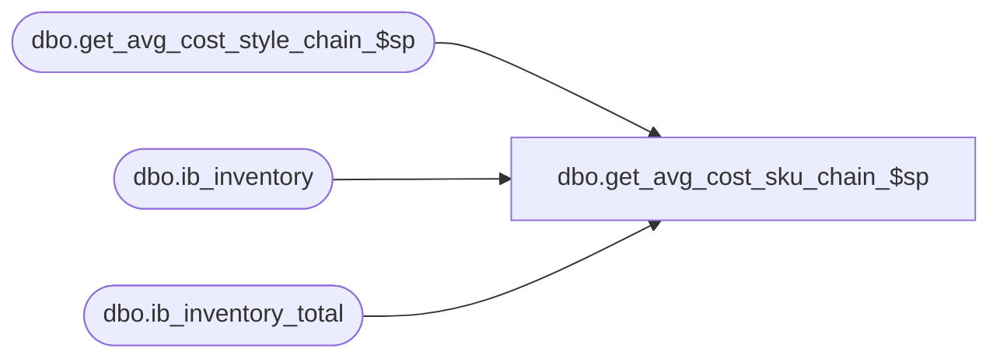

# dbo.get_avg_cost_sku_chain_$sp

**Database:** me_01  
**Server:** bedrockdb02  

## Architecture Diagram



## Table Dependencies

| Referenced Table |
|---|
| dbo.get_avg_cost_style_chain_$sp |
| dbo.ib_inventory |
| dbo.ib_inventory_total |

## Stored Procedure Code

```sql
-----------------------------------------------------------------------------------------------------------------------------
--	Main Query: Create Procedure
-----------------------------------------------------------------------------------------------------------------------------

CREATE PROCEDURE dbo.get_avg_cost_sku_chain_$sp

	 @Date AS SMALLDATETIME = NULL

AS

SET TRANSACTION ISOLATION LEVEL READ UNCOMMITTED
SET NOCOUNT ON

/*
	Get dynamic average cost by sku/chain
	Called by get_avg_cost_$sp

	History:
	10/14/2015	Ivan Dimitrov		144440 - Sales posting not calculating average cost correctly when on hand cost is 0, units > 0
	1/21/2016	Ivan Dimitrov		155050 - When there are transactions after the count date average cost calculation is wrong
*/


CREATE TABLE dbo.#temp_sku_chain
	(
		sku_id DECIMAL (13, 0) NULL
	)

INSERT INTO dbo.#temp_sku_chain
	(
		sku_id
	)
SELECT DISTINCT
	sku_id
FROM
	dbo.#temp_wrk_avg_cost_lookup

INSERT INTO dbo.#temp_avg_costs

	(
		location_id
		,sku_id
		,avg_cost
		,avg_cost_local
	)

SELECT
	TWACL.location_id
	,TWACL.sku_id
	,SQAV.avg_cost
	,SQAV.avg_cost_local
FROM
	dbo.#temp_wrk_avg_cost_lookup TWACL
	INNER JOIN

		(
			SELECT
				TSL.sku_id
				,SUM(IBIT.total_on_hand_cost - ISNULL (sqMV.transaction_cost, 0)) / SUM(CONVERT(BIGINT,IBIT.total_on_hand_units - ISNULL (sqMV.transaction_units, 0))) AS avg_cost
				,SUM(IBIT.total_on_hand_cost_local - ISNULL (sqMV.transaction_cost_local, 0)) / SUM(CONVERT(BIGINT,IBIT.total_on_hand_units - ISNULL (sqMV.transaction_units, 0))) AS avg_cost_local
			FROM
				(SELECT sku_id, location_id, SUM(total_on_hand_units) as total_on_hand_units,
						SUM(total_on_hand_cost) as total_on_hand_cost, SUM(total_on_hand_cost_local) as total_on_hand_cost_local
						FROM ib_inventory_total
						GROUP BY sku_id, location_id) IBIT
				INNER JOIN dbo.#temp_sku_chain TSL ON IBIT.sku_id = TSL.sku_id
				LEFT JOIN

					(
						SELECT
							 IBI.sku_id
							,IBI.location_id
							,SUM (IBI.transaction_cost) AS transaction_cost
							,SUM (IBI.transaction_cost_local) AS transaction_cost_local
							,SUM (IBI.transaction_units) AS transaction_units
					FROM
						dbo.ib_inventory IBI
					WHERE
						IBI.transaction_date > @Date
					GROUP BY
						 IBI.sku_id
						,IBI.location_id
					) sqMV ON sqMV.location_id = IBIT.location_id AND sqMV.sku_id = IBIT.sku_id

			GROUP BY
				TSL.sku_id
			HAVING
				SUM(IBIT.total_on_hand_cost - ISNULL (sqMV.transaction_cost, 0)) >= 0
				AND SUM(CONVERT(BIGINT,IBIT.total_on_hand_units - ISNULL (sqMV.transaction_units, 0))) > 0
		) SQAV ON TWACL.sku_id = SQAV.sku_id

EXEC dbo.get_avg_cost_style_chain_$sp

	@Date = @Date
```

