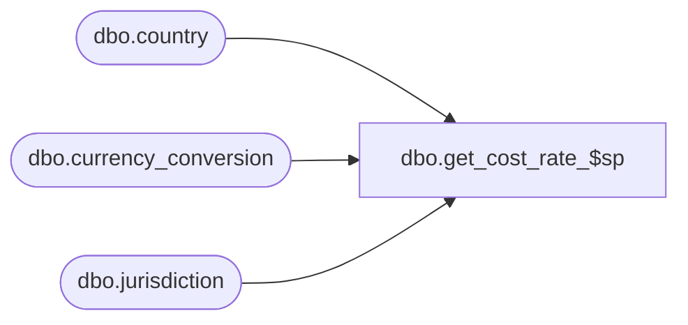

# dbo.get_cost_rate_$sp

**Database:** me_01  
**Server:** bedrockdb02  

## Architecture Diagram



## Table Dependencies

| Referenced Table |
|---|
| dbo.country |
| dbo.currency_conversion |
| dbo.jurisdiction |

## Stored Procedure Code

```sql
-----------------------------------------------------------------------------------------------------------------------------
--	Main Query: Create Procedure
-----------------------------------------------------------------------------------------------------------------------------

CREATE PROCEDURE dbo.get_cost_rate_$sp
AS

SET TRANSACTION ISOLATION LEVEL READ UNCOMMITTED
SET NOCOUNT ON


INSERT INTO dbo.#temp_cost_rates
	(
		 jurisdiction_id
		,transaction_date
		,cost_rate
	)
SELECT
	TWCRL.jurisdiction_id
	,TWCRL.transaction_date
	,CC.exchange_rate AS cost_rate
FROM
	#temp_wrk_cost_rate_lookup TWCRL
INNER JOIN jurisdiction J ON TWCRL.jurisdiction_id = J.jurisdiction_id
INNER JOIN country C ON J.country_id = C.country_id 
INNER JOIN currency_conversion CC ON C.currency_id = CC.to_currency_id
WHERE
	CC.currency_conversion_type = 1
	AND CC.effective_from_date <= TWCRL.transaction_date
	AND (CC.effective_to_date >= TWCRL.transaction_date
		OR CC.effective_to_date IS NULL)
```

