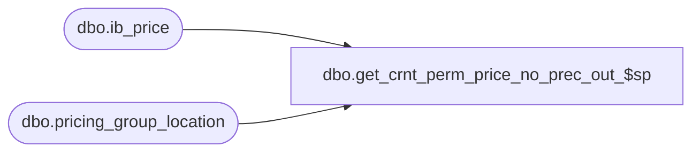

# dbo.get_crnt_perm_price_no_prec_out_$sp

**Database:** me_01  
**Server:** bedrockdb02  

## Architecture Diagram



## Table Dependencies

| Referenced Table |
|---|
| dbo.ib_price |
| dbo.pricing_group_location |

## Stored Procedure Code

```sql
/*
This is replacement of part of DoGetPermanentPrice(...) from STSIBInfobase.cpp. Query doesn't use precedence 
rule to return permanent price but always return price based on most recent date. In case, it doesn't find 
current retail then it will return future price based on old date(e.g. MIN(start_date)).

(@type parameter used to identify whether to query using start_date or effective_date.
	If @type = 1, then use @effective_date.
	If @type = 2, then use @start_date. 
)

(@check_price_group flag not getting used anywhere. 
	It was there to identify whether to use pricing_group_id for current retail
	If @check_price_group = 1 Then use pricing_group_id Else not. But that was wrong. 
	In order to avoid update in existing reports, we kept this parameter in this stored proc
)
*/
CREATE PROCEDURE [dbo].[get_crnt_perm_price_no_prec_out_$sp]
@jurisdiction_id SMALLINT, @style_id DECIMAL(12,0), @location_id SMALLINT, @color_id SMALLINT, 
@pricing_group_id SMALLINT, @temp_price_flag BIT, @check_date SMALLDATETIME, @check_price_group BIT, 
@type smallint, 
@valuation_retail_price DECIMAL(14,2) OUTPUT, 
@selling_retail_price DECIMAL(14,2) OUTPUT, 
@price_status_id SMALLINT OUTPUT, 
@end_date SMALLDATETIME OUTPUT

AS

DECLARE @start_date SMALLDATETIME, @effective_date SMALLDATETIME, @ib_price_id DECIMAL(12,0)

IF @check_date IS NULL
BEGIN
	SET @check_date = GETDATE()
END

-- Current Retail Price
BEGIN
	/*
		Current Retail price SQL divided into three parts i.e.
		Get @start_date and @effective_date to find @ib_price_id.
		Get @ib_price_id to find Current retail price
		Returning current retail price
	*/

	--Retrieving @start_date and @effective_date
	BEGIN
		/*SQL statement is selected based on parameters @location_id, @pricing_group_id and @color_id 
		  passed to get @start_date and @effective_date*/
		IF @location_id IS NULL
		BEGIN
			IF @pricing_group_id IS NULL
			BEGIN
				IF @color_id IS NULL
				BEGIN
					SELECT @start_date = MAX(ISNULL(start_date, 0)), @effective_date = MAX(ISNULL(effective_date, 0)) 
					FROM ib_price WITH (NOLOCK)
					WHERE jurisdiction_id = @jurisdiction_id AND style_id = @style_id 
					AND location_id IS NULL 
					AND (color_id IS NULL AND pricing_group_id IS NULL)
					AND temp_price_flag = @temp_price_flag 
					AND ((@type = 2 AND start_date <= @check_date) OR (@type = 1 AND effective_date <= @check_date)) 
				END
				ELSE
				BEGIN
					SELECT @start_date = MAX(ISNULL(start_date, 0)), @effective_date = MAX(ISNULL(effective_date, 0)) 
					FROM ib_price WITH (NOLOCK)
					WHERE jurisdiction_id = @jurisdiction_id AND style_id = @style_id 
					AND location_id IS NULL 
					AND ((color_id IS NULL AND pricing_group_id IS NULL)
					OR (color_id = @color_id AND pricing_group_id IS NULL)) 
					AND temp_price_flag = @temp_price_flag 
					AND ((@type = 2 AND start_date <= @check_date) OR (@type = 1 AND effective_date <= @check_date)) 	
				END		
			END
			ELSE
			BEGIN
				IF @color_id IS NULL
				BEGIN
					SELECT @start_date = MAX(ISNULL(start_date, 0)), @effective_date = MAX(ISNULL(effective_date, 0)) 
					FROM ib_price WITH (NOLOCK)
					WHERE jurisdiction_id = @jurisdiction_id AND style_id = @style_id 
					AND location_id IS NULL 
					AND ((color_id IS NULL AND pricing_group_id IS NULL)
					OR (pricing_group_id = @pricing_group_id AND color_id IS NULL)) 
					AND temp_price_flag = @temp_price_flag 
					AND ((@type = 2 AND start_date <= @check_date) OR (@type = 1 AND effective_date <= @check_date)) 
				END
				ELSE
				BEGIN
					SELECT @start_date = MAX(ISNULL(start_date, 0)), @effective_date = MAX(ISNULL(effective_date, 0)) 
					FROM ib_price WITH (NOLOCK)
					WHERE jurisdiction_id = @jurisdiction_id AND style_id = @style_id 
					AND location_id IS NULL 
					AND ((color_id IS NULL AND pricing_group_id IS NULL)
					OR (color_id = @color_id AND pricing_group_id IS NULL)
					OR (pricing_group_id = @pricing_group_id AND color_id IS NULL)
					OR (color_id = @color_id AND pricing_group_id = @pricing_group_id)) 
					AND temp_price_flag = @temp_price_flag 
					AND ((@type = 2 AND start_date <= @check_date) OR (@type = 1 AND effective_date <= @check_date)) 
				END
			END 			
		END
		ELSE
		BEGIN
			IF @color_id IS NULL
			BEGIN
				SELECT @start_date = MAX(ISNULL(start_date, 0)), @effective_date = MAX(ISNULL(effective_date, 0)) 
				FROM ib_price WITH (NOLOCK) 
				WHERE jurisdiction_id = @jurisdiction_id AND style_id = @style_id 
				AND ((color_id IS NULL AND location_id IS NULL AND pricing_group_id IS NULL) 
				OR (pricing_group_id = (SELECT pricing_group_id FROM pricing_group_location WITH (NOLOCK) WHERE location_id = @location_id) AND color_id IS NULL AND location_id IS NULL)
				OR (location_id = @location_id AND color_id IS NULL AND pricing_group_id IS NULL)
				) AND temp_price_flag = @temp_price_flag 
				AND ((@type = 2 AND start_date <= @check_date) OR (@type = 1 AND effective_date <= @check_date)) 
			END
			ELSE
			BEGIN
				SELECT @start_date = MAX(ISNULL(start_date, 0)), @effective_date = MAX(ISNULL(effective_date, 0)) 
				FROM ib_price WITH (NOLOCK) 
				WHERE jurisdiction_id = @jurisdiction_id AND style_id = @style_id 
				AND ((color_id IS NULL AND location_id IS NULL AND pricing_group_id IS NULL) 
				OR (color_id = @color_id AND location_id IS NULL AND pricing_group_id IS NULL) 
				OR (pricing_group_id = (SELECT pricing_group_id FROM pricing_group_location WITH (NOLOCK) WHERE location_id = @location_id) AND color_id IS NULL AND location_id IS NULL)
				OR (color_id = @color_id AND pricing_group_id = (SELECT pricing_group_id FROM pricing_group_location WITH (NOLOCK) WHERE location_id = @location_id) AND location_id IS NULL)
				OR (location_id = @location_id AND color_id IS NULL AND pricing_group_id IS NULL)
				OR (color_id = @color_id AND location_id = @location_id AND pricing_group_id IS NULL) 
				) AND temp_price_flag = @temp_price_flag  
				AND ((@type = 2 AND start_date <= @check_date) OR (@type = 1 AND effective_date <= @check_date)) 
			END
		END 
	END

	--Retrieving @ib_price_id using @start_date or @effective_date	
	BEGIN
		/*SQL statement is selected based on parameters @location_id, @pricing_group_id and @color_id 
		  passed to get @ib_price_id */
		IF @location_id IS NULL
		BEGIN
			IF @pricing_group_id IS NULL
			BEGIN
				IF @color_id IS NULL
				BEGIN
					SELECT @ib_price_id = MAX(ib_price_id) FROM ib_price WITH (NOLOCK) 
					WHERE jurisdiction_id=@jurisdiction_id AND style_id = @style_id 
					AND ((@type = 2 AND start_date = @start_date) OR (@type = 1 AND effective_date = @effective_date)) 
					AND location_id IS NULL 
					AND (color_id IS NULL AND pricing_group_id IS NULL)
					AND temp_price_flag = @temp_price_flag 
				END
				ELSE
				BEGIN
					SELECT @ib_price_id = MAX(ib_price_id) FROM ib_price WITH (NOLOCK) 
					WHERE jurisdiction_id=@jurisdiction_id AND style_id = @style_id 
					AND ((@type = 2 AND start_date = @start_date) OR (@type = 1 AND effective_date = @effective_date)) 
					AND location_id IS NULL 
					AND ((color_id IS NULL AND pricing_group_id IS NULL)
					OR (color_id = @color_id AND pricing_group_id IS NULL)) 
					AND temp_price_flag = @temp_price_flag 
				END
			END
			ELSE
			BEGIN
				IF @color_id IS NULL
				BEGIN
					SELECT @ib_price_id = MAX(ib_price_id) FROM ib_price WITH (NOLOCK) 
					WHERE jurisdiction_id=@jurisdiction_id AND style_id = @style_id 
					AND ((@type = 2 AND start_date = @start_date) OR (@type = 1 AND effective_date = @effective_date)) 
					AND location_id IS NULL 
					AND ((color_id IS NULL AND pricing_group_id IS NULL)
					OR (pricing_group_id = @pricing_group_id AND color_id IS NULL)) 
					AND temp_price_flag = @temp_price_flag 
				END
				ELSE
				BEGIN
					SELECT @ib_price_id = MAX(ib_price_id) FROM ib_price WITH (NOLOCK) 
					WHERE jurisdiction_id=@jurisdiction_id AND style_id = @style_id 
					AND ((@type = 2 AND start_date = @start_date) OR (@type = 1 AND effective_date = @effective_date)) 
					AND location_id IS NULL 
					AND ((color_id IS NULL AND pricing_group_id IS NULL)
					OR (color_id = @color_id AND pricing_group_id IS NULL)
					OR (pricing_group_id = @pricing_group_id AND color_id IS NULL)
					OR (color_id = @color_id AND pricing_group_id = @pricing_group_id)) 
					AND temp_price_flag = @temp_price_flag 
				END
			END
		END
		ELSE
		BEGIN
			IF @color_id IS NULL
			BEGIN
				SELECT @ib_price_id = MAX(ib_price_id) FROM ib_price WITH (NOLOCK) 
				WHERE jurisdiction_id = @jurisdiction_id AND style_id = @style_id 
				AND ((@type = 2 AND start_date = @start_date) OR (@type = 1 AND effective_date = @effective_date)) 
				AND ((color_id IS NULL AND location_id IS NULL AND pricing_group_id IS NULL) 
				OR (pricing_group_id = (SELECT pricing_group_id FROM pricing_group_location WITH (NOLOCK) WHERE location_id = @location_id) AND color_id IS NULL AND location_id IS NULL)
				OR (location_id = @location_id AND color_id IS NULL AND pricing_group_id IS NULL)) 
				AND temp_price_flag = @temp_price_flag
			END
			ELSE
			BEGIN
				SELECT @ib_price_id = MAX(ib_price_id) FROM ib_price WITH (NOLOCK) 
				WHERE jurisdiction_id = @jurisdiction_id AND style_id = @style_id 
				AND ((@type = 2 AND start_date = @start_date) OR (@type = 1 AND effective_date = @effective_date)) 
				AND ((color_id IS NULL AND location_id IS NULL AND pricing_group_id IS NULL) 
				OR (color_id = @color_id AND location_id IS NULL AND pricing_group_id IS NULL)
				OR (pricing_group_id = (SELECT pricing_group_id FROM pricing_group_location WITH (NOLOCK) WHERE location_id = @location_id) AND color_id IS NULL AND location_id IS NULL)
				OR (color_id = @color_id AND pricing_group_id = (SELECT pricing_group_id FROM pricing_group_location WITH (NOLOCK) WHERE location_id = @location_id) AND location_id IS NULL)
				OR (location_id = @location_id AND color_id IS NULL AND pricing_group_id IS NULL)
				OR (color_id = @color_id AND location_id = @location_id AND pricing_group_id IS NULL)) 
				AND temp_price_flag = @temp_price_flag
			END
		END
		
	END

	--Retrieving current retail price using @ib_price_id
	SELECT @valuation_retail_price = valuation_retail_price, @selling_retail_price = selling_retail_price, 
	@price_status_id = price_status_id, @end_date = end_date 
	FROM ib_price WITH (NOLOCK) 
	WHERE ib_price_id = @ib_price_id

END

--IF no price found, start looking for future price Again in three parts 
IF @@ROWCOUNT  = 0 
BEGIN
	--Retrieving @start_date and @effective_date
	BEGIN
		IF @location_id IS NULL
		BEGIN
			IF @pricing_group_id IS NULL
			BEGIN
				IF @color_id IS NULL
				BEGIN
					SELECT @start_date = MIN(ISNULL(start_date, 0)), @effective_date = MIN(ISNULL(effective_date, 0)) 
					FROM ib_price WITH (NOLOCK) 
					WHERE jurisdiction_id = @jurisdiction_id AND style_id = @style_id 
					AND location_id IS NULL 
					AND (color_id IS NULL AND pricing_group_id IS NULL)
					AND temp_price_flag = @temp_price_flag 
				END
				ELSE
				BEGIN
					SELECT @start_date = MIN(ISNULL(start_date, 0)), @effective_date = MIN(ISNULL(effective_date, 0)) 
					FROM ib_price WITH (NOLOCK) 
					WHERE jurisdiction_id = @jurisdiction_id AND style_id = @style_id 
					AND location_id IS NULL 
					AND ((color_id IS NULL AND pricing_group_id IS NULL)
					OR (color_id = @color_id AND pricing_group_id IS NULL)) 
					AND temp_price_flag = @temp_price_flag 
				END		
			END
			ELSE
			BEGIN
				IF @color_id IS NULL
				BEGIN
					SELECT @start_date = MIN(ISNULL(start_date, 0)), @effective_date = MIN(ISNULL(effective_date, 0)) 
					FROM ib_price WITH (NOLOCK) 
					WHERE jurisdiction_id = @jurisdiction_id AND style_id = @style_id 
					AND location_id IS NULL 
					AND ((color_id IS NULL AND pricing_group_id IS NULL)
					OR (pricing_group_id = @pricing_group_id AND color_id IS NULL)) 
					AND temp_price_flag = @temp_price_flag 
				END
				ELSE
				BEGIN
					SELECT @start_date = MIN(ISNULL(start_date, 0)), @effective_date = MIN(ISNULL(effective_date, 0)) 
					FROM ib_price WITH (NOLOCK) 
					WHERE jurisdiction_id = @jurisdiction_id AND style_id = @style_id 
					AND location_id IS NULL 
					AND ((color_id IS NULL AND pricing_group_id IS NULL)
					OR (color_id = @color_id AND pricing_group_id IS NULL)
					OR (pricing_group_id = @pricing_group_id AND color_id IS NULL)
					OR (color_id = @color_id AND pricing_group_id = @pricing_group_id)) 
					AND temp_price_flag = @temp_price_flag 
				END
			END	
		END
		ELSE
		BEGIN
			IF @color_id IS NULL
			BEGIN
				SELECT @start_date = MIN(ISNULL(start_date, 0)), @effective_date = MIN(ISNULL(effective_date, 0)) 
				FROM ib_price WITH (NOLOCK) 
				WHERE jurisdiction_id = @jurisdiction_id AND style_id = @style_id 
				AND ((color_id IS NULL AND location_id IS NULL AND pricing_group_id IS NULL)
				OR (pricing_group_id = (SELECT pricing_group_id FROM pricing_group_location WITH (NOLOCK) WHERE location_id = @location_id) AND color_id IS NULL AND location_id IS NULL)
				OR (location_id = @location_id AND color_id IS NULL AND pricing_group_id IS NULL)) 
				AND temp_price_flag = @temp_price_flag
			END
			ELSE
			BEGIN
				SELECT @start_date = MIN(ISNULL(start_date, 0)), @effective_date = MIN(ISNULL(effective_date, 0)) 
				FROM ib_price WITH (NOLOCK) 
				WHERE jurisdiction_id = @jurisdiction_id AND style_id = @style_id 
				AND ((color_id IS NULL AND location_id IS NULL AND pricing_group_id IS NULL) 
				OR (color_id = @color_id AND location_id IS NULL AND pricing_group_id IS NULL)
				OR (pricing_group_id = (SELECT pricing_group_id FROM pricing_group_location WITH (NOLOCK) WHERE location_id = @location_id) AND color_id IS NULL AND location_id IS NULL)
				OR (color_id = @color_id AND pricing_group_id = (SELECT pricing_group_id FROM pricing_group_location WITH (NOLOCK) WHERE location_id = @location_id) AND location_id IS NULL)
				OR (location_id = @location_id AND color_id IS NULL AND pricing_group_id IS NULL)
				OR (color_id = @color_id AND location_id = @location_id AND pricing_group_id IS NULL)) 
				AND temp_price_flag = @temp_price_flag
			END
		END
	END
		
	--Retrieving @ib_price_id using @start_date	or @effective_date		
	BEGIN 
		IF @location_id IS NULL
		BEGIN
			IF @pricing_group_id IS NULL
			BEGIN
				IF @color_id IS NULL
				BEGIN
					SELECT @ib_price_id = MIN(ib_price_id) FROM ib_price WITH (NOLOCK) 
					WHERE jurisdiction_id = @jurisdiction_id AND style_id = @style_id 
					AND ((@type = 2 AND start_date = @start_date) OR (@type = 1 AND effective_date = @effective_date)) 
					AND location_id IS NULL 
					AND (color_id IS NULL AND pricing_group_id IS NULL)
					AND temp_price_flag = @temp_price_flag 
				END
				ELSE
				BEGIN
					SELECT @ib_price_id = MIN(ib_price_id) FROM ib_price WITH (NOLOCK) 
					WHERE jurisdiction_id = @jurisdiction_id AND style_id = @style_id 
					AND ((@type = 2 AND start_date = @start_date) OR (@type = 1 AND effective_date = @effective_date)) 
					AND location_id IS NULL 
					AND ((color_id IS NULL AND pricing_group_id IS NULL)
					OR (color_id = @color_id AND pricing_group_id IS NULL)) 
					AND temp_price_flag = @temp_price_flag 
				END
			END
			ELSE
			BEGIN
				IF @color_id IS NULL
				BEGIN
					SELECT @ib_price_id = MIN(ib_price_id) FROM ib_price WITH (NOLOCK) 
					WHERE jurisdiction_id = @jurisdiction_id AND style_id = @style_id 
					AND ((@type = 2 AND start_date = @start_date) OR (@type = 1 AND effective_date = @effective_date)) 
					AND location_id IS NULL 
					AND ((color_id IS NULL AND pricing_group_id IS NULL)
					OR (pricing_group_id = @pricing_group_id AND color_id IS NULL)) 
					AND temp_price_flag = @temp_price_flag 
				END
				ELSE
				BEGIN
					SELECT @ib_price_id = MIN(ib_price_id) FROM ib_price WITH (NOLOCK) 
					WHERE jurisdiction_id = @jurisdiction_id AND style_id = @style_id 
					AND ((@type = 2 AND start_date = @start_date) OR (@type = 1 AND effective_date = @effective_date)) 
					AND location_id IS NULL 
					AND ((color_id IS NULL AND pricing_group_id IS NULL)
					OR (color_id = @color_id AND pricing_group_id IS NULL)
					OR (pricing_group_id = @pricing_group_id AND color_id IS NULL)
					OR (color_id = @color_id AND pricing_group_id = @pricing_group_id)) 
					AND temp_price_flag = @temp_price_flag 
				END
			END
		END
		ELSE
		BEGIN
			IF @color_id IS NULL
			BEGIN
				SELECT @ib_price_id = MIN(ib_price_id) 
				FROM ib_price WITH (NOLOCK) 
				WHERE jurisdiction_id = @jurisdiction_id AND style_id = @style_id 
				AND ((@type = 2 AND start_date = @start_date) OR (@type = 1 AND effective_date = @effective_date)) 
				AND ((color_id IS NULL AND location_id IS NULL AND pricing_group_id IS NULL) 
				OR (pricing_group_id = (SELECT pricing_group_id FROM pricing_group_location WITH (NOLOCK) WHERE location_id = @location_id) AND color_id IS NULL AND location_id IS NULL)
				OR (location_id = @location_id AND color_id IS NULL AND pricing_group_id IS NULL)) 
				AND temp_price_flag = @temp_price_flag
			END
			ELSE
			BEGIN
				SELECT @ib_price_id = MIN(ib_price_id) 
				FROM ib_price WITH (NOLOCK) 
				WHERE jurisdiction_id = @jurisdiction_id AND style_id = @style_id 
				AND ((@type = 2 AND start_date = @start_date) OR (@type = 1 AND effective_date = @effective_date)) 
				AND ((color_id IS NULL AND location_id IS NULL AND pricing_group_id IS NULL) 
				OR (color_id = @color_id AND location_id IS NULL AND pricing_group_id IS NULL) 
				OR (pricing_group_id = (SELECT pricing_group_id FROM pricing_group_location WITH (NOLOCK) WHERE location_id = @location_id) AND color_id IS NULL AND location_id IS NULL)
				OR (color_id = @color_id AND pricing_group_id = (SELECT pricing_group_id FROM pricing_group_location WITH (NOLOCK) WHERE location_id = @location_id) AND location_id IS NULL)
				OR (location_id = @location_id AND color_id IS NULL AND pricing_group_id IS NULL)
				OR (color_id = @color_id AND location_id = @location_id AND pricing_group_id IS NULL)) 
				AND temp_price_flag = @temp_price_flag
			END
		END
	END
		
	--Retrieving current retail price using @ib_price_id
	SELECT @valuation_retail_price = valuation_retail_price, @selling_retail_price = selling_retail_price, 
	@price_status_id = price_status_id, @end_date = end_date 
	FROM ib_price WITH (NOLOCK) 
	WHERE ib_price_id = @ib_price_id AND document_number IS NULL
END

RETURN 0
```

