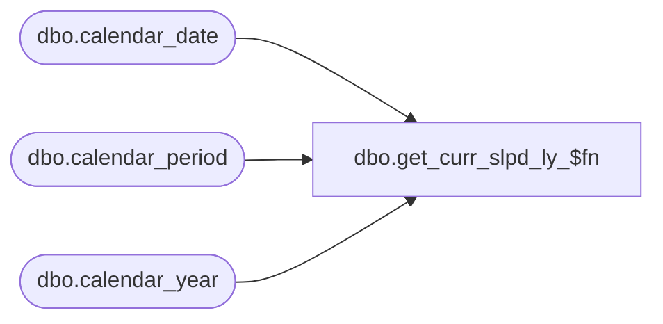

# dbo.get_curr_slpd_ly_$fn

**Database:** me_01  
**Server:** bedrockdb02  

## Architecture Diagram



## Table Dependencies

| Referenced Table |
|---|
| dbo.calendar_date |
| dbo.calendar_period |
| dbo.calendar_year |

## Stored Procedure Code

```sql
create proc dbo.get_curr_slpd_ly_$fn  @dummy int, @dummy2 int


AS

Declare @curr_period_id_ly  int


SELECT @curr_period_id_ly  = cp.calendar_period_id 
FROM calendar_period cp, calendar_year cy, calendar_date cd
WHERE CONVERT(SMALLDATETIME,CONVERT(CHAR(12),GETDATE(),109)) = cd.calendar_date
AND cd.merch_period = cp.calendar_period_code
AND (cd.merch_year - 1 ) = cy.calendar_year_code
AND cy.calendar_year_id = cp.calendar_year_id;

return isnull( @curr_period_id_ly,0);
```

