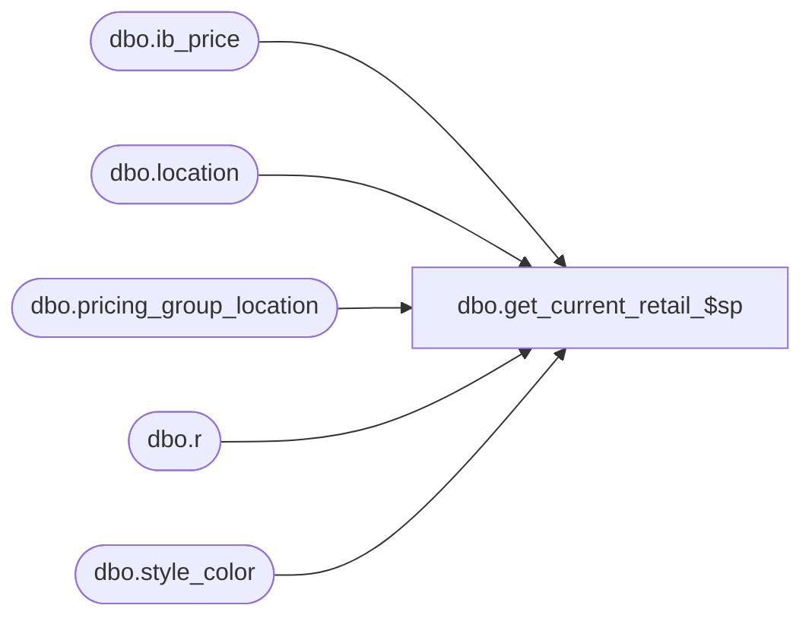

# dbo.get_current_retail_$sp

**Database:** me_01  
**Server:** bedrockdb02  

## Architecture Diagram



## Table Dependencies

| Referenced Table |
|---|
| dbo.ib_price |
| dbo.location |
| dbo.pricing_group_location |
| dbo.r |
| dbo.style_color |

## Stored Procedure Code

```sql
CREATE PROCEDURE [dbo].[get_current_retail_$sp] 
   @merchandise_level tinyint
AS
/*
  This stored procedure retrieves the current retails of the style color / locations stored in a temp table provided by a calling process,
  and store the retail prices into that temp table. 
  
  The proc parameter @merchandise_level contains 3 possible values:
     - 1 = style level: current retails will be retrieved in style level and stored in #temp_style_retail
     - 2 = style color level: current retails will be retrieved in style color level and stored in #temp_style_color_retail
     - 3 = both: current retails will be retrieved in both style and style color levels and stored in both temp tables
  
  The precedence of exception levels is:
      - style loc color
      - style loc
      - style pricing group color
      - style pricing group
      - style color
      - style
  The stored proc will retrieve current retails first, if a current retail is not found for a given style/location or style color/location,
  it will try to find the future retail in the nearest future.
  
*/
BEGIN
/*
CREATE TABLE #temp_style_retail(
   location_id                smallint not null,
   style_id                   decimal(12, 0) not null,
   selling_retail_price       decimal(14, 2) null,
   valuation_retail_price     decimal(14, 2) null
   UNIQUE (location_id, style_id)
   )

CREATE TABLE #temp_style_color_retail(
   location_id                smallint not null,
   style_color_id             decimal(13, 0) null,
   selling_retail_price       decimal(14, 2) null,
   valuation_retail_price     decimal(14, 2) null
   UNIQUE (location_id, style_color_id)
   )
*/
   
   DECLARE @curr_date smalldatetime
   SET @curr_date = GETDATE()
   
   -- 1 retrieve current retail
   
   
   -- 1.1 retrieve current retail for style level

   IF (@merchandise_level = 1 OR @merchandise_level = 3) 
   -- 1.1.1 if @merchandise_level = 1 style or 3 both, retrieve current style retails and  store them in style level temp table
   BEGIN
      UPDATE r
      SET    selling_retail_price = ip.selling_retail_price, 
             valuation_retail_price = ip.valuation_retail_price
      FROM   #temp_style_retail r
      INNER JOIN ib_price ip WITH (NOLOCK)
         ON  ip.style_id = r.style_id
         AND ip.temp_price_flag = 0
         AND ip.effective_date <= @curr_date
         AND ip.color_id IS NULL
      INNER JOIN location l WITH (NOLOCK)
         ON  l.location_id = r.location_id
         AND l.jurisdiction_id = ip.jurisdiction_id
         AND ip.location_id IS NULL
         AND ip.pricing_group_id IS NULL
      INNER JOIN
           (SELECT ip.jurisdiction_id, ip.style_id, MAX(ib_price_id) max_ib_price_id
            FROM #temp_style_retail r
            INNER JOIN ib_price ip WITH (NOLOCK)
               ON  ip.style_id = r.style_id
               AND ip.temp_price_flag = 0
               AND ip.effective_date <= @curr_date
               AND ip.color_id IS NULL
            INNER JOIN location l WITH (NOLOCK)
               ON  l.location_id = r.location_id
               AND l.jurisdiction_id = ip.jurisdiction_id
               AND ip.location_id IS NULL
               AND ip.pricing_group_id IS NULL
            INNER JOIN 
                 (SELECT ip.jurisdiction_id, ip.style_id, MAX(effective_date) max_effective_date
                  FROM   #temp_style_retail r
                  INNER JOIN ib_price ip WITH (NOLOCK)
                     ON  ip.style_id = r.style_id
                     AND ip.temp_price_flag = 0
                     AND ip.effective_date <= @curr_date
                     AND ip.color_id IS NULL
                  INNER JOIN location l WITH (NOLOCK)
                     ON  l.location_id = r.location_id
                     AND l.jurisdiction_id = ip.jurisdiction_id
                     AND ip.location_id IS NULL
                     AND ip.pricing_group_id IS NULL
                  GROUP BY ip.jurisdiction_id, ip.style_id
                 ) mdt
               ON  mdt.style_id = ip.style_id
               AND mdt.jurisdiction_id = ip.jurisdiction_id
               AND mdt.max_effective_date = ip.effective_date
            GROUP BY ip.jurisdiction_id, ip.style_id
           ) mid
         ON  mid.style_id = ip.style_id
         AND mid.jurisdiction_id = ip.jurisdiction_id
         AND mid.max_ib_price_id = ip.ib_price_id
   END
   
   IF (@merchandise_level = 2 OR @merchandise_level = 3) 
   -- 1.1.2 if @merchandise_level = 2 style color or 3 both, retrieve current style retails and store them in style color level temp table
   BEGIN
      UPDATE r
      SET    selling_retail_price = ip.selling_retail_price, 
             valuation_retail_price = ip.valuation_retail_price
      FROM   #temp_style_color_retail r
      INNER JOIN style_color sc WITH (NOLOCK)
         ON r.style_color_id = sc.style_color_id
      INNER JOIN ib_price ip WITH (NOLOCK)
         ON  ip.style_id = sc.style_id
         AND ip.temp_price_flag = 0
         AND ip.effective_date <= @curr_date
         AND ip.color_id IS NULL
      INNER JOIN location l WITH (NOLOCK)
         ON  l.location_id = r.location_id
         AND l.jurisdiction_id = ip.jurisdiction_id
         AND ip.location_id IS NULL
         AND ip.pricing_group_id IS NULL
      INNER JOIN
           (SELECT ip.jurisdiction_id, ip.style_id, MAX(ib_price_id) max_ib_price_id
            FROM #temp_style_color_retail r
            INNER JOIN style_color sc WITH (NOLOCK)
               ON r.style_color_id = sc.style_color_id
            INNER JOIN ib_price ip WITH (NOLOCK)
               ON  ip.style_id = sc.style_id
               AND ip.temp_price_flag = 0
               AND ip.effective_date <= @curr_date
               AND ip.color_id IS NULL
            INNER JOIN location l WITH (NOLOCK)
               ON  l.location_id = r.location_id
               AND l.jurisdiction_id = ip.jurisdiction_id
               AND ip.location_id IS NULL
               AND ip.pricing_group_id IS NULL
            INNER JOIN 
                 (SELECT ip.jurisdiction_id, ip.style_id, MAX(effective_date) max_effective_date
                  FROM   #temp_style_color_retail r
                  INNER JOIN style_color sc WITH (NOLOCK)
                     ON r.style_color_id = sc.style_color_id
                  INNER JOIN ib_price ip WITH (NOLOCK)
                     ON  ip.style_id = sc.style_id
                     AND ip.temp_price_flag = 0
                     AND ip.effective_date <= @curr_date
                     AND ip.color_id IS NULL
                  INNER JOIN location l WITH (NOLOCK)
                     ON  l.location_id = r.location_id
                     AND l.jurisdiction_id = ip.jurisdiction_id
                     AND ip.location_id IS NULL
                     AND ip.pricing_group_id IS NULL
                  GROUP BY ip.jurisdiction_id, ip.style_id
                 ) mdt
               ON  mdt.style_id = ip.style_id
               AND mdt.jurisdiction_id = ip.jurisdiction_id
               AND mdt.max_effective_date = ip.effective_date
            GROUP BY ip.jurisdiction_id, ip.style_id
           ) mid
         ON  mid.style_id = ip.style_id
         AND mid.jurisdiction_id = ip.jurisdiction_id
         AND mid.max_ib_price_id = ip.ib_price_id
   END
   
   -- 1.2 retrieve current retail for style color level
   IF (@merchandise_level = 2 OR @merchandise_level = 3) 
   -- 1.2.1 if @merchandise_level = 2 style color or 3 both, retrieve current style color retails and store them in style color level temp table
   BEGIN
      UPDATE r
      SET    selling_retail_price = ip.selling_retail_price, 
             valuation_retail_price = ip.valuation_retail_price
      FROM   #temp_style_color_retail r
      INNER JOIN style_color sc WITH (NOLOCK)
         ON  sc.style_color_id = r.style_color_id
      INNER JOIN ib_price ip WITH (NOLOCK)
         ON  ip.style_id = sc.style_id 
         AND ip.color_id = sc.color_id
         AND ip.temp_price_flag = 0
         AND ip.effective_date <= @curr_date
      INNER JOIN location l WITH (NOLOCK)
         ON  l.location_id = r.location_id
         AND l.jurisdiction_id = ip.jurisdiction_id
         AND ip.location_id IS NULL
         AND ip.pricing_group_id IS NULL
      INNER JOIN
           (SELECT ip.jurisdiction_id, r.style_color_id, MAX(ib_price_id) max_ib_price_id
            FROM #temp_style_color_retail r
            INNER JOIN style_color sc WITH (NOLOCK)
               ON  sc.style_color_id = r.style_color_id
            INNER JOIN ib_price ip WITH (NOLOCK)
               ON  ip.style_id = sc.style_id 
               AND ip.color_id = sc.color_id
               AND ip.temp_price_flag = 0
               AND ip.effective_date <= @curr_date
            INNER JOIN location l WITH (NOLOCK)
               ON  l.location_id = r.location_id
               AND l.jurisdiction_id = ip.jurisdiction_id
               AND ip.location_id IS NULL
               AND ip.pricing_group_id IS NULL
            INNER JOIN 
                 (SELECT ip.jurisdiction_id, r.style_color_id, MAX(effective_date) max_effective_date
                  FROM   #temp_style_color_retail r
                  INNER JOIN style_color sc WITH (NOLOCK)
                     ON  sc.style_color_id = r.style_color_id
                  INNER JOIN ib_price ip WITH (NOLOCK)
                     ON  ip.style_id = sc.style_id 
                     AND ip.color_id = sc.color_id
                     AND ip.temp_price_flag = 0
                     AND ip.effective_date <= @curr_date
                  INNER JOIN location l WITH (NOLOCK)
                     ON  l.location_id = r.location_id
                     AND l.jurisdiction_id = ip.jurisdiction_id
                     AND ip.location_id IS NULL
                     AND ip.pricing_group_id IS NULL
                  GROUP BY ip.jurisdiction_id, r.style_color_id
                 ) mdt
               ON  mdt.style_color_id = r.style_color_id
               AND mdt.jurisdiction_id = ip.jurisdiction_id
               AND mdt.max_effective_date = ip.effective_date
            GROUP BY ip.jurisdiction_id, r.style_color_id
           ) mid
         ON  mid.style_color_id = r.style_color_id
         AND mid.jurisdiction_id = ip.jurisdiction_id
         AND mid.max_ib_price_id = ip.ib_price_id
   END
  
   -- 1.3 retrieve current retail for style pricing group level
  
   IF (@merchandise_level = 1 OR @merchandise_level = 3)
   -- 1.3.1 if @merchandise_level = 1 style or 3 both, retrieve current style pricing group retails and store them in style level temp table
   BEGIN
      UPDATE r
      SET    selling_retail_price = ip.selling_retail_price, 
             valuation_retail_price = ip.valuation_retail_price
      FROM   #temp_style_retail r
      INNER JOIN ib_price ip WITH (NOLOCK)
         ON  r.style_id = ip.style_id
         AND ip.temp_price_flag = 0
         AND ip.effective_date <= @curr_date
         AND ip.color_id IS NULL
      INNER JOIN pricing_group_location pcl WITH (NOLOCK)
         ON  pcl.location_id = r.location_id
         AND pcl.pricing_group_id = ip.pricing_group_id
         AND ip.location_id IS NULL
      INNER JOIN
           (SELECT ip.pricing_group_id, ip.style_id, MAX(ib_price_id) max_ib_price_id
            FROM #temp_style_retail r
            INNER JOIN ib_price ip WITH (NOLOCK)
               ON  r.style_id = ip.style_id
               AND ip.temp_price_flag = 0
               AND ip.effective_date <= @curr_date
               AND ip.color_id IS NULL
            INNER JOIN pricing_group_location pcl WITH (NOLOCK)
               ON  pcl.location_id = r.location_id
               AND pcl.pricing_group_id = ip.pricing_group_id
               AND ip.location_id IS NULL
            INNER JOIN 
                 (SELECT ip.pricing_group_id, ip.style_id, MAX(effective_date) max_effective_date
                  FROM   #temp_style_retail r
                  INNER JOIN ib_price ip WITH (NOLOCK)
                     ON  r.style_id = ip.style_id
                     AND ip.temp_price_flag = 0
                     AND ip.effective_date <= @curr_date
                     AND ip.color_id IS NULL
                  INNER JOIN pricing_group_location pcl WITH (NOLOCK)
                     ON  pcl.location_id = r.location_id
                     AND pcl.pricing_group_id = ip.pricing_group_id
                     AND ip.location_id IS NULL
                  GROUP BY ip.pricing_group_id, ip.style_id
                 ) mdt
               ON  mdt.style_id = ip.style_id
               AND mdt.pricing_group_id = ip.pricing_group_id
               AND mdt.max_effective_date = ip.effective_date
               GROUP BY ip.pricing_group_id, ip.style_id
           ) mid
         ON  mid.style_id = ip.style_id
         AND mid.pricing_group_id = ip.pricing_group_id
         AND mid.max_ib_price_id = ip.ib_price_id
   END
   
   
   IF (@merchandise_level = 2 OR @merchandise_level = 3) 
   -- 1.3.2 if @merchandise_level = 2 style color or 3 both, retrieve current style pricing group retails and store them in style color level temp table
   BEGIN
      UPDATE r
      SET    selling_retail_price = ip.selling_retail_price, 
             valuation_retail_price = ip.valuation_retail_price
      FROM   #temp_style_color_retail r
      INNER JOIN style_color sc WITH (NOLOCK)
         ON  r.style_color_id = sc.style_color_id
      INNER JOIN ib_price ip WITH (NOLOCK)
         ON  ip.style_id = sc.style_id
         AND ip.temp_price_flag = 0
         AND ip.effective_date <= @curr_date
         AND ip.color_id IS NULL
      INNER JOIN pricing_group_location pcl WITH (NOLOCK)
         ON  pcl.location_id = r.location_id
         AND pcl.pricing_group_id = ip.pricing_group_id
         AND ip.location_id IS NULL
      INNER JOIN
           (SELECT ip.pricing_group_id, ip.style_id, MAX(ib_price_id) max_ib_price_id
            FROM #temp_style_color_retail r
            INNER JOIN style_color sc WITH (NOLOCK)
               ON  r.style_color_id = sc.style_color_id
            INNER JOIN ib_price ip WITH (NOLOCK)
               ON  ip.style_id = sc.style_id
               AND ip.temp_price_flag = 0
               AND ip.effective_date <= @curr_date
               AND ip.color_id IS NULL
            INNER JOIN pricing_group_location pcl WITH (NOLOCK)
               ON  pcl.location_id = r.location_id
               AND pcl.pricing_group_id = ip.pricing_group_id
               AND ip.location_id IS NULL
            INNER JOIN 
                 (SELECT ip.pricing_group_id, ip.style_id, MAX(effective_date) max_effective_date
                  FROM   #temp_style_color_retail r
                  INNER JOIN style_color sc WITH (NOLOCK)
                     ON  r.style_color_id = sc.style_color_id
                  INNER JOIN ib_price ip WITH (NOLOCK)
                     ON  ip.style_id = sc.style_id
                     AND ip.temp_price_flag = 0
                     AND ip.effective_date <= @curr_date
                     AND ip.color_id IS NULL
                  INNER JOIN pricing_group_location pcl WITH (NOLOCK)
                     ON  pcl.location_id = r.location_id
                     AND pcl.pricing_group_id = ip.pricing_group_id
                     AND ip.location_id IS NULL
                  GROUP BY ip.pricing_group_id, ip.style_id
                 ) mdt
               ON  mdt.style_id = ip.style_id
               AND mdt.pricing_group_id = ip.pricing_group_id
               AND mdt.max_effective_date = ip.effective_date
               GROUP BY ip.pricing_group_id, ip.style_id
           ) mid
         ON  mid.style_id = ip.style_id
         AND mid.pricing_group_id = ip.pricing_group_id
         AND mid.max_ib_price_id = ip.ib_price_id
   END

  
   -- 1.4 retrieve current retail for style pricing group color level
   IF (@merchandise_level = 2 OR @merchandise_level = 3) 
   -- 1.4.1 if @merchandise_level = 2 style color or 3 both, retrieve current style pricing group color retails and store them in style color level temp table
   BEGIN
      UPDATE r
      SET    selling_retail_price = ip.selling_retail_price, 
             valuation_retail_price = ip.valuation_retail_price
      FROM   #temp_style_color_retail r
      INNER JOIN style_color sc WITH (NOLOCK)
         ON  sc.style_color_id = r.style_color_id
      INNER JOIN ib_price ip WITH (NOLOCK)
         ON  ip.style_id = sc.style_id
         AND ip.color_id = sc.color_id
         AND ip.temp_price_flag = 0
         AND ip.effective_date <= @curr_date
      INNER JOIN pricing_group_location pcl WITH (NOLOCK)
         ON  pcl.location_id = r.location_id
         AND pcl.pricing_group_id = ip.pricing_group_id
         AND ip.location_id IS NULL
      INNER JOIN
           (SELECT ip.pricing_group_id, r.style_color_id, MAX(ib_price_id) max_ib_price_id
            FROM #temp_style_color_retail r
            INNER JOIN style_color sc WITH (NOLOCK)
               ON  sc.style_color_id = r.style_color_id
            INNER JOIN ib_price ip WITH (NOLOCK)
               ON  ip.style_id = sc.style_id
               AND ip.color_id = sc.color_id
               AND ip.temp_price_flag = 0
               AND ip.effective_date <= @curr_date
            INNER JOIN pricing_group_location pcl WITH (NOLOCK)
               ON  pcl.location_id = r.location_id
               AND pcl.pricing_group_id = ip.pricing_group_id
               AND ip.location_id IS NULL
            INNER JOIN 
                 (SELECT ip.pricing_group_id, r.style_color_id, MAX(effective_date) max_effective_date
                  FROM   #temp_style_color_retail r
                  INNER JOIN style_color sc WITH (NOLOCK)
                     ON  sc.style_color_id = r.style_color_id
                  INNER JOIN ib_price ip WITH (NOLOCK)
                     ON  ip.style_id = sc.style_id
                     AND ip.color_id = sc.color_id
                     AND ip.temp_price_flag = 0
                     AND ip.effective_date <= @curr_date
                  INNER JOIN pricing_group_location pcl WITH (NOLOCK)
                     ON  pcl.location_id = r.location_id
                     AND pcl.pricing_group_id = ip.pricing_group_id
                     AND ip.location_id IS NULL
                  GROUP BY ip.pricing_group_id, r.style_color_id
                 ) mdt
               ON  mdt.style_color_id = r.style_color_id
               AND mdt.pricing_group_id = ip.pricing_group_id
               AND mdt.max_effective_date = ip.effective_date
            GROUP BY ip.pricing_group_id, r.style_color_id
           ) mid
         ON  mid.style_color_id = r.style_color_id
         AND mid.pricing_group_id = ip.pricing_group_id
         AND mid.max_ib_price_id = ip.ib_price_id
   END
   
   -- 1.5 retrieve current retail for style location level
   
   IF (@merchandise_level = 1 OR @merchandise_level = 3)
   -- 1.5.1 if @merchandise_level = 1 style or 3 both, retrieve current style location retails and store them in style level temp table
   BEGIN
      UPDATE r
      SET    selling_retail_price = ip.selling_retail_price, 
             valuation_retail_price = ip.valuation_retail_price
      FROM   #temp_style_retail r
      INNER JOIN ib_price ip WITH (NOLOCK)
         ON  r.style_id = ip.style_id
         AND r.location_id = ip.location_id
         AND ip.temp_price_flag = 0
         AND ip.effective_date <= @curr_date
         AND ip.color_id IS NULL
         AND ip.pricing_group_id IS NULL
      INNER JOIN
           (SELECT ip.location_id, ip.style_id, MAX(ib_price_id) max_ib_price_id
            FROM #temp_style_retail r
            INNER JOIN ib_price ip WITH (NOLOCK)
               ON  r.style_id = ip.style_id
               AND r.location_id = ip.location_id
               AND ip.temp_price_flag = 0
               AND ip.effective_date <= @curr_date
               AND ip.color_id IS NULL
               AND ip.pricing_group_id IS NULL
            INNER JOIN 
                 (SELECT ip.location_id, ip.style_id, MAX(effective_date) max_effective_date
                  FROM   #temp_style_retail r
                  INNER JOIN ib_price ip WITH (NOLOCK)
                     ON  r.style_id = ip.style_id
                     AND r.location_id = ip.location_id
                     AND ip.temp_price_flag = 0
                     AND ip.effective_date <= @curr_date
                     AND ip.color_id IS NULL
                     AND ip.pricing_group_id IS NULL
                  GROUP BY ip.location_id, ip.style_id
                 ) mdt
               ON  mdt.style_id = ip.style_id
               AND mdt.location_id = ip.location_id
               AND mdt.max_effective_date = ip.effective_date
            GROUP BY ip.location_id, ip.style_id
           ) mid
         ON  mid.style_id = ip.style_id
         AND mid.location_id = ip.location_id
         AND mid.max_ib_price_id = ip.ib_price_id
   END

   IF (@merchandise_level = 2 OR @merchandise_level = 3) 
   -- 1.5.2 if @merchandise_level = 2 style or 3 both, retrieve current style location retails and store them in style color level temp table
   BEGIN
      UPDATE r
      SET    selling_retail_price = ip.selling_retail_price, 
             valuation_retail_price = ip.valuation_retail_price
      FROM   #temp_style_color_retail r
      INNER JOIN style_color sc WITH (NOLOCK)
         ON  r.style_color_id = sc.style_color_id
      INNER JOIN ib_price ip WITH (NOLOCK)
         ON  ip.style_id = sc.style_id
         AND ip.location_id = r.location_id
         AND ip.temp_price_flag = 0
         AND ip.effective_date <= @curr_date
         AND ip.color_id IS NULL
         AND ip.pricing_group_id IS NULL
      INNER JOIN
           (SELECT ip.location_id, ip.style_id, MAX(ib_price_id) max_ib_price_id
            FROM #temp_style_color_retail r
            INNER JOIN style_color sc WITH (NOLOCK)
               ON  r.style_color_id = sc.style_color_id
            INNER JOIN ib_price ip WITH (NOLOCK)
               ON  ip.style_id = sc.style_id
               AND ip.location_id = r.location_id
               AND ip.temp_price_flag = 0
               AND ip.effective_date <= @curr_date
               AND ip.color_id IS NULL
               AND ip.pricing_group_id IS NULL
            INNER JOIN 
                 (SELECT ip.location_id, ip.style_id, MAX(effective_date) max_effective_date
                  FROM   #temp_style_color_retail r
                  INNER JOIN style_color sc WITH (NOLOCK)
                     ON  r.style_color_id = sc.style_color_id
                  INNER JOIN ib_price ip WITH (NOLOCK)
                     ON  ip.style_id = sc.style_id
                     AND ip.location_id = r.location_id
                     AND ip.temp_price_flag = 0
                     AND ip.effective_date <= @curr_date
                     AND ip.color_id IS NULL
                     AND ip.pricing_group_id IS NULL
                  GROUP BY ip.location_id, ip.style_id
                 ) mdt
               ON  mdt.style_id = ip.style_id
               AND mdt.location_id = ip.location_id
               AND mdt.max_effective_date = ip.effective_date
            GROUP BY ip.location_id, ip.style_id
           ) mid
         ON  mid.style_id = ip.style_id
         AND mid.location_id = ip.location_id
         AND mid.max_ib_price_id = ip.ib_price_id
   END
   
   -- 1.6 retrieve current retail for style location color level

   IF (@merchandise_level = 2 OR @merchandise_level = 3) 
   -- 1.6.1 if @merchandise_level = 2 style or 3 both, retrieve current style location color retails and store them in style color level temp table
   BEGIN
      UPDATE r
      SET    selling_retail_price = ip.selling_retail_price, 
             valuation_retail_price = ip.valuation_retail_price
      FROM   #temp_style_color_retail r
      INNER JOIN style_color sc WITH (NOLOCK)
         ON  r.style_color_id = sc.style_color_id
      INNER JOIN ib_price ip WITH (NOLOCK)
         ON  ip.style_id = sc.style_id
         AND ip.color_id = sc.color_id
         AND ip.location_id = r.location_id
         AND ip.temp_price_flag = 0
         AND ip.effective_date <= @curr_date
         AND ip.pricing_group_id IS NULL
      INNER JOIN
           (SELECT ip.location_id, r.style_color_id, MAX(ib_price_id) max_ib_price_id
            FROM #temp_style_color_retail r
            INNER JOIN style_color sc WITH (NOLOCK)
               ON  r.style_color_id = sc.style_color_id
            INNER JOIN ib_price ip WITH (NOLOCK)
               ON  ip.style_id = sc.style_id
               AND ip.color_id = sc.color_id
               AND ip.location_id = r.location_id
               AND ip.temp_price_flag = 0
               AND ip.effective_date <= @curr_date
               AND ip.pricing_group_id IS NULL
            INNER JOIN 
                 (SELECT ip.location_id, r.style_color_id, MAX(effective_date) max_effective_date
                  FROM   #temp_style_color_retail r
                  INNER JOIN style_color sc WITH (NOLOCK)
                     ON  r.style_color_id = sc.style_color_id
                  INNER JOIN ib_price ip WITH (NOLOCK)
                     ON  ip.style_id = sc.style_id
                     AND ip.color_id = sc.color_id
                     AND ip.location_id = r.location_id
                     AND ip.temp_price_flag = 0
                     AND ip.effective_date <= @curr_date
                     AND ip.pricing_group_id IS NULL
                  GROUP BY ip.location_id, r.style_color_id
                 ) mdt
               ON  mdt.style_color_id = r.style_color_id
               AND mdt.location_id = ip.location_id
               AND mdt.max_effective_date = ip.effective_date
            GROUP BY ip.location_id, r.style_color_id
           ) mid
         ON  mid.style_color_id = r.style_color_id
         AND mid.location_id = ip.location_id
         AND mid.max_ib_price_id = ip.ib_price_id
   END
   
   
   -- 2 retrieve future retail if current retail not found
  
   -- 2.1 retrieve future retail for style location color level

   IF (@merchandise_level = 2 OR @merchandise_level = 3) AND EXISTS (SELECT 1 FROM #temp_style_color_retail WHERE selling_retail_price IS NULL)
   -- 2.1.1 if @merchandise_level = 2 style or 3 both, retrieve future style location color retails and store them in style color level temp table
   BEGIN
      UPDATE r
      SET    selling_retail_price = ip.selling_retail_price, 
             valuation_retail_price = ip.valuation_retail_price
      FROM   #temp_style_color_retail r
      INNER JOIN style_color sc WITH (NOLOCK)
         ON  r.style_color_id = sc.style_color_id
         AND r.selling_retail_price IS NULL
      INNER JOIN ib_price ip WITH (NOLOCK)
         ON  ip.style_id = sc.style_id
         AND ip.color_id = sc.color_id
         AND ip.location_id = r.location_id
         AND ip.temp_price_flag = 0
         AND ip.pricing_group_id IS NULL
      INNER JOIN
           (SELECT ip.location_id, r.style_color_id, MIN(ib_price_id) max_ib_price_id
            FROM #temp_style_color_retail r
            INNER JOIN style_color sc WITH (NOLOCK)
               ON  r.style_color_id = sc.style_color_id
               AND r.selling_retail_price IS NULL
            INNER JOIN ib_price ip WITH (NOLOCK)
               ON  ip.style_id = sc.style_id
               AND ip.color_id = sc.color_id
               AND ip.location_id = r.location_id
               AND ip.temp_price_flag = 0
               AND ip.pricing_group_id IS NULL
            INNER JOIN 
                 (SELECT ip.location_id, r.style_color_id, MIN(effective_date) max_effective_date
                  FROM   #temp_style_color_retail r
                  INNER JOIN style_color sc WITH (NOLOCK)
                     ON  r.style_color_id = sc.style_color_id
                     AND r.selling_retail_price IS NULL
                  INNER JOIN ib_price ip WITH (NOLOCK)
                     ON  ip.style_id = sc.style_id
                     AND ip.color_id = sc.color_id
                     AND ip.location_id = r.location_id
                     AND ip.temp_price_flag = 0
                     AND ip.pricing_group_id IS NULL
                  GROUP BY ip.location_id, r.style_color_id
                 ) mdt
               ON  mdt.style_color_id = r.style_color_id
               AND mdt.location_id = ip.location_id
               AND mdt.max_effective_date = ip.effective_date
            GROUP BY ip.location_id, r.style_color_id
           ) mid
         ON  mid.style_color_id = r.style_color_id
         AND mid.location_id = ip.location_id
         AND mid.max_ib_price_id = ip.ib_price_id
   END
   
   -- 2.2 retrieve future retail for style location level

   IF (@merchandise_level = 2 OR @merchandise_level = 3) AND EXISTS (SELECT 1 FROM #temp_style_color_retail WHERE selling_retail_price IS NULL)
   -- 2.2.1 if @merchandise_level = 2 style or 3 both, retrieve future style location retails and store them in style color level temp table
   BEGIN
      UPDATE r
      SET    selling_retail_price = ip.selling_retail_price, 
             valuation_retail_price = ip.valuation_retail_price
      FROM   #temp_style_color_retail r
      INNER JOIN style_color sc WITH (NOLOCK)
         ON  r.style_color_id = sc.style_color_id
         AND r.selling_retail_price IS NULL
      INNER JOIN ib_price ip WITH (NOLOCK)
         ON  ip.style_id = sc.style_id
         AND ip.location_id = r.location_id
         AND ip.temp_price_flag = 0
         AND ip.color_id IS NULL
         AND ip.pricing_group_id IS NULL
      INNER JOIN
           (SELECT ip.location_id, ip.style_id, MIN(ib_price_id) max_ib_price_id
            FROM #temp_style_color_retail r
            INNER JOIN style_color sc WITH (NOLOCK)
               ON  r.style_color_id = sc.style_color_id
               AND r.selling_retail_price IS NULL
            INNER JOIN ib_price ip WITH (NOLOCK)
               ON  ip.style_id = sc.style_id
               AND ip.location_id = r.location_id
               AND ip.temp_price_flag = 0
               AND ip.color_id IS NULL
               AND ip.pricing_group_id IS NULL
            INNER JOIN 
                 (SELECT ip.location_id, ip.style_id, MIN(effective_date) max_effective_date
                  FROM   #temp_style_color_retail r
                  INNER JOIN style_color sc WITH (NOLOCK)
                     ON  r.style_color_id = sc.style_color_id
                     AND r.selling_retail_price IS NULL
                  INNER JOIN ib_price ip WITH (NOLOCK)
                     ON  ip.style_id = sc.style_id
                     AND ip.location_id = r.location_id
                     AND ip.temp_price_flag = 0
                     AND ip.color_id IS NULL
                     AND ip.pricing_group_id IS NULL
                  GROUP BY ip.location_id, ip.style_id
                 ) mdt
               ON  mdt.style_id = ip.style_id
               AND mdt.location_id = ip.location_id
               AND mdt.max_effective_date = ip.effective_date
            GROUP BY ip.location_id, ip.style_id
           ) mid
         ON  mid.style_id = ip.style_id
         AND mid.location_id = ip.location_id
         AND mid.max_ib_price_id = ip.ib_price_id
   END
   
   
   IF (@merchandise_level = 1 OR @merchandise_level = 3) AND EXISTS (SELECT 1 FROM #temp_style_retail WHERE selling_retail_price IS NULL)
   -- 2.2.2 if @merchandise_level = 1 style or 3 both, retrieve future style location retails and store them in style level temp table
   BEGIN
      UPDATE r
      SET    selling_retail_price = ip.selling_retail_price, 
             valuation_retail_price = ip.valuation_retail_price
      FROM   #temp_style_retail r
      INNER JOIN ib_price ip WITH (NOLOCK)
         ON  r.style_id = ip.style_id
         AND r.location_id = ip.location_id
         AND ip.temp_price_flag = 0
         AND ip.color_id IS NULL
         AND ip.pricing_group_id IS NULL
         AND r.selling_retail_price IS NULL
      INNER JOIN
           (SELECT ip.location_id, ip.style_id, MIN(ib_price_id) max_ib_price_id
            FROM #temp_style_retail r
            INNER JOIN ib_price ip WITH (NOLOCK)
               ON  r.style_id = ip.style_id
               AND r.location_id = ip.location_id
               AND ip.temp_price_flag = 0
               AND ip.color_id IS NULL
               AND ip.pricing_group_id IS NULL
               AND r.selling_retail_price IS NULL
            INNER JOIN 
                 (SELECT ip.location_id, ip.style_id, MIN(effective_date) max_effective_date
                  FROM   #temp_style_retail r
                  INNER JOIN ib_price ip WITH (NOLOCK)
                     ON  r.style_id = ip.style_id
                     AND r.location_id = ip.location_id
                     AND ip.temp_price_flag = 0
                     AND ip.color_id IS NULL
                     AND ip.pricing_group_id IS NULL
                     AND r.selling_retail_price IS NULL
                  GROUP BY ip.location_id, ip.style_id
                 ) mdt
               ON  mdt.style_id = ip.style_id
               AND mdt.location_id = ip.location_id
               AND mdt.max_effective_date = ip.effective_date
            GROUP BY ip.location_id, ip.style_id
           ) mid
         ON  mid.style_id = ip.style_id
         AND mid.location_id = ip.location_id
         AND mid.max_ib_price_id = ip.ib_price_id
   END
  
   -- 2.3 retrieve future retail for style pricing group color level
   IF (@merchandise_level = 2 OR @merchandise_level = 3) AND EXISTS (SELECT 1 FROM #temp_style_color_retail WHERE selling_retail_price IS NULL)
   -- 2.3.1 if @merchandise_level = 2 style color or 3 both, retrieve future style pricing group color retails and store them in style color level temp table
   BEGIN
      UPDATE r
      SET    selling_retail_price = ip.selling_retail_price, 
             valuation_retail_price = ip.valuation_retail_price
      FROM   #temp_style_color_retail r
      INNER JOIN style_color sc WITH (NOLOCK)
         ON  sc.style_color_id = r.style_color_id
         AND r.selling_retail_price IS NULL
      INNER JOIN ib_price ip WITH (NOLOCK)
         ON  ip.style_id = sc.style_id
         AND ip.color_id = sc.color_id
         AND ip.temp_price_flag = 0
      INNER JOIN pricing_group_location pcl WITH (NOLOCK)
         ON  pcl.location_id = r.location_id
         AND pcl.pricing_group_id = ip.pricing_group_id
         AND ip.location_id IS NULL
      INNER JOIN
           (SELECT ip.pricing_group_id, r.style_color_id, MIN(ib_price_id) max_ib_price_id
            FROM #temp_style_color_retail r
            INNER JOIN style_color sc WITH (NOLOCK)
               ON  sc.style_color_id = r.style_color_id
               AND r.selling_retail_price IS NULL
            INNER JOIN ib_price ip WITH (NOLOCK)
               ON  ip.style_id = sc.style_id
               AND ip.color_id = sc.color_id
               AND ip.temp_price_flag = 0
            INNER JOIN pricing_group_location pcl WITH (NOLOCK)
               ON  pcl.location_id = r.location_id
               AND pcl.pricing_group_id = ip.pricing_group_id
               AND ip.location_id IS NULL
            INNER JOIN 
                 (SELECT ip.pricing_group_id, r.style_color_id, MIN(effective_date) max_effective_date
                  FROM   #temp_style_color_retail r
                  INNER JOIN style_color sc WITH (NOLOCK)
                     ON  sc.style_color_id = r.style_color_id
                     AND r.selling_retail_price IS NULL
                  INNER JOIN ib_price ip WITH (NOLOCK)
                     ON  ip.style_id = sc.style_id
                     AND ip.color_id = sc.color_id
                     AND ip.temp_price_flag = 0
                  INNER JOIN pricing_group_location pcl WITH (NOLOCK)
                     ON  pcl.location_id = r.location_id
                     AND pcl.pricing_group_id = ip.pricing_group_id
                     AND ip.location_id IS NULL
                  GROUP BY ip.pricing_group_id, r.style_color_id
                 ) mdt
               ON  mdt.style_color_id = r.style_color_id
               AND mdt.pricing_group_id = ip.pricing_group_id
               AND mdt.max_effective_date = ip.effective_date
            GROUP BY ip.pricing_group_id, r.style_color_id
           ) mid
         ON  mid.style_color_id = r.style_color_id
         AND mid.pricing_group_id = ip.pricing_group_id
         AND mid.max_ib_price_id = ip.ib_price_id
   END
   
   -- 2.4 retrieve future retail for style pricing group level
   
   IF (@merchandise_level = 2 OR @merchandise_level = 3) AND EXISTS (SELECT 1 FROM #temp_style_color_retail WHERE selling_retail_price IS NULL)
   -- 2.4.1 if @merchandise_level = 2 style color or 3 both, retrieve future style pricing group retails and store them in style color level temp table
   BEGIN
      UPDATE r
      SET    selling_retail_price = ip.selling_retail_price, 
             valuation_retail_price = ip.valuation_retail_price
      FROM   #temp_style_color_retail r
      INNER JOIN style_color sc WITH (NOLOCK)
         ON  r.style_color_id = sc.style_color_id
         AND r.selling_retail_price IS NULL
      INNER JOIN ib_price ip WITH (NOLOCK)
         ON  ip.style_id = sc.style_id
         AND ip.temp_price_flag = 0
         AND ip.color_id IS NULL
      INNER JOIN pricing_group_location pcl WITH (NOLOCK)
         ON  pcl.location_id = r.location_id
         AND pcl.pricing_group_id = ip.pricing_group_id
         AND ip.location_id IS NULL
      INNER JOIN
           (SELECT ip.pricing_group_id, ip.style_id, MIN(ib_price_id) max_ib_price_id
            FROM #temp_style_color_retail r
            INNER JOIN style_color sc WITH (NOLOCK)
               ON  r.style_color_id = sc.style_color_id
               AND r.selling_retail_price IS NULL
            INNER JOIN ib_price ip WITH (NOLOCK)
               ON  ip.style_id = sc.style_id
               AND ip.temp_price_flag = 0
               AND ip.color_id IS NULL
            INNER JOIN pricing_group_location pcl WITH (NOLOCK)
               ON  pcl.location_id = r.location_id
               AND pcl.pricing_group_id = ip.pricing_group_id
               AND ip.location_id IS NULL
            INNER JOIN 
                 (SELECT ip.pricing_group_id, ip.style_id, MIN(effective_date) max_effective_date
                  FROM   #temp_style_color_retail r
                  INNER JOIN style_color sc WITH (NOLOCK)
                     ON  r.style_color_id = sc.style_color_id
                     AND r.selling_retail_price IS NULL
                  INNER JOIN ib_price ip WITH (NOLOCK)
                     ON  ip.style_id = sc.style_id
                     AND ip.temp_price_flag = 0
                     AND ip.color_id IS NULL
                  INNER JOIN pricing_group_location pcl WITH (NOLOCK)
                     ON  pcl.location_id = r.location_id
                     AND pcl.pricing_group_id = ip.pricing_group_id
                     AND ip.location_id IS NULL
                  GROUP BY ip.pricing_group_id, ip.style_id
                 ) mdt
               ON  mdt.style_id = ip.style_id
               AND mdt.pricing_group_id = ip.pricing_group_id
               AND mdt.max_effective_date = ip.effective_date
               GROUP BY ip.pricing_group_id, ip.style_id
           ) mid
         ON  mid.style_id = ip.style_id
         AND mid.pricing_group_id = ip.pricing_group_id
         AND mid.max_ib_price_id = ip.ib_price_id
   END
  
   IF (@merchandise_level = 1 OR @merchandise_level = 3) AND EXISTS (SELECT 1 FROM #temp_style_retail WHERE selling_retail_price IS NULL)
   -- 2.4.2 if @merchandise_level = 1 style or 3 both, retrieve future style pricing group retails and store them in style level temp table
   BEGIN
      UPDATE r
      SET    selling_retail_price = ip.selling_retail_price, 
             valuation_retail_price = ip.valuation_retail_price
      FROM   #temp_style_retail r
      INNER JOIN ib_price ip WITH (NOLOCK)
         ON  r.style_id = ip.style_id
         AND ip.temp_price_flag = 0
         AND ip.color_id IS NULL
         AND r.selling_retail_price IS NULL
      INNER JOIN pricing_group_location pcl WITH (NOLOCK)
         ON  pcl.location_id = r.location_id
         AND pcl.pricing_group_id = ip.pricing_group_id
         AND ip.location_id IS NULL
      INNER JOIN
           (SELECT ip.pricing_group_id, ip.style_id, MIN(ib_price_id) max_ib_price_id
            FROM #temp_style_retail r
            INNER JOIN ib_price ip WITH (NOLOCK)
               ON  r.style_id = ip.style_id
               AND ip.temp_price_flag = 0
               AND ip.color_id IS NULL
               AND r.selling_retail_price IS NULL
            INNER JOIN pricing_group_location pcl WITH (NOLOCK)
               ON  pcl.location_id = r.location_id
               AND pcl.pricing_group_id = ip.pricing_group_id
               AND ip.location_id IS NULL
            INNER JOIN 
                 (SELECT ip.pricing_group_id, ip.style_id, MIN(effective_date) max_effective_date
                  FROM   #temp_style_retail r
                  INNER JOIN ib_price ip WITH (NOLOCK)
                     ON  r.style_id = ip.style_id
                     AND ip.temp_price_flag = 0
                     AND ip.color_id IS NULL
                     AND r.selling_retail_price IS NULL
                  INNER JOIN pricing_group_location pcl WITH (NOLOCK)
                     ON  pcl.location_id = r.location_id
                     AND pcl.pricing_group_id = ip.pricing_group_id
                     AND ip.location_id IS NULL
                  GROUP BY ip.pricing_group_id, ip.style_id
                 ) mdt
               ON  mdt.style_id = ip.style_id
               AND mdt.pricing_group_id = ip.pricing_group_id
               AND mdt.max_effective_date = ip.effective_date
               GROUP BY ip.pricing_group_id, ip.style_id
           ) mid
         ON  mid.style_id = ip.style_id
         AND mid.pricing_group_id = ip.pricing_group_id
         AND mid.max_ib_price_id = ip.ib_price_id
   END
   
   -- 2.5 retrieve future retail for style color level
   IF (@merchandise_level = 2 OR @merchandise_level = 3) AND EXISTS (SELECT 1 FROM #temp_style_color_retail WHERE selling_retail_price IS NULL)
   -- 2.5.1 if @merchandise_level = 2 style color or 3 both, retrieve future style color retails and store them in style color level temp table
   BEGIN
      UPDATE r
      SET    selling_retail_price = ip.selling_retail_price, 
             valuation_retail_price = ip.valuation_retail_price
      FROM   #temp_style_color_retail r
      INNER JOIN style_color sc WITH (NOLOCK)
         ON  sc.style_color_id = r.style_color_id
         AND r.selling_retail_price IS NULL
      INNER JOIN ib_price ip WITH (NOLOCK)
         ON  ip.style_id = sc.style_id 
         AND ip.color_id = sc.color_id
         AND ip.temp_price_flag = 0
      INNER JOIN location l WITH (NOLOCK)
         ON  l.location_id = r.location_id
         AND l.jurisdiction_id = ip.jurisdiction_id
         AND ip.location_id IS NULL
         AND ip.pricing_group_id IS NULL
      INNER JOIN
           (SELECT ip.jurisdiction_id, r.style_color_id, MIN(ib_price_id) max_ib_price_id
            FROM #temp_style_color_retail r
            INNER JOIN style_color sc WITH (NOLOCK)
               ON  sc.style_color_id = r.style_color_id
               AND r.selling_retail_price IS NULL
            INNER JOIN ib_price ip WITH (NOLOCK)
               ON  ip.style_id = sc.style_id 
               AND ip.color_id = sc.color_id
               AND ip.temp_price_flag = 0
            INNER JOIN location l WITH (NOLOCK)
               ON  l.location_id = r.location_id
               AND l.jurisdiction_id = ip.jurisdiction_id
               AND ip.location_id IS NULL
               AND ip.pricing_group_id IS NULL
            INNER JOIN 
                 (SELECT ip.jurisdiction_id, r.style_color_id, MIN(effective_date) max_effective_date
                  FROM   #temp_style_color_retail r
                  INNER JOIN style_color sc WITH (NOLOCK)
                     ON  sc.style_color_id = r.style_color_id
                     AND r.selling_retail_price IS NULL
                  INNER JOIN ib_price ip WITH (NOLOCK)
                     ON  ip.style_id = sc.style_id 
                     AND ip.color_id = sc.color_id
                     AND ip.temp_price_flag = 0
                  INNER JOIN location l WITH (NOLOCK)
                     ON  l.location_id = r.location_id
                     AND l.jurisdiction_id = ip.jurisdiction_id
                     AND ip.location_id IS NULL
                     AND ip.pricing_group_id IS NULL
                  GROUP BY ip.jurisdiction_id, r.style_color_id
                 ) mdt
               ON  mdt.style_color_id = r.style_color_id
               AND mdt.jurisdiction_id = ip.jurisdiction_id
               AND mdt.max_effective_date = ip.effective_date
            GROUP BY ip.jurisdiction_id, r.style_color_id
           ) mid
         ON  mid.style_color_id = r.style_color_id
         AND mid.jurisdiction_id = ip.jurisdiction_id
         AND mid.max_ib_price_id = ip.ib_price_id
   END
   
   -- 2.6 retrieve future retail for style level

   IF (@merchandise_level = 2 OR @merchandise_level = 3) AND EXISTS (SELECT 1 FROM #temp_style_color_retail WHERE selling_retail_price IS NULL)
   -- 2.6.1 if @merchandise_level = 2 style color or 3 both, retrieve future style retails and store them in style color level temp table
   BEGIN
      UPDATE r
      SET    selling_retail_price = ip.selling_retail_price, 
             valuation_retail_price = ip.valuation_retail_price
      FROM   #temp_style_color_retail r
      INNER JOIN style_color sc WITH (NOLOCK)
         ON r.style_color_id = sc.style_color_id
         AND r.selling_retail_price IS NULL
      INNER JOIN ib_price ip WITH (NOLOCK)
         ON  ip.style_id = sc.style_id
         AND ip.temp_price_flag = 0
         AND ip.color_id IS NULL
      INNER JOIN location l WITH (NOLOCK)
         ON  l.location_id = r.location_id
         AND l.jurisdiction_id = ip.jurisdiction_id
         AND ip.location_id IS NULL
         AND ip.pricing_group_id IS NULL
      INNER JOIN
           (SELECT ip.jurisdiction_id, ip.style_id, MIN(ib_price_id) max_ib_price_id
            FROM #temp_style_color_retail r
            INNER JOIN style_color sc WITH (NOLOCK)
               ON r.style_color_id = sc.style_color_id
               AND r.selling_retail_price IS NULL
            INNER JOIN ib_price ip WITH (NOLOCK)
               ON  ip.style_id = sc.style_id
               AND ip.temp_price_flag = 0
               AND ip.color_id IS NULL
            INNER JOIN location l WITH (NOLOCK)
               ON  l.location_id = r.location_id
               AND l.jurisdiction_id = ip.jurisdiction_id
               AND ip.location_id IS NULL
               AND ip.pricing_group_id IS NULL
            INNER JOIN 
                 (SELECT ip.jurisdiction_id, ip.style_id, MIN(effective_date) max_effective_date
                  FROM   #temp_style_color_retail r
                  INNER JOIN style_color sc WITH (NOLOCK)
                     ON r.style_color_id = sc.style_color_id
                     AND r.selling_retail_price IS NULL
                  INNER JOIN ib_price ip WITH (NOLOCK)
                     ON  ip.style_id = sc.style_id
                     AND ip.temp_price_flag = 0
                     AND ip.color_id IS NULL
                  INNER JOIN location l WITH (NOLOCK)
                     ON  l.location_id = r.location_id
                     AND l.jurisdiction_id = ip.jurisdiction_id
                     AND ip.location_id IS NULL
                     AND ip.pricing_group_id IS NULL
                  GROUP BY ip.jurisdiction_id, ip.style_id
                 ) mdt
               ON  mdt.style_id = ip.style_id
               AND mdt.jurisdiction_id = ip.jurisdiction_id
               AND mdt.max_effective_date = ip.effective_date
            GROUP BY ip.jurisdiction_id, ip.style_id
           ) mid
         ON  mid.style_id = ip.style_id
         AND mid.jurisdiction_id = ip.jurisdiction_id
         AND mid.max_ib_price_id = ip.ib_price_id
   END
   
   IF (@merchandise_level = 1 OR @merchandise_level = 3) AND EXISTS (SELECT 1 FROM #temp_style_retail WHERE selling_retail_price IS NULL)
   -- 2.6.2 if @merchandise_level = 1 style or 3 both, retrieve future style retails and store them in style level temp table
   BEGIN
      UPDATE r
      SET    selling_retail_price = ip.selling_retail_price, 
             valuation_retail_price = ip.valuation_retail_price
      FROM   #temp_style_retail r
      INNER JOIN ib_price ip WITH (NOLOCK)
         ON  ip.style_id = r.style_id
         AND ip.temp_price_flag = 0
         AND ip.color_id IS NULL
         AND r.selling_retail_price IS NULL
      INNER JOIN location l WITH (NOLOCK)
         ON  l.location_id = r.location_id
         AND l.jurisdiction_id = ip.jurisdiction_id
         AND ip.location_id IS NULL
         AND ip.pricing_group_id IS NULL
      INNER JOIN
           (SELECT ip.jurisdiction_id, ip.style_id, MIN(ib_price_id) max_ib_price_id
            FROM #temp_style_retail r
            INNER JOIN ib_price ip WITH (NOLOCK)
               ON  ip.style_id = r.style_id
               AND ip.temp_price_flag = 0
               AND ip.color_id IS NULL
               AND r.selling_retail_price IS NULL
            INNER JOIN location l WITH (NOLOCK)
               ON  l.location_id = r.location_id
               AND l.jurisdiction_id = ip.jurisdiction_id
               AND ip.location_id IS NULL
               AND ip.pricing_group_id IS NULL
            INNER JOIN 
                 (SELECT ip.jurisdiction_id, ip.style_id, MIN(effective_date) max_effective_date
                  FROM   #temp_style_retail r
                  INNER JOIN ib_price ip WITH (NOLOCK)
                     ON  ip.style_id = r.style_id
                     AND ip.temp_price_flag = 0
                     AND ip.color_id IS NULL
                     AND r.selling_retail_price IS NULL
                  INNER JOIN location l WITH (NOLOCK)
                     ON  l.location_id = r.location_id
                     AND l.jurisdiction_id = ip.jurisdiction_id
                     AND ip.location_id IS NULL
                     AND ip.pricing_group_id IS NULL
                  GROUP BY ip.jurisdiction_id, ip.style_id
                 ) mdt
               ON  mdt.style_id = ip.style_id
               AND mdt.jurisdiction_id = ip.jurisdiction_id
               AND mdt.max_effective_date = ip.effective_date
            GROUP BY ip.jurisdiction_id, ip.style_id
           ) mid
         ON  mid.style_id = ip.style_id
         AND mid.jurisdiction_id = ip.jurisdiction_id
         AND mid.max_ib_price_id = ip.ib_price_id
   END
   
 
END
```

