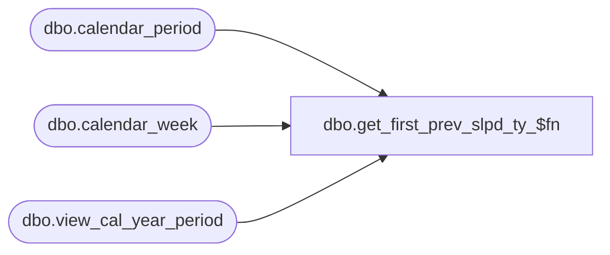

# dbo.get_first_prev_slpd_ty_$fn

**Database:** me_01  
**Server:** bedrockdb02  

## Architecture Diagram



## Table Dependencies

| Referenced Table |
|---|
| dbo.calendar_period |
| dbo.calendar_week |
| dbo.view_cal_year_period |

## Stored Procedure Code

```sql
create proc dbo.get_first_prev_slpd_ty_$fn  @dummy int, @dummy2 int


AS

Declare @curr_period_id  int
Declare @first_period_id  int

SELECT @curr_period_id  = calendar_period_id 
FROM view_cal_year_period
WHERE cal_year_period_code = (SELECT MAX (cal_year_period_code)
	  	  	FROM view_cal_year_period
			WHERE cal_year_period_code < current_year_pd);


SELECT @first_period_id  = MIN(calendar_period_id) 
FROM calendar_week
WHERE calendar_year_id = (SELECT calendar_year_id
	   	 FROM calendar_period
		 WHERE calendar_period_id = @curr_period_id);

return isnull( @first_period_id,0);
```

