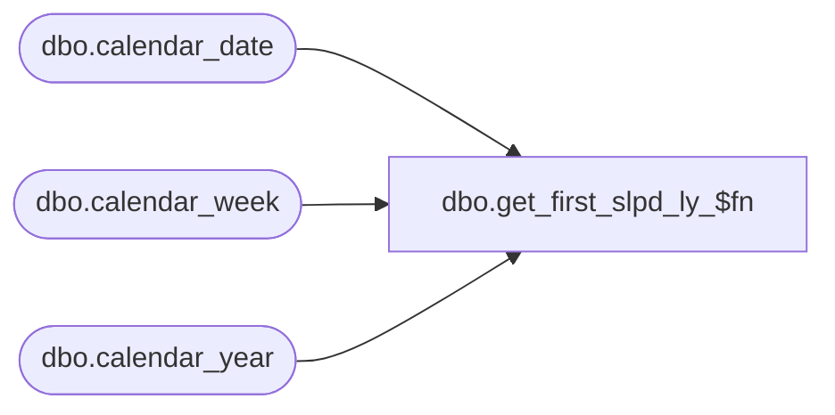

# dbo.get_first_slpd_ly_$fn

**Database:** me_01  
**Server:** bedrockdb02  

## Architecture Diagram



## Table Dependencies

| Referenced Table |
|---|
| dbo.calendar_date |
| dbo.calendar_week |
| dbo.calendar_year |

## Stored Procedure Code

```sql
create proc dbo.get_first_slpd_ly_$fn  @dummy int, @dummy2 int


AS

Declare @first_period_id  int


SELECT @first_period_id  = MIN(calendar_period_id) 
FROM calendar_week
WHERE calendar_year_id = (SELECT cy.calendar_year_id
FROM calendar_year cy, calendar_date cd
WHERE CONVERT(SMALLDATETIME,CONVERT(CHAR(12),GETDATE(),109)) = cd.calendar_date
AND (cd.merch_year - 1) = cy.calendar_year_code);

return isnull( @first_period_id,0);
```

