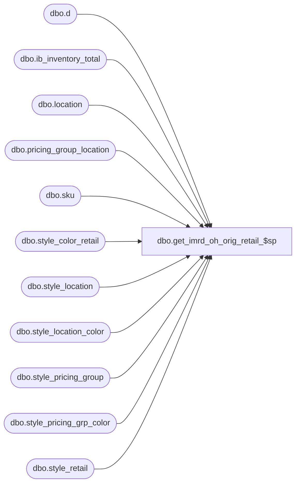

# dbo.get_imrd_oh_orig_retail_$sp

**Database:** me_01  
**Server:** bedrockdb02  

## Architecture Diagram



## Table Dependencies

| Referenced Table |
|---|
| dbo.d |
| dbo.ib_inventory_total |
| dbo.location |
| dbo.pricing_group_location |
| dbo.sku |
| dbo.style_color_retail |
| dbo.style_location |
| dbo.style_location_color |
| dbo.style_pricing_group |
| dbo.style_pricing_grp_color |
| dbo.style_retail |

## Stored Procedure Code

```sql
CREATE PROCEDURE [dbo].[get_imrd_oh_orig_retail_$sp] 
AS
/*
   This stored procedure is called by the "Head Office Requested Transfer" report, it retrieves the on hand units and original retail
   of the sku / locations stored in the #temp_imrd_xfer_detail table
*/
BEGIN
/*
CREATE TABLE #temp_imrd_xfer(
   inventory_move_request_id decimal (12, 0) not null,
   document_no               nvarchar(20) not null,
   submit_date               smalldatetime not null,
   from_loc_id               smallint not null,
   from_loc_code             nvarchar(20) not null,
   from_loc_name             nvarchar(60) not null,
   from_jurisdiction_id      smallint not null,
   to_loc_id                 smallint not null,
   to_loc_code               nvarchar(20) not null,
   to_loc_name               nvarchar(60) not null
   UNIQUE (inventory_move_request_id, from_loc_id)
   )

CREATE TABLE #temp_imrd_xfer_detail(
   inventory_move_request_id  decimal(12, 0) not null,
   inv_move_request_detail_id decimal(13, 0) not null,
   from_loc_id                smallint not null,
   style_id                   decimal(12, 0) not null,
   style_code                 nvarchar(20) not null,
   style_desc                 nvarchar(20) null,
   comparison_operator        int null,
   style_color_id             decimal(13, 0) null,
   color_code                 nvarchar(3) null,
   color_desc                 nvarchar(8) null,
   sku_id                     decimal(13, 0) null,
   size_code                  nvarchar(17) null,
   total_on_hand_units        int null,
   units_requested            int null,
   original_selling_retail    decimal(14, 2) null
   UNIQUE (inventory_move_request_id, inv_move_request_detail_id, from_loc_id, style_id, style_color_id, sku_id)
   )
*/
   /* 1. retrieve the on hand units*/
   
   -- 1.1 on hand units for the IMRD detail lines that have sku_id provided
   SELECT DISTINCT d.sku_id, d.from_loc_id
   INTO #temp_sku_loc
   FROM #temp_imrd_xfer_detail d
   WHERE d.sku_id IS NOT NULL

   IF @@ROWCOUNT > 0
   BEGIN
      UPDATE d
      SET total_on_hand_units = t.total_on_hand_units
      FROM #temp_imrd_xfer_detail d
      INNER JOIN
            (SELECT i.sku_id, i.location_id, SUM(i.total_on_hand_units) total_on_hand_units
             FROM #temp_sku_loc sl
             INNER JOIN ib_inventory_total i WITH (NOLOCK)
                ON  i.sku_id = sl.sku_id 
                AND i.location_id = sl.from_loc_id
             GROUP BY i.sku_id, i.location_id) t
         ON  t.sku_id = d.sku_id
         AND t.location_id = d.from_loc_id
   END
   
   DROP TABLE #temp_sku_loc
   
   -- 1.2 on hand units for the IMRD detail lines that don't have sku_id but have style_color_id provided
   SELECT DISTINCT d.style_color_id, d.from_loc_id
   INTO #temp_style_color_loc
   FROM #temp_imrd_xfer_detail d
   WHERE  d.sku_id IS NULL
      AND d.style_color_id IS NOT NULL
   
   IF @@ROWCOUNT > 0
   BEGIN
      UPDATE d
      SET total_on_hand_units = t.total_on_hand_units
      FROM #temp_imrd_xfer_detail d
      INNER JOIN sku WITH (NOLOCK)
         ON  d.style_color_id = sku.style_color_id
         AND d.style_id = sku.style_id
         AND d.sku_id IS NULL
      INNER JOIN
            (SELECT scl.style_color_id, i.location_id, SUM(i.total_on_hand_units) total_on_hand_units
             FROM #temp_style_color_loc scl
             INNER JOIN sku WITH (NOLOCK)
               ON  scl.style_color_id = sku.style_color_id
             INNER JOIN ib_inventory_total i WITH (NOLOCK)
               ON  i.sku_id = sku.sku_id 
               AND i.location_id = scl.from_loc_id
             GROUP BY scl.style_color_id, i.location_id) t
         ON  t.style_color_id = d.style_color_id
         AND t.style_color_id = sku.style_color_id
         AND t.location_id = d.from_loc_id
   END
   
   DROP TABLE #temp_style_color_loc
   
   -- 1.3 on hand units for the IMRD detail lines that don't have sku_id and style_color_id (style_id is always provided)
   SELECT DISTINCT d.style_id, d.from_loc_id
   INTO #temp_style_loc
   FROM #temp_imrd_xfer_detail d
   WHERE  d.sku_id IS NULL
      AND d.style_color_id IS NULL
   
   IF @@ROWCOUNT > 0
   BEGIN
       UPDATE d
       SET total_on_hand_units = t.total_on_hand_units
       FROM #temp_imrd_xfer_detail d
       INNER JOIN sku WITH (NOLOCK)
          ON  d.style_id = sku.style_id
          AND d.style_color_id IS NULL
          AND d.sku_id IS NULL
       INNER JOIN
             (SELECT sl.style_id, i.location_id, SUM(i.total_on_hand_units) total_on_hand_units
              FROM #temp_style_loc sl
              INNER JOIN sku WITH (NOLOCK)
                 ON  sl.style_id = sku.style_id
              INNER JOIN ib_inventory_total i WITH (NOLOCK)
                 ON  i.sku_id = sku.sku_id 
                 AND i.location_id = sl.from_loc_id
              GROUP BY sl.style_id, i.location_id) t
          ON  t.style_id = d.style_id
          AND t.location_id = d.from_loc_id
    END
    
    DROP TABLE #temp_style_loc
    
   /* 
      2. retrieve the original retail. The precedence of exception levels is:
      - style loc color
      - style loc
      - style pricing group color
      - style pricing group
      - style color
      - style
      The stored proc will retrieve the price/exceptions in the opposite order, 
      so the levels with higher priority will override the ones with lower priority.
   */
   
   -- 2.1 retrieve the original retail on style level
   UPDATE d
   SET original_selling_retail = sr.original_selling_retail
   FROM #temp_imrd_xfer_detail d
   INNER JOIN location l WITH (NOLOCK)
      ON d.from_loc_id = l.location_id
   INNER JOIN style_retail sr WITH (NOLOCK)
      ON  sr.style_id = d.style_id
      AND sr.jurisdiction_id = l.jurisdiction_id
   
   -- 2.2 retrieve the original retail exception on style color level
   UPDATE d
   SET original_selling_retail = scr.original_selling_retail
   FROM #temp_imrd_xfer_detail d
   INNER JOIN location l WITH (NOLOCK)
      ON d.from_loc_id = l.location_id
   INNER JOIN style_color_retail scr WITH (NOLOCK)
      ON  scr.style_color_id = d.style_color_id
      AND scr.jurisdiction_id = l.jurisdiction_id
      AND scr.original_selling_retail IS NOT NULL
   
   -- 2.3 retrieve the original retail exception on style pricing group level
   UPDATE d
   SET original_selling_retail = spg.original_selling_retail
   FROM #temp_imrd_xfer_detail d
   INNER JOIN pricing_group_location pgl WITH (NOLOCK)
      ON  pgl.location_id = d.from_loc_id
   INNER JOIN style_pricing_group spg WITH (NOLOCK)
      ON  spg.style_id = d.style_id
      AND spg.pricing_group_id = pgl.pricing_group_id
      AND spg.original_selling_retail IS NOT NULL
   
   -- 2.4 retrieve the original retail exception on style pricing group color level
   UPDATE d
   SET original_selling_retail = spgc.original_selling_retail
   FROM #temp_imrd_xfer_detail d
   INNER JOIN pricing_group_location pgl WITH (NOLOCK)
      ON  pgl.location_id = d.from_loc_id
   INNER JOIN style_pricing_grp_color spgc WITH (NOLOCK)
      ON  spgc.style_id = d.style_id
      AND spgc.style_color_id = d.style_color_id
      AND spgc.pricing_group_id = pgl.pricing_group_id
      AND spgc.original_selling_retail IS NOT NULL
   
   -- 2.5 retrieve the original retail exception on style location level
   UPDATE d
   SET original_selling_retail = sl.original_selling_retail
   FROM #temp_imrd_xfer_detail d
   INNER JOIN style_location sl WITH (NOLOCK)
      ON  sl.style_id = d.style_id
      AND sl.location_id = d.from_loc_id
      AND sl.original_selling_retail IS NOT NULL
   
   -- 2.6 retrieve the original retail exception on style location color level
   UPDATE d
   SET original_selling_retail = slc.original_selling_retail
   FROM #temp_imrd_xfer_detail d
   INNER JOIN style_location_color slc WITH (NOLOCK)
      ON  slc.style_id = d.style_id
      AND slc.style_color_id = d.style_color_id
      AND slc.location_id = d.from_loc_id
      AND slc.original_selling_retail IS NOT NULL
   
  
END
```

