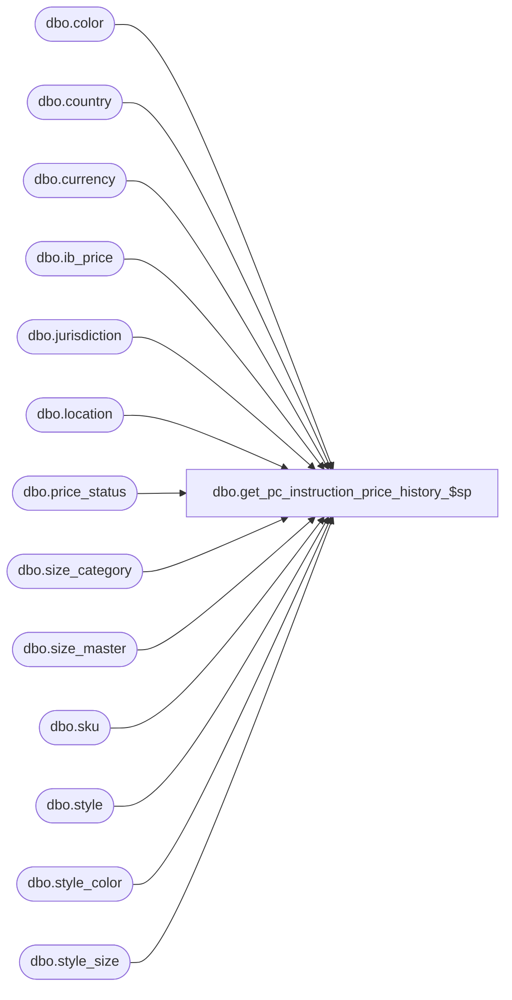

# dbo.get_pc_instruction_price_history_$sp

**Database:** me_01  
**Server:** bedrockdb02  

## Architecture Diagram



## Table Dependencies

| Referenced Table |
|---|
| dbo.color |
| dbo.country |
| dbo.currency |
| dbo.ib_price |
| dbo.jurisdiction |
| dbo.location |
| dbo.price_status |
| dbo.size_category |
| dbo.size_master |
| dbo.sku |
| dbo.style |
| dbo.style_color |
| dbo.style_size |

## Stored Procedure Code

```sql
-----------------------------------------------------------------------------------------------------------------------------
--	Main Query: Create Procedure
--
--  This stored procedure is called when we want to retrieve the price history
-----------------------------------------------------------------------------------------------------------------------------

CREATE PROCEDURE [dbo].[get_pc_instruction_price_history_$sp]
	 
	@Price_Change_ID AS DECIMAL (12, 0)
	,@Style_ID AS DECIMAL (12, 0)
	,@Style_Color_ID AS DECIMAL (12, 0)
	,@SKU_ID AS DECIMAL (13, 0)

AS

BEGIN

SET TRANSACTION ISOLATION LEVEL READ UNCOMMITTED
SET NOCOUNT ON

-----------------------------------------------------------------------------------------------------------------------------
--	Create temp table holding the price history for the specified style, style/color or sku.
-----------------------------------------------------------------------------------------------------------------------------

IF OBJECT_ID (N'tempdb.dbo.#temp_instr_price_history',  N'U') IS NOT NULL
BEGIN
	DROP TABLE dbo.#temp_instr_price_history
END

CREATE TABLE dbo.#temp_instr_price_history
(
	ib_price_id DECIMAL(12, 0)
	,price_change_id DECIMAL(12, 0)
	,jurisdiction_id SMALLINT
	,location_id SMALLINT
	,style_id DECIMAL(12, 0)
	,style_color_id DECIMAL(12, 0)
	,sku_id DECIMAL(13, 0)
	,temp_price_flag BIT
	,[start_date] SMALLDATETIME
	,end_date SMALLDATETIME
	,document_number NVARCHAR(40)
	,selling_retail_price DECIMAL(14, 2)
	,currency_code NVARCHAR(3)
	,valuation_retail_price DECIMAL(14, 2)
	,price_status_id SMALLINT
)

INSERT INTO dbo.#temp_instr_price_history
(
	ib_price_id
	,price_change_id
	,jurisdiction_id
	,location_id
	,style_id
	,style_color_id
	,sku_id
	,temp_price_flag
	,[start_date]
	,end_date
	,document_number
	,selling_retail_price
	,valuation_retail_price
	,price_status_id
)

SELECT
	IBP.ib_price_id
	,@Price_Change_ID as price_change_id
	,IBP.jurisdiction_id
	,IBP.location_id
	,IBP.style_id
	,IBP.style_color_id
	,IBP.sku_id
	,IBP.temp_price_flag
	,IBP.[start_date]
	,IBP.end_date
	,IBP.document_number
	,IBP.selling_retail_price
	,IBP.valuation_retail_price
	,IBP.price_status_id
FROM
	dbo.ib_price IBP
WHERE
	IBP.cancel_promo_flag = 0
	AND IBP.style_id = @Style_ID
	AND
		( -- check for color, if specified
			(@Style_Color_ID <> 0 AND IBP.style_color_id = @Style_Color_ID)
			OR
			(@Style_Color_ID = 0 AND (IBP.style_color_id IS NULL OR IBP.style_color_id >= 0))
		)
	AND
		( -- check for sku, if specified
			(@SKU_ID <> 0 AND IBP.sku_id = @SKU_ID)
			OR 
			(@SKU_ID = 0 AND (IBP.sku_id IS NULL OR IBP.sku_id >= 0))
		)
ORDER BY
	IBP.[start_date]
	,IBP.end_date
	,IBP.ib_price_id


-----------------------------------------------------------------------------------------------------------------------------
--	SELECT the data inclucing FK references
-----------------------------------------------------------------------------------------------------------------------------

-- PC Instruction Price history
SELECT
	TIPH.ib_price_id
	,TIPH.price_change_id
	,TIPH.jurisdiction_id
	,TIPH.location_id
	,TIPH.style_id
	,TIPH.style_color_id
	,TIPH.sku_id
	,TIPH.temp_price_flag
	,TIPH.[start_date]
	,TIPH.end_date
	,TIPH.document_number
	,TIPH.selling_retail_price
	,CURR.currency_code
	,TIPH.valuation_retail_price
	,TIPH.price_status_id
FROM
	dbo.#temp_instr_price_history TIPH
	INNER JOIN jurisdiction J ON TIPH.jurisdiction_id = J.jurisdiction_id
	INNER JOIN country C ON j.country_id = c.country_id 
	INNER JOIN currency CURR ON c.currency_id = curr.currency_id
ORDER BY TIPH.[start_date] DESC

-- jurisdiction
SELECT
	DISTINCT
		J.jurisdiction_id
		,J.jurisdiction_code
		,J.jurisdiction_description
FROM
	dbo.#temp_instr_price_history TIPH
	INNER JOIN jurisdiction J ON TIPH.jurisdiction_id = J.jurisdiction_id

-- location
SELECT
	DISTINCT
		L.location_id
		,L.location_code
		,L.location_name
		,L.location_short_name
		,L.jurisdiction_id
FROM
	dbo.#temp_instr_price_history TIPH
	INNER JOIN location L ON TIPH.location_id = L.location_id

-- style
SELECT
	DISTINCT	
		S.style_id
		,S.style_code
		,S.short_desc
		,S.long_desc
		,S.size_category_id
		,S.style_type
		,S.size_flag
		,S.color_flag
FROM
	dbo.#temp_instr_price_history TIPH
	INNER JOIN style S ON TIPH.style_id = S.style_id

-- style_color
SELECT
	DISTINCT 
		SC.style_color_id
		,SC.style_id
		,SC.color_id
		,SC.short_desc
		,SC.long_desc
FROM
	dbo.#temp_instr_price_history TIPH
	INNER JOIN style_color SC ON TIPH.style_color_id = SC.style_color_id

-- color
SELECT
	DISTINCT 
		C.color_id
		,C.color_code
		,C.color_short_description
		,C.color_long_description
FROM	
	dbo.#temp_instr_price_history TIPH
	INNER JOIN style_color SC ON TIPH.style_color_id = SC.style_color_id
	INNER JOIN color C ON SC.color_id = C.color_id

-- sku
SELECT
	DISTINCT 
		K.sku_id
		,K.style_id
		,K.style_color_id
		,K.style_size_id
FROM	
	dbo.#temp_instr_price_history TIPH
	INNER JOIN sku K ON TIPH.sku_id = K.sku_id

-- style_size
SELECT
	DISTINCT 
		K.style_size_id
		,K.style_id
		,SS.size_master_id
FROM
	dbo.#temp_instr_price_history TIPH
	INNER JOIN sku K ON TIPH.sku_id = K.sku_id
	INNER JOIN style_size SS ON K.style_size_id = SS.style_size_id

-- size_master
SELECT
	DISTINCT 
		SM.size_master_id
		,SM.size_code
		,SM.prim_size_label
		,SM.sec_size_label
		,SM.prim_seq_no
		,SM.sec_seq_no
FROM
	dbo.#temp_instr_price_history TIPH
	INNER JOIN sku K ON TIPH.sku_id = K.sku_id
	INNER JOIN style_size SS ON K.style_size_id = SS.style_size_id
	INNER JOIN size_master SM ON SS.size_master_id = SM.size_master_id

-- size_category
SELECT
	DISTINCT 
		CAT.size_category_id
		,CAT.size_category_code
		,CAT.size_category_label
FROM
	dbo.#temp_instr_price_history TIPH
	INNER JOIN style S ON TIPH.style_id = S.style_id
	INNER JOIN size_category CAT ON S.size_category_id = CAT.size_category_id	

-- price_status
SELECT
	DISTINCT
		PS.price_status_id
		,PS.price_status_code
		,PS.price_status_desc
FROM
	dbo.#temp_instr_price_history TIPH
	INNER JOIN price_status PS ON TIPH.price_status_id = PS.price_status_id
END
```

