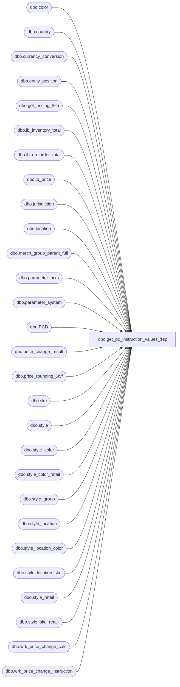

# dbo.get_pc_instruction_values_$sp

**Database:** me_01  
**Server:** bedrockdb02  

## Architecture Diagram



## Table Dependencies

| Referenced Table |
|---|
| dbo.color |
| dbo.country |
| dbo.currency_conversion |
| dbo.entity_position |
| dbo.get_pricing_$sp |
| dbo.ib_inventory_total |
| dbo.ib_on_order_total |
| dbo.ib_price |
| dbo.jurisdiction |
| dbo.location |
| dbo.merch_group_parent_full |
| dbo.parameter_pcm |
| dbo.parameter_system |
| dbo.PCD |
| dbo.price_change_result |
| dbo.price_rounding_$tvf |
| dbo.sku |
| dbo.style |
| dbo.style_color |
| dbo.style_color_retail |
| dbo.style_group |
| dbo.style_location |
| dbo.style_location_color |
| dbo.style_location_sku |
| dbo.style_retail |
| dbo.style_sku_retail |
| dbo.wrk_price_change_calc |
| dbo.wrk_price_change_instruction |

## Stored Procedure Code

```sql
-----------------------------------------------------------------------------------------------------------------------------
--	Main Query: Create Procedure
-----------------------------------------------------------------------------------------------------------------------------

CREATE PROCEDURE [dbo].[get_pc_instruction_values_$sp]

	@Date AS SMALLDATETIME
	,@Override_Price AS BIT
	,@Price_Change_ID AS DECIMAL (12, 0)
	,@Price_Change_Type AS SMALLINT
	,@Price_Status_ID AS SMALLINT
	,@Pricing_Rule_ID AS DECIMAL (12, 0)
	,@Price_Status_Override AS BIT
	,@Position_ID AS DECIMAL (12, 0) = NULL
	,@Jurisdiction_ID AS SMALLINT = NULL

AS

--	Object GUID: 3A1842D4-75A0-47DF-B9C0-10E3F78D04D9
--	Pricing GUID (General): EFB5A343-8978-4ACF-952C-37862704CBC8

SET TRANSACTION ISOLATION LEVEL READ UNCOMMITTED
SET NOCOUNT ON

-----------------------------------------------------------------------------------------------------------------------------
--	Declarations / Sets: Declare And Set Variables
-----------------------------------------------------------------------------------------------------------------------------

DECLARE
	 @Home_Currency_ID AS DECIMAL (12, 0)
	,@Multiplier AS INT
	,@Multi_Sales_Jurisdiction_Flag AS BIT
	,@Restrict_By_Position_Flag AS BIT
	,@Restrict_Position_ID AS DECIMAL (12, 0) = NULL
	,@Allow_Multi_Jurisdiction_Flag AS BIT


SET @Home_Currency_ID =

	(
		SELECT
			C.currency_id
		FROM
			dbo.jurisdiction J
			INNER JOIN dbo.country C ON C.country_id = J.country_id
				AND C.active_flag = 1
		WHERE
			J.availability_status = 3 -- Available
			AND J.home_jurisdiction_flag = 1
	)


SET @Multiplier = (CASE
						WHEN @Price_Change_Type IN (0, 3) THEN -1 -- 0 - MD, 3 - MUC
						WHEN @Price_Change_Type IN (1, 2) THEN 1 -- 1 - MDC, 2 - MU
						END)


SELECT
	 @Multi_Sales_Jurisdiction_Flag = PS.multi_sales_jurisdiction_flag
	,@Restrict_By_Position_Flag = PS.restrict_by_employee_pos_flag
FROM
	dbo.parameter_system PS


IF @Restrict_By_Position_Flag = 1
BEGIN

	SET @Restrict_Position_ID = @Position_ID

END


SET @Allow_Multi_Jurisdiction_Flag =

	(
		SELECT
			PP.allow_multi_jurisdiction_flag
		FROM
			dbo.parameter_pcm AS PP
	)


-- Jurisdiction on the PC header is only required if the system is configured as multi-jurisdiction
-- and PC document cannot be created for more than one jurisdiction.
IF NOT (@Multi_Sales_Jurisdiction_Flag = 1 AND @Allow_Multi_Jurisdiction_Flag = 0)
BEGIN
	SET @Jurisdiction_ID = NULL
END


-----------------------------------------------------------------------------------------------------------------------------
--	Error Trapping: Check If Temp Table(s) Already Exist(s) And Drop If Applicable
-----------------------------------------------------------------------------------------------------------------------------

IF OBJECT_ID (N'tempdb.dbo.#temp_current_prices', N'U') IS NOT NULL
BEGIN

	DROP TABLE dbo.#temp_current_prices

END


IF OBJECT_ID (N'tempdb.dbo.#temp_sku_location_instruction_values', N'U') IS NOT NULL
BEGIN

	DROP TABLE dbo.#temp_sku_location_instruction_values

END

IF OBJECT_ID (N'tempdb.dbo.#temp_sku_jurisdiction_instruction_values', N'U') IS NOT NULL
BEGIN

	DROP TABLE dbo.#temp_sku_jurisdiction_instruction_values

END


IF OBJECT_ID (N'tempdb.dbo.#temp_style_color_location_instruction_values', N'U') IS NOT NULL
BEGIN

	DROP TABLE dbo.#temp_style_color_location_instruction_values

END

IF OBJECT_ID (N'tempdb.dbo.#temp_style_color_jurisdiction_instruction_values', N'U') IS NOT NULL
BEGIN

	DROP TABLE dbo.#temp_style_color_jurisdiction_instruction_values

END

IF OBJECT_ID (N'tempdb.dbo.#temp_style_location_instruction_values', N'U') IS NOT NULL
BEGIN

	DROP TABLE dbo.#temp_style_location_instruction_values

END

IF OBJECT_ID (N'tempdb.dbo.#temp_style_jurisdiction_instruction_values', N'U') IS NOT NULL
BEGIN

	DROP TABLE dbo.#temp_style_jurisdiction_instruction_values

END

IF OBJECT_ID (N'tempdb.dbo.#temp_wrk_price_lookup', N'U') IS NOT NULL
BEGIN

	DROP TABLE dbo.#temp_wrk_price_lookup

END


IF OBJECT_ID (N'tempdb.dbo.#temp_wrk_allowed_groups', N'U') IS NOT NULL
BEGIN

	DROP TABLE dbo.#temp_wrk_allowed_groups

END


IF OBJECT_ID (N'tempdb.dbo.#temp_location_on_hand', N'U') IS NOT NULL
BEGIN

	DROP TABLE dbo.#temp_location_on_hand

END


IF OBJECT_ID (N'tempdb.dbo.#temp_jurisdiction_on_hand', N'U') IS NOT NULL
BEGIN

	DROP TABLE dbo.#temp_jurisdiction_on_hand

END


IF OBJECT_ID (N'tempdb.dbo.#temp_location_on_order', N'U') IS NOT NULL
BEGIN

	DROP TABLE dbo.#temp_location_on_order

END


IF OBJECT_ID (N'tempdb.dbo.#temp_jurisdiction_on_order', N'U') IS NOT NULL
BEGIN

	DROP TABLE dbo.#temp_jurisdiction_on_order

END


-----------------------------------------------------------------------------------------------------------------------------
--	Table Creation: Create Shell Table (Current Prices)
-----------------------------------------------------------------------------------------------------------------------------

CREATE TABLE dbo.#temp_current_prices

	(
		 location_id SMALLINT NULL
		,sku_id DECIMAL (13, 0) NULL
		,selling_retail_price_parent DECIMAL (14, 2) NULL
		,price_status_id_parent SMALLINT NULL
		,valuation_retail_price_child DECIMAL (14, 2) NULL
		,selling_retail_price_child DECIMAL (14, 2) NULL
		,price_status_id_child SMALLINT NULL
		,exception_level TINYINT NULL
	)


-----------------------------------------------------------------------------------------------------------------------------
--	Table Creation: Create Table Shell (Instruction Values)
-----------------------------------------------------------------------------------------------------------------------------

CREATE TABLE dbo.#temp_sku_location_instruction_values

	(
		 sku_id DECIMAL (13, 0) NULL
		,location_id SMALLINT NULL
		,calculation_method SMALLINT NULL
		,calculation_value DECIMAL (14, 2) NULL
		,base_calculation_on SMALLINT NULL
		,price_change_instruction_id DECIMAL (12, 0) NULL
		,price_status_id SMALLINT NULL
	)

EXECUTE (N'CREATE NONCLUSTERED INDEX #temp_sku_location_instruction_values_IX1 ON dbo.#temp_sku_location_instruction_values (sku_id, location_id)')

CREATE TABLE dbo.#temp_sku_jurisdiction_instruction_values

	(
		 sku_id DECIMAL (13, 0) NULL
		,jurisdiction_id SMALLINT NULL
		,calculation_method SMALLINT NULL
		,calculation_value DECIMAL (14, 2) NULL
		,base_calculation_on SMALLINT NULL
		,price_change_instruction_id DECIMAL (12, 0) NULL
		,price_status_id SMALLINT NULL
	)

EXECUTE (N'CREATE NONCLUSTERED INDEX #temp_sku_jurisdiction_instruction_values_IX1 ON dbo.#temp_sku_jurisdiction_instruction_values (sku_id, jurisdiction_id)')

CREATE TABLE dbo.#temp_style_color_location_instruction_values

	(
		 style_color_id DECIMAL (13, 0) NULL
		,location_id SMALLINT NULL
		,calculation_method SMALLINT NULL
		,calculation_value DECIMAL (14, 2) NULL
		,base_calculation_on SMALLINT NULL
		,price_change_instruction_id DECIMAL (12, 0) NULL
		,price_status_id SMALLINT NULL
	)

EXECUTE (N'CREATE NONCLUSTERED INDEX #temp_style_color_location_instruction_values_IX1 ON dbo.#temp_style_color_location_instruction_values (style_color_id, location_id)')

CREATE TABLE dbo.#temp_style_color_jurisdiction_instruction_values

	(
		 style_color_id DECIMAL (13, 0) NULL
		,jurisdiction_id SMALLINT NULL
		,calculation_method SMALLINT NULL
		,calculation_value DECIMAL (14, 2) NULL
		,base_calculation_on SMALLINT NULL
		,price_change_instruction_id DECIMAL (12, 0) NULL
		,price_status_id SMALLINT NULL
	)

EXECUTE (N'CREATE NONCLUSTERED INDEX #temp_style_color_jurisdiction_instruction_values_IX1 ON dbo.#temp_style_color_jurisdiction_instruction_values (style_color_id, jurisdiction_id)')

CREATE TABLE dbo.#temp_style_location_instruction_values

	(
		 style_id DECIMAL (13, 0) NULL
		,location_id SMALLINT NULL
		,calculation_method SMALLINT NULL
		,calculation_value DECIMAL (14, 2) NULL
		,base_calculation_on SMALLINT NULL
		,price_change_instruction_id DECIMAL (12, 0) NULL
		,price_status_id SMALLINT NULL
	)

EXECUTE (N'CREATE NONCLUSTERED INDEX #temp_style_location_instruction_values_IX1 ON dbo.#temp_style_location_instruction_values (style_id, location_id)')

CREATE TABLE dbo.#temp_style_jurisdiction_instruction_values

	(
		 style_id DECIMAL (13, 0) NULL
		,jurisdiction_id SMALLINT NULL
		,calculation_method SMALLINT NULL
		,calculation_value DECIMAL (14, 2) NULL
		,base_calculation_on SMALLINT NULL
		,price_change_instruction_id DECIMAL (12, 0) NULL
		,price_status_id SMALLINT NULL
	)

-----------------------------------------------------------------------------------------------------------------------------
--	Table Creation: Create Table Shell (Base Values)
-----------------------------------------------------------------------------------------------------------------------------

CREATE TABLE dbo.#temp_wrk_price_lookup

	(
		 jurisdiction_id SMALLINT NULL
		,location_id SMALLINT NULL
		,style_id DECIMAL (12, 0) NULL
		,color_id SMALLINT NULL
		,style_color_id DECIMAL (13, 0) NULL -- Place Holder For Now
		,sku_id DECIMAL (13, 0) NULL
		,calculation_method SMALLINT NULL
		,calculation_value DECIMAL (14, 2) NULL
		,base_calculation_on SMALLINT NULL
		,price_change_instruction_id DECIMAL (12, 0) NULL
		,new_exception_level TINYINT NULL
		,price_status_id SMALLINT NULL
	)

-----------------------------------------------------------------------------------------------------------------------------
--	Table Creation: Create Table Shell (hierarchy groups restricted by position)
-----------------------------------------------------------------------------------------------------------------------------

CREATE TABLE dbo.#temp_wrk_allowed_groups
	(
		hierarchy_group_id DECIMAL (12, 0) NOT NULL
	)

-- if restrict by a position, only allow styles assigned to merch groups this position has access to
IF @Restrict_Position_ID IS NOT NULL
BEGIN

		-- all groups that the position has access to, as well as all groups that these positions are parents of
		INSERT INTO dbo.#temp_wrk_allowed_groups
			(
				hierarchy_group_id
			)
		SELECT DISTINCT
			MGPF.hierarchy_group_id
		FROM
			dbo.merch_group_parent_full MGPF
			INNER JOIN dbo.entity_position EP on EP.parent_id = MGPF.parent_hierarchy_group_id
		WHERE
			EP.parent_type = 5 --merch group
			AND EP.position_id = @Restrict_Position_ID

END

-----------------------------------------------------------------------------------------------------------------------------
--	Table Creation: Create Table Shell ("template" locations)
-----------------------------------------------------------------------------------------------------------------------------
CREATE TABLE dbo.#template_location
	(
		location_id SMALLINT
		,jurisdiction_id SMALLINT
		,active_flag BIT
		,has_price_exceptions BIT
		,PRIMARY KEY (location_id, jurisdiction_id)
	)

-- Chain instruction, need to pull all jurisdictions that are active.
IF EXISTS (SELECT 1 FROM dbo.wrk_price_change_instruction WPCI WHERE location_instruction_type = 0)
BEGIN

	INSERT INTO dbo.#template_location
		(
			location_id
			,jurisdiction_id
			,active_flag
			,has_price_exceptions
		)
	SELECT
		-1 * J.jurisdiction_id AS location_id
		,J.jurisdiction_id
		,1 AS active_flag
		,0 AS has_price_exceptions
	FROM
		dbo.jurisdiction J
	WHERE
		J.availability_status = 3 -- Available
		--AND J.jurisdiction_id = 1

END

-- Jurisdiction instructions, need to pull all jurisdictions on instructions.
INSERT INTO dbo.#template_location
	(
		location_id
		,jurisdiction_id
		,active_flag
		,has_price_exceptions
	)
SELECT
	DISTINCT
		-1 * J.jurisdiction_id AS location_id
		,J.jurisdiction_id
		,1 AS active_flag
		,0 AS has_price_exceptions
FROM
	dbo.jurisdiction J
	INNER JOIN dbo.wrk_price_change_instruction WPCI ON J.jurisdiction_id = WPCI.jurisdiction_id
WHERE
	NOT EXISTS
		(
			SELECT 1
			FROM
				dbo.#template_location TL
			WHERE
				TL.jurisdiction_id = J.jurisdiction_id
				AND TL.location_id = -1 * J.jurisdiction_id
		)

INSERT INTO dbo.#template_location
	(
		location_id
		,jurisdiction_id
		,active_flag
		,has_price_exceptions
	)
SELECT
	DISTINCT
		L.location_id
		,L.jurisdiction_id
		,L.active_flag
		,1 AS has_price_exceptions
FROM
	dbo.ib_price I
INNER JOIN dbo.location L ON I.location_id = L.location_id
WHERE
	I.location_id IS NOT NULL

-----------------------------------------------------------------------------------------------------------------------------
--	Table Creation: Create Table Shell (on hand and on order)
-----------------------------------------------------------------------------------------------------------------------------
CREATE TABLE dbo.#temp_location_on_hand
	(
		sku_id DECIMAL(13, 0)
		,jurisdiction_id SMALLINT
		,location_id SMALLINT
		,total_on_hand_units INT
	)

CREATE TABLE dbo.#temp_location_on_order
	(
		sku_id DECIMAL(13, 0)
		,jurisdiction_id SMALLINT
		,location_id SMALLINT
		,on_order_units INT
	)

CREATE TABLE dbo.#temp_jurisdiction_on_hand
	(
		sku_id DECIMAL(13, 0)
		,jurisdiction_id SMALLINT
		,total_on_hand_units INT
	)

CREATE TABLE dbo.#temp_jurisdiction_on_order
	(
		sku_id DECIMAL(13, 0)
		,jurisdiction_id SMALLINT
		,on_order_units INT
	)

-----------------------------------------------------------------------------------------------------------------------------
--	Populate Base Table: Style / Color / SKU / Location (1 / Exception Level 10)
-----------------------------------------------------------------------------------------------------------------------------

IF EXISTS (SELECT * FROM dbo.wrk_price_change_instruction WPCI WHERE WPCI.wrk_price_change_id = @Price_Change_ID AND WPCI.merch_instruction_type = 4 AND WPCI.location_instruction_type = 2)
BEGIN

	-- Check For Cancellation
	IF EXISTS (SELECT * FROM dbo.wrk_price_change_calc WPCC WHERE WPCC.wrk_price_change_calc_id = @Price_Change_ID AND WPCC.ready_to_delete = 1)
	BEGIN

		RETURN

	END


	INSERT INTO dbo.#temp_sku_location_instruction_values

		(
			 sku_id
			,location_id
			,calculation_method
			,calculation_value
			,base_calculation_on
			,price_change_instruction_id
			,price_status_id
		)

	SELECT
		 WPCI.sku_id
		,WPCI.location_id
		,WPCI.calculation_method
		,WPCI.calculation_value
		,WPCI.base_calculation_on
		,WPCI.price_change_instruction_id
		,WPCI.price_status_id
	FROM
		dbo.wrk_price_change_instruction WPCI
	WHERE
		WPCI.wrk_price_change_id = @Price_Change_ID
		AND WPCI.merch_instruction_type = 4
		AND WPCI.location_instruction_type = 2


	-- Check For Cancellation
	IF EXISTS (SELECT * FROM dbo.wrk_price_change_calc WPCC WHERE WPCC.wrk_price_change_calc_id = @Price_Change_ID AND WPCC.ready_to_delete = 1)
	BEGIN

		RETURN

	END


	INSERT INTO dbo.#temp_wrk_price_lookup

		(
			 jurisdiction_id
			,location_id
			,style_id
			,color_id
			,sku_id
			,calculation_method
			,calculation_value
			,base_calculation_on
			,price_change_instruction_id
			,new_exception_level
			,price_status_id
		)

	SELECT
		 L.jurisdiction_id
		,L.location_id
		,S.style_id
		,SC.color_id
		,SK.sku_id
		,ttIV.calculation_method
		,ttIV.calculation_value
		,ttIV.base_calculation_on
		,ttIV.price_change_instruction_id
		,10 AS new_exception_level
		,ttIV.price_status_id
	FROM
		dbo.style S
		INNER JOIN dbo.style_color SC ON SC.style_id = S.style_id
		INNER JOIN dbo.sku SK ON SK.style_color_id = SC.style_color_id
		CROSS JOIN dbo.location L
		INNER JOIN dbo.#temp_sku_location_instruction_values ttIV ON ttIV.sku_id = SK.sku_id
			AND ttIV.location_id = L.location_id
	WHERE
		L.active_flag = 1
		AND S.active_flag = 1
		AND S.style_type = 1 -- Regular Styles
		AND S.style_status >= 3 -- Ordered (And Above) Styles Only
		AND NOT EXISTS

			(
				SELECT
					*
				FROM
					dbo.#temp_wrk_price_lookup X
				WHERE
					X.location_id = L.location_id
					AND X.sku_id = SK.sku_id
			)


	TRUNCATE TABLE dbo.#temp_sku_location_instruction_values

END


-----------------------------------------------------------------------------------------------------------------------------
--	Populate Base Table: Style / Color / Location (2 / Exception Level 20)
-----------------------------------------------------------------------------------------------------------------------------

IF EXISTS (SELECT * FROM dbo.wrk_price_change_instruction WPCI WHERE WPCI.wrk_price_change_id = @Price_Change_ID AND WPCI.merch_instruction_type = 3 AND WPCI.location_instruction_type = 2)
BEGIN

	-- Check For Cancellation
	IF EXISTS (SELECT * FROM dbo.wrk_price_change_calc WPCC WHERE WPCC.wrk_price_change_calc_id = @Price_Change_ID AND WPCC.ready_to_delete = 1)
	BEGIN

		RETURN

	END


	INSERT INTO dbo.#temp_style_color_location_instruction_values

		(
			 style_color_id
			,location_id
			,calculation_method
			,calculation_value
			,base_calculation_on
			,price_change_instruction_id
			,price_status_id
		)

	SELECT
		 WPCI.style_color_id
		,WPCI.location_id
		,WPCI.calculation_method
		,WPCI.calculation_value
		,WPCI.base_calculation_on
		,WPCI.price_change_instruction_id
		,WPCI.price_status_id
	FROM
		dbo.wrk_price_change_instruction WPCI
	WHERE
		WPCI.wrk_price_change_id = @Price_Change_ID
		AND WPCI.merch_instruction_type = 3
		AND WPCI.location_instruction_type = 2


	-- Check For Cancellation
	IF EXISTS (SELECT * FROM dbo.wrk_price_change_calc WPCC WHERE WPCC.wrk_price_change_calc_id = @Price_Change_ID AND WPCC.ready_to_delete = 1)
	BEGIN

		RETURN

	END


	INSERT INTO dbo.#temp_wrk_price_lookup

		(
			 jurisdiction_id
			,location_id
			,style_id
			,color_id
			,sku_id
			,calculation_method
			,calculation_value
			,base_calculation_on
			,price_change_instruction_id
			,new_exception_level
			,price_status_id
		)

	SELECT
		 L.jurisdiction_id
		,L.location_id
		,S.style_id
		,SC.color_id
		,SK.sku_id
		,ttIV.calculation_method
		,ttIV.calculation_value
		,ttIV.base_calculation_on
		,ttIV.price_change_instruction_id
		,20 AS new_exception_level
		,ttIV.price_status_id
	FROM
		dbo.style S
		INNER JOIN dbo.style_color SC ON SC.style_id = S.style_id
		INNER JOIN dbo.sku SK ON SK.style_color_id = SC.style_color_id
		CROSS JOIN dbo.location L
		INNER JOIN dbo.#temp_style_color_location_instruction_values ttIV ON ttIV.style_color_id = SC.style_color_id
			AND ttIV.location_id = L.location_id
	WHERE
		S.active_flag = 1
		AND S.style_type = 1 -- Regular Styles
		AND S.style_status >= 3 -- Ordered (And Above) Styles Only
		AND L.active_flag = 1
		AND NOT EXISTS

			(
				SELECT
					*
				FROM
					dbo.#temp_wrk_price_lookup X
				WHERE
					X.location_id = L.location_id
					AND X.sku_id = SK.sku_id
			)


	TRUNCATE TABLE dbo.#temp_style_color_location_instruction_values

END


-----------------------------------------------------------------------------------------------------------------------------
--	Populate Base Table: Style / Location (3 / Exception Level 30)
-----------------------------------------------------------------------------------------------------------------------------

IF EXISTS (SELECT * FROM dbo.wrk_price_change_instruction WPCI WHERE WPCI.wrk_price_change_id = @Price_Change_ID AND WPCI.merch_instruction_type = 2 AND WPCI.location_instruction_type = 2)
BEGIN

	-- Check For Cancellation
	IF EXISTS (SELECT * FROM dbo.wrk_price_change_calc WPCC WHERE WPCC.wrk_price_change_calc_id = @Price_Change_ID AND WPCC.ready_to_delete = 1)
	BEGIN

		RETURN

	END


	INSERT INTO dbo.#temp_style_location_instruction_values

		(
			 style_id
			,location_id
			,calculation_method
			,calculation_value
			,base_calculation_on
			,price_change_instruction_id
			,price_status_id
		)

	SELECT
		 WPCI.style_id
		,WPCI.location_id
		,WPCI.calculation_method
		,WPCI.calculation_value
		,WPCI.base_calculation_on
		,WPCI.price_change_instruction_id
		,WPCI.price_status_id
	FROM
		dbo.wrk_price_change_instruction WPCI
	WHERE
		WPCI.wrk_price_change_id = @Price_Change_ID
		AND WPCI.merch_instruction_type = 2
		AND WPCI.location_instruction_type = 2


	-- Check For Cancellation
	IF EXISTS (SELECT * FROM dbo.wrk_price_change_calc WPCC WHERE WPCC.wrk_price_change_calc_id = @Price_Change_ID AND WPCC.ready_to_delete = 1)
	BEGIN

		RETURN

	END


	INSERT INTO dbo.#temp_wrk_price_lookup

		(
			 jurisdiction_id
			,location_id
			,style_id
			,color_id
			,sku_id
			,calculation_method
			,calculation_value
			,base_calculation_on
			,price_change_instruction_id
			,new_exception_level
			,price_status_id
		)

	SELECT
		 L.jurisdiction_id
		,L.location_id
		,S.style_id
		,SC.color_id
		,SK.sku_id
		,ttIV.calculation_method
		,ttIV.calculation_value
		,ttIV.base_calculation_on
		,ttIV.price_change_instruction_id
		,30 AS new_exception_level
		,ttIV.price_status_id
	FROM
		dbo.style S
		INNER JOIN dbo.style_color SC ON SC.style_id = S.style_id
		INNER JOIN dbo.color C ON C.color_id = SC.color_id
			AND C.active_flag = 1
		INNER JOIN dbo.sku SK ON SK.style_color_id = SC.style_color_id
		CROSS JOIN dbo.location L
		INNER JOIN dbo.#temp_style_location_instruction_values ttIV ON ttIV.style_id = S.style_id
			AND ttIV.location_id = L.location_id
	WHERE
		L.active_flag = 1
		AND S.active_flag = 1
		AND S.style_type = 1 -- Regular Styles
		AND S.style_status >= 3 -- Ordered (And Above) Styles Only
		AND NOT EXISTS

			(
				SELECT
					*
				FROM
					dbo.#temp_wrk_price_lookup X
				WHERE
					X.location_id = L.location_id
					AND X.sku_id = SK.sku_id
			)


	TRUNCATE TABLE dbo.#temp_style_location_instruction_values

END


-----------------------------------------------------------------------------------------------------------------------------
--	Populate Base Table: Merchandise Group / Location (4 / Exception Level 30)
-----------------------------------------------------------------------------------------------------------------------------

IF EXISTS (SELECT * FROM dbo.wrk_price_change_instruction WPCI WHERE WPCI.wrk_price_change_id = @Price_Change_ID AND WPCI.merch_instruction_type = 1 AND WPCI.location_instruction_type = 2)
BEGIN

	-- Check For Cancellation
	IF EXISTS (SELECT * FROM dbo.wrk_price_change_calc WPCC WHERE WPCC.wrk_price_change_calc_id = @Price_Change_ID AND WPCC.ready_to_delete = 1)
	BEGIN

		RETURN

	END


	INSERT INTO dbo.#temp_style_location_instruction_values

		(
			 style_id
			,location_id
			,calculation_method
			,calculation_value
			,base_calculation_on
			,price_change_instruction_id
			,price_status_id
		)

	SELECT
		 sqSG.style_id
		,WPCI.location_id
		,WPCI.calculation_method
		,WPCI.calculation_value
		,WPCI.base_calculation_on
		,WPCI.price_change_instruction_id
		,WPCI.price_status_id
	FROM
		dbo.wrk_price_change_instruction WPCI
		INNER JOIN
		(
			--find all styles that are implied by the merch group instructions
			SELECT
				SG.style_id
				,MAX(MGPF.parent_hierarchy_group_id) AS max_parent
			FROM wrk_price_change_instruction PCI
				INNER JOIN merch_group_parent_full MGPF ON MGPF.parent_hierarchy_group_id=PCI.merch_hierarchy_group_id
				INNER JOIN style_group SG ON SG.hierarchy_group_id=MGPF.hierarchy_group_id AND SG.main_group_flag = 1
			WHERE
				PCI.wrk_price_change_id = @Price_Change_ID
				AND PCI.merch_instruction_type = 1
				AND PCI.location_instruction_type = 2
			GROUP BY
				SG.style_id
		) sqSG ON sqSG.max_parent=WPCI.merch_hierarchy_group_id

		INNER JOIN dbo.style S ON S.style_id = sqSG.style_id
			AND S.active_flag = 1
			AND S.style_type = 1 -- Regular Styles
			AND S.style_status >= 3 -- Ordered (And Above) Styles Only
	WHERE
		WPCI.wrk_price_change_id = @Price_Change_ID
		AND WPCI.merch_instruction_type = 1
		AND WPCI.location_instruction_type = 2


	-- Check For Cancellation
	IF EXISTS (SELECT * FROM dbo.wrk_price_change_calc WPCC WHERE WPCC.wrk_price_change_calc_id = @Price_Change_ID AND WPCC.ready_to_delete = 1)
	BEGIN

		RETURN

	END


	INSERT INTO dbo.#temp_wrk_price_lookup

		(
			 jurisdiction_id
			,location_id
			,style_id
			,color_id
			,sku_id
			,calculation_method
			,calculation_value
			,base_calculation_on
			,price_change_instruction_id
			,new_exception_level
			,price_status_id
		)

	SELECT
		 L.jurisdiction_id
		,L.location_id
		,S.style_id
		,SC.color_id
		,SK.sku_id
		,ttIV.calculation_method
		,ttIV.calculation_value
		,ttIV.base_calculation_on
		,ttIV.price_change_instruction_id
		,30 AS new_exception_level
		,ttIV.price_status_id
	FROM
		dbo.style S
		INNER JOIN dbo.style_color SC ON SC.style_id = S.style_id
		INNER JOIN dbo.color C ON C.color_id = SC.color_id
			AND C.active_flag = 1
		INNER JOIN dbo.sku SK ON SK.style_color_id = SC.style_color_id
		CROSS JOIN dbo.location L
		INNER JOIN dbo.#temp_style_location_instruction_values ttIV ON ttIV.style_id = S.style_id
			AND ttIV.location_id = L.location_id
	WHERE
		L.active_flag = 1
		AND S.active_flag = 1
		AND S.style_type = 1 -- Regular Styles
		AND S.style_status >= 3 -- Ordered (And Above) Styles Only
		AND NOT EXISTS

			(
				SELECT
					*
				FROM
					dbo.#temp_wrk_price_lookup X
				WHERE
					X.location_id = L.location_id
					AND X.sku_id = SK.sku_id
			)


	TRUNCATE TABLE dbo.#temp_style_location_instruction_values

END


-----------------------------------------------------------------------------------------------------------------------------
--	Populate Base Table: All (Styles) / Location (5 / Exception Level 30)
-----------------------------------------------------------------------------------------------------------------------------

IF EXISTS (SELECT * FROM dbo.wrk_price_change_instruction WPCI WHERE WPCI.wrk_price_change_id = @Price_Change_ID AND WPCI.merch_instruction_type = 0 AND WPCI.location_instruction_type = 2)
BEGIN

	-- Check For Cancellation
	IF EXISTS (SELECT * FROM dbo.wrk_price_change_calc WPCC WHERE WPCC.wrk_price_change_calc_id = @Price_Change_ID AND WPCC.ready_to_delete = 1)
	BEGIN

		RETURN

	END


	INSERT INTO dbo.#temp_style_location_instruction_values

		(
			 location_id
			,calculation_method
			,calculation_value
			,base_calculation_on
			,price_change_instruction_id
			,price_status_id
		)

	SELECT
		 WPCI.location_id
		,WPCI.calculation_method
		,WPCI.calculation_value
		,WPCI.base_calculation_on
		,WPCI.price_change_instruction_id
		,WPCI.price_status_id
	FROM
		dbo.wrk_price_change_instruction WPCI
	WHERE
		WPCI.wrk_price_change_id = @Price_Change_ID
		AND WPCI.merch_instruction_type = 0
		AND WPCI.location_instruction_type = 2


	-- Check For Cancellation
	IF EXISTS (SELECT * FROM dbo.wrk_price_change_calc WPCC WHERE WPCC.wrk_price_change_calc_id = @Price_Change_ID AND WPCC.ready_to_delete = 1)
	BEGIN

		RETURN

	END


	INSERT INTO dbo.#temp_wrk_price_lookup

		(
			 jurisdiction_id
			,location_id
			,style_id
			,color_id
			,sku_id
			,calculation_method
			,calculation_value
			,base_calculation_on
			,price_change_instruction_id
			,new_exception_level
			,price_status_id
		)

	SELECT
		 L.jurisdiction_id
		,L.location_id
		,S.style_id
		,SC.color_id
		,SK.sku_id
		,ttIV.calculation_method
		,ttIV.calculation_value
		,ttIV.base_calculation_on
		,ttIV.price_change_instruction_id
		,30 AS new_exception_level
		,ttIV.price_status_id
	FROM
		dbo.style S
		INNER JOIN dbo.style_color SC ON SC.style_id = S.style_id
		INNER JOIN dbo.color C ON C.color_id = SC.color_id
			AND C.active_flag = 1
		INNER JOIN dbo.sku SK ON SK.style_color_id = SC.style_color_id
		INNER JOIN dbo.style_group SG on SG.style_id = S.style_id	AND SG.main_group_flag = 1
		CROSS JOIN dbo.location L
		INNER JOIN dbo.#temp_style_location_instruction_values ttIV ON ttIV.location_id = L.location_id
	WHERE
		S.active_flag = 1
		AND S.style_type = 1 -- Regular Styles
		AND S.style_status >= 3 -- Ordered (And Above) Styles Only
		AND L.active_flag = 1

		-- if restrict by a position, only allow styles assigned to merch groups this position has access to
		AND (
			@Restrict_Position_ID IS NULL OR
				(
					SG.hierarchy_group_id IN
					(
						SELECT
							ttAG.hierarchy_group_id
						FROM
							dbo.#temp_wrk_allowed_groups as ttAG
					)
				)
			)
		AND NOT EXISTS

			(
				SELECT
					*
				FROM
					dbo.#temp_wrk_price_lookup X
				WHERE
					X.location_id = L.location_id
					AND X.sku_id = SK.sku_id
			)


	TRUNCATE TABLE dbo.#temp_style_location_instruction_values

END


-----------------------------------------------------------------------------------------------------------------------------
--	Populate Base Table: Style / Color / SKU / Jurisdiction (6 / Exception Level 40)
-----------------------------------------------------------------------------------------------------------------------------

IF EXISTS (SELECT * FROM dbo.wrk_price_change_instruction WPCI WHERE WPCI.wrk_price_change_id = @Price_Change_ID AND WPCI.merch_instruction_type = 4 AND WPCI.location_instruction_type = 1)
BEGIN

	-- Check For Cancellation
	IF EXISTS (SELECT * FROM dbo.wrk_price_change_calc WPCC WHERE WPCC.wrk_price_change_calc_id = @Price_Change_ID AND WPCC.ready_to_delete = 1)
	BEGIN

		RETURN

	END


	INSERT INTO dbo.#temp_sku_jurisdiction_instruction_values

		(
			 sku_id
			,jurisdiction_id
			,calculation_method
			,calculation_value
			,base_calculation_on
			,price_change_instruction_id
			,price_status_id
		)

	SELECT
		 WPCI.sku_id
		,WPCI.jurisdiction_id
		,WPCI.calculation_method
		,WPCI.calculation_value
		,WPCI.base_calculation_on
		,WPCI.price_change_instruction_id
		,WPCI.price_status_id
	FROM
		dbo.wrk_price_change_instruction WPCI
	WHERE
		WPCI.wrk_price_change_id = @Price_Change_ID
		AND WPCI.merch_instruction_type = 4
		AND WPCI.location_instruction_type = 1


	-- Check For Cancellation
	IF EXISTS (SELECT * FROM dbo.wrk_price_change_calc WPCC WHERE WPCC.wrk_price_change_calc_id = @Price_Change_ID AND WPCC.ready_to_delete = 1)
	BEGIN

		RETURN

	END


	INSERT INTO dbo.#temp_wrk_price_lookup

		(
			 jurisdiction_id
			,location_id
			,style_id
			,color_id
			,sku_id
			,calculation_method
			,calculation_value
			,base_calculation_on
			,price_change_instruction_id
			,new_exception_level
			,price_status_id
		)

	SELECT
		 L.jurisdiction_id
		,L.location_id
		,S.style_id
		,SC.color_id
		,SK.sku_id
		,ttIV.calculation_method
		,ttIV.calculation_value
		,ttIV.base_calculation_on
		,ttIV.price_change_instruction_id
		,40 AS new_exception_level
		,ttIV.price_status_id
	FROM
		dbo.style S
		INNER JOIN dbo.style_color SC ON SC.style_id = S.style_id
		INNER JOIN dbo.sku SK ON SK.style_color_id = SC.style_color_id
		CROSS JOIN dbo.#template_location L
		INNER JOIN dbo.#temp_sku_jurisdiction_instruction_values ttIV ON ttIV.sku_id = SK.sku_id
			AND ttIV.jurisdiction_id = L.jurisdiction_id
	WHERE
		L.active_flag = 1
		AND S.active_flag = 1
		AND S.style_type = 1 -- Regular Styles
		AND S.style_status >= 3 -- Ordered (And Above) Styles Only
		AND NOT EXISTS

			(
				SELECT
					*
				FROM
					dbo.#temp_wrk_price_lookup X
				WHERE
					X.location_id = L.location_id
					AND X.sku_id = SK.sku_id
			)


	TRUNCATE TABLE dbo.#temp_sku_jurisdiction_instruction_values

END


-----------------------------------------------------------------------------------------------------------------------------
--	Populate Base Table: Style / Color / SKU / All (Locations / Jurisdictions) (7 / Exception Level 40)
-----------------------------------------------------------------------------------------------------------------------------

IF EXISTS (SELECT * FROM dbo.wrk_price_change_instruction WPCI WHERE WPCI.wrk_price_change_id = @Price_Change_ID AND WPCI.merch_instruction_type = 4 AND WPCI.location_instruction_type = 0)
BEGIN

	-- Check For Cancellation
	IF EXISTS (SELECT * FROM dbo.wrk_price_change_calc WPCC WHERE WPCC.wrk_price_change_calc_id = @Price_Change_ID AND WPCC.ready_to_delete = 1)
	BEGIN

		RETURN

	END


	INSERT INTO dbo.#temp_sku_jurisdiction_instruction_values

		(
			 sku_id
			,calculation_method
			,calculation_value
			,base_calculation_on
			,price_change_instruction_id
			,price_status_id
		)

	SELECT
		 WPCI.sku_id
		,WPCI.calculation_method
		,WPCI.calculation_value
		,WPCI.base_calculation_on
		,WPCI.price_change_instruction_id
		,WPCI.price_status_id
	FROM
		dbo.wrk_price_change_instruction WPCI
	WHERE
		WPCI.wrk_price_change_id = @Price_Change_ID
		AND WPCI.merch_instruction_type = 4
		AND WPCI.location_instruction_type = 0


	-- Check For Cancellation
	IF EXISTS (SELECT * FROM dbo.wrk_price_change_calc WPCC WHERE WPCC.wrk_price_change_calc_id = @Price_Change_ID AND WPCC.ready_to_delete = 1)
	BEGIN

		RETURN

	END


	INSERT INTO dbo.#temp_wrk_price_lookup

		(
			 jurisdiction_id
			,location_id
			,style_id
			,color_id
			,sku_id
			,calculation_method
			,calculation_value
			,base_calculation_on
			,price_change_instruction_id
			,new_exception_level
			,price_status_id
		)

	SELECT
		 L.jurisdiction_id
		,L.location_id
		,S.style_id
		,SC.color_id
		,SK.sku_id
		,ttIV.calculation_method
		,ttIV.calculation_value
		,ttIV.base_calculation_on
		,ttIV.price_change_instruction_id
		,40 AS new_exception_level
		,ttIV.price_status_id
	FROM
		dbo.style S
		INNER JOIN dbo.style_color SC ON SC.style_id = S.style_id
		INNER JOIN dbo.sku SK ON SK.style_color_id = SC.style_color_id
		CROSS JOIN dbo.#template_location L
		--INNER JOIN dbo.jurisdiction J ON J.jurisdiction_id = L.jurisdiction_id
		--	AND J.availability_status = 3 -- Available
		--	AND (@Jurisdiction_ID IS NULL OR @Jurisdiction_ID = J.jurisdiction_id)
		INNER JOIN dbo.#temp_sku_jurisdiction_instruction_values ttIV ON ttIV.sku_id = SK.sku_id
	WHERE
		L.active_flag = 1
		AND S.active_flag = 1
		AND S.style_type = 1 -- Regular Styles
		AND S.style_status >= 3 -- Ordered (And Above) Styles Only
		AND NOT EXISTS

			(
				SELECT
					*
				FROM
					dbo.#temp_wrk_price_lookup X
				WHERE
					X.location_id = L.location_id
					AND X.sku_id = SK.sku_id
			)


	TRUNCATE TABLE dbo.#temp_sku_jurisdiction_instruction_values

END


-----------------------------------------------------------------------------------------------------------------------------
--	Populate Base Table: Style / Color / Jurisdiction (8 / Exception Level 50)
-----------------------------------------------------------------------------------------------------------------------------

IF EXISTS (SELECT * FROM dbo.wrk_price_change_instruction WPCI WHERE WPCI.wrk_price_change_id = @Price_Change_ID AND WPCI.merch_instruction_type = 3 AND WPCI.location_instruction_type = 1)
BEGIN

	-- Check For Cancellation
	IF EXISTS (SELECT * FROM dbo.wrk_price_change_calc WPCC WHERE WPCC.wrk_price_change_calc_id = @Price_Change_ID AND WPCC.ready_to_delete = 1)
	BEGIN

		RETURN

	END


	INSERT INTO dbo.#temp_style_color_jurisdiction_instruction_values

		(
			 style_color_id
			,jurisdiction_id
			,calculation_method
			,calculation_value
			,base_calculation_on
			,price_change_instruction_id
			,price_status_id
		)

	SELECT
		 WPCI.style_color_id
		,WPCI.jurisdiction_id
		,WPCI.calculation_method
		,WPCI.calculation_value
		,WPCI.base_calculation_on
		,WPCI.price_change_instruction_id
		,WPCI.price_status_id
	FROM
		dbo.wrk_price_change_instruction WPCI
	WHERE
		WPCI.wrk_price_change_id = @Price_Change_ID
		AND WPCI.merch_instruction_type = 3
		AND WPCI.location_instruction_type = 1


	-- Check For Cancellation
	IF EXISTS (SELECT * FROM dbo.wrk_price_change_calc WPCC WHERE WPCC.wrk_price_change_calc_id = @Price_Change_ID AND WPCC.ready_to_delete = 1)
	BEGIN

		RETURN

	END


	INSERT INTO dbo.#temp_wrk_price_lookup

		(
			 jurisdiction_id
			,location_id
			,style_id
			,color_id
			,sku_id
			,calculation_method
			,calculation_value
			,base_calculation_on
			,price_change_instruction_id
			,new_exception_level
			,price_status_id
		)

	SELECT
		 L.jurisdiction_id
		,L.location_id
		,S.style_id
		,SC.color_id
		,SK.sku_id
		,ttIV.calculation_method
		,ttIV.calculation_value
		,ttIV.base_calculation_on
		,ttIV.price_change_instruction_id
		,50 AS new_exception_level
		,ttIV.price_status_id
	FROM
		dbo.style S
		INNER JOIN dbo.style_color SC ON SC.style_id = S.style_id
		INNER JOIN dbo.sku SK ON SK.style_color_id = SC.style_color_id
		CROSS JOIN dbo.#template_location L
		INNER JOIN dbo.#temp_style_color_jurisdiction_instruction_values ttIV ON ttIV.style_color_id = SC.style_color_id
			AND ttIV.jurisdiction_id = L.jurisdiction_id
	WHERE
		S.active_flag = 1
		AND S.style_type = 1 -- Regular Styles
		AND S.style_status >= 3 -- Ordered (And Above) Styles Only
		AND L.active_flag = 1
		AND NOT EXISTS

			(
				SELECT
					*
				FROM
					dbo.#temp_wrk_price_lookup X
				WHERE
					X.location_id = L.location_id
					AND X.sku_id = SK.sku_id
			)


	TRUNCATE TABLE dbo.#temp_style_color_jurisdiction_instruction_values

END


-----------------------------------------------------------------------------------------------------------------------------
--	Populate Base Table: Style / Color / All (Locations / Jurisdictions) (9 / Exception Level 50)
-----------------------------------------------------------------------------------------------------------------------------

IF EXISTS (SELECT * FROM dbo.wrk_price_change_instruction WPCI WHERE WPCI.wrk_price_change_id = @Price_Change_ID AND WPCI.merch_instruction_type = 3 AND WPCI.location_instruction_type = 0)
BEGIN

	-- Check For Cancellation
	IF EXISTS (SELECT * FROM dbo.wrk_price_change_calc WPCC WHERE WPCC.wrk_price_change_calc_id = @Price_Change_ID AND WPCC.ready_to_delete = 1)
	BEGIN

		RETURN

	END


	INSERT INTO dbo.#temp_style_color_jurisdiction_instruction_values

		(
			 style_color_id
			,calculation_method
			,calculation_value
			,base_calculation_on
			,price_change_instruction_id
			,price_status_id
		)

	SELECT
		 WPCI.style_color_id
		,WPCI.calculation_method
		,WPCI.calculation_value
		,WPCI.base_calculation_on
		,WPCI.price_change_instruction_id
		,WPCI.price_status_id
	FROM
		dbo.wrk_price_change_instruction WPCI
	WHERE
		WPCI.wrk_price_change_id = @Price_Change_ID
		AND WPCI.merch_instruction_type = 3
		AND WPCI.location_instruction_type = 0


	-- Check For Cancellation
	IF EXISTS (SELECT * FROM dbo.wrk_price_change_calc WPCC WHERE WPCC.wrk_price_change_calc_id = @Price_Change_ID AND WPCC.ready_to_delete = 1)
	BEGIN

		RETURN

	END


	INSERT INTO dbo.#temp_wrk_price_lookup

		(
			 jurisdiction_id
			,location_id
			,style_id
			,color_id
			,sku_id
			,calculation_method
			,calculation_value
			,base_calculation_on
			,price_change_instruction_id
			,new_exception_level
			,price_status_id
		)

	SELECT
		 L.jurisdiction_id
		,L.location_id
		,S.style_id
		,SC.color_id
		,SK.sku_id
		,ttIV.calculation_method
		,ttIV.calculation_value
		,ttIV.base_calculation_on
		,ttIV.price_change_instruction_id
		,50 AS new_exception_level
		,ttIV.price_status_id
	FROM
		dbo.style S
		INNER JOIN dbo.style_color SC ON SC.style_id = S.style_id
		INNER JOIN dbo.sku SK ON SK.style_color_id = SC.style_color_id
		CROSS JOIN dbo.#template_location L
		--INNER JOIN dbo.jurisdiction J ON J.jurisdiction_id = L.jurisdiction_id
		--	AND J.availability_status = 3 -- Available
		--	AND (@Jurisdiction_ID IS NULL OR @Jurisdiction_ID = J.jurisdiction_id)
		INNER JOIN dbo.#temp_style_color_jurisdiction_instruction_values ttIV ON ttIV.style_color_id = SC.style_color_id
	WHERE
		S.active_flag = 1
		AND S.style_type = 1 -- Regular Styles
		AND S.style_status >= 3 -- Ordered (And Above) Styles Only
		AND L.active_flag = 1
		AND NOT EXISTS

			(
				SELECT
					*
				FROM
					dbo.#temp_wrk_price_lookup X
				WHERE
					X.location_id = L.location_id
					AND X.sku_id = SK.sku_id
			)


	TRUNCATE TABLE dbo.#temp_style_color_jurisdiction_instruction_values

END


-----------------------------------------------------------------------------------------------------------------------------
--	Populate Base Table: Style / Jurisdiction (10 / Exception Level 60)
-----------------------------------------------------------------------------------------------------------------------------

IF EXISTS (SELECT * FROM dbo.wrk_price_change_instruction WPCI WHERE WPCI.wrk_price_change_id = @Price_Change_ID AND WPCI.merch_instruction_type = 2 AND WPCI.location_instruction_type = 1)
BEGIN

	-- Check For Cancellation
	IF EXISTS (SELECT * FROM dbo.wrk_price_change_calc WPCC WHERE WPCC.wrk_price_change_calc_id = @Price_Change_ID AND WPCC.ready_to_delete = 1)
	BEGIN

		RETURN

	END


	INSERT INTO dbo.#temp_style_jurisdiction_instruction_values

		(
			 style_id
			,jurisdiction_id
			,calculation_method
			,calculation_value
			,base_calculation_on
			,price_change_instruction_id
			,price_status_id
		)

	SELECT
		 WPCI.style_id
		,WPCI.jurisdiction_id
		,WPCI.calculation_method
		,WPCI.calculation_value
		,WPCI.base_calculation_on
		,WPCI.price_change_instruction_id
		,WPCI.price_status_id
	FROM
		dbo.wrk_price_change_instruction WPCI
	WHERE
		WPCI.wrk_price_change_id = @Price_Change_ID
		AND WPCI.merch_instruction_type = 2
		AND WPCI.location_instruction_type = 1


	-- Check For Cancellation
	IF EXISTS (SELECT * FROM dbo.wrk_price_change_calc WPCC WHERE WPCC.wrk_price_change_calc_id = @Price_Change_ID AND WPCC.ready_to_delete = 1)
	BEGIN

		RETURN

	END


	INSERT INTO dbo.#temp_wrk_price_lookup

		(
			 jurisdiction_id
			,location_id
			,style_id
			,color_id
			,sku_id
			,calculation_method
			,calculation_value
			,base_calculation_on
			,price_change_instruction_id
			,new_exception_level
			,price_status_id
		)

	SELECT
		 L.jurisdiction_id
		,L.location_id
		,S.style_id
		,SC.color_id
		,SK.sku_id
		,ttIV.calculation_method
		,ttIV.calculation_value
		,ttIV.base_calculation_on
		,ttIV.price_change_instruction_id
		,60 AS new_exception_level
		,ttIV.price_status_id
	FROM
		dbo.style S
		INNER JOIN dbo.style_color SC ON SC.style_id = S.style_id
		INNER JOIN dbo.color C ON C.color_id = SC.color_id
			AND C.active_flag = 1
		INNER JOIN dbo.sku SK ON SK.style_color_id = SC.style_color_id
		CROSS JOIN dbo.#template_location L
		INNER JOIN dbo.#temp_style_jurisdiction_instruction_values ttIV ON ttIV.style_id = S.style_id
			AND ttIV.jurisdiction_id = L.jurisdiction_id
	WHERE
		L.active_flag = 1
		AND S.active_flag = 1
		AND S.style_type = 1 -- Regular Styles
		AND S.style_status >= 3 -- Ordered (And Above) Styles Only
		AND NOT EXISTS

			(
				SELECT
					*
				FROM
					dbo.#temp_wrk_price_lookup X
				WHERE
					X.location_id = L.location_id
					AND X.sku_id = SK.sku_id
			)


	TRUNCATE TABLE dbo.#temp_style_jurisdiction_instruction_values

END


-----------------------------------------------------------------------------------------------------------------------------
--	Populate Base Table: Style / All (Locations / Jurisdictions) (11 / Exception Level 60)
-----------------------------------------------------------------------------------------------------------------------------

IF EXISTS (SELECT * FROM dbo.wrk_price_change_instruction WPCI WHERE WPCI.wrk_price_change_id = @Price_Change_ID AND WPCI.merch_instruction_type = 2 AND WPCI.location_instruction_type = 0)
BEGIN

	-- Check For Cancellation
	IF EXISTS (SELECT * FROM dbo.wrk_price_change_calc WPCC WHERE WPCC.wrk_price_change_calc_id = @Price_Change_ID AND WPCC.ready_to_delete = 1)
	BEGIN

		RETURN

	END


	INSERT INTO dbo.#temp_style_jurisdiction_instruction_values

		(
			 style_id
			,calculation_method
			,calculation_value
			,base_calculation_on
			,price_change_instruction_id
			,price_status_id
		)

	SELECT
		 WPCI.style_id
		,WPCI.calculation_method
		,WPCI.calculation_value
		,WPCI.base_calculation_on
		,WPCI.price_change_instruction_id
		,WPCI.price_status_id
	FROM
		dbo.wrk_price_change_instruction WPCI
	WHERE
		WPCI.wrk_price_change_id = @Price_Change_ID
		AND WPCI.merch_instruction_type = 2
		AND WPCI.location_instruction_type = 0


	-- Check For Cancellation
	IF EXISTS (SELECT * FROM dbo.wrk_price_change_calc WPCC WHERE WPCC.wrk_price_change_calc_id = @Price_Change_ID AND WPCC.ready_to_delete = 1)
	BEGIN

		RETURN

	END


	INSERT INTO dbo.#temp_wrk_price_lookup

		(
			 jurisdiction_id
			,location_id
			,style_id
			,color_id
			,sku_id
			,calculation_method
			,calculation_value
			,base_calculation_on
			,price_change_instruction_id
			,new_exception_level
			,price_status_id
		)

	SELECT
		 L.jurisdiction_id
		,L.location_id
		,S.style_id
		,SC.color_id
		,SK.sku_id
		,ttIV.calculation_method
		,ttIV.calculation_value
		,ttIV.base_calculation_on
		,ttIV.price_change_instruction_id
		,60 AS new_exception_level
		,ttIV.price_status_id
	FROM
		dbo.style S
		INNER JOIN dbo.style_color SC ON SC.style_id = S.style_id
		INNER JOIN dbo.color C ON C.color_id = SC.color_id
			AND C.active_flag = 1
		INNER JOIN dbo.sku SK ON SK.style_color_id = SC.style_color_id
		CROSS JOIN dbo.#template_location L
		--INNER JOIN dbo.jurisdiction J ON J.jurisdiction_id = L.jurisdiction_id
		--	AND J.availability_status = 3 -- Available
		--	AND (@Jurisdiction_ID IS NULL OR @Jurisdiction_ID = J.jurisdiction_id)
		INNER JOIN dbo.#temp_style_jurisdiction_instruction_values ttIV ON ttIV.style_id = S.style_id
	WHERE
		L.active_flag = 1
		AND S.active_flag = 1
		AND S.style_type = 1 -- Regular Styles
		AND S.style_status >= 3 -- Ordered (And Above) Styles Only
		AND NOT EXISTS

			(
				SELECT
					*
				FROM
					dbo.#temp_wrk_price_lookup X
				WHERE
					X.location_id = L.location_id
					AND X.sku_id = SK.sku_id
			)


	TRUNCATE TABLE dbo.#temp_style_jurisdiction_instruction_values

END


-----------------------------------------------------------------------------------------------------------------------------
--	Populate Base Table: Merchandise Group / Jurisdiction (12 / Exception Level 60)
-----------------------------------------------------------------------------------------------------------------------------

IF EXISTS (SELECT * FROM dbo.wrk_price_change_instruction WPCI WHERE WPCI.wrk_price_change_id = @Price_Change_ID AND WPCI.merch_instruction_type = 1 AND WPCI.location_instruction_type = 1)
BEGIN

	-- Check For Cancellation
	IF EXISTS (SELECT * FROM dbo.wrk_price_change_calc WPCC WHERE WPCC.wrk_price_change_calc_id = @Price_Change_ID AND WPCC.ready_to_delete = 1)
	BEGIN

		RETURN

	END


	INSERT INTO dbo.#temp_style_jurisdiction_instruction_values

		(
			 style_id
			,jurisdiction_id
			,calculation_method
			,calculation_value
			,base_calculation_on
			,price_change_instruction_id
			,price_status_id
		)

	SELECT
		 sqSG.style_id
		,WPCI.jurisdiction_id
		,WPCI.calculation_method
		,WPCI.calculation_value
		,WPCI.base_calculation_on
		,WPCI.price_change_instruction_id
		,WPCI.price_status_id
	FROM
		dbo.wrk_price_change_instruction WPCI
		INNER JOIN
		(
			--find all styles that are implied by the merch group instructions
			SELECT
				SG.style_id
				,MAX(MGPF.parent_hierarchy_group_id) AS max_parent
			FROM wrk_price_change_instruction PCI
				INNER JOIN merch_group_parent_full MGPF ON MGPF.parent_hierarchy_group_id=PCI.merch_hierarchy_group_id
				INNER JOIN style_group SG ON SG.hierarchy_group_id=MGPF.hierarchy_group_id AND SG.main_group_flag = 1
			WHERE
				PCI.wrk_price_change_id = @Price_Change_ID
				AND PCI.merch_instruction_type = 1
				AND PCI.location_instruction_type = 1
			GROUP BY
				SG.style_id
		) sqSG ON sqSG.max_parent=WPCI.merch_hierarchy_group_id

		INNER JOIN dbo.style S ON S.style_id = sqSG.style_id
			AND S.active_flag = 1
			AND S.style_type = 1 -- Regular Styles
			AND S.style_status >= 3 -- Ordered (And Above) Styles Only
	WHERE
		WPCI.wrk_price_change_id = @Price_Change_ID
		AND WPCI.merch_instruction_type = 1
		AND WPCI.location_instruction_type = 1


	-- Check For Cancellation
	IF EXISTS (SELECT * FROM dbo.wrk_price_change_calc WPCC WHERE WPCC.wrk_price_change_calc_id = @Price_Change_ID AND WPCC.ready_to_delete = 1)
	BEGIN

		RETURN

	END


	INSERT INTO dbo.#temp_wrk_price_lookup

		(
			 jurisdiction_id
			,location_id
			,style_id
			,color_id
			,sku_id
			,calculation_method
			,calculation_value
			,base_calculation_on
			,price_change_instruction_id
			,new_exception_level
			,price_status_id
		)

	SELECT
		 L.jurisdiction_id
		,L.location_id
		,S.style_id
		,SC.color_id
		,SK.sku_id
		,ttIV.calculation_method
		,ttIV.calculation_value
		,ttIV.base_calculation_on
		,ttIV.price_change_instruction_id
		,60 AS new_exception_level
		,ttIV.price_status_id
	FROM
		dbo.style S
		INNER JOIN dbo.style_color SC ON SC.style_id = S.style_id
		INNER JOIN dbo.color C ON C.color_id = SC.color_id
			AND C.active_flag = 1
		INNER JOIN dbo.sku SK ON SK.style_color_id = SC.style_color_id
		CROSS JOIN dbo.#template_location L
		INNER JOIN dbo.#temp_style_jurisdiction_instruction_values ttIV ON ttIV.style_id = S.style_id
			AND ttIV.jurisdiction_id = L.jurisdiction_id
	WHERE
		L.active_flag = 1
		AND S.active_flag = 1
		AND S.style_type = 1 -- Regular Styles
		AND S.style_status >= 3 -- Ordered (And Above) Styles Only
		AND NOT EXISTS

			(
				SELECT
					*
				FROM
					dbo.#temp_wrk_price_lookup X
				WHERE
					X.location_id = L.location_id
					AND X.sku_id = SK.sku_id
			)


	TRUNCATE TABLE dbo.#temp_style_jurisdiction_instruction_values

END


-----------------------------------------------------------------------------------------------------------------------------
--	Populate Base Table: Merchandise Group / All (Locations / Jurisdictions) (13 / Exception Level 60)
-----------------------------------------------------------------------------------------------------------------------------

IF EXISTS (SELECT * FROM dbo.wrk_price_change_instruction WPCI WHERE WPCI.wrk_price_change_id = @Price_Change_ID AND WPCI.merch_instruction_type = 1 AND WPCI.location_instruction_type = 0)
BEGIN

	-- Check For Cancellation
	IF EXISTS (SELECT * FROM dbo.wrk_price_change_calc WPCC WHERE WPCC.wrk_price_change_calc_id = @Price_Change_ID AND WPCC.ready_to_delete = 1)
	BEGIN

		RETURN

	END


	INSERT INTO dbo.#temp_style_jurisdiction_instruction_values

		(
			 style_id
			,calculation_method
			,calculation_value
			,base_calculation_on
			,price_change_instruction_id
			,price_status_id
		)

	SELECT
		 sqSG.style_id
		,WPCI.calculation_method
		,WPCI.calculation_value
		,WPCI.base_calculation_on
		,WPCI.price_change_instruction_id
		,WPCI.price_status_id
	FROM
		dbo.wrk_price_change_instruction WPCI
		INNER JOIN
		(
			--find all styles that are implied by the merch group instructions
			SELECT
				SG.style_id
				,MAX(MGPF.parent_hierarchy_group_id) AS max_parent
			FROM wrk_price_change_instruction PCI
				INNER JOIN merch_group_parent_full MGPF ON MGPF.parent_hierarchy_group_id=PCI.merch_hierarchy_group_id
				INNER JOIN style_group SG ON SG.hierarchy_group_id=MGPF.hierarchy_group_id AND SG.main_group_flag = 1
			WHERE
				PCI.wrk_price_change_id = @Price_Change_ID
				AND PCI.merch_instruction_type = 1
				AND PCI.location_instruction_type = 0
			GROUP BY
				SG.style_id
		) sqSG ON sqSG.max_parent=WPCI.merch_hierarchy_group_id

		INNER JOIN dbo.style S ON S.style_id = sqSG.style_id
			AND S.active_flag = 1
			AND S.style_type = 1 -- Regular Styles
			AND S.style_status >= 3 -- Ordered (And Above) Styles Only
	WHERE
		WPCI.wrk_price_change_id = @Price_Change_ID
		AND WPCI.merch_instruction_type = 1
		AND WPCI.location_instruction_type = 0


	-- Check For Cancellation
	IF EXISTS (SELECT * FROM dbo.wrk_price_change_calc WPCC WHERE WPCC.wrk_price_change_calc_id = @Price_Change_ID AND WPCC.ready_to_delete = 1)
	BEGIN

		RETURN

	END


	INSERT INTO dbo.#temp_wrk_price_lookup

		(
			 jurisdiction_id
			,location_id
			,style_id
			,color_id
			,sku_id
			,calculation_method
			,calculation_value
			,base_calculation_on
			,price_change_instruction_id
			,new_exception_level
			,price_status_id
		)

	SELECT
		 L.jurisdiction_id
		,L.location_id
		,S.style_id
		,SC.color_id
		,SK.sku_id
		,ttIV.calculation_method
		,ttIV.calculation_value
		,ttIV.base_calculation_on
		,ttIV.price_change_instruction_id
		,60 AS new_exception_level
		,ttIV.price_status_id
	FROM
		dbo.style S
		INNER JOIN dbo.style_color SC ON SC.style_id = S.style_id
		INNER JOIN dbo.color C ON C.color_id = SC.color_id
			AND C.active_flag = 1
		INNER JOIN dbo.sku SK ON SK.style_color_id = SC.style_color_id
		CROSS JOIN dbo.#template_location L
		INNER JOIN dbo.#temp_style_jurisdiction_instruction_values ttIV ON ttIV.style_id = S.style_id
	WHERE
		L.active_flag = 1
		AND S.active_flag = 1
		AND S.style_type = 1 -- Regular Styles
		AND S.style_status >= 3 -- Ordered (And Above) Styles Only
		AND NOT EXISTS

			(
				SELECT
					*
				FROM
					dbo.#temp_wrk_price_lookup X
				WHERE
					X.location_id = L.location_id
					AND X.sku_id = SK.sku_id
			)


	TRUNCATE TABLE dbo.#temp_style_jurisdiction_instruction_values

END


-----------------------------------------------------------------------------------------------------------------------------
--	Populate Base Table: All (Styles) / Jurisdiction (14 / Exception Level 60)
-----------------------------------------------------------------------------------------------------------------------------

IF EXISTS (SELECT * FROM dbo.wrk_price_change_instruction WPCI WHERE WPCI.wrk_price_change_id = @Price_Change_ID AND WPCI.merch_instruction_type = 0 AND WPCI.location_instruction_type = 1)
BEGIN

	-- Check For Cancellation
	IF EXISTS (SELECT * FROM dbo.wrk_price_change_calc WPCC WHERE WPCC.wrk_price_change_calc_id = @Price_Change_ID AND WPCC.ready_to_delete = 1)
	BEGIN

		RETURN

	END


	INSERT INTO dbo.#temp_style_jurisdiction_instruction_values

		(
			 jurisdiction_id
			,calculation_method
			,calculation_value
			,base_calculation_on
			,price_change_instruction_id
			,price_status_id
		)

	SELECT
		 WPCI.jurisdiction_id
		,WPCI.calculation_method
		,WPCI.calculation_value
		,WPCI.base_calculation_on
		,WPCI.price_change_instruction_id
		,WPCI.price_status_id
	FROM
		dbo.wrk_price_change_instruction WPCI
	WHERE
		WPCI.wrk_price_change_id = @Price_Change_ID
		AND WPCI.merch_instruction_type = 0
		AND WPCI.location_instruction_type = 1


	-- Check For Cancellation
	IF EXISTS (SELECT * FROM dbo.wrk_price_change_calc WPCC WHERE WPCC.wrk_price_change_calc_id = @Price_Change_ID AND WPCC.ready_to_delete = 1)
	BEGIN

		RETURN

	END


	INSERT INTO dbo.#temp_wrk_price_lookup

		(
			 jurisdiction_id
			,location_id
			,style_id
			,color_id
			,sku_id
			,calculation_method
			,calculation_value
			,base_calculation_on
			,price_change_instruction_id
			,new_exception_level
			,price_status_id
		)

	SELECT
		 L.jurisdiction_id
		,L.location_id
		,S.style_id
		,SC.color_id
		,SK.sku_id
		,ttIV.calculation_method
		,ttIV.calculation_value
		,ttIV.base_calculation_on
		,ttIV.price_change_instruction_id
		,60 AS new_exception_level
		,ttIV.price_status_id
	FROM
		dbo.style S
		INNER JOIN dbo.style_color SC ON SC.style_id = S.style_id
		INNER JOIN dbo.color C ON C.color_id = SC.color_id
			AND C.active_flag = 1
		INNER JOIN dbo.sku SK ON SK.style_color_id = SC.style_color_id
		INNER JOIN dbo.style_group SG on SG.style_id = S.style_id AND SG.main_group_flag = 1
		CROSS JOIN dbo.#template_location L
		INNER JOIN dbo.#temp_style_jurisdiction_instruction_values ttIV ON ttIV.jurisdiction_id = L.jurisdiction_id
	WHERE
		S.active_flag = 1
		AND S.style_type = 1 -- Regular Styles
		AND S.style_status >= 3 -- Ordered (And Above) Styles Only
		AND L.active_flag = 1

		-- if restrict by a position, only allow styles assigned to merch groups this position has access to
		AND (
			@Restrict_Position_ID IS NULL OR
				(
					SG.hierarchy_group_id IN
					(
						SELECT
							ttAG.hierarchy_group_id
						FROM
							dbo.#temp_wrk_allowed_groups as ttAG
					)
				)
			)
		AND NOT EXISTS

			(
				SELECT
					*
				FROM
					dbo.#temp_wrk_price_lookup X
				WHERE
					X.location_id = L.location_id
					AND X.sku_id = SK.sku_id
			)


	TRUNCATE TABLE dbo.#temp_style_jurisdiction_instruction_values

END


-----------------------------------------------------------------------------------------------------------------------------
--	Populate Base Table: All (Styles) / All (Locations / Jurisdictions) (15 / Exception Level 60)
-----------------------------------------------------------------------------------------------------------------------------

IF EXISTS (SELECT * FROM dbo.wrk_price_change_instruction WPCI WHERE WPCI.wrk_price_change_id = @Price_Change_ID AND WPCI.merch_instruction_type = 0 AND WPCI.location_instruction_type = 0)
BEGIN

	-- Check For Cancellation
	IF EXISTS (SELECT * FROM dbo.wrk_price_change_calc WPCC WHERE WPCC.wrk_price_change_calc_id = @Price_Change_ID AND WPCC.ready_to_delete = 1)
	BEGIN

		RETURN

	END


	INSERT INTO dbo.#temp_wrk_price_lookup

		(
			 jurisdiction_id
			,location_id
			,style_id
			,color_id
			,sku_id
			,calculation_method
			,calculation_value
			,base_calculation_on
			,price_change_instruction_id
			,new_exception_level
			,price_status_id
		)

	SELECT
		 L.jurisdiction_id
		,L.location_id
		,S.style_id
		,SC.color_id
		,SK.sku_id
		,WPCI.calculation_method
		,WPCI.calculation_value
		,WPCI.base_calculation_on
		,WPCI.price_change_instruction_id
		,60 AS new_exception_level
		,WPCI.price_status_id
	FROM
		dbo.style S
		INNER JOIN dbo.style_color SC ON SC.style_id = S.style_id
		INNER JOIN dbo.sku SK ON SK.style_color_id = SC.style_color_id
		INNER JOIN dbo.style_group SG on SG.style_id = S.style_id AND SG.main_group_flag = 1
		CROSS JOIN dbo.#template_location L
		CROSS JOIN dbo.wrk_price_change_instruction WPCI
	WHERE
		S.active_flag = 1
		AND S.style_type = 1 -- Regular Styles
		AND S.style_status >= 3 -- Ordered (And Above) Styles Only
		AND L.active_flag = 1
		AND WPCI.wrk_price_change_id = @Price_Change_ID
		AND WPCI.merch_instruction_type = 0
		AND WPCI.location_instruction_type = 0

		-- if restrict by a position, only allow styles assigned to merch groups this position has access to
		AND (
			@Restrict_Position_ID IS NULL OR
				(
					SG.hierarchy_group_id IN
					(
						SELECT
							ttAG.hierarchy_group_id
						FROM
							dbo.#temp_wrk_allowed_groups as ttAG
					)
				)
			)
		AND NOT EXISTS

			(
				SELECT
					*
				FROM
					dbo.#temp_wrk_price_lookup X
				WHERE
					X.location_id = L.location_id
					AND X.sku_id = SK.sku_id
			)


END


IF OBJECT_ID (N'tempdb.dbo.#temp_wrk_allowed_groups', N'U') IS NOT NULL
BEGIN

	DROP TABLE dbo.#temp_wrk_allowed_groups

END

-----------------------------------------------------------------------------------------------------------------------------
--	Data Population: Retrieve Current Prices
-----------------------------------------------------------------------------------------------------------------------------

-- Check For Cancellation
IF EXISTS (SELECT * FROM dbo.wrk_price_change_calc WPCC WHERE WPCC.wrk_price_change_calc_id = @Price_Change_ID AND WPCC.ready_to_delete = 1)
BEGIN

	RETURN

END


EXECUTE dbo.get_pricing_$sp

	 @Date = @Date
	,@Exclude_NULL_Results = 0
	,@Group_ID = NULL
	,@Include_Exception_Color = 1
	,@Include_Exception_Color_Location = 1
	,@Include_Exception_Color_SKU = 1
	,@Include_Exception_Color_SKU_Location = 1
	,@Include_Exception_Location = 1
	,@Include_Exception_None = 1
	,@Output_All_Exception_Values = 0 -- Not Longer Used, Needs To Be Removed From Procedure And Application Code
	,@Price_Change_ID = @Price_Change_ID
	,@Results_To_Table = 0
	,@Temp_Price_Flag = 0
	,@Use_PC_Instruction_Mode = 1
	,@Use_Start_Date = 0

-----------------------------------------------------------------------------------------------------------------------------
--	Main Query: Final Display / Output
-----------------------------------------------------------------------------------------------------------------------------

-- Check For Cancellation
IF EXISTS (SELECT * FROM dbo.wrk_price_change_calc WPCC WHERE WPCC.wrk_price_change_calc_id = @Price_Change_ID AND WPCC.ready_to_delete = 1)
BEGIN

	RETURN

END


ALTER TABLE dbo.#temp_wrk_price_lookup
ADD UNIQUE CLUSTERED
	(
		sku_id
		,location_id
	)


INSERT INTO dbo.price_change_result

	(
		 result_id
		,price_change_instruction_id
		,style_id
		,color_id
		,sku_id
		,jurisdiction_id
		,location_id
		,original_retail_price
		,current_retail_price
		,selling_retail_price
		,calculation_method
		,base_calculation_on
		,calculation_value
		,price_status_id
		,current_valuation_retail_price
		,valuation_retail_price
		,is_pseudo_instruction
		,final_exception_level
		,original_valuation_retail_price
		,old_exception_level
	)

SELECT
	 @Price_Change_ID AS result_id
	,sqFR.price_change_instruction_id
	,sqFR.style_id
	,sqFR.color_id
	,sqFR.sku_id
	,sqFR.jurisdiction_id
	,sqFR.location_id
	,sqFR.original_retail_price
	,sqFR.current_retail_price
	,CONVERT (DECIMAL (14, 2), (CASE
									WHEN caKO.keep_old_exceptions_flag = 1 THEN sqFR.current_retail_price
									ELSE sqFR.selling_retail_price
									END)) AS selling_retail_price
	,sqFR.calculation_method
	,sqFR.base_calculation_on
	,sqFR.calculation_value
	,(CASE
		WHEN caKO.keep_old_exceptions_flag = 1 THEN sqFR.price_status_id_child
		ELSE sqFR.price_status_id
		END) AS price_status_id
	,sqFR.current_valuation_retail_price
	,CONVERT (DECIMAL (14, 2), (CASE
									WHEN caKO.keep_old_exceptions_flag = 1 THEN sqFR.current_retail_price
									ELSE sqFR.selling_retail_price
									END) * sqFR.exchange_rate) AS valuation_retail_price
	,caKO.keep_old_exceptions_flag AS is_pseudo_instruction
	,caNEL.final_exception_level
	,sqFR.original_valuation_retail_price
	,sqFR.old_exception_level
FROM

	(
		SELECT
			 sqBV.price_change_instruction_id
			,sqBV.style_id
			,sqBV.color_id
			,sqBV.sku_id
			,sqBV.jurisdiction_id
			,sqBV.location_id
			,sqBV.original_retail_price
			,sqBV.current_retail_price
			,(CASE
				WHEN sqBV.calculation_method IN (2, 3) THEN sqBV.selling_retail_price -- 2 - New Price, 3 - No Change
				WHEN tvfPR.price < 0.00999999 THEN 0
				ELSE tvfPR.price
				END) AS selling_retail_price
			,sqBV.calculation_method
			,sqBV.base_calculation_on
			,sqBV.calculation_value
			,sqBV.price_status_id
			,sqBV.current_valuation_retail_price
			,sqBV.original_valuation_retail_price
			,sqBV.exchange_rate
			,sqBV.new_exception_level
			,sqBV.old_exception_level
			,sqBV.price_status_id_child
		FROM

			(
				SELECT
					DISTINCT
						 ttWPL.price_change_instruction_id
						,ttWPL.style_id
						,ttWPL.color_id
						,ttWPL.sku_id
						,ttWPL.jurisdiction_id
						,(CASE
							WHEN (ttCP.exception_level IN (10, 20, 30) OR ttWPL.new_exception_level IN (10, 20, 30)) THEN ttWPL.location_id
							ELSE NULL
							END) AS location_id
						,COALESCE (SLS.original_selling_retail, SLC.original_selling_retail, SL.original_selling_retail, SSR.original_selling_retail, SCR.original_selling_retail, SR.original_selling_retail) AS original_retail_price -- Original Retail
						,ttCP.selling_retail_price_child AS current_retail_price
						,(CASE
							WHEN ttWPL.calculation_method = 0 THEN caRP.selling_retail_price + (caRP.selling_retail_price * ((ttWPL.calculation_value * @Multiplier) * 0.01))
							WHEN ttWPL.calculation_method = 1 THEN caRP.selling_retail_price + (ttWPL.calculation_value * @Multiplier)
							WHEN ttWPL.calculation_method = 2 THEN ttWPL.calculation_value
							WHEN ttWPL.calculation_method = 3 THEN ttCP.selling_retail_price_child
							END) AS selling_retail_price
						,ttWPL.calculation_method -- 0 - Percent Change, 1 - Amount Change, 2 - New Price, 3 - No Change
						,ttWPL.base_calculation_on -- -1 - Not Defined, 0 - Original Retail, 1 - Current Retail, 2 - Compare At Retail
						,ttWPL.calculation_value
						,ttCP.valuation_retail_price_child AS current_valuation_retail_price
						,ISNULL (CC.exchange_rate, 1.00) AS exchange_rate
						,ttCP.exception_level AS old_exception_level
						,ttWPL.new_exception_level
						,(CASE
							WHEN (ttWPL.price_status_id <= 0 OR ttWPL.price_status_id IS NULL) THEN ttCP.price_status_id_parent
							WHEN @Price_Status_Override = 0 THEN @Price_Status_ID
							ELSE ttWPL.price_status_id
							END) AS price_status_id
						,COALESCE (SLS.original_valuation_retail, SLC.original_valuation_retail, SL.original_valuation_retail, SSR.original_valuation_retail, SCR.original_valuation_retail, SR.original_valuation_retail) AS original_valuation_retail_price -- Original Valuation Retail
						,ttCP.price_status_id_child
				FROM
					dbo.#temp_wrk_price_lookup ttWPL
					INNER JOIN dbo.jurisdiction J ON J.jurisdiction_id = ttWPL.jurisdiction_id
					INNER JOIN dbo.country C ON C.country_id = J.country_id
					--> Current Retail Values
					INNER JOIN dbo.#temp_current_prices ttCP ON ttCP.location_id = ttWPL.location_id
						AND ttCP.sku_id = ttWPL.sku_id
					--< Current Retail Values
					--> Original Retail Values (Parent Level)
					LEFT JOIN dbo.style_color SC ON SC.style_id = ttWPL.style_id
						AND SC.color_id = ttWPL.color_id
					LEFT JOIN dbo.style_location_sku SLS ON SLS.sku_id = ttWPL.sku_id -- Style / Color / SKU / Location Exception
						AND SLS.location_id = ttWPL.location_id
						AND ttWPL.new_exception_level <= 10
					LEFT JOIN dbo.style_location_color SLC ON SLC.style_id = ttWPL.style_id -- Style / Color / Location Exception
						AND SLC.location_id = ttWPL.location_id
						AND SLC.style_color_id = SC.style_color_id
						AND SLC.jurisdiction_id = ttWPL.jurisdiction_id
						AND ttWPL.new_exception_level <= 20
					LEFT JOIN dbo.style_location SL ON SL.style_id = ttWPL.style_id -- Style / Location Exception
						AND SL.location_id = ttWPL.location_id
						AND SL.jurisdiction_id = ttWPL.jurisdiction_id
						AND ttWPL.new_exception_level <= 30
					LEFT JOIN dbo.style_sku_retail SSR ON SSR.sku_id = ttWPL.sku_id -- Style / Color / SKU / Jurisdiction Exception
						AND SSR.jurisdiction_id = ttWPL.jurisdiction_id
						AND ttWPL.new_exception_level <= 40
						AND ttWPL.new_exception_level NOT IN (20, 30)
					LEFT JOIN dbo.style_color_retail SCR ON SCR.style_id = ttWPL.style_id -- Style / Color / Jurisdiction Exception
						AND SCR.style_color_id = SC.style_color_id
						AND SCR.jurisdiction_id = ttWPL.jurisdiction_id
						AND ttWPL.new_exception_level <= 50
						AND ttWPL.new_exception_level <> 30
					LEFT JOIN dbo.style_retail SR ON SR.style_id = ttWPL.style_id -- Style / Jurisdiction (No Pricing Exception)
						AND SR.jurisdiction_id = ttWPL.jurisdiction_id
					----< Original Retail Values (Parent Level)
					LEFT JOIN dbo.currency_conversion CC ON CC.from_currency_id = @Home_Currency_ID
						AND CC.to_currency_id = C.currency_id
						AND @Multi_Sales_Jurisdiction_Flag = 1
						AND CC.currency_conversion_type = 2 -- Domestic Currency
						AND CC.effective_from_date <= @Date
						AND
						(
							CC.effective_to_date >= @Date
							OR CC.effective_to_date IS NULL
						)

					CROSS APPLY

						(
							SELECT
								(CASE
									-- Original Retail
									WHEN ttWPL.base_calculation_on = 0 THEN COALESCE (SLS.original_selling_retail, SLC.original_selling_retail, SL.original_selling_retail, SSR.original_selling_retail, SCR.original_selling_retail, SR.original_selling_retail)
									-- Current Retail
									WHEN ttWPL.base_calculation_on = 1 THEN ttCP.selling_retail_price_parent
									-- Compare At Retail
									WHEN ttWPL.base_calculation_on = 2 THEN SR.compare_at_retail
									END) AS selling_retail_price
						) caRP

			) sqBV

			OUTER APPLY dbo.price_rounding_$tvf (sqBV.selling_retail_price, @Pricing_Rule_ID) tvfPR
	) sqFR

	CROSS APPLY

		(
			SELECT
				(CASE
					-- when pricing at sku location level and existing sku location price exists,
					-- the override flag is not relevant so we must just keep existing prices if the new price is worse than the old price.
					WHEN sqFR.new_exception_level = 10 AND ((CONVERT (DECIMAL (14, 2), sqFR.selling_retail_price) - sqFR.current_retail_price) * @Multiplier) < 0 THEN 1

					-- when we are inserting an instruction at the same or lower level,
					-- we must just keep existing prices if the new price is worse than the old price.
					WHEN sqFR.new_exception_level <= sqFR.old_exception_level AND ((CONVERT (DECIMAL (14, 2), sqFR.selling_retail_price) - sqFR.current_retail_price) * @Multiplier) < 0 THEN 1

					-- when override is not allowed and new instructions are at a higher level than existing, leave existing in place
					WHEN @Override_Price = 0 AND sqFR.new_exception_level > sqFR.old_exception_level THEN 1

					-- Keep Old Exceptions, If Old Exception Is "Better"
					WHEN @Override_Price = 1 AND sqFR.old_exception_level < 60 AND sqFR.new_exception_level > sqFR.old_exception_level AND ((CONVERT (DECIMAL (14, 2), sqFR.selling_retail_price) - sqFR.current_retail_price) * (@Multiplier )) < 0 THEN 1
					ELSE 0
					END) AS keep_old_exceptions_flag
		) caKO


	CROSS APPLY

		(
			SELECT
				(CASE
					WHEN caKO.keep_old_exceptions_flag = 1 THEN sqFR.old_exception_level
					ELSE sqFR.new_exception_level
					END) AS final_exception_level
		) caNEL

INSERT INTO dbo.#temp_location_on_hand
	(
		sku_id
		,jurisdiction_id
		,location_id
		,total_on_hand_units
	)
SELECT
	PCD.sku_id
	,PCD.jurisdiction_id
	,PCD.location_id
	,SUM(IB.total_on_hand_units) AS total_on_hand_units
FROM
	dbo.price_change_result PCD
	INNER JOIN dbo.ib_inventory_total IB ON IB.sku_id = PCD.sku_id AND IB.location_id = PCD.location_id
WHERE
	PCD.result_id = @Price_Change_ID
	AND PCD.location_id IS NOT NULL
GROUP BY
	PCD.sku_id
	,PCD.jurisdiction_id
	,PCD.location_id

CREATE NONCLUSTERED INDEX #temp_location_on_hand_idx ON dbo.#temp_location_on_hand (sku_id, jurisdiction_id, location_id);

INSERT INTO dbo.#temp_jurisdiction_on_hand
	(
		sku_id
		,jurisdiction_id
		,total_on_hand_units
	)
SELECT
	PCD.sku_id
	,PCD.jurisdiction_id
	,SUM(IB.total_on_hand_units) AS total_on_hand_units
FROM
	dbo.price_change_result PCD
	INNER JOIN dbo.location L ON L.jurisdiction_id = PCD.jurisdiction_id
	INNER JOIN dbo.ib_inventory_total IB ON IB.sku_id = PCD.sku_id AND IB.location_id = L.location_id
WHERE
	PCD.result_id = @Price_Change_ID
	AND PCD.location_id IS NULL
GROUP BY
	PCD.sku_id
	,PCD.jurisdiction_id

CREATE NONCLUSTERED INDEX #temp_jurisdiction_on_hand_idx ON dbo.#temp_jurisdiction_on_hand (sku_id, jurisdiction_id);

UPDATE PCD
SET
	PCD.total_on_hand_units = TLOH.total_on_hand_units
FROM
	dbo.price_change_result PCD
INNER JOIN dbo.#temp_location_on_hand TLOH ON TLOH.sku_id = PCD.sku_id AND TLOH.location_id = PCD.location_id
WHERE
	PCD.result_id = @Price_Change_ID
	AND PCD.location_id IS NOT NULL

UPDATE PCD
SET
	PCD.total_on_hand_units = TJOH.total_on_hand_units - COALESCE(TLOH.total_on_hand_units, 0)
FROM
	dbo.price_change_result PCD
INNER JOIN dbo.#temp_jurisdiction_on_hand TJOH ON TJOH.sku_id = PCD.sku_id AND TJOH.jurisdiction_id = PCD.jurisdiction_id
LEFT OUTER JOIN dbo.#temp_location_on_hand TLOH ON TLOH.sku_id = PCD.sku_id AND TLOH.jurisdiction_id = PCD.jurisdiction_id
WHERE
	PCD.result_id = @Price_Change_ID
	AND PCD.location_id IS NULL

INSERT INTO dbo.#temp_location_on_order
	(
		sku_id
		,jurisdiction_id
		,location_id
		,on_order_units
	)
SELECT
	PCD.sku_id
	,PCD.jurisdiction_id
	,PCD.location_id
	,SUM(IB.total_on_order_units) AS on_order_units
FROM
	dbo.price_change_result PCD
	INNER JOIN dbo.ib_on_order_total IB ON IB.sku_id = PCD.sku_id AND IB.location_id = PCD.location_id
WHERE
	PCD.result_id = @Price_Change_ID
	AND PCD.location_id IS NOT NULL
GROUP BY
	PCD.sku_id
	,PCD.jurisdiction_id
	,PCD.location_id

CREATE NONCLUSTERED INDEX #temp_location_on_order_idx ON dbo.#temp_location_on_order (sku_id, jurisdiction_id, location_id);

INSERT INTO dbo.#temp_jurisdiction_on_order
	(
		sku_id
		,jurisdiction_id
		,on_order_units
	)
SELECT
	PCD.sku_id
	,PCD.jurisdiction_id
	,SUM(IB.total_on_order_units) AS on_order_units
FROM
	dbo.price_change_result PCD
	INNER JOIN dbo.location L ON L.jurisdiction_id = PCD.jurisdiction_id
	INNER JOIN dbo.ib_on_order_total IB ON IB.sku_id = PCD.sku_id AND IB.location_id = L.location_id
WHERE
	PCD.result_id = @Price_Change_ID
	AND PCD.location_id IS NULL
GROUP BY
	PCD.sku_id
	,PCD.jurisdiction_id

CREATE NONCLUSTERED INDEX #temp_jurisdiction_on_order_idx ON dbo.#temp_jurisdiction_on_order (sku_id, jurisdiction_id);

UPDATE PCD
SET
	PCD.on_order_units = TLOO.on_order_units
FROM
	dbo.price_change_result PCD
INNER JOIN dbo.#temp_location_on_order TLOO ON TLOO.sku_id = PCD.sku_id AND TLOO.location_id = PCD.location_id
WHERE
	PCD.result_id = @Price_Change_ID
	AND PCD.location_id IS NOT NULL

UPDATE PCD
SET
	PCD.on_order_units = TJOO.on_order_units - COALESCE(TLOO.on_order_units, 0)
FROM
	dbo.price_change_result PCD
INNER JOIN dbo.#temp_jurisdiction_on_order TJOO ON TJOO.sku_id = PCD.sku_id AND TJOO.jurisdiction_id = PCD.jurisdiction_id
LEFT OUTER JOIN dbo.#temp_location_on_order TLOO ON TLOO.sku_id = PCD.sku_id AND TLOO.jurisdiction_id = PCD.jurisdiction_id
WHERE
	PCD.result_id = @Price_Change_ID
	AND PCD.location_id IS NULL

-----------------------------------------------------------------------------------------------------------------------------
--	Cleanup: Drop Any Remaining Temp Tables
-----------------------------------------------------------------------------------------------------------------------------

IF OBJECT_ID (N'tempdb.dbo.#temp_current_prices', N'U') IS NOT NULL
BEGIN

	DROP TABLE dbo.#temp_current_prices

END


IF OBJECT_ID (N'tempdb.dbo.#temp_wrk_price_lookup', N'U') IS NOT NULL
BEGIN

	DROP TABLE dbo.#temp_wrk_price_lookup

END
;
```

