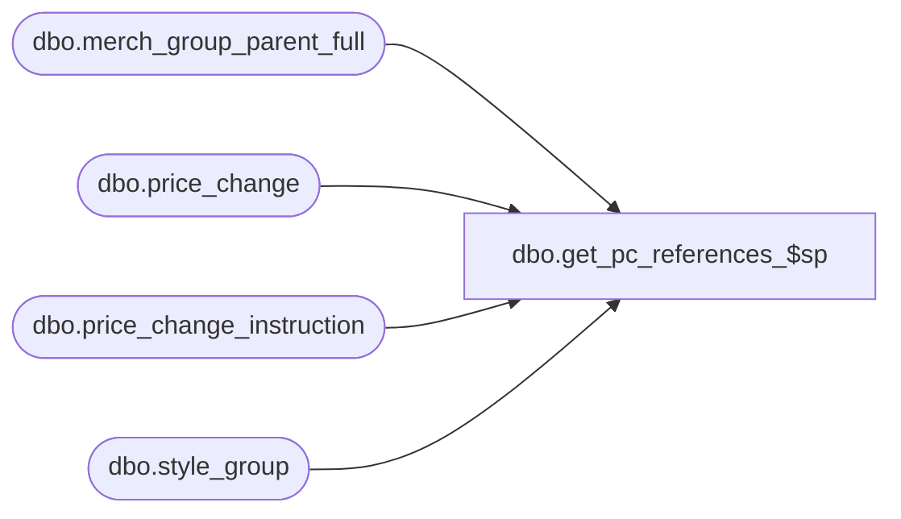

# dbo.get_pc_references_$sp

**Database:** me_01  
**Server:** bedrockdb02  

## Architecture Diagram



## Table Dependencies

| Referenced Table |
|---|
| dbo.merch_group_parent_full |
| dbo.price_change |
| dbo.price_change_instruction |
| dbo.style_group |

## Stored Procedure Code

```sql
-----------------------------------------------------------------------------------------------------------------------------
--	Main Query: Create Procedure
-----------------------------------------------------------------------------------------------------------------------------

CREATE PROCEDURE dbo.get_pc_references_$sp

	@Price_Change_ID AS DECIMAL (12, 0) = NULL

AS

--	Object GUID: 0A02DFE1-AC43-4FD1-89D2-965C1DDE3BCD
--	Pricing GUID (General): EFB5A343-8978-4ACF-952C-37862704CBC8


SET TRANSACTION ISOLATION LEVEL READ UNCOMMITTED
SET NOCOUNT ON


-----------------------------------------------------------------------------------------------------------------------------
--	Error Trapping: Check If Temp Table(s) Already Exist(s) And Drop If Applicable
-----------------------------------------------------------------------------------------------------------------------------

IF OBJECT_ID (N'tempdb.dbo.#temp_list_of_styles', N'U') IS NOT NULL
BEGIN

	DROP TABLE dbo.#temp_list_of_styles

END


-----------------------------------------------------------------------------------------------------------------------------
--	Data Population: Obtain List Of Style IDs
-----------------------------------------------------------------------------------------------------------------------------

SELECT DISTINCT
	 ISNULL (ttPCV.style_id, sqMGSG.style_id) AS style_id
--	,ttPCV.jurisdiction_id
INTO
	dbo.#temp_list_of_styles
FROM
	dbo.#temp_price_change_values ttPCV
	LEFT JOIN

		(
			SELECT
				 MGPF.parent_hierarchy_group_id
				,SG.style_id
			FROM
				dbo.merch_group_parent_full MGPF
				INNER JOIN dbo.style_group SG ON SG.hierarchy_group_id = MGPF.hierarchy_group_id
		) sqMGSG ON sqMGSG.parent_hierarchy_group_id = ttPCV.merch_hierarchy_group_id


-----------------------------------------------------------------------------------------------------------------------------
--	Main Query: Final Display / Output
-----------------------------------------------------------------------------------------------------------------------------

SELECT
	 PC.price_change_no
	,PC.price_change_description
	,PC.price_change_status
	,PC.approval_status
	,PC.effective_from_date
	,PC.effective_to_date
	,PC.price_change_id
FROM
	dbo.price_change PC
	INNER JOIN

		(
			SELECT DISTINCT
				PC.price_change_id
			FROM
				dbo.price_change_instruction PCI
				INNER JOIN dbo.price_change PC ON PC.price_change_id = PCI.price_change_id
					AND PC.price_change_status BETWEEN 1 AND 4 -- 1 - Preliminary, 2 - Submitted, 3 - Issued, 4 - Effective / Lookup Values Found By Querying: SELECT * FROM dbo.enum_price_chg_doc_status
					AND
					(
						PC.price_change_id <> @Price_Change_ID
						OR @Price_Change_ID IS NULL
					)
				LEFT JOIN

					(
						SELECT
							 MGPF.parent_hierarchy_group_id
							--,ttLOS.jurisdiction_id
						FROM
							dbo.merch_group_parent_full MGPF
							INNER JOIN dbo.style_group SG ON SG.hierarchy_group_id = MGPF.hierarchy_group_id
							INNER JOIN dbo.#temp_list_of_styles ttLOS ON ttLOS.style_id = SG.style_id
					) sqMGSG ON sqMGSG.parent_hierarchy_group_id = PCI.merch_hierarchy_group_id
						--AND
						--(
						--	sqMGSG.jurisdiction_id = PCI.jurisdiction_id
						--	OR sqMGSG.jurisdiction_id IS NULL
						--	OR PCI.jurisdiction_id IS NULL
						--)

			WHERE
				(
					(
						PCI.style_id IS NULL
						AND sqMGSG.parent_hierarchy_group_id IS NOT NULL
					)
					OR EXISTS

						(
							SELECT
								*
							FROM
								dbo.#temp_list_of_styles ttLOS
							WHERE
								ttLOS.style_id = PCI.style_id
								--AND
								--(
								--	ttLOS.jurisdiction_id = PCI.jurisdiction_id
								--	OR ttLOS.jurisdiction_id IS NULL
								--	OR PCI.jurisdiction_id IS NULL
								--)
						)

					OR PCI.merch_instruction_type = 0 -- Enterprise Level
				)

		) sqPCI ON sqPCI.price_change_id = PC.price_change_id


-----------------------------------------------------------------------------------------------------------------------------
--	Cleanup: Drop Any Remaining Temp Tables
-----------------------------------------------------------------------------------------------------------------------------

IF OBJECT_ID (N'tempdb.dbo.#temp_list_of_styles', N'U') IS NOT NULL
BEGIN

	DROP TABLE dbo.#temp_list_of_styles

END
```

