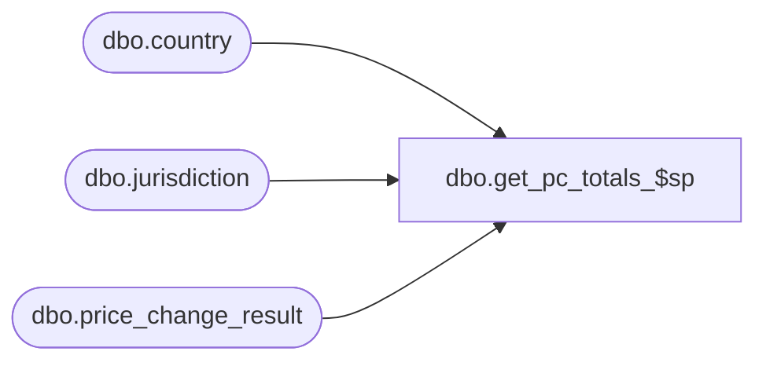

# dbo.get_pc_totals_$sp

**Database:** me_01  
**Server:** bedrockdb02  

## Architecture Diagram



## Table Dependencies

| Referenced Table |
|---|
| dbo.country |
| dbo.jurisdiction |
| dbo.price_change_result |

## Stored Procedure Code

```sql
CREATE PROCEDURE [dbo].[get_pc_totals_$sp]

	@WrkPriceChangeId AS DECIMAL(12,0)

AS
-----------------------------------------------------------------------------------------------------------------------------
/*
  get_pc_totals_$sp: heres what is going on.

    From the calculations output:
    - filter units that are affected by the price change
    - calculate each row's cost and valuation cost
    - sum the units, cost and valuation cost to get the totals
        while respecting the rule regarding the list containing mulitple currencies
*/
-----------------------------------------------------------------------------------------------------------------------------

--	Object GUID: BAAC08B3-C7AD-42F4-9094-8BA5F2CCC98C
--	Pricing GUID (General): EFB5A343-8978-4ACF-952C-37862704CBC8

	SET TRANSACTION ISOLATION LEVEL READ UNCOMMITTED
	SET NOCOUNT ON;

	-- @homeCurrencyId:
    --        - home currency id
    --        - valuation is always in home currency
	DECLARE @homeCurrencyId AS DECIMAL (12, 0);

	SELECT @homeCurrencyId = c.currency_id
	FROM jurisdiction AS j
		JOIN country AS c ON j.country_id = c.country_id
	WHERE home_jurisdiction_flag = 1;

    --@NumCurrencyIds:
    --        - count number of currency ids in affected rows (stop counting if there are at least 2)
    --        - value may be 0 if no rows are affected by the PC
    --        - value may be 2+ if rows affected are for locations with different currencies
	DECLARE @NumCurrencyIds AS INT;

	SELECT @NumCurrencyIds = COUNT(*)
	FROM
	(	SELECT DISTINCT TOP (2) c.currency_id
		FROM price_change_result AS w
			JOIN jurisdiction AS j ON w.jurisdiction_id = j.jurisdiction_id
			JOIN country AS c ON j.country_id = c.country_id
		WHERE result_id = @WrkPriceChangeId
	) a;

    --@valueCurrencyId
    --        - currency id in the affected rows
    --        - will use this if @NumCurrencyIds is 1 since all locations affected are using the same currency
	DECLARE @valueCurrencyId AS DECIMAL (12, 0);

	SELECT TOP (1) @valueCurrencyId = c.currency_id
	FROM price_change_result AS w
		JOIN jurisdiction AS j ON w.jurisdiction_id = j.jurisdiction_id
		JOIN country AS c ON j.country_id = c.country_id
	WHERE result_id = @WrkPriceChangeId

	SELECT    SUM(a.OHUnitsAffected) AS TotalUnits
			, CASE
					WHEN @NumCurrencyIds = 2 THEN SUM(a.OHUnitsAffected * a.DiffPCValuation)
					ELSE SUM(a.OHUnitsAffected * a.DiffPCValue)
				END AS TotaPCValue
			, CASE
					WHEN @NumCurrencyIds = 1 THEN @valueCurrencyId
					ELSE @homeCurrencyId
				END AS valueCurrencyId
			, SUM(a.OHUnitsAffected * a.DiffPCValuation) AS TotalPCValuation
			, @homeCurrencyId AS valuationCurrencyId
	FROM (
			SELECT   CASE WHEN (w.current_retail_price = w.selling_retail_price) THEN 0 ELSE w.total_on_hand_units END AS OHUnitsAffected
					, (w.current_retail_price - w.selling_retail_price) AS DiffPCValue
					, (w.current_valuation_retail_price - w.valuation_retail_price) AS DiffPCValuation
			FROM price_change_result AS w
					JOIN jurisdiction AS j ON w.jurisdiction_id = j.jurisdiction_id
					JOIN country AS c ON j.country_id = c.country_id
			WHERE result_id = @WrkPriceChangeId
					AND total_on_hand_units IS NOT NULL
					AND w.is_pseudo_instruction = 0
		) AS a;
```

