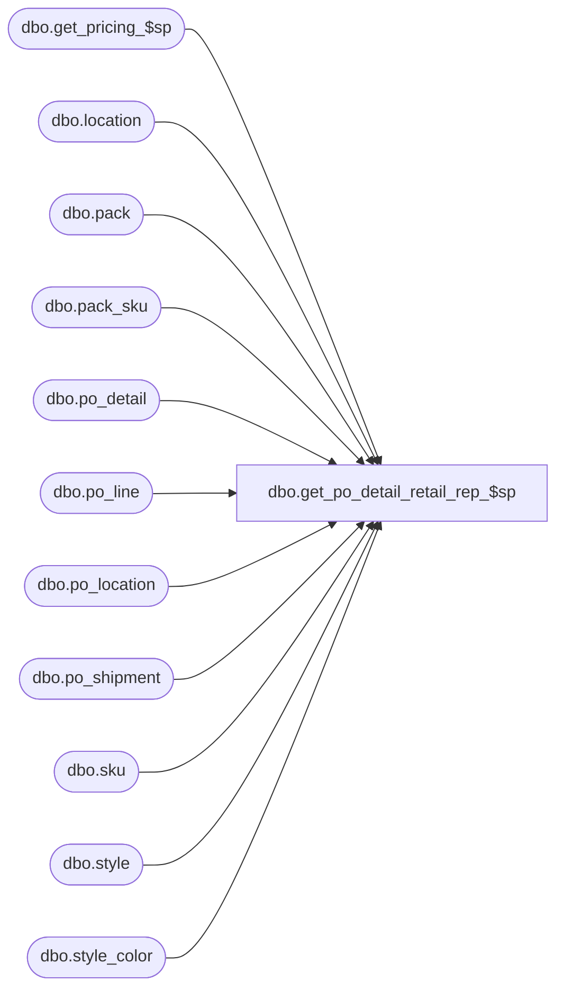

# dbo.get_po_detail_retail_rep_$sp

**Database:** me_01  
**Server:** bedrockdb02  

## Architecture Diagram



## Table Dependencies

| Referenced Table |
|---|
| dbo.get_pricing_$sp |
| dbo.location |
| dbo.pack |
| dbo.pack_sku |
| dbo.po_detail |
| dbo.po_line |
| dbo.po_location |
| dbo.po_shipment |
| dbo.sku |
| dbo.style |
| dbo.style_color |

## Stored Procedure Code

```sql
CREATE PROCEDURE [dbo].[get_po_detail_retail_rep_$sp]
	@poId DECIMAL(12, 0)
AS
BEGIN
/*
  Procedure to get the retails for all kinds of po details by populating these values into a temp table.
  Expects the caller to create a temp table called #temp_po_detail_retail, like:

	CREATE TABLE dbo.#temp_po_detail_retail
	(
		po_detail_id int
		,unit_retail decimal(38,2) NULL
	)
*/

IF OBJECT_ID (N'tempdb.dbo.#temp_po_detail_retail', N'U') IS NULL
BEGIN

CREATE TABLE dbo.#temp_po_detail_retail

	(
		po_detail_id int
		,unit_retail decimal(38,2) NULL
	)

END


DECLARE @current_date AS SMALLDATETIME = GETDATE()

--create temp table that get_pricing_$sp inserts into
IF OBJECT_ID (N'tempdb.dbo.#temp_pi_prices', N'U') IS NOT NULL
BEGIN

	DROP TABLE dbo.#temp_pi_prices

END

CREATE TABLE dbo.#temp_pi_prices

	(
		location_id SMALLINT NULL
		,sku_id DECIMAL (13, 0) NULL
		,price_status_id SMALLINT NULL
		,valuation_unit_retail DECIMAL (14, 2) NULL
		,selling_unit_retail DECIMAL (14, 2) NULL
	)

-- temp table for shipment ids and the dates we will be getting the related prices for
IF OBJECT_ID (N'tempdb.dbo.#temp_po_shipment_dates',  N'U') IS NOT NULL
BEGIN
	DROP TABLE dbo.#temp_po_shipment_dates
END

CREATE TABLE dbo.#temp_po_shipment_dates
	(
		po_shipment_id smallint,
		expected_receipt_date smalldatetime,
		valuation_receipt_date smalldatetime
	)

INSERT INTO #temp_po_shipment_dates (po_shipment_id, expected_receipt_date, valuation_receipt_date)
SELECT
	posh.po_shipment_id,
	posh.expected_receipt_date,
	CASE
		WHEN posh.expected_receipt_date > GETDATE()
		THEN posh.expected_receipt_date
		ELSE CONVERT(SMALLDATETIME, FLOOR(CONVERT(FLOAT, GETDATE())))
    END
FROM po_shipment AS posh WITH (NOLOCK)
WHERE posh.po_id = @poId


--create temp table that get_pricing_$sp reads from
IF OBJECT_ID (N'tempdb.dbo.#temp_wrk_price_lookup',  N'U') IS NOT NULL
BEGIN
	DROP TABLE dbo.#temp_wrk_price_lookup
END

CREATE TABLE dbo.#temp_wrk_price_lookup
	(
		jurisdiction_id SMALLINT NULL
		,location_id SMALLINT NULL
		,style_id DECIMAL (12, 0) NULL
		,style_color_id DECIMAL(13,0) NULL
		,color_id SMALLINT NULL
		,sku_id DECIMAL (13, 0) NULL
		,pack_id DECIMAL(12,0) NULL
		,po_detail_id INT NULL
		,sku_quantity INT NULL
	)


--we need to call the pricing stored proc once per date, with all the relevant po details for the shipments on those dates.
SELECT @current_date = MIN( valuation_receipt_date ) FROM #temp_po_shipment_dates

WHILE @current_date is not null
BEGIN

	--do the work for this date.
	TRUNCATE TABLE #temp_wrk_price_lookup

	--populate the sku/locations we need prices for (from style/color details)
	INSERT INTO #temp_wrk_price_lookup (location_id, sku_id, jurisdiction_id, style_id, color_id, style_color_id, po_detail_id, sku_quantity)
	SELECT pl.location_id, pd.sku_id, l.jurisdiction_id, sc.style_id, sc.color_id, sc.style_color_id, pd.po_detail_id, 1
	FROM po_detail pd WITH (NOLOCK)
		INNER JOIN po_shipment posh WITH (NOLOCK) on pd.po_shipment_id=posh.po_shipment_id AND posh.po_id=pd.po_id
		INNER JOIN po_location pl WITH (NOLOCK) ON pd.po_location_id=pl.po_location_id AND pl.po_id=pd.po_id
		INNER JOIN location l WITH (NOLOCK) on pl.location_id=l.location_id
		INNER JOIN po_line WITH (NOLOCK) on pd.po_line_id=po_line.po_line_id AND po_line.po_id=pd.po_id
		INNER JOIN style_color sc WITH (NOLOCK) on po_line.style_color_id=sc.style_color_id
		INNER JOIN style s WITH (NOLOCK) on sc.style_id=s.style_id
	WHERE pd.po_id=@poId
		AND pd.sku_id is not null
		AND s.style_type=1 -- regular styles only.
		AND posh.po_shipment_id in (SELECT po_shipment_id FROM #temp_po_shipment_dates WHERE valuation_receipt_date= @current_date)

	--populate the sku/locations we need prices for (from pack details).
	INSERT INTO #temp_wrk_price_lookup (location_id, sku_id, jurisdiction_id, style_id, color_id, style_color_id, pack_id, po_detail_id, sku_quantity)
	SELECT pl.location_id, ps.sku_id, l.jurisdiction_id, sku.style_id, sc.color_id, sc.style_color_id, pd.pack_id, pd.po_detail_id, ps.sku_quantity
	FROM po_detail pd WITH (NOLOCK)
		INNER JOIN po_shipment posh WITH (NOLOCK) on pd.po_shipment_id=posh.po_shipment_id AND posh.po_id=pd.po_id
		INNER JOIN po_location pl WITH (NOLOCK) ON pd.po_location_id=pl.po_location_id AND pl.po_id=pd.po_id
		INNER JOIN location l WITH (NOLOCK) on pl.location_id=l.location_id
		INNER JOIN pack WITH (NOLOCK) on pack.pack_id=pd.pack_id
		INNER JOIN pack_sku ps WITH (NOLOCK) on ps.pack_id=pack.pack_id
		INNER JOIN sku WITH (NOLOCK) on ps.sku_id=sku.sku_id
		INNER JOIN style_color sc WITH (NOLOCK) on sku.style_color_id=sc.style_color_id
	WHERE pd.po_id=@poId
		AND pd.pack_id is not null
		AND posh.po_shipment_id in (SELECT po_shipment_id FROM #temp_po_shipment_dates WHERE valuation_receipt_date= @current_date)

	--fill #temp_price_lookup with the prices for the sku/location/dates in #temp_wrk_price_lookup
	-- @Results_To_Table = 0: we do not want the proc to create a work temp table for us.
	-- @Use_PI_Mode=1 we use the PI mode of this function as we really just need the retail values back
	-- @Use_Start_Date=1 the @Date refers to the start date, not the end date.
	exec get_pricing_$sp @Date=@current_date, @Results_To_Table=0, @Use_PI_Mode=1, @Use_Start_Date=1


	--for style-color details
	INSERT INTO #temp_po_detail_retail (po_detail_id, unit_retail)
	SELECT twpl.po_detail_id, tpl.valuation_unit_retail
	FROM #temp_pi_prices tpl
		INNER JOIN #temp_wrk_price_lookup twpl ON twpl.sku_id=tpl.sku_id AND twpl.location_id=tpl.location_id AND twpl.pack_id is null

	--for pack details
	INSERT INTO #temp_po_detail_retail (po_detail_id, unit_retail)
	SELECT twpl.po_detail_id, SUM(twpl.sku_quantity * tpl.valuation_unit_retail) AS unit_retail
	FROM #temp_pi_prices tpl
		INNER JOIN #temp_wrk_price_lookup twpl ON twpl.sku_id=tpl.sku_id AND twpl.location_id=tpl.location_id AND twpl.pack_id is not null
	GROUP BY twpl.po_detail_id

	-- get next date.  MIN() always returns a value, so we will get out of this loop at the end.
	SELECT @current_date = MIN( valuation_receipt_date ) FROM #temp_po_shipment_dates WHERE valuation_receipt_date > @current_date
END


--for pseudo styles, no retail stored in IB.  just whatever is on the PO.
INSERT INTO #temp_po_detail_retail (po_detail_id, unit_retail)
SELECT	pd.po_detail_id,
		ROUND((total_ordered_pseudo_retail / ordered_units) * ploc.pricing_exchange_rate, 2) AS unit_retail
FROM	po_detail pd
		INNER JOIN po_line pl ON (pd.po_id = pl.po_id AND pd.po_line_id = pl.po_line_id)
		INNER JOIN po_location ploc ON (pd.po_id = ploc.po_id AND pd.po_location_id = ploc.po_location_id)
		INNER JOIN style_color sc ON (pl.style_color_id = sc.style_color_id)
		INNER JOIN style s ON (sc.style_id = s.style_id)
WHERE	pd.total_ordered_pseudo_retail IS NOT NULL
		AND pd.pack_id IS NULL
		AND s.style_type = 2
		and pd.po_id=@poId

END
```

