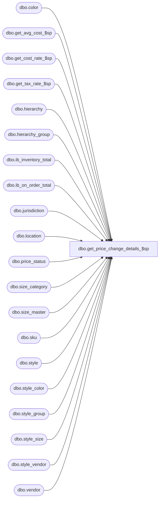

# dbo.get_price_change_details_$sp

**Database:** me_01  
**Server:** bedrockdb02  

## Architecture Diagram



## Table Dependencies

| Referenced Table |
|---|
| dbo.color |
| dbo.get_avg_cost_$sp |
| dbo.get_cost_rate_$sp |
| dbo.get_tax_rate_$sp |
| dbo.hierarchy |
| dbo.hierarchy_group |
| dbo.ib_inventory_total |
| dbo.ib_on_order_total |
| dbo.jurisdiction |
| dbo.location |
| dbo.price_status |
| dbo.size_category |
| dbo.size_master |
| dbo.sku |
| dbo.style |
| dbo.style_color |
| dbo.style_group |
| dbo.style_size |
| dbo.style_vendor |
| dbo.vendor |

## Stored Procedure Code

```sql
-----------------------------------------------------------------------------------------------------------------------------
--	Main Query: Create Procedure
-----------------------------------------------------------------------------------------------------------------------------

CREATE PROCEDURE [dbo].[get_price_change_details_$sp]

	 @Issue_Date AS SMALLDATETIME

AS

SET TRANSACTION ISOLATION LEVEL READ UNCOMMITTED
SET NOCOUNT ON

IF OBJECT_ID (N'tempdb.dbo.#temp_wrk_avg_cost_lookup',  N'U') IS NOT NULL
BEGIN

	DROP TABLE dbo.#temp_wrk_avg_cost_lookup

END

CREATE TABLE dbo.#temp_wrk_avg_cost_lookup

	(
		jurisdiction_id SMALLINT NULL
		,location_id SMALLINT NULL
		,style_id DECIMAL (12, 0) NULL
		,sku_id DECIMAL (13, 0) NULL
	)

IF OBJECT_ID (N'tempdb.dbo.#temp_wrk_cost_rate_lookup',  N'U') IS NOT NULL
BEGIN

	DROP TABLE dbo.#temp_wrk_cost_rate_lookup

END

CREATE TABLE dbo.#temp_wrk_cost_rate_lookup

	(
		jurisdiction_id SMALLINT NULL
		,transaction_date SMALLDATETIME NULL
	)

IF OBJECT_ID (N'tempdb.dbo.#temp_cost_rates',  N'U') IS NOT NULL
BEGIN

	DROP TABLE dbo.#temp_cost_rates

END

CREATE TABLE dbo.#temp_cost_rates

	(
		 jurisdiction_id SMALLINT NULL
		,transaction_date SMALLDATETIME NULL
		,cost_rate FLOAT NULL
	)


INSERT INTO dbo.#temp_wrk_cost_rate_lookup

	(
		jurisdiction_id
		,transaction_date
	)
SELECT
	DISTINCT
		jurisdiction_id
		,GETDATE() AS transaction_date
FROM
	dbo.#temp_price_change_detail

EXEC dbo.get_cost_rate_$sp

IF OBJECT_ID (N'tempdb.dbo.#temp_avg_costs',  N'U') IS NOT NULL
BEGIN

	DROP TABLE dbo.#temp_avg_costs

END

CREATE TABLE dbo.#temp_avg_costs

	(
		location_id SMALLINT NULL
		,sku_id DECIMAL (13, 0) NULL
		,avg_cost DECIMAL (14, 2) NULL
		,avg_cost_local DECIMAL (14, 2) NULL
		,sum_units int NULL
		,sum_cost DECIMAL (18, 6) NULL
		,sum_cost_local DECIMAL (18, 6) NULL
	)

INSERT INTO dbo.#temp_wrk_avg_cost_lookup

	(
		jurisdiction_id
		,location_id
		,style_id
		,sku_id
	)

SELECT
	DISTINCT
		jurisdiction_id
		,location_id
		,style_id
		,sku_id
FROM
	dbo.#temp_price_change_detail

EXEC dbo.get_avg_cost_$sp

IF OBJECT_ID (N'tempdb.dbo.#temp_wrk_tax_rate_lookup',  N'U') IS NOT NULL
BEGIN

	DROP TABLE dbo.#temp_wrk_tax_rate_lookup

END

CREATE TABLE dbo.#temp_wrk_tax_rate_lookup

	(
		jurisdiction_id SMALLINT NULL
		,style_id DECIMAL (12, 0) NULL
		,sku_id DECIMAL (13, 0) NULL
	)

IF OBJECT_ID (N'tempdb.dbo.#temp_tax_rates',  N'U') IS NOT NULL
BEGIN

	DROP TABLE dbo.#temp_tax_rates

END

CREATE TABLE dbo.#temp_tax_rates

	(
		jurisdiction_id SMALLINT NULL
		,sku_id DECIMAL (13, 0) NULL
		,tax_rate DECIMAL (5, 2) NULL
	)

INSERT INTO dbo.#temp_wrk_tax_rate_lookup

	(
		jurisdiction_id
		,style_id
		,sku_id
	)

SELECT
	DISTINCT
		jurisdiction_id
		,style_id
		,sku_id
FROM
	dbo.#temp_price_change_detail

EXEC dbo.get_tax_rate_$sp
	@Date = @Issue_Date

-- price change details
BEGIN
	SELECT
		TPCD.price_change_id
		,TPCD.price_change_instruction_id
		,TPCD.style_id
		,TPCD.color_id
		,TPCD.sku_id
		,TPCD.jurisdiction_id
		,TPCD.location_id
		,SUM(OOT.total_on_order_units) as on_order_units
		,SUM(IBIT.total_on_hand_units) as total_on_hand_units
		,SUM(IBIT.total_on_hand_units) as pc_affected_units
		,TPCD.original_retail_price
		,TPCD.current_retail_price
		,TPCD.selling_retail_price
		,TPCD.calculation_method
		,TPCD.base_calculation_on
		,TPCD.calculation_value
		,TPCD.price_status_id
		,TPCD.is_pseudo_instruction
		,TPCD.original_valuation_retail_price
		,TPCD.valuation_retail_price
		,TPCD.current_valuation_retail_price
		,TAC.avg_cost AS average_cost
		,TAC.avg_cost_local AS average_cost_local
		,COALESCE(TTR.tax_rate, 0) tax_rate
	FROM
		dbo.#temp_price_change_detail TPCD
		INNER JOIN dbo.#temp_avg_costs TAC ON TPCD.sku_id = TAC.sku_id AND TPCD.location_id = TAC.location_id
		LEFT JOIN dbo.#temp_tax_rates TTR ON TPCD.sku_id = TTR.sku_id AND TPCD.jurisdiction_id = TTR.jurisdiction_id

		inner join
			(
				select SUM(IBOOT.total_on_order_units) as total_on_order_units, TPCD.sku_id, TPCD.location_id
				from dbo.#temp_price_change_detail TPCD
				left outer join ib_on_order_total IBOOT on IBOOT.sku_id=TPCD.sku_id and IBOOT.location_id=TPCD.location_id
				group by TPCD.sku_id, TPCD.location_id
			) OOT ON OOT.sku_id= TPCD.sku_id and OOT.location_id= TPCD.location_id
		LEFT OUTER JOIN ib_inventory_total IBIT on IBIT.sku_id=TPCD.sku_id and IBIT.location_id=TPCD.location_id

	group by
		TPCD.price_change_id
		,TPCD.price_change_instruction_id
		,TPCD.style_id
		,TPCD.color_id
		,TPCD.sku_id
		,TPCD.jurisdiction_id
		,TPCD.location_id
		,TPCD.original_retail_price
		,TPCD.current_retail_price
		,TPCD.selling_retail_price
		,TPCD.calculation_method
		,TPCD.base_calculation_on
		,TPCD.calculation_value
		,TPCD.price_status_id
		,TPCD.is_pseudo_instruction
		,TPCD.original_valuation_retail_price
		,TPCD.valuation_retail_price
		,TPCD.current_valuation_retail_price
		,TAC.avg_cost
		,TAC.avg_cost_local
		,COALESCE(TTR.tax_rate, 0)
END

--hierarchy_group
SELECT
	DISTINCT
		HG.hierarchy_group_id
		,HG.hierarchy_group_code
		,HG.hierarchy_group_label
		,HG.hierarchy_group_short_label
		,HG.parent_group_id
		,HG.hierarchy_level_id
		,H.hierarchy_id
		,HG.active_flag
		,H.hierarchy_type
		,H.alternate_flag
FROM
	dbo.#temp_price_change_detail TPCD
	INNER JOIN style_group SG ON TPCD.style_id = SG.style_id AND SG.main_group_flag = 1
	INNER JOIN hierarchy_group HG ON SG.hierarchy_group_id = HG.hierarchy_group_id
	INNER JOIN hierarchy H ON HG.hierarchy_id = H.hierarchy_id
ORDER BY
	HG.hierarchy_group_id

-- style
SELECT
	DISTINCT
		S.style_id
		,S.style_code
		,S.short_desc
		,S.long_desc
		,S.size_category_id
		,S.style_type
		,S.size_flag
		,S.color_flag
FROM
	dbo.#temp_price_change_detail TPCD
	INNER JOIN style S ON TPCD.style_id = S.style_id

-- style_color
SELECT
	DISTINCT
		SC.style_color_id
		,SC.style_id
		,SC.color_id
		,SC.short_desc
		,SC.long_desc
FROM
	dbo.#temp_price_change_detail TPCD
	INNER JOIN style_color SC ON TPCD.style_id = SC.style_id AND TPCD.color_id = SC.color_id

-- color
SELECT
	DISTINCT
		C.color_id
		,C.color_code
		,C.color_short_description
		,C.color_long_description
FROM
	dbo.#temp_price_change_detail TPCD
	INNER JOIN color C ON TPCD.color_id = C.color_id

-- sku
SELECT
	DISTINCT
		K.sku_id
		,K.style_id
		,K.style_color_id
		,K.style_size_id
FROM
	dbo.#temp_price_change_detail TPCD
	INNER JOIN sku K ON TPCD.sku_id = K.sku_id

-- style_size
SELECT
	DISTINCT
		K.style_size_id
		,K.style_id
		,SS.size_master_id
FROM
	dbo.#temp_price_change_detail TPCD
	INNER JOIN sku K ON TPCD.sku_id = K.sku_id
	INNER JOIN style_size SS ON K.style_size_id = SS.style_size_id

-- size_master
SELECT
	DISTINCT
		SM.size_master_id
		,SM.size_code
		,SM.prim_size_label
		,SM.sec_size_label
		,SM.prim_seq_no
		,SM.sec_seq_no
FROM
	dbo.#temp_price_change_detail TPCD
	INNER JOIN sku K ON TPCD.sku_id = K.sku_id
	INNER JOIN style_size SS ON K.style_size_id = SS.style_size_id
	INNER JOIN size_master SM ON SS.size_master_id = SM.size_master_id

-- size_category
SELECT
	DISTINCT
		CAT.size_category_id
		,CAT.size_category_code
		,CAT.size_category_label
FROM
	dbo.#temp_price_change_detail TPCD
	INNER JOIN style S ON TPCD.style_id = S.style_id
	INNER JOIN size_category CAT ON S.size_category_id = CAT.size_category_id

-- style_group
SELECT
	DISTINCT
		SG.style_group_id
		,SG.hierarchy_group_id
		,SG.style_id
FROM
	dbo.#temp_price_change_detail TPCD
	INNER JOIN style_group SG ON TPCD.style_id = SG.style_id AND SG.main_group_flag = 1

-- style_vendor
SELECT
	DISTINCT
		SV.style_vendor_id
		,SV.style_id
		,SV.vendor_id
		,SV.vendor_style
		,SV.primary_vendor_flag
FROM
	dbo.#temp_price_change_detail TPCD
	INNER JOIN style_vendor SV ON TPCD.style_id = SV.style_id AND SV.primary_vendor_flag = 1

-- vendor
SELECT
	DISTINCT
		V.vendor_id
		,V.vendor_code
		,V.vendor_name
FROM
	dbo.#temp_price_change_detail TPCD
	INNER JOIN style_vendor SV ON TPCD.style_id = SV.style_id AND SV.primary_vendor_flag = 1
	INNER JOIN vendor V ON SV.vendor_id = V.vendor_id

-- location
SELECT
	DISTINCT
		L.location_id
		,L.location_code
		,L.location_name
		,L.location_short_name
		,L.jurisdiction_id
FROM
	dbo.#temp_price_change_detail TPCD
	INNER JOIN location L ON TPCD.location_id = L.location_id

-- jurisdiction
SELECT
	DISTINCT
		J.jurisdiction_id
		,J.jurisdiction_code
		,J.jurisdiction_description
FROM
	dbo.#temp_price_change_detail TPCD
	INNER JOIN location L ON TPCD.location_id = L.location_id
	INNER JOIN jurisdiction J ON L.jurisdiction_id = J.jurisdiction_id

-- price_status
SELECT
	DISTINCT
		PS.price_status_id
		,PS.price_status_code
		,PS.price_status_desc
FROM
	dbo.#temp_price_change_detail TPCD
	INNER JOIN price_status PS ON TPCD.price_status_id = PS.price_status_id
```

