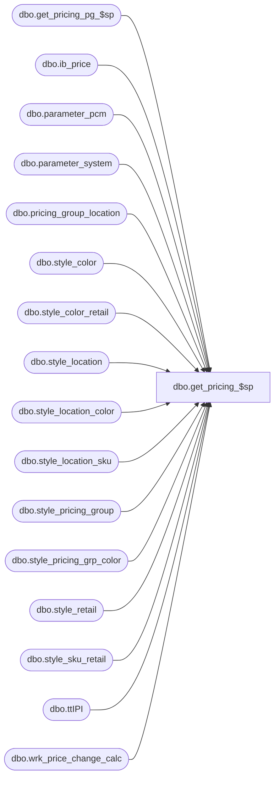

# dbo.get_pricing_$sp

**Database:** me_01  
**Server:** bedrockdb02  

## Architecture Diagram



## Table Dependencies

| Referenced Table |
|---|
| dbo.get_pricing_pg_$sp |
| dbo.ib_price |
| dbo.parameter_pcm |
| dbo.parameter_system |
| dbo.pricing_group_location |
| dbo.style_color |
| dbo.style_color_retail |
| dbo.style_location |
| dbo.style_location_color |
| dbo.style_location_sku |
| dbo.style_pricing_group |
| dbo.style_pricing_grp_color |
| dbo.style_retail |
| dbo.style_sku_retail |
| dbo.ttIPI |
| dbo.wrk_price_change_calc |

## Stored Procedure Code

```sql
-----------------------------------------------------------------------------------------------------------------------------
--	Main Query: Create Procedure
-----------------------------------------------------------------------------------------------------------------------------

CREATE PROCEDURE [dbo].[get_pricing_$sp]

	 @Date AS SMALLDATETIME
	,@Exclude_NULL_Results AS BIT = 1
	,@Group_ID AS INT = NULL
	,@Include_Exception_Color AS BIT = 1
	,@Include_Exception_Color_Location AS BIT = 1
	,@Include_Exception_Color_SKU AS BIT = 1
	,@Include_Exception_Color_SKU_Location AS BIT = 1
	,@Include_Exception_Location AS BIT = 1
	,@Include_Exception_None AS BIT = 1
	,@Output_All_Exception_Values AS BIT = 0 -- Not Longer Used, Needs To Be Removed From Procedure And Application Code
	,@Price_Change_ID AS DECIMAL (12, 0) = NULL
	,@Results_To_Table AS BIT = 1
	,@Temp_Price_Flag AS BIT = 0
	,@Use_PC_Instruction_Mode AS BIT = 0
	,@Use_Start_Date AS BIT = 0
	,@Sales_Posting_Mode AS TINYINT = NULL
	,@Use_PI_Mode AS BIT = 0
	,@Use_Post_Retro_Mode AS BIT = 0
	,@Use_PG_Mode AS BIT = 0
	,@Include_Exception_Color_Pricing_Group AS BIT = 1
	,@Include_Exception_Color_SKU_Pricing_Group AS BIT = 1
	,@Include_Exception_Pricing_Group AS BIT = 1
	,@Use_CRS_Promo_Mode AS BIT = 0
	,@Use_Price_Status_Mode As BIT = 0

AS

--	Object GUID: 70408F0F-7685-4B13-B6A3-DDD917187C8E
--	Pricing GUID (General): EFB5A343-8978-4ACF-952C-37862704CBC8

SET TRANSACTION ISOLATION LEVEL READ UNCOMMITTED
SET NOCOUNT ON


-----------------------------------------------------------------------------------------------------------------------------
--	Call Procedure: Execute "get_pricing_pg_$sp" If "@Use_PG_Mode" Is True And Skip The Rest Of The Current Procedure
-----------------------------------------------------------------------------------------------------------------------------

IF @Use_PG_Mode = 1
BEGIN

	EXECUTE dbo.get_pricing_pg_$sp

		 @Date = @Date
		,@Exclude_NULL_Results = @Exclude_NULL_Results
		,@Group_ID = @Group_ID
		,@Include_Exception_Color = @Include_Exception_Color
		,@Include_Exception_Color_Pricing_Group = @Include_Exception_Color_Pricing_Group
		,@Include_Exception_Color_SKU = @Include_Exception_Color_SKU
		,@Include_Exception_Color_SKU_Pricing_Group = @Include_Exception_Color_SKU_Pricing_Group
		,@Include_Exception_None = @Include_Exception_None
		,@Include_Exception_Pricing_Group = @Include_Exception_Pricing_Group
		,@Price_Change_ID = @Price_Change_ID
		,@Results_To_Table = @Results_To_Table
		,@Temp_Price_Flag = @Temp_Price_Flag
		,@Use_PC_Instruction_Mode = @Use_PC_Instruction_Mode
		,@Use_Start_Date = @Use_Start_Date


	RETURN

END


-----------------------------------------------------------------------------------------------------------------------------
--	Declarations / Sets: Declare And Set Variables
-----------------------------------------------------------------------------------------------------------------------------

DECLARE
	 @Avoid_Truncation AS NVARCHAR (MAX)
	,@Best_Price AS BIT
	,@Generic_Date AS NVARCHAR (19)
	,@Has_MIA AS BIT
	,@Index_Name AS NVARCHAR (128)
	,@Index_Name2 AS NVARCHAR (128)
	,@Jurisdiction_ID AS SMALLINT
	,@Price_By_Instruction_Flag AS BIT
	,@SQL_String AS NVARCHAR (MAX)
	,@SQL_GroupId_String AS NVARCHAR(20)


DECLARE @Jurisdiction_IDs AS TABLE

	(
		jurisdiction_id SMALLINT NOT NULL
	)


SET @Avoid_Truncation = N''


SET @Best_Price = (SELECT (CASE WHEN PS.ib_promotions = 1 THEN 1 ELSE 0 END) FROM dbo.parameter_system PS)


SET @Generic_Date = N'2014-01-01 00:00:00'


SET @Index_Name = N'IX_' + REPLACE (CONVERT (NVARCHAR (36), NEWID ()), N'-', N'') + CONVERT (NVARCHAR (6), @@SPID)

SET @Index_Name2 = N'IX_' + REPLACE (CONVERT (NVARCHAR (36), NEWID ()), N'-', N'') + CONVERT (NVARCHAR (6), @@SPID)


SET @Price_By_Instruction_Flag = (SELECT PP.price_by_instruction_flag FROM dbo.parameter_pcm PP)


SET @SQL_String = N''

SET @SQL_GroupId_String = N''

INSERT INTO @Jurisdiction_IDs

	(
		jurisdiction_id
	)

SELECT DISTINCT
	ttWPL.jurisdiction_id
FROM
	dbo.#temp_wrk_price_lookup ttWPL


SET @Jurisdiction_ID = (SELECT TOP (1) tvJID.jurisdiction_id FROM @Jurisdiction_IDs tvJID ORDER BY tvJID.jurisdiction_id)


-----------------------------------------------------------------------------------------------------------------------------
--	Error Trapping: Check If Temp Table(s) Already Exist(s) And Drop If Applicable
-----------------------------------------------------------------------------------------------------------------------------

IF OBJECT_ID (N'tempdb.dbo.#temp_best_price_promo_keys', N'U') IS NOT NULL
BEGIN

	DROP TABLE dbo.#temp_best_price_promo_keys

END


IF OBJECT_ID (N'tempdb.dbo.#temp_ib_price_ids', N'U') IS NOT NULL
BEGIN

	DROP TABLE dbo.#temp_ib_price_ids

END


IF OBJECT_ID (N'tempdb.dbo.#temp_prices', N'U') IS NOT NULL
BEGIN

	DROP TABLE dbo.#temp_prices

END


IF OBJECT_ID (N'tempdb.dbo.#temp_promo_price_ids', N'U') IS NOT NULL
BEGIN

	DROP TABLE dbo.#temp_promo_price_ids

END


IF OBJECT_ID (N'tempdb.dbo.#temp_styles_mia', N'U') IS NOT NULL
BEGIN

	DROP TABLE dbo.#temp_styles_mia

END


-----------------------------------------------------------------------------------------------------------------------------
--	Table Create: Shell Table For Price IDs
-----------------------------------------------------------------------------------------------------------------------------

CREATE TABLE dbo.#temp_ib_price_ids

	(
		ib_price_id DECIMAL (12, 0)
	)


-----------------------------------------------------------------------------------------------------------------------------
--	Temp Table: List Of Applicable "ib_price_id" Values
-----------------------------------------------------------------------------------------------------------------------------

WHILE @Jurisdiction_ID IS NOT NULL
BEGIN

	-- Check For Cancellation
	IF EXISTS (SELECT * FROM dbo.wrk_price_change_calc WPCC WHERE WPCC.wrk_price_change_calc_id = @Price_Change_ID AND WPCC.ready_to_delete = 1)
	BEGIN

		RETURN

	END


	INSERT INTO dbo.#temp_ib_price_ids

		(
			ib_price_id
		)

	SELECT
		CONVERT (DECIMAL (12, 0), SUBSTRING (X.pricing_key, 20, 20)) AS ib_price_id
	FROM

		(
			SELECT
				 MAX ((CASE
							WHEN @Temp_Price_Flag = 1 THEN @Generic_Date
							WHEN @Use_Start_Date = 1 THEN CONVERT (NVARCHAR (19), IBP.[start_date], 120)
							ELSE CONVERT (NVARCHAR (19), IBP.effective_date, 120)
							END) + caCT.ib_price_id) AS pricing_key
				,MAX (caCT.partial_row_match_key + caCT.ib_price_id) AS full_row_match_key
				,ISNULL (MAX (caCT.partial_row_match_key + caCT.ib_price_id) OVER
																				(
																					PARTITION BY
																						IBP.style_id
																				), @Generic_Date + N'0') AS base_match_key
			FROM
				dbo.ib_price IBP
				CROSS APPLY

					(
						SELECT
							 RIGHT (REPLICATE (N'0', 20) + CONVERT (NVARCHAR (20), IBP.ib_price_id), 20) AS ib_price_id
							,(CASE
								WHEN @Temp_Price_Flag = 1 THEN @Generic_Date
								WHEN @Use_Start_Date = 1 AND IBP.color_id IS NULL AND IBP.location_id IS NULL THEN CONVERT (NVARCHAR (19), IBP.[start_date], 120)
								WHEN @Use_Start_Date = 0 AND IBP.color_id IS NULL AND IBP.location_id IS NULL THEN CONVERT (NVARCHAR (19), IBP.effective_date, 120)
								END) AS partial_row_match_key
					) caCT

			WHERE
				(
					( -- Permanent Price
						@Temp_Price_Flag = 0
						AND IBP.temp_price_flag = @Temp_Price_Flag
						AND
						(
							(
								@Use_Start_Date = 0
								AND IBP.effective_date <= @Date
							)
							OR
							(
								@Use_Start_Date = 1
								AND IBP.[start_date] <= @Date
							)
						)
					)
					OR
					( -- Promo Price
						@Temp_Price_Flag = 1
						AND IBP.temp_price_flag = @Temp_Price_Flag
						AND IBP.[start_date] <= @Date
						AND IBP.end_date >= @Date
						AND IBP.cancel_promo_flag = 0
					)
				)
				AND IBP.jurisdiction_id = @Jurisdiction_ID
				AND NOT

					(
						IBP.location_id IS NULL
						AND IBP.pricing_group_id IS NOT NULL
					)

				AND EXISTS

					(
						SELECT
							*
						FROM
							dbo.#temp_wrk_price_lookup ttWPL
						WHERE
							ttWPL.jurisdiction_id = @Jurisdiction_ID
							AND ttWPL.style_id = IBP.style_id
					)

			GROUP BY
				 IBP.style_id
				,IBP.color_id
				,IBP.location_id
				,IBP.sku_id
				,(CASE
					WHEN @Temp_Price_Flag = 1 THEN IBP.document_number
					ELSE NULL
					END)
				,caCT.partial_row_match_key + caCT.ib_price_id
		) X

	WHERE
		(
			( -- Permanent Price
				@Temp_Price_Flag = 0
				AND
				(
					X.base_match_key = X.full_row_match_key
					OR X.full_row_match_key IS NULL
				)
				AND LEFT (X.pricing_key, 19) >= LEFT (X.base_match_key, 19)
				AND SUBSTRING (X.pricing_key, 20, 20) >= SUBSTRING (X.base_match_key, 20, 20)
			)
			OR @Temp_Price_Flag = 1 -- Promo Price
		)


	SET @Jurisdiction_ID = (SELECT TOP (1) tvJID.jurisdiction_id FROM @Jurisdiction_IDs tvJID WHERE tvJID.jurisdiction_id > @Jurisdiction_ID ORDER BY tvJID.jurisdiction_id)

END

-- create indexes
EXECUTE (N'CREATE NONCLUSTERED INDEX [' + @Index_Name + N'] ON dbo.#temp_ib_price_ids (ib_price_id)')


EXECUTE (N'CREATE NONCLUSTERED INDEX [' + @Index_Name2 + N'] ON dbo.#temp_wrk_price_lookup (style_id, jurisdiction_id) INCLUDE (location_id, color_id, sku_id)')


-----------------------------------------------------------------------------------------------------------------------------
--	Table Update: Remove Ineligible "ib_price_id" Values Based On Promo Price Selection Rules
-----------------------------------------------------------------------------------------------------------------------------

IF @Temp_Price_Flag = 1 AND @Best_Price = 1 -- Promo Pricing Using Best Price
BEGIN

	-- Check For Cancellation
	IF EXISTS (SELECT * FROM dbo.wrk_price_change_calc WPCC WHERE WPCC.wrk_price_change_calc_id = @Price_Change_ID AND WPCC.ready_to_delete = 1)
	BEGIN

		RETURN

	END


	SELECT
		 CONVERT (DECIMAL (12, 0), RIGHT (sqFL.max_key, 13)) AS ib_price_id
		,sqFL.jurisdiction_id
		,sqFL.location_id
		,sqFL.style_id
		,sqFL.color_id
		,sqFL.sku_id
	INTO
		dbo.#temp_best_price_promo_keys
	FROM

		(
			SELECT
				 MAX (RIGHT (REPLICATE ('0', 16) + CONVERT (NVARCHAR (16), 999999999999.99 - IBP.selling_retail_price), 16) + RIGHT (REPLICATE ('0', 13) + CONVERT (NVARCHAR (13), IBP.ib_price_id), 13)) AS max_key
				,ttWPL.jurisdiction_id
				,ttWPL.location_id
				,ttWPL.style_id
				,ttWPL.color_id
				,ttWPL.sku_id
			FROM
				dbo.#temp_ib_price_ids ttIPI
				INNER JOIN dbo.ib_price IBP ON IBP.ib_price_id = ttIPI.ib_price_id
				INNER JOIN dbo.#temp_wrk_price_lookup ttWPL ON ttWPL.style_id = IBP.style_id
					AND ttWPL.jurisdiction_id = IBP.jurisdiction_id
				INNER JOIN

					(
						SELECT
							 ttWPL.jurisdiction_id
							,ttWPL.location_id
							,ttWPL.style_id
							,ttWPL.color_id
							,ttWPL.sku_id
							,IBP.document_number
							,MIN (CASE
									WHEN IBP.color_id IS NULL AND IBP.location_id IS NULL AND IBP.sku_id IS NULL AND @Include_Exception_None = 1 THEN 60 -- Style / Jurisdiction (No Pricing Exception)
									WHEN IBP.color_id = ttWPL.color_id AND IBP.location_id IS NULL AND IBP.sku_id IS NULL AND @Include_Exception_Color = 1 THEN 50 -- Style / Color / Jurisdiction Exception
									WHEN IBP.color_id = ttWPL.color_id AND IBP.location_id IS NULL AND IBP.sku_id = ttWPL.sku_id AND @Include_Exception_Color_SKU = 1 THEN 40 -- Style / Color / SKU / Jurisdiction Exception
									WHEN IBP.color_id IS NULL AND IBP.location_id = ttWPL.location_id AND IBP.sku_id IS NULL AND @Include_Exception_Location = 1 THEN 30 -- Style / Location Exception
									WHEN IBP.color_id = ttWPL.color_id AND IBP.location_id = ttWPL.location_id AND IBP.sku_id IS NULL AND @Include_Exception_Color_Location = 1 THEN 20 -- Style / Color / Location Exception
									WHEN IBP.color_id = ttWPL.color_id AND IBP.location_id = ttWPL.location_id AND IBP.sku_id = ttWPL.sku_id AND @Include_Exception_Color_SKU_Location = 1 THEN 10 -- Style / Color / SKU / Location Exception
									END) AS exception_level
						FROM
							dbo.#temp_ib_price_ids ttIPI
							INNER JOIN dbo.ib_price IBP ON IBP.ib_price_id = ttIPI.ib_price_id
							INNER JOIN dbo.#temp_wrk_price_lookup ttWPL ON ttWPL.style_id = IBP.style_id
								AND ttWPL.jurisdiction_id = IBP.jurisdiction_id
						GROUP BY
							 ttWPL.jurisdiction_id
							,ttWPL.location_id
							,ttWPL.style_id
							,ttWPL.color_id
							,ttWPL.sku_id
							,IBP.document_number
					) sqEPD ON

							sqEPD.jurisdiction_id = ttWPL.jurisdiction_id -- Will Always Be Populated
							AND
							(
								sqEPD.location_id = ttWPL.location_id
								OR ttWPL.location_id IS NULL
							)
							AND sqEPD.style_id = ttWPL.style_id -- Will Always Be Populated
							AND
							(
								sqEPD.color_id = ttWPL.color_id
								OR ttWPL.color_id IS NULL
							)
							AND
							(
								sqEPD.sku_id = ttWPL.sku_id
								OR ttWPL.sku_id IS NULL
							)
							AND sqEPD.document_number = IBP.document_number
							AND sqEPD.exception_level = (CASE
															WHEN IBP.color_id IS NULL AND IBP.location_id IS NULL AND IBP.sku_id IS NULL THEN 60 -- Style / Jurisdiction (No Pricing Exception)
															WHEN IBP.color_id = ttWPL.color_id AND IBP.location_id IS NULL AND IBP.sku_id IS NULL THEN 50 -- Style / Color / Jurisdiction Exception
															WHEN IBP.color_id = ttWPL.color_id AND IBP.location_id IS NULL AND IBP.sku_id = ttWPL.sku_id THEN 40 -- Style / Color / SKU / Jurisdiction Exception
															WHEN IBP.color_id IS NULL AND IBP.location_id = ttWPL.location_id AND IBP.sku_id IS NULL THEN 30 -- Style / Location Exception
															WHEN IBP.color_id = ttWPL.color_id AND IBP.location_id = ttWPL.location_id AND IBP.sku_id IS NULL THEN 20 -- Style / Color / Location Exception
															WHEN IBP.color_id = ttWPL.color_id AND IBP.location_id = ttWPL.location_id AND IBP.sku_id = ttWPL.sku_id THEN 10 -- Style / Color / SKU / Location Exception
															END)
			GROUP BY
				 ttWPL.jurisdiction_id
				,ttWPL.location_id
				,ttWPL.style_id
				,ttWPL.color_id
				,ttWPL.sku_id
		) sqFL


	DELETE
		ttIPI
	FROM
		dbo.#temp_ib_price_ids ttIPI
	WHERE
		NOT EXISTS

			(
				SELECT
					*
				FROM
					dbo.#temp_best_price_promo_keys ttBPPK
				WHERE
					ttBPPK.ib_price_id = ttIPI.ib_price_id
			)

END
ELSE IF @Temp_Price_Flag = 1 AND @Best_Price = 0 -- Promo Pricing Using Last Price
BEGIN

	-- Check For Cancellation
	IF EXISTS (SELECT * FROM dbo.wrk_price_change_calc WPCC WHERE WPCC.wrk_price_change_calc_id = @Price_Change_ID AND WPCC.ready_to_delete = 1)
	BEGIN

		RETURN

	END


	SELECT
		 IBP.jurisdiction_id
		,IBP.style_id
		,caEL.exception_level
		,MAX (IBP.ib_price_id) AS ib_price_id
	INTO
		dbo.#temp_promo_price_ids
	FROM
		dbo.#temp_ib_price_ids ttIPI
		INNER JOIN dbo.ib_price IBP ON IBP.ib_price_id = ttIPI.ib_price_id
		CROSS APPLY

			(
				SELECT
					(CASE
						WHEN IBP.color_id IS NULL AND IBP.location_id IS NULL AND IBP.sku_id IS NULL THEN 60 -- Style / Jurisdiction (No Pricing Exception)
						WHEN IBP.color_id IS NOT NULL AND IBP.location_id IS NULL AND IBP.sku_id IS NULL THEN 50 -- Style / Color / Jurisdiction Exception
						WHEN IBP.color_id IS NOT NULL AND IBP.location_id IS NULL AND IBP.sku_id IS NOT NULL THEN 40 -- Style / Color / SKU / Jurisdiction Exception
						WHEN IBP.color_id IS NULL AND IBP.location_id IS NOT NULL AND IBP.sku_id IS NULL THEN 30 -- Style / Location Exception
						WHEN IBP.color_id IS NOT NULL AND IBP.location_id IS NOT NULL AND IBP.sku_id IS NULL THEN 20 -- Style / Color / Location Exception
						WHEN IBP.color_id IS NOT NULL AND IBP.location_id IS NOT NULL AND IBP.sku_id IS NOT NULL THEN 10 -- Style / Color / SKU / Location Exception
						END) AS exception_level
			) caEL

	WHERE
		(
			( -- Style / Jurisdiction (No Pricing Exception)
				@Include_Exception_None = 1
				AND IBP.color_id IS NULL
				AND IBP.location_id IS NULL
				AND IBP.sku_id IS NULL
			)
			OR
			( -- Style / Color / Jurisdiction Exception
				@Include_Exception_Color = 1
				AND IBP.color_id IS NOT NULL
				AND IBP.location_id IS NULL
				AND IBP.sku_id IS NULL
			)
			OR
			( -- Style / Color / SKU / Jurisdiction Exception
				@Include_Exception_Color_SKU = 1
				AND IBP.color_id IS NOT NULL
				AND IBP.location_id IS NULL
				AND IBP.sku_id IS NOT NULL
			)
			OR
			( -- Style / Location Exception
				@Include_Exception_Location = 1
				AND IBP.color_id IS NULL
				AND IBP.location_id IS NOT NULL
				AND IBP.sku_id IS NULL
			)
			OR
			( -- Style / Color / Location Exception
				@Include_Exception_Color_Location = 1
				AND IBP.color_id IS NOT NULL
				AND IBP.location_id IS NOT NULL
				AND IBP.sku_id IS NULL
			)
			OR
			( -- Style / Color / SKU / Location Exception
				@Include_Exception_Color_SKU_Location = 1
				AND IBP.color_id IS NOT NULL
				AND IBP.location_id IS NOT NULL
				AND IBP.sku_id IS NOT NULL
			)
		)
	GROUP BY
		 IBP.jurisdiction_id
		,IBP.style_id
		,caEL.exception_level
		,IBP.location_id
		,IBP.color_id
		,IBP.sku_id


	DELETE
		ttIPI
	FROM
		dbo.#temp_ib_price_ids ttIPI
		LEFT JOIN

			(
				SELECT
					upIPI.ib_price_id
				FROM

					(
						SELECT
							 sqSJ.style_id
							,sqSJ.jurisdiction_id
							,ttPPI60.ib_price_id AS ib_price_id_60
							,ttPPI50.ib_price_id AS ib_price_id_50
							,ttPPI40.ib_price_id AS ib_price_id_40
							,ttPPI30.ib_price_id AS ib_price_id_30
							,ttPPI20.ib_price_id AS ib_price_id_20
							,ttPPI10.ib_price_id AS ib_price_id_10
						FROM

							(
								SELECT DISTINCT
									 ttPPI.jurisdiction_id
									,ttPPI.style_id
								FROM
									dbo.#temp_promo_price_ids ttPPI
							) sqSJ

							LEFT JOIN dbo.#temp_promo_price_ids ttPPI60 ON ttPPI60.jurisdiction_id = sqSJ.jurisdiction_id
								AND ttPPI60.style_id = sqSJ.style_id
								AND ttPPI60.exception_level = 60
							LEFT JOIN dbo.#temp_promo_price_ids ttPPI50 ON ttPPI50.jurisdiction_id = sqSJ.jurisdiction_id
								AND ttPPI50.style_id = sqSJ.style_id
								AND ttPPI50.exception_level = 50
								AND ttPPI50.ib_price_id >= ISNULL (ttPPI60.ib_price_id, ttPPI50.ib_price_id)
							LEFT JOIN dbo.#temp_promo_price_ids ttPPI40 ON ttPPI40.jurisdiction_id = sqSJ.jurisdiction_id
								AND ttPPI40.style_id = sqSJ.style_id
								AND ttPPI40.exception_level = 40
								AND ttPPI40.ib_price_id >= ISNULL (ttPPI60.ib_price_id, ttPPI40.ib_price_id)
								AND ttPPI40.ib_price_id >= ISNULL (ttPPI50.ib_price_id, ttPPI40.ib_price_id)
							LEFT JOIN dbo.#temp_promo_price_ids ttPPI30 ON ttPPI30.jurisdiction_id = sqSJ.jurisdiction_id
								AND ttPPI30.style_id = sqSJ.style_id
								AND ttPPI30.exception_level = 30
								AND ttPPI30.ib_price_id >= ISNULL (ttPPI60.ib_price_id, ttPPI30.ib_price_id)
								AND ttPPI30.ib_price_id >= ISNULL (ttPPI50.ib_price_id, ttPPI30.ib_price_id)
								AND ttPPI30.ib_price_id >= ISNULL (ttPPI40.ib_price_id, ttPPI30.ib_price_id)
							LEFT JOIN dbo.#temp_promo_price_ids ttPPI20 ON ttPPI20.jurisdiction_id = sqSJ.jurisdiction_id
								AND ttPPI20.style_id = sqSJ.style_id
								AND ttPPI20.exception_level = 20
								AND ttPPI20.ib_price_id >= ISNULL (ttPPI60.ib_price_id, ttPPI20.ib_price_id)
								AND ttPPI20.ib_price_id >= ISNULL (ttPPI50.ib_price_id, ttPPI20.ib_price_id)
								AND ttPPI20.ib_price_id >= ISNULL (ttPPI40.ib_price_id, ttPPI20.ib_price_id)
								AND ttPPI20.ib_price_id >= ISNULL (ttPPI30.ib_price_id, ttPPI20.ib_price_id)
							LEFT JOIN dbo.#temp_promo_price_ids ttPPI10 ON ttPPI10.jurisdiction_id = sqSJ.jurisdiction_id
								AND ttPPI10.style_id = sqSJ.style_id
								AND ttPPI10.exception_level = 10
								AND ttPPI10.ib_price_id >= ISNULL (ttPPI60.ib_price_id, ttPPI10.ib_price_id)
								AND ttPPI10.ib_price_id >= ISNULL (ttPPI50.ib_price_id, ttPPI10.ib_price_id)
								AND ttPPI10.ib_price_id >= ISNULL (ttPPI40.ib_price_id, ttPPI10.ib_price_id)
								AND ttPPI10.ib_price_id >= ISNULL (ttPPI30.ib_price_id, ttPPI10.ib_price_id)
								AND ttPPI10.ib_price_id >= ISNULL (ttPPI20.ib_price_id, ttPPI10.ib_price_id)
					) sqAI

					UNPIVOT

						(
							ib_price_id
							FOR
								ib_price_ids IN (sqAI.ib_price_id_60, sqAI.ib_price_id_50, sqAI.ib_price_id_40, sqAI.ib_price_id_30, sqAI.ib_price_id_20, sqAI.ib_price_id_10)
						) upIPI

			) sqFL ON sqFL.ib_price_id = ttIPI.ib_price_id

	WHERE
		sqFL.ib_price_id IS NULL


	IF OBJECT_ID (N'tempdb.dbo.#temp_promo_price_ids', N'U') IS NOT NULL
	BEGIN

		DROP TABLE dbo.#temp_promo_price_ids

	END

END


-----------------------------------------------------------------------------------------------------------------------------
--	Temp Table: Pricing Values
-----------------------------------------------------------------------------------------------------------------------------

-- Check For Cancellation
IF EXISTS (SELECT * FROM dbo.wrk_price_change_calc WPCC WHERE WPCC.wrk_price_change_calc_id = @Price_Change_ID AND WPCC.ready_to_delete = 1)
BEGIN

	RETURN

END


SELECT
	 IBP.style_id
	,IBP.jurisdiction_id
	,IBP.color_id
	,IBP.location_id
	,IBP.sku_id
	,IBP.valuation_retail_price
	,IBP.selling_retail_price
	,IBP.price_status_id
	,IBP.[start_date]
	,IBP.end_date
	,IBP.effective_date
	,(CASE
		-- Permanent Price
		WHEN @Temp_Price_Flag = 0 AND @Use_Start_Date = 0 THEN CONVERT (NVARCHAR (19), IBP.effective_date, 120) -- Permanent Price Based On Effective Date
		WHEN @Temp_Price_Flag = 0 AND @Use_Start_Date = 1 THEN CONVERT (NVARCHAR (19), IBP.[start_date], 120) -- Permanent Price Based On Start Date
		-- Promo Price
		WHEN @Temp_Price_Flag = 1 AND @Best_Price = 0 THEN N'' -- Promo Price Based On Last Price
		END) + RIGHT (REPLICATE (N'0', 20) + CONVERT (NVARCHAR (20), IBP.ib_price_id), 20) AS compare_key
	,(CASE
		WHEN @Sales_Posting_Mode IN (1, 5) THEN IBP.document_number -- Current Retail Mode Called From "dbo.populate_temp_sale_master_$sp" Or "process_modified_transactions_$sp"
		WHEN @Use_Post_Retro_Mode = 1 THEN IBP.document_number -- Called From "dbo.ib_post_retro_retails_$sp"
		ELSE NULL
		END) AS document_number
	,(CASE
		WHEN @Sales_Posting_Mode IN (1, 5) THEN IBP.price_change_type -- Current Retail Mode Called From "dbo.populate_temp_sale_master_$sp" Or "process_modified_transactions_$sp"
		WHEN @Use_Post_Retro_Mode = 1 THEN IBP.price_change_type -- Called From "dbo.ib_post_retro_retails_$sp"
		WHEN @Use_CRS_Promo_Mode = 1 THEN IBP.price_change_type -- Called From "code for segment 1038 (CRS)"
		ELSE NULL
		END) AS price_change_type
	,(CASE
		WHEN @Temp_Price_Flag = 1 AND @Best_Price = 1 THEN IBP.ib_price_id -- Promo Pricing Using Best Price
		ELSE NULL
		END) AS ib_price_id
INTO
	dbo.#temp_prices
FROM
	dbo.ib_price IBP
WHERE
	EXISTS

		(
			SELECT
				*
			FROM
				dbo.#temp_ib_price_ids A
			WHERE
				A.ib_price_id = IBP.ib_price_id
		)


IF OBJECT_ID (N'tempdb.dbo.#temp_ib_price_ids', N'U') IS NOT NULL
BEGIN

	DROP TABLE dbo.#temp_ib_price_ids

END


--EXECUTE (N'CREATE NONCLUSTERED INDEX [' + @Index_Name + N'] ON dbo.#temp_prices (style_id, color_id, location_id, sku_id, jurisdiction_id) INCLUDE (valuation_retail_price, selling_retail_price, price_status_id)')


-----------------------------------------------------------------------------------------------------------------------------
--	Temp Table: Get Future Pricing (If Applicable)
-----------------------------------------------------------------------------------------------------------------------------

IF @Temp_Price_Flag = 0
BEGIN

	-- Check For Cancellation
	IF EXISTS (SELECT * FROM dbo.wrk_price_change_calc WPCC WHERE WPCC.wrk_price_change_calc_id = @Price_Change_ID AND WPCC.ready_to_delete = 1)
	BEGIN

		RETURN

	END


	SELECT
		 ttWPL.jurisdiction_id
		,ttWPL.location_id
		,ttWPL.style_id
		,ttWPL.color_id
		,ttWPL.style_color_id
		,ttWPL.sku_id
		,COALESCE (caRP.original_selling_retail, caRP.current_selling_retail) AS selling_retail_price
		,COALESCE (caRP.original_valuation_retail, caRP.current_valuation_retail) AS valuation_retail_price
		,COALESCE (caRP.original_price_status_id, caRP.current_price_status_id) AS price_status_id
		,@Date AS transaction_date
		,(CASE
			WHEN SLS.original_selling_retail IS NOT NULL THEN 10 -- Style / Color / SKU / Location Exception
			WHEN SLC.original_selling_retail IS NOT NULL THEN 20 -- Style / Color / Location Exception
			WHEN SL.original_selling_retail IS NOT NULL THEN 30 -- Style / Location Exception

			WHEN SPGC.original_selling_retail IS NOT NULL THEN 33 -- Pricing Group / Location / Style Color Exception
			WHEN SPG.original_selling_retail IS NOT NULL THEN 37 -- Pricing Group / Location / Style Exception

			WHEN SSR.original_selling_retail IS NOT NULL THEN 40 -- Style / Color / SKU / Jurisdiction Exception
			WHEN SCR.original_selling_retail IS NOT NULL THEN 50 -- Style / Color / Jurisdiction Exception
			WHEN SR.original_selling_retail IS NOT NULL THEN 60 -- Style / Jurisdiction (No Pricing Exception)
			END) AS exception_level
	INTO
		dbo.#temp_styles_mia
	FROM
		dbo.#temp_wrk_price_lookup ttWPL
		LEFT JOIN dbo.style_color SC ON SC.style_id = ttWPL.style_id
			AND SC.color_id = ttWPL.color_id
		LEFT JOIN dbo.style_location_sku SLS ON SLS.sku_id = ttWPL.sku_id -- Style / Color / SKU / Location Exception
			AND SLS.location_id = ttWPL.location_id
			AND @Include_Exception_Color_SKU_Location = 1
			AND @Price_By_Instruction_Flag = 1
		LEFT JOIN dbo.style_location_color SLC ON SLC.style_id = ttWPL.style_id -- Style / Color / Location Exception
			AND SLC.location_id = ttWPL.location_id
			AND SLC.style_color_id = SC.style_color_id
			AND SLC.jurisdiction_id = ttWPL.jurisdiction_id
			AND @Include_Exception_Color_Location = 1
		LEFT JOIN dbo.style_location SL ON SL.style_id = ttWPL.style_id -- Style / Location Exception
			AND SL.location_id = ttWPL.location_id
			AND SL.jurisdiction_id = ttWPL.jurisdiction_id
			AND @Include_Exception_Location = 1

		LEFT JOIN dbo.pricing_group_location PGL ON PGL.location_id = ttWPL.location_id
			AND @Price_By_Instruction_Flag = 0
		LEFT JOIN dbo.style_pricing_grp_color SPGC ON SPGC.pricing_group_id = PGL.pricing_group_id -- Pricing Group / Location / Style Color Exception
			AND SPGC.style_color_id = SC.style_color_id
			AND @Price_By_Instruction_Flag = 0
		LEFT JOIN dbo.style_pricing_group SPG ON SPG.pricing_group_id = PGL.pricing_group_id -- Pricing Group / Location / Style Exception
			AND SPG.style_id = ttWPL.style_id
			AND @Price_By_Instruction_Flag = 0

		LEFT JOIN dbo.style_sku_retail SSR ON SSR.sku_id = ttWPL.sku_id -- Style / Color / SKU / Jurisdiction Exception
			AND SSR.jurisdiction_id = ttWPL.jurisdiction_id
			AND @Include_Exception_Color_SKU = 1
			AND @Price_By_Instruction_Flag = 1
		LEFT JOIN dbo.style_color_retail SCR ON SCR.style_id = ttWPL.style_id -- Style / Color / Jurisdiction Exception
			AND SCR.style_color_id = SC.style_color_id
			AND SCR.jurisdiction_id = ttWPL.jurisdiction_id
			AND @Include_Exception_Color = 1
		LEFT JOIN dbo.style_retail SR ON SR.style_id = ttWPL.style_id -- Style / Jurisdiction (No Pricing Exception)
			AND SR.jurisdiction_id = ttWPL.jurisdiction_id
			AND @Include_Exception_None = 1
		CROSS APPLY

			(
				SELECT
					 COALESCE (SLS.original_selling_retail, SLC.original_selling_retail, SL.original_selling_retail, SPGC.original_selling_retail, SPG.original_selling_retail, SSR.original_selling_retail, SCR.original_selling_retail, SR.original_selling_retail) AS original_selling_retail
					,COALESCE (SLS.current_selling_retail, SLC.current_selling_retail, SL.current_selling_retail, SPGC.current_selling_retail, SPG.current_selling_retail, SSR.current_selling_retail, SCR.current_selling_retail, SR.current_selling_retail) AS current_selling_retail
					,COALESCE (SLS.original_valuation_retail, SLC.original_valuation_retail, SL.original_valuation_retail, SPGC.original_valuation_retail, SPG.original_valuation_retail, SSR.original_valuation_retail, SCR.original_valuation_retail, SR.original_valuation_retail) AS original_valuation_retail
					,COALESCE (SLS.current_valuation_retail, SLC.current_valuation_retail, SL.current_valuation_retail, SPGC.current_valuation_retail, SPG.current_valuation_retail, SSR.current_valuation_retail, SCR.current_valuation_retail, SR.current_valuation_retail) AS current_valuation_retail
					,COALESCE (SLS.original_price_status_id, SLC.original_price_status_id, SL.original_price_status_id, SPGC.original_price_status_id, SPG.original_price_status_id, SSR.original_price_status_id, SCR.original_price_status_id, SR.original_price_status_id) AS original_price_status_id
					,COALESCE (SLS.current_price_status_id, SLC.current_price_status_id, SL.current_price_status_id, SPGC.current_price_status_id, SPG.current_price_status_id, SSR.current_price_status_id, SCR.current_price_status_id, SR.current_price_status_id) AS current_price_status_id
			) caRP

	WHERE
		NOT EXISTS

			(
				SELECT
					*
				FROM
					dbo.#temp_prices ttP
				WHERE
					ttP.jurisdiction_id = ttWPL.jurisdiction_id
					AND ttP.style_id = ttWPL.style_id
			)


	IF @@ROWCOUNT > 0
	BEGIN

		SET @Exclude_NULL_Results = 1


		SET @Has_MIA = 1

	END

END


-----------------------------------------------------------------------------------------------------------------------------
--	Main Query: Final Display / Output
-----------------------------------------------------------------------------------------------------------------------------

-- Check For Cancellation
IF EXISTS (SELECT * FROM dbo.wrk_price_change_calc WPCC WHERE WPCC.wrk_price_change_calc_id = @Price_Change_ID AND WPCC.ready_to_delete = 1)
BEGIN

	RETURN

END


IF @Group_ID IS NOT NULL AND @Results_To_Table = 1
BEGIN
	SET @SQL_GroupId_String = CONVERT (NVARCHAR (11), @Group_ID) + N','
	SET @SQL_String = @Avoid_Truncation +

		N'


			INSERT INTO dbo.temp_price_lookup

				(
					temp_price_lookup_id
					,style_id
					,jurisdiction_id
					,color_id
					,location_id
					,style_color_id
					,sku_id
					,valuation_retail_price
					,selling_retail_price
					,price_status_id
					,[start_date]
					,end_date
					,effective_date
					,exception_level
				)
		 '

END


-- Being Called From SQL Script Or Stored Procedure NOT Related To PCM
IF @Group_ID IS NULL AND @Results_To_Table = 1
BEGIN

	SET @SQL_String = @Avoid_Truncation +

		N'
			INSERT INTO dbo.#temp_price_lookup

				(
					 style_id
					,jurisdiction_id
					,color_id
					,location_id
					,style_color_id
					,sku_id
					,valuation_retail_price
					,selling_retail_price
					,price_status_id
					,[start_date]
					,end_date
					,effective_date
					,exception_level
				)
		 '

END

-- Being Called From: dbo.get_pc_instruction_values_$sp
IF @Use_PC_Instruction_Mode = 1
BEGIN

	SET @SQL_String = @Avoid_Truncation +

		N'
			INSERT INTO dbo.#temp_current_prices

				(
					 location_id
					,sku_id
					,selling_retail_price_parent
					,price_status_id_parent
					,valuation_retail_price_child
					,selling_retail_price_child
					,price_status_id_child
					,exception_level
				)

			SELECT
				 ttWPL.location_id
				,ttWPL.sku_id
				,(CASE
					WHEN ttWPL.new_exception_level = 10 THEN COALESCE (ttP1.selling_retail_price, ttP2.selling_retail_price, ttP3.selling_retail_price, ttP4.selling_retail_price, ttP5.selling_retail_price, ttP6.selling_retail_price)
					WHEN ttWPL.new_exception_level = 20 THEN COALESCE (ttP2.selling_retail_price, ttP3.selling_retail_price, ttP5.selling_retail_price, ttP6.selling_retail_price)
					WHEN ttWPL.new_exception_level = 30 THEN COALESCE (ttP3.selling_retail_price, ttP6.selling_retail_price)
					WHEN ttWPL.new_exception_level = 40 THEN COALESCE (ttP4.selling_retail_price, ttP5.selling_retail_price, ttP6.selling_retail_price)
					WHEN ttWPL.new_exception_level = 50 THEN COALESCE (ttP5.selling_retail_price, ttP6.selling_retail_price)
					WHEN ttWPL.new_exception_level = 60 THEN ttP6.selling_retail_price
					END) AS selling_retail_price_parent
				,(CASE
					WHEN ttWPL.new_exception_level = 10 THEN COALESCE (ttP1.price_status_id, ttP2.price_status_id, ttP3.price_status_id, ttP4.price_status_id, ttP5.price_status_id, ttP6.price_status_id)
					WHEN ttWPL.new_exception_level = 20 THEN COALESCE (ttP2.price_status_id, ttP3.price_status_id, ttP5.price_status_id, ttP6.price_status_id)
					WHEN ttWPL.new_exception_level = 30 THEN COALESCE (ttP3.price_status_id, ttP6.price_status_id)
					WHEN ttWPL.new_exception_level = 40 THEN COALESCE (ttP4.price_status_id, ttP5.price_status_id, ttP6.price_status_id)
					WHEN ttWPL.new_exception_level = 50 THEN COALESCE (ttP5.price_status_id, ttP6.price_status_id)
					WHEN ttWPL.new_exception_level = 60 THEN ttP6.price_status_id
					END) AS price_status_id_parent
				,COALESCE (ttP1.valuation_retail_price, ttP2.valuation_retail_price, ttP3.valuation_retail_price, ttP4.valuation_retail_price, ttP5.valuation_retail_price, ttP6.valuation_retail_price) AS valuation_retail_price_child
				,COALESCE (ttP1.selling_retail_price, ttP2.selling_retail_price, ttP3.selling_retail_price, ttP4.selling_retail_price, ttP5.selling_retail_price, ttP6.selling_retail_price) AS selling_retail_price_child
				,COALESCE (ttP1.price_status_id, ttP2.price_status_id, ttP3.price_status_id, ttP4.price_status_id, ttP5.price_status_id, ttP6.price_status_id) AS price_status_id_child
				,(CASE
					WHEN ttP1.style_id IS NOT NULL THEN 10 -- Style / Color / SKU / Location Exception
					WHEN ttP2.style_id IS NOT NULL THEN 20 -- Style / Color / Location Exception
					WHEN ttP3.style_id IS NOT NULL THEN 30 -- Style / Location Exception
					WHEN ttP4.style_id IS NOT NULL THEN 40 -- Style / Color / SKU / Jurisdiction Exception
					WHEN ttP5.style_id IS NOT NULL THEN 50 -- Style / Color / Jurisdiction Exception
					WHEN ttP6.style_id IS NOT NULL THEN 60 -- Style / Jurisdiction (No Pricing Exception)
					END) AS exception_level
		 '

END
-- Being Called From: dbo.populate_temp_sale_master_$sp (Current Retail)
ELSE IF @Sales_Posting_Mode = 1
BEGIN

	SET @SQL_String = @Avoid_Truncation +

		N'
			INSERT INTO #temp_current_retail

				(
					 jurisdiction_id
					,location_id
					,style_id
					,style_color_id
					,color_id
					,price_status_id
					,valuation_unit_retail
					,selling_unit_retail
					,document_number
					,effective_date
					,price_change_type
					,sku_id
				)

			SELECT
				 ttWPL.jurisdiction_id
				,ttWPL.location_id
				,ttWPL.style_id
				,ttWPL.style_color_id
				,ttWPL.color_id
				,COALESCE (ttP1.price_status_id, ttP2.price_status_id, ttP3.price_status_id, ttP4.price_status_id, ttP5.price_status_id, ttP6.price_status_id) AS price_status_id
				,COALESCE (ttP1.valuation_retail_price, ttP2.valuation_retail_price, ttP3.valuation_retail_price, ttP4.valuation_retail_price, ttP5.valuation_retail_price, ttP6.valuation_retail_price) AS valuation_retail_price
				,COALESCE (ttP1.selling_retail_price, ttP2.selling_retail_price, ttP3.selling_retail_price, ttP4.selling_retail_price, ttP5.selling_retail_price, ttP6.selling_retail_price) AS selling_retail_price
				,(CASE
					WHEN ttP1.style_id IS NOT NULL THEN ttP1.document_number
					WHEN ttP2.style_id IS NOT NULL THEN ttP2.document_number
					WHEN ttP3.style_id IS NOT NULL THEN ttP3.document_number
					WHEN ttP4.style_id IS NOT NULL THEN ttP4.document_number
					WHEN ttP5.style_id IS NOT NULL THEN ttP5.document_number
					WHEN ttP6.style_id IS NOT NULL THEN ttP6.document_number
					END) AS document_number
				,(CASE
					WHEN ttP1.style_id IS NOT NULL THEN ttP1.effective_date
					WHEN ttP2.style_id IS NOT NULL THEN ttP2.effective_date
					WHEN ttP3.style_id IS NOT NULL THEN ttP3.effective_date
					WHEN ttP4.style_id IS NOT NULL THEN ttP4.effective_date
					WHEN ttP5.style_id IS NOT NULL THEN ttP5.effective_date
					WHEN ttP6.style_id IS NOT NULL THEN ttP6.effective_date
					END) AS effective_date
				,(CASE
					WHEN ttP1.style_id IS NOT NULL THEN ttP1.price_change_type
					WHEN ttP2.style_id IS NOT NULL THEN ttP2.price_change_type
					WHEN ttP3.style_id IS NOT NULL THEN ttP3.price_change_type
					WHEN ttP4.style_id IS NOT NULL THEN ttP4.price_change_type
					WHEN ttP5.style_id IS NOT NULL THEN ttP5.price_change_type
					WHEN ttP6.style_id IS NOT NULL THEN ttP6.price_change_type
					END) AS price_change_type
				,ttWPL.sku_id
		 '

END
-- Being Called From: dbo.populate_temp_sale_master_$sp (Effective Retail)
ELSE IF @Sales_Posting_Mode = 2
BEGIN

	SET @SQL_String = @Avoid_Truncation +

		N'
			INSERT INTO #temp_effective_retail

				(
					 transaction_date
					,jurisdiction_id
					,location_id
					,style_id
					,style_color_id
					,color_id
					,price_status_id
					,valuation_unit_retail
					,selling_unit_retail
					,sku_id
				)

			SELECT
				 ''' + CONVERT (NVARCHAR (19), @Date, 120) + N''' AS transaction_date
				,ttWPL.jurisdiction_id
				,ttWPL.location_id
				,ttWPL.style_id
				,ttWPL.style_color_id
				,ttWPL.color_id
				,COALESCE (ttP1.price_status_id, ttP2.price_status_id, ttP3.price_status_id, ttP4.price_status_id, ttP5.price_status_id, ttP6.price_status_id) AS price_status_id
				,COALESCE (ttP1.valuation_retail_price, ttP2.valuation_retail_price, ttP3.valuation_retail_price, ttP4.valuation_retail_price, ttP5.valuation_retail_price, ttP6.valuation_retail_price) AS valuation_retail_price
				,COALESCE (ttP1.selling_retail_price, ttP2.selling_retail_price, ttP3.selling_retail_price, ttP4.selling_retail_price, ttP5.selling_retail_price, ttP6.selling_retail_price) AS selling_retail_price
				,ttWPL.sku_id
		 '

END
-- Being Called From: dbo.populate_temp_sale_master_$sp (Issued Retail)
ELSE IF @Sales_Posting_Mode = 3
BEGIN

	SET @SQL_String = @Avoid_Truncation +

		N'
			INSERT INTO #temp_issued_retail

				(
					 transaction_date
					,jurisdiction_id
					,location_id
					,style_id
					,style_color_id
					,color_id
					,price_status_id
					,valuation_retail_price
					,selling_retail_price
					,sku_id
				)

			SELECT
				 ''' + CONVERT (NVARCHAR (19), @Date, 120) + N''' AS transaction_date
				,ttWPL.jurisdiction_id
				,ttWPL.location_id
				,ttWPL.style_id
				,ttWPL.style_color_id
				,ttWPL.color_id
				,COALESCE (ttP1.price_status_id, ttP2.price_status_id, ttP3.price_status_id, ttP4.price_status_id, ttP5.price_status_id, ttP6.price_status_id) AS price_status_id
				,COALESCE (ttP1.valuation_retail_price, ttP2.valuation_retail_price, ttP3.valuation_retail_price, ttP4.valuation_retail_price, ttP5.valuation_retail_price, ttP6.valuation_retail_price) AS valuation_retail_price
				,COALESCE (ttP1.selling_retail_price, ttP2.selling_retail_price, ttP3.selling_retail_price, ttP4.selling_retail_price, ttP5.selling_retail_price, ttP6.selling_retail_price) AS selling_retail_price
				,ttWPL.sku_id
		 '

END
-- Being Called From: dbo.populate_temp_sale_master_$sp (Promo Retail)
ELSE IF @Sales_Posting_Mode = 4
BEGIN

	SET @SQL_String = @Avoid_Truncation +

		N'
			INSERT INTO #temp_promo_retail

				(
					 transaction_date
					,jurisdiction_id
					,location_id
					,style_id
					,style_color_id
					,color_id
					,price_status_id
					,valuation_retail_price
					,selling_retail_price
					,sku_id
				)

			SELECT
				 ''' + CONVERT (NVARCHAR (19), @Date, 120) + N''' AS transaction_date
				,ttWPL.jurisdiction_id
				,ttWPL.location_id
				,ttWPL.style_id
				,ttWPL.style_color_id
				,ttWPL.color_id
				,COALESCE (ttP1.price_status_id, ttP2.price_status_id, ttP3.price_status_id, ttP4.price_status_id, ttP5.price_status_id, ttP6.price_status_id) AS price_status_id
				,COALESCE (ttP1.valuation_retail_price, ttP2.valuation_retail_price, ttP3.valuation_retail_price, ttP4.valuation_retail_price, ttP5.valuation_retail_price, ttP6.valuation_retail_price) AS valuation_retail_price
				,COALESCE (ttP1.selling_retail_price, ttP2.selling_retail_price, ttP3.selling_retail_price, ttP4.selling_retail_price, ttP5.selling_retail_price, ttP6.selling_retail_price) AS selling_retail_price
				,ttWPL.sku_id
		 '

END
-- Being Called From: dbo.process_modified_transactions_$sp (Current Retail)
ELSE IF @Sales_Posting_Mode = 5
BEGIN

	SET @SQL_String = @Avoid_Truncation +

		N'
			INSERT INTO #current_retail

				(
					 jurisdiction_id
					,location_id
					,style_id
					,style_color_id
					,color_id
					,price_status_id
					,valuation_unit_retail
					,selling_unit_retail
					,document_number
					,effective_date
					,price_change_type
					,sku_id
				)

			SELECT
				 ttWPL.jurisdiction_id
				,ttWPL.location_id
				,ttWPL.style_id
				,ttWPL.style_color_id
				,ttWPL.color_id
				,COALESCE (ttP1.price_status_id, ttP2.price_status_id, ttP3.price_status_id, ttP4.price_status_id, ttP5.price_status_id, ttP6.price_status_id) AS price_status_id
				,COALESCE (ttP1.valuation_retail_price, ttP2.valuation_retail_price, ttP3.valuation_retail_price, ttP4.valuation_retail_price, ttP5.valuation_retail_price, ttP6.valuation_retail_price) AS valuation_retail_price
				,COALESCE (ttP1.selling_retail_price, ttP2.selling_retail_price, ttP3.selling_retail_price, ttP4.selling_retail_price, ttP5.selling_retail_price, ttP6.selling_retail_price) AS selling_retail_price
				,(CASE
					WHEN ttP1.style_id IS NOT NULL THEN ttP1.document_number
					WHEN ttP2.style_id IS NOT NULL THEN ttP2.document_number
					WHEN ttP3.style_id IS NOT NULL THEN ttP3.document_number
					WHEN ttP4.style_id IS NOT NULL THEN ttP4.document_number
					WHEN ttP5.style_id IS NOT NULL THEN ttP5.document_number
					WHEN ttP6.style_id IS NOT NULL THEN ttP6.document_number
					END) AS document_number
				,(CASE
					WHEN ttP1.style_id IS NOT NULL THEN ttP1.effective_date
					WHEN ttP2.style_id IS NOT NULL THEN ttP2.effective_date
					WHEN ttP3.style_id IS NOT NULL THEN ttP3.effective_date
					WHEN ttP4.style_id IS NOT NULL THEN ttP4.effective_date
					WHEN ttP5.style_id IS NOT NULL THEN ttP5.effective_date
					WHEN ttP6.style_id IS NOT NULL THEN ttP6.effective_date
					END) AS effective_date
				,(CASE
					WHEN ttP1.style_id IS NOT NULL THEN ttP1.price_change_type
					WHEN ttP2.style_id IS NOT NULL THEN ttP2.price_change_type
					WHEN ttP3.style_id IS NOT NULL THEN ttP3.price_change_type
					WHEN ttP4.style_id IS NOT NULL THEN ttP4.price_change_type
					WHEN ttP5.style_id IS NOT NULL THEN ttP5.price_change_type
					WHEN ttP6.style_id IS NOT NULL THEN ttP6.price_change_type
					END) AS price_change_type
				,ttWPL.sku_id
		 '

END
-- Being Called From: dbo.process_modified_transactions_$sp (Effective Retail)
ELSE IF @Sales_Posting_Mode = 6
BEGIN

	SET @SQL_String = @Avoid_Truncation +

		N'
			INSERT INTO #effective_retail

				(
					 transaction_date
					,location_id
					,style_id
					,style_color_id
					,price_status_id
					,sku_id
				)

			SELECT
				 ''' + CONVERT (NVARCHAR (19), @Date, 120) + N''' AS transaction_date
				,ttWPL.location_id
				,ttWPL.style_id
				,ttWPL.style_color_id
				,COALESCE (ttP1.price_status_id, ttP2.price_status_id, ttP3.price_status_id, ttP4.price_status_id, ttP5.price_status_id, ttP6.price_status_id) AS price_status_id
				,ttWPL.sku_id
		 '

END
-- Being Called From: dbo.process_modified_transactions_$sp (Promo Retail)
ELSE IF @Sales_Posting_Mode = 7
BEGIN

	SET @SQL_String = @Avoid_Truncation +

		N'
			INSERT INTO #promo_retail

				(
					 transaction_date
					,location_id
					,style_id
					,style_color_id
					,price_status_id
					,sku_id
				)

			SELECT
				 ''' + CONVERT (NVARCHAR (19), @Date, 120) + N''' AS transaction_date
				,ttWPL.location_id
				,ttWPL.style_id
				,ttWPL.style_color_id
				,COALESCE (ttP1.price_status_id, ttP2.price_status_id, ttP3.price_status_id, ttP4.price_status_id, ttP5.price_status_id, ttP6.price_status_id) AS price_status_id
				,ttWPL.sku_id
		 '

END
-- Being Called From: dbo.pi_freeze_retails_loc_$sp
ELSE IF @Use_PI_Mode = 1
BEGIN

	SET @SQL_String = @Avoid_Truncation +

		N'
			INSERT INTO dbo.#temp_pi_prices

				(
					 location_id
					,sku_id
					,price_status_id
					,valuation_unit_retail
					,selling_unit_retail
				)

			SELECT
				 ttWPL.location_id
				,ttWPL.sku_id
				,COALESCE (ttP1.price_status_id, ttP2.price_status_id, ttP3.price_status_id, ttP4.price_status_id, ttP5.price_status_id, ttP6.price_status_id) AS price_status_id
				,COALESCE (ttP1.valuation_retail_price, ttP2.valuation_retail_price, ttP3.valuation_retail_price, ttP4.valuation_retail_price, ttP5.valuation_retail_price, ttP6.valuation_retail_price) AS valuation_unit_retail
				,COALESCE (ttP1.selling_retail_price, ttP2.selling_retail_price, ttP3.selling_retail_price, ttP4.selling_retail_price, ttP5.selling_retail_price, ttP6.selling_retail_price) AS selling_unit_retail
		 '

END
-- Being Called From: dbo.ib_post_retro_retails_$sp
ELSE IF @Use_Post_Retro_Mode = 1
BEGIN

	SET @SQL_String = @Avoid_Truncation +

		N'
			INSERT INTO dbo.#temp_retro_prices

				(
					 location_id
					,sku_id
					,document_number
					,effective_date
					,price_change_type
					,new_price_status_id
					,new_val_unit_retail
					,new_sell_unit_retail
				)

			SELECT
				 ttWPL.location_id
				,ttWPL.sku_id
				,(CASE
					WHEN ttP1.style_id IS NOT NULL THEN ttP1.document_number
					WHEN ttP2.style_id IS NOT NULL THEN ttP2.document_number
					WHEN ttP3.style_id IS NOT NULL THEN ttP3.document_number
					WHEN ttP4.style_id IS NOT NULL THEN ttP4.document_number
					WHEN ttP5.style_id IS NOT NULL THEN ttP5.document_number
					WHEN ttP6.style_id IS NOT NULL THEN ttP6.document_number
					END) AS document_number
				,(CASE
					WHEN ttP1.style_id IS NOT NULL THEN ttP1.effective_date
					WHEN ttP2.style_id IS NOT NULL THEN ttP2.effective_date
					WHEN ttP3.style_id IS NOT NULL THEN ttP3.effective_date
					WHEN ttP4.style_id IS NOT NULL THEN ttP4.effective_date
					WHEN ttP5.style_id IS NOT NULL THEN ttP5.effective_date
					WHEN ttP6.style_id IS NOT NULL THEN ttP6.effective_date
					END) AS effective_date
				,(CASE
					WHEN ttP1.style_id IS NOT NULL THEN ttP1.price_change_type
					WHEN ttP2.style_id IS NOT NULL THEN ttP2.price_change_type
					WHEN ttP3.style_id IS NOT NULL THEN ttP3.price_change_type
					WHEN ttP4.style_id IS NOT NULL THEN ttP4.price_change_type
					WHEN ttP5.style_id IS NOT NULL THEN ttP5.price_change_type
					WHEN ttP6.style_id IS NOT NULL THEN ttP6.price_change_type
					END) AS price_change_type
				,COALESCE (ttP1.price_status_id, ttP2.price_status_id, ttP3.price_status_id, ttP4.price_status_id, ttP5.price_status_id, ttP6.price_status_id) AS new_price_status_id
				,COALESCE (ttP1.valuation_retail_price, ttP2.valuation_retail_price, ttP3.valuation_retail_price, ttP4.valuation_retail_price, ttP5.valuation_retail_price, ttP6.valuation_retail_price) AS new_val_unit_retail
				,COALESCE (ttP1.selling_retail_price, ttP2.selling_retail_price, ttP3.selling_retail_price, ttP4.selling_retail_price, ttP5.selling_retail_price, ttP6.selling_retail_price) AS new_sell_unit_retail
		 '

END
ELSE IF @Use_CRS_Promo_Mode = 1
BEGIN

	SET @SQL_String = @Avoid_Truncation +

		N'
			INSERT INTO dbo.#temp_promo_lookup

				(
					 style_id
					,jurisdiction_id
					,color_id
					,location_id
					,style_color_id
					,sku_id
					,valuation_retail_price
					,selling_retail_price
					,price_status_id
					,[start_date]
					,end_date
					,price_change_type
				)

			SELECT
				 ttWPL.style_id
				,ttWPL.jurisdiction_id
				,ttWPL.color_id
				,ttWPL.location_id
				,ttWPL.style_color_id
				,ttWPL.sku_id
				,COALESCE (ttP1.valuation_retail_price, ttP2.valuation_retail_price, ttP3.valuation_retail_price, ttP4.valuation_retail_price, ttP5.valuation_retail_price, ttP6.valuation_retail_price) AS valuation_retail_price
				,COALESCE (ttP1.selling_retail_price, ttP2.selling_retail_price, ttP3.selling_retail_price, ttP4.selling_retail_price, ttP5.selling_retail_price, ttP6.selling_retail_price) AS selling_retail_price
				,COALESCE (ttP1.price_status_id, ttP2.price_status_id, ttP3.price_status_id, ttP4.price_status_id, ttP5.price_status_id, ttP6.price_status_id) AS price_status_id
				,COALESCE (ttP1.[start_date], ttP2.[start_date], ttP3.[start_date], ttP4.[start_date], ttP5.[start_date], ttP6.[start_date]) AS [start_date]
				,(CASE
					WHEN ttP1.style_id IS NOT NULL THEN ttP1.end_date
					WHEN ttP2.style_id IS NOT NULL THEN ttP2.end_date
					WHEN ttP3.style_id IS NOT NULL THEN ttP3.end_date
					WHEN ttP4.style_id IS NOT NULL THEN ttP4.end_date
					WHEN ttP5.style_id IS NOT NULL THEN ttP5.end_date
					WHEN ttP6.style_id IS NOT NULL THEN ttP6.end_date
					END) AS end_date
				,(CASE
					WHEN ttP1.style_id IS NOT NULL THEN ttP1.price_change_type
					WHEN ttP2.style_id IS NOT NULL THEN ttP2.price_change_type
					WHEN ttP3.style_id IS NOT NULL THEN ttP3.price_change_type
					WHEN ttP4.style_id IS NOT NULL THEN ttP4.price_change_type
					WHEN ttP5.style_id IS NOT NULL THEN ttP5.price_change_type
					WHEN ttP6.style_id IS NOT NULL THEN ttP6.price_change_type
					END) AS price_change_type
		 '

END
ELSE IF @Use_Price_Status_Mode = 1
BEGIN

	SET @SQL_String = @Avoid_Truncation +

		N'
			INSERT INTO dbo.#temp_price_status_lookup

				(
					location_id
					,sku_id
					,price_status_id
				)

			SELECT
				ttWPL.location_id
				,ttWPL.sku_id
				,COALESCE (ttP1.price_status_id, ttP2.price_status_id, ttP3.price_status_id, ttP4.price_status_id, ttP5.price_status_id, ttP6.price_status_id) AS price_status_id
		 '

END
ELSE BEGIN

	SET @SQL_String = @Avoid_Truncation + @SQL_String +

		N'
			SELECT ' + @SQL_GroupId_String + N'
				 ttWPL.style_id
				,ttWPL.jurisdiction_id
				,ttWPL.color_id
				,ttWPL.location_id
				,ttWPL.style_color_id
				,ttWPL.sku_id
				,COALESCE (ttP1.valuation_retail_price, ttP2.valuation_retail_price, ttP3.valuation_retail_price, ttP4.valuation_retail_price, ttP5.valuation_retail_price, ttP6.valuation_retail_price) AS valuation_retail_price
				,COALESCE (ttP1.selling_retail_price, ttP2.selling_retail_price, ttP3.selling_retail_price, ttP4.selling_retail_price, ttP5.selling_retail_price, ttP6.selling_retail_price) AS selling_retail_price
				,COALESCE (ttP1.price_status_id, ttP2.price_status_id, ttP3.price_status_id, ttP4.price_status_id, ttP5.price_status_id, ttP6.price_status_id) AS price_status_id
				,COALESCE (ttP1.[start_date], ttP2.[start_date], ttP3.[start_date], ttP4.[start_date], ttP5.[start_date], ttP6.[start_date]) AS [start_date]
				,(CASE
					WHEN ttP1.style_id IS NOT NULL THEN ttP1.end_date
					WHEN ttP2.style_id IS NOT NULL THEN ttP2.end_date
					WHEN ttP3.style_id IS NOT NULL THEN ttP3.end_date
					WHEN ttP4.style_id IS NOT NULL THEN ttP4.end_date
					WHEN ttP5.style_id IS NOT NULL THEN ttP5.end_date
					WHEN ttP6.style_id IS NOT NULL THEN ttP6.end_date
					END) AS end_date
				,(CASE
					WHEN ttP1.style_id IS NOT NULL THEN ttP1.effective_date
					WHEN ttP2.style_id IS NOT NULL THEN ttP2.effective_date
					WHEN ttP3.style_id IS NOT NULL THEN ttP3.effective_date
					WHEN ttP4.style_id IS NOT NULL THEN ttP4.effective_date
					WHEN ttP5.style_id IS NOT NULL THEN ttP5.effective_date
					WHEN ttP6.style_id IS NOT NULL THEN ttP6.effective_date
					END) AS effective_date
				,(CASE
					WHEN ttP1.style_id IS NOT NULL THEN 10 -- Style / Color / SKU / Location Exception
					WHEN ttP2.style_id IS NOT NULL THEN 20 -- Style / Color / Location Exception
					WHEN ttP3.style_id IS NOT NULL THEN 30 -- Style / Location Exception
					WHEN ttP4.style_id IS NOT NULL THEN 40 -- Style / Color / SKU / Jurisdiction Exception
					WHEN ttP5.style_id IS NOT NULL THEN 50 -- Style / Color / Jurisdiction Exception
					WHEN ttP6.style_id IS NOT NULL THEN 60 -- Style / Jurisdiction (No Pricing Exception)
					END) AS exception_level
		 '

END


SET @SQL_String = @Avoid_Truncation + @SQL_String +

	N'
		FROM
			dbo.#temp_wrk_price_lookup ttWPL
			LEFT JOIN dbo.#temp_prices ttP6 ON ttP6.style_id = ttWPL.style_id -- Style / Jurisdiction (No Pricing Exception)
				AND ttP6.jurisdiction_id = ttWPL.jurisdiction_id
				AND ttP6.color_id IS NULL
				AND ttP6.location_id IS NULL
				AND ttP6.sku_id IS NULL
				AND ' + CONVERT (NVARCHAR (1), @Include_Exception_None) + N' = 1
			LEFT JOIN dbo.#temp_prices ttP5 ON ttP5.style_id = ttWPL.style_id -- Style / Color / Jurisdiction Exception
				AND ttP5.jurisdiction_id = ttWPL.jurisdiction_id
				AND ttP5.color_id = ttWPL.color_id
				AND ttP5.location_id IS NULL
				AND ttP5.sku_id IS NULL
				AND
				(
					ttP5.compare_key >= ISNULL (ttP6.compare_key, ttP5.compare_key)
					OR
					(
						' + CONVERT (NVARCHAR (1), @Best_Price) + N' = 1
						AND ' + CONVERT (NVARCHAR (1), @Temp_Price_Flag) + N' = 1
					)
				)
				AND ' + CONVERT (NVARCHAR (1), @Include_Exception_Color) + N' = 1
			LEFT JOIN dbo.#temp_prices ttP4 ON ttP4.style_id = ttWPL.style_id -- Style / Color / SKU / Jurisdiction Exception
				AND ttP4.jurisdiction_id = ttWPL.jurisdiction_id
				AND ttP4.color_id = ttWPL.color_id
				AND ttP4.location_id IS NULL
				AND ttP4.sku_id = ttWPL.sku_id
				AND
				(
					(
						ttP4.compare_key >= ISNULL (ttP6.compare_key, ttP4.compare_key)
						AND ttP4.compare_key >= ISNULL (ttP5.compare_key, ttP4.compare_key)
					)
					OR
					(
						' + CONVERT (NVARCHAR (1), @Best_Price) + N' = 1
						AND ' + CONVERT (NVARCHAR (1), @Temp_Price_Flag) + N' = 1
					)
				)
				AND ' + CONVERT (NVARCHAR (1), @Price_By_Instruction_Flag) + N' = 1
				AND ' + CONVERT (NVARCHAR (1), @Include_Exception_Color_SKU) + N' = 1
			LEFT JOIN dbo.#temp_prices ttP3 ON ttP3.style_id = ttWPL.style_id -- Style / Location Exception
				AND ttP3.jurisdiction_id = ttWPL.jurisdiction_id
				AND ttP3.color_id IS NULL
				AND ttP3.location_id = ttWPL.location_id
				AND ttP3.sku_id IS NULL
				AND
				(
					(
						ttP3.compare_key >= ISNULL (ttP6.compare_key, ttP3.compare_key)
						AND ttP3.compare_key >= ISNULL (ttP5.compare_key, ttP3.compare_key)
						AND ttP3.compare_key >= ISNULL (ttP4.compare_key, ttP3.compare_key)
					)
					OR
					(
						' + CONVERT (NVARCHAR (1), @Best_Price) + N' = 1
						AND ' + CONVERT (NVARCHAR (1), @Temp_Price_Flag) + N' = 1
					)
				)
				AND ' + CONVERT (NVARCHAR (1), @Include_Exception_Location) + N' = 1
			LEFT JOIN dbo.#temp_prices ttP2 ON ttP2.style_id = ttWPL.style_id -- Style / Color / Location Exception
				AND ttP2.jurisdiction_id = ttWPL.jurisdiction_id
				AND ttP2.color_id = ttWPL.color_id
				AND ttP2.location_id = ttWPL.location_id
				AND ttP2.sku_id IS NULL
				AND
				(
					(
						ttP2.compare_key >= ISNULL (ttP6.compare_key, ttP2.compare_key)
						AND ttP2.compare_key >= ISNULL (ttP5.compare_key, ttP2.compare_key)
						AND ttP2.compare_key >= ISNULL (ttP4.compare_key, ttP2.compare_key)
						AND ttP2.compare_key >= ISNULL (ttP3.compare_key, ttP2.compare_key)
					)
					OR
					(
						' + CONVERT (NVARCHAR (1), @Best_Price) + N' = 1
						AND ' + CONVERT (NVARCHAR (1), @Temp_Price_Flag) + N' = 1
					)
				)
				AND ' + CONVERT (NVARCHAR (1), @Include_Exception_Color_Location) + N' = 1
			LEFT JOIN dbo.#temp_prices ttP1 ON ttP1.style_id = ttWPL.style_id -- Style / Color / SKU / Location Exception
				AND ttP1.jurisdiction_id = ttWPL.jurisdiction_id
				AND ttP1.color_id = ttWPL.color_id
				AND ttP1.location_id = ttWPL.location_id
				AND ttP1.sku_id = ttWPL.sku_id
				AND
				(
					(
						ttP1.compare_key >= ISNULL (ttP6.compare_key, ttP1.compare_key)
						AND ttP1.compare_key >= ISNULL (ttP5.compare_key, ttP1.compare_key)
						AND ttP1.compare_key >= ISNULL (ttP4.compare_key, ttP1.compare_key)
						AND ttP1.compare_key >= ISNULL (ttP3.compare_key, ttP1.compare_key)
						AND ttP1.compare_key >= ISNULL (ttP2.compare_key, ttP1.compare_key)
					)
					OR
					(
						' + CONVERT (NVARCHAR (1), @Best_Price) + N' = 1
						AND ' + CONVERT (NVARCHAR (1), @Temp_Price_Flag) + N' = 1
					)
				)
				AND ' + CONVERT (NVARCHAR (1), @Price_By_Instruction_Flag) + N' = 1
				AND ' + CONVERT (NVARCHAR (1), @Include_Exception_Color_SKU_Location) + N' = 1
		WHERE
			1 = 1
	 '


IF @Exclude_NULL_Results = 1
BEGIN

	SET @SQL_String = @Avoid_Truncation + @SQL_String +

		N'
			AND COALESCE (ttP1.style_id, ttP2.style_id, ttP3.style_id, ttP4.style_id, ttP5.style_id, ttP6.style_id) IS NOT NULL
		 '

END

IF @Temp_Price_Flag = 1 AND @Best_Price = 1 -- Promo Pricing Using Best Price
BEGIN

	SET @SQL_String = @Avoid_Truncation + @SQL_String +

		N'
			AND EXISTS

				(
					SELECT
						*
					FROM
						dbo.#temp_best_price_promo_keys ttBPPK
					WHERE
						ttBPPK.jurisdiction_id = ttWPL.jurisdiction_id -- Will Always Be Populated
						AND
						(
							ttBPPK.location_id = ttWPL.location_id
							OR ttWPL.location_id IS NULL
						)
						AND ttBPPK.style_id = ttWPL.style_id -- Will Always Be Populated
						AND
						(
							ttBPPK.color_id = ttWPL.color_id
							OR ttWPL.color_id IS NULL
						)
						AND
						(
							ttBPPK.sku_id = ttWPL.sku_id
							OR ttWPL.sku_id IS NULL
						)
						AND ttBPPK.ib_price_id = COALESCE (ttP1.ib_price_id, ttP2.ib_price_id, ttP3.ib_price_id, ttP4.ib_price_id, ttP5.ib_price_id, ttP6.ib_price_id)
				)
		 '

END


IF @Has_MIA = 1 -- Use Prices From "Style Retail" Tables
BEGIN

	SET @SQL_String = @Avoid_Truncation + @SQL_String +

		N'
			UNION ALL
		 '


	-- Being Called From: dbo.get_pc_instruction_values_$sp
	IF @Use_PC_Instruction_Mode = 1
	BEGIN

		SET @SQL_String = @Avoid_Truncation + @SQL_String +

			N'
				SELECT
					 ttSMIA.location_id
					,ttSMIA.sku_id
					,ttSMIA.selling_retail_price AS selling_retail_price_parent
					,ttSMIA.price_status_id AS price_status_id_parent
					,ttSMIA.valuation_retail_price AS valuation_retail_price_child
					,ttSMIA.selling_retail_price AS selling_retail_price_child
					,ttSMIA.price_status_id AS price_status_id_child
					,ttSMIA.exception_level
			 '

	END
	-- Being Called From: dbo.populate_temp_sale_master_$sp (Current Retail)
	ELSE IF @Sales_Posting_Mode = 1
	BEGIN

		SET @SQL_String = @Avoid_Truncation + @SQL_String +

			N'
				SELECT
					 ttSMIA.jurisdiction_id
					,ttSMIA.location_id
					,ttSMIA.style_id
					,ttSMIA.style_color_id
					,ttSMIA.color_id
					,ttSMIA.price_status_id
					,ttSMIA.valuation_retail_price AS valuation_unit_retail
					,ttSMIA.selling_retail_price AS selling_unit_retail
					,NULL AS document_number
					,NULL AS effective_date
					,NULL AS price_change_type
					,ttSMIA.sku_id
			 '

	END
	-- Being Called From: dbo.populate_temp_sale_master_$sp (Effective Retail)
	ELSE IF @Sales_Posting_Mode = 2
	BEGIN

		SET @SQL_String = @Avoid_Truncation + @SQL_String +

			N'
				SELECT
					 ttSMIA.transaction_date
					,ttSMIA.jurisdiction_id
					,ttSMIA.location_id
					,ttSMIA.style_id
					,ttSMIA.style_color_id
					,ttSMIA.color_id
					,ttSMIA.price_status_id
					,ttSMIA.valuation_retail_price AS valuation_unit_retail
					,ttSMIA.selling_retail_price AS selling_unit_retail
					,ttSMIA.sku_id
			 '

	END
	-- Being Called From: dbo.populate_temp_sale_master_$sp (Issued Retail)
	ELSE IF @Sales_Posting_Mode = 3
	BEGIN

		SET @SQL_String = @Avoid_Truncation + @SQL_String +

			N'
				SELECT
					 ttSMIA.transaction_date
					,ttSMIA.jurisdiction_id
					,ttSMIA.location_id
					,ttSMIA.style_id
					,ttSMIA.style_color_id
					,ttSMIA.color_id
					,ttSMIA.price_status_id
					,ttSMIA.valuation_retail_price
					,ttSMIA.selling_retail_price
					,ttSMIA.sku_id
			 '

	END
	-- Being Called From: dbo.process_modified_transactions_$sp (Current Retail)
	ELSE IF @Sales_Posting_Mode = 5
	BEGIN

		SET @SQL_String = @Avoid_Truncation + @SQL_String +

			N'
				SELECT
					 ttSMIA.jurisdiction_id
					,ttSMIA.location_id
					,ttSMIA.style_id
					,ttSMIA.style_color_id
					,ttSMIA.color_id
					,ttSMIA.price_status_id
					,ttSMIA.valuation_retail_price AS valuation_unit_retail
					,ttSMIA.selling_retail_price AS selling_unit_retail
					,NULL AS document_number
					,NULL AS effective_date
					,NULL AS price_change_type
					,ttSMIA.sku_id
			 '

	END
	-- Being Called From: dbo.process_modified_transactions_$sp (Current Retail)
	ELSE IF @Sales_Posting_Mode = 5
	BEGIN

		SET @SQL_String = @Avoid_Truncation + @SQL_String +

			N'
				SELECT
					 ttSMIA.jurisdiction_id
					,ttSMIA.location_id
					,ttSMIA.style_id
					,ttSMIA.style_color_id
					,ttSMIA.color_id
					,ttSMIA.price_status_id
					,ttSMIA.valuation_retail_price AS valuation_unit_retail
					,ttSMIA.selling_retail_price AS selling_unit_retail
					,NULL AS document_number
					,NULL AS effective_date
					,NULL AS price_change_type
					,ttSMIA.sku_id
			 '

	END
	-- Being Called From: dbo.process_modified_transactions_$sp (Effective Retail)
	ELSE IF @Sales_Posting_Mode = 6
	BEGIN

		SET @SQL_String = @Avoid_Truncation + @SQL_String +

			N'
				SELECT
					 ttSMIA.transaction_date
					,ttSMIA.location_id
					,ttSMIA.style_id
					,ttSMIA.style_color_id
					,ttSMIA.price_status_id
					,ttSMIA.sku_id
				 '

	END
	-- Being Called From: dbo.pi_freeze_retails_loc_$sp
	ELSE IF @Use_PI_Mode = 1
	BEGIN

		SET @SQL_String = @Avoid_Truncation + @SQL_String +

			N'
				SELECT
					 ttSMIA.location_id
					,ttSMIA.sku_id
					,ttSMIA.price_status_id
					,ttSMIA.valuation_retail_price AS valuation_unit_retail
					,ttSMIA.selling_retail_price AS selling_unit_retail
				 '

	END
	ELSE IF @Use_Price_Status_Mode = 1
	BEGIN

		SET @SQL_String = @Avoid_Truncation + @SQL_String +

			N'
				SELECT
					 ttSMIA.location_id
					,ttSMIA.sku_id
					,ttSMIA.price_status_id
				 '

	END
	-- Being Called From: dbo.ib_post_retro_retails_$sp
	ELSE IF @Use_Post_Retro_Mode = 1
	BEGIN

		SET @SQL_String = @Avoid_Truncation + @SQL_String +

			N'
				SELECT
					 ttSMIA.location_id
					,ttSMIA.sku_id
					,NULL AS document_number
					,NULL AS effective_date
					,NULL AS price_change_type
					,ttSMIA.price_status_id AS new_price_status_id
					,ttSMIA.valuation_retail_price AS new_val_unit_retail
					,ttSMIA.selling_retail_price AS new_sell_unit_retail
				 '

	END
	ELSE BEGIN

		SET @SQL_String = @Avoid_Truncation + @SQL_String +

			N'
				SELECT ' + @SQL_GroupId_String + N'
					 ttSMIA.style_id
					,ttSMIA.jurisdiction_id
					,ttSMIA.color_id
					,ttSMIA.location_id
					,ttSMIA.style_color_id
					,ttSMIA.sku_id
					,ttSMIA.valuation_retail_price
					,ttSMIA.selling_retail_price
					,ttSMIA.price_status_id
					,NULL AS [start_date]
					,NULL AS end_date
					,NULL AS effective_date
					,ttSMIA.exception_level
				 '

	END


	SET @SQL_String = @Avoid_Truncation + @SQL_String +

		N'
			FROM
				dbo.#temp_styles_mia ttSMIA
		 '

END

EXECUTE (@SQL_String)

-----------------------------------------------------------------------------------------------------------------------------
--	Cleanup: Drop indexes that were created earlier
-----------------------------------------------------------------------------------------------------------------------------

EXECUTE (N'DROP INDEX [' + @Index_Name2 + N'] ON dbo.#temp_wrk_price_lookup')


-----------------------------------------------------------------------------------------------------------------------------
--	Cleanup: Drop Any Remaining Temp Tables
-----------------------------------------------------------------------------------------------------------------------------

IF OBJECT_ID (N'tempdb.dbo.#temp_prices', N'U') IS NOT NULL
BEGIN

	DROP TABLE dbo.#temp_prices

END


-----------------------------------------------------------------------------------------------------------------------------
--	Maintenance: Check Current Seed Value And Reset If Applicable
-----------------------------------------------------------------------------------------------------------------------------

IF (SELECT IDENT_CURRENT (N'dbo.wrk_price_lookup_$seq')) > 2000000000
BEGIN

	DBCC CHECKIDENT (N'dbo.wrk_price_lookup_$seq', RESEED, 1) WITH NO_INFOMSGS

END
```

