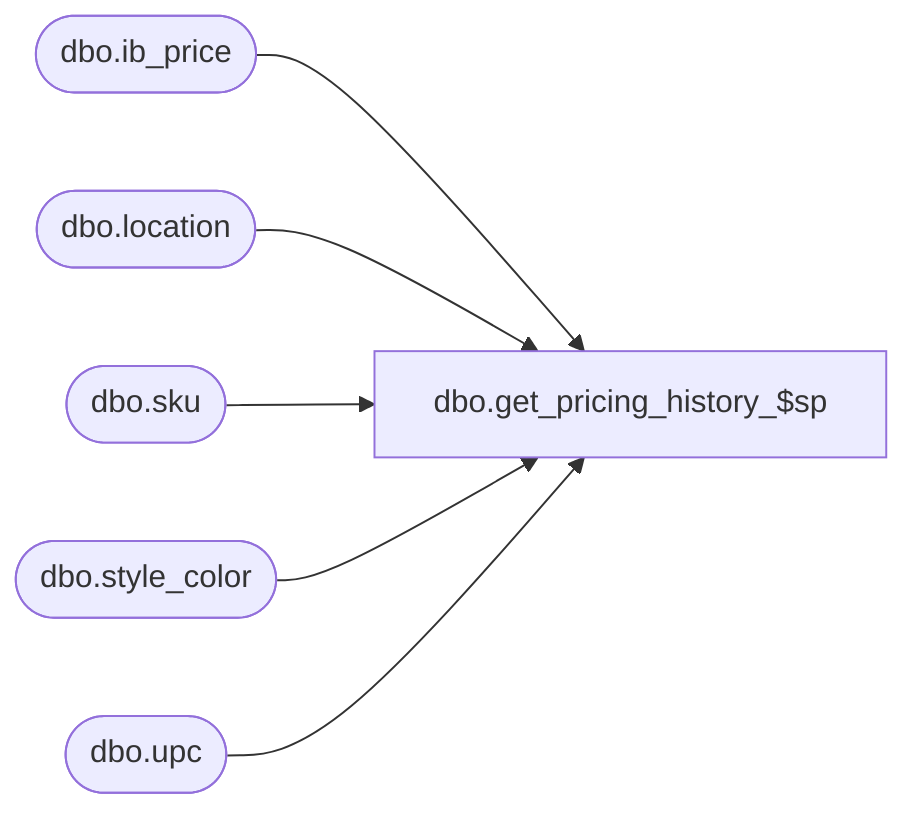

# dbo.get_pricing_history_$sp

**Database:** me_01  
**Server:** bedrockdb02  

## Architecture Diagram



## Table Dependencies

| Referenced Table |
|---|
| dbo.ib_price |
| dbo.location |
| dbo.sku |
| dbo.style_color |
| dbo.upc |

## Stored Procedure Code

```sql
-----------------------------------------------------------------------------------------------------------------------------
--	Main Query: Create Procedure
-----------------------------------------------------------------------------------------------------------------------------

CREATE PROCEDURE dbo.get_pricing_history_$sp

	 @Color_ID AS SMALLINT = NULL
	,@Date AS SMALLDATETIME
	,@Jurisdiction_ID AS SMALLINT = NULL
	,@Location_ID AS SMALLINT
	,@Style_ID AS DECIMAL (12, 0)
	,@SKU_ID AS DECIMAL (13, 0) = NULL
	,@UPC_NO AS NVARCHAR(28) = NULL
	,@SortAscending AS BIT = 1

AS

--	Object GUID: 0CB244C9-D5DB-4D67-A823-67FB4861F563
--	Pricing GUID (General): EFB5A343-8978-4ACF-952C-37862704CBC8

SET TRANSACTION ISOLATION LEVEL READ UNCOMMITTED
SET NOCOUNT ON

--get parameters that were not specified
if (@Jurisdiction_ID is null or @Jurisdiction_ID = 0) select @Jurisdiction_ID=jurisdiction_id from location where location_id=@Location_ID
if (@UPC_NO is not null AND @SKU_ID is null) select @SKU_ID= sku_id from upc where upc_number=@UPC_NO
if (@Color_ID is null or @Color_ID = 0) select @Color_ID = sc.color_id from sku inner join style_color sc on sc.style_color_id=sku.style_color_id where sku_id=@SKU_ID

SELECT
	 IBP.ib_price_id
	,IBP.[start_date]
	,IBP.end_date
	,IBP.selling_retail_price
	,IBP.price_status_id
	,IBP.temp_price_flag
	,IBP.valuation_retail_price
FROM
	dbo.ib_price IBP
WHERE
	IBP.cancel_promo_flag = 0
	AND IBP.style_id = @Style_ID
	AND IBP.jurisdiction_id = @Jurisdiction_ID
	AND IBP.[start_date] <= @Date
	AND
	(
		( -- Color Exception
			(
				IBP.color_id = @Color_ID
				OR IBP.color_id IS NULL
			)
			AND IBP.sku_id IS NULL
		)
		OR
		( -- SKU Exception
			(
				IBP.sku_id = @SKU_ID
			)
			OR
			(
				IBP.sku_id IS NULL
				AND IBP.color_id IS NULL
			)
		)
	)
	AND
	(
		IBP.location_id = @Location_ID
		OR
		(
			IBP.location_id IS NULL
			AND IBP.pricing_group_id IS NULL
		)
	)
ORDER BY
    CASE WHEN @SortAscending = 1 THEN
IBP.[start_date]    END ASC
    , CASE WHEN @SortAscending = 0 THEN
IBP.[start_date]    END DESC,

    CASE WHEN @SortAscending = 1 THEN
IBP.[end_date]    END ASC
    , CASE WHEN @SortAscending = 0 THEN
IBP.[end_date]    END DESC,

    CASE WHEN @SortAscending = 1 THEN
IBP.[ib_price_id]    END ASC
    , CASE WHEN @SortAscending = 0 THEN
IBP.[ib_price_id]    END DESC
```

