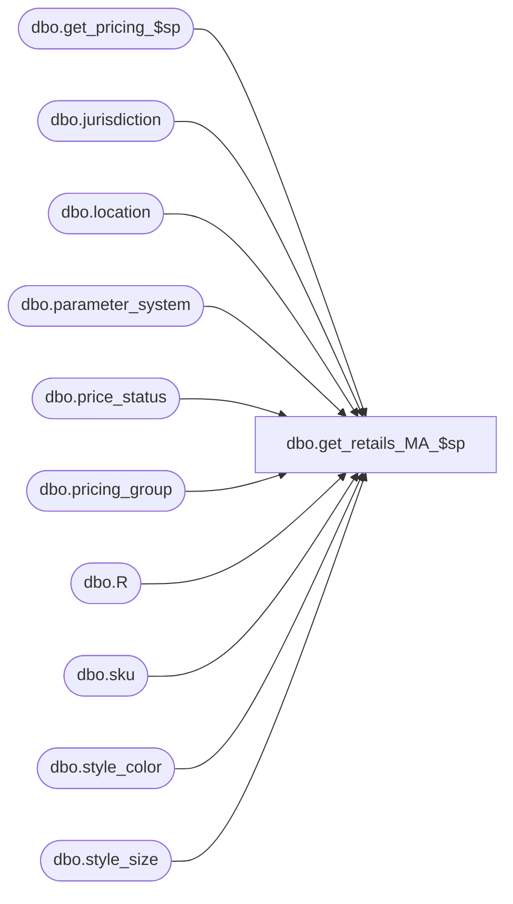

# dbo.get_retails_MA_$sp

**Database:** me_01  
**Server:** bedrockdb02  

## Architecture Diagram



## Table Dependencies

| Referenced Table |
|---|
| dbo.get_pricing_$sp |
| dbo.jurisdiction |
| dbo.location |
| dbo.parameter_system |
| dbo.price_status |
| dbo.pricing_group |
| dbo.R |
| dbo.sku |
| dbo.style_color |
| dbo.style_size |

## Stored Procedure Code

```sql
-----------------------------------------------------------------------------------------------------------------------------
--	Main Query: Create Procedure
-----------------------------------------------------------------------------------------------------------------------------

CREATE PROCEDURE dbo.get_retails_MA_$sp

	@StyleIdIndex AS Integer,@ColorIdIndex AS Integer,@SizeMasterIdIndex AS Integer
	,@JurisdictionIdIndex AS Integer,@PricingGroupIdIndex AS Integer,@LocationIdIndex AS Integer
	-- the following is retrieved by metadata from the style_retail table
	--,@StyleJurisdictionCurrentHomeRetailIndex AS Integer,@StyleJurisdictionCurrentLocalRetailIndex AS Integer--,@StyleJurisdictionCurrentPriceStatusIndex AS Integer
	,@StyleJurisdictionSellingHomeRetailIndex AS Integer,@StyleJurisdictionSellingLocalRetailIndex AS Integer,@StyleJurisdictionSellingPriceStatusIndex AS Integer
	,@StylePricingGroupCurrentHomeRetailIndex AS Integer,@StylePricingGroupCurrentLocalRetailIndex AS Integer,@StylePricingGroupCurrentPriceStatusIndex AS Integer
	,@StylePricingGroupSellingHomeRetailIndex AS Integer,@StylePricingGroupSellingLocalRetailIndex AS Integer,@StylePricingGroupSellingPriceStatusIndex AS Integer
	,@StyleLocationCurrentHomeRetailIndex AS Integer,@StyleLocationCurrentLocalRetailIndex AS Integer,@StyleLocationCurrentPriceStatusIndex AS Integer
	,@StyleLocationSellingHomeRetailIndex AS Integer,@StyleLocationSellingLocalRetailIndex AS Integer,@StyleLocationSellingPriceStatusIndex AS Integer
	,@StyleColorJurisdictionCurrentHomeRetailIndex AS Integer,@StyleColorJurisdictionCurrentLocalRetailIndex AS Integer,@StyleColorJurisdictionCurrentPriceStatusIndex AS Integer
	,@StyleColorJurisdictionSellingHomeRetailIndex AS Integer,@StyleColorJurisdictionSellingLocalRetailIndex AS Integer,@StyleColorJurisdictionSellingPriceStatusIndex AS Integer
	,@StyleColorPricingGroupCurrentHomeRetailIndex AS Integer,@StyleColorPricingGroupCurrentLocalRetailIndex AS Integer,@StyleColorPricingGroupCurrentPriceStatusIndex AS Integer
	,@StyleColorPricingGroupSellingHomeRetailIndex AS Integer,@StyleColorPricingGroupSellingLocalRetailIndex AS Integer,@StyleColorPricingGroupSellingPriceStatusIndex AS Integer
	,@StyleColorLocationCurrentHomeRetailIndex AS Integer,@StyleColorLocationCurrentLocalRetailIndex AS Integer,@StyleColorLocationCurrentPriceStatusIndex AS Integer
	,@StyleColorLocationSellingHomeRetailIndex AS Integer,@StyleColorLocationSellingLocalRetailIndex AS Integer,@StyleColorLocationSellingPriceStatusIndex AS Integer
	,@StyleColorSizeJurisdictionCurrentHomeRetailIndex AS Integer,@StyleColorSizeJurisdictionCurrentLocalRetailIndex AS Integer,@StyleColorSizeJurisdictionCurrentPriceStatusIndex AS Integer
	,@StyleColorSizeJurisdictionSellingHomeRetailIndex AS Integer,@StyleColorSizeJurisdictionSellingLocalRetailIndex AS Integer,@StyleColorSizeJurisdictionSellingPriceStatusIndex AS Integer
	-- the following are here for completeness but will not be implemented
	--,@StyleColorSizePricingGroupCurrentHomeRetailIndex AS Integer,@StyleColorSizePricingGroupCurrentLocalRetailIndex AS Integer,@StyleColorSizePricingGroupCurrentPriceStatusIndex AS Integer
	--,@StyleColorSizePricingGroupSellingHomeRetailIndex AS Integer,@StyleColorSizePricingGroupSellingLocalRetailIndex AS Integer,@StyleColorSizePricingGroupSellingPriceStatusIndex AS Integer
	,@StyleColorSizeLocationCurrentHomeRetailIndex AS Integer,@StyleColorSizeLocationCurrentLocalRetailIndex AS Integer,@StyleColorSizeLocationCurrentPriceStatusIndex AS Integer
	,@StyleColorSizeLocationSellingHomeRetailIndex AS Integer,@StyleColorSizeLocationSellingLocalRetailIndex AS Integer,@StyleColorSizeLocationSellingPriceStatusIndex AS Integer

AS

SET TRANSACTION ISOLATION LEVEL READ UNCOMMITTED
SET NOCOUNT ON

DECLARE @Date AS DATETIME
SET @Date = GETDATE()

IF OBJECT_ID (N'tempdb.dbo.#results', N'U') IS NOT NULL
BEGIN

	DROP TABLE dbo.#results

END

IF OBJECT_ID (N'tempdb.dbo.#temp_wrk_price_lookup', N'U') IS NOT NULL
BEGIN

	DROP TABLE dbo.#temp_wrk_price_lookup

END

IF OBJECT_ID (N'tempdb.dbo.#temp_price_lookup', N'U') IS NOT NULL
BEGIN

	DROP TABLE dbo.#temp_price_lookup

END

CREATE TABLE dbo.#results
	(
		row_id BIGINT
		,style_id DECIMAL(12,0),color_id SMALLINT DEFAULT(''),size_master_id INT
		,sku_id DECIMAL(13,0)
		,jurisdiction_id SMALLINT,pricing_group_id SMALLINT,location_id SMALLINT
		,style_jurisdiction_selling_retail_home DECIMAL(14,2) DEFAULT(-1.00),style_jurisdiction_selling_retail_local DECIMAL(14,2) DEFAULT(-1.00),style_jurisdiction_selling_retail_price_status NVARCHAR(3) DEFAULT('')
		,style_pricing_group_current_retail_home DECIMAL(14,2) DEFAULT(-1.00),style_pricing_group_current_retail_local DECIMAL(14,2) DEFAULT(-1.00),style_pricing_group_current_retail_price_status NVARCHAR(3) DEFAULT('')
		,style_pricing_group_selling_retail_home DECIMAL(14,2) DEFAULT(-1.00),style_pricing_group_selling_retail_local DECIMAL(14,2) DEFAULT(-1.00),style_pricing_group_selling_retail_price_status NVARCHAR(3) DEFAULT('')
		,style_location_current_retail_home DECIMAL(14,2) DEFAULT(-1.00),style_location_current_retail_local DECIMAL(14,2) DEFAULT(-1.00),style_location_current_retail_price_status NVARCHAR(3) DEFAULT('')
		,style_location_selling_retail_home DECIMAL(14,2) DEFAULT(-1.00),style_location_selling_retail_local DECIMAL(14,2) DEFAULT(-1.00),style_location_selling_retail_price_status NVARCHAR(3) DEFAULT('')
		,style_color_jurisdiction_current_retail_home DECIMAL(14,2) DEFAULT(-1.00),style_color_jurisdiction_current_retail_local DECIMAL(14,2) DEFAULT(-1.00),style_color_jurisdiction_current_retail_price_status NVARCHAR(3) DEFAULT('')
		,style_color_jurisdiction_selling_retail_home DECIMAL(14,2) DEFAULT(-1.00),style_color_jurisdiction_selling_retail_local DECIMAL(14,2) DEFAULT(-1.00),style_color_jurisdiction_selling_retail_price_status NVARCHAR(3) DEFAULT('')
		,style_color_pricing_group_current_retail_home DECIMAL(14,2) DEFAULT(-1.00),style_color_pricing_group_current_retail_local DECIMAL(14,2) DEFAULT(-1.00),style_color_pricing_group_current_retail_price_status NVARCHAR(3) DEFAULT('')
		,style_color_pricing_group_selling_retail_home DECIMAL(14,2) DEFAULT(-1.00),style_color_pricing_group_selling_retail_local DECIMAL(14,2) DEFAULT(-1.00),style_color_pricing_group_selling_retail_price_status NVARCHAR(3) DEFAULT('')
		,style_color_location_current_retail_home DECIMAL(14,2) DEFAULT(-1.00),style_color_location_current_retail_local DECIMAL(14,2) DEFAULT(-1.00),style_color_location_current_retail_price_status NVARCHAR(3) DEFAULT('')
		,style_color_location_selling_retail_home DECIMAL(14,2) DEFAULT(-1.00),style_color_location_selling_retail_local DECIMAL(14,2) DEFAULT(-1.00),style_color_location_selling_retail_price_status NVARCHAR(3) DEFAULT('')
		,sku_jurisdiction_current_retail_home DECIMAL(14,2) DEFAULT(-1.00),sku_jurisdiction_current_retail_local DECIMAL(14,2) DEFAULT(-1.00),sku_jurisdiction_current_retail_price_status NVARCHAR(3) DEFAULT('')
		,sku_jurisdiction_selling_retail_home DECIMAL(14,2) DEFAULT(-1.00),sku_jurisdiction_selling_retail_local DECIMAL(14,2) DEFAULT(-1.00),sku_jurisdiction_selling_retail_price_status NVARCHAR(3) DEFAULT('')
		,sku_location_current_retail_home DECIMAL(14,2) DEFAULT(-1.00),sku_location_current_retail_local DECIMAL(14,2) DEFAULT(-1.00),sku_location_current_retail_price_status NVARCHAR(3) DEFAULT('')
		,sku_location_selling_retail_home DECIMAL(14,2) DEFAULT(-1.00),sku_location_selling_retail_local DECIMAL(14,2) DEFAULT(-1.00),sku_location_selling_retail_price_status NVARCHAR(3) DEFAULT('')
	)

INSERT INTO dbo.#results
	(
		row_id
		,style_id
		,color_id
		,size_master_id
		,sku_id
		,jurisdiction_id
		,pricing_group_id
		,location_id
	)
SELECT
	SD.row_id
	,SD.style_id
	,SD.color_id
	,SD.size_master_id
	,SK.sku_id
	,CASE WHEN PS.multi_sales_jurisdiction_flag = 1 THEN SD.jurisdiction_id ELSE (SELECT jurisdiction_id FROM jurisdiction J WHERE J.home_jurisdiction_flag = 1) END AS jurisdiction_id
	,SD.pricing_group_id
	,SD.location_id
FROM
	dbo.#smartview_data SD
CROSS JOIN parameter_system PS
LEFT OUTER JOIN dbo.style_color SC ON SD.style_id = SC.style_id AND SD.color_id = SC.color_id
LEFT OUTER JOIN dbo.style_size SZ ON SD.style_id = SZ.style_id AND SD.size_master_id = SZ.size_master_id
LEFT OUTER JOIN dbo.sku SK ON SC.style_color_id = SK.style_color_id AND SZ.style_size_id = SK.style_size_id

CREATE TABLE dbo.#temp_wrk_price_lookup

	(
		 jurisdiction_id SMALLINT NULL
		,pricing_group_id SMALLINT NULL
		,location_id SMALLINT NULL
		,style_id DECIMAL (12, 0) NULL
		,color_id SMALLINT NULL
		,style_color_id DECIMAL (13, 0) NULL
		,sku_id DECIMAL (13, 0) NULL
	)

CREATE TABLE dbo.#temp_price_lookup

	(
		style_id DECIMAL (12, 0) NULL
		,jurisdiction_id SMALLINT NULL
		,color_id SMALLINT NULL
		,pricing_group_id SMALLINT NULL
		,location_id SMALLINT NULL
		,style_color_id DECIMAL (13, 0) NULL
		,sku_id DECIMAL (13, 0) NULL
		,valuation_retail_price DECIMAL (14, 2) NULL
		,selling_retail_price DECIMAL (14, 2) NULL
		,price_status_id SMALLINT NULL
		,[start_date] SMALLDATETIME NULL
		,end_date SMALLDATETIME NULL
		,effective_date SMALLDATETIME NULL
		,exception_level TINYINT NULL
	)

IF (@StyleJurisdictionSellingHomeRetailIndex > 0  OR @StyleJurisdictionSellingLocalRetailIndex > 0 OR @StyleJurisdictionSellingPriceStatusIndex > 0)
BEGIN

	INSERT INTO dbo.#temp_wrk_price_lookup

		(
			jurisdiction_id
			,style_id
		)

	SELECT
		R.jurisdiction_id
		,R.style_id
	FROM
		dbo.#results R

	EXECUTE dbo.get_pricing_$sp

		 @Date = @Date
		,@Exclude_NULL_Results = 1
		,@Group_ID = NULL
		,@Include_Exception_Color = 0
		,@Include_Exception_Color_Location = 0
		,@Include_Exception_Color_SKU = 0
		,@Include_Exception_Color_SKU_Location = 0
		,@Include_Exception_Location = 0
		,@Include_Exception_None = 1
		,@Output_All_Exception_Values = 0
		,@Price_Change_ID = NULL
		,@Results_To_Table = 1
		,@Temp_Price_Flag = 0
		,@Use_Start_Date = 0
		,@Sales_Posting_Mode = NULL

	UPDATE R
	SET
		R.style_jurisdiction_selling_retail_home = TPL.valuation_retail_price
		,R.style_jurisdiction_selling_retail_local = TPL.selling_retail_price
		,R.style_jurisdiction_selling_retail_price_status = PS.price_status_code
	FROM
		dbo.#results R
	INNER JOIN dbo.#temp_price_lookup TPL ON R.style_id = TPL.style_id AND R.jurisdiction_id = TPL.jurisdiction_id
	INNER JOIN dbo.price_status PS ON TPL.price_status_id = PS.price_status_id

	TRUNCATE TABLE dbo.#temp_price_lookup

	EXECUTE dbo.get_pricing_$sp

		@Date = @Date
		,@Exclude_NULL_Results = 0
		,@Group_ID = NULL
		,@Include_Exception_Color = 0
		,@Include_Exception_Color_Location = 0
		,@Include_Exception_Color_SKU = 0
		,@Include_Exception_Color_SKU_Location = 0
		,@Include_Exception_Location = 0
		,@Include_Exception_None = 1
		,@Output_All_Exception_Values = 0
		,@Price_Change_ID = NULL
		,@Results_To_Table = 1
		,@Temp_Price_Flag = 1
		,@Use_Start_Date = 0
		,@Sales_Posting_Mode = NULL

		UPDATE R
		SET
			R.style_jurisdiction_selling_retail_home = TPL.valuation_retail_price
			,R.style_jurisdiction_selling_retail_local = TPL.selling_retail_price
			,R.style_jurisdiction_selling_retail_price_status = PS.price_status_code
		FROM
			dbo.#results R
		INNER JOIN dbo.#temp_price_lookup TPL ON R.style_id = TPL.style_id AND R.jurisdiction_id = TPL.jurisdiction_id
		INNER JOIN dbo.price_status PS ON TPL.price_status_id = PS.price_status_id

END

IF (@StylePricingGroupCurrentHomeRetailIndex > 0  OR @StylePricingGroupCurrentLocalRetailIndex > 0 OR @StylePricingGroupCurrentPriceStatusIndex > 0
	OR @StylePricingGroupSellingHomeRetailIndex > 0  OR @StylePricingGroupSellingLocalRetailIndex > 0 OR @StylePricingGroupSellingPriceStatusIndex > 0)
BEGIN

	INSERT INTO dbo.#temp_wrk_price_lookup

		(
			jurisdiction_id
			,pricing_group_id
			,style_id
		)

	SELECT
		PG.jurisdiction_id
		,R.pricing_group_id
		,R.style_id
	FROM
		dbo.#results R
	INNER JOIN pricing_group PG ON R.pricing_group_id = PG.pricing_group_id

	EXECUTE dbo.get_pricing_$sp

		 @Date = @Date
		,@Exclude_NULL_Results = 1
		,@Group_ID = NULL
		,@Include_Exception_Color = 0
		,@Include_Exception_Color_Location = 0
		,@Include_Exception_Color_Pricing_Group = 0
		,@Include_Exception_Color_SKU = 0
		,@Include_Exception_Color_SKU_Location = 0
		,@Include_Exception_Location = 0
		,@Include_Exception_Pricing_Group = 1
		,@Include_Exception_None = 1
		,@Output_All_Exception_Values = 0
		,@Price_Change_ID = NULL
		,@Results_To_Table = 1
		,@Temp_Price_Flag = 0
		,@Use_Start_Date = 0
		,@Use_PG_Mode = 1

	UPDATE R
	SET
		R.style_pricing_group_current_retail_home = TPL.valuation_retail_price
		,R.style_pricing_group_current_retail_local = TPL.selling_retail_price
		,R.style_pricing_group_current_retail_price_status = PS.price_status_code
		,R.style_pricing_group_selling_retail_home = TPL.valuation_retail_price
		,R.style_pricing_group_selling_retail_local = TPL.selling_retail_price
		,R.style_pricing_group_selling_retail_price_status = PS.price_status_code
	FROM
		dbo.#results R
	INNER JOIN dbo.#temp_price_lookup TPL ON R.style_id = TPL.style_id AND R.pricing_group_id = TPL.pricing_group_id
	INNER JOIN dbo.price_status PS ON TPL.price_status_id = PS.price_status_id

	TRUNCATE TABLE dbo.#temp_price_lookup

	IF (@StylePricingGroupSellingHomeRetailIndex > 0  OR @StylePricingGroupSellingLocalRetailIndex > 0 OR @StylePricingGroupSellingPriceStatusIndex > 0)
	BEGIN

		EXECUTE dbo.get_pricing_$sp

			 @Date = @Date
			,@Exclude_NULL_Results = 1
			,@Group_ID = NULL
			,@Include_Exception_Color = 0
			,@Include_Exception_Color_Location = 0
			,@Include_Exception_Color_Pricing_Group = 0
			,@Include_Exception_Color_SKU = 0
			,@Include_Exception_Color_SKU_Location = 0
			,@Include_Exception_Location = 0
			,@Include_Exception_Pricing_Group = 1
			,@Include_Exception_None = 1
			,@Output_All_Exception_Values = 0
			,@Price_Change_ID = NULL
			,@Results_To_Table = 1
			,@Temp_Price_Flag = 1
			,@Use_Start_Date = 0
			,@Use_PG_Mode = 1

			UPDATE R
			SET
				R.style_pricing_group_selling_retail_home = TPL.valuation_retail_price
				,R.style_pricing_group_selling_retail_local = TPL.selling_retail_price
				,R.style_pricing_group_selling_retail_price_status = PS.price_status_code
			FROM
				dbo.#results R
			INNER JOIN dbo.#temp_price_lookup TPL ON R.style_id = TPL.style_id AND R.pricing_group_id = TPL.pricing_group_id
			INNER JOIN dbo.price_status PS ON TPL.price_status_id = PS.price_status_id

	END

END

IF (@StyleLocationCurrentHomeRetailIndex > 0  OR @StyleLocationCurrentLocalRetailIndex > 0 OR @StyleLocationCurrentPriceStatusIndex > 0
	OR @StyleLocationSellingHomeRetailIndex > 0  OR @StyleLocationSellingLocalRetailIndex > 0 OR @StyleLocationSellingPriceStatusIndex > 0)
BEGIN

	INSERT INTO dbo.#temp_wrk_price_lookup

		(
			jurisdiction_id
			,location_id
			,style_id
		)

	SELECT
		L.jurisdiction_id
		,R.location_id
		,R.style_id
	FROM
		dbo.#results R
	INNER JOIN location L ON R.location_id = L.location_id

	EXECUTE dbo.get_pricing_$sp

		 @Date = @Date
		,@Exclude_NULL_Results = 1
		,@Group_ID = NULL
		,@Include_Exception_Color = 0
		,@Include_Exception_Color_Location = 0
		,@Include_Exception_Color_SKU = 0
		,@Include_Exception_Color_SKU_Location = 0
		,@Include_Exception_Location = 1
		,@Include_Exception_None = 1
		,@Output_All_Exception_Values = 0
		,@Price_Change_ID = NULL
		,@Results_To_Table = 1
		,@Temp_Price_Flag = 0
		,@Use_Start_Date = 0
		,@Sales_Posting_Mode = NULL

	UPDATE R
	SET
		R.style_location_current_retail_home = TPL.valuation_retail_price
		,R.style_location_current_retail_local = TPL.selling_retail_price
		,R.style_location_current_retail_price_status = PS.price_status_code
		,R.style_location_selling_retail_home = TPL.valuation_retail_price
		,R.style_location_selling_retail_local = TPL.selling_retail_price
		,R.style_location_selling_retail_price_status = PS.price_status_code
	FROM
		dbo.#results R
	INNER JOIN dbo.#temp_price_lookup TPL ON R.style_id = TPL.style_id AND R.location_id = TPL.location_id
	INNER JOIN dbo.price_status PS ON TPL.price_status_id = PS.price_status_id

	TRUNCATE TABLE dbo.#temp_price_lookup

	IF (@StyleLocationSellingHomeRetailIndex > 0  OR @StyleLocationSellingLocalRetailIndex > 0 OR @StyleLocationSellingPriceStatusIndex > 0)
	BEGIN

		EXECUTE dbo.get_pricing_$sp

			 @Date = @Date
			,@Exclude_NULL_Results = 1
			,@Group_ID = NULL
			,@Include_Exception_Color = 0
			,@Include_Exception_Color_Location = 0
			,@Include_Exception_Color_SKU = 0
			,@Include_Exception_Color_SKU_Location = 0
			,@Include_Exception_Location = 1
			,@Include_Exception_None = 1
			,@Output_All_Exception_Values = 0
			,@Price_Change_ID = NULL
			,@Results_To_Table = 1
			,@Temp_Price_Flag = 1
			,@Use_Start_Date = 0
			,@Sales_Posting_Mode = NULL

			UPDATE R
			SET
				R.style_location_selling_retail_home = TPL.valuation_retail_price
				,R.style_location_selling_retail_local = TPL.selling_retail_price
				,R.style_location_selling_retail_price_status = PS.price_status_code
			FROM
				dbo.#results R
			INNER JOIN dbo.#temp_price_lookup TPL ON R.style_id = TPL.style_id AND R.location_id = TPL.location_id
			INNER JOIN dbo.price_status PS ON TPL.price_status_id = PS.price_status_id

	END

END

IF (@StyleColorJurisdictionCurrentHomeRetailIndex > 0  OR @StyleColorJurisdictionCurrentLocalRetailIndex > 0 OR @StyleColorJurisdictionCurrentPriceStatusIndex > 0
	OR @StyleColorJurisdictionSellingHomeRetailIndex > 0  OR @StyleColorJurisdictionSellingLocalRetailIndex > 0 OR @StyleColorJurisdictionSellingPriceStatusIndex > 0)
BEGIN

	INSERT INTO dbo.#temp_wrk_price_lookup

		(
			jurisdiction_id
			,color_id
			,style_id
		)

	SELECT
		R.jurisdiction_id
		,R.color_id
		,R.style_id
	FROM
		dbo.#results R

	EXECUTE dbo.get_pricing_$sp

		 @Date = @Date
		,@Exclude_NULL_Results = 1
		,@Group_ID = NULL
		,@Include_Exception_Color = 1
		,@Include_Exception_Color_Location = 0
		,@Include_Exception_Color_SKU = 0
		,@Include_Exception_Color_SKU_Location = 0
		,@Include_Exception_Location = 0
		,@Include_Exception_None = 1
		,@Output_All_Exception_Values = 0
		,@Price_Change_ID = NULL
		,@Results_To_Table = 1
		,@Temp_Price_Flag = 0
		,@Use_Start_Date = 0
		,@Sales_Posting_Mode = NULL

	UPDATE R
	SET
		R.style_color_jurisdiction_current_retail_home = TPL.valuation_retail_price
		,R.style_color_jurisdiction_current_retail_local = TPL.selling_retail_price
		,R.style_color_jurisdiction_current_retail_price_status = PS.price_status_code
		,R.style_color_jurisdiction_selling_retail_home = TPL.valuation_retail_price
		,R.style_color_jurisdiction_selling_retail_local = TPL.selling_retail_price
		,R.style_color_jurisdiction_selling_retail_price_status = PS.price_status_code
	FROM
		dbo.#results R
	INNER JOIN dbo.#temp_price_lookup TPL ON R.style_id = TPL.style_id AND R.color_id = TPL.color_id
	INNER JOIN dbo.price_status PS ON TPL.price_status_id = PS.price_status_id

	TRUNCATE TABLE dbo.#temp_price_lookup

	IF (@StyleColorJurisdictionSellingHomeRetailIndex > 0  OR @StyleColorJurisdictionSellingLocalRetailIndex > 0 OR @StyleColorJurisdictionSellingPriceStatusIndex > 0)
	BEGIN

		EXECUTE dbo.get_pricing_$sp

			 @Date = @Date
			,@Exclude_NULL_Results = 1
			,@Group_ID = NULL
			,@Include_Exception_Color = 1
			,@Include_Exception_Color_Location = 0
			,@Include_Exception_Color_SKU = 0
			,@Include_Exception_Color_SKU_Location = 0
			,@Include_Exception_Location = 0
			,@Include_Exception_None = 1
			,@Output_All_Exception_Values = 0
			,@Price_Change_ID = NULL
			,@Results_To_Table = 1
			,@Temp_Price_Flag = 1
			,@Use_Start_Date = 0
			,@Sales_Posting_Mode = NULL

			UPDATE R
			SET
				R.style_color_jurisdiction_selling_retail_home = TPL.valuation_retail_price
				,R.style_color_jurisdiction_selling_retail_local = TPL.selling_retail_price
				,R.style_color_jurisdiction_selling_retail_price_status = PS.price_status_code
			FROM
				dbo.#results R
			INNER JOIN dbo.#temp_price_lookup TPL ON R.style_id = TPL.style_id AND R.color_id = TPL.color_id AND R.jurisdiction_id = TPL.jurisdiction_id
			INNER JOIN dbo.price_status PS ON TPL.price_status_id = PS.price_status_id

	END

END

IF (@StyleColorPricingGroupCurrentHomeRetailIndex > 0  OR @StyleColorPricingGroupCurrentLocalRetailIndex > 0 OR @StyleColorPricingGroupCurrentPriceStatusIndex > 0
	OR @StyleColorPricingGroupSellingHomeRetailIndex > 0  OR @StyleColorPricingGroupSellingLocalRetailIndex > 0 OR @StyleColorPricingGroupSellingPriceStatusIndex > 0)
BEGIN

	INSERT INTO dbo.#temp_wrk_price_lookup

		(
			jurisdiction_id
			,pricing_group_id
			,color_id
			,style_id
		)

	SELECT
		PG.jurisdiction_id
		,R.pricing_group_id
		,R.color_id
		,R.style_id
	FROM
		dbo.#results R
	INNER JOIN pricing_group PG ON R.pricing_group_id = PG.pricing_group_id

	EXECUTE dbo.get_pricing_$sp

		 @Date = @Date
		,@Exclude_NULL_Results = 1
		,@Group_ID = NULL
		,@Include_Exception_Color = 1
		,@Include_Exception_Color_Location = 0
		,@Include_Exception_Color_Pricing_Group = 1
		,@Include_Exception_Color_SKU = 0
		,@Include_Exception_Color_SKU_Location = 0
		,@Include_Exception_Location = 0
		,@Include_Exception_Pricing_Group = 1
		,@Include_Exception_None = 1
		,@Output_All_Exception_Values = 0
		,@Price_Change_ID = NULL
		,@Results_To_Table = 1
		,@Temp_Price_Flag = 0
		,@Use_Start_Date = 0
		,@Use_PG_Mode = 1

	UPDATE R
	SET
		R.style_color_pricing_group_current_retail_home = TPL.valuation_retail_price
		,R.style_color_pricing_group_current_retail_local = TPL.selling_retail_price
		,R.style_color_pricing_group_current_retail_price_status = PS.price_status_code
		,R.style_color_pricing_group_selling_retail_home = TPL.valuation_retail_price
		,R.style_color_pricing_group_selling_retail_local = TPL.selling_retail_price
		,R.style_color_pricing_group_selling_retail_price_status = PS.price_status_code
	FROM
		dbo.#results R
	INNER JOIN dbo.#temp_price_lookup TPL ON R.style_id = TPL.style_id AND R.color_id = TPL.color_id AND R.pricing_group_id = TPL.pricing_group_id
	INNER JOIN dbo.price_status PS ON TPL.price_status_id = PS.price_status_id

	TRUNCATE TABLE dbo.#temp_price_lookup

	IF (@StyleColorPricingGroupSellingHomeRetailIndex > 0  OR @StyleColorPricingGroupSellingLocalRetailIndex > 0 OR @StyleColorPricingGroupSellingPriceStatusIndex > 0)
	BEGIN

		EXECUTE dbo.get_pricing_$sp

			 @Date = @Date
			,@Exclude_NULL_Results = 1
			,@Group_ID = NULL
			,@Include_Exception_Color = 1
			,@Include_Exception_Color_Location = 0
			,@Include_Exception_Color_Pricing_Group = 1
			,@Include_Exception_Color_SKU = 0
			,@Include_Exception_Color_SKU_Location = 0
			,@Include_Exception_Location = 0
			,@Include_Exception_Pricing_Group = 1
			,@Include_Exception_None = 1
			,@Output_All_Exception_Values = 0
			,@Price_Change_ID = NULL
			,@Results_To_Table = 1
			,@Temp_Price_Flag = 1
			,@Use_Start_Date = 0
			,@Use_PG_Mode = 1

			UPDATE R
			SET
				R.style_color_pricing_group_selling_retail_home = TPL.valuation_retail_price
				,R.style_color_pricing_group_selling_retail_local = TPL.selling_retail_price
				,R.style_color_pricing_group_selling_retail_price_status = PS.price_status_code
			FROM
				dbo.#results R
			INNER JOIN dbo.#temp_price_lookup TPL ON R.style_id = TPL.style_id AND R.color_id = TPL.color_id AND R.pricing_group_id = TPL.pricing_group_id
			INNER JOIN dbo.price_status PS ON TPL.price_status_id = PS.price_status_id

	END

END

IF (@StyleColorLocationCurrentHomeRetailIndex > 0  OR @StyleColorLocationCurrentLocalRetailIndex > 0 OR @StyleColorLocationCurrentPriceStatusIndex > 0
	OR @StyleColorLocationSellingHomeRetailIndex > 0  OR @StyleColorLocationSellingLocalRetailIndex > 0 OR @StyleColorLocationSellingPriceStatusIndex > 0)
BEGIN

	INSERT INTO dbo.#temp_wrk_price_lookup

		(
			jurisdiction_id
			,location_id
			,color_id
			,style_id
		)

	SELECT
		L.jurisdiction_id
		,R.location_id
		,R.color_id
		,R.style_id
	FROM
		dbo.#results R
	INNER JOIN location L ON R.location_id = L.location_id

	EXECUTE dbo.get_pricing_$sp

		 @Date = @Date
		,@Exclude_NULL_Results = 1
		,@Group_ID = NULL
		,@Include_Exception_Color = 1
		,@Include_Exception_Color_Location = 1
		,@Include_Exception_Color_SKU = 0
		,@Include_Exception_Color_SKU_Location = 0
		,@Include_Exception_Location = 1
		,@Include_Exception_None = 1
		,@Output_All_Exception_Values = 0
		,@Price_Change_ID = NULL
		,@Results_To_Table = 1
		,@Temp_Price_Flag = 0
		,@Use_Start_Date = 0
		,@Sales_Posting_Mode = NULL

	UPDATE R
	SET
		R.style_color_location_current_retail_home = TPL.valuation_retail_price
		,R.style_color_location_current_retail_local = TPL.selling_retail_price
		,R.style_color_location_current_retail_price_status = PS.price_status_code
		,R.style_color_location_selling_retail_home = TPL.valuation_retail_price
		,R.style_color_location_selling_retail_local = TPL.selling_retail_price
		,R.style_color_location_selling_retail_price_status = PS.price_status_code
	FROM
		dbo.#results R
	INNER JOIN dbo.#temp_price_lookup TPL ON R.style_id = TPL.style_id AND R.color_id = TPL.color_id AND R.location_id = TPL.location_id
	INNER JOIN dbo.price_status PS ON TPL.price_status_id = PS.price_status_id

	TRUNCATE TABLE dbo.#temp_price_lookup

	IF (@StyleColorLocationSellingHomeRetailIndex > 0  OR @StyleColorLocationSellingLocalRetailIndex > 0 OR @StyleColorLocationSellingPriceStatusIndex > 0)
	BEGIN

		EXECUTE dbo.get_pricing_$sp

			 @Date = @Date
			,@Exclude_NULL_Results = 1
			,@Group_ID = NULL
			,@Include_Exception_Color = 1
			,@Include_Exception_Color_Location = 1
			,@Include_Exception_Color_SKU = 0
			,@Include_Exception_Color_SKU_Location = 0
			,@Include_Exception_Location = 1
			,@Include_Exception_None = 1
			,@Output_All_Exception_Values = 0
			,@Price_Change_ID = NULL
			,@Results_To_Table = 1
			,@Temp_Price_Flag = 1
			,@Use_Start_Date = 0
			,@Sales_Posting_Mode = NULL

			UPDATE R
			SET
				R.style_color_location_selling_retail_home = TPL.valuation_retail_price
				,R.style_color_location_selling_retail_local = TPL.selling_retail_price
				,R.style_color_location_selling_retail_price_status = PS.price_status_code
			FROM
				dbo.#results R
			INNER JOIN dbo.#temp_price_lookup TPL ON R.style_id = TPL.style_id AND R.color_id = TPL.color_id AND R.location_id = TPL.location_id
			INNER JOIN dbo.price_status PS ON TPL.price_status_id = PS.price_status_id

	END

END

IF (@StyleColorSizeJurisdictionCurrentHomeRetailIndex > 0  OR @StyleColorSizeJurisdictionCurrentLocalRetailIndex > 0 OR @StyleColorSizeJurisdictionCurrentPriceStatusIndex > 0
	OR @StyleColorSizeJurisdictionSellingHomeRetailIndex > 0  OR @StyleColorSizeJurisdictionSellingLocalRetailIndex > 0 OR @StyleColorSizeJurisdictionSellingPriceStatusIndex > 0)
BEGIN

	INSERT INTO dbo.#temp_wrk_price_lookup

		(
			jurisdiction_id
			,sku_id
			,color_id
			,style_id
		)

	SELECT
		R.jurisdiction_id
		,R.sku_id
		,R.color_id
		,R.style_id
	FROM
		dbo.#results R

	EXECUTE dbo.get_pricing_$sp

		 @Date = @Date
		,@Exclude_NULL_Results = 1
		,@Group_ID = NULL
		,@Include_Exception_Color = 1
		,@Include_Exception_Color_Location = 0
		,@Include_Exception_Color_SKU = 1
		,@Include_Exception_Color_SKU_Location = 0
		,@Include_Exception_Location = 0
		,@Include_Exception_None = 1
		,@Output_All_Exception_Values = 0
		,@Price_Change_ID = NULL
		,@Results_To_Table = 1
		,@Temp_Price_Flag = 0
		,@Use_Start_Date = 0
		,@Sales_Posting_Mode = NULL

	UPDATE R
	SET
		R.sku_jurisdiction_current_retail_home = TPL.valuation_retail_price
		,R.sku_jurisdiction_current_retail_local = TPL.selling_retail_price
		,R.sku_jurisdiction_current_retail_price_status = PS.price_status_code
		,R.sku_jurisdiction_selling_retail_home = TPL.valuation_retail_price
		,R.sku_jurisdiction_selling_retail_local = TPL.selling_retail_price
		,R.sku_jurisdiction_selling_retail_price_status = PS.price_status_code
	FROM
		dbo.#results R
	INNER JOIN dbo.#temp_price_lookup TPL ON R.sku_id = TPL.sku_id AND R.jurisdiction_id = TPL.jurisdiction_id
	INNER JOIN dbo.price_status PS ON TPL.price_status_id = PS.price_status_id

	TRUNCATE TABLE dbo.#temp_price_lookup

	IF (@StyleColorSizeJurisdictionSellingHomeRetailIndex > 0  OR @StyleColorSizeJurisdictionSellingLocalRetailIndex > 0 OR @StyleColorSizeJurisdictionSellingPriceStatusIndex > 0)
	BEGIN

		EXECUTE dbo.get_pricing_$sp

			 @Date = @Date
			,@Exclude_NULL_Results = 1
			,@Group_ID = NULL
			,@Include_Exception_Color = 1
			,@Include_Exception_Color_Location = 0
			,@Include_Exception_Color_SKU = 1
			,@Include_Exception_Color_SKU_Location = 0
			,@Include_Exception_Location = 0
			,@Include_Exception_None = 1
			,@Output_All_Exception_Values = 0
			,@Price_Change_ID = NULL
			,@Results_To_Table = 1
			,@Temp_Price_Flag = 1
			,@Use_Start_Date = 0
			,@Sales_Posting_Mode = NULL

			UPDATE R
			SET
				R.sku_jurisdiction_selling_retail_home = TPL.valuation_retail_price
				,R.sku_jurisdiction_selling_retail_local = TPL.selling_retail_price
				,R.sku_jurisdiction_selling_retail_price_status = PS.price_status_code
			FROM
				dbo.#results R
			INNER JOIN dbo.#temp_price_lookup TPL ON R.sku_id = TPL.sku_id AND R.jurisdiction_id = TPL.jurisdiction_id
			INNER JOIN dbo.price_status PS ON TPL.price_status_id = PS.price_status_id

	END

END

IF (@StyleColorSizeLocationCurrentHomeRetailIndex > 0  OR @StyleColorSizeLocationCurrentLocalRetailIndex > 0 OR @StyleColorSizeLocationCurrentPriceStatusIndex > 0
	OR @StyleColorSizeLocationSellingHomeRetailIndex > 0  OR @StyleColorSizeLocationSellingLocalRetailIndex > 0 OR @StyleColorSizeLocationSellingPriceStatusIndex > 0)
BEGIN

	INSERT INTO dbo.#temp_wrk_price_lookup

		(
			jurisdiction_id
			,location_id
			,sku_id
			,color_id
			,style_id
		)

	SELECT
		L.jurisdiction_id
		,R.location_id
		,R.sku_id
		,R.color_id
		,R.style_id
	FROM
		dbo.#results R
	INNER JOIN location L ON R.location_id = L.location_id

	EXECUTE dbo.get_pricing_$sp

		 @Date = @Date
		,@Exclude_NULL_Results = 1
		,@Group_ID = NULL
		,@Include_Exception_Color = 1
		,@Include_Exception_Color_Location = 1
		,@Include_Exception_Color_SKU = 1
		,@Include_Exception_Color_SKU_Location = 1
		,@Include_Exception_Location = 1
		,@Include_Exception_None = 1
		,@Output_All_Exception_Values = 0
		,@Price_Change_ID = NULL
		,@Results_To_Table = 1
		,@Temp_Price_Flag = 0
		,@Use_Start_Date = 0
		,@Sales_Posting_Mode = NULL

	UPDATE R
	SET
		R.sku_location_current_retail_home = TPL.valuation_retail_price
		,R.sku_location_current_retail_local = TPL.selling_retail_price
		,R.sku_location_current_retail_price_status = PS.price_status_code
		,R.sku_location_selling_retail_home = TPL.valuation_retail_price
		,R.sku_location_selling_retail_local = TPL.selling_retail_price
		,R.sku_location_selling_retail_price_status = PS.price_status_code
	FROM
		dbo.#results R
	INNER JOIN dbo.#temp_price_lookup TPL ON R.sku_id = TPL.sku_id AND R.location_id = TPL.location_id
	INNER JOIN dbo.price_status PS ON TPL.price_status_id = PS.price_status_id

	TRUNCATE TABLE dbo.#temp_price_lookup

	IF (@StyleColorSizeLocationSellingHomeRetailIndex > 0  OR @StyleColorSizeLocationSellingLocalRetailIndex > 0 OR @StyleColorSizeLocationSellingPriceStatusIndex > 0)
	BEGIN

		EXECUTE dbo.get_pricing_$sp

			 @Date = @Date
			,@Exclude_NULL_Results = 1
			,@Group_ID = NULL
			,@Include_Exception_Color = 1
			,@Include_Exception_Color_Location = 1
			,@Include_Exception_Color_SKU = 1
			,@Include_Exception_Color_SKU_Location = 1
			,@Include_Exception_Location = 1
			,@Include_Exception_None = 1
			,@Output_All_Exception_Values = 0
			,@Price_Change_ID = NULL
			,@Results_To_Table = 1
			,@Temp_Price_Flag = 1
			,@Use_Start_Date = 0
			,@Sales_Posting_Mode = NULL

			UPDATE R
			SET
				R.sku_location_selling_retail_home = TPL.valuation_retail_price
				,R.sku_location_selling_retail_local = TPL.selling_retail_price
				,R.sku_location_selling_retail_price_status = PS.price_status_code
			FROM
				dbo.#results R
			INNER JOIN dbo.#temp_price_lookup TPL ON R.sku_id = TPL.sku_id AND R.location_id = TPL.location_id
			INNER JOIN dbo.price_status PS ON TPL.price_status_id = PS.price_status_id

	END

END

SELECT * FROM dbo.#results ORDER BY row_id
```

