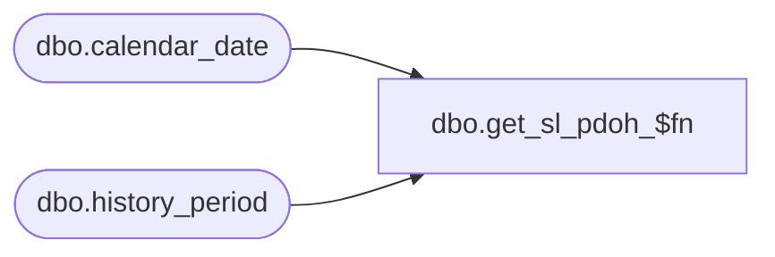

# dbo.get_sl_pdoh_$fn

**Database:** me_01  
**Server:** bedrockdb02  

## Architecture Diagram



## Table Dependencies

| Referenced Table |
|---|
| dbo.calendar_date |
| dbo.history_period |

## Stored Procedure Code

```sql
create proc dbo.get_sl_pdoh_$fn 
 @no_pds int, @no_yrs int
AS
Declare @period_code int
declare @hist_period_id decimal (12,0)
declare @i int

-- get current period
SELECT @period_code = merch_year *100 +  merch_period
FROM calendar_date
WHERE CONVERT(SMALLDATETIME,CONVERT(CHAR(12),GETDATE(),109)) = calendar_date

select @i = 1

while @i <= @no_pds
begin
	SELECT @period_code = max (merch_year *100 +  merch_period)
	FROM calendar_date
	where (merch_year *100 +  merch_period)< @period_code
	select @i = @i + 1
end

select @period_code = @period_code - (@no_yrs * 100)

select @hist_period_id = history_period_id
from history_period 
where end_date = (select max (calendar_date)
		  from calendar_date
                  where merch_year * 100 + merch_period = @period_code )


return isnull( @hist_period_id,0);
```

