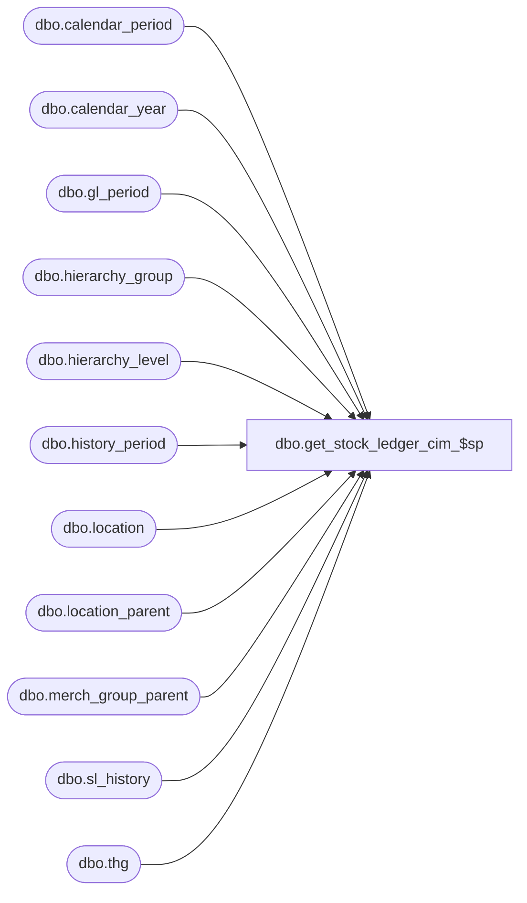

# dbo.get_stock_ledger_cim_$sp

**Database:** me_01  
**Server:** bedrockdb02  

## Architecture Diagram



## Table Dependencies

| Referenced Table |
|---|
| dbo.calendar_period |
| dbo.calendar_year |
| dbo.gl_period |
| dbo.hierarchy_group |
| dbo.hierarchy_level |
| dbo.history_period |
| dbo.location |
| dbo.location_parent |
| dbo.merch_group_parent |
| dbo.sl_history |
| dbo.thg |

## Stored Procedure Code

```sql
CREATE PROCEDURE [dbo].[get_stock_ledger_cim_$sp] 
	(@detail_level_id int,
	 @1st_sum_level_id int,
	 @2nd_sum_level_id int,
	 @sl_period_type tinyint,
	 @gl_period_code nvarchar(20),
	 @merch_year_period nvarchar(6),
	 @report_currency tinyint)
AS

BEGIN

DECLARE 
   @hist_period_id_eoly decimal(12, 0),
   @hist_period_id_boy decimal(12, 0),
   @hist_period_id_eolp decimal(12, 0),
   @hist_period_id_bop decimal(12, 0),
   @hist_period_id_eop decimal(12, 0)

IF @sl_period_type = 0 -- @sl_period_type = GL period
BEGIN
   -- @hist_period_id_bop: beginning of current period (used for non on hand)   
   -- @hist_period_id_eop: end of current period
   SELECT @hist_period_id_bop = MIN(hp.history_period_id), @hist_period_id_eop = MAX(hp.history_period_id)
   FROM gl_period gp WITH (NOLOCK)
   INNER JOIN history_period hp WITH (NOLOCK)
      ON gp.gl_period_id = hp.gl_period_id
      AND gp.gl_period_code = @gl_period_code
      AND hp.start_date <= GETDATE()

   -- @hist_period_id_eolp: end of last period (used for on hand)
   SELECT @hist_period_id_eolp = MAX(hp.history_period_id)
   FROM history_period hp
   WHERE hp.history_period_id < @hist_period_id_bop

   -- @hist_period_id_boy: beginning of current year (used for non on hand)
   SELECT @hist_period_id_boy = MIN(hp.history_period_id)
   FROM gl_period gp WITH (NOLOCK)
   INNER JOIN history_period hp WITH (NOLOCK)
      ON gp.gl_period_id = hp.gl_period_id
      AND FLOOR(gp.gl_period_code/100) = FLOOR(@gl_period_code/100)

   -- @hist_period_id_eoly: end of last year (used for on hand)
   SELECT @hist_period_id_eoly = MAX(hp.history_period_id)
   FROM history_period hp
   WHERE hp.history_period_id < @hist_period_id_boy

   IF @hist_period_id_eoly is NULL
   BEGIN
      set @hist_period_id_eoly = @hist_period_id_boy
   END
END
ELSE
BEGIN  -- @sl_period_type = merch period
   -- @hist_period_id_bop: beginning of current period (used for non on hand)   
   -- @hist_period_id_eop: end of current period
   SELECT @hist_period_id_bop = MIN(hp.history_period_id), @hist_period_id_eop = MAX(hp.history_period_id)
   FROM calendar_period cp WITH (NOLOCK)
   INNER JOIN calendar_year cy WITH (NOLOCK)
      ON cp.calendar_year_id = cy.calendar_year_id
      AND cy.calendar_year_code * 100 + cp.calendar_period_code = CONVERT(int, @merch_year_period)
   INNER JOIN history_period hp WITH (NOLOCK)
      ON cp.calendar_period_id = hp.calendar_period_id
      AND hp.start_date <= GETDATE()

   -- @hist_period_id_eolp: end of last period (used for on hand)
   SELECT @hist_period_id_eolp = MAX(hp.history_period_id)
   FROM history_period hp
   WHERE hp.history_period_id < @hist_period_id_bop

   -- @hist_period_id_boy: beginning of current year (used for non on hand)
   SELECT @hist_period_id_boy = MIN(hp.history_period_id)
   FROM calendar_period cp WITH (NOLOCK)
   INNER JOIN calendar_year cy WITH (NOLOCK)
      ON cp.calendar_year_id = cy.calendar_year_id
      AND cy.calendar_year_code = FLOOR(@merch_year_period/100)
   INNER JOIN history_period hp WITH (NOLOCK)
      ON cp.calendar_period_id = hp.calendar_period_id
 
   -- @hist_period_id_eoly: end of last year (used for on hand)
   SELECT @hist_period_id_eoly = MAX(hp.history_period_id)
   FROM history_period hp
   WHERE hp.history_period_id < @hist_period_id_boy

   IF @hist_period_id_eoly is NULL
   BEGIN
      set @hist_period_id_eoly = @hist_period_id_boy
   END
END

IF NOT object_id(N'tempdb..#temp_hg_loc') IS NULL
   DROP TABLE #temp_hg_loc
BEGIN
   CREATE TABLE #temp_hg_loc(
      hierarchy_group_id int not null,
      location_id smallint not null,
      detail_level_id int null,
      detail_code nvarchar(20),
      detail_label nvarchar(120),
      detail_level_label nvarchar(60),
      first_sum_level_id int null,
      first_sum_code nvarchar(20),
      first_sum_label nvarchar(120),
      first_sum_level_label nvarchar(60),
      second_sum_level_id int null,
      second_sum_code nvarchar(20),
      second_sum_label nvarchar(120),
      second_sum_level_label nvarchar(60)
   )
END

INSERT INTO #temp_hg_loc
   (hierarchy_group_id, location_id)
SELECT DISTINCT lst.hierarchy_group_id, lst.location_id
FROM sl_history sl WITH (NOLOCK)
INNER JOIN #temp_hg_loc_list lst
   ON sl.merch_hierarchy_group_id = lst.hierarchy_group_id
   AND sl.history_period_id BETWEEN @hist_period_id_eoly AND @hist_period_id_eop

-- detail level is a merch hierchy level
UPDATE thg
SET detail_level_id = hg.hierarchy_level_id,
    detail_code = hg.hierarchy_group_code,
    detail_label = hg.hierarchy_group_label,
    detail_level_label = hl.hierarchy_level_label
FROM #temp_hg_loc thg
INNER JOIN merch_group_parent mgp WITH (NOLOCK)
   ON  thg.hierarchy_group_id = mgp.hierarchy_group_id
INNER JOIN hierarchy_level hl WITH (NOLOCK)
   ON mgp.hierarchy_level_id = hl.hierarchy_level_id
   AND mgp.hierarchy_level_id = @detail_level_id
   AND hl.hierarchy_level_id = @detail_level_id
   AND hl.hierarchy_id = 1
INNER JOIN hierarchy_group hg WITH (NOLOCK)
   ON mgp.hierarchy_level_id = hg.hierarchy_level_id
   AND hl.hierarchy_level_id = hg.hierarchy_level_id
   AND hg.hierarchy_level_id = @detail_level_id
   AND mgp.parent_hierarchy_group_id = hg.hierarchy_group_id

-- detail level is a location hierchy level
UPDATE thg
SET detail_level_id = hg.hierarchy_level_id,
    detail_code = hg.hierarchy_group_code,
    detail_label = hg.hierarchy_group_label,
    detail_level_label = hl.hierarchy_level_label
FROM #temp_hg_loc thg
INNER JOIN hierarchy_level hl WITH (NOLOCK)
   ON hl.hierarchy_level_id = @detail_level_id
   AND hl.hierarchy_id = 2
LEFT OUTER JOIN location_parent lp WITH (NOLOCK)
   ON  thg.location_id = lp.location_id
   AND lp.hierarchy_level_id = hl.hierarchy_level_id
   AND lp.hierarchy_level_id = @detail_level_id
LEFT OUTER JOIN hierarchy_group hg WITH (NOLOCK)
   ON lp.hierarchy_level_id = hg.hierarchy_level_id
   AND hl.hierarchy_level_id = hg.hierarchy_level_id
   AND hg.hierarchy_level_id = @detail_level_id
   AND lp.parent_hierarchy_group_id = hg.hierarchy_group_id

-- detail level is location 
UPDATE thg
SET detail_code = l.location_code,
    detail_label = l.location_name
FROM #temp_hg_loc thg
INNER JOIN location l WITH (NOLOCK)
   ON  thg.location_id = l.location_id
   AND @detail_level_id = 0

-- first summary total level is a merch hierchy level
UPDATE thg
SET thg.first_sum_level_id = hg.hierarchy_level_id,
    thg.first_sum_code = hg.hierarchy_group_code,
    thg.first_sum_label = hg.hierarchy_group_label,
    thg.first_sum_level_label = hl.hierarchy_level_label
FROM #temp_hg_loc thg
INNER JOIN merch_group_parent mgp WITH (NOLOCK)
   ON  thg.hierarchy_group_id = mgp.hierarchy_group_id
INNER JOIN hierarchy_level hl WITH (NOLOCK)
   ON mgp.hierarchy_level_id = hl.hierarchy_level_id
   AND mgp.hierarchy_level_id = @1st_sum_level_id
   AND hl.hierarchy_level_id = @1st_sum_level_id
   AND hl.hierarchy_id = 1
INNER JOIN hierarchy_group hg WITH (NOLOCK)
   ON mgp.hierarchy_level_id = hg.hierarchy_level_id
   AND hl.hierarchy_level_id = hg.hierarchy_level_id
   AND hg.hierarchy_level_id = @1st_sum_level_id
   AND mgp.parent_hierarchy_group_id = hg.hierarchy_group_id

-- first summary total level is a location hierarchy level
UPDATE thg
SET thg.first_sum_level_id = hg.hierarchy_level_id,
    thg.first_sum_code = hg.hierarchy_group_code,
    thg.first_sum_label = hg.hierarchy_group_label,
    thg.first_sum_level_label = hl.hierarchy_level_label
FROM #temp_hg_loc thg
INNER JOIN hierarchy_level hl WITH (NOLOCK)
   ON hl.hierarchy_level_id = @1st_sum_level_id
   AND hl.hierarchy_id = 2
LEFT OUTER JOIN location_parent lp WITH (NOLOCK)
   ON  thg.location_id = lp.location_id
   AND lp.hierarchy_level_id = hl.hierarchy_level_id
   AND lp.hierarchy_level_id = @1st_sum_level_id
LEFT OUTER JOIN hierarchy_group hg WITH (NOLOCK)
   ON lp.hierarchy_level_id = hg.hierarchy_level_id
   AND hl.hierarchy_level_id = hg.hierarchy_level_id
   AND hg.hierarchy_level_id = @1st_sum_level_id
   AND lp.parent_hierarchy_group_id = hg.hierarchy_group_id

-- first summary total level is a location hierarchy level
UPDATE thg
SET first_sum_code = l.location_code,
    first_sum_label = l.location_name
FROM #temp_hg_loc thg
INNER JOIN location l WITH (NOLOCK)
   ON thg.location_id = l.location_id
   AND @1st_sum_level_id = 0

-- second summary total level is a merch hierchy level
UPDATE thg
SET thg.second_sum_level_id = hg.hierarchy_level_id,
    thg.second_sum_code = hg.hierarchy_group_code,
    thg.second_sum_label = hg.hierarchy_group_label,
    thg.second_sum_level_label = hl.hierarchy_level_label
FROM #temp_hg_loc thg
INNER JOIN merch_group_parent mgp WITH (NOLOCK)
   ON  thg.hierarchy_group_id = mgp.hierarchy_group_id
INNER JOIN hierarchy_level hl WITH (NOLOCK)
   ON mgp.hierarchy_level_id = hl.hierarchy_level_id
   AND mgp.hierarchy_level_id = @2nd_sum_level_id
   AND hl.hierarchy_level_id = @2nd_sum_level_id
   AND hl.hierarchy_id = 1
INNER JOIN hierarchy_group hg WITH (NOLOCK)
   ON mgp.hierarchy_level_id = hg.hierarchy_level_id
   AND hl.hierarchy_level_id = hg.hierarchy_level_id
   AND hg.hierarchy_level_id = @2nd_sum_level_id
   AND mgp.parent_hierarchy_group_id = hg.hierarchy_group_id

-- second summary total level is a location hierarchy level
UPDATE thg
SET thg.second_sum_level_id = hg.hierarchy_level_id,
    thg.second_sum_code = hg.hierarchy_group_code,
    thg.second_sum_label = hg.hierarchy_group_label,
    thg.second_sum_level_label = hl.hierarchy_level_label
FROM #temp_hg_loc thg
INNER JOIN hierarchy_level hl WITH (NOLOCK)
   ON hl.hierarchy_level_id = @2nd_sum_level_id
   AND hl.hierarchy_id = 2
LEFT OUTER JOIN location_parent lp WITH (NOLOCK)
   ON  thg.location_id = lp.location_id
   AND lp.hierarchy_level_id = hl.hierarchy_level_id
   AND lp.hierarchy_level_id = @2nd_sum_level_id
LEFT OUTER JOIN hierarchy_group hg WITH (NOLOCK)
   ON lp.hierarchy_level_id = hg.hierarchy_level_id
   AND hl.hierarchy_level_id = hg.hierarchy_level_id
   AND hg.hierarchy_level_id = @2nd_sum_level_id
   AND lp.parent_hierarchy_group_id = hg.hierarchy_group_id

-- second summary total level is a location hierarchy level
UPDATE thg
SET second_sum_code = l.location_code,
    second_sum_label = l.location_name
FROM #temp_hg_loc thg
INNER JOIN location l WITH (NOLOCK)
   ON thg.location_id = l.location_id
   AND @2nd_sum_level_id = 0
  
SELECT hgl.detail_code, hgl.detail_label, 
   SUM(CASE @report_currency WHEN 0 THEN sh.history_value ELSE sh.history_value_local END * (1-abs(sign(sh.sl_component_id - 14))) * (1 - abs (sign (sh.history_period_id - @hist_period_id_eolp )))) as beg_inv_ret_pd,
   SUM(CASE @report_currency WHEN 0 THEN sh.history_value ELSE sh.history_value_local END * (1-abs(sign(sh.sl_component_id - 14))) * (1 - abs (sign (sh.history_period_id - @hist_period_id_eoly )))) as beg_inv_ret_yr,
   SUM(CASE @report_currency WHEN 0 THEN sh.history_value ELSE sh.history_value_local END * (1-abs(sign(sh.sl_component_id - 4 ))) * (1 - abs (sign (sh.history_period_id - @hist_period_id_eolp )))) as beg_inv_cost_pd,
   SUM(CASE @report_currency WHEN 0 THEN sh.history_value ELSE sh.history_value_local END * (1-abs(sign(sh.sl_component_id - 4 ))) * (1 - abs (sign (sh.history_period_id - @hist_period_id_eoly )))) as beg_inv_cost_yr,
   SUM(CASE @report_currency WHEN 0 THEN sh.history_value ELSE sh.history_value_local END * (1-abs(sign(sh.sl_component_id - 18))) * (sign (1 + sign (sh.history_period_id- @hist_period_id_bop ))) *  (sign (1 - sign  (sh.history_period_id -@hist_period_id_eop)))) as purchases_ret_pd,
   SUM(CASE @report_currency WHEN 0 THEN sh.history_value ELSE sh.history_value_local END * (1-abs(sign(sh.sl_component_id - 18))) * (sign (1 + sign (sh.history_period_id -@hist_period_id_boy   ))) *  (sign (1 - sign  (sh.history_period_id -@hist_period_id_eop)))) as purchases_ret_yr,
   SUM(CASE @report_currency WHEN 0 THEN sh.history_value ELSE sh.history_value_local END * (1-abs(sign(sh.sl_component_id - 17))) * (sign (1 + sign (sh.history_period_id - @hist_period_id_bop))) *  (sign (1 - sign  (sh.history_period_id -@hist_period_id_eop)))) as purchases_cost_pd,
   SUM(CASE @report_currency WHEN 0 THEN sh.history_value ELSE sh.history_value_local END * (1-abs(sign(sh.sl_component_id - 17))) * (sign (1 + sign (sh.history_period_id -@hist_period_id_boy   ))) *  (sign (1 - sign  (sh.history_period_id -@hist_period_id_eop)))) as purchases_cost_yr,
   SUM(CASE @report_currency WHEN 0 THEN sh.history_value ELSE sh.history_value_local END * (1-abs(sign(sh.sl_component_id - 8 ))) * (sign (1 + sign (sh.history_period_id - @hist_period_id_bop))) *  (sign (1 - sign  (sh.history_period_id -@hist_period_id_eop)))) as distro_ret_pd,
   SUM(CASE @report_currency WHEN 0 THEN sh.history_value ELSE sh.history_value_local END * (1-abs(sign(sh.sl_component_id - 8 ))) * (sign (1 + sign (sh.history_period_id -@hist_period_id_boy   ))) *  (sign (1 - sign  (sh.history_period_id -@hist_period_id_eop)))) as distro_ret_yr,
   SUM(CASE @report_currency WHEN 0 THEN sh.history_value ELSE sh.history_value_local END * (1-abs(sign(sh.sl_component_id - 7 ))) * (sign (1 + sign (sh.history_period_id - @hist_period_id_bop))) *  (sign (1 - sign  (sh.history_period_id -@hist_period_id_eop)))) as distro_cost_pd,
   SUM(CASE @report_currency WHEN 0 THEN sh.history_value ELSE sh.history_value_local END * (1-abs(sign(sh.sl_component_id - 7 ))) * (sign (1 + sign (sh.history_period_id -@hist_period_id_boy   ))) *  (sign (1 - sign  (sh.history_period_id -@hist_period_id_eop)))) as distro_cost_yr,
   SUM(CASE @report_currency WHEN 0 THEN sh.history_value ELSE sh.history_value_local END * (1-abs(sign(sh.sl_component_id - 21))) * (sign (1 + sign (sh.history_period_id - @hist_period_id_bop))) *  (sign (1 - sign  (sh.history_period_id -@hist_period_id_eop)))) as xfer_retail_pd,
   SUM(CASE @report_currency WHEN 0 THEN sh.history_value ELSE sh.history_value_local END * (1-abs(sign(sh.sl_component_id - 21))) * (sign (1 + sign (sh.history_period_id -@hist_period_id_boy   ))) *  (sign (1 - sign  (sh.history_period_id -@hist_period_id_eop)))) as xfer_retail_yr,
   SUM(CASE @report_currency WHEN 0 THEN sh.history_value ELSE sh.history_value_local END * (1-abs(sign(sh.sl_component_id - 20))) * (sign (1 + sign (sh.history_period_id - @hist_period_id_bop))) *  (sign (1 - sign  (sh.history_period_id -@hist_period_id_eop)))) as xfer_cost_pd,
   SUM(CASE @report_currency WHEN 0 THEN sh.history_value ELSE sh.history_value_local END * (1-abs(sign(sh.sl_component_id - 20))) * (sign (1 + sign (sh.history_period_id -@hist_period_id_boy   ))) *  (sign (1 - sign  (sh.history_period_id -@hist_period_id_eop)))) as xfer_cost_yr,
   SUM(CASE @report_currency WHEN 0 THEN sh.history_value ELSE sh.history_value_local END * (1-abs(sign(sh.sl_component_id - 13))) * (sign (1 + sign (sh.history_period_id - @hist_period_id_bop))) *  (sign (1 - sign  (sh.history_period_id -@hist_period_id_eop)))) as markups_pd,
   SUM(CASE @report_currency WHEN 0 THEN sh.history_value ELSE sh.history_value_local END * (1-abs(sign(sh.sl_component_id - 13))) * (sign (1 + sign (sh.history_period_id -@hist_period_id_boy   ))) *  (sign (1 - sign  (sh.history_period_id -@hist_period_id_eop)))) as markups_yr,
   SUM(CASE @report_currency WHEN 0 THEN sh.history_value ELSE sh.history_value_local END * (1-abs(sign(sh.sl_component_id - 10))) * (sign (1 + sign (sh.history_period_id - @hist_period_id_bop))) *  (sign (1 - sign  (sh.history_period_id -@hist_period_id_eop)))) as freights_pd,
   SUM(CASE @report_currency WHEN 0 THEN sh.history_value ELSE sh.history_value_local END * (1-abs(sign(sh.sl_component_id - 10))) * (sign (1 + sign (sh.history_period_id -@hist_period_id_boy   ))) *  (sign (1 - sign  (sh.history_period_id -@hist_period_id_eop)))) as freights_yr,
   SUM(CASE @report_currency WHEN 0 THEN sh.history_value ELSE sh.history_value_local END * (1-abs(sign(sh.sl_component_id - 19))) * (sign (1 + sign (sh.history_period_id - @hist_period_id_bop))) *  (sign (1 - sign  (sh.history_period_id -@hist_period_id_eop)))) as sales_ret_pd,
   SUM(CASE @report_currency WHEN 0 THEN sh.history_value ELSE sh.history_value_local END * (1-abs(sign(sh.sl_component_id - 19))) * (sign (1 + sign (sh.history_period_id -@hist_period_id_boy   ))) *  (sign (1 - sign  (sh.history_period_id -@hist_period_id_eop)))) as sales_ret_yr,
   SUM(CASE @report_currency WHEN 0 THEN sh.history_value ELSE sh.history_value_local END * (1-abs(sign(sh.sl_component_id - 6 ))) * (sign (1 + sign (sh.history_period_id - @hist_period_id_bop))) *  (sign (1 - sign  (sh.history_period_id -@hist_period_id_eop)))) as sales_cost_pd,
   SUM(CASE @report_currency WHEN 0 THEN sh.history_value ELSE sh.history_value_local END * (1-abs(sign(sh.sl_component_id - 6 ))) * (sign (1 + sign (sh.history_period_id -@hist_period_id_boy   ))) *  (sign (1 - sign  (sh.history_period_id -@hist_period_id_eop)))) as sales_cost_yr,
   SUM(CASE @report_currency WHEN 0 THEN sh.history_value ELSE sh.history_value_local END * (1-abs(sign(sh.sl_component_id - 12))) * (sign (1 + sign (sh.history_period_id - @hist_period_id_bop))) *  (sign (1 - sign  (sh.history_period_id -@hist_period_id_eop)))) as md_ret_pd,
   SUM(CASE @report_currency WHEN 0 THEN sh.history_value ELSE sh.history_value_local END * (1-abs(sign(sh.sl_component_id - 12))) * (sign (1 + sign (sh.history_period_id -@hist_period_id_boy   ))) *  (sign (1 - sign  (sh.history_period_id -@hist_period_id_eop)))) as md_retail_yr,
   SUM(CASE @report_currency WHEN 0 THEN sh.history_value ELSE sh.history_value_local END * (1-abs(sign(sh.sl_component_id - 16))) * (sign (1 + sign (sh.history_period_id - @hist_period_id_bop))) *  (sign (1 - sign  (sh.history_period_id -@hist_period_id_eop)))) as pos_disc_ret_pd,
   SUM(CASE @report_currency WHEN 0 THEN sh.history_value ELSE sh.history_value_local END * (1-abs(sign(sh.sl_component_id - 16))) * (sign (1 + sign (sh.history_period_id -@hist_period_id_boy   ))) *  (sign (1 - sign  (sh.history_period_id -@hist_period_id_eop)))) as pos_disc_ret_yr,
   SUM(CASE @report_currency WHEN 0 THEN sh.history_value ELSE sh.history_value_local END * (1-abs(sign(sh.sl_component_id - 9 ))) * (sign (1 + sign (sh.history_period_id - @hist_period_id_bop))) *  (sign (1 - sign  (sh.history_period_id -@hist_period_id_eop)))) as emp_disc_ret_pd,
   SUM(CASE @report_currency WHEN 0 THEN sh.history_value ELSE sh.history_value_local END * (1-abs(sign(sh.sl_component_id - 9 ))) * (sign (1 + sign (sh.history_period_id -@hist_period_id_boy   ))) *  (sign (1 - sign  (sh.history_period_id -@hist_period_id_eop)))) as emp_disc_ret_yr,
   SUM(CASE @report_currency WHEN 0 THEN sh.history_value ELSE sh.history_value_local END * (1-abs(sign(sh.sl_component_id - 1 ))) * (sign (1 + sign (sh.history_period_id - @hist_period_id_bop))) *  (sign (1 - sign  (sh.history_period_id -@hist_period_id_eop)))) as shrink_ret_pd,
   SUM(CASE @report_currency WHEN 0 THEN sh.history_value ELSE sh.history_value_local END * (1-abs(sign(sh.sl_component_id - 1 ))) * (sign (1 + sign (sh.history_period_id -@hist_period_id_boy   ))) *  (sign (1 - sign  (sh.history_period_id -@hist_period_id_eop)))) as shrink_ret_yr,
   SUM(CASE @report_currency WHEN 0 THEN sh.history_value ELSE sh.history_value_local END * (1-abs(sign(sh.sl_component_id - 2 ))) * (sign (1 + sign (sh.history_period_id - @hist_period_id_bop))) *  (sign (1 - sign  (sh.history_period_id -@hist_period_id_eop)))) as shrink_cost_pd,
   SUM(CASE @report_currency WHEN 0 THEN sh.history_value ELSE sh.history_value_local END * (1-abs(sign(sh.sl_component_id - 2 ))) * (sign (1 + sign (sh.history_period_id -@hist_period_id_boy   ))) *  (sign (1 - sign  (sh.history_period_id -@hist_period_id_eop)))) as shrink_cost_yr,
   SUM(CASE @report_currency WHEN 0 THEN sh.history_value ELSE sh.history_value_local END * (1-abs(sign(sh.sl_component_id - 31))) * (sign (1 + sign (sh.history_period_id - @hist_period_id_bop))) *  (sign (1 - sign  (sh.history_period_id -@hist_period_id_eop)))) as exchange_diff_pd,
   SUM(CASE @report_currency WHEN 0 THEN sh.history_value ELSE sh.history_value_local END * (1-abs(sign(sh.sl_component_id - 31))) * (sign (1 + sign (sh.history_period_id -@hist_period_id_boy   ))) *  (sign (1 - sign  (sh.history_period_id -@hist_period_id_eop)))) as exchange_diff_yr,
   SUM(CASE @report_currency WHEN 0 THEN sh.history_value ELSE sh.history_value_local END * (1-abs(sign(sh.sl_component_id - 15))) * (sign (1 + sign (sh.history_period_id - @hist_period_id_bop))) *  (sign (1 - sign  (sh.history_period_id -@hist_period_id_eop)))) as other_reduct_ret_pd,
   SUM(CASE @report_currency WHEN 0 THEN sh.history_value ELSE sh.history_value_local END * (1-abs(sign(sh.sl_component_id - 15))) * (sign (1 + sign (sh.history_period_id -@hist_period_id_boy   ))) *  (sign (1 - sign  (sh.history_period_id -@hist_period_id_eop)))) as other_reduct_ret_yr,
   SUM(CASE @report_currency WHEN 0 THEN sh.history_value ELSE sh.history_value_local END * (1-abs(sign(sh.sl_component_id - 5 ))) * (sign (1 + sign (sh.history_period_id - @hist_period_id_bop))) *  (sign (1 - sign  (sh.history_period_id -@hist_period_id_eop)))) as other_reduct_cost_pd,
   SUM(CASE @report_currency WHEN 0 THEN sh.history_value ELSE sh.history_value_local END * (1-abs(sign(sh.sl_component_id - 5 ))) * (sign (1 + sign (sh.history_period_id -@hist_period_id_boy   ))) *  (sign (1 - sign  (sh.history_period_id -@hist_period_id_eop)))) as other_reduct_cost_yr,
   SUM(CASE @report_currency WHEN 0 THEN sh.history_value ELSE sh.history_value_local END * (1-abs(sign(sh.sl_component_id - 11))) * (sign (1 + sign (sh.history_period_id - @hist_period_id_bop))) *  (sign (1 - sign  (sh.history_period_id -@hist_period_id_eop)))) as total_reduct_ret_pd,
   SUM(CASE @report_currency WHEN 0 THEN sh.history_value ELSE sh.history_value_local END * (1-abs(sign(sh.sl_component_id - 11))) * (sign (1 + sign (sh.history_period_id -@hist_period_id_boy   ))) *  (sign (1 - sign  (sh.history_period_id -@hist_period_id_eop)))) as total_reduct_ret_yr,
   SUM(CASE @report_currency WHEN 0 THEN sh.history_value ELSE sh.history_value_local END * (1-abs(sign(sh.sl_component_id - 3 ))) * (sign (1 + sign (sh.history_period_id - @hist_period_id_bop))) *  (sign (1 - sign  (sh.history_period_id -@hist_period_id_eop)))) as total_reduct_cost_pd,
   SUM(CASE @report_currency WHEN 0 THEN sh.history_value ELSE sh.history_value_local END * (1-abs(sign(sh.sl_component_id - 3 ))) * (sign (1 + sign (sh.history_period_id -@hist_period_id_boy   ))) *  (sign (1 - sign  (sh.history_period_id -@hist_period_id_eop)))) as total_reduct_cost_yr,
   SUM(CASE @report_currency WHEN 0 THEN sh.history_value ELSE sh.history_value_local END * (1-abs(sign(sh.sl_component_id - 14))) * (1 - abs (sign  (sh.history_period_id - @hist_period_id_eop)))) as end_inv_ret,
   SUM(CASE @report_currency WHEN 0 THEN sh.history_value ELSE sh.history_value_local END * (1-abs(sign(sh.sl_component_id - 4 ))) * (1 - abs (sign  (sh.history_period_id - @hist_period_id_eop)))) as end_inv_cost,
   hgl.second_sum_code, hgl.second_sum_label, hgl.first_sum_code, hgl.first_sum_label, 
   hgl.detail_level_label, hgl.first_sum_level_label, hgl.second_sum_level_label
FROM sl_history sh WITH (NOLOCK)
INNER JOIN #temp_hg_loc hgl
   ON sh.merch_hierarchy_group_id = hgl.hierarchy_group_id
   AND sh.location_id = hgl.location_id
   AND sh.history_period_id BETWEEN @hist_period_id_eoly AND @hist_period_id_eop
GROUP BY hgl.second_sum_code, hgl.second_sum_label, hgl.second_sum_level_label,
   hgl.first_sum_code, hgl.first_sum_label, hgl.first_sum_level_label,
   hgl.detail_code, hgl.detail_label, hgl.detail_level_label
ORDER BY hgl.second_sum_code, hgl.first_sum_code, hgl.detail_code

DROP TABLE #temp_hg_loc

END
```

