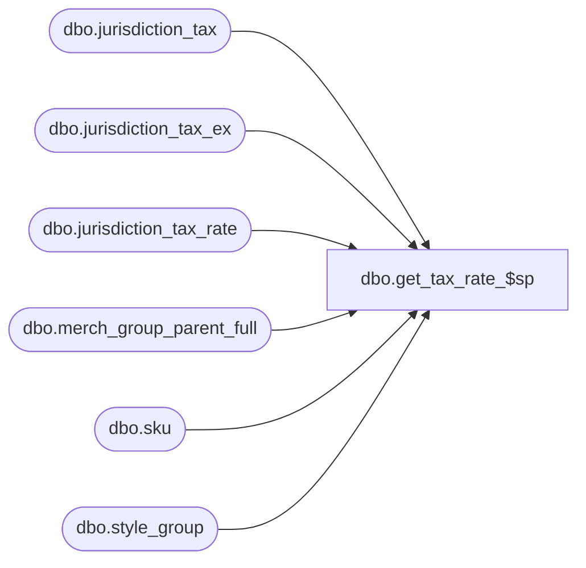

# dbo.get_tax_rate_$sp

**Database:** me_01  
**Server:** bedrockdb02  

## Architecture Diagram



## Table Dependencies

| Referenced Table |
|---|
| dbo.jurisdiction_tax |
| dbo.jurisdiction_tax_ex |
| dbo.jurisdiction_tax_rate |
| dbo.merch_group_parent_full |
| dbo.sku |
| dbo.style_group |

## Stored Procedure Code

```sql
-----------------------------------------------------------------------------------------------------------------------------
--	Main Query: Create Procedure
-----------------------------------------------------------------------------------------------------------------------------

CREATE PROCEDURE dbo.get_tax_rate_$sp

	 @Date AS SMALLDATETIME = NULL

AS

SET TRANSACTION ISOLATION LEVEL READ UNCOMMITTED
SET NOCOUNT ON

-- style size
INSERT INTO dbo.#temp_tax_rates

	(
		jurisdiction_id
		,sku_id
		,tax_rate
	)	

SELECT
	TWTRL.jurisdiction_id
	,TWTRL.sku_id
	,SUM(JTR.tax_rate / 100) tax_rate
FROM
	dbo.#temp_wrk_tax_rate_lookup TWTRL
INNER JOIN sku K ON TWTRL.sku_id = K.sku_id
INNER JOIN jurisdiction_tax_ex JTE ON K.style_size_id = JTE.style_size_id
														AND TWTRL.jurisdiction_id = JTE.jurisdiction_id
														AND JTE.jurisdiction_tax_ex_type = 3
INNER JOIN jurisdiction_tax JT ON JTE.jurisdiction_tax_id = JT.jurisdiction_tax_id 
												AND JTE.jurisdiction_id = JT.jurisdiction_id
												AND JT.tax_inclusive_flag = 1
INNER JOIN jurisdiction_tax_rate JTR ON JT.jurisdiction_tax_id = JTR.jurisdiction_tax_id
WHERE
	COALESCE(JTR.effective_from_date, '1900-01-01') <= @Date
	AND COALESCE(JTR.effective_to_date, '2079-01-01') >= @Date
GROUP BY
	TWTRL.jurisdiction_id
	,TWTRL.sku_id	

-- style
INSERT INTO dbo.#temp_tax_rates

	(
		jurisdiction_id
		,sku_id
		,tax_rate
	)	

SELECT
	TWTRL.jurisdiction_id
	,TWTRL.sku_id
	,SUM(JTR.tax_rate / 100) tax_rate
FROM
	dbo.#temp_wrk_tax_rate_lookup TWTRL
INNER JOIN jurisdiction_tax_ex JTE ON TWTRL.style_id = JTE.style_id
														AND TWTRL.jurisdiction_id = JTE.jurisdiction_id
														AND JTE.jurisdiction_tax_ex_type = 2
INNER JOIN jurisdiction_tax JT ON JTE.jurisdiction_tax_id = JT.jurisdiction_tax_id 
												AND JTE.jurisdiction_id = JT.jurisdiction_id
												AND JT.tax_inclusive_flag = 1
INNER JOIN jurisdiction_tax_rate JTR ON JT.jurisdiction_tax_id = JTR.jurisdiction_tax_id
WHERE
	COALESCE(JTR.effective_from_date, '1900-01-01') <= @Date AND COALESCE(JTR.effective_to_date, '2079-01-01') >= @Date
	AND NOT EXISTS
		(
			SELECT 1
			FROM
				dbo.#temp_tax_rates D
			WHERE
				TWTRL.sku_id = D.sku_id
				AND TWTRL.jurisdiction_id = D.jurisdiction_id
		)
GROUP BY
	TWTRL.jurisdiction_id
	,TWTRL.sku_id


-- merch group
-- TODO: Overlapping levels
INSERT INTO dbo.#temp_tax_rates

	(
		jurisdiction_id
		,sku_id
		,tax_rate
	)	

SELECT
	TWTRL.jurisdiction_id
	,TWTRL.sku_id
	,SUM(JTR.tax_rate / 100) tax_rate
FROM
	dbo.#temp_wrk_tax_rate_lookup TWTRL
INNER JOIN style_group SG ON TWTRL.style_id = SG.style_id
INNER JOIN merch_group_parent_full MGPF ON SG.hierarchy_group_id = MGPF.hierarchy_group_id
INNER JOIN jurisdiction_tax_ex JTE ON MGPF.parent_hierarchy_group_id = JTE.hierarchy_group_id
														AND TWTRL.jurisdiction_id = JTE.jurisdiction_id
														AND JTE.jurisdiction_tax_ex_type = 1
INNER JOIN jurisdiction_tax JT ON JTE.jurisdiction_tax_id = JT.jurisdiction_tax_id 
												AND JTE.jurisdiction_id = JT.jurisdiction_id
												AND JT.tax_inclusive_flag = 1
INNER JOIN jurisdiction_tax_rate JTR ON JT.jurisdiction_tax_id = JTR.jurisdiction_tax_id
WHERE
	COALESCE(JTR.effective_from_date, '1900-01-01') <= @Date AND COALESCE(JTR.effective_to_date, '2079-01-01') >= @Date
	AND NOT EXISTS
		(
			SELECT 1
			FROM
				dbo.#temp_tax_rates D
			WHERE
				TWTRL.sku_id = D.sku_id
				AND TWTRL.jurisdiction_id = D.jurisdiction_id
		)
GROUP BY
	TWTRL.jurisdiction_id
	,TWTRL.sku_id

-- jurisdiction default
INSERT INTO dbo.#temp_tax_rates

	(
		jurisdiction_id
		,sku_id
		,tax_rate
	)	

SELECT
	TWTRL.jurisdiction_id
	,TWTRL.sku_id
	,SUM(JTR.tax_rate / 100) tax_rate
FROM
	dbo.#temp_wrk_tax_rate_lookup TWTRL
INNER JOIN jurisdiction_tax JT ON TWTRL.jurisdiction_id = JT.jurisdiction_id AND JT.tax_inclusive_flag = 1 AND JT.default_flag = 1
INNER JOIN jurisdiction_tax_rate JTR ON JT.jurisdiction_tax_id = JTR.jurisdiction_tax_id
WHERE
	COALESCE(JTR.effective_from_date, '1900-01-01') <= @Date AND COALESCE(JTR.effective_to_date, '2079-01-01') >= @Date
	AND NOT EXISTS
		(
			SELECT 1
			FROM
				dbo.#temp_tax_rates D
			WHERE
				TWTRL.sku_id = D.sku_id
				AND TWTRL.jurisdiction_id = D.jurisdiction_id
		)
GROUP BY
	TWTRL.jurisdiction_id
	,TWTRL.sku_id
```

