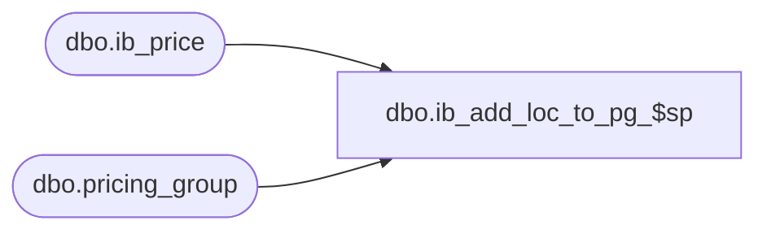

# dbo.ib_add_loc_to_pg_$sp

**Database:** me_01  
**Server:** bedrockdb02  

## Architecture Diagram



## Table Dependencies

| Referenced Table |
|---|
| dbo.ib_price |
| dbo.pricing_group |

## Stored Procedure Code

```sql
CREATE PROCEDURE [dbo].[ib_add_loc_to_pg_$sp]
( @i_pricing_group_id SMALLINT, @i_location_id SMALLINT
, @i_effective_date SMALLDATETIME )

AS

DECLARE @line_id INT
		, @table_name NVARCHAR(30), @operation_name NVARCHAR(50)
		, @sql_err_num DECIMAL(38,0), @error_msg NVARCHAR(2000)
		, @error_severity SMALLINT, @error_state SMALLINT
		
BEGIN TRY

	DECLARE @v_jurisdiction_id SMALLINT
	SELECT @v_jurisdiction_id = jurisdiction_id FROM pricing_group WHERE pricing_group_id = @i_pricing_group_id
	
	SET @line_id = 10
	
	IF NOT object_id(N'tempdb..#source_data') IS NULL
	DROP TABLE #source_data
	
	CREATE TABLE #source_data
		( style_id DECIMAL(12), color_id SMALLINT
		, UNIQUE (style_id, color_id) )
		
	INSERT INTO #source_data
		( style_id, color_id )
	SELECT
		DISTINCT
			style_id, COALESCE(color_id, -1)
	FROM
		ib_price
	WHERE
		pricing_group_id = @i_pricing_group_id AND location_id IS NULL
		AND cancel_promo_flag = 0 AND temp_price_flag = 0
	ORDER BY
		style_id, COALESCE(color_id, -1)

	SET @line_id = 20
	
	IF NOT object_id(N'tempdb..#ib_price_max_dates') IS NULL
	DROP TABLE #ib_price_max_dates

	CREATE TABLE #ib_price_max_dates
		( style_id DECIMAL(12), color_id SMALLINT
		, start_date SMALLDATETIME )

	INSERT INTO #ib_price_max_dates
		( style_id, color_id
		, start_date )
	SELECT
		SourceData.style_id, SourceData.color_id
		, MAX(Ib.start_date) start_date
	FROM 
		ib_price Ib
	INNER JOIN #source_data SourceData ON Ib.style_id = SourceData.style_id AND SourceData.color_id = COALESCE(Ib.color_id, -1)
	WHERE 
		(Ib.pricing_group_id = @i_pricing_group_id OR Ib.pricing_group_id IS NULL)
		AND Ib.location_id IS NULL AND Ib.jurisdiction_id = @v_jurisdiction_id
		AND Ib.cancel_promo_flag = 0 AND Ib.temp_price_flag = 0
	GROUP BY
		SourceData.style_id, SourceData.color_id
	ORDER BY 1
	
	SET @line_id = 30
	
	IF NOT object_id(N'tempdb..#ib_price_max_ids') IS NULL
	DROP TABLE #ib_price_max_ids

	CREATE TABLE #ib_price_max_ids
		( style_id DECIMAL(12), color_id SMALLINT
		, ib_price_id DECIMAL(12)
		, UNIQUE(ib_price_id) )

	INSERT INTO #ib_price_max_ids
		( style_id, color_id
		, ib_price_id )
	SELECT 
		MaxDate.style_id, MaxDate.color_id
		, MAX(Ib.ib_price_id) ib_price_id
	FROM 
		ib_price Ib
	INNER JOIN #ib_price_max_dates MaxDate ON Ib.style_id = MaxDate.style_id AND COALESCE(Ib.color_id, -1) = MaxDate.color_id
																AND Ib.start_date = MaxDate.start_date
	WHERE 
		(pricing_group_id = @i_pricing_group_id OR pricing_group_id IS NULL)
		AND location_id IS NULL AND Ib.jurisdiction_id = @v_jurisdiction_id
		AND cancel_promo_flag = 0 AND temp_price_flag = 0
	GROUP BY
		MaxDate.style_id, MaxDate.color_id
	ORDER BY 1	
	
	SET @line_id = 40
	
	IF NOT object_id(N'tempdb..#result_set') IS NULL
	DROP TABLE #result_set

	CREATE TABLE #result_set
		( id INT IDENTITY(1,1)
		, style_id DECIMAL(12), color_id SMALLINT, location_id SMALLINT, jurisdiction_id SMALLINT, pricing_group_id SMALLINT
		, temp_price_flag BIT
		, start_date SMALLDATETIME, end_date SMALLDATETIME
		, valuation_retail_price DECIMAL(14,2), selling_retail_price DECIMAL(14,2), price_status_id SMALLINT
		, document_number NVARCHAR(20)
		, cancel_promo_flag BIT, effective_date SMALLDATETIME, price_change_type SMALLINT
		, ib_price_id DECIMAL(12)
		, PRIMARY KEY (id)
		, UNIQUE (ib_price_id) )

	INSERT INTO #result_set
		( style_id, color_id, location_id, jurisdiction_id, pricing_group_id
		, temp_price_flag
		, start_date, end_date
		, valuation_retail_price, selling_retail_price, price_status_id
		, document_number
		, cancel_promo_flag, effective_date, price_change_type
		, ib_price_id )
	SELECT
		style_id, color_id, location_id, jurisdiction_id, pricing_group_id
		, temp_price_flag
		, start_date, end_date
		, valuation_retail_price, selling_retail_price, price_status_id
		, document_number
		, cancel_promo_flag, effective_date, price_change_type
		, ib_price_id	
	FROM
		( SELECT
				Ib.style_id, Ib.color_id, @i_location_id location_id, Ib.jurisdiction_id, @i_pricing_group_id pricing_group_id
				, Ib.temp_price_flag
				, CASE 
						WHEN Ib.start_date > @i_effective_date THEN Ib.start_date
						ELSE @i_effective_date
				  END start_date, Ib.end_date
				, Ib.valuation_retail_price, Ib.selling_retail_price, Ib.price_status_id
				, Ib.document_number
				, Ib.cancel_promo_flag, Ib.effective_date, Ib.price_change_type
				, Ib.ib_price_id
		  FROM 
				ib_price Ib
		  INNER JOIN #ib_price_max_ids MaxId ON Ib.ib_price_id = MaxId.ib_price_id	
		  WHERE
				pricing_group_id = @i_pricing_group_id
		  UNION ALL
		  SELECT
				Ib.style_id, Ib.color_id, @i_location_id location_id, Ib.jurisdiction_id, @i_pricing_group_id pricing_group_id
				, Ib.temp_price_flag
				, CASE 
						WHEN Ib.start_date > @i_effective_date THEN Ib.start_date
						ELSE @i_effective_date
				  END start_date, Ib.end_date
				, Ib.valuation_retail_price, Ib.selling_retail_price, Ib.price_status_id
				, Ib.document_number
				, Ib.cancel_promo_flag, Ib.effective_date, Ib.price_change_type
				, Ib.ib_price_id
		  FROM
				ib_price Ib
		  WHERE 
				Ib.pricing_group_id = @i_pricing_group_id AND Ib.location_id IS NULL
				AND Ib.cancel_promo_flag = 0 AND Ib.temp_price_flag = 1
				AND Ib.end_date >= @i_effective_date ) T
	ORDER BY ib_price_id	

	SET @line_id = 40
	
	DECLARE @min_id INT, @max_id INT, @batch_max_id INT, @batch_size INT
	SELECT 
		@min_id = 0
		, @batch_max_id = 0
		, @batch_size = 10000
		, @max_id = COALESCE(MAX(id), 0)
	FROM
		#result_set
		
	WHILE (@batch_max_id <> @max_id)
	BEGIN
	
		IF (@min_id + @batch_size < @max_id)
			SET @batch_max_id = @min_id + @batch_size
		ELSE
			SET @batch_max_id = @max_id
			
		DECLARE @v_insert_guid UNIQUEIDENTIFIER
		SET @v_insert_guid = NEWID()
		
		INSERT INTO ib_price
			( style_id, color_id, location_id, jurisdiction_id, pricing_group_id
			, temp_price_flag
			, start_date, end_date
			, valuation_retail_price, selling_retail_price, price_status_id
			, document_number
			, cancel_promo_flag, effective_date, price_change_type
			, insert_guid )
		SELECT
			style_id, color_id, location_id, jurisdiction_id, pricing_group_id
			, temp_price_flag
			, start_date, end_date
			, valuation_retail_price, selling_retail_price, price_status_id
			, document_number
			, cancel_promo_flag, effective_date, price_change_type
			, @v_insert_guid
		FROM
			#result_set
		WHERE
			id > @min_id AND id <= @batch_max_id
		ORDER BY
			ib_price_id
			
		SET @min_id = @batch_max_id
			
	END

END TRY

BEGIN CATCH

	SELECT 
		@error_severity	= 16
		, @error_state = 1

	IF @line_id = 10
		SELECT  
			@table_name			= N'#ib_price_max_dates'
			, @operation_name	= N'CREATE TABLE'
			, @sql_err_num		= ERROR_NUMBER()
			, @error_msg		= N'Line Id = ' + CAST(@line_id AS NVARCHAR(4)) + N' '
									+ N' Table Name = ' + @table_name + N' '
									+ N' Operation Name = ' + @operation_name + N' '
									+ N' SQL Error Number = ' + CAST(@sql_err_num AS NVARCHAR(38)) + N' '
									+ N' Error Message = ' + ERROR_MESSAGE()

	ELSE IF @line_id = 15
		SELECT  
			@table_name			= N'#ib_price_max_dates'
			, @operation_name	= N'INSERT'
			, @sql_err_num		= ERROR_NUMBER()
			, @error_msg		= N'Line Id = ' + CAST(@line_id AS NVARCHAR(4)) + N' '
									+ N' Table Name = ' + @table_name + N' '
									+ N' Operation Name = ' + @operation_name + N' '
									+ N' SQL Error Number = ' + CAST(@sql_err_num AS NVARCHAR(38)) + N' '
									+ N' Error Message = ' + ERROR_MESSAGE()

	ELSE IF @line_id = 20
		SELECT  
			@table_name			= N'#ib_price_max_ids'
			, @operation_name	= N'CREATE TABLE'
			, @sql_err_num		= ERROR_NUMBER()
			, @error_msg		= N'Line Id = ' + CAST(@line_id AS NVARCHAR(4)) + N' '
									+ N' Table Name = ' + @table_name + N' '
									+ N' Operation Name = ' + @operation_name + N' '
									+ N' SQL Error Number = ' + CAST(@sql_err_num AS NVARCHAR(38)) + N' '
									+ N' Error Message = ' + ERROR_MESSAGE()

	ELSE IF @line_id = 25
		SELECT  
			@table_name			= N'#ib_price_max_ids'
			, @operation_name	= N'INSERT'
			, @sql_err_num		= ERROR_NUMBER()
			, @error_msg		= N'Line Id = ' + CAST(@line_id AS NVARCHAR(4)) + N' '
									+ N' Table Name = ' + @table_name + N' '
									+ N' Operation Name = ' + @operation_name + N' '
									+ N' SQL Error Number = ' + CAST(@sql_err_num AS NVARCHAR(38)) + N' '
									+ N' Error Message = ' + ERROR_MESSAGE()

	ELSE IF @line_id = 30
		SELECT  
			@table_name			= N'#result_set'
			, @operation_name	= N'CREATE TABLE'
			, @sql_err_num		= ERROR_NUMBER()
			, @error_msg		= N'Line Id = ' + CAST(@line_id AS NVARCHAR(4)) + N' '
									+ N' Table Name = ' + @table_name + N' '
									+ N' Operation Name = ' + @operation_name + N' '
									+ N' SQL Error Number = ' + CAST(@sql_err_num AS NVARCHAR(38)) + N' '
									+ N' Error Message = ' + ERROR_MESSAGE()

	ELSE IF @line_id = 35
		SELECT  
			@table_name			= N'#result_set'
			, @operation_name	= N'INSERT'
			, @sql_err_num		= ERROR_NUMBER()
			, @error_msg		= N'Line Id = ' + CAST(@line_id AS NVARCHAR(4)) + N' '
									+ N' Table Name = ' + @table_name + N' '
									+ N' Operation Name = ' + @operation_name + N' '
									+ N' SQL Error Number = ' + CAST(@sql_err_num AS NVARCHAR(38)) + N' '
									+ N' Error Message = ' + ERROR_MESSAGE()

	ELSE IF @line_id = 40
		SELECT  
			@table_name			= N'ib_price'
			, @operation_name	= N'INSERT'
			, @sql_err_num		= ERROR_NUMBER()
			, @error_msg		= N'Line Id = ' + CAST(@line_id AS NVARCHAR(4)) + N' '
									+ N' Table Name = ' + @table_name + N' '
									+ N' Operation Name = ' + @operation_name + N' '
									+ N' SQL Error Number = ' + CAST(@sql_err_num AS NVARCHAR(38)) + N' '
									+ N' Error Message = ' + ERROR_MESSAGE()
			
	RAISERROR (@error_msg, @error_severity, @error_state)	

END CATCH
```

