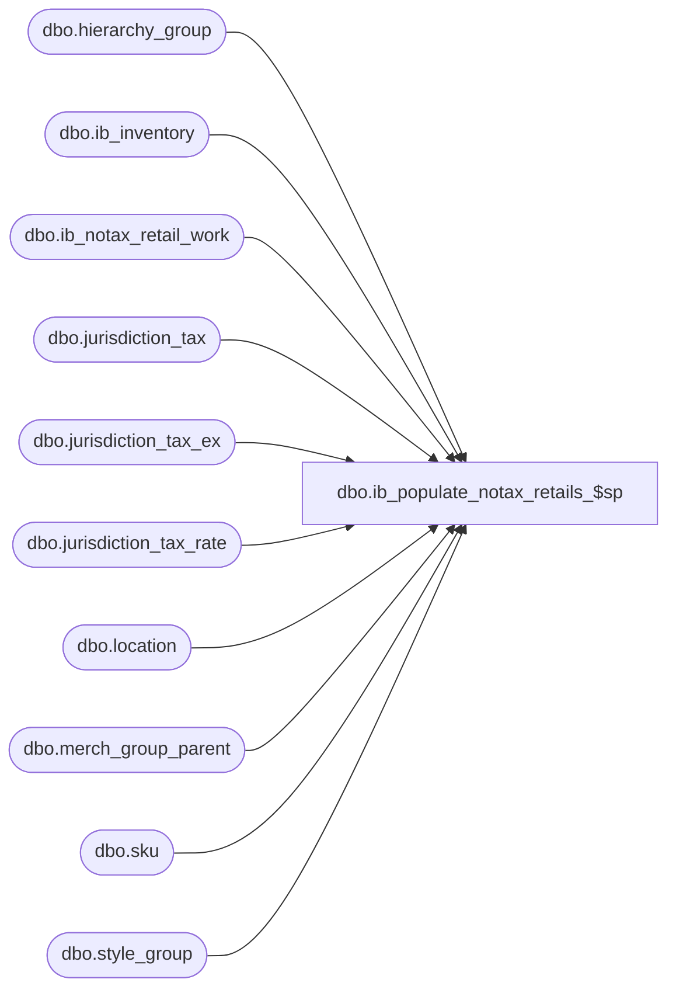

# dbo.ib_populate_notax_retails_$sp

**Database:** me_01  
**Server:** bedrockdb02  

## Architecture Diagram



## Table Dependencies

| Referenced Table |
|---|
| dbo.hierarchy_group |
| dbo.ib_inventory |
| dbo.ib_notax_retail_work |
| dbo.jurisdiction_tax |
| dbo.jurisdiction_tax_ex |
| dbo.jurisdiction_tax_rate |
| dbo.location |
| dbo.merch_group_parent |
| dbo.sku |
| dbo.style_group |

## Stored Procedure Code

```sql
CREATE PROCEDURE [dbo].[ib_populate_notax_retails_$sp]

AS

/* 
Proc name:  ib_populate_notax_retails_$sp
Description: Retrieves the tax-exclusive retail values for a range of ib_inventory rows and populates
  the ib_notax_retail_work table

HISTORY: 
Date        Name          Def# Desc
May 31,07    Yves Rivest  Part of Merch 4.X - Tax-exclusive retails in MA
Nov 12,07    Yves Rivest  Fix defects related to transfers and store shipments
Jan 10,08    Yves Rivest  ib_populate_notax_retails2_$sp plus #ib_all_excp_rows
July 10, 09  Pierrette Lemay ib populate_no_tax_retails fails to create a constraint on #ib_inventory_work
Feb 27 2018  Armen  Hotfix installed for DMER-3482 performance improvement for building #ib_all_excp_rows
*/

DECLARE
@count_ib INT,
@count_notax INT,
@start_id DECIMAL(12,0),
@end_id  DECIMAL(12,0),
@batch_start_id DECIMAL(12,0),
@batch_end_id DECIMAL(12,0),
@error   INT

BEGIN 

 -- The starting id will be the maximum id from ib_notax_work_retail + 1
 SELECT  @start_id = COALESCE(MAX(ib_inventory_id) + 1, 0) FROM ib_notax_retail_work

 -- The ending id will be the maximum id from ib_inventory - REMOVED with (nolock)
 SELECT  @end_id = COALESCE(MAX(ib_inventory_id), 0) FROM ib_inventory

 -- Get count of rows from ib_inventory
 SELECT  @count_ib = COUNT(*) FROM ib_inventory WITH (NOLOCK) WHERE ib_inventory_id <= @end_id

 -- Initialize ids for batches
 SELECT  @batch_start_id = @start_id, @batch_end_id = @start_id

 -- To avoid repeated searches in ib_notax_retail_work
 -- get the meaningful data here in a temp table
 IF NOT object_id(N'tempdb..#existing_ib_rows') IS NULL
 DROP TABLE #existing_ib_rows

 SELECT ib_inventory_id
 INTO #existing_ib_rows
 FROM ib_notax_retail_work
 WHERE ib_inventory_id BETWEEN @start_id AND @end_id

 SELECT @error = @@error
 IF @error <> 0
 BEGIN
  RAISERROR (N'Message: Failed to create #existing_ib_rows   error: %d', 16, 1, @error)
  RETURN
 END  

 ALTER TABLE #existing_ib_rows ADD PRIMARY KEY NONCLUSTERED ( ib_inventory_id )

 SELECT @error = @@error
 IF @error <> 0
 BEGIN
  RAISERROR (N'Message: Failed to create index on #existing_ib_rows   error: %d', 16, 1, @error)
  RETURN
 END 

 -- To avoid repeated searches in ib_inventory
 -- get the meaningful data here in a temp table
 IF NOT object_id(N'tempdb..#ib_inventory_work') IS NULL
 DROP TABLE #ib_inventory_work

 SELECT *
 INTO #ib_inventory_work
 FROM ib_inventory
 WHERE ib_inventory_id BETWEEN @start_id AND @end_id

 SELECT @error = @@error
 IF @error <> 0
 BEGIN
  RAISERROR (N'Message: Failed to create #ib_inventory_work   error: %d', 16, 1, @error)
  RETURN
 END  

 -- Index the temp table exactly like ib_inventory
 ALTER TABLE #ib_inventory_work ADD PRIMARY KEY NONCLUSTERED ( ib_inventory_id )

 SELECT @error = @@error
 IF @error <> 0
 BEGIN
  RAISERROR (N'Message: Failed to create PK constraint on #ib_inventory_work   error: %d', 16, 1, @error)
  RETURN
 END 

 ALTER TABLE #ib_inventory_work ADD UNIQUE CLUSTERED (sku_id, location_id, transaction_date, ib_inventory_id)

 SELECT @error = @@error
 IF @error <> 0
 BEGIN
  RAISERROR (N'Message: Failed to create #ib_inventory_work_$uk1 constraint on #ib_inventory_work   error: %d', 16, 1, @error)
  RETURN
 END 

 CREATE INDEX #ib_inventory_work_$ndx1 ON #ib_inventory_work(transaction_date, transaction_type_code)

 SELECT @error = @@error
 IF @error <> 0
 BEGIN
  RAISERROR (N'Message: Failed to create #ib_inventory_work_$ndx1 index on #ib_inventory_work   error: %d', 16, 1, @error)
  RETURN
 END 

 CREATE UNIQUE INDEX #ib_inventory_work_$ndx2 ON #ib_inventory_work(ib_inventory_id, location_id)

 SELECT @error = @@error
 IF @error <> 0
 BEGIN
  RAISERROR (N'Message: Failed to create #ib_inventory_work_$ndx2 index on #ib_inventory_work   error: %d', 16, 1, @error)
  RETURN
 END 

 CREATE UNIQUE INDEX #ib_inventory_work_$ndx3 ON #ib_inventory_work(ib_inventory_id, transaction_type_code)

 SELECT @error = @@error
 IF @error <> 0
 BEGIN
  RAISERROR (N'Message: Failed to create #ib_inventory_work_$ndx3 index on #ib_inventory_work   error: %d', 16, 1, @error)
  RETURN
 END 

 -- Some rows in ib_inventory related to transfers and store shipments
 -- where the retail differs between the FROM and TO locations cannot be
 -- processed like the rest of the data

 -- Get all the ib_inventory rows related to all 30x and 40x documents
 -- included in the working set. This will avoid expensive queries
 -- later against ib_inventory

 IF NOT object_id(N'tempdb..#ib_all_excp_rows') IS NULL
 DROP TABLE #ib_all_excp_rows

  SELECT ii.*
 INTO #ib_all_excp_rows
 FROM ib_inventory ii
  INNER JOIN
  (SELECT DISTINCT document_number, sku_id
  FROM #ib_inventory_work
  WHERE transaction_type_code BETWEEN 300 AND 309) iw
 ON  ii.document_number = iw.document_number
 WHERE 
 ii.sku_id=iw.sku_id and
 ii.transaction_type_code BETWEEN 300 AND 309 
 UNION ALL
 SELECT ii.*
 FROM ib_inventory ii
  INNER JOIN
  (SELECT DISTINCT document_number, sku_id
  FROM #ib_inventory_work
  WHERE transaction_type_code BETWEEN 400 AND 409) iw
 ON  ii.document_number = iw.document_number
 WHERE 
 ii.sku_id=iw.sku_id and
 ii.transaction_type_code BETWEEN 400 AND 409

 SELECT @error = @@error
 IF @error <> 0
 BEGIN
  RAISERROR (N'Message: Failed to create #ib_all_excp_rows temp table   error: %d', 16, 1, @error)
  RETURN
 END 

 CREATE INDEX #ib_all_excp_rows_ndx1 ON #ib_all_excp_rows(ib_inventory_id)

 SELECT @error = @@error
 IF @error <> 0
 BEGIN
  RAISERROR (N'Message: Failed to create #ib_all_excp_rows_ndx1 index on #ib_all_excp_rows   error: %d', 16, 1, @error)
  RETURN
 END 

 CREATE INDEX #ib_all_excp_rows_ndx2 ON #ib_all_excp_rows(document_number, sku_id)

 SELECT @error = @@error
 IF @error <> 0
 BEGIN
  RAISERROR (N'Message: Failed to create #ib_all_excp_rows_ndx2 index on #ib_all_excp_rows   error: %d', 16, 1, @error)
  RETURN
 END 

 CREATE INDEX #ib_all_excp_rows_ndx3 ON #ib_all_excp_rows(document_number, sku_id, transaction_type_code)

 SELECT @error = @@error
 IF @error <> 0
 BEGIN
  RAISERROR (N'Message: Failed to create #ib_all_excp_rows_ndx3 index on #ib_all_excp_rows   error: %d', 16, 1, @error)
  RETURN
 END 

 CREATE INDEX #ib_all_excp_rows_ndx4 ON #ib_all_excp_rows(document_number, sku_id, location_id, transaction_type_code)

 SELECT @error = @@error
 IF @error <> 0
 BEGIN
  RAISERROR (N'Message: Failed to create #ib_all_excp_rows_ndx4 index on #ib_all_excp_rows   error: %d', 16, 1, @error)
  RETURN
 END 

 -- Get all the document-sku combinations for transfers and store shipments
 -- in the range of IDs to process (302 and 402 are processed differently and
 -- are excluded for now
 IF NOT object_id(N'tempdb..#xfers_and_shipments') IS NULL
 DROP TABLE #xfers_and_shipments

 SELECT DISTINCT 
  document_number, 
  300 AS transaction_type, 
  sku_id, 
  CAST(0 as SMALLINT) AS location_id
 INTO #xfers_and_shipments
 FROM #ib_inventory_work
 WHERE transaction_type_code BETWEEN 300 AND 309
  AND transaction_type_code <> 302
 UNION
 SELECT DISTINCT
  document_number, 
  400 AS transaction_type, 
  sku_id, 
  CAST(0 as SMALLINT) AS location_id
 FROM #ib_inventory_work
 WHERE transaction_type_code BETWEEN 400 AND 409
  AND transaction_type_code <> 402

 SELECT @error = @@error
 IF @error <> 0
 BEGIN
  RAISERROR (N'Message: Failed to create #xfers_and_shipments   error: %d', 16, 1, @error)
  RETURN
 END 

 CREATE INDEX #xfers_and_shipments_ndx1 ON #xfers_and_shipments(document_number, sku_id, transaction_type)

 SELECT @error = @@error
 IF @error <> 0
 BEGIN
  RAISERROR (N'Failed to create #xfers_and_shipments_ndx1 index on #xfers_and_shipments   error: %d', 16, 1, @error)
  RETURN
 END 

 -- Identify the document-skus where discrepancies exist and get the location
 -- that was used to post the retail entries (always the other_location_id of
 -- the 302/402 transactions)
 -- We use #ib_all_excp_rows here instead of the #ib_inventory_work temp table because
 -- the ib rows we're looking for might not be in the working range
 UPDATE #xfers_and_shipments
 SET location_id = a.location_id
 FROM (SELECT f.document_number, 
   f.sku_id, 
   ii.other_location_id as location_id
  FROM (SELECT ii.document_number, 
    ii.sku_id, 
    MIN(ii.ib_inventory_id) as ib_inventory_id
   FROM #ib_all_excp_rows ii
    INNER JOIN #xfers_and_shipments x 
    ON ii.document_number = x.document_number 
    AND ii.sku_id = x.sku_id 
    AND x.transaction_type = 300
   WHERE ii.transaction_type_code = 302
   GROUP BY ii.document_number, ii.sku_id) f
   INNER JOIN #ib_all_excp_rows ii
   ON f.ib_inventory_id = ii.ib_inventory_id) a
 WHERE #xfers_and_shipments.transaction_type = 300
  AND #xfers_and_shipments.document_number = a.document_number 
  AND #xfers_and_shipments.sku_id = a.sku_id
 
 UPDATE #xfers_and_shipments
 SET location_id = a.location_id
 FROM (SELECT f.document_number, 
   f.sku_id, 
   ii.other_location_id as location_id
  FROM (SELECT ii.document_number, 
    ii.sku_id, 
    MIN(ii.ib_inventory_id) as ib_inventory_id
   FROM #ib_all_excp_rows ii
    INNER JOIN #xfers_and_shipments x 
    ON ii.document_number = x.document_number 
    AND ii.sku_id = x.sku_id 
    AND x.transaction_type = 400
   WHERE ii.transaction_type_code = 402
   GROUP BY ii.document_number, ii.sku_id) f
   INNER JOIN #ib_all_excp_rows ii
   ON f.ib_inventory_id = ii.ib_inventory_id) a
 WHERE #xfers_and_shipments.transaction_type = 400
  AND #xfers_and_shipments.document_number = a.document_number 
  AND #xfers_and_shipments.sku_id = a.sku_id

 SELECT @error = @@error
 IF @error <> 0
 BEGIN
  RAISERROR (N'Failed to update #xfers_and_shipments.location_id   error: %d', 16, 1, @error)
  RETURN
 END 

 -- Get all the ib_inventory rows for the exceptions
 -- All these rows will need to be excluded from the main processing
 -- Logic now includes getting the tax rates here because the tax rate
 -- used for the valuation retail might not be the same as the tax rate
 -- used for the selling retail
 IF NOT object_id(N'tempdb..#exceptions') IS NULL
 DROP TABLE #exceptions

 SELECT ii.ib_inventory_id,
  x.location_id,
  ii.location_id as ib_location_id,
  ii.sku_id,
  ii.transaction_date,
  ii.transaction_valuation_retail,
  ii.transaction_selling_retail,
  CAST(0 AS FLOAT) AS location_tax_rate,
  CAST(0 AS FLOAT) AS ib_location_tax_rate
 INTO #exceptions
 FROM #ib_inventory_work ii
  INNER JOIN #xfers_and_shipments x 
  ON ii.document_number = x.document_number
  AND ii.sku_id = x.sku_id
 WHERE x.transaction_type = 300
  AND x.location_id <> 0
  AND ii.transaction_type_code BETWEEN 300 AND 309
  AND ii.transaction_type_code <> 302
 UNION
 SELECT ii.ib_inventory_id,
  x.location_id,
  ii.location_id as ib_location_id,
  ii.sku_id,
  ii.transaction_date,
  ii.transaction_valuation_retail,
  ii.transaction_selling_retail,
  CAST(0 AS FLOAT) AS location_tax_rate,
  CAST(0 AS FLOAT) AS ib_location_tax_rate
 FROM #ib_inventory_work ii
  INNER JOIN #xfers_and_shipments x 
  ON ii.document_number = x.document_number
  AND ii.sku_id = x.sku_id
 WHERE x.transaction_type = 400
  AND x.location_id <> 0
  AND ii.transaction_type_code BETWEEN 400 AND 409
  AND ii.transaction_type_code <> 402

 SELECT @error = @@error
 IF @error <> 0
 BEGIN
  RAISERROR (N'Failed to create table #exceptions   error: %d', 16, 1, @error)
  RETURN
 END

 ALTER TABLE #exceptions ADD PRIMARY KEY NONCLUSTERED ( ib_inventory_id )

 SELECT @error = @@error
 IF @error <> 0
 BEGIN
  RAISERROR (N'Failed to create index on #exceptions   error: %d', 16, 1, @error)
  RETURN
 END 

 -- We no longer need the first temp table
 IF NOT object_id(N'tempdb..#xfers_and_shipments') IS NULL
 DROP TABLE #xfers_and_shipments

 -- Get location tax rate and ib_location_tax_rate for each row in #exceptions
 UPDATE #exceptions
 SET location_tax_rate = a.tax_rate
 FROM (SELECT jt.ib_inventory_id,
   1 + (SUM(COALESCE(ze.tax_rate, se.tax_rate, ge.tax_rate, jt.tax_rate, 0)) / 100) as tax_rate
  FROM
   ( SELECT  ii.ib_inventory_id,
     jt.tax_type_id, 
     jtr.tax_rate
    FROM #exceptions ii
     INNER JOIN location l WITH (NOLOCK)  
     ON (ii.location_id = l.location_id)    
     LEFT OUTER JOIN jurisdiction_tax jt    
     ON (jt.jurisdiction_id = l.jurisdiction_id
      AND jt.tax_inclusive_flag = 1
      AND jt.default_flag = 1)
     LEFT OUTER JOIN (jurisdiction_tax_rate jtr    
         INNER JOIN (SELECT jurisdiction_tax_id, MIN(effective_from_date) min_date    
            FROM jurisdiction_tax_rate    
            GROUP BY jurisdiction_tax_id) jtrm    
         ON (jtr.jurisdiction_tax_id = jtrm.jurisdiction_tax_id))    
     ON (jtr.jurisdiction_tax_id = jt.jurisdiction_tax_id    
      AND (CASE    
       WHEN ii.transaction_date < jtrm.min_date    
       THEN jtrm.min_date    
       ELSE ii.transaction_date
       END) >= jtr.effective_from_date    
      AND (ii.transaction_date <= jtr.effective_to_date OR jtr.effective_to_date IS NULL))
   )jt
   LEFT OUTER JOIN
   ( SELECT  ii.ib_inventory_id,
     jt.tax_type_id, 
     jtr.tax_rate
    FROM #exceptions ii
     INNER JOIN location l WITH (NOLOCK)
     ON (ii.location_id = l.location_id)    
     INNER JOIN sku WITH (NOLOCK)
     ON ii.sku_id = sku.sku_id
     INNER JOIN jurisdiction_tax_ex jte
     ON (sku.style_id = jte.style_id
      AND jte.jurisdiction_id = l.jurisdiction_id)
     INNER JOIN jurisdiction_tax jt
     ON (jt.jurisdiction_tax_id = jte.jurisdiction_tax_id
      AND jt.tax_inclusive_flag = 1)
     INNER JOIN (jurisdiction_tax_rate jtr    
       INNER JOIN ( SELECT jurisdiction_tax_id, 
          MIN(effective_from_date) min_date    
         FROM jurisdiction_tax_rate    
         GROUP BY jurisdiction_tax_id) jtrm    
        ON (jtr.jurisdiction_tax_id = jtrm.jurisdiction_tax_id))    
     ON (jtr.jurisdiction_tax_id = jt.jurisdiction_tax_id    
      AND (CASE    
       WHEN ii.transaction_date < jtrm.min_date    
       THEN jtrm.min_date    
       ELSE ii.transaction_date
       END) >= jtr.effective_from_date    
      AND (ii.transaction_date <= jtr.effective_to_date OR jtr.effective_to_date IS NULL))
  
   ) se
   ON ( jt.ib_inventory_id = se.ib_inventory_id
    AND jt.tax_type_id = se.tax_type_id)
   LEFT OUTER JOIN
   (
    SELECT  ii.ib_inventory_id,
     jt.tax_type_id, 
     jtr.tax_rate
    FROM #exceptions ii
     INNER JOIN location l WITH (NOLOCK)
     ON (ii.location_id = l.location_id)    
     INNER JOIN sku WITH (NOLOCK)
     ON ii.sku_id = sku.sku_id
     INNER JOIN jurisdiction_tax_ex jte
     ON (sku.style_size_id = jte.style_size_id
      AND jte.jurisdiction_id = l.jurisdiction_id)
     INNER JOIN jurisdiction_tax jt
     ON (jt.jurisdiction_tax_id = jte.jurisdiction_tax_id
      AND jt.tax_inclusive_flag = 1)
     INNER JOIN (jurisdiction_tax_rate jtr    
        INNER JOIN (SELECT jurisdiction_tax_id, MIN(effective_from_date) min_date    
           FROM jurisdiction_tax_rate    
           GROUP BY jurisdiction_tax_id) jtrm    
        ON (jtr.jurisdiction_tax_id = jtrm.jurisdiction_tax_id))    
     ON (jtr.jurisdiction_tax_id = jt.jurisdiction_tax_id    
      AND (CASE    
       WHEN ii.transaction_date < jtrm.min_date    
       THEN jtrm.min_date    
       ELSE ii.transaction_date
       END) >= jtr.effective_from_date    
      AND (ii.transaction_date <= jtr.effective_to_date OR jtr.effective_to_date IS NULL))
  
   ) ze
   ON (jt.ib_inventory_id = ze.ib_inventory_id
    AND jt.tax_type_id = ze.tax_type_id)
   LEFT OUTER JOIN
   ( SELECT  ii.ib_inventory_id,
     jt.tax_type_id, 
     jtr.tax_rate
    FROM #exceptions ii
     INNER JOIN location l WITH (NOLOCK)
     ON (ii.location_id = l.location_id)    
     INNER JOIN sku WITH (NOLOCK)
     ON ii.sku_id = sku.sku_id
     INNER JOIN style_group sg WITH (NOLOCK)
     ON (sku.style_id = sg.style_id)
     INNER JOIN merch_group_parent mgp WITH (NOLOCK)
     ON (sg.hierarchy_group_id = mgp.hierarchy_group_id)
     INNER JOIN hierarchy_group hg WITH (NOLOCK)
     ON (mgp.parent_hierarchy_group_id = hg.hierarchy_group_id)
     INNER JOIN jurisdiction_tax_ex jte
     ON (jte.hierarchy_group_id = mgp.parent_hierarchy_group_id
      AND jte.jurisdiction_id = l.jurisdiction_id)
     INNER JOIN jurisdiction_tax jt
     ON (jt.jurisdiction_tax_id = jte.jurisdiction_tax_id
      AND jt.tax_inclusive_flag = 1)
  
      INNER JOIN ( SELECT ii.ib_inventory_id,
         jt.tax_type_id, 
         max(hg.hierarchy_level_id) as max_hierarchy_level_id
        FROM #exceptions ii
         INNER JOIN location l WITH (NOLOCK)
         ON (ii.location_id = l.location_id)    
         INNER JOIN sku WITH (NOLOCK)
         ON ii.sku_id = sku.sku_id
         INNER JOIN style_group sg WITH (NOLOCK)
         ON (sku.style_id = sg.style_id)
         INNER JOIN merch_group_parent mgp WITH (NOLOCK)
         ON (sg.hierarchy_group_id = mgp.hierarchy_group_id)
         INNER JOIN hierarchy_group hg WITH (NOLOCK)
         ON (mgp.parent_hierarchy_group_id = hg.hierarchy_group_id)
         INNER JOIN jurisdiction_tax_ex jte
         ON (jte.hierarchy_group_id = mgp.parent_hierarchy_group_id
          AND jte.jurisdiction_id = l.jurisdiction_id)
         INNER JOIN jurisdiction_tax jt
         ON (jt.jurisdiction_tax_id = jte.jurisdiction_tax_id
          AND jt.tax_inclusive_flag = 1)
         INNER JOIN (jurisdiction_tax_rate jtr    
            INNER JOIN ( SELECT jurisdiction_tax_id, 
               MIN(effective_from_date) min_date    
              FROM jurisdiction_tax_rate    
              GROUP BY jurisdiction_tax_id) jtrm    
            ON (jtr.jurisdiction_tax_id = jtrm.jurisdiction_tax_id))    
         ON (jtr.jurisdiction_tax_id = jt.jurisdiction_tax_id    
          AND (CASE    
           WHEN ii.transaction_date < jtrm.min_date    
           THEN jtrm.min_date    
           ELSE ii.transaction_date
           END) >= jtr.effective_from_date    
          AND (ii.transaction_date <= jtr.effective_to_date OR jtr.effective_to_date IS NULL))
        GROUP BY ii.ib_inventory_id,
         jt.tax_type_id) grmax
      ON ( ii.ib_inventory_id = grmax.ib_inventory_id
       AND jt.tax_type_id = grmax.tax_type_id
       AND hg.hierarchy_level_id = grmax.max_hierarchy_level_id)
     INNER JOIN (jurisdiction_tax_rate jtr    
        INNER JOIN (SELECT jurisdiction_tax_id, MIN(effective_from_date) min_date    
           FROM jurisdiction_tax_rate    
           GROUP BY jurisdiction_tax_id) jtrm    
        ON (jtr.jurisdiction_tax_id = jtrm.jurisdiction_tax_id))    
     ON (jtr.jurisdiction_tax_id = jt.jurisdiction_tax_id    
      AND (CASE    
       WHEN ii.transaction_date < jtrm.min_date    
       THEN jtrm.min_date    
       ELSE ii.transaction_date
       END) >= jtr.effective_from_date    
      AND (ii.transaction_date <= jtr.effective_to_date OR jtr.effective_to_date IS NULL))
   ) ge
   ON (jt.ib_inventory_id = ge.ib_inventory_id
    AND jt.tax_type_id = ge.tax_type_id)
  GROUP BY jt.ib_inventory_id) a
 WHERE #exceptions.ib_inventory_id = a.ib_inventory_id
 
 SELECT @error = @@error
 IF @error <> 0
 BEGIN
  RAISERROR (N'Failed to update #exceptions with location tax rate   error: %d', 16, 1, @error)
  RETURN
 END   

 -- Get other location tax rate for each row in #exceptions
 UPDATE #exceptions
 SET ib_location_tax_rate = a.tax_rate
 FROM (SELECT jt.ib_inventory_id,
   1 + (SUM(COALESCE(ze.tax_rate, se.tax_rate, ge.tax_rate, jt.tax_rate, 0)) / 100) as tax_rate
  FROM
   ( SELECT  ii.ib_inventory_id,
     jt.tax_type_id, 
     jtr.tax_rate
    FROM #exceptions ii
     INNER JOIN location l WITH (NOLOCK) 
     ON (ii.ib_location_id = l.location_id)    
     LEFT OUTER JOIN jurisdiction_tax jt    
     ON (jt.jurisdiction_id = l.jurisdiction_id
      AND jt.tax_inclusive_flag = 1
      AND jt.default_flag = 1)
     LEFT OUTER JOIN (jurisdiction_tax_rate jtr    
         INNER JOIN (SELECT jurisdiction_tax_id, MIN(effective_from_date) min_date    
            FROM jurisdiction_tax_rate    
            GROUP BY jurisdiction_tax_id) jtrm    
         ON (jtr.jurisdiction_tax_id = jtrm.jurisdiction_tax_id))    
     ON (jtr.jurisdiction_tax_id = jt.jurisdiction_tax_id    
      AND (CASE    
       WHEN ii.transaction_date < jtrm.min_date    
       THEN jtrm.min_date    
       ELSE ii.transaction_date
       END) >= jtr.effective_from_date    
      AND (ii.transaction_date <= jtr.effective_to_date OR jtr.effective_to_date IS NULL))
   )jt
   LEFT OUTER JOIN
   ( SELECT  ii.ib_inventory_id,
     jt.tax_type_id, 
     jtr.tax_rate
    FROM #exceptions ii
     INNER JOIN location l WITH (NOLOCK)
     ON (ii.ib_location_id = l.location_id)    
     INNER JOIN sku WITH (NOLOCK)
     ON ii.sku_id = sku.sku_id
     INNER JOIN jurisdiction_tax_ex jte
     ON (sku.style_id = jte.style_id
      AND jte.jurisdiction_id = l.jurisdiction_id)
     INNER JOIN jurisdiction_tax jt
     ON (jt.jurisdiction_tax_id = jte.jurisdiction_tax_id
      AND jt.tax_inclusive_flag = 1)
     INNER JOIN (jurisdiction_tax_rate jtr    
       INNER JOIN ( SELECT jurisdiction_tax_id, 
          MIN(effective_from_date) min_date    
         FROM jurisdiction_tax_rate    
         GROUP BY jurisdiction_tax_id) jtrm    
        ON (jtr.jurisdiction_tax_id = jtrm.jurisdiction_tax_id))    
     ON (jtr.jurisdiction_tax_id = jt.jurisdiction_tax_id    
      AND (CASE    
       WHEN ii.transaction_date < jtrm.min_date    
       THEN jtrm.min_date    
       ELSE ii.transaction_date
       END) >= jtr.effective_from_date    
      AND (ii.transaction_date <= jtr.effective_to_date OR jtr.effective_to_date IS NULL))
  
   ) se
   ON ( jt.ib_inventory_id = se.ib_inventory_id
    AND jt.tax_type_id = se.tax_type_id)
   LEFT OUTER JOIN
   (
    SELECT  ii.ib_inventory_id,
     jt.tax_type_id, 
     jtr.tax_rate
    FROM #exceptions ii
     INNER JOIN location l WITH (NOLOCK)
     ON (ii.ib_location_id = l.location_id)    
     INNER JOIN sku WITH (NOLOCK)
     ON ii.sku_id = sku.sku_id
     INNER JOIN jurisdiction_tax_ex jte
     ON (sku.style_size_id = jte.style_size_id
      AND jte.jurisdiction_id = l.jurisdiction_id)
     INNER JOIN jurisdiction_tax jt
     ON (jt.jurisdiction_tax_id = jte.jurisdiction_tax_id
      AND jt.tax_inclusive_flag = 1)
     INNER JOIN (jurisdiction_tax_rate jtr    
        INNER JOIN (SELECT jurisdiction_tax_id, MIN(effective_from_date) min_date    
           FROM jurisdiction_tax_rate    
           GROUP BY jurisdiction_tax_id) jtrm    
        ON (jtr.jurisdiction_tax_id = jtrm.jurisdiction_tax_id))    
     ON (jtr.jurisdiction_tax_id = jt.jurisdiction_tax_id    
      AND (CASE    
       WHEN ii.transaction_date < jtrm.min_date    
       THEN jtrm.min_date    
       ELSE ii.transaction_date
       END) >= jtr.effective_from_date    
      AND (ii.transaction_date <= jtr.effective_to_date OR jtr.effective_to_date IS NULL))
  
   ) ze
   ON (jt.ib_inventory_id = ze.ib_inventory_id
    AND jt.tax_type_id = ze.tax_type_id)
   LEFT OUTER JOIN
   ( SELECT  ii.ib_inventory_id,
     jt.tax_type_id, 
     jtr.tax_rate
    FROM #exceptions ii
     INNER JOIN location l WITH (NOLOCK)
     ON (ii.ib_location_id = l.location_id)    
     INNER JOIN sku WITH (NOLOCK)
     ON ii.sku_id = sku.sku_id
     INNER JOIN style_group sg WITH (NOLOCK)
     ON (sku.style_id = sg.style_id)
     INNER JOIN merch_group_parent mgp WITH (NOLOCK)
     ON (sg.hierarchy_group_id = mgp.hierarchy_group_id)
     INNER JOIN hierarchy_group hg WITH (NOLOCK)
     ON (mgp.parent_hierarchy_group_id = hg.hierarchy_group_id)
     INNER JOIN jurisdiction_tax_ex jte
     ON (jte.hierarchy_group_id = mgp.parent_hierarchy_group_id
      AND jte.jurisdiction_id = l.jurisdiction_id)
     INNER JOIN jurisdiction_tax jt
     ON (jt.jurisdiction_tax_id = jte.jurisdiction_tax_id
      AND jt.tax_inclusive_flag = 1)
  
      INNER JOIN ( SELECT ii.ib_inventory_id,
         jt.tax_type_id, 
         max(hg.hierarchy_level_id) as max_hierarchy_level_id
        FROM #exceptions ii
         INNER JOIN location l WITH (NOLOCK) 
         ON (ii.ib_location_id = l.location_id)    
         INNER JOIN sku WITH (NOLOCK)
         ON ii.sku_id = sku.sku_id
         INNER JOIN style_group sg WITH (NOLOCK)
         ON (sku.style_id = sg.style_id)
         INNER JOIN merch_group_parent mgp WITH (NOLOCK)
         ON (sg.hierarchy_group_id = mgp.hierarchy_group_id)
         INNER JOIN hierarchy_group hg WITH (NOLOCK)
         ON (mgp.parent_hierarchy_group_id = hg.hierarchy_group_id)
         INNER JOIN jurisdiction_tax_ex jte
         ON (jte.hierarchy_group_id = mgp.parent_hierarchy_group_id
          AND jte.jurisdiction_id = l.jurisdiction_id)
         INNER JOIN jurisdiction_tax jt
         ON (jt.jurisdiction_tax_id = jte.jurisdiction_tax_id
          AND jt.tax_inclusive_flag = 1)
         INNER JOIN (jurisdiction_tax_rate jtr    
            INNER JOIN ( SELECT jurisdiction_tax_id, 
               MIN(effective_from_date) min_date    
              FROM jurisdiction_tax_rate    
              GROUP BY jurisdiction_tax_id) jtrm    
            ON (jtr.jurisdiction_tax_id = jtrm.jurisdiction_tax_id))    
         ON (jtr.jurisdiction_tax_id = jt.jurisdiction_tax_id    
          AND (CASE    
           WHEN ii.transaction_date < jtrm.min_date    
           THEN jtrm.min_date    
           ELSE ii.transaction_date
           END) >= jtr.effective_from_date    
          AND (ii.transaction_date <= jtr.effective_to_date OR jtr.effective_to_date IS NULL))
        GROUP BY ii.ib_inventory_id,
         jt.tax_type_id) grmax
      ON ( ii.ib_inventory_id = grmax.ib_inventory_id
       AND jt.tax_type_id = grmax.tax_type_id
       AND hg.hierarchy_level_id = grmax.max_hierarchy_level_id)
     INNER JOIN (jurisdiction_tax_rate jtr    
        INNER JOIN (SELECT jurisdiction_tax_id, MIN(effective_from_date) min_date    
           FROM jurisdiction_tax_rate    
           GROUP BY jurisdiction_tax_id) jtrm    
        ON (jtr.jurisdiction_tax_id = jtrm.jurisdiction_tax_id))    
     ON (jtr.jurisdiction_tax_id = jt.jurisdiction_tax_id    
      AND (CASE    
       WHEN ii.transaction_date < jtrm.min_date    
       THEN jtrm.min_date    
       ELSE ii.transaction_date
       END) >= jtr.effective_from_date    
      AND (ii.transaction_date <= jtr.effective_to_date OR jtr.effective_to_date IS NULL))
   ) ge
   ON (jt.ib_inventory_id = ge.ib_inventory_id
    AND jt.tax_type_id = ge.tax_type_id)
  GROUP BY jt.ib_inventory_id) a
 WHERE #exceptions.ib_inventory_id = a.ib_inventory_id

 SELECT @error = @@error
 IF @error <> 0
 BEGIN
  RAISERROR (N'Failed to update #exceptions with the ib location tax rate.   error: %d', 16, 1, @error)
  RETURN
 END   


 -- Process all the exceptions
 -- This is the same approach used when processing regular ib_inventory data except that
 -- we use the location identified above to retrieve the tax rate for the valuation retail
 -- instead of the location_id value of the ib_inventory record. The tax-exclusive selling
 -- rate is calculated as any other ib row
 INSERT INTO ib_notax_retail_work
 SELECT ib_inventory_id,
  CONVERT(NUMERIC(14, 2), ROUND(transaction_valuation_retail / location_tax_rate, 2)) AS valuation_retail_no_tax,
  CONVERT(NUMERIC(14, 2), ROUND(transaction_selling_retail / ib_location_tax_rate, 2)) AS selling_retail_no_tax
 FROM #exceptions

 SELECT @error = @@error
 IF @error <> 0
 BEGIN
  RAISERROR (N'Failed to insert exceptions into ib_notax_retail_work.   error: %d', 16, 1, @error)
  RETURN
 END   

 -- Process all the 302 and 402 records
 -- Get all the 302 and 402 transactions in the range
 IF NOT object_id(N'tempdb..#discrepancies') IS NULL
 DROP TABLE #discrepancies

 SELECT ib_inventory_id,
  document_number,
  transaction_date,
  transaction_type_code,
  sku_id,
  location_id,
  other_location_id,
  transaction_valuation_retail AS discr_valuation_retail,
  transaction_selling_retail AS discr_selling_retail,
  CAST(0 AS FLOAT) AS location_tax_rate,
  CAST(0 AS FLOAT) AS other_location_tax_rate,
  CAST(0 AS FLOAT) AS discr_txex_ratio
 INTO #discrepancies
 FROM #ib_inventory_work
 WHERE transaction_type_code = 302
 UNION
 SELECT ib_inventory_id,
  document_number,
  transaction_date,
  transaction_type_code,
  sku_id,
  location_id,
  other_location_id,
  transaction_valuation_retail AS discr_valuation_retail,
  transaction_selling_retail AS discr_selling_retail,
  CAST(0 AS FLOAT) AS location_tax_rate,
  CAST(0 AS FLOAT) AS other_location_tax_rate,
  CAST(0 AS FLOAT) AS discr_txex_ratio
 FROM #ib_inventory_work
 WHERE transaction_type_code = 402

 SELECT @error = @@error
 IF @error <> 0
 BEGIN
  RAISERROR (N'Failed to create #discrepancies.   error: %d', 16, 1, @error)
  RETURN
 END

 ALTER TABLE #discrepancies ADD PRIMARY KEY NONCLUSTERED ( ib_inventory_id )

 SELECT @error = @@error
 IF @error <> 0
 BEGIN
  RAISERROR (N'Failed to create index on #discrepancies.   error: %d', 16, 1, @error)
  RETURN
 END 

 -- Get location tax rate for each row in #discrepancies
 UPDATE #discrepancies
 SET location_tax_rate = a.tax_rate
 FROM (SELECT jt.ib_inventory_id,
   1 + (SUM(COALESCE(ze.tax_rate, se.tax_rate, ge.tax_rate, jt.tax_rate, 0)) / 100) as tax_rate
  FROM
   ( SELECT  ii.ib_inventory_id,
     jt.tax_type_id, 
     jtr.tax_rate
    FROM #discrepancies ii
     INNER JOIN location l WITH (NOLOCK)  
     ON (ii.location_id = l.location_id)    
     LEFT OUTER JOIN jurisdiction_tax jt    
     ON (jt.jurisdiction_id = l.jurisdiction_id
      AND jt.tax_inclusive_flag = 1
      AND jt.default_flag = 1)
     LEFT OUTER JOIN (jurisdiction_tax_rate jtr    
         INNER JOIN (SELECT jurisdiction_tax_id, MIN(effective_from_date) min_date    
            FROM jurisdiction_tax_rate    
            GROUP BY jurisdiction_tax_id) jtrm    
         ON (jtr.jurisdiction_tax_id = jtrm.jurisdiction_tax_id))    
     ON (jtr.jurisdiction_tax_id = jt.jurisdiction_tax_id    
      AND (CASE    
       WHEN ii.transaction_date < jtrm.min_date    
       THEN jtrm.min_date    
       ELSE ii.transaction_date
       END) >= jtr.effective_from_date    
      AND (ii.transaction_date <= jtr.effective_to_date OR jtr.effective_to_date IS NULL))
   )jt
   LEFT OUTER JOIN
   ( SELECT  ii.ib_inventory_id,
     jt.tax_type_id, 
     jtr.tax_rate
    FROM #discrepancies ii
     INNER JOIN location l WITH (NOLOCK)
     ON (ii.location_id = l.location_id)    
     INNER JOIN sku WITH (NOLOCK)
     ON ii.sku_id = sku.sku_id
     INNER JOIN jurisdiction_tax_ex jte
     ON (sku.style_id = jte.style_id
      AND jte.jurisdiction_id = l.jurisdiction_id)
     INNER JOIN jurisdiction_tax jt
     ON (jt.jurisdiction_tax_id = jte.jurisdiction_tax_id
      AND jt.tax_inclusive_flag = 1)
     INNER JOIN (jurisdiction_tax_rate jtr    
       INNER JOIN ( SELECT jurisdiction_tax_id, 
          MIN(effective_from_date) min_date    
         FROM jurisdiction_tax_rate    
         GROUP BY jurisdiction_tax_id) jtrm    
        ON (jtr.jurisdiction_tax_id = jtrm.jurisdiction_tax_id))    
     ON (jtr.jurisdiction_tax_id = jt.jurisdiction_tax_id    
      AND (CASE    
       WHEN ii.transaction_date < jtrm.min_date    
       THEN jtrm.min_date    
       ELSE ii.transaction_date
       END) >= jtr.effective_from_date    
      AND (ii.transaction_date <= jtr.effective_to_date OR jtr.effective_to_date IS NULL))
  
   ) se

ON ( jt.ib_inventory_id = se.ib_inventory_id
    AND jt.tax_type_id = se.tax_type_id)
   LEFT OUTER JOIN
   (
    SELECT  ii.ib_inventory_id,
     jt.tax_type_id, 
     jtr.tax_rate
    FROM #discrepancies ii
     INNER JOIN location l WITH (NOLOCK)
     ON (ii.location_id = l.location_id)    
     INNER JOIN sku WITH (NOLOCK)
     ON ii.sku_id = sku.sku_id
     INNER JOIN jurisdiction_tax_ex jte
     ON (sku.style_size_id = jte.style_size_id
      AND jte.jurisdiction_id = l.jurisdiction_id)
     INNER JOIN jurisdiction_tax jt
     ON (jt.jurisdiction_tax_id = jte.jurisdiction_tax_id
      AND jt.tax_inclusive_flag = 1)
     INNER JOIN (jurisdiction_tax_rate jtr    
        INNER JOIN (SELECT jurisdiction_tax_id, MIN(effective_from_date) min_date    
           FROM jurisdiction_tax_rate    
           GROUP BY jurisdiction_tax_id) jtrm    
        ON (jtr.jurisdiction_tax_id = jtrm.jurisdiction_tax_id))    
     ON (jtr.jurisdiction_tax_id = jt.jurisdiction_tax_id    
      AND (CASE    
       WHEN ii.transaction_date < jtrm.min_date    
       THEN jtrm.min_date    
       ELSE ii.transaction_date
       END) >= jtr.effective_from_date    
      AND (ii.transaction_date <= jtr.effective_to_date OR jtr.effective_to_date IS NULL))
  
   ) ze
   ON (jt.ib_inventory_id = ze.ib_inventory_id
    AND jt.tax_type_id = ze.tax_type_id)
   LEFT OUTER JOIN
   ( SELECT  ii.ib_inventory_id,
     jt.tax_type_id, 
     jtr.tax_rate
    FROM #discrepancies ii
     INNER JOIN location l WITH (NOLOCK)
     ON (ii.location_id = l.location_id)    
     INNER JOIN sku WITH (NOLOCK)
     ON ii.sku_id = sku.sku_id
     INNER JOIN style_group sg WITH (NOLOCK)
     ON (sku.style_id = sg.style_id)
     INNER JOIN merch_group_parent mgp WITH (NOLOCK)
     ON (sg.hierarchy_group_id = mgp.hierarchy_group_id)
     INNER JOIN hierarchy_group hg WITH (NOLOCK)
     ON (mgp.parent_hierarchy_group_id = hg.hierarchy_group_id)
     INNER JOIN jurisdiction_tax_ex jte
     ON (jte.hierarchy_group_id = mgp.parent_hierarchy_group_id
      AND jte.jurisdiction_id = l.jurisdiction_id)
     INNER JOIN jurisdiction_tax jt
     ON (jt.jurisdiction_tax_id = jte.jurisdiction_tax_id
      AND jt.tax_inclusive_flag = 1)
  
      INNER JOIN ( SELECT ii.ib_inventory_id,
         jt.tax_type_id, 
         max(hg.hierarchy_level_id) as max_hierarchy_level_id
        FROM #discrepancies ii
         INNER JOIN location l WITH (NOLOCK)
         ON (ii.location_id = l.location_id)    
         INNER JOIN sku WITH (NOLOCK)
         ON ii.sku_id = sku.sku_id
         INNER JOIN style_group sg WITH (NOLOCK)
         ON (sku.style_id = sg.style_id)
         INNER JOIN merch_group_parent mgp WITH (NOLOCK)
         ON (sg.hierarchy_group_id = mgp.hierarchy_group_id)
         INNER JOIN hierarchy_group hg WITH (NOLOCK)
         ON (mgp.parent_hierarchy_group_id = hg.hierarchy_group_id)
         INNER JOIN jurisdiction_tax_ex jte
         ON (jte.hierarchy_group_id = mgp.parent_hierarchy_group_id
          AND jte.jurisdiction_id = l.jurisdiction_id)
         INNER JOIN jurisdiction_tax jt
         ON (jt.jurisdiction_tax_id = jte.jurisdiction_tax_id
          AND jt.tax_inclusive_flag = 1)
         INNER JOIN (jurisdiction_tax_rate jtr    
            INNER JOIN ( SELECT jurisdiction_tax_id, 
               MIN(effective_from_date) min_date    
              FROM jurisdiction_tax_rate    
              GROUP BY jurisdiction_tax_id) jtrm    
            ON (jtr.jurisdiction_tax_id = jtrm.jurisdiction_tax_id))    
         ON (jtr.jurisdiction_tax_id = jt.jurisdiction_tax_id    
          AND (CASE    
           WHEN ii.transaction_date < jtrm.min_date    
           THEN jtrm.min_date    
           ELSE ii.transaction_date
           END) >= jtr.effective_from_date    
          AND (ii.transaction_date <= jtr.effective_to_date OR jtr.effective_to_date IS NULL))
        GROUP BY ii.ib_inventory_id,
         jt.tax_type_id) grmax
      ON ( ii.ib_inventory_id = grmax.ib_inventory_id
       AND jt.tax_type_id = grmax.tax_type_id
       AND hg.hierarchy_level_id = grmax.max_hierarchy_level_id)
     INNER JOIN (jurisdiction_tax_rate jtr    
        INNER JOIN (SELECT jurisdiction_tax_id, MIN(effective_from_date) min_date    
           FROM jurisdiction_tax_rate    
           GROUP BY jurisdiction_tax_id) jtrm    
        ON (jtr.jurisdiction_tax_id = jtrm.jurisdiction_tax_id))    
     ON (jtr.jurisdiction_tax_id = jt.jurisdiction_tax_id    
      AND (CASE    
       WHEN ii.transaction_date < jtrm.min_date    
       THEN jtrm.min_date    
       ELSE ii.transaction_date
       END) >= jtr.effective_from_date    
      AND (ii.transaction_date <= jtr.effective_to_date OR jtr.effective_to_date IS NULL))
   ) ge
   ON (jt.ib_inventory_id = ge.ib_inventory_id
    AND jt.tax_type_id = ge.tax_type_id)
  GROUP BY jt.ib_inventory_id) a
 WHERE #discrepancies.ib_inventory_id = a.ib_inventory_id
 
 SELECT @error = @@error
 IF @error <> 0
 BEGIN
  RAISERROR (N'Failed to update #discrepancies with location tax rate.   error: %d', 16, 1, @error)
  RETURN
 END   

 -- Get other location tax rate for each row in #discrepancies
 UPDATE #discrepancies
 SET other_location_tax_rate = a.tax_rate
 FROM (SELECT jt.ib_inventory_id,
   1 + (SUM(COALESCE(ze.tax_rate, se.tax_rate, ge.tax_rate, jt.tax_rate, 0)) / 100) as tax_rate
  FROM
   ( SELECT  ii.ib_inventory_id,
     jt.tax_type_id, 
     jtr.tax_rate
    FROM #discrepancies ii
     INNER JOIN location l WITH (NOLOCK) 
     ON (ii.other_location_id = l.location_id)    
     LEFT OUTER JOIN jurisdiction_tax jt    
     ON (jt.jurisdiction_id = l.jurisdiction_id
      AND jt.tax_inclusive_flag = 1
      AND jt.default_flag = 1)
     LEFT OUTER JOIN (jurisdiction_tax_rate jtr    
         INNER JOIN (SELECT jurisdiction_tax_id, MIN(effective_from_date) min_date    
            FROM jurisdiction_tax_rate    
            GROUP BY jurisdiction_tax_id) jtrm    
         ON (jtr.jurisdiction_tax_id = jtrm.jurisdiction_tax_id))    
     ON (jtr.jurisdiction_tax_id = jt.jurisdiction_tax_id    
      AND (CASE    
       WHEN ii.transaction_date < jtrm.min_date    
       THEN jtrm.min_date    
       ELSE ii.transaction_date
       END) >= jtr.effective_from_date    
      AND (ii.transaction_date <= jtr.effective_to_date OR jtr.effective_to_date IS NULL))
   )jt
   LEFT OUTER JOIN
   ( SELECT  ii.ib_inventory_id,
     jt.tax_type_id, 
     jtr.tax_rate
    FROM #discrepancies ii
     INNER JOIN location l WITH (NOLOCK)
     ON (ii.other_location_id = l.location_id)    
     INNER JOIN sku WITH (NOLOCK)
     ON ii.sku_id = sku.sku_id
     INNER JOIN jurisdiction_tax_ex jte
     ON (sku.style_id = jte.style_id
      AND jte.jurisdiction_id = l.jurisdiction_id)
     INNER JOIN jurisdiction_tax jt
     ON (jt.jurisdiction_tax_id = jte.jurisdiction_tax_id
      AND jt.tax_inclusive_flag = 1)
     INNER JOIN (jurisdiction_tax_rate jtr    
       INNER JOIN ( SELECT jurisdiction_tax_id, 
          MIN(effective_from_date) min_date    
         FROM jurisdiction_tax_rate    
         GROUP BY jurisdiction_tax_id) jtrm    
        ON (jtr.jurisdiction_tax_id = jtrm.jurisdiction_tax_id))    
     ON (jtr.jurisdiction_tax_id = jt.jurisdiction_tax_id    
      AND (CASE    
       WHEN ii.transaction_date < jtrm.min_date    
       THEN jtrm.min_date    
       ELSE ii.transaction_date
       END) >= jtr.effective_from_date    
      AND (ii.transaction_date <= jtr.effective_to_date OR jtr.effective_to_date IS NULL))
  
   ) se
   ON ( jt.ib_inventory_id = se.ib_inventory_id
    AND jt.tax_type_id = se.tax_type_id)
   LEFT OUTER JOIN
   (
    SELECT  ii.ib_inventory_id,
     jt.tax_type_id, 
     jtr.tax_rate
    FROM #discrepancies ii
   INNER JOIN location l WITH (NOLOCK)
     ON (ii.other_location_id = l.location_id)    
     INNER JOIN sku WITH (NOLOCK)
     ON ii.sku_id = sku.sku_id
     INNER JOIN jurisdiction_tax_ex jte
     ON (sku.style_size_id = jte.style_size_id
      AND jte.jurisdiction_id = l.jurisdiction_id)
     INNER JOIN jurisdiction_tax jt
     ON (jt.jurisdiction_tax_id = jte.jurisdiction_tax_id
      AND jt.tax_inclusive_flag = 1)
     INNER JOIN (jurisdiction_tax_rate jtr    
        INNER JOIN (SELECT jurisdiction_tax_id, MIN(effective_from_date) min_date    
           FROM jurisdiction_tax_rate    
           GROUP BY jurisdiction_tax_id) jtrm    
        ON (jtr.jurisdiction_tax_id = jtrm.jurisdiction_tax_id))    
     ON (jtr.jurisdiction_tax_id = jt.jurisdiction_tax_id    
      AND (CASE    
       WHEN ii.transaction_date < jtrm.min_date    
       THEN jtrm.min_date    
       ELSE ii.transaction_date
       END) >= jtr.effective_from_date    
      AND (ii.transaction_date <= jtr.effective_to_date OR jtr.effective_to_date IS NULL))
  
   ) ze
   ON (jt.ib_inventory_id = ze.ib_inventory_id
    AND jt.tax_type_id = ze.tax_type_id)
   LEFT OUTER JOIN
   ( SELECT  ii.ib_inventory_id,
     jt.tax_type_id, 
     jtr.tax_rate
    FROM #discrepancies ii
     INNER JOIN location l WITH (NOLOCK)
     ON (ii.other_location_id = l.location_id)    
     INNER JOIN sku WITH (NOLOCK)
     ON ii.sku_id = sku.sku_id
     INNER JOIN style_group sg WITH (NOLOCK)
     ON (sku.style_id = sg.style_id)
     INNER JOIN merch_group_parent mgp WITH (NOLOCK)
     ON (sg.hierarchy_group_id = mgp.hierarchy_group_id)
     INNER JOIN hierarchy_group hg WITH (NOLOCK)
     ON (mgp.parent_hierarchy_group_id = hg.hierarchy_group_id)
     INNER JOIN jurisdiction_tax_ex jte
     ON (jte.hierarchy_group_id = mgp.parent_hierarchy_group_id
      AND jte.jurisdiction_id = l.jurisdiction_id)
     INNER JOIN jurisdiction_tax jt
     ON (jt.jurisdiction_tax_id = jte.jurisdiction_tax_id
      AND jt.tax_inclusive_flag = 1)
  
      INNER JOIN ( SELECT ii.ib_inventory_id,
         jt.tax_type_id, 
         max(hg.hierarchy_level_id) as max_hierarchy_level_id
        FROM #discrepancies ii
         INNER JOIN location l WITH (NOLOCK) 
         ON (ii.other_location_id = l.location_id)    
         INNER JOIN sku WITH (NOLOCK)
         ON ii.sku_id = sku.sku_id
         INNER JOIN style_group sg WITH (NOLOCK)
         ON (sku.style_id = sg.style_id)
         INNER JOIN merch_group_parent mgp WITH (NOLOCK)
         ON (sg.hierarchy_group_id = mgp.hierarchy_group_id)
         INNER JOIN hierarchy_group hg WITH (NOLOCK)
         ON (mgp.parent_hierarchy_group_id = hg.hierarchy_group_id)
         INNER JOIN jurisdiction_tax_ex jte
         ON (jte.hierarchy_group_id = mgp.parent_hierarchy_group_id
          AND jte.jurisdiction_id = l.jurisdiction_id)
         INNER JOIN jurisdiction_tax jt
         ON (jt.jurisdiction_tax_id = jte.jurisdiction_tax_id
          AND jt.tax_inclusive_flag = 1)
         INNER JOIN (jurisdiction_tax_rate jtr    
            INNER JOIN ( SELECT jurisdiction_tax_id, 
               MIN(effective_from_date) min_date    
              FROM jurisdiction_tax_rate    
              GROUP BY jurisdiction_tax_id) jtrm    
            ON (jtr.jurisdiction_tax_id = jtrm.jurisdiction_tax_id))    
         ON (jtr.jurisdiction_tax_id = jt.jurisdiction_tax_id    
          AND (CASE    
           WHEN ii.transaction_date < jtrm.min_date    
           THEN jtrm.min_date    
           ELSE ii.transaction_date
           END) >= jtr.effective_from_date    
          AND (ii.transaction_date <= jtr.effective_to_date OR jtr.effective_to_date IS NULL))
        GROUP BY ii.ib_inventory_id,
         jt.tax_type_id) grmax
      ON ( ii.ib_inventory_id = grmax.ib_inventory_id
       AND jt.tax_type_id = grmax.tax_type_id
       AND hg.hierarchy_level_id = grmax.max_hierarchy_level_id)
     INNER JOIN (jurisdiction_tax_rate jtr    
        INNER JOIN (SELECT jurisdiction_tax_id, MIN(effective_from_date) min_date    
           FROM jurisdiction_tax_rate    
           GROUP BY jurisdiction_tax_id) jtrm    
        ON (jtr.jurisdiction_tax_id = jtrm.jurisdiction_tax_id))    
     ON (jtr.jurisdiction_tax_id = jt.jurisdiction_tax_id    
      AND (CASE    
       WHEN ii.transaction_date < jtrm.min_date    
       THEN jtrm.min_date    
       ELSE ii.transaction_date
       END) >= jtr.effective_from_date    
      AND (ii.transaction_date <= jtr.effective_to_date OR jtr.effective_to_date IS NULL))
   ) ge
   ON (jt.ib_inventory_id = ge.ib_inventory_id
    AND jt.tax_type_id = ge.tax_type_id)
  GROUP BY jt.ib_inventory_id) a
 WHERE #discrepancies.ib_inventory_id = a.ib_inventory_id

 SELECT @error = @@error
 IF @error <> 0
 BEGIN
  RAISERROR (N'Failed to update #discrepancies with other location tax rate.   error: %d', 16, 1, @error)
  RETURN
 END   

 -- Rows where the 2 rates are the same require no special processing and can be removed  
 DELETE FROM #discrepancies
 WHERE location_tax_rate = other_location_tax_rate

 SELECT @error = @@error
 IF @error <> 0
 BEGIN
  RAISERROR (N'Failed to delete non-exceptions from #discrepancies.   error: %d', 16, 1, @error)
  RETURN
 END   

 -- Add remaining rows to the #exceptions table to make sure they are excluded from main processing
 INSERT INTO #exceptions (ib_inventory_id, location_id, ib_location_id, sku_id, transaction_date, transaction_valuation_retail, transaction_selling_retail, location_tax_rate, ib_location_tax_rate)
 SELECT ib_inventory_id, 0,0,0,getdate(),0,0,0,0
 FROM #discrepancies

 SELECT @error = @@error
 IF @error <> 0
 BEGIN
  RAISERROR (N'Failed to insert remaining #discrepancies into #exceptions.   error: %d', 16, 1, @error)
  RETURN
 END   

 -- Process remaining exception rows
 -- For each document-sku combination in the #discrepancies table, we need to get
 -- the total retail (excluding the 302/402) and the total discrepancies

 IF NOT object_id(N'tempdb..#discr_calcs') IS NULL
 DROP TABLE #discr_calc
 
 SELECT ii.document_number,
  ii.sku_id,
  ii.transaction_type_code,
  ii.location_id,
  CAST(0 AS DECIMAL(14,2)) AS retail,
  ii.transaction_valuation_retail AS discrepancy
 INTO #discr_calc
 FROM (SELECT MIN(ii.ib_inventory_id) AS ib_inventory_id
  FROM #ib_all_excp_rows ii
   INNER JOIN #discrepancies dd
   ON ii.document_number = dd.document_number
   AND ii.sku_id = dd.sku_id
  WHERE ii.transaction_type_code = 302
  GROUP BY ii.document_number,
   ii.sku_id
  UNION
  SELECT MIN(ii.ib_inventory_id) AS ib_inventory_id
  FROM #ib_all_excp_rows ii
   INNER JOIN #discrepancies dd
   ON ii.document_number = dd.document_number
   AND ii.sku_id = dd.sku_id
  WHERE ii.transaction_type_code = 402
  GROUP BY ii.document_number,
   ii.sku_id)a
  INNER JOIN #ib_all_excp_rows ii
  ON a.ib_inventory_id = ii.ib_inventory_id


 SELECT @error = @@error
 IF @error <> 0
 BEGIN
  RAISERROR (N'Failed to create #discr_calc.   error: %d', 16, 1, @error)
  RETURN
 END

 CREATE INDEX #discr_calc_NDX1 ON #discr_calc(document_number, sku_id, transaction_type_code)

 SELECT @error = @@error
 IF @error <> 0
 BEGIN
  RAISERROR (N'Failed to create index on #discr_calc.   error: %d', 16, 1, @error)
  RETURN
 END
 
 UPDATE  #discr_calc
 SET retail = a.retail
 FROM (SELECT a.document_number,
   a.sku_id,
   a.transaction_type_code,
   ii.transaction_valuation_retail AS retail
  FROM (SELECT dd.document_number,
    dd.sku_id,
    dd.transaction_type_code,
    MIN(ii.ib_inventory_id) AS ib_inventory_id
   FROM #ib_all_excp_rows ii
    INNER JOIN #discr_calc dd
    ON ii.document_number = dd.document_number
    AND ii.sku_id = dd.sku_id
    AND ii.location_id = dd.location_id
   WHERE ii.transaction_type_code = 300
   GROUP BY dd.document_number,
    dd.sku_id,
    dd.transaction_type_code
   UNION
   SELECT dd.document_number,
    dd.sku_id,
    dd.transaction_type_code,
    MIN(ii.ib_inventory_id) AS ib_inventory_id
   FROM #ib_all_excp_rows ii
    INNER JOIN #discr_calc dd
    ON ii.document_number = dd.document_number
    AND ii.sku_id = dd.sku_id
    AND ii.location_id = dd.location_id
   WHERE ii.transaction_type_code BETWEEN 400 AND 401
   GROUP BY dd.document_number,
    dd.sku_id,
    dd.transaction_type_code)a
   INNER JOIN #ib_all_excp_rows ii
   ON a.ib_inventory_id = ii.ib_inventory_id)a
 WHERE #discr_calc.document_number = a.document_number
  AND #discr_calc.sku_id = a.sku_id
  AND #discr_calc.transaction_type_code = a.transaction_type_code

 SELECT @error = @@error
 IF @error <> 0
 BEGIN
  RAISERROR (N'Failed to update the retail values in #discr_calc.   error: %d', 16, 1, @error)
  RETURN
 END
 
 -- Use the values in #discr_calcs to calculate the ratio that will be used 
 -- to post the data in #discrepancies
 -- Fro each discrepancy, the ratio is calculated as follows:
 -- ratio = TaxExcl Total Retail for location - TxExcl Total Retail for other location / total discrepancy
 -- TaxExcl Total Retail for location = Total retail in #discr_calcs / other location tax rate in #discrepancies
 -- TxExcl Total Retail for other location = Total retail + Total discrepancy in #discr_calcs / location tax rate in #discrepancies

 -- This is done in 2 parts to deal with the fact that dome of the discrepancy entries might be entered in the
 -- reverse direction as the one used to calculate the ratio so we must assign the tax rates in reverse
 UPDATE #discrepancies
 SET discr_txex_ratio = a.ratio
 FROM (SELECT dd.ib_inventory_id,
   (((dc.retail + dc.discrepancy)/dd.location_tax_rate) - (dc.retail/dd.other_location_tax_rate))/dc.discrepancy as ratio
  FROM #discrepancies dd
   INNER JOIN #discr_calc dc
   ON dd.document_number = dc.document_number
   AND dd.sku_id = dc.sku_id
   AND dd.transaction_type_code = dc.transaction_type_code
   AND dd.location_id = dc.location_id)a
 WHERE #discrepancies.ib_inventory_id = a.ib_inventory_id

 SELECT @error = @@error
 IF @error <> 0
 BEGIN
  RAISERROR (N'Failed to update the ratio values in #discrepancies.   error: %d', 16, 1, @error)
  RETURN
 END
 
 UPDATE #discrepancies
 SET discr_txex_ratio = a.ratio
 FROM (SELECT dd.ib_inventory_id,
   (((dc.retail + dc.discrepancy)/dd.other_location_tax_rate) - (dc.retail/dd.location_tax_rate))/dc.discrepancy as ratio
  FROM #discrepancies dd
   INNER JOIN #discr_calc dc
   ON dd.document_number = dc.document_number
   AND dd.sku_id = dc.sku_id
   AND dd.transaction_type_code = dc.transaction_type_code
   AND dd.other_location_id = dc.location_id)a
 WHERE #discrepancies.ib_inventory_id = a.ib_inventory_id

 SELECT @error = @@error
 IF @error <> 0
 BEGIN
  RAISERROR (N'Failed to update the ratio values in #discrepancies.   error: %d', 16, 1, @error)
  RETURN
 END
 
 -- Use the ratio to calculate the final values and post
 INSERT INTO ib_notax_retail_work
 SELECT ib_inventory_id,
  CONVERT(NUMERIC(14, 2), ROUND(discr_valuation_retail * discr_txex_ratio, 2)),
  CONVERT(NUMERIC(14, 2), ROUND(discr_selling_retail * discr_txex_ratio, 2))
 FROM #discrepancies

 SELECT @error = @@error
 IF @error <> 0
 BEGIN
  RAISERROR (N'Failed to insert discrepancy exceptions into ib_notax_retail_work.   error: %d', 16, 1, @error)
  RETURN
 END   

 -- Cleanup  
 IF NOT object_id(N'tempdb..#discr_calcs') IS NULL
 DROP TABLE #discr_calcs

 IF NOT object_id(N'tempdb..#discr_calcs') IS NULL
 DROP TABLE #discrepancies

 ----------------------------------------------------------------
 -- Done with exceptions related to transfers and store shipments
 ----------------------------------------------------------------
 
 -- We will insert all the other rows in batches of 100000
 WHILE @batch_start_id <= @end_id
 BEGIN

  SET @batch_end_id = @batch_start_id + 100000
  IF @batch_end_id > @end_id
   SET @batch_end_id = @end_id 

  -----------------------------------------------------------------------------   
  INSERT INTO ib_notax_retail_work
  SELECT jt.ib_inventory_id,
   CONVERT(NUMERIC(14, 2), ROUND(jt.transaction_valuation_retail / (1 + (SUM(COALESCE(ze.tax_rate, se.tax_rate, ge.tax_rate, jt.tax_rate, 0)) / 100)), 2)) AS valuation_retail_no_tax,
   CONVERT(NUMERIC(14, 2), ROUND(jt.transaction_selling_retail / (1 + (SUM(COALESCE(ze.tax_rate, se.tax_rate, ge.tax_rate, jt.tax_rate, 0)) / 100)), 2)) AS selling_retail_no_tax
  FROM
   ( SELECT  ii.ib_inventory_id,
     ii.transaction_valuation_retail,
     ii.transaction_selling_retail,
     jt.tax_type_id, 
     jtr.tax_rate
    FROM #ib_inventory_work ii
     INNER JOIN location l WITH (NOLOCK)    
     ON (ii.location_id = l.location_id)    
     LEFT OUTER JOIN jurisdiction_tax jt    
     ON (jt.jurisdiction_id = l.jurisdiction_id
      AND jt.tax_inclusive_flag = 1
      AND jt.default_flag = 1)
     LEFT OUTER JOIN (jurisdiction_tax_rate jtr    
         INNER JOIN (SELECT jurisdiction_tax_id, MIN(effective_from_date) min_date    
            FROM jurisdiction_tax_rate    
            GROUP BY jurisdiction_tax_id) jtrm    
         ON (jtr.jurisdiction_tax_id = jtrm.jurisdiction_tax_id))    
     ON (jtr.jurisdiction_tax_id = jt.jurisdiction_tax_id    
      AND (CASE    
       WHEN ii.transaction_date < jtrm.min_date    
       THEN jtrm.min_date    
       ELSE ii.transaction_date
       END) >= jtr.effective_from_date    
      AND (ii.transaction_date <= jtr.effective_to_date OR jtr.effective_to_date IS NULL))
    WHERE ii.ib_inventory_id BETWEEN @batch_start_id AND @batch_end_id
     AND NOT EXISTS (SELECT 1 FROM #existing_ib_rows er WHERE er.ib_inventory_id = ii.ib_inventory_id)
     AND NOT EXISTS (SELECT 1 FROM #exceptions ex WHERE ex.ib_inventory_id = ii.ib_inventory_id)
   )jt
   LEFT OUTER JOIN
   ( SELECT  ii.ib_inventory_id,
     jt.tax_type_id, 
     jtr.tax_rate
    FROM #ib_inventory_work ii
     INNER JOIN location l WITH (NOLOCK)    
     ON (ii.location_id = l.location_id)    
     INNER JOIN sku
     ON ii.sku_id = sku.sku_id
     INNER JOIN jurisdiction_tax_ex jte
     ON (sku.style_id = jte.style_id
      AND jte.jurisdiction_id = l.jurisdiction_id)
     INNER JOIN jurisdiction_tax jt
     ON (jt.jurisdiction_tax_id = jte.jurisdiction_tax_id
      AND jt.tax_inclusive_flag = 1)
     INNER JOIN (jurisdiction_tax_rate jtr    
       INNER JOIN ( SELECT jurisdiction_tax_id, 
          MIN(effective_from_date) min_date    
         FROM jurisdiction_tax_rate    
         GROUP BY jurisdiction_tax_id) jtrm    
        ON (jtr.jurisdiction_tax_id = jtrm.jurisdiction_tax_id))    
     ON (jtr.jurisdiction_tax_id = jt.jurisdiction_tax_id    
      AND (CASE    
       WHEN ii.transaction_date < jtrm.min_date    
       THEN jtrm.min_date    
       ELSE ii.transaction_date
       END) >= jtr.effective_from_date    
      AND (ii.transaction_date <= jtr.effective_to_date OR jtr.effective_to_date IS NULL))

    WHERE ii.ib_inventory_id BETWEEN @batch_start_id AND @batch_end_id
     AND NOT EXISTS (SELECT 1 FROM #existing_ib_rows er WHERE er.ib_inventory_id = ii.ib_inventory_id)
     AND NOT EXISTS (SELECT 1 FROM #exceptions ex WHERE ex.ib_inventory_id = ii.ib_inventory_id)
   ) se
   ON ( jt.ib_inventory_id = se.ib_inventory_id
    AND jt.tax_type_id = se.tax_type_id)
   LEFT OUTER JOIN
   (
    SELECT  ii.ib_inventory_id,
     jt.tax_type_id, 
     jtr.tax_rate
    FROM #ib_inventory_work ii
     INNER JOIN location l WITH (NOLOCK)    
     ON (ii.location_id = l.location_id)    
     INNER JOIN sku
     ON ii.sku_id = sku.sku_id
     INNER JOIN jurisdiction_tax_ex jte
     ON (sku.style_size_id = jte.style_size_id
      AND jte.jurisdiction_id = l.jurisdiction_id)
     INNER JOIN jurisdiction_tax jt
     ON (jt.jurisdiction_tax_id = jte.jurisdiction_tax_id
      AND jt.tax_inclusive_flag = 1)
     INNER JOIN (jurisdiction_tax_rate jtr    
        INNER JOIN (SELECT jurisdiction_tax_id, MIN(effective_from_date) min_date    
           FROM jurisdiction_tax_rate    
           GROUP BY jurisdiction_tax_id) jtrm    

        ON (jtr.jurisdiction_tax_id = jtrm.jurisdiction_tax_id))    
     ON (jtr.jurisdiction_tax_id = jt.jurisdiction_tax_id    
      AND (CASE    
       WHEN ii.transaction_date < jtrm.min_date    
       THEN jtrm.min_date    
       ELSE ii.transaction_date
       END) >= jtr.effective_from_date    
      AND (ii.transaction_date <= jtr.effective_to_date OR jtr.effective_to_date IS NULL))

    WHERE ii.ib_inventory_id BETWEEN @batch_start_id AND @batch_end_id
     AND NOT EXISTS (SELECT 1 FROM #existing_ib_rows er WHERE er.ib_inventory_id = ii.ib_inventory_id)
     AND NOT EXISTS (SELECT 1 FROM #exceptions ex WHERE ex.ib_inventory_id = ii.ib_inventory_id)
   ) ze
   ON (jt.ib_inventory_id = ze.ib_inventory_id
    AND jt.tax_type_id = ze.tax_type_id)
   LEFT OUTER JOIN
   ( SELECT  ii.ib_inventory_id,
     jt.tax_type_id, 
     jtr.tax_rate
    FROM #ib_inventory_work ii
     INNER JOIN location l WITH (NOLOCK)    
     ON (ii.location_id = l.location_id)    
     INNER JOIN sku
     ON ii.sku_id = sku.sku_id
     INNER JOIN style_group sg
     ON (sku.style_id = sg.style_id)
     INNER JOIN merch_group_parent mgp
     ON (sg.hierarchy_group_id = mgp.hierarchy_group_id)
     INNER JOIN hierarchy_group hg
     ON (mgp.parent_hierarchy_group_id = hg.hierarchy_group_id)
     INNER JOIN jurisdiction_tax_ex jte
     ON (jte.hierarchy_group_id = mgp.parent_hierarchy_group_id
      AND jte.jurisdiction_id = l.jurisdiction_id)
     INNER JOIN jurisdiction_tax jt
     ON (jt.jurisdiction_tax_id = jte.jurisdiction_tax_id
      AND jt.tax_inclusive_flag = 1)
     INNER JOIN ( SELECT ii.ib_inventory_id,
        jt.tax_type_id, 
        max(hg.hierarchy_level_id) as max_hierarchy_level_id
       FROM #ib_inventory_work ii
        INNER JOIN location l WITH (NOLOCK)    
        ON (ii.location_id = l.location_id)    
        INNER JOIN sku
        ON ii.sku_id = sku.sku_id
        INNER JOIN style_group sg
        ON (sku.style_id = sg.style_id)
        INNER JOIN merch_group_parent mgp
        ON (sg.hierarchy_group_id = mgp.hierarchy_group_id)
        INNER JOIN hierarchy_group hg
        ON (mgp.parent_hierarchy_group_id = hg.hierarchy_group_id)
        INNER JOIN jurisdiction_tax_ex jte
        ON (jte.hierarchy_group_id = mgp.parent_hierarchy_group_id
         AND jte.jurisdiction_id = l.jurisdiction_id)
        INNER JOIN jurisdiction_tax jt
        ON (jt.jurisdiction_tax_id = jte.jurisdiction_tax_id
         AND jt.tax_inclusive_flag = 1)
        INNER JOIN (jurisdiction_tax_rate jtr    
           INNER JOIN ( SELECT jurisdiction_tax_id, 
              MIN(effective_from_date) min_date    
             FROM jurisdiction_tax_rate    
             GROUP BY jurisdiction_tax_id) jtrm    
           ON (jtr.jurisdiction_tax_id = jtrm.jurisdiction_tax_id))    
        ON (jtr.jurisdiction_tax_id = jt.jurisdiction_tax_id    
         AND (CASE    
          WHEN ii.transaction_date < jtrm.min_date    
          THEN jtrm.min_date    
          ELSE ii.transaction_date
          END) >= jtr.effective_from_date    
         AND (ii.transaction_date <= jtr.effective_to_date OR jtr.effective_to_date IS NULL))
       WHERE ii.ib_inventory_id BETWEEN @batch_start_id AND @batch_end_id
        AND NOT EXISTS (SELECT 1 FROM #existing_ib_rows er WHERE er.ib_inventory_id = ii.ib_inventory_id)
        AND NOT EXISTS (SELECT 1 FROM #exceptions ex WHERE ex.ib_inventory_id = ii.ib_inventory_id)
       GROUP BY ii.ib_inventory_id,
        jt.tax_type_id) grmax
     ON ( ii.ib_inventory_id = grmax.ib_inventory_id
      AND jt.tax_type_id = grmax.tax_type_id
      AND hg.hierarchy_level_id = grmax.max_hierarchy_level_id)
     INNER JOIN (jurisdiction_tax_rate jtr    
        INNER JOIN (SELECT jurisdiction_tax_id, MIN(effective_from_date) min_date    
           FROM jurisdiction_tax_rate    
           GROUP BY jurisdiction_tax_id) jtrm    
        ON (jtr.jurisdiction_tax_id = jtrm.jurisdiction_tax_id))    
     ON (jtr.jurisdiction_tax_id = jt.jurisdiction_tax_id    
      AND (CASE    
       WHEN ii.transaction_date < jtrm.min_date    
       THEN jtrm.min_date    
       ELSE ii.transaction_date
       END) >= jtr.effective_from_date    
      AND (ii.transaction_date <= jtr.effective_to_date OR jtr.effective_to_date IS NULL))
    WHERE ii.ib_inventory_id BETWEEN @batch_start_id AND @batch_end_id
     AND NOT EXISTS (SELECT 1 FROM #existing_ib_rows er WHERE er.ib_inventory_id = ii.ib_inventory_id)
     AND NOT EXISTS (SELECT 1 FROM #exceptions ex WHERE ex.ib_inventory_id = ii.ib_inventory_id)
   ) ge
   ON (jt.ib_inventory_id = ge.ib_inventory_id
    AND jt.tax_type_id = ge.tax_type_id)
  GROUP BY jt.ib_inventory_id,
   jt.transaction_valuation_retail,
   jt.transaction_selling_retail

  SELECT @error = @@error
  IF @error <> 0
  BEGIN
   RAISERROR (N'Failed to insert into ib_notax_retail_work.   error: %d', 16, 1, @error)
   RETURN
  END   
  -----------------------------------------------------------------------------

  SET @batch_start_id = @batch_end_id + 1

 END

 -- Get count of rows from ib_notax_retail_work
 SELECT  @count_notax = COUNT(*) FROM ib_notax_retail_work

 IF (@count_notax <> @count_ib)
 BEGIN
  SET @error = 50001
  RAISERROR (N'Record count of ib_notax_retail_work is not equal to record count of ib_inventory.   error: %d', 16, 1, @error)
  RETURN
 END
  
 -- Cleanup  
 IF NOT object_id(N'tempdb..#existing_ib_rows') IS NULL
 DROP TABLE #existing_ib_rows

 IF NOT object_id(N'tempdb..#discr_calcs') IS NULL
 DROP TABLE #exceptions

 IF NOT object_id(N'tempdb..#ib_inventory_work') IS NULL
 DROP TABLE #ib_inventory_work

 IF NOT object_id(N'tempdb..#ib_all_excp_rows') IS NULL
 DROP TABLE #ib_all_excp_rows

END
```

