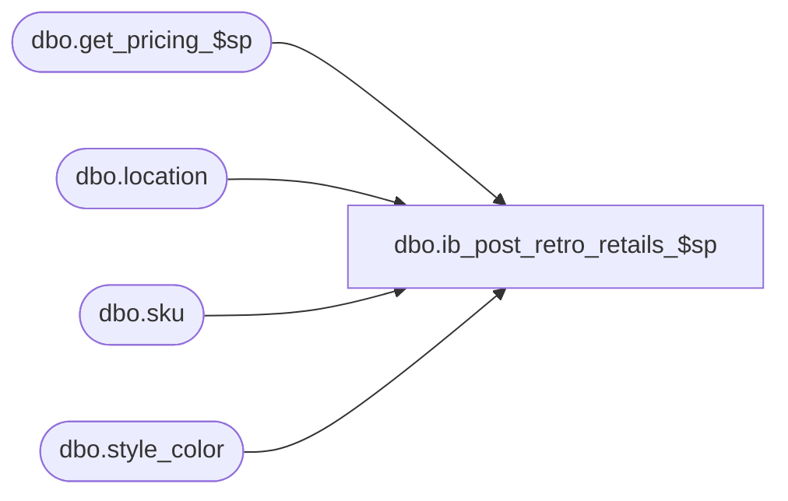

# dbo.ib_post_retro_retails_$sp

**Database:** me_01  
**Server:** bedrockdb02  

## Architecture Diagram



## Table Dependencies

| Referenced Table |
|---|
| dbo.get_pricing_$sp |
| dbo.location |
| dbo.sku |
| dbo.style_color |

## Stored Procedure Code

```sql
CREATE PROCEDURE dbo.ib_post_retro_retails_$sp

	(
		 @LocId AS SMALLINT
		,@TransDate AS DATETIME = NULL -- FYI: No longer needed and should be removed at a later point
	)

AS

SET NOCOUNT ON


-----------------------------------------------------------------------------------------------------------------------------
--	Declarations / Sets: Declare And Set Variables
-----------------------------------------------------------------------------------------------------------------------------

DECLARE
	 @Date AS SMALLDATETIME
	,@JurisdictionId AS SMALLINT


DECLARE @Expand_And_Multiply AS TABLE

	(
		 expansion_level INT NULL
		,multiplier INT NULL
	)


SET @Date = GETDATE ()


SET @JurisdictionId = (SELECT L.jurisdiction_id FROM dbo.location L WHERE L.location_id = @LocId)


INSERT INTO @Expand_And_Multiply

	(
		 expansion_level
		,multiplier
	)

VALUES
	 (1, -1)
	,(2, 1)
	,(3, NULL)


-----------------------------------------------------------------------------------------------------------------------------
--	Error Trapping: Check If Temp Table(s) Already Exist(s) And Drop If Applicable
-----------------------------------------------------------------------------------------------------------------------------

IF OBJECT_ID (N'tempdb.dbo.#temp_retro_prices', N'U') IS NOT NULL
BEGIN

	DROP TABLE dbo.#temp_retro_prices

END


IF OBJECT_ID (N'tempdb.dbo.#temp_wrk_price_lookup', N'U') IS NOT NULL
BEGIN

	DROP TABLE dbo.#temp_wrk_price_lookup

END


-----------------------------------------------------------------------------------------------------------------------------
--	Table Create: Create Table Shells
-----------------------------------------------------------------------------------------------------------------------------

CREATE TABLE dbo.#temp_retro_prices

	(
		 location_id SMALLINT NULL
		,sku_id DECIMAL (13, 0) NULL
		,document_number NVARCHAR (20)
		,effective_date SMALLDATETIME
		,price_change_type SMALLINT
		,new_price_status_id SMALLINT NULL
		,new_val_unit_retail DECIMAL (14, 2) NULL
		,new_sell_unit_retail DECIMAL (14, 2) NULL
	)


CREATE TABLE dbo.#temp_wrk_price_lookup

	(
		 jurisdiction_id SMALLINT NULL
		,location_id SMALLINT NULL
		,style_id DECIMAL (12, 0) NULL
		,color_id SMALLINT NULL
		,style_color_id DECIMAL (13, 0) NULL
		,sku_id DECIMAL (13, 0) NULL
	)


-----------------------------------------------------------------------------------------------------------------------------
--	Populate Data And Call Pricing Procedure
-----------------------------------------------------------------------------------------------------------------------------

INSERT INTO dbo.#temp_wrk_price_lookup

	(
		 jurisdiction_id
		,location_id
		,style_id
		,color_id
		,style_color_id
		,sku_id
	)

SELECT DISTINCT
	 @JurisdictionId AS jurisdiction_id
	,@LocId AS location_id
	,SK.style_id
	,SC.color_id
	,SK.style_color_id
	,ttIBI.sku_id
FROM
	#tt_ib_inventory ttIBI
	INNER JOIN dbo.sku SK ON SK.sku_id = ttIBI.sku_id
	INNER JOIN dbo.style_color SC ON SC.style_color_id = SK.style_color_id
WHERE
	ttIBI.location_id = @LocId


EXECUTE dbo.get_pricing_$sp

	 @Date = @Date
	,@Exclude_NULL_Results = 0
	,@Group_ID = NULL
	,@Include_Exception_Color = 1
	,@Include_Exception_Color_Location = 1
	,@Include_Exception_Color_SKU = 1
	,@Include_Exception_Color_SKU_Location = 1
	,@Include_Exception_Location = 1
	,@Include_Exception_None = 1
	,@Output_All_Exception_Values = 0 -- Not Longer Used, Needs To Be Removed From Procedure And Application Code
	,@Price_Change_ID = NULL
	,@Results_To_Table = 0
	,@Temp_Price_Flag = 0
	,@Use_PC_Instruction_Mode = 0
	,@Use_Start_Date = 0
	,@Sales_Posting_Mode = NULL
	,@Use_PI_Mode = 0
	,@Use_Post_Retro_Mode = 1


-----------------------------------------------------------------------------------------------------------------------------
--	Populate #tt_ib_inventory Table
-----------------------------------------------------------------------------------------------------------------------------

INSERT INTO #tt_ib_inventory

	(
		 sku_id
		,location_id
		,inventory_status_id
		,price_status_id
		,transaction_type_code
		,document_number
		,transaction_date
		,transaction_units
		,transaction_cost
		,transaction_cost_local
		,transaction_valuation_retail
		,transaction_selling_retail
		,price_change_type
		,units_affected
	)

SELECT
	 sqFR.sku_id
	,sqFR.location_id
	,sqFR.inventory_status_id
	,sqFR.price_status_id
	,sqFR.transaction_type_code
	,sqFR.document_number
	,sqFR.transaction_date
	,sqFR.transaction_units
	,sqFR.transaction_cost
	,sqFR.transaction_cost_local
	,sqFR.transaction_valuation_retail
	,sqFR.transaction_selling_retail
	,sqFR.price_change_type
	,sqFR.units_affected
FROM

	(
		SELECT
			 (CASE
				WHEN tvEAM.expansion_level = 1 AND ttRP.price_change_type IN (0, 2) THEN 0
				WHEN tvEAM.expansion_level = 2 AND ttRP.price_change_type IN (0, 2) THEN 1
				WHEN tvEAM.expansion_level = 3 AND ttRP.price_change_type IN (0, 2) THEN 2
				WHEN tvEAM.expansion_level = 3 AND ttRP.price_change_type NOT IN (0, 2) THEN 3
				WHEN tvEAM.expansion_level = 1 AND ttRP.price_change_type NOT IN (0, 2) THEN 4
				WHEN tvEAM.expansion_level = 2 AND ttRP.price_change_type NOT IN (0, 2) THEN 5
				END) AS insert_priority
			,ttIBI.sku_id
			,ttIBI.location_id
			,ttIBI.inventory_status_id
			,(CASE
				WHEN tvEAM.expansion_level = 1 THEN ttIBI.price_status_id
				WHEN tvEAM.expansion_level IN (2, 3) THEN ttRP.new_price_status_id
				END) AS price_status_id
			,(CASE
				WHEN tvEAM.expansion_level IN (1, 2) THEN 710 -- Price Status Change / Lookup Values Found By Querying: SELECT * FROM dbo.transaction_type
				WHEN tvEAM.expansion_level = 3 THEN 700 -- Effective Price Change / Lookup Values Found By Querying: SELECT * FROM dbo.transaction_type
				END) AS transaction_type_code
			,ttRP.document_number
			,ttRP.effective_date AS transaction_date
			,(CASE
				WHEN tvEAM.expansion_level IN (1, 2) THEN tvEAM.multiplier * ttIBI.transaction_units
				WHEN tvEAM.expansion_level = 3 THEN 0
				END) AS transaction_units
			,(CASE
				WHEN tvEAM.expansion_level IN (1, 2) THEN tvEAM.multiplier * ttIBI.transaction_cost
				WHEN tvEAM.expansion_level = 3 THEN 0
				END) AS transaction_cost
			,(CASE
				WHEN tvEAM.expansion_level IN (1, 2) THEN tvEAM.multiplier * ttIBI.transaction_cost_local
				WHEN tvEAM.expansion_level = 3 THEN 0
				END) AS transaction_cost_local
			,(CASE
				WHEN tvEAM.expansion_level IN (1, 2) THEN tvEAM.multiplier * ttIBI.transaction_valuation_retail
				WHEN tvEAM.expansion_level = 3 THEN (ttIBI.transaction_units * ttRP.new_val_unit_retail) - ttIBI.transaction_valuation_retail
				END) AS transaction_valuation_retail
			,(CASE
				WHEN tvEAM.expansion_level IN (1, 2) THEN tvEAM.multiplier * ttIBI.transaction_selling_retail
				WHEN tvEAM.expansion_level = 3 THEN (ttIBI.transaction_units * ttRP.new_sell_unit_retail) - ttIBI.transaction_selling_retail
				END) AS transaction_selling_retail
			,ttRP.price_change_type
			,ttIBI.transaction_units AS units_affected
		FROM
			#tt_ib_inventory ttIBI
			INNER JOIN dbo.#temp_retro_prices ttRP ON ttRP.location_id = ttIBI.location_id
				AND ttRP.sku_id = ttIBI.sku_id
			CROSS JOIN @Expand_And_Multiply tvEAM
		WHERE
			(
				(
					tvEAM.expansion_level IN (1, 2)
					AND ttRP.new_price_status_id <> ttIBI.price_status_id
				)
				OR
				(
					tvEAM.expansion_level = 3
					AND (ttIBI.transaction_units * ttRP.new_val_unit_retail) - ttIBI.transaction_valuation_retail <> 0
				)
			)
	) sqFR

ORDER BY
	sqFR.insert_priority
```

