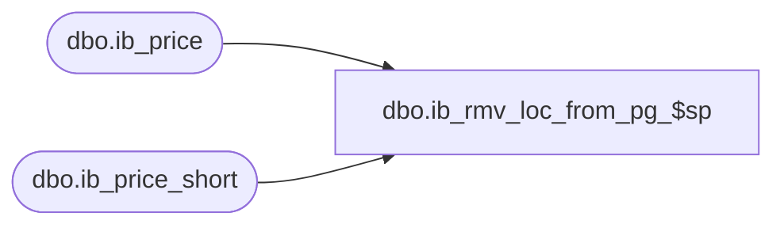

# dbo.ib_rmv_loc_from_pg_$sp

**Database:** me_01  
**Server:** bedrockdb02  

## Architecture Diagram



## Table Dependencies

| Referenced Table |
|---|
| dbo.ib_price |
| dbo.ib_price_short |

## Stored Procedure Code

```sql
CREATE PROCEDURE [dbo].[ib_rmv_loc_from_pg_$sp]
( @i_pricing_group_id SMALLINT, @i_location_id SMALLINT )

AS
/*
	Version		: 1.00
	Created		: July 2012
	Created by	: Sameer Patel
	Description	: Procedure called by IB 
					  Inserts location excpetions into ib_price_short when a location is removed from a pricing group
					  Updates ib_price for the pricing group and location passed in
				  
	Call from C++ code:
		-- File: STSIBRetailPrice
		-- Class: CSTSIBRetailPrice
		-- Function: DoRemoveLocationFromPricingGroup
*/

	DECLARE @error_msg NVARCHAR(2000), @batch_size INT
		
	SET @batch_size = 20000
		
	BEGIN TRY
		
		IF NOT object_id(N'tempdb..#result_set') IS NULL
		DROP TABLE #result_set

		CREATE TABLE #result_set
			( id INT IDENTITY(1,1)
			, ib_price_id DECIMAL(12)
			, style_id DECIMAL(12), color_id SMALLINT, location_id SMALLINT, jurisdiction_id SMALLINT, pricing_group_id SMALLINT
			, temp_price_flag BIT
			, start_date SMALLDATETIME, end_date SMALLDATETIME
			, valuation_retail_price DECIMAL(14,2), selling_retail_price DECIMAL(14,2), price_status_id SMALLINT
			, document_number NVARCHAR(20)
			, cancel_promo_flag BIT, effective_date SMALLDATETIME, price_change_type SMALLINT
			, PRIMARY KEY (id)
			, UNIQUE (ib_price_id) )

		INSERT INTO #result_set
			( ib_price_id
			, style_id, color_id, location_id, jurisdiction_id, pricing_group_id
			, temp_price_flag
			, start_date, end_date
			, valuation_retail_price, selling_retail_price, price_status_id
			, document_number
			, cancel_promo_flag, effective_date, price_change_type )
		SELECT
			ib_price_id
			, style_id, color_id, location_id, jurisdiction_id, pricing_group_id
			, temp_price_flag
			, start_date, end_date
			, valuation_retail_price, selling_retail_price, price_status_id
			, document_number
			, cancel_promo_flag, effective_date, price_change_type
		FROM
			ib_price
		WHERE
			pricing_group_id = @i_pricing_group_id AND location_id = @i_location_id
		ORDER BY 
			ib_price_id	
		
		DECLARE @min_id INT, @max_id INT, @batch_max_id INT
		SELECT 
			@min_id = 0
			, @batch_max_id = 0
			, @max_id = COALESCE(MAX(id), 0)
		FROM
			#result_set
			
		WHILE (@batch_max_id <> @max_id)
		BEGIN
		
			IF (@min_id + @batch_size < @max_id)
				SET @batch_max_id = @min_id + @batch_size
			ELSE
				SET @batch_max_id = @max_id
				
			SET IDENTITY_INSERT ib_price_short ON
			
			INSERT INTO ib_price_short
				( ib_price_id
				, style_id, color_id, location_id, jurisdiction_id, pricing_group_id
				, temp_price_flag
				, start_date, end_date
				, valuation_retail_price, selling_retail_price, price_status_id
				, document_number
				, cancel_promo_flag, effective_date, price_change_type )
			SELECT
				ib_price_id
				, style_id, color_id, location_id, jurisdiction_id, NULL pricing_group_id
				, temp_price_flag
				, start_date, end_date
				, valuation_retail_price, selling_retail_price, price_status_id
				, document_number
				, cancel_promo_flag, effective_date, price_change_type
			FROM
				#result_set
			WHERE
				id > @min_id AND id <= @batch_max_id
			ORDER BY
				ib_price_id
				
			SET IDENTITY_INSERT ib_price_short OFF
				
			SET @min_id = @batch_max_id
				
		END
		
		UPDATE ib_price
		SET
			pricing_group_id = NULL
		WHERE
			pricing_group_id = @i_pricing_group_id AND location_id = @i_location_id

	END TRY

	BEGIN CATCH

		SET @error_msg = N'Error in procedure ib_rmv_loc_from_pg_$sp: ' 
										+ CAST(ERROR_NUMBER() AS NVARCHAR) + N' ' + ERROR_MESSAGE()
										
		RAISERROR (@error_msg, 16, 1)

	END CATCH
```

