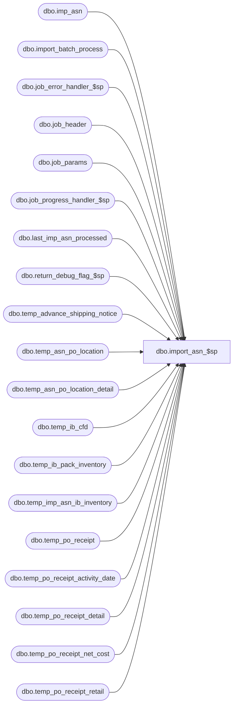

# dbo.import_asn_$sp

**Database:** me_01  
**Server:** bedrockdb02  

## Architecture Diagram



## Table Dependencies

| Referenced Table |
|---|
| dbo.imp_asn |
| dbo.import_batch_process |
| dbo.job_error_handler_$sp |
| dbo.job_header |
| dbo.job_params |
| dbo.job_progress_handler_$sp |
| dbo.last_imp_asn_processed |
| dbo.return_debug_flag_$sp |
| dbo.temp_advance_shipping_notice |
| dbo.temp_asn_po_location |
| dbo.temp_asn_po_location_detail |
| dbo.temp_ib_cfd |
| dbo.temp_ib_pack_inventory |
| dbo.temp_imp_asn_ib_inventory |
| dbo.temp_po_receipt |
| dbo.temp_po_receipt_activity_date |
| dbo.temp_po_receipt_detail |
| dbo.temp_po_receipt_net_cost |
| dbo.temp_po_receipt_retail |

## Stored Procedure Code

```sql
CREATE PROCEDURE [dbo].[import_asn_$sp]

AS

/*
  Version		: 1.00
  Created		: 2007/04/24
  Created by	: Pierrette Lemay
  Description	: This procedure is called by the .NET component that control the import ASN process.
          It truncate the temporary tables that will be populated during this process and creates new jobs in the job_header table of type 10.
*/

BEGIN
  DECLARE @line_id SMALLINT, @job_id INT, @job_type INT, @c_true BIT, @c_false BIT, @proc_name NVARCHAR(30), @sql_err_num DECIMAL(38,0), @debug_flag BIT,
      @table_name	NVARCHAR(30), @operation_name NVARCHAR(30), @error_msg NVARCHAR(2000), @post_layaway_as_sale BIT, @job_batch_size INT, @done BIT,
      @start_imp_asn_id DECIMAL(12), @end_imp_asn_id DECIMAL(12), @min_imp_asn_id DECIMAL(12), @max_imp_asn_id DECIMAL(12),
      @last_imp_asn_id DECIMAL(12), @new_imp_asn_id DECIMAL(12), @original_imp_asn_id DECIMAL(12)

  SELECT @line_id = 10,
       @job_type = 10,
       @job_id  = -1,
       @proc_name = N'import_asn_$sp',
       @done	= 0,
       @c_true	= 1,
       @c_false = 0;

  BEGIN TRY
    -- Get posting parameters
    SELECT  @job_batch_size  = job_batch_size
    FROM job_params
    WHERE job_type = @job_type;

    -- Log progress if job_params.debug_flag is true
    EXEC return_debug_flag_$sp @job_type, @debug_flag OUT
    IF @debug_flag = @c_true
      EXEC job_progress_handler_$sp @job_type, @job_id, @proc_name, @line_id;

    SET @line_id = 20;
    -- Truncate temporary tables

    TRUNCATE TABLE temp_advance_shipping_notice;
    TRUNCATE TABLE temp_asn_po_location;
    TRUNCATE TABLE temp_asn_po_location_detail;
    TRUNCATE TABLE temp_po_receipt;
    TRUNCATE TABLE temp_po_receipt_detail;
    TRUNCATE TABLE temp_po_receipt_net_cost;
    TRUNCATE TABLE temp_po_receipt_retail;
    TRUNCATE TABLE temp_po_receipt_activity_date;
    TRUNCATE TABLE temp_imp_asn_ib_inventory;
    TRUNCATE TABLE temp_ib_pack_inventory;
    TRUNCATE TABLE temp_ib_cfd;

    -- Log progress if job_params.debug_flag is true
    EXEC return_debug_flag_$sp @job_type, @debug_flag OUT
    IF @debug_flag = @c_true
      EXEC job_progress_handler_$sp @job_type, @job_id, @proc_name, @line_id;

    SET @line_id = 25;
    -- Update statistics on import tables
    UPDATE STATISTICS imp_asn;
    UPDATE STATISTICS imp_asn_sku;

    -- Log progress if job_params.debug_flag is true
    EXEC return_debug_flag_$sp @job_type, @debug_flag OUT
    IF @debug_flag = @c_true
      EXEC job_progress_handler_$sp @job_type, @job_id, @proc_name, @line_id;

    SET @line_id = 30;

    -- If the client just started using this new segment then
    -- last_imp_asn_processed could have a wrong value and we need to adjust the imp_asn_id
    SELECT @last_imp_asn_id = imp_asn_id FROM last_imp_asn_processed;

    IF (@last_imp_asn_id < 0)
    BEGIN
      -- If this value not set, we cannot process
      RAISERROR (N'Error: Table last_imp_asn_processed is not populated, system does not know the value of imp_asn_id to start processing.   job_id: %d', -- Message text.
               16, -- Severity.
               1, -- State.
               @job_id)
    END

    -- Log progress if job_params.debug_flag is true
    EXEC return_debug_flag_$sp @job_type, @debug_flag OUT
    IF @debug_flag = @c_true
      EXEC job_progress_handler_$sp @job_type, @job_id, @proc_name, @line_id;

    SET @line_id = 40;
    -- Get the range of imp_asn_id for which we beed to create new jobs if required.

    SELECT @start_imp_asn_id = l.imp_asn_id + 1,
          @end_imp_asn_id = MAX(i.imp_asn_id)
    FROM imp_asn i, last_imp_asn_processed l
    GROUP BY l.imp_asn_id;

    -- Log progress if job_params.debug_flag is true
    EXEC return_debug_flag_$sp @job_type, @debug_flag OUT
    IF @debug_flag = @c_true
      EXEC job_progress_handler_$sp @job_type, @job_id, @proc_name, @line_id;

    SET @line_id = 50;
    -- Get the ranges of imp_asn_id that will be assign to a specific job until we reach the end of the queue imp_asn.

    BEGIN TRAN;

    WHILE (@start_imp_asn_id <= @end_imp_asn_id)
    BEGIN

      IF EXISTS (SELECT 1 FROM imp_asn WHERE imp_asn_id BETWEEN @start_imp_asn_id AND @start_imp_asn_id + @job_batch_size)
      BEGIN

        INSERT INTO job_header
          ( job_type
          , range_start
          , range_end
          , batch_start
          , batch_end
          , completed_flag
          , debug_flag )
        SELECT
          @job_type
          , MIN(imp_asn_id)
          , MAX(imp_asn_id)
          , -1
          , -1
          , @c_false
          , @c_false
        FROM
          imp_asn
        WHERE
          imp_asn_id BETWEEN @start_imp_asn_id AND @start_imp_asn_id + @job_batch_size

      END

      SET @start_imp_asn_id = @start_imp_asn_id + @job_batch_size + 1

    END

    -- Log progress if job_params.debug_flag is true
    EXEC return_debug_flag_$sp @job_type, @debug_flag OUT
    IF @debug_flag = @c_true
      EXEC job_progress_handler_$sp @job_type, @job_id, @proc_name, @line_id;

    SET @line_id = 60;

    IF (@end_imp_asn_id IS NOT NULL)
    BEGIN

      UPDATE last_imp_asn_processed
      SET imp_asn_id = @end_imp_asn_id;

    END

    COMMIT TRAN;

    -- Log progress if job_params.debug_flag is true
    EXEC return_debug_flag_$sp @job_type, @debug_flag OUT
    IF @debug_flag = @c_true
      EXEC job_progress_handler_$sp @job_type, @job_id, @proc_name, @line_id;

    SET @line_id = 70;
    -- We need to keep track of th ejobs part of this posting process
    -- Start by deleting the previous process
    BEGIN TRAN

    DELETE import_batch_process WHERE job_type = 10;

    INSERT INTO import_batch_process
      (job_type, process_date, job_id)
    SELECT 10, GETDATE(), job_id
    FROM job_header
    WHERE job_type = 10
    AND completed_flag = 0;

    COMMIT TRAN;

    -- Log progress if job_params.debug_flag is true
    EXEC return_debug_flag_$sp @job_type, @debug_flag OUT;
    IF @debug_flag = @c_true
      EXEC job_progress_handler_$sp @job_type, @job_id, @proc_name, @line_id;

  END TRY

  BEGIN CATCH
    SELECT @error_msg		= ERROR_MESSAGE()
       , @sql_err_num		= ERROR_NUMBER();

    -- Test if the transaction is uncommittable.
    IF (XACT_STATE()) = -1
      ROLLBACK TRANSACTION

    -- Test if the transaction is active and valid.
    IF (XACT_STATE()) = 1
      COMMIT TRANSACTION

    IF @line_id = 10
      SELECT  @table_name			= N'job_params'
          , @operation_name	= N'SELECT'
    ELSE IF @line_id = 20
      SELECT  @table_name			= N'temp_*'
          , @operation_name	= N'TRUNCATE'
    ELSE IF @line_id = 25
      SELECT  @table_name			= N'imp_asn'
          , @operation_name	= N'UPDATE STATISTICS'
    ELSE IF @line_id = 30
      SELECT  @table_name			= N'last_imp_asn_processed'
          , @operation_name	= N'UPDATE'
    ELSE IF @line_id = 40
      SELECT  @table_name			= N'imp_asn'
          , @operation_name	= N'SELECT'
    ELSE IF @line_id = 50
      SELECT  @table_name			= N'job_header'
          , @operation_name	= N'INSERT'
    ELSE IF @line_id = 60
      SELECT  @table_name			= N'last_imp_asn_processed'
          , @operation_name	= N'UPDATE'
    ELSE IF @line_id = 70
      SELECT  @table_name			= N'import_batch_process'
          , @operation_name	= N'INSERT'

    EXEC job_error_handler_$sp
          @job_type
          , @job_id
          , @proc_name
          , @line_id
          , @sql_err_num
          , @table_name
          , @operation_name
          , @error_msg
          , @c_true
  END CATCH
END
```

