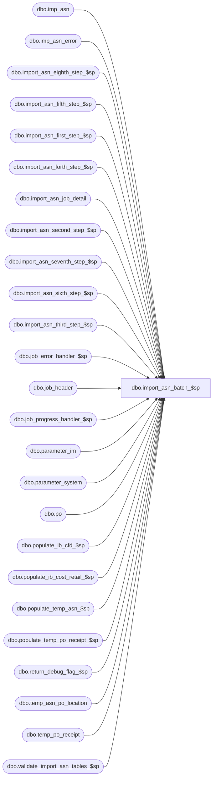

# dbo.import_asn_batch_$sp

**Database:** me_01  
**Server:** bedrockdb02  

## Architecture Diagram



## Table Dependencies

| Referenced Table |
|---|
| dbo.imp_asn |
| dbo.imp_asn_error |
| dbo.import_asn_eighth_step_$sp |
| dbo.import_asn_fifth_step_$sp |
| dbo.import_asn_first_step_$sp |
| dbo.import_asn_forth_step_$sp |
| dbo.import_asn_job_detail |
| dbo.import_asn_second_step_$sp |
| dbo.import_asn_seventh_step_$sp |
| dbo.import_asn_sixth_step_$sp |
| dbo.import_asn_third_step_$sp |
| dbo.job_error_handler_$sp |
| dbo.job_header |
| dbo.job_progress_handler_$sp |
| dbo.parameter_im |
| dbo.parameter_system |
| dbo.po |
| dbo.populate_ib_cfd_$sp |
| dbo.populate_ib_cost_retail_$sp |
| dbo.populate_temp_asn_$sp |
| dbo.populate_temp_po_receipt_$sp |
| dbo.return_debug_flag_$sp |
| dbo.temp_asn_po_location |
| dbo.temp_po_receipt |
| dbo.validate_import_asn_tables_$sp |

## Stored Procedure Code

```sql
CREATE PROCEDURE [dbo].[import_asn_batch_$sp]
  (@job_id INT)

AS

/*
  Version		: 1.00
  Created		: 2010/09/28
  Created by	: Pierrette Lemay
  Description	: This procedure executes the ASN import for a particular job_id passed as an in parameter
          which correspond to a particular row in job_header table where the completed_flag is not set.
          It's launched by a .NET application that manages the execution of many instances in parallel.
  Defect 125701 & 125702: Prevent deadlocks on ib_activity_date: remove the update of job_header to flag the job as completed.
          This is done now in import_asn_complete_$sp
          because a new step has been added and when this step completed then job_header is updated.
  Date		developer	defect/description
  2014/08/12	Feng		ME5.0.FT62701.Wholesale Integration (In-transit inventory) UC008 – Generate ASN Receipts - ASN Import Via Pipeline  & XML Coding
              table po_receipt: added shipped_date, track_in_transit_flag, discrepancy_posted
              table po_receipt_detail: added units_shipped
              vendor table asn_auto_receive_flag does not used anymore, which has been replaced by track_in_transit_flag and combined with asn_auto_generate_po_rcpt_status (1-Preliminary, 2-Shipped, 3-Received)
              if track_in_transit_flag = true, asn_auto_generate_po_rcpt_status could only have value 1 (Preliminary) or 2 (Shipped) or 3 (Received).
              For the PO Receipt generated with Shipped or Received status, we need to call third, forth, fifth, sixth step's Store Procedures for updating IB (ib_inventory, ib_inventory_total, ib_pack_inventory, ib_pack_inventory_total, ib_cost_factor_discount, ib_packcost and ib_activity_date, ib_on_order, ib_on_order_total, style status).
*/

BEGIN
  DECLARE @line_id SMALLINT, @count INT, @job_type TINYINT, @proc_name NVARCHAR(30), @sql_err_num DECIMAL(38,0),
      @table_name	NVARCHAR(30), @operation_name NVARCHAR(30), @error_msg NVARCHAR(2000), @return_flag BIT,
      @second_step TINYINT, @third_step TINYINT, @forth_step TINYINT, @fifth_step TINYINT, @rtp_print_option TINYINT,
      @debug_flag BIT, @c_true BIT, @c_false BIT, @n_retry tinyint, @delay NCHAR(8), @gen_po_receipt_flag BIT,
      @range_start DECIMAL(24,0), @range_end DECIMAL(24,0), @sixth_step TINYINT, @seventh_step TINYINT, @eighth_step TINYINT,
      @installed_replen_flag BIT, @po_receipt_received_flag BIT, @installed_invmtch_flag bit, @rtp_allow_override_flag BIT,
      @po_receipt_shipped_flag BIT, @asn_for_dsi_po_flag BIT;

  SELECT @job_type	= 10
    , @proc_name	= N'import_asn_batch_$sp'
    , @c_false		= 0
    , @c_true		= 1
    , @second_step	= 2
    , @third_step	= 3
    , @forth_step	= 4
    , @fifth_step	= 5
    , @sixth_step	= 6
    , @seventh_step	= 7
    , @eighth_step	= 8
    , @po_receipt_received_flag = 0
    , @po_receipt_shipped_flag = 0
    , @installed_replen_flag = installed_replen_flag
    , @installed_invmtch_flag = installed_invmtch_flag
    , @rtp_print_option = rtp_print_options
    , @rtp_allow_override_flag = rtp_allow_override_flag
        , @asn_for_dsi_po_flag = 0
  FROM parameter_system;

  BEGIN TRY

    -- GetJobs parameters
    SET @line_id = 10;

    SELECT	@range_start = range_start,
          @range_end = range_end,
          @debug_flag	= debug_flag
    FROM job_header WITH (NOLOCK)
    WHERE job_id = @job_id
    AND job_type = @job_type;

    IF @@ROWCOUNT = 0
      RAISERROR (N'Error: job #%i is missing in the job_header table.', -- Message text.
               16, -- Severity.
               1, -- State.
               @job_id);

    -- Log progress if job_params.debug_flag is true OR job_header.debug_flag is true
    EXEC return_debug_flag_$sp @job_type, @return_flag OUT;
    IF (@return_flag = @c_true OR @debug_flag = @c_true)
      EXEC job_progress_handler_$sp @job_type, @job_id, @proc_name, @line_id ;

    SET @line_id = 20;
    -- Set start_time for the current job
    BEGIN TRANSACTION;

    UPDATE job_header
    SET start_time = GETDATE()
    WHERE job_id = @job_id
    AND job_type = @job_type;

    IF @@ROWCOUNT = 0
      RAISERROR (N'Error: unable to set the start_time for job #%i.', -- Message text.
          16, -- Severity.
          1, -- State.
          @job_id);

    COMMIT TRANSACTION;

    -- Log progress if job_params.debug_flag is true OR job_header.debug_flag is true
    EXEC return_debug_flag_$sp @job_type, @return_flag OUT;
    IF (@return_flag = @c_true OR @debug_flag = @c_true)
      EXEC job_progress_handler_$sp @job_type, @job_id, @proc_name, @line_id ;

    SELECT @count = COUNT(*) FROM import_asn_job_detail WITH (NOLOCK) WHERE job_id = @job_id;
    -- validations have to take place only this first time a job processed
    -- once one of the transactions is completed it means it's re-processing and the validations could be skipped.
    IF (@count = 0)
    BEGIN
      SET @line_id = 30;

      EXEC validate_import_asn_tables_$sp @job_id;

      -- Log progress if job_params.debug_flag is true OR job_header.debug_flag is true
      EXEC return_debug_flag_$sp @job_type, @return_flag OUT;
      IF (@return_flag = @c_true OR @debug_flag = @c_true)
        EXEC job_progress_handler_$sp @job_type, @job_id, @proc_name, @line_id ;
    END;

    -- Log progress if job_params.debug_flag is true OR job_header.debug_flag is true
    EXEC return_debug_flag_$sp @job_type, @return_flag OUT;
    IF (@return_flag = @c_true OR @debug_flag = @c_true)
      EXEC job_progress_handler_$sp @job_type, @job_id, @proc_name, @line_id ;

    SET @line_id = 40;

    EXEC populate_temp_asn_$sp @job_id;

    -- Log progress if job_params.debug_flag is true OR job_header.debug_flag is true
    EXEC return_debug_flag_$sp @job_type, @return_flag OUT;
    IF (@return_flag = @c_true OR @debug_flag = @c_true)
      EXEC job_progress_handler_$sp @job_type, @job_id, @proc_name, @line_id ;

    SET @line_id = 50;

    SELECT @gen_po_receipt_flag = gen_po_receipt_for_asn_flag FROM parameter_im WITH (NOLOCK);

        -- Find out if there are ASNs for DSI POs
      SELECT @asn_for_dsi_po_flag =
            CASE WHEN COUNT(*) > 0 then 1
            ELSE 0
            END
      FROM temp_asn_po_location t, po (NOLOCK)  WHERE job_id = @job_id
            AND t.po_id = po.po_id
            AND po.special_order_flag = 1 AND po.predistribution_type = 2 AND po.source = 6  --DSI PO

    -- Log progress if job_params.debug_flag is true OR job_header.debug_flag is true
    EXEC return_debug_flag_$sp @job_type, @return_flag OUT;
    IF (@return_flag = @c_true OR @debug_flag = @c_true)
      EXEC job_progress_handler_$sp @job_type, @job_id, @proc_name, @line_id;

    IF (@gen_po_receipt_flag = 1 OR @asn_for_dsi_po_flag = 1)
    BEGIN
      SET @line_id = 60;

      EXEC populate_temp_po_receipt_$sp @job_id;

      -- Log progress if job_params.debug_flag is true OR job_header.debug_flag is true
      EXEC return_debug_flag_$sp @job_type, @return_flag OUT;
      IF (@return_flag = @c_true OR @debug_flag = @c_true)
        EXEC job_progress_handler_$sp @job_type, @job_id, @proc_name, @line_id ;

      SET @line_id = 65;

      EXEC populate_ib_cost_retail_$sp @job_id;

      -- Log progress if job_params.debug_flag is true OR job_header.debug_flag is true
      EXEC return_debug_flag_$sp @job_type, @return_flag OUT;
      IF (@return_flag = @c_true OR @debug_flag = @c_true)
        EXEC job_progress_handler_$sp @job_type, @job_id, @proc_name, @line_id;

      SET @line_id = 70;

      EXEC populate_ib_cfd_$sp @job_id;

      -- Find out if there is po_receipt document created in state Received or In Transit
      SELECT @po_receipt_received_flag =
            CASE WHEN COUNT(*) > 0 then 1
            ELSE 0
            END
      FROM temp_po_receipt WHERE job_id = @job_id AND state_no IN (2);

      -- Find out if there is po_receipt document created in state Received or In Transit
      SELECT @po_receipt_shipped_flag =
            CASE WHEN COUNT(*) > 0 then 1
            ELSE 0
            END
      FROM temp_po_receipt WHERE job_id = @job_id AND state_no IN (8);

      -- Log progress if job_params.debug_flag is true OR job_header.debug_flag is true
      EXEC return_debug_flag_$sp @job_type, @return_flag OUT;
      IF (@return_flag = @c_true OR @debug_flag = @c_true)
        EXEC job_progress_handler_$sp @job_type, @job_id, @proc_name, @line_id;
    END;

    SET @line_id = 80;
    -- Verify if there's any valid data left to be processed, if not then quit
    SELECT @count = COUNT(*)
    FROM   imp_asn i WITH (NOLOCK)
    WHERE  i.imp_asn_id BETWEEN @range_start AND @range_end
      AND NOT EXISTS
        (SELECT 1
         FROM imp_asn_error r WITH (NOLOCK)
         WHERE i.imp_asn_id = r.imp_asn_id
          AND r.imp_asn_id BETWEEN @range_start AND @range_end)

    IF (@count = 0)
    BEGIN
      UPDATE h
        SET end_time = GETDATE(),
           completed_flag = 1
      FROM   job_header h WITH (NOLOCK)
      WHERE  h.job_id = @job_id
         AND h.job_type = @job_type;

      RETURN;
    END

    -- Log progress if job_params.debug_flag is true OR job_header.debug_flag is true
    EXEC return_debug_flag_$sp @job_type, @return_flag OUT;
    IF (@return_flag = @c_true OR @debug_flag = @c_true)
      EXEC job_progress_handler_$sp @job_type, @job_id, @proc_name, @line_id;

    -- Do only the steps that wasn't done previously (re-startability)
    SELECT @count = COUNT(*) FROM import_asn_job_detail  WITH (NOLOCK) WHERE job_id = @job_id AND job_step_id <> 9;

    IF @count = 0
    BEGIN
      SET @line_id = 90;
      -- Create advance_shipping_notice document.
      EXEC import_asn_first_step_$sp @job_id, @debug_flag;

      EXEC return_debug_flag_$sp @job_type, @return_flag OUT;
      IF (@return_flag = @c_true OR @debug_flag = @c_true)
        EXEC job_progress_handler_$sp @job_type, @job_id, @proc_name, @line_id;
    END -- first step completed

    IF @count <= 1
    BEGIN
      SET @line_id = 100
      -- Create po_receipt document.
      IF (@gen_po_receipt_flag = 1 OR @asn_for_dsi_po_flag = 1)
        EXEC import_asn_second_step_$sp @job_id, @debug_flag;
      ELSE
      BEGIN
        BEGIN TRAN
        -- Keep track of this job_step completed in job_detail
        INSERT INTO import_asn_job_detail
           (job_id, job_step_id, time_stamp)
        VALUES (@job_id, @second_step, GETDATE());

        COMMIT TRAN;

        -- Log progress if job_params.debug_flag is true OR job_header.debug_flag is true
        EXEC return_debug_flag_$sp @job_type, @return_flag OUT
        IF (@return_flag = @c_true OR @debug_flag = @c_true)
          EXEC job_progress_handler_$sp @job_type, @job_id, @proc_name, @line_id;
      END
    END -- second step completed

    IF @count <= 2
    BEGIN
      SET @line_id = 110;
      -- UPDATE IB only if there is po_receipt document created with state Received
      IF (@po_receipt_received_flag = 1 OR @po_receipt_shipped_flag = 1)
        EXEC import_asn_third_step_$sp @job_id, @debug_flag;
      ELSE
      BEGIN
        BEGIN TRAN
        -- Keep track of this job_step completed in job_detail
        INSERT INTO import_asn_job_detail
           (job_id, job_step_id, time_stamp)
        VALUES (@job_id, @third_step, GETDATE());

        COMMIT TRAN;

        -- Log progress if job_params.debug_flag is true OR job_header.debug_flag is true
        EXEC return_debug_flag_$sp @job_type, @return_flag OUT
        IF (@return_flag = @c_true OR @debug_flag = @c_true)
          EXEC job_progress_handler_$sp @job_type, @job_id, @proc_name, @line_id;
      END
    END -- third step completed

    IF @count <= 3
    BEGIN
      SET  @line_id = 120;
      -- Create 110 and 115 transactions in ib_on_order only if there is po_receipt document created with state Received or In Transit
      IF (@po_receipt_received_flag = 1 OR @po_receipt_shipped_flag = 1)
        EXEC import_asn_forth_step_$sp @job_id, @debug_flag;
      ELSE
      BEGIN
        BEGIN TRAN

        INSERT INTO import_asn_job_detail (job_id, job_step_id, time_stamp)
        VALUES (@job_id, @forth_step, GETDATE());

        COMMIT TRAN

        -- Log progress if job_params.debug_flag is true OR job_header.debug_flag is true
        EXEC return_debug_flag_$sp @job_type, @return_flag OUT
        IF (@return_flag = @c_true OR @debug_flag = @c_true)
          EXEC job_progress_handler_$sp @job_type, @job_id, @proc_name, @line_id;
      END;
    END -- forth step completed

    IF @count <= 4
    BEGIN
      SET @line_id = 130;
      -- UPDATE/INSERT ib_activity_date and UPDATE style status in the style table
      -- Only if there is po_receipt document created with state Received
      IF (@po_receipt_received_flag = 1 OR @po_receipt_shipped_flag = 1)
        EXEC import_asn_fifth_step_$sp @job_id, @debug_flag;
      ELSE
      BEGIN
        BEGIN TRAN

        INSERT INTO import_asn_job_detail (job_id, job_step_id, time_stamp)
        VALUES (@job_id, @fifth_step, GETDATE());

        COMMIT TRAN

        -- Log progress if job_params.debug_flag is true OR job_header.debug_flag is true
        EXEC return_debug_flag_$sp @job_type, @return_flag OUT
        IF (@return_flag = @c_true OR @debug_flag = @c_true)
          EXEC job_progress_handler_$sp @job_type, @job_id, @proc_name, @line_id

      END;
    END -- fifth step completed

    IF @count <= 5
    BEGIN
      SET @line_id = 140;
      -- Notify IMAT for the PO Receipt documents Received.
      IF (@installed_invmtch_flag = 1 AND @po_receipt_received_flag = 1)
        EXEC import_asn_sixth_step_$sp @job_id, @debug_flag;
      ELSE
      BEGIN
        BEGIN TRAN
        -- Keep track of this job_step completed in job_detail
        INSERT INTO import_asn_job_detail
           (job_id, job_step_id, time_stamp)
        VALUES (@job_id, @sixth_step, GETDATE());

        COMMIT TRAN

        -- Log progress if job_params.debug_flag is true OR job_header.debug_flag is true
        EXEC return_debug_flag_$sp @job_type, @return_flag OUT
        IF (@return_flag = @c_true OR @debug_flag = @c_true)
          EXEC job_progress_handler_$sp @job_type, @job_id, @proc_name, @line_id
      END;
    END -- sixth step completed

    IF @count <= 6
    BEGIN
      SET @line_id = 150;
      -- Maintain AR TO DO Worklist for the newly created ASN and /or po_receipt documents.
      IF (@installed_replen_flag = 1)
        EXEC import_asn_seventh_step_$sp @job_id, @debug_flag;
      ELSE
      BEGIN
        BEGIN TRAN
        -- Keep track of this job_step completed in job_detail
        INSERT INTO import_asn_job_detail
           (job_id, job_step_id, time_stamp)
        VALUES (@job_id, @seventh_step, GETDATE());

        COMMIT TRAN

        -- Log progress if job_params.debug_flag is true OR job_header.debug_flag is true
        EXEC return_debug_flag_$sp @job_type, @return_flag OUT
        IF (@return_flag = @c_true OR @debug_flag = @c_true)
          EXEC job_progress_handler_$sp @job_type, @job_id, @proc_name, @line_id;
      END;
    END -- seventh step completed

    IF @count <= 7
    BEGIN
      SET @line_id = 160;

      IF (@rtp_print_option = 1 AND @rtp_allow_override_flag = 0)
      BEGIN
        BEGIN TRAN;

        -- Keep track of this job_step completed in job_detail
        INSERT INTO import_asn_job_detail
           (job_id, job_step_id, time_stamp)
        VALUES (@job_id, @eighth_step, GETDATE());

        COMMIT TRAN;
      END
      ELSE
        EXEC import_asn_eighth_step_$sp @job_id, @debug_flag;

      -- Log progress if job_params.debug_flag is true OR job_header.debug_flag is true
      EXEC return_debug_flag_$sp @job_type, @return_flag OUT
      IF (@return_flag = @c_true OR @debug_flag = @c_true)
        EXEC job_progress_handler_$sp @job_type, @job_id, @proc_name, @line_id;

    END -- eighth step completed

  END TRY

  BEGIN CATCH
    SELECT @error_msg		= ERROR_MESSAGE()
       , @sql_err_num		= ERROR_NUMBER()

    -- Test if the transaction is uncommittable.
    IF (XACT_STATE()) = -1
      ROLLBACK TRANSACTION

    -- Test if the transaction is active and valid.
    IF (XACT_STATE()) = 1
      COMMIT TRANSACTION

    IF @line_id = 10
      SELECT  @table_name		= N'job_header'
        , @operation_name	= N'SELECT'
    ELSE IF @line_id = 20
      SELECT  @table_name		= N'job_header'
        , @operation_name	= N'UPDATE'
    ELSE IF @line_id = 25
      SELECT  @table_name		= N'#imp_asn_error'
        , @operation_name	= N'CREATE TABLE'
    ELSE IF @line_id = 26
      SELECT  @table_name		= N'#imp_asn_sku_error'
        , @operation_name	= N'CREATE TABLE'
    ELSE IF @line_id = 30
      SELECT  @table_name		= N'validate_import_asn_tables_$sp'
        , @operation_name	= N'EXECUTE'
    ELSE IF @line_id = 40
      SELECT  @table_name		= N'populate_temp_asn_$sp'
        , @operation_name	= N'EXECUTE'
    ELSE IF @line_id = 50
      SELECT  @table_name		= N'parameter_im'
        , @operation_name	= N'SELECT'
    ELSE IF @line_id = 60
      SELECT  @table_name		= N'populate_temp_po_receipt_$sp'
        , @operation_name	= N'EXECUTE'
    ELSE IF @line_id = 65
      SELECT  @table_name		= N'populate_ib_cost_retail_$sp'
        , @operation_name	= N'EXECUTE'
    ELSE IF @line_id = 70
      SELECT  @table_name		= N'populate_ib_cfd_$sp'
        , @operation_name	= N'EXECUTE'
    ELSE IF @line_id = 80
      SELECT  @table_name		= N'imp_asn'
        , @operation_name	= N'SELECT'
    ELSE IF @line_id = 90
      SELECT @table_name		= N'import_asn_first_step_$sp'
        , @operation_name	= N'EXEC'
    ELSE IF @line_id = 100
      SELECT  @table_name		= N'import_asn_second_step_$sp'
        , @operation_name	= N'EXEC'
    ELSE IF @line_id = 110
      SELECT  @table_name		= N'import_asn_third_step_$sp'
        , @operation_name	= N'EXEC'
    ELSE IF @line_id = 120
      SELECT  @table_name		= N'import_asn_forth_step_$sp'
        , @operation_name	= N'EXEC'
    ELSE IF @line_id = 130
      SELECT  @table_name		= N'import_asn_fifth_step_$sp'
        , @operation_name	= N'EXEC'
    ELSE IF @line_id = 140
      SELECT  @table_name		= N'import_asn_sixth_step_$sp'
        , @operation_name	= N'EXEC'
    ELSE IF @line_id = 150
      SELECT  @table_name		= N'import_asn_seventh_step_$sp'
        , @operation_name	= N'EXEC'
    ELSE IF @line_id = 160
      SELECT  @table_name		= N'import_asn_eighth_step_$sp'
        , @operation_name	= N'EXEC';

    EXEC job_error_handler_$sp
          @job_type
          , @job_id
          , @proc_name
          , @line_id
          , @sql_err_num
          , @table_name
          , @operation_name
          , @error_msg
          , @c_false;

  END CATCH
END
```

