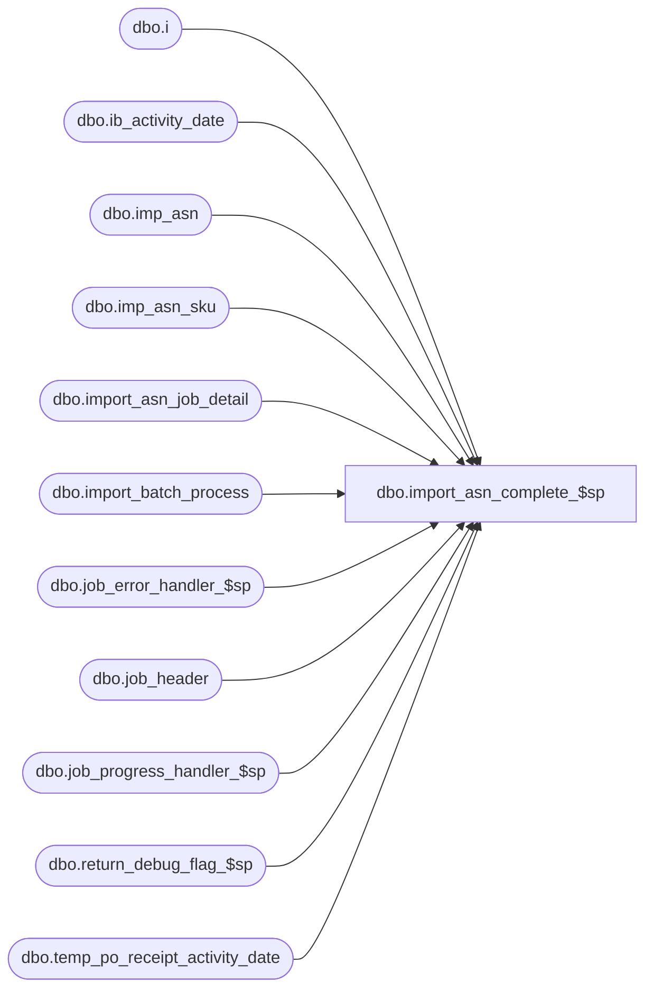

# dbo.import_asn_complete_$sp

**Database:** me_01  
**Server:** bedrockdb02  

## Architecture Diagram



## Table Dependencies

| Referenced Table |
|---|
| dbo.i |
| dbo.ib_activity_date |
| dbo.imp_asn |
| dbo.imp_asn_sku |
| dbo.import_asn_job_detail |
| dbo.import_batch_process |
| dbo.job_error_handler_$sp |
| dbo.job_header |
| dbo.job_progress_handler_$sp |
| dbo.return_debug_flag_$sp |
| dbo.temp_po_receipt_activity_date |

## Stored Procedure Code

```sql
CREATE PROCEDURE [dbo].[import_asn_complete_$sp]

AS
/*
	Version		: 1.00
	Created		: 2010/09/28
	Created by	: Pierrette Lemay
	Description	: This procedure is part of the import ASN process, 
				  it is called when all the jobs part of a posting process completed.
				  This step will update ib_activity_date and flag the job as completed in job_header.
	History		: Defect #126032 Remove the time from the date when updating ib_activity_date.
*/

BEGIN
	DECLARE @line_id SMALLINT, @job_type TINYINT, @proc_name NVARCHAR(30), @sql_err_num DECIMAL(38,0),
			@table_name NVARCHAR(30), @operation_name NVARCHAR(30), @error_msg NVARCHAR(2000), @return_flag BIT,
			@nineth_step TINYINT, @c_true BIT, @c_false BIT, @n_retry tinyint, @delay NCHAR(8), @job_id INT,
			@crs_job_flag BIT, @range_start DECIMAL(24,0), @range_end DECIMAL(24,0), @today SMALLDATETIME;

	SELECT @job_type	= 10
		, @job_id		= -1
		, @proc_name	= N'import_asn_complete_$sp'
		, @line_id		= 10
		, @c_false		= 0
		, @c_true		= 1
		, @nineth_step	= 9
		, @n_retry		= 0
		, @delay		= N'00:00:05'
		, @today		= CAST(CONVERT(varchar(10), GETDATE(), 101) AS SMALLDATETIME)
		, @crs_job_flag = 0;
	
	BEGIN TRY
		-- First we need to consolidate in one table the combinations of style/color/location part of this
		-- posting process for which we'll update ib_activity_date.
		-- Notice that the UPDATE of ib_activity_date is removed from imp_asn_fifth_step_$sp to prevent deadlocks.
		IF NOT object_id(N'tempdb..#temp_activity_date') IS NULL
			DROP TABLE #temp_activity_date;
		
		SELECT DISTINCT style_id, color_id, location_id 
		INTO #temp_activity_date
		FROM temp_po_receipt_activity_date;
		
		-- Log progress if job_params.debug_flag is true OR job_header.debug_flag is true
		EXEC return_debug_flag_$sp @job_type, @return_flag OUT;
		IF @return_flag = @c_true
			EXEC job_progress_handler_$sp @job_type, @job_id, @proc_name, @line_id;	
	
		step_complete:
		BEGIN TRY
			SET @line_id = 20;
			
			BEGIN TRAN	
			-- UPDATE ib_activity_date but first_po_receipt_date IS NOT NULL: in this case update last_po_receipt_date only.
			UPDATE i
			SET last_po_receipt_date = @today
			FROM ib_activity_date i WITH (NOLOCK), #temp_activity_date t WITH (NOLOCK)
			WHERE i.style_id = t.style_id
			AND i.color_id   = t.color_id
			AND i.location_id = t.location_id
			AND i.first_po_receipt_date IS NOT NULL;
			
			-- Log progress if job_params.debug_flag is true OR job_header.debug_flag is true
			EXEC return_debug_flag_$sp @job_type, @return_flag OUT;
			IF @return_flag = @c_true
				EXEC job_progress_handler_$sp @job_type, @job_id, @proc_name, @line_id;	
			
			SET @line_id = 30;
			-- UPDATE ib_activity_date WHEN first_po_receipt_date IS NULL: in this case update first/last_po_receipt_date
			UPDATE i
			SET first_po_receipt_date = @today,
				last_po_receipt_date = @today
			FROM ib_activity_date i WITH (NOLOCK), #temp_activity_date t WITH (NOLOCK)
			WHERE i.style_id = t.style_id
			AND i.color_id   = t.color_id
			AND i.location_id = t.location_id
			AND i.first_po_receipt_date IS NULL;
			
			-- Log progress if job_params.debug_flag is true OR job_header.debug_flag is true
			EXEC return_debug_flag_$sp @job_type, @return_flag OUT;
			IF @return_flag = @c_true
				EXEC job_progress_handler_$sp @job_type, @job_id, @proc_name, @line_id;	
			
			SET @line_id = 40;	
			-- UPDATE ib_activity_date but first_receipt_date IS NOT NULL
			UPDATE i
			SET i.last_receipt_date = @today
			FROM ib_activity_date i WITH (NOLOCK), #temp_activity_date t WITH (NOLOCK)
			WHERE i.style_id = t.style_id
			AND i.color_id   = t.color_id
			AND i.location_id = t.location_id
			AND i.first_receipt_date IS NOT NULL;	

			-- Log progress if job_params.debug_flag is true OR job_header.debug_flag is true
			EXEC return_debug_flag_$sp @job_type, @return_flag OUT;
			IF @return_flag = @c_true
				EXEC job_progress_handler_$sp @job_type, @job_id, @proc_name, @line_id;	
				
			SET @line_id = 50;
			-- UPDATE ib_activity_date because first_receipt_date IS NULL: in this case update 2 columns
			UPDATE i
			SET i.first_receipt_date = @today,
				i.last_receipt_date = @today
			FROM ib_activity_date i WITH (NOLOCK), #temp_activity_date t WITH (NOLOCK)
			WHERE i.style_id = t.style_id
			AND i.color_id   = t.color_id
			AND i.location_id = t.location_id
			AND i.first_receipt_date IS NULL;	
			
			-- Log progress if job_params.debug_flag is true OR job_header.debug_flag is true
			EXEC return_debug_flag_$sp @job_type, @return_flag OUT;
			IF @return_flag = @c_true
				EXEC job_progress_handler_$sp @job_type, @job_id, @proc_name, @line_id;	
							
			SET @line_id = 60;
			-- Keep track of this last step completed in job_detail
			INSERT INTO import_asn_job_detail
					 (job_id, job_step_id, time_stamp)
			SELECT i.job_id, @nineth_step, GETDATE()
			FROM import_batch_process i,
				(SELECT d.job_id, COUNT(*) cnt_step
				 FROM import_asn_job_detail d, import_batch_process b
				 WHERE b.job_type = 10 
				 AND d.job_id = b.job_id
				 GROUP BY d.job_id
				 HAVING COUNT(*) = 8)  T
			WHERE i.job_type = 10
			AND i.job_id = T.job_id;
			
			-- Log progress if job_params.debug_flag is true OR job_header.debug_flag is true
			EXEC return_debug_flag_$sp @job_type, @return_flag OUT;
			IF @return_flag = @c_true
				EXEC job_progress_handler_$sp @job_type, @job_id, @proc_name, @line_id;	
			
			SET @line_id = 70;
			-- Flag all the jobs that were part of this poSting process as completed
			UPDATE h
			SET completed_flag = 1,
			    end_time = GETDATE()
			FROM job_header h
			WHERE h.job_type = 10
			AND h.completed_flag = 0
			AND EXISTS ( SELECT 1 
				     FROM import_batch_process i,
					(SELECT d.job_id, COUNT(*) cnt_step
					 FROM import_asn_job_detail d, import_batch_process b
					 WHERE b.job_type = 10 
					 AND d.job_id = b.job_id
					 GROUP BY d.job_id
					 HAVING COUNT(*) = 9)  T
				     WHERE i.job_type = 10
				     AND i.job_id = T.job_id
				     AND i.job_id = h.job_id );

			COMMIT TRAN
			
			-- Log progress if job_params.debug_flag is true OR job_header.debug_flag is true
			EXEC return_debug_flag_$sp @job_type, @return_flag OUT;
			IF @return_flag = @c_true
				EXEC job_progress_handler_$sp @job_type, @job_id, @proc_name, @line_id;	

		END TRY
			
		BEGIN CATCH
			SELECT @error_msg = N'Error ' + CAST(ERROR_NUMBER() AS NVARCHAR(20)) + N' : in procedure import_asn_complete_$sp after 3 retries because of ' + ERROR_MESSAGE();
			
			IF @@TRANCOUNT <> 0
				ROLLBACK TRANSACTION;
		
			SET @n_retry = @n_retry + 1

			IF @n_retry <= 3 
			BEGIN	
				WAITFOR DELAY @delay
				GOTO step_complete
			END
						ELSE
				RAISERROR (N'Message: %s   job_id: %d', 
						16, -- Severity.
						1, -- State. 
						@error_msg, 
						@job_id)						
		END CATCH
		
		SET @line_id = 80;
		
		-- Purge imp_asn for the jobs that succeeded
		DECLARE crs_jobs CURSOR FOR
		SELECT h.range_start, h.range_end
		FROM import_batch_process p, job_header h
		WHERE p.job_type = 10
		AND p.job_id = h.job_id
		AND p.job_type = h.job_type
		AND h.completed_flag = 1;
		
		-- Log progress if job_params.debug_flag is true 
		EXEC return_debug_flag_$sp @job_type, @return_flag OUT;
			IF @return_flag = @c_true
				EXEC job_progress_handler_$sp @job_type, @job_id, @proc_name, @line_id;	
		
		OPEN crs_jobs
		SET @crs_job_flag = 1

		FETCH NEXT FROM crs_jobs INTO @range_start, @range_end

		WHILE @@FETCH_STATUS = 0
		BEGIN
			SET @line_id = 90;
			
			BEGIN TRAN
			
			DELETE imp_asn WHERE imp_asn_id BETWEEN @range_start AND @range_end;		
			DELETE imp_asn_sku WHERE imp_asn_id BETWEEN @range_start AND @range_end;

			COMMIT TRAN
			
			FETCH NEXT FROM crs_jobs INTO @range_start, @range_end;
		END
      
      	CLOSE crs_jobs;
	    DEALLOCATE crs_jobs;
	    SET @crs_job_flag = 0;
		
		-- Log progress if job_params.debug_flag is true
		EXEC return_debug_flag_$sp @job_type, @return_flag OUT
		IF (@return_flag = @c_true)
			EXEC job_progress_handler_$sp @job_type, @job_id, @proc_name, @line_id 
	END TRY

	BEGIN CATCH
		SELECT @error_msg		= ERROR_MESSAGE()
			 , @sql_err_num		= ERROR_NUMBER()
			 
		IF @@TRANCOUNT <> 0
			ROLLBACK TRANSACTION
			
		IF (@crs_job_flag = 1)
		BEGIN
			CLOSE crs_jobs;
			DEALLOCATE crs_jobs;
		END

		IF @line_id = 10
			SELECT  @table_name			= N'#temp_activity_date'
					, @operation_name	= N'INSERT'
		ELSE IF @line_id BETWEEN 20 AND 50
			SELECT  @table_name			= N'ib_activity_date'
					, @operation_name	= N'UPDATE'
		ELSE IF @line_id = 60
			SELECT  @table_name			= N'import_asn_job_detail'
					, @operation_name	= N'INSERT'
		ELSE IF @line_id = 70
			SELECT  @table_name			= N'job_header'
					, @operation_name	= N'UPDATE'
		ELSE IF @line_id = 80
			SELECT  @table_name			= N'import_batch_process'
					, @operation_name	= N'SELECT'
		ELSE IF @line_id = 90
			SELECT  @table_name			= N'imp_asn'
					, @operation_name	= N'DELETE';
					
		EXEC job_error_handler_$sp 
					@job_type 
					, @job_id 
					, @proc_name 
					, @line_id 
					, @sql_err_num 
					, @table_name 
					, @operation_name 
					, @error_msg 
					, @c_true

	END CATCH
END
```

