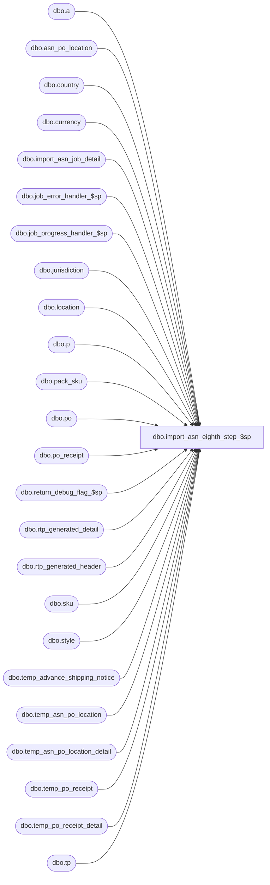

# dbo.import_asn_eighth_step_$sp

**Database:** me_01  
**Server:** bedrockdb02  

## Architecture Diagram



## Table Dependencies

| Referenced Table |
|---|
| dbo.a |
| dbo.asn_po_location |
| dbo.country |
| dbo.currency |
| dbo.import_asn_job_detail |
| dbo.job_error_handler_$sp |
| dbo.job_progress_handler_$sp |
| dbo.jurisdiction |
| dbo.location |
| dbo.p |
| dbo.pack_sku |
| dbo.po |
| dbo.po_receipt |
| dbo.return_debug_flag_$sp |
| dbo.rtp_generated_detail |
| dbo.rtp_generated_header |
| dbo.sku |
| dbo.style |
| dbo.temp_advance_shipping_notice |
| dbo.temp_asn_po_location |
| dbo.temp_asn_po_location_detail |
| dbo.temp_po_receipt |
| dbo.temp_po_receipt_detail |
| dbo.tp |

## Stored Procedure Code

```sql
CREATE PROCEDURE [dbo].[import_asn_eighth_step_$sp]
	(@job_id INT, @debug_flag BIT)

AS
/*
	Version		: 1.00
	Created		: 2010/09/28
	Created by	: Pierrette Lemay
	Description	: This procedure is part of the import ASN process, 
				  it executes the eighth transaction of the import ASN for the job that is passed as an in parameter.
				  This procedure represents step #8: Ticket Printing integration for the newly created IM documents.
	Defect 125701 & 125702: Prevent deadlocks on ib_activity_date: remove the update of job_header to flag the job as completed.
*/

BEGIN
	DECLARE @line_id SMALLINT, @job_type TINYINT, @proc_name NVARCHAR(30), @sql_err_num DECIMAL(38,0),
			@table_name NVARCHAR(30), @operation_name NVARCHAR(30), @error_msg NVARCHAR(2000), @return_flag BIT,
			@eighth_step TINYINT, @c_true BIT, @c_false BIT, @n_retry tinyint, @delay NCHAR(8);

	SELECT @job_type	= 10
		, @proc_name	= N'import_asn_eighth_step_$sp'
		, @line_id		= 10
		, @c_false		= 0
		, @c_true		= 1
		, @eighth_step	= 8
		, @n_retry		= 0
		, @delay		= N'00:00:05';
	
	IF NOT object_id(N'tempdb..#rtp_asn') IS NULL
		DROP TABLE #rtp_asn;
		
	IF NOT object_id(N'tempdb..#rtp_po_receipt') IS NULL
		DROP TABLE #rtp_po_receipt;
 
	BEGIN TRY
		SELECT h.advance_shipping_notice_id, d.asn_po_location_id, d.ship_to_location_id location_id,
			h.vendor_id, c.currency_code, c.currency_symbol
		INTO #rtp_asn
		FROM temp_advance_shipping_notice h WITH (NOLOCK), temp_asn_po_location d WITH (NOLOCK),
			location l WITH (NOLOCK), jurisdiction j WITH (NOLOCK), country co WITH (NOLOCK), currency c WITH (NOLOCK)
		WHERE h.job_id = @job_id
		AND h.job_id = d.job_id
		AND h.advance_shipping_notice_id = d.advance_shipping_notice_id
		AND d.ticket_source = 4 -- source = ASN
		AND d.ticket_status = 3 -- ticket required
		AND d.ship_to_location_id = l.location_id
		AND l.jurisdiction_id = j.jurisdiction_id
		AND j.country_id = co.country_id
		AND co.currency_id = c.currency_id;
		
		-- Log progress if job_params.debug_flag is true OR job_header.debug_flag is true
		EXEC return_debug_flag_$sp @job_type, @return_flag OUT
		IF (@return_flag = @c_true OR @debug_flag = @c_true)
			EXEC job_progress_handler_$sp @job_type, @job_id, @proc_name, @line_id; 
		
		SET @line_id = 20;

		SELECT r.po_receipt_id, r.location_id, po.vendor_id, c.currency_code, c.currency_symbol
		INTO #rtp_po_receipt
		FROM temp_po_receipt r WITH (NOLOCK), po WITH (NOLOCK), location l WITH (NOLOCK),
			jurisdiction j WITH (NOLOCK), country co WITH (NOLOCK), currency c WITH (NOLOCK)
		WHERE r.job_id = @job_id
		AND r.state_no IN (2)
		AND r.ticket_source = 3 -- source = PO Receipt
		AND r.ticket_status = 3 -- ticket required
		AND r.po_id = po.po_id
		AND r.location_id = l.location_id
		AND l.jurisdiction_id = j.jurisdiction_id
		AND j.country_id = co.country_id
		AND co.currency_id = c.currency_id;
		
		-- Log progress if job_params.debug_flag is true OR job_header.debug_flag is true
		EXEC return_debug_flag_$sp @job_type, @return_flag OUT
		IF (@return_flag = @c_true OR @debug_flag = @c_true)
			EXEC job_progress_handler_$sp @job_type, @job_id, @proc_name, @line_id; 
		
		step_8:
		BEGIN TRY
			BEGIN TRAN	 
			
			IF ( (SELECT COUNT(*) FROM #rtp_asn) > 0)
			BEGIN
				SET @line_id = 30;
					
				-- Populate rtp_generated_header and rtp_generated_detail when required
				-- even if it's a replace logic there is no need to delete first because it's only new documents here
				-- ASN document
				INSERT INTO rtp_generated_header
					(document_id, document_type, location_id, vendor_id, print_status, deleted_flag, date_updated) 
				SELECT DISTINCT advance_shipping_notice_id, 2 document_type, location_id, vendor_id, 2, 0, GETDATE()
				FROM  #rtp_asn;

				UPDATE a
				SET ticket_status = 4
				FROM asn_po_location a
				INNER JOIN #rtp_asn r
					ON a.advance_shipping_notice_id = r.advance_shipping_notice_id
					AND a.asn_po_location_id = r.asn_po_location_id
				
				-- Insert loose items
				INSERT INTO rtp_generated_detail 
					(document_id, document_type, location_id, vendor_id, style_id, style_color_id, style_size_id, 
					tkt_unit, unit_price, rtp_format_id, print_flag, deleted_flag, date_updated, currency_code, currency_symbol) 
				SELECT t.advance_shipping_notice_id, 2, t.location_id, t.vendor_id, 
					d.style_id, d.style_color_id, sku.style_size_id, SUM(d.units_sent), 0.00, s.ticket_format_id, 
					0, 0, GETDATE(), t.currency_code, t.currency_symbol
				FROM #rtp_asn t, temp_asn_po_location_detail d WITH (NOLOCK), style s WITH (NOLOCK), sku WITH (NOLOCK)
				WHERE d.job_id = @job_id
				AND t.advance_shipping_notice_id = d.advance_shipping_notice_id
				AND t.asn_po_location_id = d.asn_po_location_id
				AND d.pack_id IS NULL
				AND d.style_id = s.style_id
				AND d.sku_id = sku.sku_id
				AND NOT EXISTS (SELECT 1 FROM rtp_generated_detail tp WITH (NOLOCK)
								WHERE tp.document_id = t.advance_shipping_notice_id
								AND tp.document_type = 2
								AND tp.location_id = t.location_id
								AND tp.vendor_id = t.vendor_id
								AND tp.style_id = sku.style_id
								AND tp.style_color_id = sku.style_color_id
								AND tp.style_size_id = sku.style_size_id)
				GROUP BY t.advance_shipping_notice_id, t.location_id, t.vendor_id, d.style_id, d.style_color_id, sku.style_size_id, 
					s.ticket_format_id, t.currency_code, t.currency_symbol
				
				-- UPDATE sku_id that were already in rtp_generated_detail and are also included in a pack from the same document
				UPDATE tp
				SET tp.tkt_unit = tp.tkt_unit + (ps.sku_quantity * T.tot_unit)
				FROM rtp_generated_detail tp, pack_sku ps, sku,
					(SELECT t.advance_shipping_notice_id, t.asn_po_location_id, t.location_id, t.vendor_id,
						d.pack_id, SUM(d.units_sent) tot_unit 
					FROM #rtp_asn t, temp_asn_po_location_detail d
					WHERE d.job_id = @job_id
					AND t.advance_shipping_notice_id = d.advance_shipping_notice_id
					AND t.asn_po_location_id = d.asn_po_location_id
					AND d.pack_id IS NOT NULL
					GROUP BY t.advance_shipping_notice_id, t.asn_po_location_id, t.location_id, t.vendor_id, d.pack_id) T
				WHERE T.pack_id = ps.pack_id 
				-- Join with sku
				AND ps.sku_id = sku.sku_id
				-- Join with rtp_generated_detail
				AND tp.document_id = T.advance_shipping_notice_id
				AND tp.document_type = 2
				AND tp.location_id = T.location_id
				AND tp.vendor_id = T.vendor_id
				AND sku.style_id = tp.style_id
				AND sku.style_color_id = tp.style_color_id
				AND sku.style_size_id = tp.style_size_id; 
				
				-- Insert pack items where the skus part of those packs are not already inserted in rtp_generated_detail
				INSERT INTO rtp_generated_detail 
					(document_id, document_type, location_id, vendor_id, style_id, style_color_id, style_size_id, 
					tkt_unit, unit_price, rtp_format_id, print_flag, deleted_flag, date_updated, currency_code, currency_symbol)  
				SELECT t.advance_shipping_notice_id, 2, t.location_id, t.vendor_id, d.style_id, sku.style_color_id,
					sku.style_size_id, SUM(d.units_sent) * ps.sku_quantity, 0.00, s.ticket_format_id, 0, 0,
					GETDATE(), t.currency_code, t.currency_symbol
				FROM #rtp_asn t, temp_asn_po_location_detail d, sku , style s, pack_sku ps
				WHERE d.job_id = @job_id
				AND t.advance_shipping_notice_id = d.advance_shipping_notice_id
				AND t.asn_po_location_id = d.asn_po_location_id
				AND d.sku_id IS NULL
				AND d.style_id = s.style_id
				AND d.pack_id = ps.pack_id 
				AND ps.sku_id = sku.sku_id
				AND NOT EXISTS (SELECT 1 FROM rtp_generated_detail tp WITH (NOLOCK)
								WHERE tp.document_id = t.advance_shipping_notice_id
								AND tp.document_type = 2
								AND tp.location_id = t.location_id
								AND tp.vendor_id = t.vendor_id
								AND tp.style_id = sku.style_id
								AND tp.style_color_id = sku.style_color_id
								AND tp.style_size_id = sku.style_size_id) 
				GROUP BY t.advance_shipping_notice_id, t.location_id, t.vendor_id, d.style_id, sku.style_color_id,
					sku.style_size_id, ps.sku_quantity, s.ticket_format_id, t.currency_code, t.currency_symbol;
			END;
			-- Log progress if job_params.debug_flag is true OR job_header.debug_flag is true
			EXEC return_debug_flag_$sp @job_type, @return_flag OUT
			IF (@return_flag = @c_true OR @debug_flag = @c_true)
				EXEC job_progress_handler_$sp @job_type, @job_id, @proc_name, @line_id; 
			
			IF ( (SELECT COUNT(*) FROM #rtp_po_receipt) > 0)
			BEGIN
				SET @line_id = 40;
						
				-- PO Receipt document
				INSERT INTO rtp_generated_header
					(document_id, document_type, location_id, vendor_id, print_status, deleted_flag, date_updated) 
				SELECT po_receipt_id, 3 document_type, location_id, vendor_id, 2, 0, GETDATE()
				FROM  #rtp_po_receipt;

				UPDATE p
				SET ticket_status = 4
				FROM po_receipt p
				INNER JOIN #rtp_po_receipt r
					ON p.po_receipt_id = r.po_receipt_id;
				
				-- Insert loose items
				INSERT INTO rtp_generated_detail 
					(document_id, document_type, location_id, vendor_id, style_id, style_color_id, style_size_id, 
					tkt_unit, unit_price, rtp_format_id, print_flag, deleted_flag, date_updated, currency_code, currency_symbol) 
				SELECT t.po_receipt_id, 3, t.location_id, t.vendor_id, d.style_id, d.style_color_id, sku.style_size_id, 
					SUM(d.units_received), 0.00, s.ticket_format_id, 0, 0, GETDATE(), t.currency_code, t.currency_symbol
				FROM #rtp_po_receipt t, temp_po_receipt_detail d WITH (NOLOCK), style s WITH (NOLOCK), sku WITH (NOLOCK)
				WHERE d.job_id = @job_id
				AND t.po_receipt_id = d.po_receipt_id
				AND d.pack_id IS NULL
				AND d.style_id = s.style_id
				AND d.sku_id = sku.sku_id
				AND NOT EXISTS (SELECT 1 FROM rtp_generated_detail tp WITH (NOLOCK)
								WHERE tp.document_id = t.po_receipt_id
								AND tp.document_type = 3
								AND tp.location_id = t.location_id
								AND tp.vendor_id = t.vendor_id
								AND tp.style_id = sku.style_id
								AND tp.style_color_id = sku.style_color_id
								AND tp.style_size_id = sku.style_size_id)
				GROUP BY t.po_receipt_id, t.location_id, t.vendor_id, d.style_id, d.style_color_id, sku.style_size_id, 
					s.ticket_format_id, t.currency_code, t.currency_symbol;
				
				-- UPDATE sku_id that were already in rtp_generated_detail that are part of the same document but also included in a pack
				UPDATE tp
				SET tp.tkt_unit = tp.tkt_unit + (ps.sku_quantity * T.tot_unit)
				FROM rtp_generated_detail tp, pack_sku ps, sku,
					(SELECT t.po_receipt_id, t.location_id, t.vendor_id, d.pack_id, SUM(d.units_received) tot_unit 
					FROM #rtp_po_receipt t, temp_po_receipt_detail d
					WHERE d.job_id = @job_id
					AND t.po_receipt_id = d.po_receipt_id
					AND d.pack_id IS NOT NULL
					GROUP BY t.po_receipt_id, t.location_id, t.vendor_id, d.pack_id) T
				WHERE tp.document_id = T.po_receipt_id
				AND tp.document_type = 3
				AND tp.location_id = T.location_id
				AND tp.vendor_id = T.vendor_id
				-- Join with pack_sku
				AND T.pack_id = ps.pack_id 
				-- Join with sku
				AND ps.sku_id = sku.sku_id
				-- Join sku with rtp_generated_detail
				AND sku.style_id = tp.style_id
				AND sku.style_color_id = tp.style_color_id
				AND sku.style_size_id = tp.style_size_id; 
				
				-- Insert pack items
				INSERT INTO rtp_generated_detail 
					(document_id, document_type, location_id, vendor_id, style_id, style_color_id, style_size_id, 
					tkt_unit, unit_price, rtp_format_id, print_flag, deleted_flag, date_updated, currency_code, currency_symbol)  
				SELECT t.po_receipt_id, 3, t.location_id, t.vendor_id, d.style_id, sku.style_color_id, sku.style_size_id, 
					(ps.sku_quantity * SUM(d.units_received)), 0.00, s.ticket_format_id, 0, 0, GETDATE(), t.currency_code, t.currency_symbol
				FROM #rtp_po_receipt t, temp_po_receipt_detail d, sku , style s, pack_sku ps
				WHERE d.job_id = @job_id
				AND t.po_receipt_id = d.po_receipt_id
				AND d.sku_id IS NULL
				AND d.style_id = s.style_id
				AND d.pack_id = ps.pack_id 
				AND ps.sku_id = sku.sku_id
				AND NOT EXISTS (SELECT 1 FROM rtp_generated_detail tp WITH (NOLOCK)
								WHERE tp.document_id = t.po_receipt_id
								AND tp.document_type = 3
								AND tp.location_id = t.location_id
								AND tp.vendor_id = t.vendor_id
								AND tp.style_id = sku.style_id
								AND tp.style_color_id = sku.style_color_id
								AND tp.style_size_id = sku.style_size_id)
				GROUP BY t.po_receipt_id, t.location_id, t.vendor_id, d.style_id, sku.style_color_id, sku.style_size_id, 
					ps.sku_quantity, s.ticket_format_id, t.currency_code, t.currency_symbol;
				
			END;	
		
			-- Log progress if job_params.debug_flag is true OR job_header.debug_flag is true
			EXEC return_debug_flag_$sp @job_type, @return_flag OUT
			IF (@return_flag = @c_true OR @debug_flag = @c_true)
				EXEC job_progress_handler_$sp @job_type, @job_id, @proc_name, @line_id;
				
			SET @line_id = 50;
		
			-- Keep track of this job_step completed in job_detail
			INSERT INTO import_asn_job_detail
				 (job_id, job_step_id, time_stamp)
			VALUES (@job_id, @eighth_step, GETDATE());
			
			COMMIT TRAN
			
			-- Log progress if job_params.debug_flag is true OR job_header.debug_flag is true
			EXEC return_debug_flag_$sp @job_type, @return_flag OUT
			IF (@return_flag = @c_true OR @debug_flag = @c_true)
				EXEC job_progress_handler_$sp @job_type, @job_id, @proc_name, @line_id;
		
		END TRY
			
		BEGIN CATCH
			SELECT @error_msg = N'Error ' + CAST(ERROR_NUMBER() AS NVARCHAR(20)) + N' : in the eigthth step of job #%i after 3 retries because of ' + ERROR_MESSAGE();
			
			IF @@TRANCOUNT <> 0
				ROLLBACK TRANSACTION;
		
			SET @n_retry = @n_retry + 1

			IF @n_retry <= 3 
			BEGIN	
				WAITFOR DELAY @delay
				GOTO step_8
			END
			ELSE
				RAISERROR (@error_msg,
						16, -- Severity.
						1, -- State.
						@job_id)
		END CATCH
	END TRY

	BEGIN CATCH
		SELECT @error_msg		= ERROR_MESSAGE()
			 , @sql_err_num		= ERROR_NUMBER()
			 
		IF @@TRANCOUNT <> 0
			ROLLBACK TRANSACTION

		IF @line_id = 10
			SELECT  @table_name			= N'#rtp_asn'
					, @operation_name	= N'INSERT'
		ELSE IF @line_id = 20
			SELECT  @table_name			= N'#rtp_po_receipt'
					, @operation_name	= N'INSERT'
		ELSE IF @line_id = 30
			SELECT  @table_name			= N'rtp_generated_header'
					, @operation_name	= N'INSERT'
		ELSE IF @line_id = 40
			SELECT  @table_name			= N'rtp_generated_detail'
					, @operation_name	= N'INSERT'
		ELSE IF @line_id = 50
			SELECT  @table_name			= N'import_asn_job_detail'
					, @operation_name	= N'INSERT';
					
		EXEC job_error_handler_$sp 
					@job_type 
					, @job_id 
					, @proc_name 
					, @line_id 
					, @sql_err_num 
					, @table_name 
					, @operation_name 
					, @error_msg 
					, @c_true

	END CATCH
END
```

