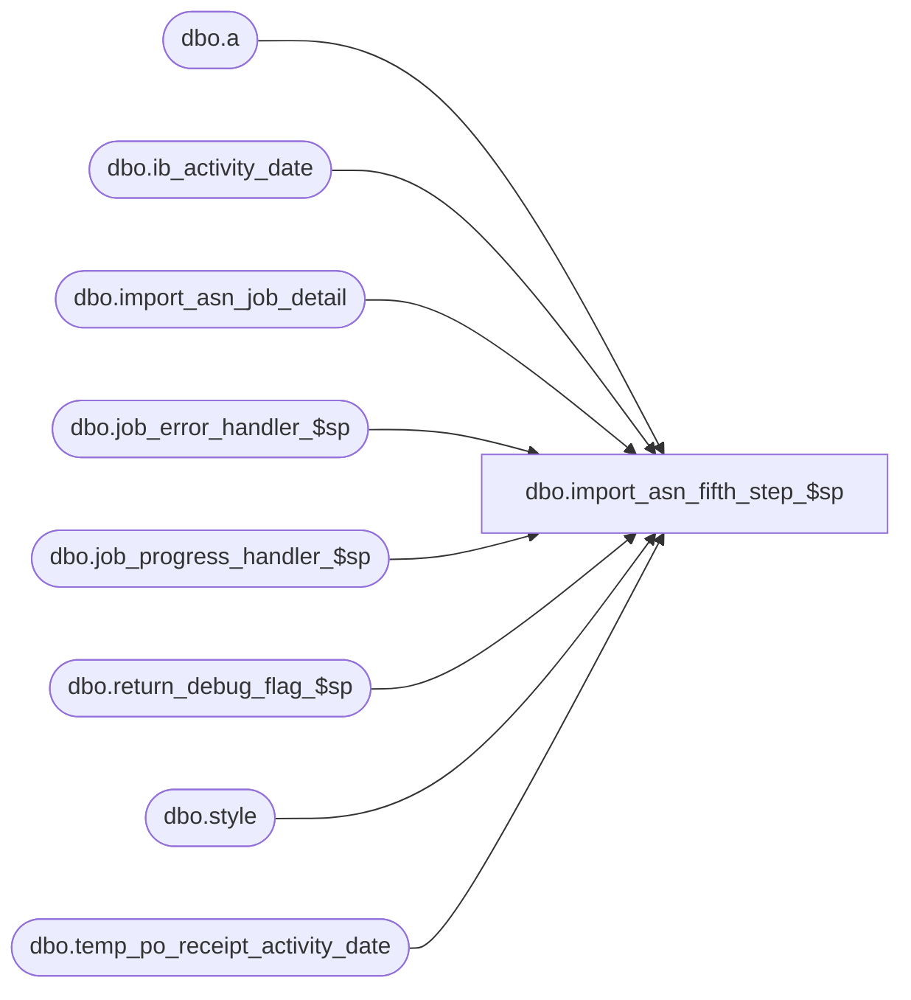

# dbo.import_asn_fifth_step_$sp

**Database:** me_01  
**Server:** bedrockdb02  

## Architecture Diagram



## Table Dependencies

| Referenced Table |
|---|
| dbo.a |
| dbo.ib_activity_date |
| dbo.import_asn_job_detail |
| dbo.job_error_handler_$sp |
| dbo.job_progress_handler_$sp |
| dbo.return_debug_flag_$sp |
| dbo.style |
| dbo.temp_po_receipt_activity_date |

## Stored Procedure Code

```sql
CREATE PROCEDURE [dbo].[import_asn_fifth_step_$sp]
	(@job_id INT, @debug_flag BIT)

AS
/*
	Version		: 1.00
	Created		: 2010/09/28
	Created by	: Pierrette Lemay
	Description	: This procedure is part of the import ASN process, 
				  it executes the fifth transaction of the import ASN for the job that is passed as an in parameter.
			  -- Fifth Step: If parameter_im.gen_po_receipt_for_asn_flag is ON
			        -- Note that:  po_receipt linked to an auto-receive vendor have been created in step 2
					-- Note that:  ib_inventory and ib_inventory_total has been updated in step 3
					-- Note that:  ib_on_order and ib_on_order_total has been updated in step 4    
				-- This step will be responsible to UPDATE/INSERT ib_activity_date and style status in the style table:
					-- the first_receipt_date/last_receipt_date and first_po_receipt_date/last_po_receipt_date by style / color / location
					-- using data that have been inserted previously in temp_po_receipt_activity_date 
				    -- Set the style status to received
				    -- Insert fifth step into import_asn_job_detail
	Defect 125701 & 125702: Prevent deadlocks on ib_activity_date.
	History		: Defect #126032 Remove the time from the date when updating ib_activity_date.
	
	Date		developer	defect/description
	2014/08/12	Feng		ME5.0.FT62701.Wholesale Integration (In-transit inventory) UC008 – Generate ASN Receipts - ASN Import Via Pipeline  & XML Coding	 
							table po_receipt: added shipped_date, track_in_transit_flag, discrepancy_posted
							table po_receipt_detail: added units_shipped
							vendor table asn_auto_receive_flag does not used anymore, which has been replaced by track_in_transit_flag and combined with asn_auto_generate_po_rcpt_status (1-Preliminary, 2-Shipped, 3-Received)
							if track_in_transit_flag = false, asn_auto_generate_po_rcpt_status could only have value 1 (Preliminary) or 3 (Received).
							Therefore, 
							1) only po receipt	with received status will update ib_activity_date;
							2) po receipt with both received/shipped status will update style status = 4 if it was not with status received; 
*/

BEGIN
	DECLARE @line_id SMALLINT, @job_type TINYINT, @proc_name NVARCHAR(30), @sql_err_num DECIMAL(38,0),
			@table_name NVARCHAR(30), @operation_name NVARCHAR(30), @error_msg NVARCHAR(2000), @return_flag BIT,
			@fifth_step TINYINT, @c_true BIT, @c_false BIT, @n_retry tinyint, @delay NCHAR(8), @today SMALLDATETIME;

	SELECT @job_type	= 10
		, @proc_name	= N'import_asn_fifth_step_$sp'
		, @line_id		= 10
		, @c_false		= 0
		, @c_true		= 1
		, @fifth_step	= 5
		, @today		= CAST(CONVERT(varchar(10), GETDATE(), 101) AS SMALLDATETIME)
		, @n_retry		= 0
		, @delay		= N'00:00:05';
		
	IF NOT object_id(N'tempdb..#temp_activity') IS NULL
		DROP TABLE #temp_activity;
		
	SELECT t.style_id, t.color_id, t.location_id
	INTO #temp_activity
	FROM temp_po_receipt_activity_date t 
	WHERE t.job_id = @job_id
	AND t.state_no = 2
	AND NOT EXISTS (SELECT 1 FROM ib_activity_date i WITH (NOLOCK)
			WHERE i.style_id = t.style_id
			AND i.color_id   = t.color_id
			AND i.location_id = t.location_id); 
 
	-- Log progress if job_params.debug_flag is true OR job_header.debug_flag is true
	EXEC return_debug_flag_$sp @job_type, @return_flag OUT
	IF (@return_flag = @c_true OR @debug_flag = @c_true)
		EXEC job_progress_handler_$sp @job_type, @job_id, @proc_name, @line_id; 
	
	SET @line_id = 20;
		
	step_5:
	BEGIN TRY
		BEGIN TRAN	
		
		-- INSERT missing rows in ib_activity_date
		INSERT INTO ib_activity_date 
			( style_id
			  , color_id
	          , location_id
	          , first_receipt_date
	          , last_receipt_date
	          , first_po_receipt_date
	          , last_po_receipt_date  )
		SELECT style_id, color_id, location_id, 
			@today, @today, @today, @today
		FROM #temp_activity;
				
		-- Log progress if job_params.debug_flag is true OR job_header.debug_flag is true
		EXEC return_debug_flag_$sp @job_type, @return_flag OUT
		IF (@return_flag = @c_true OR @debug_flag = @c_true)
			EXEC job_progress_handler_$sp @job_type, @job_id, @proc_name, @line_id; 
		
		SET @line_id = 30;
		-- UPDATE style.style_status using crs_style_status
		UPDATE s
		SET style_status = 4
		FROM temp_po_receipt_activity_date t WITH (NOLOCK), style s WITH (NOLOCK)
		WHERE t.job_id = @job_id
		AND t.style_id = s.style_id
		AND t.state_no IN (2, 8)
		AND s.style_status <> 4;
		
		-- Log progress if job_params.debug_flag is true OR job_header.debug_flag is true
		EXEC return_debug_flag_$sp @job_type, @return_flag OUT
		IF (@return_flag = @c_true OR @debug_flag = @c_true)
			EXEC job_progress_handler_$sp @job_type, @job_id, @proc_name, @line_id; 
	
		SET @line_id = 40;
		-- Keep track of this job_step completed in job_detail
		INSERT INTO import_asn_job_detail
			 (job_id, job_step_id, time_stamp)
		VALUES (@job_id, @fifth_step, GETDATE());
	
		COMMIT TRAN
		
		-- Log progress if job_params.debug_flag is true OR job_header.debug_flag is true
		EXEC return_debug_flag_$sp @job_type, @return_flag OUT
		IF (@return_flag = @c_true OR @debug_flag = @c_true)
			EXEC job_progress_handler_$sp @job_type, @job_id, @proc_name, @line_id;
			
		SET @line_id = 50;
		-- The rows that were used to insert the missing rows in ib_activity_date are no longer required
		DELETE a
		FROM temp_po_receipt_activity_date a, #temp_activity b
		WHERE a.job_id = @job_id
		AND a.style_id = b.style_id
		AND a.color_id = b.color_id
		AND a.location_id = b.location_id;
		
		-- Log progress if job_params.debug_flag is true OR job_header.debug_flag is true
		EXEC return_debug_flag_$sp @job_type, @return_flag OUT
		IF (@return_flag = @c_true OR @debug_flag = @c_true)
			EXEC job_progress_handler_$sp @job_type, @job_id, @proc_name, @line_id;
			
	END TRY
	BEGIN CATCH
		IF @@TRANCOUNT > 0
			ROLLBACK TRANSACTION;
	
		SET @n_retry = @n_retry + 1;

		IF @n_retry <= 3 
		BEGIN	
			WAITFOR DELAY @delay
			GOTO step_5
		END
		ELSE
		BEGIN
			SELECT @error_msg = N'Error ' + CAST(ERROR_NUMBER() AS NVARCHAR(20)) + N' : in the fifth step of job #%i after 3 retries because of ' + ERROR_MESSAGE(), 
				@sql_err_num		= ERROR_NUMBER()
			 
			IF @line_id = 10
				SELECT  @table_name		= N'#temp_activity'
					, @operation_name	= N'INSERT'
			ELSE IF @line_id = 20
				SELECT @table_name		= N'ib_activity_date'
					, @operation_name	= N'INSERT'
			ELSE IF @line_id = 30
				SELECT  @table_name		= N'style'
					, @operation_name	= N'UPDATE'
			ELSE IF @line_id = 40
				SELECT  @table_name		= N'import_asn_job_detail'
					, @operation_name	= N'INSERT';
			ELSE IF @line_id = 50
				SELECT @table_name		= N'temp_po_receipt_activity_date'
					, @operation_name	= N'DELETE'
				
			EXEC job_error_handler_$sp 
					@job_type 
					, @job_id 
					, @proc_name 
					, @line_id 
					, @sql_err_num 
					, @table_name 
					, @operation_name 
					, @error_msg 
					, @c_true;			
		END

	END CATCH
END
```

