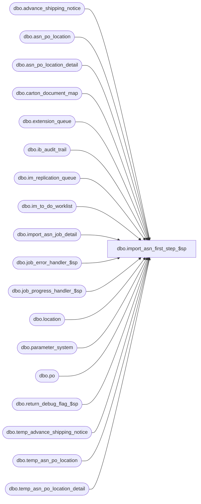

# dbo.import_asn_first_step_$sp

**Database:** me_01  
**Server:** bedrockdb02  

## Architecture Diagram



## Table Dependencies

| Referenced Table |
|---|
| dbo.advance_shipping_notice |
| dbo.asn_po_location |
| dbo.asn_po_location_detail |
| dbo.carton_document_map |
| dbo.extension_queue |
| dbo.ib_audit_trail |
| dbo.im_replication_queue |
| dbo.im_to_do_worklist |
| dbo.import_asn_job_detail |
| dbo.job_error_handler_$sp |
| dbo.job_progress_handler_$sp |
| dbo.location |
| dbo.parameter_system |
| dbo.po |
| dbo.return_debug_flag_$sp |
| dbo.temp_advance_shipping_notice |
| dbo.temp_asn_po_location |
| dbo.temp_asn_po_location_detail |

## Stored Procedure Code

```sql
CREATE PROCEDURE [dbo].[import_asn_first_step_$sp]
	(@job_id INT, @debug_flag BIT)

AS
/*
	Version		: 1.00
	Created		: 2010/09/28
	Created by	: Pierrette Lemay
	Description	: This procedure is part of the import ASN process,
				  it executes the first transaction of the import ASN for the job that is passed as an in parameter.
			-- First step: Create advance_shipping_notice document
			-- insert carton_document_map for the new ASN just created in one transaction
			-- populate im_replication_queue
			-- insert ib_audit_trail
			-- Log the first step as completed
	History		: Defect #131058 imported asn's are not getting populated in im web-->to do worklist when IM Web installed flag is ON.

*/

BEGIN
	DECLARE @line_id SMALLINT, @job_type TINYINT, @proc_name NVARCHAR(30), @sql_err_num DECIMAL(38,0),
			@table_name NVARCHAR(30), @operation_name NVARCHAR(30), @error_msg NVARCHAR(2000), @return_flag BIT,
			@first_step TINYINT, @c_true BIT, @c_false BIT, @n_retry tinyint, @delay NCHAR(8);

	SELECT @job_type	= 10
		, @proc_name	= N'import_asn_first_step_$sp'
		, @line_id		= 10
		, @c_false		= 0
		, @c_true		= 1
		, @first_step	= 1
		, @n_retry		= 0
		, @delay		= N'00:00:05';

	step_1:
	BEGIN TRY
		BEGIN TRAN

		INSERT INTO advance_shipping_notice
		   	(advance_shipping_notice_id
		   	, vendor_id
		   	, unit_weight_id
		   	, container_type_id
		   	, carrier_id
		   	, ship_via_id
		   	, document_no
		   	, expected_receipt_date
		   	, pro_bill_no
		   	, create_date
		   	, ship_date
		   	, bill_of_lading
		   	, weight
		   	, no_of_containers
		   	, shipment_ref_no
		   	, last_activity_date
		   	, updatestamp
		   	, last_item_id
		   	, asn_status)
		SELECT advance_shipping_notice_id
			, vendor_id
			, unit_weight_id
			, container_type_id
			, carrier_id
			, ship_via_id
			, document_no
			, expected_receipt_date
			, pro_bill_no
			, create_date
			, ship_date
			, bill_of_lading
			, weight
			, no_of_containers
			, shipment_ref_no
			, last_activity_date
			, updatestamp
			, last_item_id
			, 25 -- If the ASN created through Pipeline segment, the ASN status will be set to 25 (published).
		FROM temp_advance_shipping_notice WITH (NOLOCK)
		WHERE job_id = @job_id
		ORDER BY advance_shipping_notice_id;

		-- Log progress if job_params.debug_flag is true OR job_header.debug_flag is true
		EXEC return_debug_flag_$sp @job_type, @return_flag OUT
		IF (@return_flag = @c_true OR @debug_flag = @c_true)
			EXEC job_progress_handler_$sp @job_type, @job_id, @proc_name, @line_id;

		SET @line_id = 20;

		INSERT INTO asn_po_location
			   (asn_po_location_id
			   ,advance_shipping_notice_id
			   ,po_id
			   ,location_id
			   ,blanket_po_id
			   ,ticket_source
			   ,ticket_status)
		SELECT asn_po_location_id
				, advance_shipping_notice_id
				, po_id
				, ship_to_location_id
				, blanket_po_id
				, ticket_source
				, CASE WHEN ticket_source = 4 THEN 3 -- ticket required
					   ELSE 2 -- ticket not applicable
				  END ticket_status
		FROM temp_asn_po_location WITH (NOLOCK)
		WHERE job_id = @job_id
		ORDER BY advance_shipping_notice_id;

		-- Log progress if job_params.debug_flag is true OR job_header.debug_flag is true
		EXEC return_debug_flag_$sp @job_type, @return_flag OUT
		IF (@return_flag = @c_true OR @debug_flag = @c_true)
			EXEC job_progress_handler_$sp @job_type, @job_id, @proc_name, @line_id;

		SET @line_id = 30;

		INSERT INTO asn_po_location_detail
			   (asn_po_location_detail_id
			   ,asn_po_location_id
			   ,advance_shipping_notice_id
			   ,style_id
			   ,style_color_id
			   ,sku_id
			   ,carton_no
			   ,units_sent
			   ,location_id
			   , pack_id)
		SELECT asn_po_location_detail_id
				, asn_po_location_id
				, advance_shipping_notice_id
				, style_id
				, style_color_id
				, sku_id
				, carton_no
				, units_sent
				, selling_location_id
				, pack_id
		FROM temp_asn_po_location_detail WITH (NOLOCK)
		WHERE job_id = @job_id
		ORDER BY asn_po_location_id;

		-- Log progress if job_params.debug_flag is true OR job_header.debug_flag is true
		EXEC return_debug_flag_$sp @job_type, @return_flag OUT
		IF (@return_flag = @c_true OR @debug_flag = @c_true)
			EXEC job_progress_handler_$sp @job_type, @job_id, @proc_name, @line_id;

		SET @line_id = 40;

		INSERT INTO carton_document_map
		   	( carton_no
		   	, document_type
		   	, document_id
		   	, location_id
		   	, carton_arrived_flag)
		SELECT DISTINCT d.carton_no
			   , 3 -- document type for ASN is 3
			   , d.advance_shipping_notice_id
			   , pl.ship_to_location_id
			   , 0
		FROM temp_asn_po_location_detail d WITH (NOLOCK), temp_asn_po_location pl WITH (NOLOCK)
		WHERE d.job_id = @job_id
		AND d.carton_no IS NOT NULL
		AND d.job_id = pl.job_id
		AND d.asn_po_location_id = pl.asn_po_location_id;

		-- Log progress if job_params.debug_flag is true OR job_header.debug_flag is true
		EXEC return_debug_flag_$sp @job_type, @return_flag OUT
		IF (@return_flag = @c_true OR @debug_flag = @c_true)
			EXEC job_progress_handler_$sp @job_type, @job_id, @proc_name, @line_id;

		IF EXISTS(SELECT 1 FROM parameter_system WHERE installed_distro_no_wms_flag = 0)
		BEGIN
			SET @line_id = 50;

			INSERT INTO im_replication_queue
		   		( entity_code
				, replication_action
				, action_date
				, entity_id
				, other_entity_id
				, other_entity_key
				, changed_units
				, replication_data)
			SELECT DISTINCT 20
				, N'I'
				, GETDATE()
				, t.advance_shipping_notice_id
				, 0
				, N'N/A'
				, 0
				, N'N/A'
			FROM temp_asn_po_location t WITH (NOLOCK)
			INNER JOIN po WITH (NOLOCK)
				ON  t.po_id = po.po_id
			    AND t.job_id = @job_id
			ORDER BY advance_shipping_notice_id;

			-- Log progress if job_params.debug_flag is true OR job_header.debug_flag is true
			EXEC return_debug_flag_$sp @job_type, @return_flag OUT
			IF (@return_flag = @c_true OR @debug_flag = @c_true)
				EXEC job_progress_handler_$sp @job_type, @job_id, @proc_name, @line_id;
		END

		-- Log progress if job_params.debug_flag is true OR job_header.debug_flag is true
		EXEC return_debug_flag_$sp @job_type, @return_flag OUT
		IF (@return_flag = @c_true OR @debug_flag = @c_true)
			EXEC job_progress_handler_$sp @job_type, @job_id, @proc_name, @line_id;

		IF EXISTS(SELECT 1 FROM parameter_system WHERE installed_imweb_flag = 1)
		BEGIN
			SET @line_id = 55;

			INSERT INTO im_to_do_worklist
			   (document_type
			   ,document_id
			   ,location_id)
			SELECT DISTINCT 8 AS document_type,
				advance_shipping_notice_id,
				ship_to_location_id
			FROM temp_asn_po_location
			WHERE job_id = @job_id
			ORDER BY advance_shipping_notice_id;

			-- Log progress if job_params.debug_flag is true OR job_header.debug_flag is true
			EXEC return_debug_flag_$sp @job_type, @return_flag OUT
			IF (@return_flag = @c_true OR @debug_flag = @c_true)
				EXEC job_progress_handler_$sp @job_type, @job_id, @proc_name, @line_id;
		END

		SET @line_id = 60;

		INSERT INTO ib_audit_trail
		   	( entry_date
		   	, application
		   	, activity
		   	, application_type
		   	, application_identifier
		   	, employee_last_name
		   	, employee_first_name )
		SELECT create_date
			, N'IM'
			, N'Create'
			, N'ASN'
			, document_no
			, N'Admin'
			, N'Admin'
		FROM temp_advance_shipping_notice WITH (NOLOCK)
		WHERE job_id = @job_id
		ORDER BY advance_shipping_notice_id;

		-- Log progress if job_params.debug_flag is true OR job_header.debug_flag is true
		EXEC return_debug_flag_$sp @job_type, @return_flag OUT
		IF (@return_flag = @c_true OR @debug_flag = @c_true)
			EXEC job_progress_handler_$sp @job_type, @job_id, @proc_name, @line_id;

		SET @line_id = 70;
		-- Insert into extension_queue part of ASN saved if any location has warehouse_system_flag = 1
		-- type is 1 for ASN documents
		INSERT INTO extension_queue
			(type, entity_id, method_id, entity_name)
		SELECT 1, a.advance_shipping_notice_id,N'BEBE0C0F-99BA-46cb-B990-382B6883DB95', a.document_no
		FROM temp_advance_shipping_notice a
		WHERE a.job_id = @job_id
		AND EXISTS (SELECT 1 FROM temp_asn_po_location pl WITH(NOLOCK), location l WITH(NOLOCK)
					WHERE pl.job_id = a.job_id
					AND pl.advance_shipping_notice_id = a.advance_shipping_notice_id
					AND pl.ship_to_location_id = l.location_id
					AND l.warehouse_system_flag = 1)
		ORDER BY advance_shipping_notice_id;

		-- Log progress if job_params.debug_flag is true OR job_header.debug_flag is true
		EXEC return_debug_flag_$sp @job_type, @return_flag OUT
		IF (@return_flag = @c_true OR @debug_flag = @c_true)
			EXEC job_progress_handler_$sp @job_type, @job_id, @proc_name, @line_id;


		SET @line_id = 80;

		-- Keep track of this job_step completed in job_detail
		INSERT INTO import_asn_job_detail
			 (job_id, job_step_id, time_stamp)
		VALUES (@job_id, @first_step, GETDATE())

		COMMIT TRAN

		-- Log progress if job_params.debug_flag is true OR job_header.debug_flag is true
		EXEC return_debug_flag_$sp @job_type, @return_flag OUT
		IF (@return_flag = @c_true OR @debug_flag = @c_true)
			EXEC job_progress_handler_$sp @job_type, @job_id, @proc_name, @line_id;

	END TRY
	BEGIN CATCH
		IF @@TRANCOUNT > 0
			ROLLBACK TRANSACTION;

		SET @n_retry = @n_retry + 1;

		IF @n_retry <= 3
		BEGIN
			WAITFOR DELAY @delay
			GOTO step_1
		END
		ELSE
		BEGIN
			SELECT @error_msg = N'Error ' + CAST(ERROR_NUMBER() AS NVARCHAR(20)) + N' : in the first step of job #%i after 3 retry because of ' + ERROR_MESSAGE(),
				@sql_err_num		= ERROR_NUMBER()

			IF @line_id = 10
				SELECT  @table_name		= N'advance_shipping_notice'
					, @operation_name	= N'INSERT'
			ELSE IF @line_id = 20
				SELECT @table_name		= N'asn_po_location'
					, @operation_name	= N'INSERT'
			ELSE IF @line_id = 30
				SELECT  @table_name		= N'asn_po_location_detail'
					, @operation_name	= N'INSERT'
			ELSE IF @line_id = 40
				SELECT  @table_name		= N'carton_document_map'
					, @operation_name	= N'INSERT'
			ELSE IF @line_id = 50
				SELECT  @table_name		= N'im_replication_queue'
					, @operation_name	= N'INSERT'
			ELSE IF @line_id = 60
				SELECT  @table_name		= N'ib_audit_trail'
					, @operation_name	= N'INSERT'
			ELSE IF @line_id = 70
				SELECT  @table_name		= N'extension_queue'
					, @operation_name	= N'INSERT';
			ELSE IF @line_id = 80
				SELECT  @table_name		= N'import_asn_job_detail'
					, @operation_name	= N'INSERT';

			EXEC job_error_handler_$sp
					@job_type
					, @job_id
					, @proc_name
					, @line_id
					, @sql_err_num
					, @table_name
					, @operation_name
					, @error_msg
					, @c_true;
		END

	END CATCH
END
```

