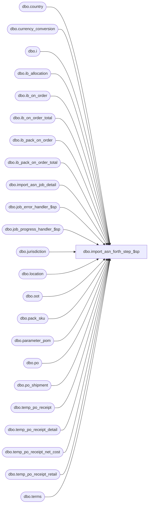

# dbo.import_asn_forth_step_$sp

**Database:** me_01  
**Server:** bedrockdb02  

## Architecture Diagram



## Table Dependencies

| Referenced Table |
|---|
| dbo.country |
| dbo.currency_conversion |
| dbo.i |
| dbo.ib_allocation |
| dbo.ib_on_order |
| dbo.ib_on_order_total |
| dbo.ib_pack_on_order |
| dbo.ib_pack_on_order_total |
| dbo.import_asn_job_detail |
| dbo.job_error_handler_$sp |
| dbo.job_progress_handler_$sp |
| dbo.jurisdiction |
| dbo.location |
| dbo.oot |
| dbo.pack_sku |
| dbo.parameter_pom |
| dbo.po |
| dbo.po_shipment |
| dbo.temp_po_receipt |
| dbo.temp_po_receipt_detail |
| dbo.temp_po_receipt_net_cost |
| dbo.temp_po_receipt_retail |
| dbo.terms |

## Stored Procedure Code

```sql
CREATE PROCEDURE [dbo].[import_asn_forth_step_$sp]
  (@job_id INT, @job_debug_flag BIT)
AS

SET NOCOUNT ON

/*
  Version		: 1.00
  Created		: 2007/04/24
  Created by	: Pierrette Lemay
  Description	: This procedure is part of the ASN import, it's called by import_asn_batch_$sp when
      parameter_im.gen_po_receipt_for_asn_flag is set.
      Some po_receipt documents were created previously for the currently processed job in step #2
        with state_no 2 for auto receive vendor and state_no 1 for other vendors.
      When the po_receipt has state_no = 2 (receive or in_transit for Carter's)
      transactions were created in ib_inventory (in step #3)
      and the current procedure is really the expantion of step #4.
        - When the PO attached to the po_receipt became Open,
          Transaction 100 were generated by the PO for each item ordered
                by shipement date: suppose a transaction (100) for 10 units
            - Supposed we received 12 units for that sku
            - Step 4 Inserts new transactions in ib_order:
                 Generate a transaction 110 -12 units to receive the sku
                 Because ib_on_order could never becomes negative then we over-receipt
                  by generating transaction 115 (Order over receipt adjustment): for +2 units.
                 Then total on_order for that sku = 0
  History		: Defect #126032 Remove the time from receipt_date.
          Defect #128642 When over receiving items we need to use the last expected_receipt_date when ib_on_order is updated
          Defect #137166 ib_on_order not updated properly when multiple ASNs are created against the same PO.
          Defect #137166 original fix worked for the parameter setting of exchange_rate_in_effect_on is set to 3
                 but there was issues with parameter settings 1 and 2.
          Defect #138356 ib_pack_on_order not posting all location/erds received if asn import has more that 1 erd
                also uplift the fix that was done in the 4.3 R2 version to 5.0.

  Date		developer	defect/description
  2014/08/12	Feng		ME5.0.FT62701.Wholesale Integration (In-transit inventory) UC008 – Generate ASN Receipts - ASN Import Via Pipeline  & XML Coding
              table po_receipt: added shipped_date, track_in_transit_flag, discrepancy_posted
              table po_receipt_detail: added units_shipped
              vendor table asn_auto_receive_flag does not used anymore, which has been replaced by track_in_transit_flag and combined with asn_auto_generate_po_rcpt_status (1-Preliminary, 2-Shipped, 3-Received)
              if track_in_transit_flag = false, asn_auto_generate_po_rcpt_status could only have value 1 (Preliminary) or 3 (Received).
              Therefore for the cases for updating IB, cost and last activity date of PO Receipt auto generated with Shipped status will follow the Received status,
              ib_on_order need to update with transaction_code 110 or/and 115 for shipped receipt.

  2014/09/09	Feng		fix defect 83579 ASN import - pipeline: If ASN includes the same sku as both loose & in a pack and po receipt auto-generated with loose line received units = xx, pack line received units = yy
              ib_on_order posting for loose sku ABC is incorrect. There are 2 rows with transaction code 110 for the same sku & po-receipt_id. On_order_units = xx on each row
              ib_on_order posting for pack sku ABC is incorrect. There are 2 rows with transaction code 110 for the same sku, pack_id, po_receipt_id. On_order_units = yy * pack_sku_qty on each row.
  2016/09/20	Ivan		DMER-1513 - ib_allocation out of sync with ib_on_order for received dropship POs

*/

BEGIN

  DECLARE @line_id SMALLINT, @count TINYINT, @job_type TINYINT, @proc_name NVARCHAR(30), @sql_err_num DECIMAL(38,0),
      @table_name NVARCHAR(30), @operation_name NVARCHAR(30), @error_msg NVARCHAR(2000), @c_true BIT, @c_false BIT,
      @return_flag BIT, @n_retry tinyint, @delay NCHAR(8), @forth_step TINYINT, @crs_rcv_flag BIT, @pack_id DECIMAL(12),
      @sku_id DECIMAL(13), @location_id SMALLINT, @received_units_total INT, @document_number NVARCHAR(20), @po_id DECIMAL(12,0),
      @expected_receipt_date SMALLDATETIME, @on_order_units INT, @cost_rate FLOAT, @is_row_for_reduction BIT,
      @exchange_rate_in_effect_on TINYINT, @po_receipt_id DECIMAL(12,0), @orig_received_units INT;

  SELECT @job_type	= 10
    , @proc_name	= N'import_asn_forth_step_$sp'
    , @c_false		= 0
    , @c_true		= 1
    , @crs_rcv_flag	= 0
    , @n_retry		= 0
    , @is_row_for_reduction = 0
    , @forth_step	= 4
    , @exchange_rate_in_effect_on  = exchange_rate_in_effect_on
  FROM parameter_pom;

  IF NOT object_id(N'tempdb..#unit_received_total') IS NULL
    DROP TABLE #unit_received_total;

  CREATE TABLE #unit_received_total(
    po_receipt_id			DECIMAL(12, 0) NOT NULL,
    sku_id					DECIMAL(13, 0) NOT NULL,
    location_id				SMALLINT NOT NULL,
    received_units_total	INT NOT NULL DEFAULT ((0)),
    document_number			NVARCHAR(20) NOT NULL,
    pack_id					DECIMAL(12, 0) NULL
    UNIQUE CLUSTERED (document_number ASC, po_receipt_id, location_id ASC, sku_id ASC, pack_id ASC));

  IF NOT object_id(N'tempdb..#po_cost_rate') IS NULL
    DROP TABLE #po_cost_rate;

  CREATE TABLE #po_cost_rate(
    po_id					DECIMAL(12, 0) NOT NULL,
    document_number			NVARCHAR(20) NOT NULL,
    location_id				SMALLINT NOT NULL,
    cost_rate				FLOAT NULL);

  IF NOT object_id(N'tempdb..#units_ordered') IS NULL
    DROP TABLE #units_ordered;

  CREATE TABLE #units_ordered(
    expected_receipt_date	SMALLDATETIME NOT NULL,
    po_number				NVARCHAR(20) NOT NULL,
    location_id				SMALLINT NOT NULL,
    sku_id					DECIMAL(13, 0) NOT NULL,
    pack_id					DECIMAL(12, 0) NULL,
    cost_rate				FLOAT NOT NULL,
    po_id					DECIMAL(12,0) NOT NULL,
    units_for_reduction		INT NOT NULL);

  IF NOT object_id(N'tempdb..#oo_upd') IS NULL
    DROP TABLE #oo_upd;

  CREATE TABLE #oo_upd(
    oo_upd_id				DECIMAL(12, 0) IDENTITY(1,1) NOT NULL,
    sku_id					DECIMAL(13, 0) NOT NULL,
    location_id				SMALLINT NOT NULL,
    receipt_date			SMALLDATETIME NOT NULL,
    transaction_type_code	SMALLINT NOT NULL,
    price_status_id			SMALLINT NOT NULL,
    on_order_units			INT NOT NULL DEFAULT ((0)),
    on_order_cost			DECIMAL(14, 2) NOT NULL DEFAULT ((0)),
    on_order_cost_local		DECIMAL(14, 2) NULL,
    on_order_valuation_retail DECIMAL(14, 2) NOT NULL DEFAULT ((0)),
    on_order_selling_retail	DECIMAL(14, 2) NOT NULL DEFAULT ((0)),
    document_number			NVARCHAR(20) NOT NULL,
    pack_id					DECIMAL(12, 0) NULL,
    po_receipt_id			DECIMAL(12,0) NULL,
    actual_receipt_date		SMALLDATETIME NULL,
    received_quantity		INT NULL,
    over_receipt_flag		BIT NULL DEFAULT ((0)),
    UNIQUE CLUSTERED (oo_upd_id ASC, document_number ASC, sku_id ASC, location_id ASC, pack_id ASC, transaction_type_code ASC));

  IF NOT object_id(N'tempdb..#oo_upd_total') IS NULL
    DROP TABLE #oo_upd_total;

  CREATE TABLE #oo_upd_total(
    document_number			NVARCHAR(20) NOT NULL,
    sku_id					DECIMAL(13, 0) NOT NULL,
    location_id				SMALLINT NOT NULL,
    receipt_date			SMALLDATETIME NOT NULL,
    price_status_id			SMALLINT NOT NULL,
    total_on_order_units	INT NOT NULL DEFAULT ((0)),
    total_on_order_cost		DECIMAL(14, 2) NOT NULL DEFAULT ((0.00)),
    total_on_order_cost_local		DECIMAL(14, 2) NOT NULL DEFAULT ((0.00)),
    total_on_order_selling_retail	DECIMAL(14, 2) NOT NULL DEFAULT ((0.00)),
    total_on_order_val_retail		DECIMAL(14, 2) NOT NULL DEFAULT ((0.00)),
    pack_id							DECIMAL(12, 0) NULL,
    UNIQUE CLUSTERED (document_number ASC, sku_id ASC, location_id ASC, receipt_date ASC, pack_id ASC));

  IF NOT object_id(N'tempdb..#ib_pack_oo') IS NULL
    DROP TABLE #ib_pack_oo;

  CREATE TABLE #ib_pack_oo(
    document_number NVARCHAR(20) NOT NULL,
    pack_id			DECIMAL(12, 0) NULL,
    location_id		SMALLINT NOT NULL,
    receipt_date	SMALLDATETIME NOT NULL,
    transaction_type_code SMALLINT NOT NULL,
    on_order_units	INT NOT NULL );

  BEGIN TRY
    -- Forth Step: If parameter_im.gen_po_receipt_for_asn_flag is ON
          -- Note that:  po_receipt linked to an auto-receive vendor have been created in step 2
      -- Note that:  ib_inventory and ib_inventory_total has been updated in step 3
    -- This step will be responsible to INSERT transaction 110 (on order reduction) and 115 (order over receipt adjustment) in ib_on_order.
      -- Note that the PO Receipt could referenced POs with multiple shipments so transaction 110 should decrease on_order units
        -- per expected receipt date from the earliest until all the received units have been allocated.
    -- Insert/Update new transactions in ib_on_order_total
    -- Insert forth step into import_asn_job_detail

    SET @line_id = 10;

    -- INSERT loose items
    INSERT INTO #unit_received_total(
      po_receipt_id, sku_id, location_id, received_units_total, document_number, pack_id)
    SELECT r.po_receipt_id, d.sku_id, r.location_id, SUM(d.units_received), po.po_no, NULL as pack_id
    FROM temp_po_receipt r WITH (NOLOCK), temp_po_receipt_detail d WITH (NOLOCK), po WITH (NOLOCK)
    WHERE r.job_id = @job_id
    AND r.state_no = 2
    AND r.job_id = d.job_id
    AND r.po_receipt_id = d.po_receipt_id
    AND d.pack_id IS NULL
    -- Join temp_po_receipt with po
    AND r.po_id = po.po_id
    GROUP BY  r.po_receipt_id, d.sku_id, r.location_id, r.state_no, po.po_no;

    -- Log progress if job_params.debug_flag is true OR job_header.debug_flag is true
    EXEC job_progress_handler_$sp @job_type, @job_id, @proc_name, @line_id, @job_debug_flag;

    SET @line_id = 11;

    -- INSERT loose items
    INSERT INTO #unit_received_total(
      po_receipt_id, sku_id, location_id, received_units_total, document_number, pack_id)
    SELECT r.po_receipt_id, d.sku_id, r.location_id, SUM(d.units_shipped), po.po_no, NULL as pack_id
    FROM temp_po_receipt r WITH (NOLOCK), temp_po_receipt_detail d WITH (NOLOCK), po WITH (NOLOCK)
    WHERE r.job_id = @job_id
    AND r.state_no = 8
    AND r.job_id = d.job_id
    AND r.po_receipt_id = d.po_receipt_id
    AND d.pack_id IS NULL
    -- Join temp_po_receipt with po
    AND r.po_id = po.po_id
    GROUP BY  r.po_receipt_id, d.sku_id, r.location_id, r.state_no, po.po_no;

    -- Log progress if job_params.debug_flag is true OR job_header.debug_flag is true
    EXEC job_progress_handler_$sp @job_type, @job_id, @proc_name, @line_id, @job_debug_flag;

    SET @line_id = 20;

    -- INSERT pack items
    INSERT INTO #unit_received_total(
      po_receipt_id, sku_id, location_id, received_units_total, document_number, pack_id)
    SELECT r.po_receipt_id, ps.sku_id, r.location_id, SUM(ps.sku_quantity * d.units_received), po.po_no, d.pack_id
    FROM temp_po_receipt r WITH (NOLOCK), temp_po_receipt_detail d WITH (NOLOCK), po WITH (NOLOCK),
      pack_sku ps
    WHERE r.job_id = @job_id
    AND r.state_no = 2
    AND r.job_id = d.job_id
    AND r.po_receipt_id = d.po_receipt_id
    AND d.pack_id IS NOT NULL
    -- Join temp_po_receipt_detail with pack_sku
    AND d.pack_id = ps.pack_id
    -- Join temp_po_receipt with po
    AND r.po_id = po.po_id
    GROUP BY r.po_receipt_id, ps.sku_id, r.location_id, r.state_no, po.po_no, d.pack_id;

    -- Log progress if job_params.debug_flag is true OR job_header.debug_flag is true
    EXEC job_progress_handler_$sp @job_type, @job_id, @proc_name, @line_id, @job_debug_flag;

    SET @line_id = 21;

    -- INSERT pack items
    INSERT INTO #unit_received_total(
      po_receipt_id, sku_id, location_id, received_units_total, document_number, pack_id)
    SELECT r.po_receipt_id, ps.sku_id, r.location_id, SUM(ps.sku_quantity * d.units_shipped), po.po_no, d.pack_id
FROM temp_po_receipt r WITH (NOLOCK), temp_po_receipt_detail d WITH (NOLOCK), po WITH (NOLOCK),
      pack_sku ps
    WHERE r.job_id = @job_id
    AND r.state_no = 8
    AND r.job_id = d.job_id
    AND r.po_receipt_id = d.po_receipt_id
    AND d.pack_id IS NOT NULL
    -- Join temp_po_receipt_detail with pack_sku
    AND d.pack_id = ps.pack_id
    -- Join temp_po_receipt with po
    AND r.po_id = po.po_id
    GROUP BY r.po_receipt_id, ps.sku_id, r.location_id, r.state_no, po.po_no, d.pack_id;

    -- Log progress if job_params.debug_flag is true OR job_header.debug_flag is true
    EXEC job_progress_handler_$sp @job_type, @job_id, @proc_name, @line_id, @job_debug_flag;

    SET @line_id = 30;
    -- populate the temp table that will keet the cost_rate
    IF (@exchange_rate_in_effect_on = 1)
      -- USE po.create_date as ERD; this rate is the same for all items on the PO
      INSERT INTO #po_cost_rate (po_id, document_number, location_id, cost_rate)
      SELECT DISTINCT po.po_id, ur.document_number, l.location_id, cc.exchange_rate
      FROM #unit_received_total ur, po, location l, jurisdiction j, country co, currency_conversion cc
      WHERE ur.document_number = po.po_no
      AND ur.location_id = l.location_id
      AND l.jurisdiction_id = j.jurisdiction_id
      AND j.country_id = co.country_id
      AND co.currency_id = cc.to_currency_id
      AND cc.currency_conversion_type = 1
      AND cc.effective_from_date <= po.create_date
      AND (cc.effective_to_date >= po.create_date
        OR cc.effective_to_date IS NULL);
    ELSE IF (@exchange_rate_in_effect_on = 2)
      -- po_shipment.expected_receipt_date will be used to retrieve the cost rate
      INSERT INTO #po_cost_rate (po_id, document_number, location_id, cost_rate)
      SELECT DISTINCT T.po_id, T.po_no, l.location_id, cc.exchange_rate
      FROM location l, jurisdiction j, country co, currency_conversion cc,
        (SELECT po.po_id, po.po_no, ur.location_id, MIN(ps.expected_receipt_date) ERD
         FROM #unit_received_total ur, po WITH (NOLOCK), po_shipment ps WITH (NOLOCK)
         WHERE ur.document_number = po.po_no
         AND po.po_id = ps.po_id
         GROUP BY po.po_id, po.po_no, ur.location_id) T
      WHERE l.location_id = T.location_id
      AND l.jurisdiction_id = j.jurisdiction_id
      AND j.country_id = co.country_id
      AND co.currency_id = cc.to_currency_id
      AND cc.currency_conversion_type = 1
      AND cc.effective_from_date <= T.ERD
      AND (cc.effective_to_date >= T.ERD
        OR cc.effective_to_date IS NULL);
    ELSE IF (@exchange_rate_in_effect_on = 3)
      INSERT INTO #po_cost_rate (po_id, document_number, location_id, cost_rate)
      SELECT DISTINCT T.po_id, T.document_number, l.location_id, cc.exchange_rate
      FROM location l, jurisdiction j, country co, currency_conversion cc,
          ( SELECT ps.po_id, ur.document_number, ur.location_id, t.invoice_due_date_days,
            t.invoice_due_date_months, MIN(ps.expected_receipt_date) AS ERD
          FROM #unit_received_total ur, po WITH (NOLOCK), po_shipment ps WITH (NOLOCK), terms t
          WHERE ur.document_number = po.po_no
          AND po.po_id = ps.po_id
          AND po.terms_id = t.terms_id
          GROUP BY ps.po_id, ur.document_number, ur.location_id, t.invoice_due_date_days, t.invoice_due_date_months) T
      WHERE l.location_id = T.location_id
      AND l.jurisdiction_id = j.jurisdiction_id
      AND j.country_id = co.country_id
      AND co.currency_id = cc.to_currency_id
      AND cc.currency_conversion_type = 1
      AND cc.effective_from_date <= DATEADD(day, T.invoice_due_date_days, (DATEADD(month, T.invoice_due_date_months, T.ERD)))
      AND (cc.effective_to_date >= DATEADD(day, T.invoice_due_date_days, (DATEADD(month, T.invoice_due_date_months, T.ERD)))
        OR cc.effective_to_date IS NULL);

    -- Log progress if job_params.debug_flag is true OR job_header.debug_flag is true
    EXEC job_progress_handler_$sp @job_type, @job_id, @proc_name, @line_id, @job_debug_flag;

    SET @line_id = 40

    INSERT INTO #units_ordered
      (expected_receipt_date, po_number, location_id, sku_id, pack_id, cost_rate, po_id, units_for_reduction)
    SELECT i.receipt_date, i.document_number, i.location_id, i.sku_id, NULL AS pack_id, cr.cost_rate, cr.po_id,
      SUM(i.on_order_units) as units_for_reduction
    FROM ib_on_order i WITH (NOLOCK), #po_cost_rate cr,
      (SELECT DISTINCT document_number, location_id, sku_id, pack_id
       FROM #unit_received_total) T
    WHERE i.document_number = T.document_number
    AND i.sku_id = T.sku_id
    AND i.location_id = T.location_id
    AND i.pack_id IS NULL AND T.pack_id is NULL
    AND i.document_number = cr.document_number
    AND i.location_id = cr.location_id
    GROUP BY i.receipt_date, i.document_number, i.location_id, i.sku_id, cr.cost_rate, cr.po_id
    HAVING SUM(i.on_order_units) > 0
    UNION
    SELECT i.receipt_date, i.document_number, i.location_id, i.sku_id, i.pack_id, cr.cost_rate, cr.po_id,
      SUM(i.on_order_units) as units_for_reduction
    FROM ib_on_order i WITH (NOLOCK), #po_cost_rate cr,
      (SELECT DISTINCT document_number, location_id, sku_id, pack_id
       FROM #unit_received_total) T
    WHERE i.document_number = T.document_number
    AND i.sku_id = T.sku_id
    AND i.location_id = T.location_id
    AND i.pack_id IS NOT NULL AND i.pack_id = T.pack_id
    AND i.document_number = cr.document_number
    AND i.location_id = cr.location_id
    GROUP BY i.receipt_date, i.document_number, i.location_id, i.sku_id, i.pack_id, cr.cost_rate, cr.po_id
    HAVING SUM(i.on_order_units) > 0
    ORDER BY 1, 2, 3;

    -- Log progress if job_params.debug_flag is true OR job_header.debug_flag is true
    EXEC job_progress_handler_$sp @job_type, @job_id, @proc_name, @line_id, @job_debug_flag;

    SET @line_id = 50;
    -- Keep a cursor on each items received with the total units we need to create the order reduction transactions.
    DECLARE crs_receive_total CURSOR FOR
    SELECT po_receipt_id, sku_id, location_id, received_units_total, document_number, pack_id
      FROM  #unit_received_total
      ORDER BY document_number, po_receipt_id, location_id, sku_id

    OPEN crs_receive_total
    SET @crs_rcv_flag = 1

    FETCH NEXT FROM crs_receive_total INTO @po_receipt_id, @sku_id , @location_id, @received_units_total, @document_number, @pack_id

    WHILE @@FETCH_STATUS = 0
    BEGIN
      SELECT @orig_received_units = @received_units_total, @expected_receipt_date = NULL;

      -- Reduce the shipments by the quantity received
      -- Open a cursor on ib_on_order for the current sku/location/ERD and reduce each shipment where there is quantity available to reduce
      -- until receiving units = 0; if receiving units still > 0 after all shipments reduced then it means we over receive
      -- if all the shipments	were already reduced then it means we over received and @received_units_total will be > 0.

      WHILE (@received_units_total > 0)
      BEGIN
        IF (@pack_id IS NULl)
        BEGIN
          SELECT @expected_receipt_date = MIN(o.expected_receipt_date)
          FROM #units_ordered o
          WHERE o.po_number = @document_number
          AND o.sku_id = @sku_id
          AND o.location_id = @location_id
          AND o.pack_id IS NULL
          AND o.units_for_reduction > 0;

          SELECT @on_order_units = o.units_for_reduction,
            @cost_rate = o.cost_rate,
            @po_id = o.po_id
          FROM #units_ordered o
          WHERE o.po_number = @document_number
          AND o.sku_id = @sku_id
          AND o.location_id = @location_id
          AND o.pack_id IS NULL
          AND o.expected_receipt_date = @expected_receipt_date;
        END
        ELSE
        BEGIN
          SELECT @expected_receipt_date = MIN(o.expected_receipt_date)
          FROM #units_ordered o
          WHERE o.po_number = @document_number
          AND o.sku_id = @sku_id
          AND o.location_id = @location_id
          AND o.pack_id = @pack_id
          AND o.units_for_reduction > 0;

          SELECT @on_order_units = o.units_for_reduction,
            @cost_rate = o.cost_rate,
            @po_id = o.po_id
          FROM #units_ordered o
          WHERE o.po_number = @document_number
          AND o.sku_id = @sku_id
          AND o.location_id = @location_id
          AND o.pack_id = @pack_id
          AND o.expected_receipt_date = @expected_receipt_date;
        END

        IF (@@ROWCOUNT > 0)
          SELECT @is_row_for_reduction = 1;
        ELSE
          SELECT @is_row_for_reduction = 0;

        -- Log progress if job_params.debug_flag is true OR job_header.debug_flag is true
        EXEC job_progress_handler_$sp @job_type, @job_id, @proc_name, @line_id, @job_debug_flag;

        -- If the cursor return something it means we need to cleanup our #units_ordered table
        IF (@is_row_for_reduction = 1 AND @on_order_units >= @received_units_total)
        BEGIN
          SET @line_id = 60;

          -- Insert a 110 for this ERD for @receive_units_total
          INSERT INTO #oo_upd
            (sku_id,
            location_id,
            receipt_date,
            transaction_type_code,
            price_status_id,
            on_order_units,
            on_order_cost,
            on_order_cost_local,
            on_order_valuation_retail,
            on_order_selling_retail,
            document_number,
            pack_id,
            po_receipt_id,
            actual_receipt_date,
            received_quantity)
          SELECT DISTINCT @sku_id,
            @location_id,
            @expected_receipt_date,
            110,
            rr.price_status_id,
            - @received_units_total,
            - (@received_units_total * nc.net_final_cost) on_order_cost,
            - (@received_units_total * (nc.net_final_cost / @cost_rate) ) on_order_cost_local,
            - (@received_units_total * rr.valuation_retail_price) on_order_valuation_retail,
            - (@received_units_total * rr.selling_retail_price) on_order_selling_retail,
            @document_number,
            @pack_id,
            r.po_receipt_id,
            r.receive_date,
            @orig_received_units
          FROM temp_po_receipt r WITH (NOLOCK), temp_po_receipt_net_cost nc WITH (NOLOCK),
            temp_po_receipt_retail rr WITH (NOLOCK)--, sku WITH (NOLOCK)
          WHERE r.job_id = @job_id
          AND r.po_id = @po_id
          AND r.po_receipt_id = @po_receipt_id
          -- Join with temp_po_receipt_net_cost
          AND r.job_id = nc.job_id
          AND r.state_no = 2 AND r.state_no = nc.state_no AND nc.state_no = rr.state_no
          AND r.receive_date IS NOT NULL
          AND r.location_id = nc.location_id
          AND r.receive_date = nc.receive_date
          AND r.po_id = nc.po_id
          AND nc.sku_id = @sku_id
          -- Join with temp_po_receipt_retail
          AND nc.job_id = rr.job_id
          AND nc.location_id = rr.location_id
          AND nc.receive_date = rr.receive_date
          AND nc.sku_id = rr.sku_id
          --AND nc.style_color_id = rr.style_color_id
          -- Join sku
          AND rr.sku_id = @sku_id
          --AND rr.style_color_id = sku.style_color_id;

          SET @line_id = 61;

          -- Insert a 110 for this ERD for @receive_units_total
          INSERT INTO #oo_upd
            (sku_id,
            location_id,
            receipt_date,
            transaction_type_code,
            price_status_id,
            on_order_units,
            on_order_cost,
            on_order_cost_local,
            on_order_valuation_retail,
            on_order_selling_retail,
            document_number,
            pack_id,
            po_receipt_id,
            actual_receipt_date,
            received_quantity)
          SELECT DISTINCT @sku_id,
            @location_id,
            @expected_receipt_date,
            110,
            rr.price_status_id,
            - @received_units_total,
            - (@received_units_total * nc.net_final_cost) on_order_cost,
            - (@received_units_total * (nc.net_final_cost / @cost_rate) ) on_order_cost_local,
            - (@received_units_total * rr.valuation_retail_price) on_order_valuation_retail,
            - (@received_units_total * rr.selling_retail_price) on_order_selling_retail,
            @document_number,
            @pack_id,
            r.po_receipt_id,
            r.shipped_date,
            @orig_received_units
          FROM temp_po_receipt r WITH (NOLOCK), temp_po_receipt_net_cost nc WITH (NOLOCK),
            temp_po_receipt_retail rr WITH (NOLOCK)--, sku WITH (NOLOCK)
          WHERE r.job_id = @job_id
          AND r.po_id = @po_id
          AND r.po_receipt_id = @po_receipt_id
          -- Join with temp_po_receipt_net_cost
          AND r.job_id = nc.job_id
          AND r.state_no = 8 AND r.state_no = nc.state_no AND nc.state_no = rr.state_no
          AND r.shipped_date IS NOT NULL
          AND r.location_id = nc.location_id
          AND r.shipped_date = nc.shipped_date
          AND r.po_id = nc.po_id
          AND nc.sku_id = @sku_id
          -- Join with temp_po_receipt_retail
          AND nc.job_id = rr.job_id
          AND nc.location_id = rr.location_id
          AND nc.shipped_date = rr.shipped_date
          AND nc.sku_id = rr.sku_id
          --AND nc.style_color_id = rr.style_color_id
          -- Join sku
          AND rr.sku_id = @sku_id
          --AND rr.style_color_id = sku.style_color_id;

          IF (@pack_id IS NULL)
            UPDATE #units_ordered
            SET units_for_reduction = units_for_reduction - @received_units_total
            WHERE po_number = @document_number
            AND expected_receipt_date = @expected_receipt_date
            AND sku_id = @sku_id
            AND location_id = @location_id
            AND pack_id IS NULL;
          ELSE
            UPDATE #units_ordered
            SET units_for_reduction = units_for_reduction - @received_units_total
            WHERE po_number = @document_number
            AND expected_receipt_date = @expected_receipt_date
            AND sku_id = @sku_id
            AND location_id = @location_id
            AND pack_id = @pack_id;

          SET @received_units_total = 0;

          -- Log progress if job_params.debug_flag is true OR job_header.debug_flag is true
          EXEC job_progress_handler_$sp @job_type, @job_id, @proc_name, @line_id, @job_debug_flag;

          BREAK;
        END

        IF (@is_row_for_reduction = 1 AND @on_order_units < @received_units_total)
        BEGIN
          SET @line_id = 70;

          -- Insert a 110 for this ERD with quantity = @on_order_units
          INSERT INTO #oo_upd
            (sku_id,
            location_id,
            receipt_date,
            transaction_type_code,
            price_status_id,
            on_order_units,
            on_order_cost,
            on_order_cost_local,
            on_order_valuation_retail,
            on_order_selling_retail,
            document_number,
            pack_id,
            po_receipt_id,
            actual_receipt_date,
            received_quantity)
          SELECT DISTINCT @sku_id,
            @location_id,
            @expected_receipt_date,
            110,
            rr.price_status_id,
            - @on_order_units,
            - (@on_order_units * nc.net_final_cost) on_order_cost,
            - (@on_order_units * (nc.net_final_cost / @cost_rate) ) on_order_cost_local,
            - (@on_order_units * rr.valuation_retail_price) on_order_valuation_retail,
            - (@on_order_units * rr.selling_retail_price) on_order_selling_retail,
            @document_number,
            @pack_id,
            r.po_receipt_id,
            r.receive_date,
            @orig_received_units
          FROM temp_po_receipt r WITH (NOLOCK), temp_po_receipt_net_cost nc WITH (NOLOCK),
            temp_po_receipt_retail rr WITH (NOLOCK)--, sku WITH (NOLOCK)
          WHERE r.job_id = @job_id
          AND r.po_id = @po_id
          AND r.po_receipt_id = @po_receipt_id
          -- Join with temp_po_receipt_net_cost
          AND r.job_id = nc.job_id
          AND r.state_no = 2 AND r.state_no = nc.state_no AND nc.state_no = rr.state_no
          AND r.receive_date IS NOT NULL
          AND r.location_id = nc.location_id
          AND r.receive_date = nc.receive_date
          AND r.po_id = nc.po_id
          AND nc.sku_id = @sku_id
          -- Join with temp_po_receipt_retail
          AND nc.job_id = rr.job_id
          AND nc.location_id = rr.location_id
          AND nc.receive_date = rr.receive_date
          AND nc.sku_id = rr.sku_id
          --AND nc.style_color_id = rr.style_color_id
          -- Join sku
          AND rr.sku_id = @sku_id
          --AND rr.style_color_id = sku.style_color_id;

          SET @line_id = 71;

          -- Insert a 110 for this ERD with quantity = @on_order_units
          INSERT INTO #oo_upd
            (sku_id,
            location_id,
            receipt_date,
            transaction_type_code,
            price_status_id,
            on_order_units,
            on_order_cost,
            on_order_cost_local,
            on_order_valuation_retail,
            on_order_selling_retail,
            document_number,
            pack_id,
            po_receipt_id,
            actual_receipt_date,
            received_quantity)
          SELECT DISTINCT @sku_id,
            @location_id,
            @expected_receipt_date,
            110,
            rr.price_status_id,
            - @on_order_units,
            - (@on_order_units * nc.net_final_cost) on_order_cost,
            - (@on_order_units * (nc.net_final_cost / @cost_rate) ) on_order_cost_local,
            - (@on_order_units * rr.valuation_retail_price) on_order_valuation_retail,
            - (@on_order_units * rr.selling_retail_price) on_order_selling_retail,
            @document_number,
            @pack_id,
            r.po_receipt_id,
            r.shipped_date,
            @orig_received_units
          FROM temp_po_receipt r WITH (NOLOCK), temp_po_receipt_net_cost nc WITH (NOLOCK),
            temp_po_receipt_retail rr WITH (NOLOCK)--, sku WITH (NOLOCK)
          WHERE r.job_id = @job_id
          AND r.po_id = @po_id
          AND r.po_receipt_id = @po_receipt_id
          -- Join with temp_po_receipt_net_cost
          AND r.job_id = nc.job_id
          AND r.state_no = 8 AND r.state_no = nc.state_no AND nc.state_no = rr.state_no
          AND r.shipped_date IS NOT NULL
          AND r.location_id = nc.location_id
          AND r.shipped_date = nc.shipped_date
          AND r.po_id = nc.po_id
          AND nc.sku_id = @sku_id
          -- Join with temp_po_receipt_retail
          AND nc.job_id = rr.job_id
          AND nc.location_id = rr.location_id
          AND nc.shipped_date = rr.shipped_date
          AND nc.sku_id = rr.sku_id
          --AND nc.style_color_id = rr.style_color_id
          -- Join sku
          AND rr.sku_id = @sku_id
          --AND rr.style_color_id = sku.style_color_id;


          IF (@pack_id IS NULL)
            UPDATE #units_ordered
            SET units_for_reduction = 0
            WHERE po_number = @document_number
            AND expected_receipt_date = @expected_receipt_date
            AND sku_id = @sku_id
            AND location_id = @location_id
            AND pack_id IS NULL;
          ELSE
            UPDATE #units_ordered
            SET units_for_reduction = 0
            WHERE po_number = @document_number
           AND expected_receipt_date = @expected_receipt_date
            AND sku_id = @sku_id
            AND location_id = @location_id
            AND pack_id = @pack_id;

          SET @received_units_total = @received_units_total - @on_order_units;

          -- Log progress if job_params.debug_flag is true OR job_header.debug_flag is true
          EXEC job_progress_handler_$sp @job_type, @job_id, @proc_name, @line_id, @job_debug_flag;
        END

        IF (@is_row_for_reduction = 0 AND @received_units_total > 0)
        BEGIN
          -- if @expected_receipt_date is null, it means everything ordered for this sku/PO/Location was received at this point
          -- and we're over receiving.  We'll use the latest expected_receipt_date from the PO
          SELECT @po_id = po.po_id, @expected_receipt_date = MAX(expected_receipt_date)
          FROM po WITH (NOLOCK), po_shipment ps
          WHERE po.po_no = @document_number
          AND po.po_id = ps.po_id
          GROUP BY po.po_id;

          SELECT @on_order_units = 0, @cost_rate = cr.cost_rate
          FROM #po_cost_rate cr WITH (NOLOCK)
          WHERE cr.po_id = @po_id
          AND cr.location_id = @location_id;

          -- Log progress if job_params.debug_flag is true OR job_header.debug_flag is true
          EXEC job_progress_handler_$sp @job_type, @job_id, @proc_name, @line_id, @job_debug_flag;

          SET @line_id = 80;
          -- We over reveived
          -- Create another 110 with quantity = - @receive_units_total
          -- Create another 115 with quantity = + @receive_units_total
          INSERT INTO #oo_upd
            (sku_id,
            location_id,
            receipt_date,
            transaction_type_code,
            price_status_id,
            on_order_units,
            on_order_cost,
            on_order_cost_local,
            on_order_valuation_retail,
            on_order_selling_retail,
            document_number,
            pack_id,
            po_receipt_id,
            actual_receipt_date,
            received_quantity,
            over_receipt_flag)
          SELECT DISTINCT @sku_id,
            @location_id,
            @expected_receipt_date,
            110,
            rr.price_status_id,
            - @received_units_total,
            - (@received_units_total * nc.net_final_cost) on_order_cost,
            - (@received_units_total * (nc.net_final_cost / @cost_rate) ) on_order_cost_local,
            - (@received_units_total * rr.valuation_retail_price) on_order_valuation_retail,
            - (@received_units_total * rr.selling_retail_price) on_order_selling_retail,
            @document_number,
            @pack_id,
            r.po_receipt_id,
            r.receive_date,
            @orig_received_units,
            1
          FROM temp_po_receipt r WITH (NOLOCK), temp_po_receipt_net_cost nc WITH (NOLOCK),
            temp_po_receipt_retail rr WITH (NOLOCK)--, sku WITH (NOLOCK)
          WHERE r.job_id = @job_id
          AND r.po_id = @po_id
          AND r.po_receipt_id = @po_receipt_id
          -- Join with temp_po_receipt_net_cost
          AND r.job_id = nc.job_id
          AND r.state_no = 2 AND r.state_no = nc.state_no AND nc.state_no = rr.state_no
          AND r.receive_date IS NOT NULL
          AND r.location_id = nc.location_id
          AND r.receive_date = nc.receive_date
          AND r.po_id = nc.po_id
          AND nc.sku_id = @sku_id
          -- Join with temp_po_receipt_retail
          AND nc.job_id = rr.job_id
          AND nc.location_id = rr.location_id
          AND nc.receive_date = rr.receive_date
          AND nc.sku_id = rr.sku_id
          --AND nc.style_color_id = rr.style_color_id
          -- Join sku
          AND rr.sku_id = @sku_id
          --AND rr.style_color_id = sku.style_color_id;

          INSERT INTO #oo_upd
            (sku_id,
            location_id,
            receipt_date,
            transaction_type_code,
            price_status_id,
            on_order_units,
            on_order_cost,
            on_order_cost_local,
            on_order_valuation_retail,
            on_order_selling_retail,
            document_number,
            pack_id,
            po_receipt_id,
            actual_receipt_date,
            received_quantity,
            over_receipt_flag)
          SELECT DISTINCT @sku_id,
            @location_id,
            @expected_receipt_date,
            115,
            rr.price_status_id,
            @received_units_total,
            (@received_units_total * nc.net_final_cost) on_order_cost,
            (@received_units_total * (nc.net_final_cost / @cost_rate) ) on_order_cost_local,
            (@received_units_total * rr.valuation_retail_price) on_order_valuation_retail,
            (@received_units_total * rr.selling_retail_price) on_order_selling_retail,
            @document_number,
            @pack_id,
            r.po_receipt_id,
            r.receive_date,
            @orig_received_units,
            1
          FROM temp_po_receipt r WITH (NOLOCK), temp_po_receipt_net_cost nc WITH (NOLOCK),
            temp_po_receipt_retail rr WITH (NOLOCK)--, sku WITH (NOLOCK)
          WHERE r.job_id = @job_id
          AND r.po_id = @po_id
          AND r.po_receipt_id = @po_receipt_id
          -- Join with temp_po_receipt_net_cost
          AND r.job_id = nc.job_id
          AND r.state_no = 2 AND r.state_no = nc.state_no AND nc.state_no = rr.state_no
          AND r.receive_date IS NOT NULL
          AND r.location_id = nc.location_id
          AND r.receive_date = nc.receive_date
          AND r.po_id = nc.po_id
          AND nc.sku_id = @sku_id
          -- Join with temp_po_receipt_retail
          AND nc.job_id = rr.job_id
          AND nc.location_id = rr.location_id
          AND nc.receive_date = rr.receive_date
          AND nc.sku_id = rr.sku_id
          --AND nc.style_color_id = rr.style_color_id
          -- Join sku
          AND rr.sku_id = @sku_id
          --AND rr.style_color_id = sku.style_color_id;

          SET @line_id = 81;
          -- We over reveived for receipt with Shipped status
          -- Create another 110 with quantity = - @receive_units_total
          -- Create another 115 with quantity = + @receive_units_total
          INSERT INTO #oo_upd
            (sku_id,
            location_id,
            receipt_date,
            transaction_type_code,
            price_status_id,
            on_order_units,
            on_order_cost,
            on_order_cost_local,
            on_order_valuation_retail,
            on_order_selling_retail,
            document_number,
            pack_id,
            po_receipt_id,
            actual_receipt_date,
            received_quantity,
            over_receipt_flag)
          SELECT DISTINCT @sku_id,
            @location_id,
            @expected_receipt_date,
            110,
            rr.price_status_id,
            - @received_units_total,
            - (@received_units_total * nc.net_final_cost) on_order_cost,
            - (@received_units_total * (nc.net_final_cost / @cost_rate) ) on_order_cost_local,
            - (@received_units_total * rr.valuation_retail_price) on_order_valuation_retail,
            - (@received_units_total * rr.selling_retail_price) on_order_selling_retail,
            @document_number,
            @pack_id,
            r.po_receipt_id,
            r.shipped_date,
            @orig_received_units,
            1
          FROM temp_po_receipt r WITH (NOLOCK), temp_po_receipt_net_cost nc WITH (NOLOCK),
            temp_po_receipt_retail rr WITH (NOLOCK)--, sku WITH (NOLOCK)
          WHERE r.job_id = @job_id
          AND r.po_id = @po_id
          AND r.po_receipt_id = @po_receipt_id
          -- Join with temp_po_receipt_net_cost
          AND r.job_id = nc.job_id
    AND r.state_no = 8 AND r.state_no = nc.state_no AND nc.state_no = rr.state_no
          AND r.shipped_date IS NOT NULL
          AND r.location_id = nc.location_id
          AND r.shipped_date = nc.shipped_date
          AND r.po_id = nc.po_id
          AND nc.sku_id = @sku_id
          -- Join with temp_po_receipt_retail
          AND nc.job_id = rr.job_id
          AND nc.location_id = rr.location_id
          AND nc.shipped_date = rr.shipped_date
          AND nc.sku_id = rr.sku_id
          --AND nc.style_color_id = rr.style_color_id
          -- Join sku
          AND rr.sku_id = @sku_id
          --AND rr.style_color_id = sku.style_color_id;

          INSERT INTO #oo_upd
            (sku_id,
            location_id,
            receipt_date,
            transaction_type_code,
            price_status_id,
            on_order_units,
            on_order_cost,
            on_order_cost_local,
            on_order_valuation_retail,
            on_order_selling_retail,
            document_number,
            pack_id,
            po_receipt_id,
            actual_receipt_date,
            received_quantity,
            over_receipt_flag)
          SELECT DISTINCT @sku_id,
            @location_id,
            @expected_receipt_date,
            115,
            rr.price_status_id,
            @received_units_total,
            (@received_units_total * nc.net_final_cost) on_order_cost,
            (@received_units_total * (nc.net_final_cost / @cost_rate) ) on_order_cost_local,
            (@received_units_total * rr.valuation_retail_price) on_order_valuation_retail,
            (@received_units_total * rr.selling_retail_price) on_order_selling_retail,
            @document_number,
            @pack_id,
            r.po_receipt_id,
            r.shipped_date,
            @orig_received_units,
            1
          FROM temp_po_receipt r WITH (NOLOCK), temp_po_receipt_net_cost nc WITH (NOLOCK),
            temp_po_receipt_retail rr WITH (NOLOCK)--, sku WITH (NOLOCK)
          WHERE r.job_id = @job_id
          AND r.po_id = @po_id
          AND r.po_receipt_id = @po_receipt_id
          -- Join with temp_po_receipt_net_cost
          AND r.job_id = nc.job_id
          AND r.state_no = 8 AND r.state_no = nc.state_no AND nc.state_no = rr.state_no
          AND r.shipped_date IS NOT NULL
          AND r.location_id = nc.location_id
          AND r.shipped_date = nc.shipped_date
          AND r.po_id = nc.po_id
          AND nc.sku_id = @sku_id
          -- Join with temp_po_receipt_retail
          AND nc.job_id = rr.job_id
          AND nc.location_id = rr.location_id
          AND nc.shipped_date = rr.shipped_date
          AND nc.sku_id = rr.sku_id
          --AND nc.style_color_id = rr.style_color_id
          -- Join sku
          AND rr.sku_id = @sku_id
          --AND rr.style_color_id = sku.style_color_id;

          SET @received_units_total = 0;

          -- Log progress if job_params.debug_flag is true OR job_header.debug_flag is true
          EXEC job_progress_handler_$sp @job_type, @job_id, @proc_name, @line_id, @job_debug_flag;
        END
      END -- WHILE

      FETCH NEXT FROM crs_receive_total INTO @po_receipt_id, @sku_id , @location_id, @received_units_total, @document_number, @pack_id;
    END

    CLOSE crs_receive_total;
    DEALLOCATE crs_receive_total;
    SET @crs_rcv_flag = 0;

    -- Log progress if job_params.debug_flag is true OR job_header.debug_flag is true
    EXEC job_progress_handler_$sp @job_type, @job_id, @proc_name, @line_id, @job_debug_flag;

    SET @line_id = 90;

    -- INSERT into #oo_upd_total (the last price id for each doc/sku/loc/rect_date/pack will be used)
    INSERT #oo_upd_total
      (document_number, sku_id, location_id, receipt_date, price_status_id,
       total_on_order_units, total_on_order_cost, total_on_order_cost_local,
       total_on_order_selling_retail, total_on_order_val_retail, pack_id)
    SELECT
      upd.document_number, upd.sku_id, upd.location_id, upd.receipt_date, p.price_status_id,
       SUM(upd.on_order_units), SUM(upd.on_order_cost), SUM(upd.on_order_cost_local),
       SUM(upd.on_order_selling_retail), SUM(upd.on_order_valuation_retail), upd.pack_id
    FROM #oo_upd upd
    INNER JOIN (SELECT t.document_number, t.sku_id, t.location_id, t.receipt_date, t.pack_id, t.price_status_id
         FROM #oo_upd t
         INNER JOIN (SELECT document_number, sku_id, location_id, receipt_date, pack_id,
                  MAX(oo_upd_id) oo_upd_id
              FROM #oo_upd
              GROUP BY document_number, sku_id, location_id, receipt_date, pack_id) m
           ON  t.oo_upd_id = m.oo_upd_id) p
      ON  upd.document_number = p.document_number
      AND upd.sku_id = p.sku_id
      AND upd.location_id = p.location_id
      AND upd.receipt_date = p.receipt_date
      AND (upd.pack_id = p.pack_id OR
         (upd.pack_id IS NULL AND p.pack_id IS NULL))
    GROUP  BY upd.document_number, upd.sku_id, upd.location_id, upd.receipt_date, p.price_status_id, upd.pack_id;

    -- Log progress if job_params.debug_flag is true OR job_header.debug_flag is true
    EXEC job_progress_handler_$sp @job_type, @job_id, @proc_name, @line_id, @job_debug_flag;

    SET @line_id = 95;

    INSERT INTO #ib_pack_oo
       (document_number, pack_id, location_id, receipt_date, transaction_type_code, on_order_units)
    SELECT DISTINCT o.document_number, o.pack_id, o.location_id, o.receipt_date,
      CASE WHEN o.transaction_type_code = 110 THEN 1110
        ELSE 1115
      END transaction_type_code,
      T.units/P.pack_quantity
    FROM #oo_upd o with (nolock),
      ( SELECT pack_id, SUM(sku_quantity) pack_quantity FROM pack_sku ps GROUP BY pack_id ) P,
      ( SELECT document_number, location_id, pack_id,receipt_date, SUM(on_order_units) units
        FROM #oo_upd with (nolock)
        WHERE pack_id IS NOT NULL
        GROUP BY document_number, pack_id, location_id, receipt_date ) T
    WHERE o.pack_id IS NOT NULL
    AND o.document_number = T.document_number
    AND o.location_id = T.location_id
    AND o.pack_id = T.pack_id
    AND o.receipt_date = T.receipt_date
    AND o.pack_id = P.pack_id;

    -- Log progress if job_params.debug_flag is true OR job_header.debug_flag is true
    EXEC job_progress_handler_$sp @job_type, @job_id, @proc_name, @line_id, @job_debug_flag;

    tran_step:
    BEGIN TRY
      SET @line_id = 100;

      BEGIN TRAN

      -- move data from temp table to ib_on_order
      INSERT INTO ib_on_order
        (sku_id, location_id, receipt_date, transaction_type_code, price_status_id,
         on_order_units, on_order_cost, on_order_cost_local, on_order_valuation_retail,
         on_order_selling_retail, document_number, pack_id, po_receipt_id, actual_receipt_date, received_quantity)
      SELECT
        sku_id, location_id, receipt_date, transaction_type_code, price_status_id,
         on_order_units, on_order_cost, on_order_cost_local, on_order_valuation_retail,
         on_order_selling_retail, document_number, pack_id, po_receipt_id, actual_receipt_date, received_quantity
        FROM #oo_upd;

      -- update ib_allocation for dropship store locations
      INSERT INTO ib_allocation
        (sku_id, location_id, transaction_date, expected_receipt_date, transaction_type_code,
         allocated_units, purchase_order_number)
      SELECT
        sku_id, t.location_id, cast(floor(cast(GETDATE() as float)) as datetime), receipt_date, 810 as transaction_type_code,
         on_order_units, document_number
        FROM #oo_upd t, location l
        WHERE t.location_id = l.location_id
        AND l.location_type = 2
        AND t.over_receipt_flag = 0;


      -- Log progress if job_params.debug_flag is true OR job_header.debug_flag is true
      EXEC job_progress_handler_$sp @job_type, @job_id, @proc_name, @line_id, @job_debug_flag;

      SET @line_id = 110;
      -- UPDATE ib_on_order_total for existing doc/sku/loc/rect_date/pack rows
      UPDATE oot
      SET document_number = t.document_number
        , sku_id = t.sku_id
        , location_id = t.location_id
        , receipt_date = t.receipt_date
        , price_status_id = t.price_status_id
        , total_on_order_units = oot.total_on_order_units + t.total_on_order_units
        , total_on_order_cost = oot.total_on_order_cost + t.total_on_order_cost
        , total_on_order_cost_local = oot.total_on_order_cost_local + t.total_on_order_cost_local
        , total_on_order_selling_retail = oot.total_on_order_selling_retail + t.total_on_order_selling_retail
        , total_on_order_val_retail = oot.total_on_order_val_retail + t.total_on_order_val_retail
        , pack_id = t.pack_id
      FROM ib_on_order_total oot
      INNER JOIN #oo_upd_total t WITH(NOLOCK)
        ON  oot.document_number = t.document_number
        AND oot.sku_id = t.sku_id
        AND oot.location_id = t.location_id
        AND oot.receipt_date = t.receipt_date
        AND (oot.pack_id = t.pack_id OR
           (oot.pack_id IS NULL AND t.pack_id IS NULL));

      -- Log progress if job_params.debug_flag is true OR job_header.debug_flag is true
      EXEC job_progress_handler_$sp @job_type, @job_id, @proc_name, @line_id, @job_debug_flag;

      SET @line_id = 120;

      -- INSERT into ib_on_order_total for new doc/sku/loc/rect_date/pack rows
      INSERT ib_on_order_total
        (document_number, sku_id, location_id, receipt_date, price_status_id,
         total_on_order_units, total_on_order_cost, total_on_order_cost_local,
         total_on_order_selling_retail, total_on_order_val_retail, pack_id)
      SELECT document_number, sku_id, location_id, receipt_date, price_status_id,
         total_on_order_units, total_on_order_cost, total_on_order_cost_local,
         total_on_order_selling_retail, total_on_order_val_retail, pack_id
      FROM #oo_upd_total upd  WITH(NOLOCK)
      WHERE NOT EXISTS ( SELECT 1
            FROM ib_on_order_total oot WITH (NOLOCK)
            WHERE oot.document_number = upd.document_number
            AND oot.sku_id = upd.sku_id
            AND oot.location_id = upd.location_id
            AND oot.receipt_date = upd.receipt_date
            AND (oot.pack_id = upd.pack_id OR
               (oot.pack_id IS NULL AND upd.pack_id IS NULL))
            );

      -- Log progress if job_params.debug_flag is true OR job_header.debug_flag is true
      EXEC job_progress_handler_$sp @job_type, @job_id, @proc_name, @line_id, @job_debug_flag;

      SET @line_id = 130;

      IF EXISTS (SELECT 1 FROM #ib_pack_oo)
      BEGIN
        -- move data from temp table to ib_pack_on_order
        INSERT INTO ib_pack_on_order
          (document_number, pack_id, location_id, receipt_date, transaction_type_code, on_order_units)
        SELECT document_number, pack_id, location_id, receipt_date, transaction_type_code, on_order_units
        FROM #ib_pack_oo
        ORDER BY document_number, pack_id, location_id, receipt_date;

        -- Log progress if job_params.debug_flag is true OR job_header.debug_flag is true
        EXEC job_progress_handler_$sp @job_type, @job_id, @proc_name, @line_id, @job_debug_flag;

        -- Since the insert trigger is removed from ib_pack_on_order than this procedure needs to take care of maintaining ib_pack_on_order_total
        SET @line_id = 140;

        UPDATE i
        SET total_on_order_units = total_on_order_units + T.units
        FROM ib_pack_on_order_total i,
          ( SELECT o.document_number, o.pack_id, o.location_id, o.receipt_date,
            SUM(o.on_order_units) units
          FROM #ib_pack_oo o
          GROUP BY o.document_number, o.pack_id, o.location_id, o.receipt_date ) T
        WHERE i.document_number = T.document_number
        AND i.pack_id = T.pack_id
        AND i.location_id = T.location_id
        AND i.receipt_date = T.receipt_date;

        -- Log progress if job_params.debug_flag is true OR job_header.debug_flag is true
        EXEC job_progress_handler_$sp @job_type, @job_id, @proc_name, @line_id, @job_debug_flag;

        SET @line_id = 150;

        INSERT INTO ib_pack_on_order_total
          (document_number, pack_id, location_id, receipt_date, total_on_order_units)
        SELECT o.document_number, o.pack_id, o.location_id, o.receipt_date, SUM(o.on_order_units)
        FROM #ib_pack_oo o
        LEFT OUTER JOIN ib_pack_on_order_total ib
                ON (ib.document_number = o.document_number
                  AND ib.pack_id = o.pack_id
                  AND ib.location_id = o.location_id
                  AND ib.receipt_date = o.receipt_date )
        WHERE ib.document_number IS NULL
        GROUP BY o.document_number, o.pack_id, o.location_id, o.receipt_date;
      END

      -- Keep track of this job_step completed in job_detail
      INSERT INTO import_asn_job_detail
         (job_id, job_step_id, time_stamp)
      VALUES (@job_id, @forth_step, GETDATE());

      COMMIT TRAN;

      -- Log progress if job_params.debug_flag is true OR job_header.debug_flag is true
      EXEC job_progress_handler_$sp @job_type, @job_id, @proc_name, @line_id, @job_debug_flag;

    END TRY
    BEGIN CATCH
      SELECT @error_msg		= ERROR_MESSAGE()
       , @sql_err_num		= ERROR_NUMBER();

      IF @@TRANCOUNT > 0
        ROLLBACK TRANSACTION

      SET @n_retry = @n_retry + 1;

      IF @n_retry <= 3
      BEGIN
        WAITFOR DELAY @delay
        GOTO tran_step
      END
      ELSE
      BEGIN
        SELECT @error_msg = N'Error ' + CAST(@sql_err_num AS NVARCHAR(20)) + N' : in the forth step of job #%i after 3 retries because of ';

        RAISERROR (@error_msg,
            16, -- Severity.
            1, -- State.
            @job_id);
      END
    END CATCH
    -- END tran_step

  END TRY

  BEGIN CATCH
    SELECT @error_msg		= ERROR_MESSAGE()
       , @sql_err_num		= ERROR_NUMBER()

    -- Test if the transaction is uncommittable.
    IF (XACT_STATE()) = -1
      ROLLBACK TRANSACTION

    -- Test if the transaction is active and valid.
    IF (XACT_STATE()) = 1
      COMMIT TRANSACTION

    -- Make sure all the cursors are closed
    IF (@crs_rcv_flag = 1)
    BEGIN
      CLOSE crs_receive_total
      DEALLOCATE crs_receive_total
    END;

    IF @line_id = 10
      SELECT  @table_name			= N'#unit_received_total'
          , @operation_name	= N'INSERT'
    ELSE IF @line_id = 11
      SELECT  @table_name			= N'#unit_received_total'
          , @operation_name	= N'INSERT'
    ELSE IF @line_id = 20
      SELECT  @table_name			= N'#unit_received_total'
          , @operation_name	= N'INSERT'
    ELSE IF @line_id = 21
      SELECT  @table_name			= N'#unit_received_total'
          , @operation_name	= N'INSERT'
    ELSE IF @line_id = 30
      SELECT  @table_name			= N'#po_cost_rate'
          , @operation_name	= N'INSERT'
    ELSE IF @line_id = 40
      SELECT  @table_name			= N'#units_ordered'
          , @operation_name	= N'INSERT'
    ELSE IF @line_id = 50
      SELECT  @table_name			= N'crs_receive_total'
          , @operation_name	= N'CREATE CURSOR'
    ELSE IF @line_id = 60
      SELECT  @table_name			= N'#oo_upd'
          , @operation_name	= N'INSERT'
    ELSE IF @line_id = 61
      SELECT  @table_name			= N'#oo_upd'
          , @operation_name	= N'INSERT'
    ELSE IF @line_id = 70
      SELECT  @table_name			= N'#oo_upd'
          , @operation_name	= N'INSERT'
    ELSE IF @line_id = 80
      SELECT  @table_name			= N'#oo_upd'
          , @operation_name	= N'INSERT'
    ELSE IF @line_id = 81
      SELECT  @table_name			= N'#oo_upd'
          , @operation_name	= N'INSERT'
    ELSE IF @line_id = 90
      SELECT  @table_name			= N'#oo_upd_total'
          , @operation_name	= N'INSERT'
    ELSE IF @line_id = 95
      SELECT  @table_name			= N'#ib_pack_oo'
          , @operation_name	= N'INSERT'
    ELSE IF @line_id = 100
      SELECT  @table_name			= N'ib_on_order'
          , @operation_name	= N'INSERT'
    ELSE IF @line_id = 110
      SELECT  @table_name			= N'ib_on_order_total'
          , @operation_name	= N'UPDATE'
    ELSE IF @line_id = 120
      SELECT  @table_name			= N'ib_on_order_total'
          , @operation_name	= N'INSERT'
    ELSE IF @line_id = 130
      SELECT  @table_name			= N'ib_pack_on_order'
          , @operation_name	= N'INSERT'
    ELSE IF @line_id = 140
      SELECT  @table_name			= N'ib_pack_on_order_total'
          , @operation_name	= N'UPDATE'
    ELSE IF @line_id = 150
      SELECT  @table_name			= N'ib_pack_on_order_total'
          , @operation_name	= N'INSERT'

    EXEC job_error_handler_$sp
          @job_type
          , @job_id
          , @proc_name
          , @line_id
          , @sql_err_num
          , @table_name
          , @operation_name
          , @error_msg
          , @c_true

  END CATCH
END
```

