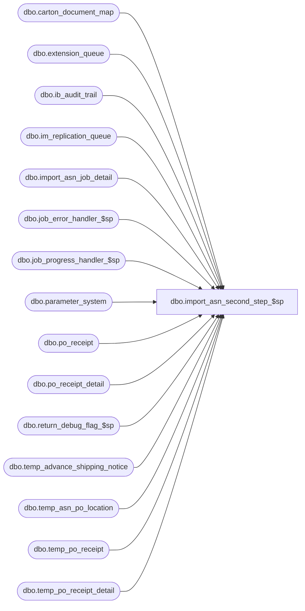

# dbo.import_asn_second_step_$sp

**Database:** me_01  
**Server:** bedrockdb02  

## Architecture Diagram



## Table Dependencies

| Referenced Table |
|---|
| dbo.carton_document_map |
| dbo.extension_queue |
| dbo.ib_audit_trail |
| dbo.im_replication_queue |
| dbo.import_asn_job_detail |
| dbo.job_error_handler_$sp |
| dbo.job_progress_handler_$sp |
| dbo.parameter_system |
| dbo.po_receipt |
| dbo.po_receipt_detail |
| dbo.return_debug_flag_$sp |
| dbo.temp_advance_shipping_notice |
| dbo.temp_asn_po_location |
| dbo.temp_po_receipt |
| dbo.temp_po_receipt_detail |

## Stored Procedure Code

```sql
CREATE PROCEDURE [dbo].[import_asn_second_step_$sp]
  (@job_id INT, @debug_flag BIT)

AS
/*
  Version		: 1.00
  Created		: 2010/09/28
  Created by	: Pierrette Lemay
  Description	: This procedure is part of the import ASN process,
          it executes the second transaction of the import ASN for the job that is passed as an in parameter.

        -- Second Step: If parameter_im.gen_po_receipt_for_asn_flag is ON
        -- Create po_receipt document (header and detail) for each location part of the temp_asn_po_location
        -- Insert carton_document_map from the newly created po_receipt
        -- Insert into ib_audit_trail to signal po receipt / create
          -- Insert second step into import_asn_job_detail
  History	: Defect #130871 PO Receipt match status unmatched when auto-generated from asn with Received document status and imat is off.

  Date		developer	defect/description
  2014/07/25	Feng		ME5.0.FT62701.Wholesale Integration (In-transit inventory) UC008 – Generate ASN Receipts - ASN Import Via Pipeline  & XML Coding
              table po_receipt: add shipped_date, track_in_transit_flag, discrepancy_posted
              table po_receipt_detail: add units_shipped

*/

BEGIN
  DECLARE @line_id SMALLINT, @job_type TINYINT, @proc_name NVARCHAR(30), @sql_err_num DECIMAL(38,0),
      @table_name NVARCHAR(30), @operation_name NVARCHAR(30), @error_msg NVARCHAR(2000), @return_flag BIT,
      @second_step TINYINT, @c_true BIT, @c_false BIT, @n_retry tinyint, @delay NCHAR(8), @installed_invmtch_flag BIT;

  SELECT @job_type	= 10
    , @proc_name	= N'import_asn_second_step_$sp'
    , @line_id		= 10
    , @c_false		= 0
    , @c_true		= 1
    , @second_step	= 2
    , @n_retry		= 0
    , @delay		= N'00:00:05'
    , @installed_invmtch_flag = installed_invmtch_flag
  FROM parameter_system;;

  step_2:
  BEGIN TRY
    BEGIN TRAN

    INSERT INTO po_receipt
           ( po_receipt_id
           , po_id
           , location_id
           , unit_weight_id
           , container_type_id
           , ship_via_id
           , carrier_id
           , advance_shipping_notice_id
           , document_no
           , create_date
           , receive_date
           , shipped_date
           , weight
           , no_of_containers
           , pro_bill_no
           , document_source
           , state_no
           , last_activity_date
           , updatestamp
           , match_status
           , last_item_id
           , ticket_source
           , ticket_status
           , document_status
       , track_in_transit_flag
       , discrepancy_posted)
        SELECT pr.po_receipt_id
       , pr.po_id
       , pr.location_id
       , a.unit_weight_id
       , a.container_type_id
       , a.ship_via_id
       , a.carrier_id
       , pr.advance_shipping_notice_id
       , pr.document_no
       , GETDATE() -- create_date
       , pr.receive_date
       , pr.shipped_date
       , a.weight
       , a.no_of_containers
       , a.pro_bill_no
       , 3 -- document source
       , pr.state_no
       , GETDATE() -- last activity date
       , 1
       , match_status =
         CASE
          WHEN (@installed_invmtch_flag = 1 AND pr.document_status = 4) THEN 2 -- Defect #130871: 2 for CUnmatchedIMMatchStatus
          ELSE 1 -- Defect #130871: 1 for CPrelimIMMatchStatus
         END
       , pr.last_item_id
       , pr.ticket_source
       , pr.ticket_status
       , pr.document_status
       , pr.track_in_transit_flag
       , pr.discrepancy_posted
    FROM temp_po_receipt pr WITH (NOLOCK), temp_advance_shipping_notice a WITH (NOLOCK), temp_asn_po_location apl WITH (NOLOCK)
    WHERE pr.job_id = @job_id
    AND pr.job_id = a.job_id
    AND a.job_id = apl.job_id
    AND pr.advance_shipping_notice_id = a.advance_shipping_notice_id
    AND pr.advance_shipping_notice_id = apl.advance_shipping_notice_id
    AND pr.location_id = apl.ship_to_location_id
    AND apl.po_id = pr.po_id;

    -- Log progress if job_params.debug_flag is true OR job_header.debug_flag is true
    EXEC return_debug_flag_$sp @job_type, @return_flag OUT
    IF (@return_flag = @c_true OR @debug_flag = @c_true)
      EXEC job_progress_handler_$sp @job_type, @job_id, @proc_name, @line_id;

    SET @line_id = 20;

    INSERT INTO po_receipt_detail
       ( po_receipt_detail_id
       , po_receipt_id
       , sku_id
       , style_id
       , style_color_id
       , carton_no
       , units_shipped
       , units_received
       , pack_id)
    SELECT po_receipt_detail_id
       , po_receipt_id
       , sku_id
       , style_id
       , style_color_id
       , carton_no
       , units_shipped
       , units_received
       , pack_id
    FROM temp_po_receipt_detail WITH (NOLOCK)
    WHERE job_id = @job_id;

    -- Log progress if job_params.debug_flag is true OR job_header.debug_flag is true
    EXEC return_debug_flag_$sp @job_type, @return_flag OUT
    IF (@return_flag = @c_true OR @debug_flag = @c_true)
      EXEC job_progress_handler_$sp @job_type, @job_id, @proc_name, @line_id;

    SET @line_id = 30;

    INSERT INTO carton_document_map
      ( carton_no
      , document_type
      , document_id
      , location_id
      , carton_arrived_flag)
    SELECT DISTINCT prd.carton_no
       , 5 -- document type for po_receipt is 5
       , pr.po_receipt_id
       , pr.location_id
       , CASE WHEN pr.document_status = 4 THEN 1 ELSE 0 END
    FROM temp_po_receipt pr WITH (NOLOCK), temp_po_receipt_detail prd WITH (NOLOCK)
    WHERE pr.job_id = @job_id
    AND prd.carton_no IS NOT NULL
    AND pr.job_id = prd.job_id
    AND pr.po_receipt_id = prd.po_receipt_id;

    -- Log progress if job_params.debug_flag is true OR job_header.debug_flag is true
    EXEC return_debug_flag_$sp @job_type, @return_flag OUT
    IF (@return_flag = @c_true OR @debug_flag = @c_true)
      EXEC job_progress_handler_$sp @job_type, @job_id, @proc_name, @line_id;

    SET @line_id = 40;

    INSERT INTO ib_audit_trail
        ( entry_date
        , application
        , activity
        , application_type
        , application_identifier
        , employee_last_name
        , employee_first_name )
    SELECT create_date
      , N'IM'
      , N'Create'
      , N'POReceipt'
      , document_no
      , N'Admin'
      , N'Admin'
    FROM temp_po_receipt WITH (NOLOCK)
    WHERE job_id = @job_id
    ORDER BY po_receipt_id;

    -- Log progress if job_params.debug_flag is true OR job_header.debug_flag is true
    EXEC return_debug_flag_$sp @job_type, @return_flag OUT
    IF (@return_flag = @c_true OR @debug_flag = @c_true)
      EXEC job_progress_handler_$sp @job_type, @job_id, @proc_name, @line_id;

    SET @line_id = 50;
    -- Insert into extension_queue part of po_receipt saved
    -- column type is 5 for PO Receipt documents
    INSERT INTO extension_queue
      (type, entity_id, method_id, entity_name)
    SELECT 5, po_receipt_id, N'C91A7B40-0DF6-4166-B7A3-D62BD9EDC65E', document_no
    FROM temp_po_receipt WITH (NOLOCK)
    WHERE job_id = @job_id
    ORDER BY po_receipt_id;

    -- Log progress if job_params.debug_flag is true OR job_header.debug_flag is true
    EXEC return_debug_flag_$sp @job_type, @return_flag OUT
    IF (@return_flag = @c_true OR @debug_flag = @c_true)
      EXEC job_progress_handler_$sp @job_type, @job_id, @proc_name, @line_id;

    INSERT INTO im_replication_queue
      (
        entity_code
        ,replication_action
        ,action_date
        ,[entity_id]
        ,other_entity_id
        ,other_entity_key
        ,changed_units
        ,replication_data
      )
    SELECT
      10 AS entity_code
      ,'IR' AS replication_action
      ,GETDATE() AS action_date
      ,po_receipt_id AS [entity_id]
      ,0 AS other_entity_id
      ,'N/A' AS other_entity_key
      ,0 AS changed_units
      ,'N/A' AS replication_data
    FROM
      temp_po_receipt WITH (NOLOCK)
    WHERE
      job_id = @job_id
      AND document_status = 4;

    SET @line_id = 60;

    -- Keep track of this job_step completed in job_detail
    INSERT INTO import_asn_job_detail
       (job_id, job_step_id, time_stamp)
    VALUES (@job_id, @second_step, GETDATE());

    COMMIT TRAN

    -- Log progress if job_params.debug_flag is true OR job_header.debug_flag is true
    EXEC return_debug_flag_$sp @job_type, @return_flag OUT
    IF (@return_flag = @c_true OR @debug_flag = @c_true)
      EXEC job_progress_handler_$sp @job_type, @job_id, @proc_name, @line_id;

  END TRY
  BEGIN CATCH
    IF @@TRANCOUNT > 0
      ROLLBACK TRANSACTION;

    SET @n_retry = @n_retry + 1;

    IF @n_retry <= 3
    BEGIN
      WAITFOR DELAY @delay
      GOTO step_2
    END
    ELSE
    BEGIN
      SELECT @error_msg = N'Error ' + CAST(ERROR_NUMBER() AS NVARCHAR(20)) + N' : in the second step of job #%i after 3 retries because of ' + ERROR_MESSAGE(),
        @sql_err_num		= ERROR_NUMBER()

      IF @line_id = 10
        SELECT  @table_name		= N'po_receipt'
          , @operation_name	= N'INSERT'
      ELSE IF @line_id = 20
        SELECT @table_name		= N'po_receipt_detail'
          , @operation_name	= N'INSERT'
      ELSE IF @line_id = 30
        SELECT  @table_name		= N'carton_document_map'
          , @operation_name	= N'INSERT'
      ELSE IF @line_id = 40
        SELECT  @table_name		= N'ib_audit_trail'
          , @operation_name	= N'INSERT'
      ELSE IF @line_id = 50
        SELECT  @table_name		= N'extension_queue'
          , @operation_name	= N'INSERT';
      ELSE IF @line_id = 60
        SELECT  @table_name		= N'import_asn_job_detail'
          , @operation_name	= N'INSERT';

      EXEC job_error_handler_$sp
          @job_type
          , @job_id
          , @proc_name
          , @line_id
          , @sql_err_num
          , @table_name
          , @operation_name
          , @error_msg
          , @c_true;
    END

  END CATCH
END
```

