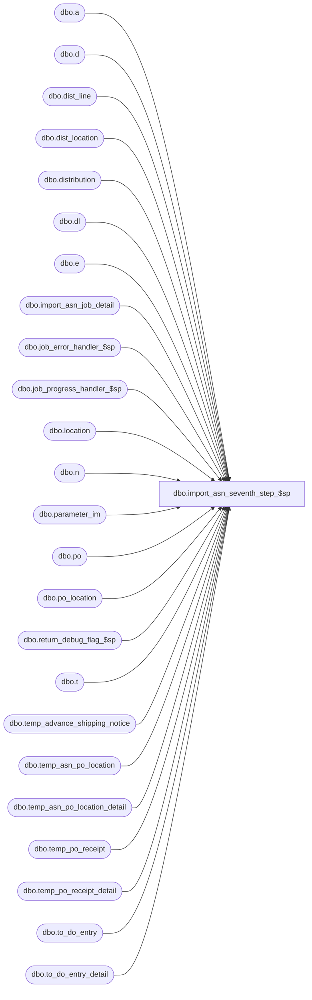

# dbo.import_asn_seventh_step_$sp

**Database:** me_01  
**Server:** bedrockdb02  

## Architecture Diagram



## Table Dependencies

| Referenced Table |
|---|
| dbo.a |
| dbo.d |
| dbo.dist_line |
| dbo.dist_location |
| dbo.distribution |
| dbo.dl |
| dbo.e |
| dbo.import_asn_job_detail |
| dbo.job_error_handler_$sp |
| dbo.job_progress_handler_$sp |
| dbo.location |
| dbo.n |
| dbo.parameter_im |
| dbo.po |
| dbo.po_location |
| dbo.return_debug_flag_$sp |
| dbo.t |
| dbo.temp_advance_shipping_notice |
| dbo.temp_asn_po_location |
| dbo.temp_asn_po_location_detail |
| dbo.temp_po_receipt |
| dbo.temp_po_receipt_detail |
| dbo.to_do_entry |
| dbo.to_do_entry_detail |

## Stored Procedure Code

```sql
CREATE PROCEDURE [dbo].[import_asn_seventh_step_$sp]
  (@job_id INT, @debug_flag BIT)

AS

/*
  Description	: This procedure is part of the import ASN process, it executes the seventh transaction of the import ASN
          for the job that is passed as an in parameter when parameter_system.installed_replen_flag is set to 1.
          Some ASN and po_receipt documents were created previously for the currently processed job in previous steps,
          this procedure represents step #7:

          Maintain AR to do worklist fot the newly created IM documents:

          - ASN created for Bulk PO/Dropship PO with WH/DC locations which does not automatically generate a PO Receipt
          - PO Receipt with status Receive.
*/

BEGIN
  DECLARE @line_id SMALLINT, @count TINYINT, @job_type TINYINT, @proc_name NVARCHAR(30), @sql_err_num DECIMAL(38,0),
      @table_name	NVARCHAR(30), @operation_name NVARCHAR(30), @error_msg NVARCHAR(2000), @return_flag BIT,
      @c_true BIT, @c_false BIT, @seventh_step TINYINT, @n_retry tinyint, @delay NCHAR(8);

  SELECT @job_type		= 10
    , @proc_name		= N'import_asn_seventh_step_$sp'
    , @c_false			= 0
    , @c_true			= 1
    , @line_id			= 10
    , @seventh_step		= 7
    , @n_retry			= 0
    , @delay			= N'00:00:05'
  FROM parameter_im WITH (NOLOCK);

  IF NOT object_id(N'tempdb..#po_receipt_list') IS NULL
      DROP TABLE #po_receipt_list;

  CREATE TABLE #po_receipt_list
    (po_receipt_id decimal(12) NOT NULL);

  IF NOT object_id(N'tempdb..#asn_list') IS NULL
      DROP TABLE #asn_list;

  CREATE TABLE #asn_list
    (advance_shipping_notice_id decimal(12) NOT NULL);

  IF NOT object_id(N'tempdb..#tmp_to_do_entry') IS NULL
      DROP TABLE #tmp_to_do_entry;

  CREATE TABLE #tmp_to_do_entry
    (to_do_entry_id binary(16) NOT NULL,
    new_to_do_entry_id binary(16) NOT NULL,
    po_id decimal(12, 0) NOT NULL,
    po_line_id int NOT NULL,
    location_id smallint NULL,
    asn_po_location_id decimal(13, 0) NULL,
    po_receipt_id decimal(12, 0) NULL);

  IF NOT object_id(N'tempdb..#temp_to_do_entry') IS NULL
      DROP TABLE #temp_to_do_entry;

  CREATE TABLE #temp_to_do_entry
    (to_do_entry_id binary(16) NOT NULL,
    document_source smallint NOT NULL,
    distribution_id bigint NULL,
    po_id decimal(12, 0) NULL,
    po_line_id int NULL,
    po_shipment_id smallint NULL,
    location_id smallint NULL,
    po_line_total_units int NULL,
    receipt_date smalldatetime NULL,
    asn_po_location_id decimal(13, 0) NULL,
    po_receipt_id decimal(12, 0) NULL,
    style_color_id decimal(13, 0) NULL,
    pack_id decimal(12, 0) NULL,
    request_type smallint NULL,
    locked_flag bit NOT NULL );

  IF NOT object_id(N'tempdb..#temp_to_do_entry_detail') IS NULL
    DROP TABLE #temp_to_do_entry_detail;

  CREATE TABLE #temp_to_do_entry_detail (
    to_do_entry_detail_id int NOT NULL,
    to_do_entry_id binary(16) NOT NULL,
    units int NOT NULL,
    sku_id decimal(13, 0) NOT NULL);

  IF NOT object_id(N'tempdb..#asn_po_loc_dist') IS NULL
    DROP TABLE #asn_po_loc_dist;

  CREATE TABLE #asn_po_loc_dist
        (asn_po_location_id DECIMAL(13,0) NOT NULL,
        po_id DECIMAL(12,0) NOT NULL,
        location_id SMALLINT NOT NULL,
        po_line_id INT NOT NULL,
        distribution_id BIGINT NULL)

  IF NOT object_id(N'tempdb..#rm_po_loc_dist') IS NULL
    DROP TABLE #rm_po_loc_dist;

  CREATE TABLE #rm_po_loc_dist
        (po_receipt_id DECIMAL(12,0) NOT NULL,
        po_id DECIMAL(12,0) NOT NULL,
        location_id SMALLINT NOT NULL,
        po_line_id INT NOT NULL,
        distribution_id BIGINT NULL)

  IF NOT object_id(N'tempdb..#tmp_asn_po_loc_dist') IS NULL
    DROP TABLE #tmp_asn_po_loc_dist;

  CREATE TABLE #tmp_asn_po_loc_dist
        (asn_po_location_id DECIMAL(13,0) NOT NULL,
        po_id DECIMAL(12,0) NOT NULL,
        location_id SMALLINT NOT NULL,
        po_line_id INT NOT NULL,
        distribution_id BIGINT NOT NULL)

  IF NOT object_id(N'tempdb..#tmp_rm_po_loc_dist') IS NULL
    DROP TABLE #tmp_rm_po_loc_dist;

  CREATE TABLE #tmp_rm_po_loc_dist
        (po_receipt_id DECIMAL(12,0) NOT NULL,
        po_id DECIMAL(12,0) NOT NULL,
        location_id SMALLINT NOT NULL,
        po_line_id INT NOT NULL,
        distribution_id BIGINT NOT NULL)

  IF NOT object_id(N'tempdb..#asn_po_loc_list') IS NULL
    DROP TABLE #asn_po_loc_list;

  CREATE TABLE #asn_po_loc_list
        (asn_po_location_id DECIMAL(13,0) NOT NULL,
        po_id DECIMAL(12,0) NOT NULL,
        location_id SMALLINT NOT NULL,
        po_line_id INT NOT NULL)

  IF NOT object_id(N'tempdb..#rm_po_loc_list') IS NULL
    DROP TABLE #rm_po_loc_list;

  CREATE TABLE #rm_po_loc_list
        (po_receipt_id DECIMAL(12,0) NOT NULL,
        po_id DECIMAL(12,0) NOT NULL,
        location_id SMALLINT NOT NULL,
        po_line_id INT NOT NULL)

  IF NOT object_id(N'tempdb..#dist_list') IS NULL
    DROP TABLE #dist_list;

  CREATE TABLE #dist_list
        (po_id DECIMAL(12,0) NOT NULL,
        location_id SMALLINT NOT NULL,
        po_line_id INT NOT NULL,
        distribution_id BIGINT NOT NULL)

  IF NOT object_id(N'tempdb..#temp_missing_entry') IS NULL
    DROP TABLE #temp_missing_entry;

  CREATE TABLE #temp_missing_entry
        (im_document_id DECIMAL(12,0) NOT NULL,
        po_id DECIMAL(12,0) NOT NULL,
        location_id SMALLINT NOT NULL,
        po_line_id INT NOT NULL,
        distribution_id BIGINT NULL)

  IF NOT object_id(N'tempdb..#new_to_do_copy') IS NULL
    DROP TABLE #new_to_do_copy;

  CREATE TABLE #new_to_do_copy
    (to_do_entry_id binary(16) NOT NULL,
    po_id decimal(12, 0) NULL,
    po_line_id int NULL,
    location_id smallint NULL,
    asn_po_location_id decimal(13, 0) NULL,
    po_receipt_id decimal(12, 0) NULL);

  IF NOT object_id(N'tempdb..#new_to_do_entry') IS NULL
    DROP TABLE #new_to_do_entry;

  CREATE TABLE #new_to_do_entry
    (to_do_entry_id binary(16) NOT NULL,
    document_source smallint NOT NULL,
    po_id decimal(12, 0) NULL,
    po_line_id int NULL,
    po_shipment_id smallint NULL,
    location_id smallint NULL,
    po_line_total_units int NULL,
    receipt_date smalldatetime NULL,
    asn_po_location_id decimal(13, 0) NULL,
    po_receipt_id decimal(12, 0) NULL,
    style_color_id decimal(13, 0) NULL,
    pack_id decimal(12, 0) NULL,
    distribution_id bigint NULL,
    request_type smallint not null);

   IF NOT object_id(N'tempdb..#new_to_do_entry_detail') IS NULL
    DROP TABLE #new_to_do_entry_detail;

  CREATE TABLE #new_to_do_entry_detail (
    to_do_entry_detail_id int NOT NULL,
    to_do_entry_id binary(16) NOT NULL,
    units int NOT NULL,
    sku_id decimal(13) NOT NULL);

BEGIN TRY
    -- Only Received PO Receipt documents referencing Bulk or Dropship (with WH/DC) POs impact A&R
    INSERT INTO #po_receipt_list
      (po_receipt_id)
    SELECT po_receipt_id
    FROM temp_po_receipt r, po
    WHERE r.job_id = @job_id
    AND r.state_no IN (2)			-- 2 = Received state
    AND r.po_id = po.po_id
    AND po.source <> 6
    AND
      (
        po.predistribution_type = 1
        OR
          (
            po.predistribution_type = 2
            AND EXISTS
              (
                SELECT 1
                FROM po_location pol
                INNER JOIN location l ON pol.location_id = l.location_id
                WHERE
                  pol.po_id = po.po_id
                  AND l.location_type in (3,4)
              )
          )
      )

    -- Log progress if job_params.debug_flag is true OR job_header.debug_flag is true
    EXEC return_debug_flag_$sp @job_type, @return_flag OUT
    IF (@return_flag = @c_true OR @debug_flag = @c_true)
      EXEC job_progress_handler_$sp @job_type, @job_id, @proc_name, @line_id;

    SET @line_id = 20;
    -- ASN against Bulk POs (po.predistribution_type = 1 (Bulk))
    -- or against Dropship POs (po.predistribution_type = 2 (Pack by store dropship)) with WH/DC locations
    -- will update To Do Worklist when an ASN is received (which does not automatically generate a PO receipt),
    INSERT INTO #asn_list
      (advance_shipping_notice_id)
    SELECT DISTINCT advance_shipping_notice_id
    FROM temp_asn_po_location a, po
    WHERE a.job_id = @job_id
    AND a.po_id = po.po_id
    AND po.source <> 6
    AND
      (
        po.predistribution_type = 1
        OR
          (
            po.predistribution_type = 2
            AND EXISTS
              (
                SELECT 1
                FROM po_location pol
                INNER JOIN location l ON pol.location_id = l.location_id
                WHERE
                  pol.po_id = po.po_id
                  AND l.location_type in (3,4)
              )
          )
      )
    AND NOT EXISTS (SELECT 1 FROM #po_receipt_list l, temp_po_receipt r
            WHERE l.po_receipt_id = r.po_receipt_id
            AND r.job_id = @job_id
            AND r.advance_shipping_notice_id = a.advance_shipping_notice_id);

    -- Log progress if job_params.debug_flag is true OR job_header.debug_flag is true
    EXEC return_debug_flag_$sp @job_type, @return_flag OUT
    IF (@return_flag = @c_true OR @debug_flag = @c_true)
      EXEC job_progress_handler_$sp @job_type, @job_id, @proc_name, @line_id;

    IF EXISTS( SELECT 1 FROM #asn_list)
    BEGIN
      SET @line_id = 30;

      -- A&R06691.1 :	Upon a distribution request for a new ASN,
      -- the system will first determine if a valid distribution is in file for the ASN.
      -- The following conditions determines what is a valid distribution.

      -- 1. distribution requests that can be linked to existing distributions
      INSERT INTO #asn_po_loc_list
        (asn_po_location_id,po_id, location_id, po_line_id)
      SELECT DISTINCT a.asn_po_location_id, a.po_id, a.ship_to_location_id, ad.po_line_id
      FROM #asn_list l, temp_asn_po_location a WITH (NOLOCK), temp_asn_po_location_detail ad WITH (NOLOCK)
      WHERE a.job_id = @job_id
      AND l.advance_shipping_notice_id = a.advance_shipping_notice_id
      AND a.job_id = ad.job_id
      AND a.asn_po_location_id = ad.asn_po_location_id

      INSERT INTO #dist_list
        (po_id, location_id, po_line_id, distribution_id)
      SELECT DISTINCT l.po_id, l.location_id, l.po_line_id, d.distribution_id
      FROM #asn_po_loc_list l
      INNER JOIN temp_asn_po_location a WITH (NOLOCK)
        ON  l.asn_po_location_id = a.asn_po_location_id
        AND a.job_id = @job_id
      INNER JOIN distribution d WITH (NOLOCK)
        ON  l.po_id = d.po_id
        AND l.location_id = d.location_id
        -- 1 = Bulk PO, 4 = ASN and 14 = Dropship PO for WH/DC
        AND d.document_source IN (1, 4, 14)
        AND (d.advance_shipping_notice_id IS NULL OR
             d.advance_shipping_notice_id = a.advance_shipping_notice_id)
        AND d.distribution_status BETWEEN 2 AND 7
        AND d.retain_for_distribution_flag = 1
      INNER JOIN dist_line dl WITH (NOLOCK)
        ON  d.distribution_id = dl.distribution_id
        AND l.po_line_id = dl.po_line_id

      WHILE EXISTS (SELECT 1 FROM #asn_po_loc_list)
        AND EXISTS (SELECT 1 FROM #dist_list)
      BEGIN
        TRUNCATE TABLE #tmp_asn_po_loc_dist

        INSERT INTO #tmp_asn_po_loc_dist
          (asn_po_location_id, po_id, location_id, po_line_id, distribution_id)
        SELECT a.asn_po_location_id, a.po_id, a.location_id, a.po_line_id, d.distribution_id
        FROM (
          SELECT l.po_id, l.location_id, l.po_line_id,
            MIN(l.asn_po_location_id) asn_po_location_id
          FROM #asn_po_loc_list l
          GROUP BY l.po_id, l.location_id, l.po_line_id) a
        INNER JOIN (
          SELECT l.po_id, l.location_id, l.po_line_id,
            MIN(d.expected_receipt_date) expected_receipt_date
          FROM #dist_list l
          INNER JOIN distribution d WITH (NOLOCK)
            ON l.distribution_id = d.distribution_id
          GROUP BY l.po_id, l.location_id, l.po_line_id) T
          ON  T.po_id = a.po_id
          AND T.location_id = a.location_id
          AND T.po_line_id = a.po_line_id
        INNER JOIN distribution d WITH (NOLOCK)
          ON  d.po_id = T.po_id
          AND d.po_id = a.po_id
          AND d.location_id = T.location_id
          AND d.location_id = a.location_id
          AND d.expected_receipt_date = T.expected_receipt_date
        INNER JOIN dist_line dl WITH (NOLOCK)
          ON  d.distribution_id = dl.distribution_id
          AND dl.po_line_id = T.po_line_id
          AND dl.po_line_id = a.po_line_id

        INSERT INTO #asn_po_loc_dist
          (asn_po_location_id,po_id, location_id, po_line_id, distribution_id)
        SELECT asn_po_location_id,po_id, location_id, po_line_id, distribution_id
        FROM #tmp_asn_po_loc_dist

        DELETE a
        FROM #asn_po_loc_list a
        INNER JOIN #tmp_asn_po_loc_dist t
          ON  a.asn_po_location_id = t.asn_po_location_id
          AND a.po_id = t.po_id
          AND a.location_id = t.location_id
          AND a.po_line_id = t.po_line_id

        DELETE d
        FROM #dist_list d
        INNER JOIN #tmp_asn_po_loc_dist t
          ON  d.po_id = t.po_id
          AND d.location_id = t.location_id
          AND d.po_line_id = t.po_line_id
          AND d.distribution_id = t.distribution_id

      END

      -- Log progress if job_params.debug_flag is true OR job_header.debug_flag is true
      EXEC return_debug_flag_$sp @job_type, @return_flag OUT
      IF (@return_flag = @c_true OR @debug_flag = @c_true)
        EXEC job_progress_handler_$sp @job_type, @job_id, @proc_name, @line_id;

      SET @line_id = 31;
      -- 2. distribution requests that can not be linked to existing distributions
      IF EXISTS (SELECT 1 FROM #asn_po_loc_list)
      BEGIN
        INSERT INTO #asn_po_loc_dist
          (asn_po_location_id,po_id, location_id, po_line_id, distribution_id)
        SELECT asn_po_location_id,po_id, location_id, po_line_id, NULL
        FROM #asn_po_loc_list
      END

      -- Log progress if job_params.debug_flag is true OR job_header.debug_flag is true
      EXEC return_debug_flag_$sp @job_type, @return_flag OUT
      IF (@return_flag = @c_true OR @debug_flag = @c_true)
        EXEC job_progress_handler_$sp @job_type, @job_id, @proc_name, @line_id;

      SET @line_id = 32;

      /*
      A&R06691.3:	Upon a distribution request for a new ASN, if a distribution is already on file based on PO
            then update the Distribution as follows:
      A&R06691.3.1 :	Set the ASN Number on the Distribution Line.
      A&R06691.3.2 :	Set the Expected Receipt Date on the Distribution Header to the expected receipt fate of the ASN.
      */
      BEGIN TRAN
        UPDATE dl
        SET advance_shipping_notice_id = ap.advance_shipping_notice_id
        FROM dist_line dl WITH (NOLOCK)
        INNER JOIN #asn_po_loc_dist t
          ON  dl.distribution_id = t.distribution_id
          AND dl.po_line_id = t.po_line_id
        INNER JOIN temp_asn_po_location ap
          ON  t.asn_po_location_id = ap.asn_po_location_id
          AND ap.job_id = @job_id

        UPDATE d
        SET expected_receipt_date = rd.expected_receipt_date
        FROM distribution d WITH (NOLOCK)
        INNER JOIN (
            SELECT t.distribution_id, MAX(a.expected_receipt_date) expected_receipt_date
            FROM #asn_po_loc_dist t
            INNER JOIN temp_asn_po_location ap
              ON  t.asn_po_location_id = ap.asn_po_location_id
              AND ap.job_id = @job_id
            INNER JOIN temp_advance_shipping_notice a
              ON  ap.advance_shipping_notice_id = a.advance_shipping_notice_id
 AND a.job_id = @job_id
            GROUP BY t.distribution_id
          ) rd
          ON  d.distribution_id = rd.distribution_id

        -- Update dist_location expected_receipt_date
        UPDATE dl
        SET expected_receipt_date = rd.expected_receipt_date
        FROM dist_location dl WITH (NOLOCK)
        INNER JOIN (
            SELECT t.distribution_id, MAX(a.expected_receipt_date) expected_receipt_date
            FROM #asn_po_loc_dist t
            INNER JOIN temp_asn_po_location ap
              ON  t.asn_po_location_id = ap.asn_po_location_id
              AND ap.job_id = @job_id
            INNER JOIN temp_advance_shipping_notice a
              ON  ap.advance_shipping_notice_id = a.advance_shipping_notice_id
              AND a.job_id = @job_id
            GROUP BY t.distribution_id
          ) rd
          ON  dl.distribution_id = rd.distribution_id

      COMMIT TRAN

      -- Log progress if job_params.debug_flag is true OR job_header.debug_flag is true
      EXEC return_debug_flag_$sp @job_type, @return_flag OUT
      IF (@return_flag = @c_true OR @debug_flag = @c_true)
        EXEC job_progress_handler_$sp @job_type, @job_id, @proc_name, @line_id;

      SET @line_id = 33;

      /*
      A&R06691.4 :	If there is a Distribution on file, then the system must make sure that
              the units available (for each SKU of the style/color or style/pack) match
              the ASN units (for each SKU of the style/color or style/pack).
      A&R06691.4.1 :	If the units received do not match the Distribution, then add an entry to the rework list,
              requesting the user to rework the distribution, based on the new ASN quantities.
      A&R06691.4.2 :	To determine if the quantities on ASN for a SKU/PO match the quantities on the distribution on file,
              the quantity on the ASN for the SKU/PO must be compared to the distribution
              line's SKU Quantity Available. If a SKU exists on the ASN and it does not exist on
              the distribution line or it is zero on the distribution, this is a no match.
      */
      -- loose items
      INSERT INTO #new_to_do_entry
        (to_do_entry_id, document_source, distribution_id, po_id, po_line_id, po_shipment_id, location_id, po_line_total_units,
        receipt_date, asn_po_location_id, po_receipt_id, style_color_id, pack_id, request_type)
      SELECT newid(), 4, a.distribution_id, tp.po_id, a.po_line_id, di.po_shipment_id, tp.ship_to_location_id, NULL,
        ta.expected_receipt_date, a.asn_po_location_id, NULL, a.style_color_id, NULL, 6
      FROM (
          SELECT ad.asn_po_location_id, ad.distribution_id, t.style_color_id, t.po_line_id,
            SUM(t.units_sent) units_sent
          FROM #asn_po_loc_dist ad
          INNER JOIN temp_asn_po_location_detail t WITH (NOLOCK)
            ON  ad.asn_po_location_id = t.asn_po_location_id
            AND ad.po_line_id = t.po_line_id
            AND ad.distribution_id IS NOT NULL
            AND t.job_id = @job_id
            AND t.pack_id IS NULL
          GROUP BY ad.asn_po_location_id, ad.distribution_id, t.style_color_id, t.po_line_id
        ) a
      INNER JOIN (
          SELECT ad.asn_po_location_id, ad.distribution_id, dl.style_color_id, dl.po_line_id,
            SUM(dl.available_quantity) available_quantity
          FROM #asn_po_loc_dist ad
          INNER JOIN dist_line dl WITH (NOLOCK)
            ON  ad.distribution_id = dl.distribution_id
            AND ad.po_line_id = dl.po_line_id
            AND dl.pack_id IS NULL
          GROUP BY ad.asn_po_location_id, ad.distribution_id, dl.style_color_id, dl.po_line_id
        ) d
        ON  a.distribution_id = d.distribution_id
        AND a.style_color_id = d.style_color_id
        AND a.po_line_id = d.po_line_id
        AND a.units_sent <> d.available_quantity
      INNER JOIN temp_asn_po_location tp WITH (NOLOCK)
        ON  a.asn_po_location_id = tp.asn_po_location_id
        AND tp.job_id = @job_id
      INNER JOIN temp_advance_shipping_notice ta WITH (NOLOCK)
        ON  tp.advance_shipping_notice_id = ta.advance_shipping_notice_id
        AND ta.job_id = @job_id
      INNER JOIN distribution di WITH (NOLOCK)
        ON  d.distribution_id = di.distribution_id

      -- pack items
      INSERT INTO #new_to_do_entry
        (to_do_entry_id, document_source, distribution_id, po_id, po_line_id, po_shipment_id, location_id, po_line_total_units,
        receipt_date, asn_po_location_id, po_receipt_id, style_color_id, pack_id, request_type)
      SELECT newid(), 4, a.distribution_id, tp.po_id, a.po_line_id, di.po_shipment_id, tp.ship_to_location_id, a.units_sent,
        ta.expected_receipt_date, a.asn_po_location_id, NULL, NULL, a.pack_id, 6
      FROM (
          SELECT ad.asn_po_location_id, ad.distribution_id, t.pack_id, t.po_line_id,
            SUM(t.units_sent) units_sent
          FROM #asn_po_loc_dist ad
          INNER JOIN temp_asn_po_location_detail t WITH (NOLOCK)
            ON  ad.asn_po_location_id = t.asn_po_location_id
            AND ad.po_line_id = t.po_line_id
            AND ad.distribution_id IS NOT NULL
            AND t.job_id = @job_id
            AND t.pack_id IS NOT NULL
          GROUP BY ad.asn_po_location_id, ad.distribution_id, t.pack_id, t.po_line_id
        ) a
      INNER JOIN (
          SELECT ad.asn_po_location_id, ad.distribution_id, dl.pack_id, dl.po_line_id,
            SUM(dl.available_quantity) available_quantity
          FROM #asn_po_loc_dist ad
          INNER JOIN dist_line dl WITH (NOLOCK)
            ON  ad.distribution_id = dl.distribution_id
            AND ad.po_line_id = dl.po_line_id
            AND dl.pack_id IS NOT NULL
          GROUP BY ad.asn_po_location_id, ad.distribution_id, dl.pack_id, dl.po_line_id
        ) d
        ON  a.distribution_id = d.distribution_id
        AND a.pack_id = d.pack_id
        AND a.po_line_id = d.po_line_id
        AND a.units_sent <> d.available_quantity
      INNER JOIN temp_asn_po_location tp WITH (NOLOCK)
        ON  a.asn_po_location_id = tp.asn_po_location_id
        AND tp.job_id = @job_id
      INNER JOIN temp_advance_shipping_notice ta WITH (NOLOCK)
        ON  tp.advance_shipping_notice_id = ta.advance_shipping_notice_id
        AND ta.job_id = @job_id
      INNER JOIN distribution di WITH (NOLOCK)
        ON  d.distribution_id = di.distribution_id

      -- Log progress if job_params.debug_flag is true OR job_header.debug_flag is true
      EXEC return_debug_flag_$sp @job_type, @return_flag OUT
      IF (@return_flag = @c_true OR @debug_flag = @c_true)
        EXEC job_progress_handler_$sp @job_type, @job_id, @proc_name, @line_id;

      SET @line_id = 34;

      /*
      A&R06691.5 :	If there is no valid Distribution on file, then an entry is added to the To Do Worklist,
              requesting a new distribution where document source = ASN and request type = Store Breakdown.
      */
      -- loose items
      INSERT INTO #new_to_do_entry
        (to_do_entry_id, document_source, distribution_id, po_id, po_line_id, po_shipment_id, location_id, po_line_total_units,
        receipt_date, asn_po_location_id, po_receipt_id, style_color_id, pack_id, request_type)
      SELECT newid(), 4, NULL, tp.po_id, a.po_line_id, NULL, tp.ship_to_location_id, NULL,
        ta.expected_receipt_date, a.asn_po_location_id, NULL, a.style_color_id, NULL, 1
      FROM (
          SELECT DISTINCT ad.asn_po_location_id, t.style_color_id, t.po_line_id
          FROM #asn_po_loc_dist ad
          INNER JOIN temp_asn_po_location_detail t WITH (NOLOCK)
            ON  ad.asn_po_location_id = t.asn_po_location_id
            AND ad.po_line_id = t.po_line_id
            AND ad.distribution_id IS NULL
            AND t.job_id = @job_id
            AND t.pack_id IS NULL
        ) a
      INNER JOIN temp_asn_po_location tp WITH (NOLOCK)
        ON  a.asn_po_location_id = tp.asn_po_location_id
        AND tp.job_id = @job_id
      INNER JOIN temp_advance_shipping_notice ta WITH (NOLOCK)
        ON  tp.advance_shipping_notice_id = ta.advance_shipping_notice_id
        AND ta.job_id = @job_id

      -- pack items
      INSERT INTO #new_to_do_entry
        (to_do_entry_id, document_source, distribution_id, po_id, po_line_id, po_shipment_id, location_id, po_line_total_units,
        receipt_date, asn_po_location_id, po_receipt_id, style_color_id, pack_id, request_type)
      SELECT newid(), 4, NULL, tp.po_id, a.po_line_id, NULL, tp.ship_to_location_id, a.units_sent,
        ta.expected_receipt_date, a.asn_po_location_id, NULL, NULL, a.pack_id, 1
      FROM (
          SELECT ad.asn_po_location_id, t.pack_id, t.po_line_id, SUM(t.units_sent) units_sent
          FROM #asn_po_loc_dist ad
          INNER JOIN temp_asn_po_location_detail t WITH (NOLOCK)
            ON  ad.asn_po_location_id = t.asn_po_location_id
            AND ad.po_line_id = t.po_line_id
            AND ad.distribution_id IS NULL
            AND t.job_id = @job_id
            AND t.pack_id IS NOT NULL
          GROUP BY
            ad.asn_po_location_id, t.pack_id, t.po_line_id
        ) a
      INNER JOIN temp_asn_po_location tp WITH (NOLOCK)
        ON  a.asn_po_location_id = tp.asn_po_location_id
        AND tp.job_id = @job_id
      INNER JOIN temp_advance_shipping_notice ta WITH (NOLOCK)
        ON  tp.advance_shipping_notice_id = ta.advance_shipping_notice_id
        AND ta.job_id = @job_id

      -- Log progress if job_params.debug_flag is true OR job_header.debug_flag is true
      EXEC return_debug_flag_$sp @job_type, @return_flag OUT
      IF (@return_flag = @c_true OR @debug_flag = @c_true)
        EXEC job_progress_handler_$sp @job_type, @job_id, @proc_name, @line_id;


      SET @line_id = 35;
      -- For the distribution requests that are not linked to any existing distributions
      -- Check first if an entry already exists in the To Do Worklist for the same po line
      INSERT INTO #new_to_do_copy
        (to_do_entry_id, po_id, po_line_id, location_id, asn_po_location_id)
      SELECT to_do_entry_id, po_id, po_line_id, location_id, asn_po_location_id
      FROM #new_to_do_entry
      WHERE distribution_id IS NULL

      INSERT INTO #temp_to_do_entry
        (to_do_entry_id, document_source, distribution_id, po_id,
        po_line_id, po_shipment_id, location_id, po_line_total_units, receipt_date, asn_po_location_id,
        style_color_id, pack_id, request_type, locked_flag)
      SELECT DISTINCT e.to_do_entry_id, e.document_source, e.distribution_id, e.po_id,
         e.po_line_id, e.po_shipment_id, e.location_id, e.po_line_total_units, e.receipt_date,
        e.asn_po_location_id, e.style_color_id, e.pack_id, e.request_type, locked_flag
      FROM #new_to_do_copy t, to_do_entry e
      WHERE t.po_id = e.po_id
      AND t.po_line_id = e.po_line_id
      AND t.location_id = e.location_id
      AND e.distribution_id IS NULL
      AND e.locked_flag = 0
      AND (e.document_source = 1 OR													-- Bulk PO
         e.document_source = 14 OR													-- Dropship PO for WH/DC
         (e.document_source = 4 AND e.asn_po_location_id = t.asn_po_location_id))	-- ASN

      -- Log progress if job_params.debug_flag is true OR job_header.debug_flag is true
      EXEC return_debug_flag_$sp @job_type, @return_flag OUT
      IF (@return_flag = @c_true OR @debug_flag = @c_true)
        EXEC job_progress_handler_$sp @job_type, @job_id, @proc_name, @line_id;

      WHILE EXISTS (SELECT 1 FROM #temp_to_do_entry)
        AND EXISTS (SELECT 1 FROM #new_to_do_copy)
      BEGIN

        SET @line_id = 40;

        TRUNCATE TABLE #tmp_to_do_entry

        INSERT INTO #tmp_to_do_entry
          (to_do_entry_id, new_to_do_entry_id, po_id, po_line_id, a.location_id, asn_po_location_id)
        SELECT a.to_do_entry_id, n.to_do_entry_id, a.po_id, a.po_line_id, a.location_id, n.asn_po_location_id
        FROM #temp_to_do_entry a WITH (NOLOCK)
        INNER JOIN (
            SELECT po_id, po_line_id, location_id, MIN(receipt_date) receipt_date
            FROM #temp_to_do_entry WITH (NOLOCK)
            GROUP BY po_id, po_line_id, location_id
          ) b
          ON  a.po_id = b.po_id
          AND a.po_line_id = b.po_line_id
          AND a.receipt_date = b.receipt_date
          AND a.location_id = b.location_id
        INNER JOIN #new_to_do_copy n
          ON  a.po_id = n.po_id
          AND a.po_line_id = n.po_line_id
          AND a.location_id = n.location_id
        INNER JOIN (
            SELECT t.po_id, t.po_line_id, t.location_id, MIN(t.asn_po_location_id) asn_po_location_id
            FROM #new_to_do_copy t
            GROUP BY t.po_id, t.po_line_id, t.location_id
          ) t
          ON  n.po_id = t.po_id
          AND n.po_line_id = t.po_line_id
          AND n.asn_po_location_id = t.asn_po_location_id
          AND n.location_id = t.location_id

        -- Log progress if job_params.debug_flag is true OR job_header.debug_flag is true
        EXEC return_debug_flag_$sp @job_type, @return_flag OUT
        IF (@return_flag = @c_true OR @debug_flag = @c_true)
          EXEC job_progress_handler_$sp @job_type, @job_id, @proc_name, @line_id;

        SET @line_id = 50
        -- If an entry already exists in the worklist, the system will replace the PO lines with the ASN entries.
        -- update existing rows
        BEGIN TRAN

        UPDATE e
        SET e.document_source = 4,
          e.receipt_date = a.expected_receipt_date,
          e.asn_po_location_id = t.asn_po_location_id,
          e.request_type = 1
        FROM to_do_entry e WITH (NOLOCK)
        INNER JOIN #tmp_to_do_entry t
          ON  t.to_do_entry_id = e.to_do_entry_id
        INNER JOIN temp_asn_po_location asn WITH (NOLOCK)
          ON  asn.asn_po_location_id = t.asn_po_location_id
          AND asn.job_id = @job_id
        INNER JOIN temp_advance_shipping_notice a WITH (NOLOCK)
          ON  a.job_id = asn.job_id
          AND a.advance_shipping_notice_id = asn.advance_shipping_notice_id
          AND a.job_id = @job_id;

        -- Update for loose items
        UPDATE d
        SET d.units = A.units_sent
        FROM
          to_do_entry_detail d
        INNER JOIN
          (
            SELECT t.to_do_entry_id, d.sku_id, SUM(asnd.units_sent) units_sent
            FROM
              temp_asn_po_location_detail asnd WITH (NOLOCK)
            INNER JOIN #tmp_to_do_entry t
              ON t.asn_po_location_id = asnd.asn_po_location_id
            INNER JOIN to_do_entry_detail d WITH (NOLOCK)
              ON t.to_do_entry_id = d.to_do_entry_id
              AND asnd.sku_id = d.sku_id
            WHERE
              asnd.job_id = @job_id
              AND asnd.pack_id IS NULL
            GROUP BY
              t.to_do_entry_id, d.sku_id
          ) A ON d.to_do_entry_id = A.to_do_entry_id AND d.sku_id = A.sku_id;

        -- insert loose items that are not in the existing to do entries
        TRUNCATE TABLE #temp_to_do_entry_detail

        INSERT INTO  #temp_to_do_entry_detail
          (to_do_entry_detail_id, to_do_entry_id, units, sku_id)
        SELECT ROW_NUMBER() OVER(PARTITION BY t.to_do_entry_id ORDER BY asnd.sku_id ASC),
          t.to_do_entry_id, SUM(asnd.units_sent) units_sent, asnd.sku_id
        FROM temp_asn_po_location_detail asnd WITH (NOLOCK)
        INNER JOIN #tmp_to_do_entry t
          ON  t.asn_po_location_id = asnd.asn_po_location_id
          AND t.po_line_id = asnd.po_line_id
          AND asnd.job_id = @job_id
          AND asnd.pack_id IS NULL
        WHERE NOT EXISTS (
          SELECT 1
          FROM to_do_entry_detail d WITH (NOLOCK)
          WHERE t.to_do_entry_id = d.to_do_entry_id
          AND asnd.sku_id = d.sku_id)
        GROUP BY
          t.to_do_entry_id, asnd.sku_id;

        INSERT INTO  to_do_entry_detail
          (to_do_entry_detail_id, to_do_entry_id, units, sku_id)
        SELECT t.to_do_entry_detail_id + d.to_do_entry_detail_id,
          t.to_do_entry_id, t.units, t.sku_id
        FROM #temp_to_do_entry_detail t
        INNER JOIN (
            SELECT t.to_do_entry_id,
              MAX(d.to_do_entry_detail_id) to_do_entry_detail_id
            FROM #tmp_to_do_entry t
            INNER JOIN to_do_entry_detail d
              ON t.to_do_entry_id = d.to_do_entry_id
            GROUP BY t.to_do_entry_id) d
          ON t.to_do_entry_id = d.to_do_entry_id

        -- delete loose items that are not in the new to do entries
        DELETE d
        FROM to_do_entry_detail d WITH (NOLOCK)
        INNER JOIN #tmp_to_do_entry t
          ON  t.to_do_entry_id = d.to_do_entry_id
        WHERE NOT EXISTS (
          SELECT 1
          FROM temp_asn_po_location_detail asnd WITH (NOLOCK)
          WHERE t.asn_po_location_id = asnd.asn_po_location_id
          AND t.po_line_id = asnd.po_line_id
          AND asnd.sku_id = d.sku_id
          AND asnd.job_id = @job_id
          AND asnd.pack_id IS NULL);

        -- Update for pack
        UPDATE e
        SET e.po_line_total_units = A.units_sent
        FROM  to_do_entry e WITH (NOLOCK)
        INNER JOIN
          (
            SELECT e.to_do_entry_id, SUM(asnd.units_sent) units_sent
            FROM
              to_do_entry e WITH (NOLOCK)
            INNER JOIN #tmp_to_do_entry t
              ON  t.to_do_entry_id = e.to_do_entry_id
            INNER JOIN temp_asn_po_location_detail asnd
              ON  t.asn_po_location_id = asnd.asn_po_location_id
              AND asnd.pack_id = e.pack_id
              AND asnd.sku_id IS NULL
              AND asnd.job_id = @job_id
            GROUP BY e.to_do_entry_id
          ) A ON e.to_do_entry_id = A.to_do_entry_id;

        -- Since an existing entry is updated with the asn info for a po/line,
        -- a new to do entry doesn't need to be generated for it anymore
        DELETE n
        FROM #new_to_do_entry n
        INNER JOIN #tmp_to_do_entry tmp
          ON  n.to_do_entry_id = tmp.new_to_do_entry_id;

        COMMIT TRAN

        -- Log progress if job_params.debug_flag is true OR job_header.debug_flag is true
        EXEC return_debug_flag_$sp @job_type, @return_flag OUT
        IF (@return_flag = @c_true OR @debug_flag = @c_true)
          EXEC job_progress_handler_$sp @job_type, @job_id, @proc_name, @line_id;

        SET @line_id = 51;

        DELETE t
        FROM #temp_to_do_entry t
        INNER JOIN #tmp_to_do_entry tmp
          ON  t.to_do_entry_id =  tmp.to_do_entry_id;

        DELETE n
        FROM #new_to_do_copy n
        INNER JOIN #tmp_to_do_entry tmp
          ON  n.to_do_entry_id = tmp.new_to_do_entry_id;

        -- Log progress if job_params.debug_flag is true OR job_header.debug_flag is true
        EXEC return_debug_flag_$sp @job_type, @return_flag OUT
        IF (@return_flag = @c_true OR @debug_flag = @c_true)
          EXEC job_progress_handler_$sp @job_type, @job_id, @proc_name, @line_id;

      END

      SET @line_id = 130;

      INSERT INTO #new_to_do_entry_detail
        (to_do_entry_detail_id, to_do_entry_id, units ,sku_id)
      SELECT ROW_NUMBER() OVER(PARTITION BY t.to_do_entry_id ORDER BY ad.sku_id ASC) AS to_do_entry_detail_id,
        t.to_do_entry_id, SUM(ad.units_sent) units_sent, ad.sku_id
      FROM #new_to_do_entry t
      INNER JOIN temp_asn_po_location_detail ad
        ON  t.asn_po_location_id = ad.asn_po_location_id
        AND t.po_line_id = ad.po_line_id
        AND t.style_color_id = ad.style_color_id
        AND ad.job_id = @job_id
        AND t.pack_id IS NULL
        AND ad.pack_id IS NULL
      GROUP BY
        t.to_do_entry_id, ad.sku_id

      -- Log progress if job_params.debug_flag is true OR job_header.debug_flag is true
      EXEC return_debug_flag_$sp @job_type, @return_flag OUT
      IF (@return_flag = @c_true OR @debug_flag = @c_true)
        EXEC job_progress_handler_$sp @job_type, @job_id, @proc_name, @line_id;
    END;

    -- Apply the rules related to populate the A&R Worklist by PO Receipt
    IF EXISTS( SELECT 1 FROM #po_receipt_list)
    BEGIN
      SET @line_id = 200;
      /*
      A&R06689.5 :	Upon a distribution request for a new or modified PO receipt, the system will first determine if a valid distribution is in file for the PO Receipt.  The following conditions determines what is a valid distribution [A&R20001].
      A&R06689.5.1 :	The distribution document source must be Bulk PO, ASN or PO Receipt
      A&R06689.5.2 :	The distribution document must be for the same PO number as that on the PO Receipt.
      A&R06689.5.3 :	The style/color or style/pack on the distribution line must be the same as the PO receipt style/color or style/pack.
      A&R06689.5.4 :	The distribution status is either Preliminary, Pending Approval, Approval rejected, Open or Release
      A&R06689.5.5 :	If the distribution source is PO or ASN, then the distribution style/color or style/pack must be linked to the same PO Receipt or not be linked to any PO Receipt
      A&R06689.5.6 :	If the distribution source is PO Receipt, then the distribution style/color must be linked to the same PO Receipt.
      A&R06689.5.7 :	The distribution document must have the retain for distribution flag set to true.
      */
      -- 1. distribution requests that can be linked to existing distributions
      INSERT INTO #rm_po_loc_list
        (po_receipt_id,po_id, location_id, po_line_id)
      SELECT DISTINCT a.po_receipt_id, a.po_id, a.location_id, ad.po_line_id
      FROM #po_receipt_list l, temp_po_receipt a WITH (NOLOCK), temp_po_receipt_detail ad WITH (NOLOCK)
      WHERE a.job_id = @job_id
      AND l.po_receipt_id = a.po_receipt_id
      AND a.job_id = ad.job_id
      AND a.po_receipt_id = ad.po_receipt_id

      TRUNCATE TABLE #dist_list;

      INSERT INTO #dist_list
        (po_id, location_id, po_line_id, distribution_id)
      SELECT DISTINCT l.po_id, l.location_id, l.po_line_id, d.distribution_id
      FROM #rm_po_loc_list l
      INNER JOIN distribution d WITH (NOLOCK)
        ON  l.po_id = d.po_id
        AND l.location_id = d.location_id
        -- 1 = Bulk PO, 4 = ASN, 5 = PO receipt and 14 = Dropship PO for WH/DC
        AND d.document_source IN (1, 4, 5, 14)
        AND (d.po_receipt_id IS NULL OR
             d.po_receipt_id = l.po_receipt_id)
        AND d.distribution_status BETWEEN 2 AND 6
        AND d.retain_for_distribution_flag = 1
      INNER JOIN dist_line dl WITH (NOLOCK)
        ON  d.distribution_id = dl.distribution_id
        AND l.po_line_id = dl.po_line_id

      WHILE EXISTS (SELECT 1 FROM #rm_po_loc_list)
        AND EXISTS (SELECT 1 FROM #dist_list)
      BEGIN
        TRUNCATE TABLE #tmp_rm_po_loc_dist

        INSERT INTO #tmp_rm_po_loc_dist
          (po_receipt_id, po_id, location_id, po_line_id, distribution_id)
        SELECT a.po_receipt_id, a.po_id, a.location_id, a.po_line_id, d.distribution_id
        FROM (
          SELECT l.po_id, l.location_id, l.po_line_id,
            MIN(l.po_receipt_id) po_receipt_id
          FROM #rm_po_loc_list l
          GROUP BY l.po_id, l.location_id, l.po_line_id) a
        INNER JOIN (
          SELECT l.po_id, l.location_id, l.po_line_id,
            MIN(d.expected_receipt_date) expected_receipt_date
          FROM #dist_list l
          INNER JOIN distribution d WITH (NOLOCK)
            ON l.distribution_id = d.distribution_id
          GROUP BY l.po_id, l.location_id, l.po_line_id) T
          ON  T.po_id = a.po_id
          AND T.location_id = a.location_id
          AND T.po_line_id = a.po_line_id
        INNER JOIN distribution d WITH (NOLOCK)
          ON  d.po_id = T.po_id
          AND d.po_id = a.po_id
          AND d.location_id = T.location_id
          AND d.location_id = a.location_id
          AND d.expected_receipt_date = T.expected_receipt_date
        INNER JOIN dist_line dl WITH (NOLOCK)
          ON  d.distribution_id = dl.distribution_id
          AND dl.po_line_id = T.po_line_id
          AND dl.po_line_id = a.po_line_id

        INSERT INTO #rm_po_loc_dist
          (po_receipt_id,po_id, location_id, po_line_id, distribution_id)
        SELECT po_receipt_id, po_id, location_id, po_line_id, distribution_id
        FROM #tmp_rm_po_loc_dist

        DELETE a
        FROM #rm_po_loc_list a
        INNER JOIN #tmp_rm_po_loc_dist t
          ON  a.po_receipt_id = t.po_receipt_id
          AND a.po_id = t.po_id
          AND a.location_id = t.location_id
          AND a.po_line_id = t.po_line_id

        DELETE d
        FROM #dist_list d
        INNER JOIN #tmp_rm_po_loc_dist t
          ON  d.po_id = t.po_id
          AND d.location_id = t.location_id
          AND d.po_line_id = t.po_line_id
          AND d.distribution_id = t.distribution_id

      END

      -- Log progress if job_params.debug_flag is true OR job_header.debug_flag is true
      EXEC return_debug_flag_$sp @job_type, @return_flag OUT
      IF (@return_flag = @c_true OR @debug_flag = @c_true)
        EXEC job_progress_handler_$sp @job_type, @job_id, @proc_name, @line_id;

      SET @line_id = 201;
      -- 2. distribution requests that can not be linked to existing distributions
      IF EXISTS (SELECT 1 FROM #rm_po_loc_list)
      BEGIN
        INSERT INTO #rm_po_loc_dist
          (po_receipt_id, po_id, location_id, po_line_id, distribution_id)
        SELECT po_receipt_id, po_id, location_id, po_line_id, NULL
        FROM #rm_po_loc_list
      END

      -- Log progress if job_params.debug_flag is true OR job_header.debug_flag is true
      EXEC return_debug_flag_$sp @job_type, @return_flag OUT
      IF (@return_flag = @c_true OR @debug_flag = @c_true)
        EXEC job_progress_handler_$sp @job_type, @job_id, @proc_name, @line_id;

      SET @line_id = 202;

      /*
      A&R06689.6 :	Upon a distribution request for a new or modified PO receipt, if a distribution is already on file based on PO or ASN then update the Distribution as follows [A&R20002] :
      A&R06689.6.1 :	Set the PO Receipt Number on the Distribution Line.
      A&R06689.5.2 :	Set the Expected Receipt Date on the Distribution Header to the actual Receipt Date of the PO Receipt.
      */
      BEGIN TRAN
        UPDATE dl
        SET po_receipt_id = t.po_receipt_id
        FROM dist_line dl WITH (NOLOCK)
        INNER JOIN #rm_po_loc_dist t
          ON  dl.distribution_id = t.distribution_id
          AND dl.po_line_id = t.po_line_id

        UPDATE d
        SET expected_receipt_date = rd.receive_date
        FROM distribution d WITH (NOLOCK)
        INNER JOIN (
            SELECT r.distribution_id, MAX(receive_date) receive_date
            FROM #rm_po_loc_dist r
            INNER JOIN temp_po_receipt p
              ON  r.po_receipt_id = p.po_receipt_id
              AND p.job_id = @job_id
            GROUP BY r.distribution_id
          ) rd
          ON  d.distribution_id = rd.distribution_id

        --defect 148468: should update dist_location expected_receipt_date
        UPDATE dl
        SET expected_receipt_date = rd.expected_receipt_date
        FROM dist_location dl WITH (NOLOCK)
        INNER JOIN (
            SELECT t.distribution_id, MAX(a.expected_receipt_date) expected_receipt_date
            FROM #asn_po_loc_dist t
            INNER JOIN temp_asn_po_location ap
              ON  t.asn_po_location_id = ap.asn_po_location_id
              AND ap.job_id = @job_id
            INNER JOIN temp_advance_shipping_notice a
              ON  ap.advance_shipping_notice_id = a.advance_shipping_notice_id
              AND a.job_id = @job_id
            GROUP BY t.distribution_id
          ) rd
          ON  dl.distribution_id = rd.distribution_id

      COMMIT TRAN

      -- Log progress if job_params.debug_flag is true OR job_header.debug_flag is true
      EXEC return_debug_flag_$sp @job_type, @return_flag OUT
      IF (@return_flag = @c_true OR @debug_flag = @c_true)
        EXEC job_progress_handler_$sp @job_type, @job_id, @proc_name, @line_id;

      SET @line_id = 203;

      /*
      A&R06689.7 :	If there is a Distribution on file, then the system must make sure that the units available (for each SKU of the style/color or style/pack) match the PO Receipt units (for each SKU of the style/color or style/pack)  [A&R20003].
      A&R06689.7.1 :	If the units received do not match the Distribution, then add an entry to the rework list, requesting that the user to rework the distribution, based on the new receipt quantities.  Note that A&R will remind the user to also release the distribution [A&R20003.3].
      A&R06689.7.2 :	If the units received do match the Distribution, and the document status < `Released', then add an entry to the Rework list, requesting that the user Release the Distribution [A&R20003.4].
      A&R06689.7.3 :	To determine if the quantities on PO receipt for a SKU/PO match the quantities on the distribution on file, the quantity on the PO receipt for the SKU/PO must be compared to the distribution line's SKU Quantity Available. If a SKU exists on the PO receipt and it does not exist on the distribution line or it is zero on the distribution, this is a no match [A&R01579].
      */

      -- A&R06689.7.1 rework quantities
      -- loose items
      INSERT INTO #new_to_do_entry
        (to_do_entry_id, document_source, distribution_id, po_id, po_line_id, po_shipment_id, location_id, po_line_total_units,
        receipt_date, asn_po_location_id, po_receipt_id, style_color_id, pack_id, request_type)
      SELECT newid(), 5, a.distribution_id, tp.po_id, a.po_line_id, di.po_shipment_id, tp.location_id, NULL,
        tp.receive_date, NULL, tp.po_receipt_id, a.style_color_id, NULL, 6
      FROM (
          SELECT ad.po_receipt_id, ad.distribution_id, t.style_color_id, t.po_line_id,
            SUM(ISNULL(t.units_received, 0)) units_received
          FROM #rm_po_loc_dist ad
          INNER JOIN temp_po_receipt_detail t WITH (NOLOCK)
            ON  ad.po_receipt_id = t.po_receipt_id
            AND ad.po_line_id = t.po_line_id
            AND ad.distribution_id IS NOT NULL
            AND t.job_id = @job_id
            AND t.pack_id IS NULL
          GROUP BY ad.po_receipt_id, ad.distribution_id, t.style_color_id, t.po_line_id
        ) a
      INNER JOIN (
          SELECT ad.po_receipt_id, ad.distribution_id, dl.style_color_id, dl.po_line_id,
            SUM(dl.available_quantity) available_quantity
          FROM #rm_po_loc_dist ad
          INNER JOIN dist_line dl WITH (NOLOCK)
            ON  ad.distribution_id = dl.distribution_id
            AND ad.po_line_id = dl.po_line_id
            AND dl.pack_id IS NULL
          GROUP BY ad.po_receipt_id, ad.distribution_id, dl.style_color_id, dl.po_line_id
        ) d
        ON  a.distribution_id = d.distribution_id
        AND a.style_color_id = d.style_color_id
        AND a.po_line_id = d.po_line_id
        AND a.units_received <> d.available_quantity
      INNER JOIN temp_po_receipt tp WITH (NOLOCK)
        ON  a.po_receipt_id = tp.po_receipt_id
        AND tp.job_id = @job_id
      INNER JOIN distribution di WITH (NOLOCK)
        ON  d.distribution_id = di.distribution_id

      -- pack items
      INSERT INTO #new_to_do_entry
        (to_do_entry_id, document_source, distribution_id, po_id, po_line_id, po_shipment_id, location_id, po_line_total_units,
        receipt_date, asn_po_location_id, po_receipt_id, style_color_id, pack_id, request_type)
      SELECT newid(), 5, a.distribution_id, tp.po_id, a.po_line_id, di.po_shipment_id, tp.location_id, a.units_received,
        tp.receive_date, NULL, tp.po_receipt_id, NULL, a.pack_id, 6
      FROM (
          SELECT ad.po_receipt_id, ad.distribution_id, t.pack_id, t.po_line_id,
            SUM(ISNULL(t.units_received, 0)) units_received
          FROM #rm_po_loc_dist ad
          INNER JOIN temp_po_receipt_detail t WITH (NOLOCK)
            ON  ad.po_receipt_id = t.po_receipt_id
            AND ad.po_line_id = t.po_line_id
            AND ad.distribution_id IS NOT NULL
            AND t.job_id = @job_id
            AND t.pack_id IS NOT NULL
          GROUP BY ad.po_receipt_id, ad.distribution_id, t.pack_id, t.po_line_id
        ) a
      INNER JOIN (
          SELECT ad.po_receipt_id, ad.distribution_id, dl.pack_id, dl.po_line_id,
            SUM(dl.available_quantity) available_quantity
          FROM #rm_po_loc_dist ad
          INNER JOIN dist_line dl WITH (NOLOCK)
            ON  ad.distribution_id = dl.distribution_id
            AND ad.po_line_id = dl.po_line_id
            AND dl.pack_id IS NOT NULL
          GROUP BY ad.po_receipt_id, ad.distribution_id, dl.pack_id, dl.po_line_id
        ) d
        ON  a.distribution_id = d.distribution_id
        AND a.pack_id = d.pack_id
        AND a.po_line_id = d.po_line_id
        AND a.units_received <> d.available_quantity
      INNER JOIN temp_po_receipt tp WITH (NOLOCK)
        ON  a.po_receipt_id = tp.po_receipt_id
        AND tp.job_id = @job_id
      INNER JOIN distribution di WITH (NOLOCK)
        ON  d.distribution_id = di.distribution_id

      --A&R06689.7.2 release request
      -- loose items
      INSERT INTO #new_to_do_entry
        (to_do_entry_id, document_source, distribution_id, po_id, po_line_id, po_shipment_id, location_id, po_line_total_units,
        receipt_date, asn_po_location_id, po_receipt_id, style_color_id, pack_id, request_type)
      SELECT newid(), 5, a.distribution_id, tp.po_id, a.po_line_id, di.po_shipment_id, tp.location_id, NULL,
        tp.receive_date, NULL, tp.po_receipt_id, a.style_color_id, NULL, 3
      FROM (
          SELECT ad.po_receipt_id, ad.distribution_id, t.style_color_id, t.po_line_id,
            SUM(ISNULL(t.units_received, 0)) units_received
          FROM #rm_po_loc_dist ad
          INNER JOIN temp_po_receipt_detail t WITH (NOLOCK)
            ON  ad.po_receipt_id = t.po_receipt_id
            AND ad.po_line_id = t.po_line_id
            AND ad.distribution_id IS NOT NULL
            AND t.job_id = @job_id
            AND t.pack_id IS NULL
          GROUP BY ad.po_receipt_id, ad.distribution_id, t.style_color_id, t.po_line_id
        ) a
      INNER JOIN (
          SELECT ad.po_receipt_id, ad.distribution_id, dl.style_color_id, dl.po_line_id,
            SUM(dl.available_quantity) available_quantity
          FROM #rm_po_loc_dist ad
          INNER JOIN dist_line dl WITH (NOLOCK)
            ON  ad.distribution_id = dl.distribution_id
            AND ad.po_line_id = dl.po_line_id
            AND dl.pack_id IS NULL
          GROUP BY ad.po_receipt_id, ad.distribution_id, dl.style_color_id, dl.po_line_id
        ) d
        ON  a.distribution_id = d.distribution_id
        AND a.style_color_id = d.style_color_id
        AND a.po_line_id = d.po_line_id
        AND a.units_received = d.available_quantity
      INNER JOIN temp_po_receipt tp WITH (NOLOCK)
        ON  a.po_receipt_id = tp.po_receipt_id
        AND tp.job_id = @job_id
      INNER JOIN distribution di WITH (NOLOCK)
        ON  d.distribution_id = di.distribution_id
        AND di.distribution_status < 6

      -- pack items
      INSERT INTO #new_to_do_entry
        (to_do_entry_id, document_source, distribution_id, po_id, po_line_id, po_shipment_id, location_id, po_line_total_units,
        receipt_date, asn_po_location_id, po_receipt_id, style_color_id, pack_id, request_type)
      SELECT newid(), 5, a.distribution_id, tp.po_id, a.po_line_id, di.po_shipment_id, tp.location_id, a.units_received,
        tp.receive_date, NULL, tp.po_receipt_id, NULL, a.pack_id, 3
      FROM (
          SELECT ad.po_receipt_id, ad.distribution_id, t.pack_id, t.po_line_id,
            SUM(ISNULL(t.units_received, 0)) units_received
          FROM #rm_po_loc_dist ad
          INNER JOIN temp_po_receipt_detail t WITH (NOLOCK)
            ON  ad.po_receipt_id = t.po_receipt_id
            AND ad.po_line_id = t.po_line_id
            AND ad.distribution_id IS NOT NULL
            AND t.job_id = @job_id
            AND t.pack_id IS NOT NULL
          GROUP BY ad.po_receipt_id, ad.distribution_id, t.pack_id, t.po_line_id
        ) a
      INNER JOIN (
          SELECT ad.po_receipt_id, ad.distribution_id, dl.pack_id, dl.po_line_id,
            SUM(dl.available_quantity) available_quantity
          FROM #rm_po_loc_dist ad
          INNER JOIN dist_line dl WITH (NOLOCK)
            ON  ad.distribution_id = dl.distribution_id
            AND ad.po_line_id = dl.po_line_id
            AND dl.pack_id IS NOT NULL
          GROUP BY ad.po_receipt_id, ad.distribution_id, dl.pack_id, dl.po_line_id
        ) d
        ON  a.distribution_id = d.distribution_id
        AND a.pack_id = d.pack_id
        AND a.po_line_id = d.po_line_id
        AND a.units_received = d.available_quantity
      INNER JOIN temp_po_receipt tp WITH (NOLOCK)
        ON  a.po_receipt_id = tp.po_receipt_id
        AND tp.job_id = @job_id
      INNER JOIN distribution di WITH (NOLOCK)
        ON  d.distribution_id = di.distribution_id
        AND di.distribution_status < 6

      -- Log progress if job_params.debug_flag is true OR job_header.debug_flag is true
      EXEC return_debug_flag_$sp @job_type, @return_flag OUT
      IF (@return_flag = @c_true OR @debug_flag = @c_true)
        EXEC job_progress_handler_$sp @job_type, @job_id, @proc_name, @line_id;

      SET @line_id = 204;

      /*
      A&R06689.8 :	If there is no valid Distribution on file, then an entry is added to the To Do Worklist, requesting a new distribution where document source = PO Receipt and request type = Store Breakdown [A&R02004].
      A&R06689.8.1 :	If an entry already exists in the To Do Worklist for the same PO and style/color or style/pack and Source= (Bulk PO or ASN), then the system will replace existing entries with the new ones from PO Receipt [A&R02004.1].
      A&R06689.8.2 :	If an entry exists in the To Do Worklist for the same PO and style/color or style/pack and Source= PO Receipt and it is the same PO Receipt #, then the system will replace the existing entries with the new ones from the PO Receipt. This implies that PO Receipt was modified after it was initially received. If the PO Receipt had multiple receipt lines, then only the lines that were modified will be replaced in the To Do List (PO Receipt lines that were not modified on that same PO Receipt document will not update the To Do List). [A&R02004.2]
      A&R06689.8.3 :	If an entry exists in the To Do Worklist for the same PO and style/color or style/pack and Source= PO Receipt and it is not the same PO Receipt #, then the system will add a new entry for the new PO Receipt requesting new distribution where request type =store breakdown [A&R02004.3].
      */
      -- loose items
      INSERT INTO #new_to_do_entry
        (to_do_entry_id, document_source, distribution_id, po_id, po_line_id, po_shipment_id, location_id, po_line_total_units,
        receipt_date, asn_po_location_id, po_receipt_id, style_color_id, pack_id, request_type)
      SELECT newid(), 5, NULL, tp.po_id, a.po_line_id, NULL, tp.location_id, NULL,
        tp.receive_date, NULL, a.po_receipt_id, a.style_color_id, NULL, 1
      FROM (
          SELECT DISTINCT ad.po_receipt_id, t.style_color_id, t.po_line_id
          FROM #rm_po_loc_dist ad
          INNER JOIN temp_po_receipt_detail t WITH (NOLOCK)
            ON  ad.po_receipt_id = t.po_receipt_id
            AND ad.po_line_id = t.po_line_id
            AND ad.distribution_id IS NULL
            AND t.job_id = @job_id
            AND t.pack_id IS NULL
        ) a
      INNER JOIN temp_po_receipt tp WITH (NOLOCK)
        ON  a.po_receipt_id = tp.po_receipt_id
        AND tp.job_id = @job_id

      -- pack items
      INSERT INTO #new_to_do_entry
        (to_do_entry_id, document_source, distribution_id, po_id, po_line_id, po_shipment_id, location_id, po_line_total_units,
        receipt_date, asn_po_location_id, po_receipt_id, style_color_id, pack_id, request_type)
      SELECT newid(), 5, NULL, tp.po_id, a.po_line_id, NULL, tp.location_id, NULL,
        tp.receive_date, NULL, a.po_receipt_id, NULL, a.pack_id, 1
      FROM (
          SELECT ad.po_receipt_id, t.pack_id, t.po_line_id, SUM(ISNULL(t.units_received, 0)) units_received
          FROM #rm_po_loc_dist ad
          INNER JOIN temp_po_receipt_detail t WITH (NOLOCK)
            ON  ad.po_receipt_id = t.po_receipt_id
            AND ad.po_line_id = t.po_line_id
            AND ad.distribution_id IS NULL
            AND t.job_id = @job_id
            AND t.pack_id IS NOT NULL
          GROUP BY
            ad.po_receipt_id, t.style_color_id, t.pack_id, t.po_line_id
        ) a
      INNER JOIN temp_po_receipt tp WITH (NOLOCK)
        ON  a.po_receipt_id = tp.po_receipt_id
        AND tp.job_id = @job_id

      -- Log progress if job_params.debug_flag is true OR job_header.debug_flag is true
      EXEC return_debug_flag_$sp @job_type, @return_flag OUT
      IF (@return_flag = @c_true OR @debug_flag = @c_true)
        EXEC job_progress_handler_$sp @job_type, @job_id, @proc_name, @line_id;


      SET @line_id = 205;
      -- For the distribution requests that are not linked to any existing distributions
      -- Check first if an entry already exists in the To Do Worklist for the same po line
      TRUNCATE TABLE #new_to_do_copy;

      INSERT INTO #new_to_do_copy
        (to_do_entry_id, po_id, po_line_id, location_id, po_receipt_id)
      SELECT to_do_entry_id, po_id, po_line_id, location_id, po_receipt_id
      FROM #new_to_do_entry
      WHERE distribution_id IS NULL
      AND po_receipt_id IS NOT NULL;

      INSERT INTO #temp_to_do_entry
        (to_do_entry_id, document_source, distribution_id, po_id,
        po_line_id, po_shipment_id, location_id, po_line_total_units, receipt_date, po_receipt_id,
        style_color_id, pack_id, request_type, locked_flag)
      SELECT DISTINCT e.to_do_entry_id, e.document_source, e.distribution_id, e.po_id,
        e.po_line_id, e.po_shipment_id, e.location_id, e.po_line_total_units, e.receipt_date,
        e.po_receipt_id, e.style_color_id, e.pack_id, e.request_type, locked_flag
      FROM #new_to_do_copy t, to_do_entry e
      WHERE t.po_id = e.po_id
      AND t.po_line_id = e.po_line_id
      AND t.location_id = e.location_id
      AND e.distribution_id IS NULL
      AND e.locked_flag = 0
      AND (e.document_source = 1 OR						-- 1 = Bulk PO
         e.document_source = 4 OR						-- 4 = ASN
         e.document_source = 14	OR						-- 14 = Dropship with WH/DC
         (e.document_source = 5 AND e.po_receipt_id = t.po_receipt_id))		-- 5 = PO receipt


      -- Log progress if job_params.debug_flag is true OR job_header.debug_flag is true
      EXEC return_debug_flag_$sp @job_type, @return_flag OUT
      IF (@return_flag = @c_true OR @debug_flag = @c_true)
        EXEC job_progress_handler_$sp @job_type, @job_id, @proc_name, @line_id;

      WHILE EXISTS (SELECT 1 FROM #temp_to_do_entry)
        AND EXISTS (SELECT 1 FROM #new_to_do_copy)
      BEGIN

        SET @line_id = 210;

        TRUNCATE TABLE #tmp_to_do_entry

        INSERT INTO #tmp_to_do_entry
          (to_do_entry_id, new_to_do_entry_id, po_id, po_line_id, po_receipt_id)
        SELECT a.to_do_entry_id, n.to_do_entry_id, a.po_id, a.po_line_id, n.po_receipt_id
        FROM #temp_to_do_entry a WITH (NOLOCK)
        INNER JOIN (
            SELECT po_id, po_line_id, MIN(receipt_date) receipt_date
            FROM #temp_to_do_entry WITH (NOLOCK)
            GROUP BY po_id, po_line_id
          ) b
          ON  a.po_id = b.po_id
          AND a.po_line_id = b.po_line_id
          AND a.receipt_date = b.receipt_date
        INNER JOIN #new_to_do_copy n
          ON  a.po_id = n.po_id
          AND a.po_line_id = n.po_line_id
        INNER JOIN (
            SELECT t.po_id, t.po_line_id, MIN(t.po_receipt_id) po_receipt_id
            FROM #new_to_do_copy t
            GROUP BY t.po_id, t.po_line_id
          ) t
          ON  n.po_id = t.po_id
          AND n.po_line_id = t.po_line_id
          AND n.po_receipt_id = t.po_receipt_id

        -- Log progress if job_params.debug_flag is true OR job_header.debug_flag is true
        EXEC return_debug_flag_$sp @job_type, @return_flag OUT
        IF (@return_flag = @c_true OR @debug_flag = @c_true)
          EXEC job_progress_handler_$sp @job_type, @job_id, @proc_name, @line_id;

        SET @line_id = 220
        -- If an entry already exists in the worklist, the system will replace the PO lines with the ASN entries.
        -- update existing rows
        BEGIN TRAN

        UPDATE e
        SET e.document_source = 5,
          e.receipt_date = tp.receive_date,
          e.po_receipt_id = t.po_receipt_id,
          e.asn_po_location_id = NULL,
          e.request_type = 1
        FROM to_do_entry e
        INNER JOIN #tmp_to_do_entry t
          ON  t.to_do_entry_id = e.to_do_entry_id
        INNER JOIN temp_po_receipt tp WITH (NOLOCK)
          ON  tp.po_receipt_id = t.po_receipt_id
          AND tp.job_id = @job_id;

        -- Update for loose items
        UPDATE d
        SET d.units = A.units_received
        FROM
          to_do_entry_detail d
        INNER JOIN
          (
            SELECT t.to_do_entry_id, d.sku_id, SUM(ISNULL(pd.units_received, 0)) units_received
            FROM temp_po_receipt_detail pd
            INNER JOIN #tmp_to_do_entry t ON t.po_receipt_id = pd.po_receipt_id
            INNER JOIN to_do_entry_detail d ON t.to_do_entry_id = d.to_do_entry_id
                                      AND pd.sku_id = d.sku_id
            WHERE pd.job_id = @job_id
            AND pd.pack_id IS NULL
            GROUP BY t.to_do_entry_id, d.sku_id
          ) A ON d.to_do_entry_id = A.to_do_entry_id AND d.sku_id = A.sku_id;

        -- insert loose items that are not in the existing to do entries
        -- (if the existing entries have doc source bulk po, dropship with WH/DC po or asn A&R06689.8.2 )
        TRUNCATE TABLE #temp_to_do_entry_detail

        INSERT INTO  #temp_to_do_entry_detail
          (to_do_entry_detail_id, to_do_entry_id, units, sku_id)
        SELECT ROW_NUMBER() OVER(PARTITION BY t.to_do_entry_id ORDER BY pd.sku_id ASC),
          t.to_do_entry_id, SUM(ISNULL(pd.units_received, 0)) units_received, pd.sku_id
        FROM temp_po_receipt_detail pd WITH (NOLOCK)
        INNER JOIN #tmp_to_do_entry t
          ON  t.po_receipt_id = pd.po_receipt_id
          AND t.po_line_id = pd.po_line_id
          AND pd.job_id = @job_id
          AND pd.pack_id IS NULL
        INNER JOIN to_do_entry td
          ON  t.to_do_entry_id = td.to_do_entry_id
          AND t.po_line_id = td.po_line_id
          -- 1 = bulk PO, 4 = ASN, 14 = dropship for WH/DC
          AND td.document_source IN (1, 4, 14)
        WHERE NOT EXISTS (
          SELECT 1
          FROM to_do_entry_detail d WITH (NOLOCK)
          WHERE t.to_do_entry_id = d.to_do_entry_id
          AND pd.sku_id = d.sku_id)
        GROUP BY
          t.to_do_entry_id, pd.sku_id;

        INSERT INTO  to_do_entry_detail
          (to_do_entry_detail_id, to_do_entry_id, units, sku_id)
        SELECT t.to_do_entry_detail_id + d.to_do_entry_detail_id,
          t.to_do_entry_id, t.units, t.sku_id
        FROM #temp_to_do_entry_detail t
        INNER JOIN (
            SELECT t.to_do_entry_id,
              MAX(d.to_do_entry_detail_id) to_do_entry_detail_id
            FROM #tmp_to_do_entry t
            INNER JOIN to_do_entry_detail d
              ON t.to_do_entry_id = d.to_do_entry_id
            GROUP BY t.to_do_entry_id) d
          ON t.to_do_entry_id = d.to_do_entry_id

        -- delete loose items that are not in the new to do entries
        -- (if the existing entries have doc source bulk po, dropship with WH/DC po or asn A&R06689.8.2 )
        DELETE d
        FROM to_do_entry_detail d WITH (NOLOCK)
        INNER JOIN #tmp_to_do_entry t
          ON  t.to_do_entry_id = d.to_do_entry_id
        INNER JOIN to_do_entry td
          ON  t.to_do_entry_id = td.to_do_entry_id
          AND d.to_do_entry_id = td.to_do_entry_id
          -- 1 = bulk PO, 4 = ASN, 14 = dropship for WH/DC
          AND td.document_source IN (1, 4, 14)
        WHERE NOT EXISTS (
          SELECT 1
          FROM temp_po_receipt_detail pd WITH (NOLOCK)
          WHERE t.po_receipt_id = pd.po_receipt_id
          AND t.po_line_id = pd.po_line_id
          AND td.po_line_id = pd.po_line_id
          AND pd.sku_id = d.sku_id
          AND pd.job_id = @job_id
          AND pd.pack_id IS NULL);

        -- Update for pack
        UPDATE e
        SET e.po_line_total_units = A.units_received
        FROM
          to_do_entry e
        INNER JOIN
          (
            SELECT e.to_do_entry_id, SUM(ISNULL(pd.units_received, 0)) units_received
            FROM
              to_do_entry e
            INNER JOIN #tmp_to_do_entry t ON  t.to_do_entry_id = e.to_do_entry_id
            INNER JOIN temp_po_receipt_detail pd ON t.po_receipt_id = pd.po_receipt_id
                                        AND pd.pack_id = e.pack_id
                                        AND pd.sku_id IS NULL
                                        AND pd.job_id = @job_id
            GROUP BY
              e.to_do_entry_id
          ) A ON e.to_do_entry_id = A.to_do_entry_id;

        -- Since an existing entry is updated with the asn info for a po/line,
        -- a new to do entry doesn't need to be generated for it anymore
        DELETE n
        FROM #new_to_do_entry n
        INNER JOIN #tmp_to_do_entry tmp
          ON  n.to_do_entry_id = tmp.new_to_do_entry_id;

        COMMIT TRAN

        -- Log progress if job_params.debug_flag is true OR job_header.debug_flag is true
        EXEC return_debug_flag_$sp @job_type, @return_flag OUT
        IF (@return_flag = @c_true OR @debug_flag = @c_true)
          EXEC job_progress_handler_$sp @job_type, @job_id, @proc_name, @line_id;

        SET @line_id = 221;

        DELETE t
        FROM #temp_to_do_entry t
        INNER JOIN #tmp_to_do_entry tmp
          ON  t.to_do_entry_id =  tmp.to_do_entry_id;

        DELETE n
        FROM #new_to_do_copy n
        INNER JOIN #tmp_to_do_entry tmp
          ON  n.to_do_entry_id = tmp.new_to_do_entry_id;

        -- Log progress if job_params.debug_flag is true OR job_header.debug_flag is true
        EXEC return_debug_flag_$sp @job_type, @return_flag OUT
        IF (@return_flag = @c_true OR @debug_flag = @c_true)
          EXEC job_progress_handler_$sp @job_type, @job_id, @proc_name, @line_id;

      END

      SET @line_id = 230;

      INSERT INTO #new_to_do_entry_detail
        (to_do_entry_detail_id, to_do_entry_id, units ,sku_id)
      SELECT ROW_NUMBER() OVER(PARTITION BY t.to_do_entry_id ORDER BY ad.sku_id ASC) AS to_do_entry_detail_id,
        t.to_do_entry_id, SUM(ISNULL(ad.units_received, 0)) units_received, ad.sku_id
      FROM #new_to_do_entry t
      INNER JOIN temp_po_receipt_detail ad
        ON  t.po_receipt_id = ad.po_receipt_id
        AND t.po_line_id = ad.po_line_id
        AND t.style_color_id = ad.style_color_id
        AND ad.job_id = @job_id
        AND t.pack_id IS NULL
        AND ad.pack_id IS NULL
      GROUP BY
        t.to_do_entry_id, ad.sku_id

      -- Log progress if job_params.debug_flag is true OR job_header.debug_flag is true
      EXEC return_debug_flag_$sp @job_type, @return_flag OUT
      IF (@return_flag = @c_true OR @debug_flag = @c_true)
        EXEC job_progress_handler_$sp @job_type, @job_id, @proc_name, @line_id;
    END;

    SET @line_id = 340;

    step_7:
    BEGIN TRY

      BEGIN TRAN

      -- Now insert these lines to the to_do_entry
      INSERT INTO to_do_entry
        (to_do_entry_id, document_source, distribution_id, parent_distribution_id, root_distribution_id,
        po_id, po_line_id, po_shipment_id, location_id, po_receipt_id, po_line_total_units, receipt_date, asn_po_location_id,
        style_color_id, pack_id, request_type, to_do_entry_id_as_string, locked_flag)
      SELECT to_do_entry_id, document_source, distribution_id, NULL, NULL, po_id, po_line_id, po_shipment_id, location_id, po_receipt_id,
        po_line_total_units, receipt_date, asn_po_location_id, style_color_id, pack_id, request_type,
        cast(cast( substring(to_do_entry_id, 1, 1) as int) as nvarchar(3)) +
        cast(cast( substring(to_do_entry_id, 2, 1) as int) as nvarchar(3)) +
        cast(cast( substring(to_do_entry_id, 3, 1) as int) as nvarchar(3)) +
        cast(cast( substring(to_do_entry_id, 4, 1) as int) as nvarchar(3)) +
        cast(cast( substring(to_do_entry_id, 5, 1) as int) as nvarchar(3)) +
        cast(cast( substring(to_do_entry_id, 6, 1) as int) as nvarchar(3)) +
        cast(cast( substring(to_do_entry_id, 7, 1) as int) as nvarchar(3)) +
        cast(cast( substring(to_do_entry_id, 8, 1) as int) as nvarchar(3)) +
        cast(cast( substring(to_do_entry_id, 9, 1) as int) as nvarchar(3)) +
        cast(cast( substring(to_do_entry_id, 10, 1) as int) as nvarchar(3)) +
        cast(cast( substring(to_do_entry_id, 11, 1) as int) as nvarchar(3)) +
        cast(cast( substring(to_do_entry_id, 12, 1) as int) as nvarchar(3)) +
        cast(cast( substring(to_do_entry_id, 13, 1) as int) as nvarchar(3)) +
        cast(cast( substring(to_do_entry_id, 14, 1) as int) as nvarchar(3)) +
        cast(cast( substring(to_do_entry_id, 15, 1) as int) as nvarchar(3)) +
        cast(cast( substring(to_do_entry_id, 16, 1) as int) as nvarchar(3)), 0
      FROM #new_to_do_entry
      ORDER BY to_do_entry_id;

      INSERT INTO to_do_entry_detail
        (to_do_entry_detail_id, to_do_entry_id, sku_id, units)
      SELECT to_do_entry_detail_id, to_do_entry_id, sku_id, units
      FROM #new_to_do_entry_detail
      ORDER BY to_do_entry_id, to_do_entry_detail_id;

      INSERT INTO import_asn_job_detail
        (job_id, job_step_id, time_stamp)
      VALUES (@job_id, 7, GETDATE())

      COMMIT TRAN

      -- Log progress if job_params.debug_flag is true OR job_header.debug_flag is true
      EXEC return_debug_flag_$sp @job_type, @return_flag OUT
      IF (@return_flag = @c_true OR @debug_flag = @c_true)
        EXEC job_progress_handler_$sp @job_type, @job_id, @proc_name, @line_id;

    END TRY

    BEGIN CATCH
      SELECT @error_msg = N'Error ' + CAST(ERROR_NUMBER() AS NVARCHAR(20)) + N' : in the seventh step of job #%i after 3 retries because of ' + ERROR_MESSAGE();

      IF @@TRANCOUNT <> 0
        ROLLBACK TRANSACTION;

      SET @n_retry = @n_retry + 1

      IF @n_retry <= 3
      BEGIN
        WAITFOR DELAY @delay
        GOTO step_7
      END
      ELSE
        RAISERROR (@error_msg,
            16, -- Severity.
            1, -- State.
            @job_id)
    END CATCH
  END TRY

  BEGIN CATCH
    SELECT @error_msg		= ERROR_MESSAGE()
       , @sql_err_num		= ERROR_NUMBER()

    IF @@TRANCOUNT <> 0
      ROLLBACK TRANSACTION

    IF @line_id = 10
      SELECT  @table_name			= N'#po_receipt_list'
          , @operation_name	= N'INSERT'
    ELSE IF @line_id = 20
      SELECT  @table_name			= N'#asn_list'
         , @operation_name	= N'INSERT'
    ELSE IF @line_id IN (30, 200)
      SELECT  @table_name			= N'#temp_to_do_entry'
          , @operation_name	= N'INSERT'
    ELSE IF @line_id IN (40, 210)
      SELECT  @table_name			= N'#temp_to_do_entry'
          , @operation_name	= N'DELETE'
    ELSE IF @line_id IN (50, 220)
      SELECT  @table_name			= N'to_do_entry'
          , @operation_name	= N'UPDATE'
    ELSE IF @line_id IN (60, 230)
      SELECT  @table_name			= N'#temp_missing_entry'
          , @operation_name	= N'INSERT'
    ELSE IF @line_id IN (70, 240)
      SELECT  @table_name			= N'#temp_missing_entry'
          , @operation_name	= N'UPDATE'
    ELSE IF @line_id IN (80, 250)
      SELECT  @table_name			= N'#new_to_do_entry'
          , @operation_name	= N'INSERT'
    ELSE IF @line_id IN (90, 260)
      SELECT  @table_name			= N'#temp_distribution'
          , @operation_name	= N'INSERT'
    ELSE IF @line_id IN (100, 270)
      SELECT  @table_name			= N'#new_to_do_entry'
          , @operation_name	= N'INSERT'
    ELSE IF @line_id IN (110, 280, 310)
      SELECT  @table_name			= N'#compare_quantity'
          , @operation_name	= N'INSERT'
    ELSE IF @line_id IN (120, 290, 320)
      SELECT  @table_name			= N'#new_to_do_entry'
          , @operation_name	= N'INSERT'
    ELSE IF @line_id IN (130, 330)
      SELECT  @table_name			= N'#new_to_do_entry_detail'
          , @operation_name	= N'INSERT'
    ELSE IF @line_id IN (140, 300)
      SELECT  @table_name			= N'#compare_quantity'
          , @operation_name	= N'TRUNCATE TABLE'
    ELSE IF @line_id IN (340)
      SELECT  @table_name			= N'to_do_entry'
          , @operation_name	= N'INSERT';

    EXEC job_error_handler_$sp
          @job_type
          , @job_id
          , @proc_name
          , @line_id
          , @sql_err_num
          , @table_name
          , @operation_name
          , @error_msg
          , @c_true

  END CATCH
END
```

