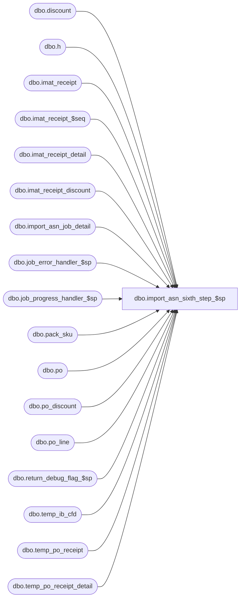

# dbo.import_asn_sixth_step_$sp

**Database:** me_01  
**Server:** bedrockdb02  

## Architecture Diagram



## Table Dependencies

| Referenced Table |
|---|
| dbo.discount |
| dbo.h |
| dbo.imat_receipt |
| dbo.imat_receipt_$seq |
| dbo.imat_receipt_detail |
| dbo.imat_receipt_discount |
| dbo.import_asn_job_detail |
| dbo.job_error_handler_$sp |
| dbo.job_progress_handler_$sp |
| dbo.pack_sku |
| dbo.po |
| dbo.po_discount |
| dbo.po_line |
| dbo.return_debug_flag_$sp |
| dbo.temp_ib_cfd |
| dbo.temp_po_receipt |
| dbo.temp_po_receipt_detail |

## Stored Procedure Code

```sql
CREATE PROCEDURE [dbo].[import_asn_sixth_step_$sp]
	(@job_id INT, @debug_flag BIT)

AS

/*
	Version		: 1.00
	Created		: 2010/09/28
	Created by	: Pierrette Lemay
	Description	: This procedure is part of the import ASN process,
				  it executes the sixth transaction of the import ASN for the job that is passed as an in parameter when
				  parameter_im.gen_po_receipt_for_asn_flag and parameter_system.installed_invmtch_flag are set to 1.
				  Some po_receipt documents were created previously for the currently processed job in step #2 and some of them were
				  state_no = 2; this procedure represents step #6: notify IMAT for the PO Receipt documents Received.

	Date		developer	defect/description
	2014/07/25	Feng		ME5.0.FT62701.Wholesale Integration (In-transit inventory) UC008 – Generate ASN Receipts - ASN Import Via Pipeline  & XML Coding
							table po_receipt: added shipped_date, track_in_transit_flag, discrepancy_posted
							table po_receipt_detail: added units_shipped
							vendor table asn_auto_receive_flag does not used anymore, which has been replaced by track_in_transit_flag and combined with asn_auto_generate_po_rcpt_status (1-Preliminary, 2-Shipped, 3-Received)
							if track_in_transit_flag = false, asn_auto_generate_po_rcpt_status could only have value 1 (Preliminary) or 3 (Received).
							Therefore there is possibility shipped receipt got auto generated. Only Received PO Receipt will update IMAT.
							Modify where is refering temp_ib_cfd with state_no = 2.

	2014/09/11	Feng		81022 PO receipt auto-generated in received status from ASN Import - pipeline. Receipt details (received units, damaged units) cannot be modified. save generates a system error.
							The cause of the system error was due to imat_receipt did not get updated while generate Received receipts in the cases:

							If the ASN import from pipeline includes only 1 sku, I CANNOT modify the auto-generated receipt quantities.
							If the ASN import from pipeline includes only 1 pack, I CANNOT modify the auto-generated receipt quantities.
							If the ASN import from pipeline includes multiple skus (no packs), I CANNOT modify the auto-generated receipt quantities.

							If the ASN import from pipeline includes a mix of packs & skus, I CAN modify the auto-generated receipt quantities.

							The problem existed since 43R2, recently (aug. 15 2014) reported in 43R3 153465/SR 153464. Have e-mailed to Anne in case stability team
							need to port back the fixes.

*/

BEGIN
	DECLARE @line_id SMALLINT, @job_type TINYINT, @proc_name NVARCHAR(30), @sql_err_num DECIMAL(38,0), @c_true BIT, @c_false BIT,
			@table_name NVARCHAR(30), @operation_name NVARCHAR(30), @error_msg NVARCHAR(2000), @return_flag BIT, @seq_count INT,
			@from_new_id INT, @to_new_id INT, @temp_imat_count INT, @sixth_step TINYINT, @n_retry tinyint, @delay NCHAR(8);

	SELECT @job_type = 10
		, @proc_name = N'import_asn_sixth_step_$sp'
		, @c_false	 = 0
		, @c_true	 = 1
		, @line_id	 = 10
		, @sixth_step	= 6
		, @n_retry		= 0
		, @delay		= N'00:00:05';

	IF NOT object_id(N'tempdb..#imat_receipt') IS NULL
		DROP TABLE #imat_receipt;

	CREATE TABLE #imat_receipt
		(imat_receipt_id [int] NOT NULL,
		receipt_id [decimal](12, 0) NOT NULL,
		transaction_type [tinyint] NOT NULL,
		vendor_id [decimal](12, 0) NOT NULL,
		location_id [smallint] NOT NULL,
		currency_id [decimal](12, 0) NULL,
		po_no [nvarchar](20) NULL,
		status [tinyint] NOT NULL,
		match_status_code [smallint] NOT NULL,
		exchange_rate [float] NOT NULL,
		original_gross_amount [decimal](14, 2) NOT NULL,
		original_net_amount [decimal](14, 2) NOT NULL,
		gross_transaction_amount [decimal](14, 2) NOT NULL,
		net_transaction_amount [decimal](14, 2) NOT NULL,
		gross_matched_amount [decimal](14, 2) NOT NULL,
		net_matched_amount [decimal](14, 2) NOT NULL,
		summary_level_match [bit] NOT NULL,
		total_units [int] NOT NULL,
		last_item_id [decimal](12, 0) NULL,
		updatestamp [int] NOT NULL,
		im_document_status [smallint] NULL,
		transaction_date [smalldatetime] NULL);

	IF NOT object_id(N'tempdb..#imat_receipt_detail') IS NULL
		DROP TABLE #imat_receipt_detail;

	CREATE TABLE #imat_receipt_detail
		(imat_receipt_detail_id decimal(14) NOT NULL,
		imat_receipt_id int NOT NULL,
		receipt_detail_id decimal(13) NOT NULL,
		units_received int NOT NULL,
		gross_unit_price decimal(14,2) NOT NULL,
		net_unit_price decimal(14,2) NOT NULL,
		units_matched int NOT NULL,
		units_damaged int NULL);

	IF NOT object_id(N'tempdb..#imat_receipt_discount') IS NULL
		DROP TABLE #imat_receipt_discount;

	CREATE TABLE #imat_receipt_discount
		(imat_receipt_discount_id decimal(13) NOT NULL,
		imat_receipt_id int NOT NULL,
		discount_id smallint NOT NULL,
		sequence_no int NOT NULL,
		item_specific_discount_flag bit NOT NULL,
		percent_amount tinyint NOT NULL,
		discount_value float NOT NULL,
		calculate_on tinyint NOT NULL,
		reflect_in_discount_cost_flag bit NOT NULL,
		reflect_in_net_cost_flag bit NOT NULL,
		subject_to_terms_flag bit NOT NULL,
		discount_amount decimal(14,2) NOT NULL);

BEGIN TRY
		-- For PO Receipt state Received (state_no = 2)
		INSERT INTO #imat_receipt
		   (imat_receipt_id, receipt_id, transaction_type, vendor_id, location_id, currency_id, po_no, status, match_status_code,
		   exchange_rate, original_gross_amount, original_net_amount, gross_transaction_amount, net_transaction_amount, gross_matched_amount,
		   net_matched_amount, summary_level_match, total_units, last_item_id, updatestamp, im_document_status, transaction_date)
		SELECT ROW_NUMBER() OVER(ORDER BY r.po_receipt_id), r.po_receipt_id, 1 transaction_type, p.vendor_id, r.location_id,
			p.currency_id, p.po_no, 0 status, 2 match_status, p.exchange_rate,
			a.total_gross_price AS original_gross_amount,
			a.total_net_price AS original_net_amount,
			a.total_gross_price AS gross_transaction_amount,
			a.total_net_price AS net_transaction_amount,
			0 gross_matched_amount, 0 net_matched_amount, 0 summary_level_match,
			a.total_units AS total_units, 0 last_item_id,
			1 updatestamp, r.document_status, r.receive_date
		FROM temp_po_receipt r, po p ,
					(
						SELECT b.po_receipt_id, SUM(b.total_units) AS total_units, SUM(b.total_gross_price) AS total_gross_price, SUM(b.total_net_price) AS total_net_price
						FROM (
								SELECT r.po_receipt_id, pl.po_line_id,
										SUM(rd.units_received) total_units,
										SUM(rd.units_received * pl.first_cost) total_gross_price,
										SUM(rd.units_received * pl.net_cost) total_net_price
								FROM temp_po_receipt r WITH (NOLOCK), temp_po_receipt_detail rd WITH (NOLOCK), po_line pl WITH (NOLOCK)
								WHERE r.job_id = @job_id
								AND r.state_no = 2
								AND r.job_id = rd.job_id
								AND r.po_receipt_id = rd.po_receipt_id
								AND rd.pack_id IS NULL
								AND r.po_id = pl.po_id
								AND rd.style_color_id = pl.style_color_id
								GROUP BY r.po_receipt_id, pl.po_line_id
								UNION ALL
								SELECT r.po_receipt_id, pl.po_line_id,
										rd.units_received AS total_units, -- found it is using pack units instead of (rd.units_received * ps.sku_quantity), verified with Rosa/Theresa it is not in the IMAT requirement, it may be a field has not been used. Leave it as it was.
										(rd.units_received * ps.sku_quantity * pl.first_cost) total_gross_price,
										(rd.units_received * ps.sku_quantity * pl.net_cost) total_net_price
								FROM temp_po_receipt r WITH (NOLOCK), temp_po_receipt_detail rd WITH (NOLOCK), po_line pl WITH (NOLOCK),  pack_sku ps WITH (NOLOCK)
								WHERE r.job_id =@job_id
								AND r.state_no = 2
								AND r.job_id = rd.job_id
								AND r.po_receipt_id = rd.po_receipt_id
								AND rd.sku_id IS NULL
								AND r.po_id = pl.po_id
								AND rd.po_line_id = pl.po_line_id
								AND rd.pack_id = pl.pack_id
								AND pl.pack_id = ps.pack_id
							) b
						GROUP BY b.po_receipt_id

					 ) a

					where a.po_receipt_id = r.po_receipt_id and r.po_id = p.po_id

		SET @temp_imat_count = @@ROWCOUNT;

		-- Log progress if job_params.debug_flag is true OR job_header.debug_flag is true
		EXEC return_debug_flag_$sp @job_type, @return_flag OUT
		IF (@return_flag = @c_true OR @debug_flag = @c_true)
			EXEC job_progress_handler_$sp @job_type, @job_id, @proc_name, @line_id;

		SET @line_id = 20
		-- Need to reserve a range of imat_receipt_id in imat_receipt_$seq
		BEGIN TRAN
				select @seq_count = COUNT(*) from imat_receipt_$seq with (TABLOCKX) WHERE dummycol = 0;

				IF @seq_count > 0
					DELETE FROM imat_receipt_$seq WHERE dummycol = 0;

				INSERT INTO imat_receipt_$seq (dummycol) VALUES (0);

				SELECT @from_new_id = COALESCE(imat_receipt_seq_id, 1) FROM imat_receipt_$seq WHERE dummycol = 0;

				DELETE FROM imat_receipt_$seq WHERE dummycol = 0;

				SET IDENTITY_INSERT imat_receipt_$seq ON
				  INSERT INTO imat_receipt_$seq (imat_receipt_seq_id, dummycol)
				  SELECT @from_new_id - 1 + @temp_imat_count, 0;
				SET IDENTITY_INSERT imat_receipt_$seq OFF

				DELETE FROM imat_receipt_$seq WHERE dummycol = 0;
		COMMIT TRAN

		-- Log progress if job_params.debug_flag is true OR job_header.debug_flag is true
		EXEC return_debug_flag_$sp @job_type, @return_flag OUT
		IF (@return_flag = @c_true OR @debug_flag = @c_true)
			EXEC job_progress_handler_$sp @job_type, @job_id, @proc_name, @line_id;

		SET @line_id = 30;

		UPDATE #imat_receipt
		SET imat_receipt_id = @from_new_id - 1 + imat_receipt_id;

		-- Log progress if job_params.debug_flag is true OR job_header.debug_flag is true
		EXEC return_debug_flag_$sp @job_type, @return_flag OUT
		IF (@return_flag = @c_true OR @debug_flag = @c_true)
			EXEC job_progress_handler_$sp @job_type, @job_id, @proc_name, @line_id;

		SET @line_id = 40;

		INSERT INTO #imat_receipt_detail
			(imat_receipt_detail_id, imat_receipt_id, receipt_detail_id, units_received,
			gross_unit_price, net_unit_price, units_matched, units_damaged)
		SELECT  CONVERT(DECIMAL(14), T.imat_receipt_id) * 10000 + (ROW_NUMBER() OVER(PARTITION BY T.imat_receipt_id ORDER BY T.imat_receipt_id ASC)),
			T.imat_receipt_id, T.po_receipt_detail_id,
			T.units_received, T.gross_unit_price, T.net_unit_price,
			0 units_matched, NULL units_damaged
		FROM (SELECT i.imat_receipt_id, rd.po_receipt_detail_id,
				rd.units_received, pl.first_cost gross_unit_price, pl.net_cost net_unit_price
			FROM temp_po_receipt r WITH (NOLOCK), temp_po_receipt_detail rd WITH (NOLOCK), po_line pl WITH (NOLOCK), #imat_receipt i WITH (NOLOCK)
			WHERE r.job_id = @job_id
			AND r.state_no = 2
			AND r.job_id = rd.job_id
			AND r.po_receipt_id = rd.po_receipt_id
			AND r.po_receipt_id = i.receipt_id
			AND r.po_id = pl.po_id
			AND rd.po_line_id = pl.po_line_id
			AND rd.pack_id IS NULL
			AND rd.style_color_id = pl.style_color_id
			UNION
			SELECT ir.imat_receipt_id, rd.po_receipt_detail_id,
				rd.units_received, SUM(ps.sku_quantity * pl.first_cost) AS gross_unit_price,
				SUM(ps.sku_quantity * pl.net_cost) AS net_unit_price
			FROM temp_po_receipt r WITH (NOLOCK), temp_po_receipt_detail rd WITH (NOLOCK), po_line pl WITH (NOLOCK), #imat_receipt ir WITH (NOLOCK), pack_sku ps WITH (NOLOCK)
			WHERE r.job_id = @job_id
			AND r.state_no = 2
			AND r.job_id = rd.job_id
			AND r.po_receipt_id = rd.po_receipt_id
			AND r.po_receipt_id = ir.receipt_id
			AND r.po_id = pl.po_id
			AND rd.sku_id IS NULL
			AND rd.pack_id = pl.pack_id
			AND rd.po_line_id = pl.po_line_id
			AND pl.pack_id = ps.pack_id
			GROUP BY ir.imat_receipt_id, rd.po_receipt_detail_id, rd.units_received) T
		ORDER BY 1;

		-- Log progress if job_params.debug_flag is true OR job_header.debug_flag is true
		EXEC return_debug_flag_$sp @job_type, @return_flag OUT
		IF (@return_flag = @c_true OR @debug_flag = @c_true)
			EXEC job_progress_handler_$sp @job_type, @job_id, @proc_name, @line_id;

		SET @line_id = 50;

		UPDATE h
		SET last_item_id = T.max_id
		FROM #imat_receipt h,
			(SELECT imat_receipt_id, COUNT(*) max_id FROM #imat_receipt_detail d GROUP BY imat_receipt_id) T
		WHERE h.imat_receipt_id = T.imat_receipt_id;

		-- Log progress if job_params.debug_flag is true OR job_header.debug_flag is true
		EXEC return_debug_flag_$sp @job_type, @return_flag OUT
		IF (@return_flag = @c_true OR @debug_flag = @c_true)
			EXEC job_progress_handler_$sp @job_type, @job_id, @proc_name, @line_id;

		SET @line_id = 60;

		INSERT INTO #imat_receipt_discount
				(imat_receipt_discount_id, imat_receipt_id, discount_id, sequence_no, item_specific_discount_flag, percent_amount, discount_value,
				calculate_on, reflect_in_discount_cost_flag, reflect_in_net_cost_flag, subject_to_terms_flag, discount_amount)
		SELECT t.imat_receipt_id * 10000 + t.last_item_id + (ROW_NUMBER() OVER(PARTITION BY t.imat_receipt_id ORDER BY t.imat_receipt_id ASC)),
			t.imat_receipt_id, d.discount_id, pd.sequence, 0 item_specific_discount_flag, pd.pct_amt, pd.discount_value, pd.calculate_on,
			d.reflect_discount_in_cost_flag, d.reflect_in_net_cost_flag, pd.subject_to_terms_flag, SUM(cfd.extended_cost)
		FROM temp_po_receipt r, #imat_receipt t, po_discount pd, discount d, temp_ib_cfd cfd
		WHERE r.job_id = @job_id
		AND r.state_no = 2 -- 2 = received status, only received status may update iMAT
		AND r.po_receipt_id = t.receipt_id
		AND r.po_id = pd.po_id
		AND pd.discount_id = d.discount_id
		AND r.job_id = cfd.job_id
		AND r.document_no = cfd.document_number
		AND d.discount_id = cfd.cost_factor_discount_id
		AND cfd.transaction_type_code = 292
		GROUP BY t.last_item_id, t.imat_receipt_id, d.discount_id,
			pd.sequence, pd.pct_amt, pd.discount_value, pd.calculate_on, d.reflect_discount_in_cost_flag,
			d.reflect_in_net_cost_flag, pd.subject_to_terms_flag;

		-- Log progress if job_params.debug_flag is true OR job_header.debug_flag is true
		EXEC return_debug_flag_$sp @job_type, @return_flag OUT
		IF (@return_flag = @c_true OR @debug_flag = @c_true)
			EXEC job_progress_handler_$sp @job_type, @job_id, @proc_name, @line_id;

		SET @line_id = 70;

		UPDATE h
		SET last_item_id = last_item_id + T.cnt
		FROM #imat_receipt h,
			(SELECT imat_receipt_id, COUNT(*) cnt FROM #imat_receipt_discount d GROUP BY imat_receipt_id) T
		WHERE h.imat_receipt_id = T.imat_receipt_id;

		-- Log progress if job_params.debug_flag is true OR job_header.debug_flag is true
		EXEC return_debug_flag_$sp @job_type, @return_flag OUT
		IF (@return_flag = @c_true OR @debug_flag = @c_true)
			EXEC job_progress_handler_$sp @job_type, @job_id, @proc_name, @line_id;

		SET @line_id = 80;

		step_6:
		BEGIN TRY
			BEGIN TRAN

			-- INSERT INTO IMAT tables
			INSERT INTO imat_receipt
			   (imat_receipt_id , receipt_id, transaction_type, vendor_id, location_id, currency_id, po_no, status, match_status_code,
			   exchange_rate, original_gross_amount, original_net_amount, gross_transaction_amount, net_transaction_amount, gross_matched_amount,
			   net_matched_amount, summary_level_match, total_units, last_item_id, updatestamp, im_document_status, transaction_date)
			SELECT imat_receipt_id , receipt_id, transaction_type, vendor_id, location_id, currency_id, po_no, status, match_status_code,
			   exchange_rate, original_gross_amount, original_net_amount, gross_transaction_amount, net_transaction_amount, gross_matched_amount,
			   net_matched_amount, summary_level_match, total_units, last_item_id, updatestamp, im_document_status, transaction_date
			FROM #imat_receipt
			ORDER BY imat_receipt_id;

			INSERT INTO imat_receipt_detail
				(imat_receipt_detail_id, imat_receipt_id, receipt_detail_id, units_received, gross_unit_price, net_unit_price, units_matched, units_damaged)
			SELECT imat_receipt_detail_id, imat_receipt_id, receipt_detail_id, units_received, gross_unit_price, net_unit_price, units_matched, units_damaged
			FROM #imat_receipt_detail
			ORDER BY imat_receipt_detail_id, imat_receipt_id;

			INSERT INTO imat_receipt_discount
				(imat_receipt_discount_id, imat_receipt_id, discount_id, sequence_no, item_specific_discount_flag, percent_amount, discount_value,
				calculate_on, reflect_in_discount_cost_flag, reflect_in_net_cost_flag, subject_to_terms_flag, discount_amount)
			SELECT imat_receipt_discount_id, imat_receipt_id, discount_id, sequence_no, item_specific_discount_flag, percent_amount, discount_value,
				calculate_on, reflect_in_discount_cost_flag, reflect_in_net_cost_flag, subject_to_terms_flag, discount_amount
			FROM #imat_receipt_discount
			ORDER BY imat_receipt_discount_id, imat_receipt_id, discount_id;

			-- Keep track of this job_step completed in job_detail
			INSERT INTO import_asn_job_detail
				 (job_id, job_step_id, time_stamp)
			VALUES (@job_id, 6, GETDATE());

			COMMIT TRAN

			-- Log progress if job_params.debug_flag is true OR job_header.debug_flag is true
			EXEC return_debug_flag_$sp @job_type, @return_flag OUT
			IF (@return_flag = @c_true OR @debug_flag = @c_true)
				EXEC job_progress_handler_$sp @job_type, @job_id, @proc_name, @line_id;
		END TRY

		BEGIN CATCH
			SELECT @error_msg = N'Error ' + CAST(ERROR_NUMBER() AS NVARCHAR(20)) + N' : in the sixth step of job #%i after 3 retries because of ' + ERROR_MESSAGE();

			IF @@TRANCOUNT <> 0
				ROLLBACK TRANSACTION;

			SET @n_retry = @n_retry + 1

			IF @n_retry <= 3
			BEGIN
				WAITFOR DELAY @delay
				GOTO step_6
			END
			ELSE
				RAISERROR (@error_msg,
						16, -- Severity.
						1, -- State.
						@job_id)
		END CATCH
END TRY

BEGIN CATCH
		SELECT @error_msg		= ERROR_MESSAGE()
			 , @sql_err_num		= ERROR_NUMBER()

		IF @@TRANCOUNT <> 0
			ROLLBACK TRANSACTION

		IF @line_id = 10
			SELECT  @table_name			= N'#imat_receipt'
					, @operation_name	= N'INSERT'
		ELSE IF @line_id = 20
			SELECT  @table_name			= N'imat_receipt_$seq'
					, @operation_name	= N'INSERT'
		ELSE IF @line_id = 30
			SELECT  @table_name			= N'#imat_receipt'
					, @operation_name	= N'UPDATE'
		ELSE IF @line_id = 40
			SELECT  @table_name			= N'#imat_receipt_detail'
					, @operation_name	= N'INSERT'
		ELSE IF @line_id = 50
			SELECT  @table_name			= N'#imat_receipt'
					, @operation_name	= N'UPDATE'
		ELSE IF @line_id = 60
			SELECT  @table_name			= N'#imat_receipt_discount'
					, @operation_name	= N'INSERT'
		ELSE IF @line_id = 70
			SELECT  @table_name			= N'#imat_receipt'
					, @operation_name	= N'UPDATE'
		ELSE IF @line_id = 80
			SELECT  @table_name			= N'imat_receipt'
					, @operation_name	= N'INSERT'

		EXEC job_error_handler_$sp
					@job_type
					, @job_id
					, @proc_name
					, @line_id
					, @sql_err_num
					, @table_name
					, @operation_name
					, @error_msg
					, @c_true

	END CATCH
END
```

