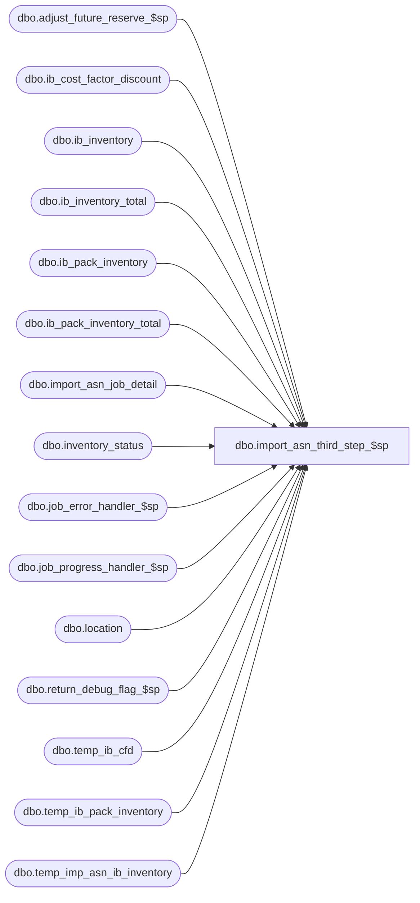

# dbo.import_asn_third_step_$sp

**Database:** me_01  
**Server:** bedrockdb02  

## Architecture Diagram



## Table Dependencies

| Referenced Table |
|---|
| dbo.adjust_future_reserve_$sp |
| dbo.ib_cost_factor_discount |
| dbo.ib_inventory |
| dbo.ib_inventory_total |
| dbo.ib_pack_inventory |
| dbo.ib_pack_inventory_total |
| dbo.import_asn_job_detail |
| dbo.inventory_status |
| dbo.job_error_handler_$sp |
| dbo.job_progress_handler_$sp |
| dbo.location |
| dbo.return_debug_flag_$sp |
| dbo.temp_ib_cfd |
| dbo.temp_ib_pack_inventory |
| dbo.temp_imp_asn_ib_inventory |

## Stored Procedure Code

```sql
CREATE PROCEDURE [dbo].[import_asn_third_step_$sp]
  (@job_id INT, @debug_flag BIT)

AS
/*
  Version		: 1.00
  Created		: 2010/09/28
  Created by	: Pierrette Lemay
  Description	: This procedure is part of the import ASN process,
          it executes the third transaction of the import ASN for the job that is passed as an in parameter.

        -- Third Step: If parameter_im.gen_po_receipt_for_asn_flag is ON
              -- For the po_receipt just created that are linked to an auto-receive vendor:
        -- UPDATE IB
            -- ib_inventory, entries are created for transaction type 200 (receipt) and inventory status 2 (in-transit)
            -- Insert/Update new transactions in ib_inventory_total
            -- Insert transaction 290 and 292 into ib_cost_factor_discount
            -- Insert third step into import_asn_job_detail

      Rule added: If the auto-generated/received PO receipt includes packs AND the receiving location has warehousing system flag = true
      then ib_pack_inventory & ib_pack_inventory_total should post the pack quantities received.
  Defect #125698  : If deadlock happened previously and we're re-processing the same job_id, prevent ib_pack_inventory to be updated with the wrong document_number.
*/

BEGIN
  DECLARE @line_id SMALLINT, @job_type TINYINT, @proc_name NVARCHAR(30), @sql_err_num DECIMAL(38,0),
      @table_name NVARCHAR(30), @operation_name NVARCHAR(30), @error_msg NVARCHAR(2000), @return_flag BIT,
      @third_step TINYINT, @c_true BIT, @c_false BIT, @n_retry tinyint, @delay NCHAR(8);

  SELECT @job_type	= 10
    , @proc_name	= N'import_asn_third_step_$sp'
    , @line_id		= 10
    , @c_false		= 0
    , @c_true		= 1
    , @third_step	= 3
    , @n_retry		= 0
    , @delay		= N'00:00:05';

  step_3:
  BEGIN TRY
    BEGIN TRAN

    INSERT INTO ib_inventory
      ( sku_id
      , location_id
      , price_status_id
      , transaction_date
      , transaction_type_code
      , inventory_status_id
      , document_number
      , transaction_units
      , transaction_cost
      , transaction_valuation_retail
      , transaction_selling_retail
      , transaction_cost_local)
    SELECT sku_id
      , location_id
      , price_status_id
      , transaction_date
      , transaction_type_code
      , inventory_status_id
      , document_number
      , transaction_units
      , transaction_cost
      , transaction_valuation_retail
      , transaction_selling_retail
      ,transaction_cost_local
    FROM temp_imp_asn_ib_inventory WITH (NOLOCK)
    WHERE job_id = @job_id
    ORDER BY sku_id, location_id, price_status_id, transaction_date, document_number;

    -- Log progress if job_params.debug_flag is true OR job_header.debug_flag is true
    EXEC return_debug_flag_$sp @job_type, @return_flag OUT
    IF (@return_flag = @c_true OR @debug_flag = @c_true)
      EXEC job_progress_handler_$sp @job_type, @job_id, @proc_name, @line_id;

    SET @line_id = 20;

    UPDATE I
    SET I.price_status_id = B.price_status_id
      , I.total_on_hand_units = I.total_on_hand_units + B.total_on_hand_units
      , I.total_on_hand_cost	= I.total_on_hand_cost + B.total_on_hand_cost
      , I.total_on_hand_valuation_retail = I.total_on_hand_valuation_retail + B.total_on_hand_valuation_retail
      , I.total_on_hand_selling_retail = I.total_on_hand_selling_retail + B.total_on_hand_selling_retail
      , I.total_on_hand_cost_local = I.total_on_hand_cost_local + B.total_on_hand_cost_local
    FROM ib_inventory_total I WITH (NOLOCK),
        ( SELECT A.sku_id
          , A.location_id
          , A.inventory_status_id
          , U.price_status_id
          , SUM(A.transaction_units) total_on_hand_units
          , SUM(A.transaction_cost) total_on_hand_cost
          , SUM(A.transaction_valuation_retail) total_on_hand_valuation_retail
          , SUM(A.transaction_selling_retail) total_on_hand_selling_retail
          , SUM(A.transaction_cost_local) total_on_hand_cost_local
        FROM temp_imp_asn_ib_inventory A WITH (NOLOCK),
          ( SELECT DISTINCT tmp.sku_id, tmp.location_id, tmp.price_status_id
            FROM temp_imp_asn_ib_inventory tmp WITH (NOLOCK),
            ( SELECT sku_id, location_id, max(transaction_date) max_date
              FROM temp_imp_asn_ib_inventory WITH (NOLOCK)
              WHERE job_id = @job_id
              GROUP BY sku_id, location_id) T
            WHERE tmp.job_id = @job_id
            AND tmp.sku_id = T.sku_id
            AND tmp.location_id = T.location_id
            AND tmp.transaction_date = T.max_date) U
        WHERE A.job_id = @job_id
        AND A.sku_id = U.sku_id
        AND A.location_id = U.location_id
        GROUP BY A.sku_id, A.location_id, A.inventory_status_id, U.price_status_id) B
    WHERE I.sku_id		= B.sku_id
    AND I.location_id	= B.location_id
    AND I.inventory_status_id =  B.inventory_status_id;

    -- Log progress if job_params.debug_flag is true OR job_header.debug_flag is true
    EXEC return_debug_flag_$sp @job_type, @return_flag OUT
    IF (@return_flag = @c_true OR @debug_flag = @c_true)
      EXEC job_progress_handler_$sp @job_type, @job_id, @proc_name, @line_id;

    SET @line_id = 30;

    INSERT INTO ib_inventory_total
      (sku_id
      , location_id
      , inventory_status_id
      , price_status_id
      , total_on_hand_units
      , total_on_hand_cost
      , total_on_hand_valuation_retail
      , total_on_hand_selling_retail
      , total_on_hand_cost_local)
    SELECT A.sku_id
      , A.location_id
      , A.inventory_status_id
      , U.price_status_id
      , SUM(A.transaction_units) total_on_hand_units
      , SUM(A.transaction_cost) total_on_hand_cost
      , SUM(A.transaction_valuation_retail) total_on_hand_valuation_retail
      , SUM(A.transaction_selling_retail) total_on_hand_selling_retail
      , SUM(A.transaction_cost_local) total_on_hand_cost_local
    FROM temp_imp_asn_ib_inventory A WITH (NOLOCK),
      ( SELECT DISTINCT tmp.sku_id, tmp.location_id, tmp.price_status_id
        FROM temp_imp_asn_ib_inventory tmp WITH (NOLOCK),
        ( SELECT sku_id, location_id, max(transaction_date) max_date
          FROM temp_imp_asn_ib_inventory WITH (NOLOCK)
          WHERE job_id = @job_id
          GROUP BY sku_id, location_id) T
        WHERE tmp.job_id = @job_id
        AND tmp.sku_id = T.sku_id
        AND tmp.location_id = T.location_id
        AND tmp.transaction_date = T.max_date) U
    WHERE A.job_id = @job_id
    AND A.sku_id = U.sku_id
    AND A.location_id = U.location_id
    AND NOT EXISTS (SELECT 1 FROM ib_inventory_total i WITH (NOLOCK)
              WHERE i.sku_id = A.sku_id
              AND   i.location_id = A.location_id
              AND   i.inventory_status_id = A.inventory_status_id)
    GROUP BY A.sku_id, A.location_id, A.inventory_status_id, U.price_status_id;

    -- Log progress if job_params.debug_flag is true OR job_header.debug_flag is true
    EXEC return_debug_flag_$sp @job_type, @return_flag OUT
    IF (@return_flag = @c_true OR @debug_flag = @c_true)
      EXEC job_progress_handler_$sp @job_type, @job_id, @proc_name, @line_id;

    DECLARE @Available_Status_Id SMALLINT = (SELECT inventory_status_id FROM inventory_status WHERE inventory_status_code = '001')

    IF OBJECT_ID (N'tempdb.dbo.#temp_available_units_adjusted',  N'U') IS NOT NULL
    BEGIN

      DROP TABLE dbo.#temp_available_units_adjusted

    END

    CREATE TABLE dbo.#temp_available_units_adjusted
      (
        sku_id DECIMAL(13, 0)
        ,location_id SMALLINT
        ,available_units_adjusted INT
        ,PRIMARY KEY (sku_id, location_id)
      )

    INSERT INTO dbo.#temp_available_units_adjusted
      (
        sku_id
        ,location_id
        ,available_units_adjusted
      )
    SELECT
      T.sku_id
      ,T.location_id
      ,SUM(transaction_units) total_on_hand_units
    FROM
      temp_imp_asn_ib_inventory T
    INNER JOIN location L ON L.location_id = T.location_id
    WHERE
      T.job_id = @job_id
      AND T.inventory_status_id = @Available_Status_Id
      AND L.warehouse_system_flag = 0
    GROUP BY
      T.sku_id
      ,T.location_id

    EXEC dbo.adjust_future_reserve_$sp

    SET @line_id = 40
    -- Maintain ib_pack_inventory
    INSERT INTO ib_pack_inventory
           (pack_id
           ,location_id
           ,transaction_date
           ,transaction_type_code
           ,other_location_id
           ,document_number
           ,transaction_units
           ,distribution_id)
        SELECT pack_id
           , location_id
           , transaction_date
           , 1200 transaction_type_code
           , NULL other_location_id
           , document_number
           , transaction_units
           , NULL distribution_id
       FROM temp_ib_pack_inventory
       WHERE job_id = @job_id;

    -- Log progress if job_params.debug_flag is true OR job_header.debug_flag is true
    EXEC return_debug_flag_$sp @job_type, @return_flag OUT
    IF (@return_flag = @c_true OR @debug_flag = @c_true)
      EXEC job_progress_handler_$sp @job_type, @job_id, @proc_name, @line_id;

    SET @line_id = 50

    UPDATE i
    SET total_on_hand_units = i.total_on_hand_units + T.transaction_units
    FROM ib_pack_inventory_total i,
      ( SELECT pack_id, location_id, SUM(transaction_units) transaction_units
        FROM temp_ib_pack_inventory
        WHERE job_id = @job_id
        GROUP BY pack_id, location_id) T
    WHERE i.pack_id = T.pack_id
    AND i.location_id = T.location_id;

    -- Log progress if job_params.debug_flag is true OR job_header.debug_flag is true
    EXEC return_debug_flag_$sp @job_type, @return_flag OUT
    IF (@return_flag = @c_true OR @debug_flag = @c_true)
      EXEC job_progress_handler_$sp @job_type, @job_id, @proc_name, @line_id;

    SET @line_id = 55

    INSERT INTO ib_pack_inventory_total
      (pack_id, location_id, total_on_hand_units)
    SELECT t.pack_id, t.location_id, SUM(t.transaction_units)
    FROM temp_ib_pack_inventory t
    WHERE job_id = @job_id
    AND NOT EXISTS (
        SELECT 1
        FROM ib_pack_inventory_total i
        WHERE i.pack_id = t.pack_id
        AND i.location_id = t.location_id)
    GROUP BY t.pack_id, t.location_id;

    -- Log progress if job_params.debug_flag is true OR job_header.debug_flag is true
    EXEC return_debug_flag_$sp @job_type, @return_flag OUT
    IF (@return_flag = @c_true OR @debug_flag = @c_true)
      EXEC job_progress_handler_$sp @job_type, @job_id, @proc_name, @line_id;

    SET @line_id = 60
    -- ib_cost_factor_discount: we're using data inserted in temp_ib_cfd to populate ib_cost_factor_discount

    INSERT INTO ib_cost_factor_discount
      (sku_id,
      location_id,
      transaction_date,
      transaction_type_code,
      extended_cost,
      document_number,
      cost_factor_discount_id,
      extended_cost_local)
    SELECT sku_id,
      location_id,
      transaction_date,
      transaction_type_code,
      extended_cost,
      document_number,
      cost_factor_discount_id,
      extended_cost_local
    FROM temp_ib_cfd
    WHERE job_id = @job_id;

    -- Log progress if job_params.debug_flag is true OR job_header.debug_flag is true
    EXEC return_debug_flag_$sp @job_type, @return_flag OUT
    IF (@return_flag = @c_true OR @debug_flag = @c_true)
      EXEC job_progress_handler_$sp @job_type, @job_id, @proc_name, @line_id;

    SET @line_id = 80;
    -- Keep track of this job_step completed in job_detail
    INSERT INTO import_asn_job_detail
       (job_id, job_step_id, time_stamp)
    VALUES (@job_id, @third_step, GETDATE());

    COMMIT TRAN

    -- Log progress if job_params.debug_flag is true OR job_header.debug_flag is true
    EXEC return_debug_flag_$sp @job_type, @return_flag OUT
    IF (@return_flag = @c_true OR @debug_flag = @c_true)
      EXEC job_progress_handler_$sp @job_type, @job_id, @proc_name, @line_id;

  END TRY
  BEGIN CATCH
    IF @@TRANCOUNT > 0
      ROLLBACK TRANSACTION;

    SET @n_retry = @n_retry + 1;

    IF @n_retry <= 3
    BEGIN
      WAITFOR DELAY @delay
      GOTO step_3
    END
    ELSE
    BEGIN
      SELECT @error_msg = N'Error ' + CAST(ERROR_NUMBER() AS NVARCHAR(20)) + N' : in the third step of job #%i after 3 retries because of ' + ERROR_MESSAGE(),
        @sql_err_num		= ERROR_NUMBER()

      IF @line_id = 10
        SELECT  @table_name		= N'ib_inventory'
          , @operation_name	= N'INSERT'
      ELSE IF @line_id = 20
        SELECT @table_name		= N'ib_inventory_total'
          , @operation_name	= N'UPDATE'
      ELSE IF @line_id = 30
        SELECT  @table_name		= N'ib_inventory_total'
          , @operation_name	= N'INSERT'
      ELSE IF @line_id = 40
        SELECT @table_name		= N'ib_pack_inventory'
          , @operation_name	= N'INSERT'
      ELSE IF @line_id = 50
        SELECT  @table_name		= N'ib_pack_inventory_total'
          , @operation_name	= N'UPDATE'
      ELSE IF @line_id = 60
        SELECT  @table_name		= N'ib_cost_factor_discount'
          , @operation_name	= N'INSERT'
      ELSE IF @line_id = 70
        SELECT  @table_name		= N'ib_audit_trail'
          , @operation_name	= N'INSERT'
      ELSE IF @line_id = 80
        SELECT  @table_name		= N'import_asn_job_detail'
          , @operation_name	= N'INSERT';

      EXEC job_error_handler_$sp
          @job_type
          , @job_id
          , @proc_name
          , @line_id
          , @sql_err_num
          , @table_name
          , @operation_name
          , @error_msg
          , @c_true;
    END

  END CATCH
END
```

