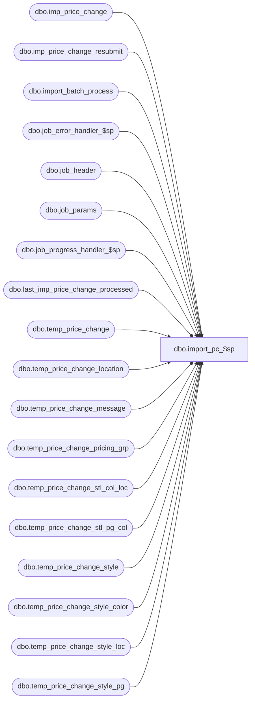

# dbo.import_pc_$sp

**Database:** me_01  
**Server:** bedrockdb02  

## Architecture Diagram



## Table Dependencies

| Referenced Table |
|---|
| dbo.imp_price_change |
| dbo.imp_price_change_resubmit |
| dbo.import_batch_process |
| dbo.job_error_handler_$sp |
| dbo.job_header |
| dbo.job_params |
| dbo.job_progress_handler_$sp |
| dbo.last_imp_price_change_processed |
| dbo.temp_price_change |
| dbo.temp_price_change_location |
| dbo.temp_price_change_message |
| dbo.temp_price_change_pricing_grp |
| dbo.temp_price_change_stl_col_loc |
| dbo.temp_price_change_stl_pg_col |
| dbo.temp_price_change_style |
| dbo.temp_price_change_style_color |
| dbo.temp_price_change_style_loc |
| dbo.temp_price_change_style_pg |

## Stored Procedure Code

```sql
CREATE PROCEDURE [dbo].[import_pc_$sp]

AS

/*
	Description	: This procedure is called by the .NET component that control the import PC process.
			  It truncate the temporary tables that will be populated during this process and creates new jobs in the job_header table of type 30.
*/

BEGIN
	DECLARE @line_id SMALLINT, @job_id INT, @job_type INT, @c_true BIT, @c_false BIT, @proc_name NVARCHAR(30), @sql_err_num DECIMAL(38,0), @debug_flag BIT,
			@table_name NVARCHAR(30), @operation_name NVARCHAR(30), @error_msg NVARCHAR(2000), @post_layaway_as_sale BIT, @job_batch_size INT, @done BIT,
			@start_imp_pc_id DECIMAL(12), @end_imp_pc_id DECIMAL(12), @min_imp_price_change_id DECIMAL(12), @max_imp_price_change_id DECIMAL(12), @last_imp_price_change_id DECIMAL(12)

	SELECT @line_id = 10,
		   @job_type = 30,
		   @job_id  = -1,
		   @proc_name = N'import_pc_$sp',
		   @done	= 0,
		   @c_true	= 1,
		   @c_false = 0;
		   
	BEGIN TRY
		-- Get posting parameters
		SELECT  @job_batch_size  = job_batch_size
		FROM job_params
		WHERE job_type = @job_type;

		-- Log progress if job_params.debug_flag is true 
		EXEC job_progress_handler_$sp @job_type, @job_id, @proc_name, @line_id, @c_false;
			
		SET @line_id = 20;
		-- Truncate temporary tables

		TRUNCATE TABLE temp_price_change;
		TRUNCATE TABLE temp_price_change_style;
		TRUNCATE TABLE temp_price_change_style_pg;
		TRUNCATE TABLE temp_price_change_style_loc;
		TRUNCATE TABLE temp_price_change_style_color;
		TRUNCATE TABLE temp_price_change_stl_pg_col;
		TRUNCATE TABLE temp_price_change_stl_col_loc;
		TRUNCATE TABLE temp_price_change_location;
		TRUNCATE TABLE temp_price_change_pricing_grp;
		TRUNCATE TABLE temp_price_change_message;
		
		-- Log progress if job_params.debug_flag is true 
		EXEC job_progress_handler_$sp @job_type, @job_id, @proc_name, @line_id, @c_false;
			
		SET @line_id = 30;
		-- Get the range of imp_price_change_id for which we need to create new jobs if required. 

		SELECT @start_imp_pc_id = MIN(i.imp_price_change_id),
			    @end_imp_pc_id = MAX(i.imp_price_change_id)
		FROM imp_price_change i, last_imp_price_change_processed l
		WHERE i.imp_price_change_id > l.imp_price_change_id
		GROUP BY l.imp_price_change_id;
		
		-- Log progress if job_params.debug_flag is true 
		EXEC job_progress_handler_$sp @job_type, @job_id, @proc_name, @line_id, @c_false;
			
		SET @line_id = 40;
		-- Get the ranges of imp_price_change_id that will be assign to a specific job until we reach the end of the queue imp_asn.
		IF (@start_imp_pc_id  <= @end_imp_pc_id) 
		BEGIN
			BEGIN TRAN;
			
			WHILE (@done = @c_false)
			BEGIN
		
				SELECT @min_imp_price_change_id = MIN(imp_price_change_id), 
					@max_imp_price_change_id = MAX(imp_price_change_id) 
				FROM imp_price_change 
				WHERE imp_price_change_id >= @start_imp_pc_id
				AND imp_price_change_id < (@start_imp_pc_id + @job_batch_size)
				
				IF (@min_imp_price_change_id IS NOT NULL)
				BEGIN
					--here are our new jobs...
					INSERT INTO job_header
						( job_type
						, range_start
						, range_end
						, batch_start
						, batch_end
						, completed_flag
						, debug_flag )
					VALUES ( @job_type
						, @min_imp_price_change_id 
						, @max_imp_price_change_id 
						, -1
						, -1
						, @c_false
						, @c_false );
						
					--these new jobs are ready to submit.
					INSERT INTO imp_price_change_resubmit (job_id, ready_to_resubmit)
					SELECT IDENT_CURRENT(N'job_header'), 1;
				END
			
				IF (@max_imp_price_change_id >= @end_imp_pc_id)
					SET @done = @c_true;
				ELSE
					SET @start_imp_pc_id = @start_imp_pc_id + @job_batch_size;
			END
			-- Log progress if job_params.debug_flag is true 
			EXEC job_progress_handler_$sp @job_type, @job_id, @proc_name, @line_id, @c_false;
			
			SET @line_id = 50;
			
			UPDATE last_imp_price_change_processed
			SET imp_price_change_id = @end_imp_pc_id;
			
			COMMIT TRAN;
		END;
		
		-- Log progress if job_params.debug_flag is true 
		EXEC job_progress_handler_$sp @job_type, @job_id, @proc_name, @line_id, @c_false;	

		SET @line_id = 60;

		-- We need to keep track of the jobs part of this process
		-- Start by deleting the previous process
		BEGIN TRAN 
		
		DELETE import_batch_process WHERE job_type = 30;
		
		--submit jobs that are ready (this is new ones, and ones that are being re-submitted by the user)
		INSERT INTO import_batch_process
			(job_type, process_date, job_id)
		SELECT 30, GETDATE(), h.job_id
		FROM job_header h join imp_price_change_resubmit r on h.job_id = r.job_id
		WHERE h.job_type = 30
		AND h.completed_flag = 0
		AND r.ready_to_resubmit = 1;
		
		--set all jobs as not ready to re-submit.
		-- we clean up the imp_price_change_resubmit once the job is sucessful, so only failed jobs will
		-- remain in this table, as not ready to resubmit.
		UPDATE imp_price_change_resubmit SET ready_to_resubmit=0;
		
		COMMIT TRAN;

		-- Log progress if job_params.debug_flag is true 
		EXEC job_progress_handler_$sp @job_type, @job_id, @proc_name, @line_id, @c_false;	


	END TRY

	BEGIN CATCH
		SELECT @error_msg		= ERROR_MESSAGE()
			 , @sql_err_num		= ERROR_NUMBER();
			 
		-- Test if the transaction is uncommittable.
		IF (XACT_STATE()) = -1
			ROLLBACK TRANSACTION

		-- Test if the transaction is active and valid.
		IF (XACT_STATE()) = 1
			COMMIT TRANSACTION
			
		IF @line_id = 10	
			SELECT  @table_name			= N'job_params'
					, @operation_name	= N'SELECT'
		ELSE IF @line_id = 20
			SELECT  @table_name			= N'temp_*'
					, @operation_name	= N'TRUNCATE'
		ELSE IF @line_id = 30
			SELECT  @table_name			= N'imp_price_change'
					, @operation_name	= N'SELECT'
		ELSE IF @line_id = 40
			SELECT  @table_name			= N'job_header'
					, @operation_name	= N'INSERT'
		ELSE IF @line_id = 50
			SELECT  @table_name			= N'last_imp_price_change_processed'
					, @operation_name	= N'UPDATE'
		ELSE IF @line_id = 60
			SELECT  @table_name			= N'import_batch_process'
					, @operation_name	= N'INSERT'
													
		EXEC job_error_handler_$sp
					@job_type 
					, @job_id 
					, @proc_name 
					, @line_id 
					, @sql_err_num 
					, @table_name 
					, @operation_name 
					, @error_msg 
					, @c_true
	END CATCH
END
```

